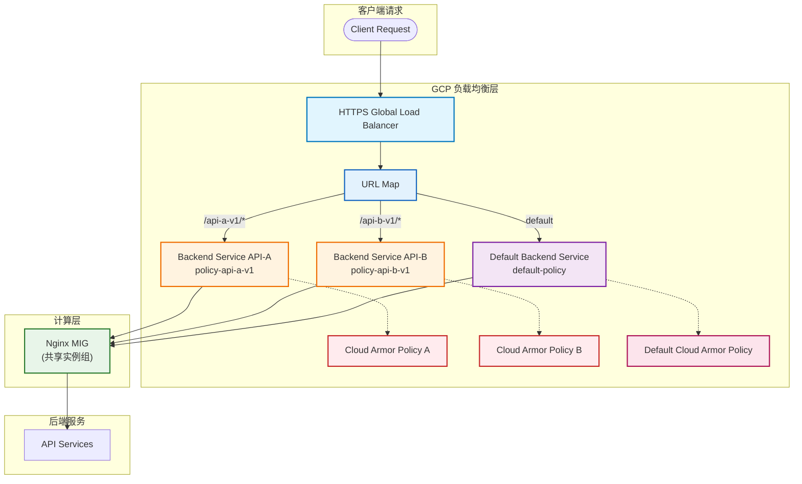

# GCP GLB API 级 Cloud Armor 隔离方案分析与实施指南

## 1. 现状分析 (Current State Analysis)

### 1.1 当前架构
- **架构**: GCP GLB (HTTPS) → Backend Service (Unified) → MIG (Nginx)
- **流量模型**: `https://www.abc.com/api-name-major-version/endpoint`
- **当前限制**: 所有 API 共享同一个 Backend Service，导致所有 API 只能使用同一套 Cloud Armor WAF 规则，无法实现差异化防护。
- reference: [gateway/no-gateway/glb-path.md](../../../gateway/no-gateway/glb-path.md)

### 1.2 核心问题
- **统一策略**: 所有 API 共享相同的 Cloud Armor Policy，无法针对不同 API 实施差异化安全策略
- **策略冲突**: 高安全要求的 API 与低安全要求的 API 策略相互影响
- **运维困难**: 无法独立管理不同 API 的安全策略

### 1.3 Cloud Armor 约束
根据 GCP 文档和实际验证，Cloud Armor 的绑定粒度如下：

| 绑定维度 | 支持情况 | 说明 |
|---|---|---|
| 绑定到 URL Path | ❌ 不支持 | 无法直接按路径绑定策略 |
| 绑定到 Host | ❌ 不支持 | 无法直接按主机名绑定策略 |
| 绑定到 Backend Service | ✅ 支持 | 策略绑定的基本单位 |
| Policy 内按 Path 匹配 | ✅ 支持 | 通过 L7 规则实现 |
| 多 Policy 同时作用于一个 Backend | ❌ 不支持 | 一个 Backend Service 只能绑定一个策略 |

## 2. 解决方案可行性验证

### 2.1 方案概述
**推荐方案**: 通过 URL Map + 多 Backend Service + 独立 Cloud Armor Policy 实现 API 级安全策略隔离

### 2.2 可行性分析
✅ **技术可行性**: 
- GCP GLB 支持 URL Map 按路径路由到不同 Backend Service
- 同一 MIG 可以被多个 Backend Service 引用
- 每个 Backend Service 可绑定独立的 Cloud Armor Policy

✅ **架构兼容性**:
- 无需修改 Nginx 配置
- 无需修改应用程序
- 保留现有基础设施

✅ **运维可行性**:
- 策略完全隔离，互不影响
- 支持独立管理和更新
- 便于故障排查和监控

### 2.3 方案优势
- **解耦性**: 不同 API 的安全策略完全隔离
- **灵活性**: 可为不同 API 定制安全策略
- **可扩展性**: 支持新增 API 时快速扩展
- **零侵入**: 对现有系统无任何影响

## 3. 详细实施方案

### 3.1 整体架构流程图



### 3.2 实施步骤

#### 步骤 1: 创建独立的 Cloud Armor 策略

为每个 API 创建独立的 Cloud Armor 策略：

```bash
# 为 API A 创建策略
gcloud compute security-policies create policy-api-a-v1 \
  --description="Cloud Armor policy for API A v1"

# 为 API B 创建策略  
gcloud compute security-policies create policy-api-b-v1 \
  --description="Cloud Armor policy for API B v1"

# 添加自定义规则（示例）
# API A: IP 白名单
gcloud compute security-policies rules create 1000 \
  --security-policy=policy-api-a-v1 \
  --expression="origin.ip=='203.0.113.0'" \
  --action=allow

# API A: 默认拒绝
gcloud compute security-policies rules create 2147483647 \
  --security-policy=policy-api-a-v1 \
  --action=deny-403
```

#### 步骤 2: 创建新的 Backend Service

创建多个 Backend Service，但都指向同一个 Nginx MIG：

```bash
# 创建 API A 的 Backend Service
gcloud compute backend-services create bs-api-a-v1 \
  --protocol=HTTP \
  --port-name=http \
  --health-checks=nginx-health-check \
  --global

# 将 Nginx MIG 添加为后端
gcloud compute backend-services add-backend bs-api-a-v1 \
  --instance-group=nginx-mig \
  --global \
  --balancing-mode=UTILIZATION \
  --max-utilization=0.8 \
  --capacity-scaler=1.0

# 绑定 Cloud Armor 策略
gcloud compute backend-services update bs-api-a-v1 \
  --security-policy=policy-api-a-v1 \
  --global
```

#### 步骤 3: 更新 URL Map 配置

配置 URL Map 将不同路径路由到相应的 Backend Service：

```bash
# 添加路径匹配器
gcloud compute url-maps add-path-matcher your-url-map \
  --path-matcher-name=api-splitter \
  --default-service=default-backend-service \
  --path-rules="/api-a-v1/*=bs-api-a-v1,/api-b-v1/*=bs-api-b-v1" \
  --global
```

### 3.3 请求处理流程

1. **客户端请求**: `https://www.abc.com/api-a-v1/users`
2. **GLB 接收**: HTTPS Global Load Balancer 接收请求
3. **URL Map 路由**: 根据路径 `/api-a-v1/*` 匹配到 `bs-api-a-v1`
4. **Cloud Armor 执行**: 在 `bs-api-a-v1` 上执行 `policy-api-a-v1` 策略
5. **转发到 MIG**: 请求转发到共享的 Nginx MIG
6. **Nginx 处理**: Nginx 按原有逻辑处理请求
7. **响应返回**: 响应按相反路径返回客户端

### 3.4 验证方法

#### 功能验证
```bash
# 验证 API A 路径是否应用了正确的策略
curl -I "https://www.abc.com/api-a-v1/health"

# 检查响应头中的安全策略信息
# 应该看到来自 policy-api-a-v1 的响应
```

#### 策略验证
```bash
# 检查 Backend Service 绑定的策略
gcloud compute backend-services describe bs-api-a-v1 --global

# 检查 Cloud Armor 日志
gcloud logging read "resource.type=http_load_balancer AND jsonPayload.enforcedSecurityPolicy.name=policy-api-a-v1" --limit 10
```

## 4. 运维与管理建议

### 4.1 命名规范
```
Backend Service: bs-{api-name}-{version}
Cloud Armor Policy: policy-{api-name}-{version}
```

### 4.2 策略设计原则
| 规则类型 | 建议位置 |
|---|---|
| IP 地址黑白名单 | Cloud Armor |
| DDoS 防护 | Cloud Armor |
| WAF 规则 | Cloud Armor |
| API 密钥认证 | Kong/Apache/Nginx |
| JWT 验证 | Kong/Apache/Nginx |
| 限流策略 | Kong 或 Cloud Armor |

### 4.3 监控与告警
- 监控各 Cloud Armor 策略的拦截率
- 设置基于错误率的告警
- 监控 Backend Service 的健康状态

## 5. 风险与注意事项

### 5.1 潜在风险
- **Backend Service 数量增长**: API 数量增加会导致 Backend Service 数量增加
- **配置复杂度**: 需要管理更多的资源配置
- **路径稳定性**: 路径规划需要保持稳定，避免频繁变更

### 5.2 注意事项
- 确保路径规则不会重叠或冲突
- 在生产环境实施前先在测试环境验证
- 准备回滚计划以应对意外情况

## 6. 总结

通过 URL Map + 多 Backend Service + 独立 Cloud Armor Policy 的方案，可以在不修改 Nginx 和应用程序的前提下，实现 API 级别的安全策略隔离。该方案充分利用了 GCP GLB 的原生能力，具有良好的解耦性和可扩展性，是实现精细化安全管控的理想选择。

该方案不仅解决了当前所有 API 共享同一套安全策略的问题，还为未来的安全策略管理提供了灵活的基础架构支持。