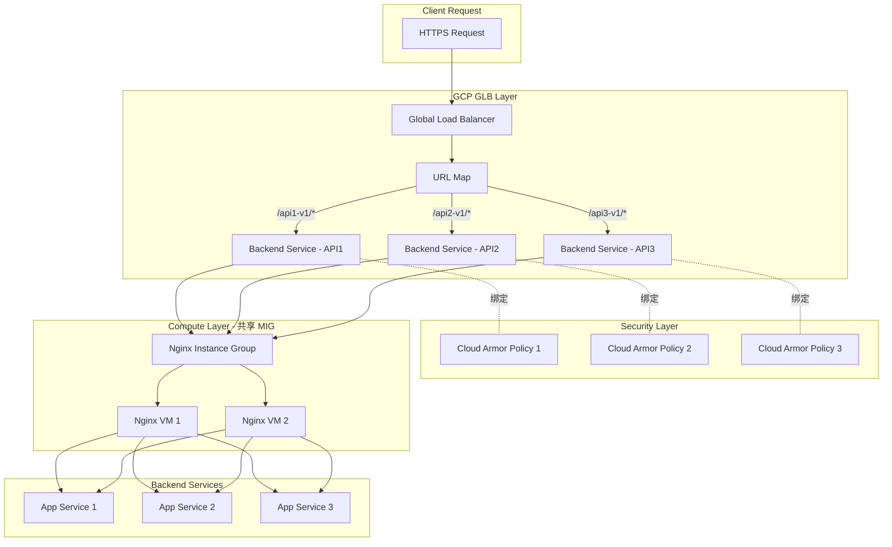
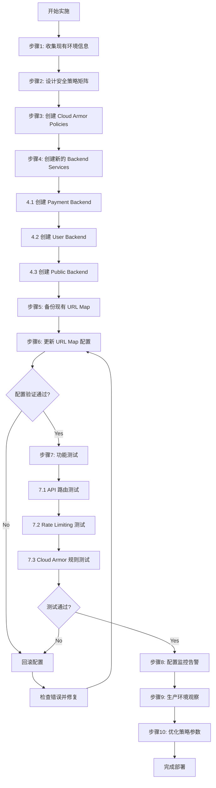

# requirement
```bash
问题分析
当前架构核心特征：
* 统一入口域名
https://www.abc.com/{api-name}-{major-version}/{endpoint}
* 入口链路
Client → GCP GLB (HTTPS) → Nginx (MIG) → 后端服务
* Cloud Armor 绑定方式
   * Cloud Armor Policy 绑定在 GLB Backend Service
   * 当前 Nginx 所在 MIG 共用一个 Backend Service
   * ⇒ 所有 API 共享同一套 Cloud Armor Policy
核心诉求：
希望不同 API 使用不同的 Cloud Armor 安全策略
不限制是否需要对现有架构做调整 一个大概的方向是。 不改 Nginx / 不改应用，通过 URL Map + 多 Backend Service + 独立 Cloud Armor Policy，实现 API 级安全策略隔离
 利用 GCP GLB 的 URL Map 分发能力，将不同 API 的流量指向不同的 Backend Service，但这些 Backend Service 共享同一个 Instance Group (Nginx)。看来这个方案是比较可行的。 那么你现在能不能基于这个基础需求来帮我实现完整的,详细步骤 ，比如说准备安全策略 创建新的 backanserver更新 URLMap等。 也就是说我现在需要一个可实施的一个具体方案。然后让我来做这样的对应的分离。
```

# GCP GLB 基于 URL Map 实现 API 级 Cloud Armor 策略隔离方案

## 问题分析

**当前架构限制**

- 所有 API 流量经过同一个 Backend Service
- Cloud Armor Policy 绑定在 Backend Service 级别
- 无法为不同 API 应用差异化安全策略

**目标架构**

- 保持 Nginx MIG 不变(共享同一个 Instance Group)
- 通过 URL Map 路径匹配分发流量到不同 Backend Service
- 每个 Backend Service 绑定独立的 Cloud Armor Policy
- 实现 API 级安全策略隔离

---

## 解决方案架构

### 流量路径变化



---

## 详细实施步骤

### 步骤 1: 环境信息收集与准备

#### 1.1 收集现有资源信息

```bash
# 设置项目 ID
export PROJECT_ID="your-project-id"
export REGION="asia-east1"  # 根据实际情况调整

# 查看现有 Load Balancer 信息
gcloud compute forwarding-rules list --project=$PROJECT_ID

# 查看现有 URL Map
gcloud compute url-maps list --project=$PROJECT_ID

# 查看现有 Backend Service
gcloud compute backend-services list --project=$PROJECT_ID

# 查看现有 Instance Group
gcloud compute instance-groups managed list --project=$PROJECT_ID

# 查看现有 Cloud Armor Policy
gcloud compute security-policies list --project=$PROJECT_ID
```

#### 1.2 记录关键信息

创建配置文件 `config.env`:

```bash
# 现有资源名称
EXISTING_URL_MAP="www-abc-com-url-map"
EXISTING_BACKEND_SERVICE="nginx-backend-service"
EXISTING_INSTANCE_GROUP="nginx-mig"
EXISTING_HEALTH_CHECK="nginx-health-check"

# GLB 相关
LB_NAME="www-abc-com-lb"
TARGET_HTTPS_PROXY="www-abc-com-https-proxy"
SSL_CERT_NAME="www-abc-com-ssl-cert"

# 网络配置
NETWORK="default"
SUBNET="default"
```

---

### 步骤 2: 设计 API 安全策略矩阵

创建策略规划文档 `security-policies-design.md`:

| API Name | URL Path Pattern | Cloud Armor Policy | 主要规则 |
|----------|------------------|-------------------|---------|
| Payment API | /payment-v1/* | payment-armor-policy | - 严格 Rate Limiting (10 req/min/IP)<br>- 仅允许特定国家/地区<br>- 强制 SQL 注入防护 |
| User API | /user-v1/* | user-armor-policy | - 中等 Rate Limiting (100 req/min/IP)<br>- XSS 防护<br>- 基础 OWASP Top 10 |
| Public API | /public-v1/* | public-armor-policy | - 宽松 Rate Limiting (1000 req/min/IP)<br>- 基础 DDoS 防护 |


---

### 步骤 3: 创建 Cloud Armor 安全策略

#### 3.1 创建 Payment API 安全策略

```bash
# 创建基础 Policy
gcloud compute security-policies create payment-armor-policy \
    --description="Cloud Armor policy for Payment API - Strict security" \
    --project=$PROJECT_ID

# 规则 1: 地域限制(仅允许台湾、日本、美国)
gcloud compute security-policies rules create 1000 \
    --security-policy=payment-armor-policy \
    --expression="origin.region_code in ['TW', 'JP', 'US']" \
    --action=allow \
    --description="Allow specific regions only" \
    --project=$PROJECT_ID

# 规则 2: Rate Limiting - 严格限制
gcloud compute security-policies rules create 2000 \
    --security-policy=payment-armor-policy \
    --expression="true" \
    --action=rate-based-ban \
    --rate-limit-threshold-count=10 \
    --rate-limit-threshold-interval-sec=60 \
    --ban-duration-sec=600 \
    --conform-action=allow \
    --exceed-action=deny-429 \
    --enforce-on-key=IP \
    --description="Strict rate limiting: 10 req/min per IP" \
    --project=$PROJECT_ID

# 规则 3: SQL Injection 防护
gcloud compute security-policies rules create 3000 \
    --security-policy=payment-armor-policy \
    --expression="evaluatePreconfiguredExpr('sqli-v33-stable')" \
    --action=deny-403 \
    --description="SQL Injection protection" \
    --project=$PROJECT_ID

# 规则 4: XSS 防护
gcloud compute security-policies rules create 4000 \
    --security-policy=payment-armor-policy \
    --expression="evaluatePreconfiguredExpr('xss-v33-stable')" \
    --action=deny-403 \
    --description="XSS protection" \
    --project=$PROJECT_ID

# 默认规则: 拒绝其他地区
gcloud compute security-policies rules update 2147483647 \
    --security-policy=payment-armor-policy \
    --action=deny-403 \
    --project=$PROJECT_ID
```

#### 3.2 创建 User API 安全策略

```bash
# 创建基础 Policy
gcloud compute security-policies create user-armor-policy \
    --description="Cloud Armor policy for User API - Medium security" \
    --project=$PROJECT_ID

# 规则 1: Rate Limiting - 中等限制
gcloud compute security-policies rules create 1000 \
    --security-policy=user-armor-policy \
    --expression="true" \
    --action=rate-based-ban \
    --rate-limit-threshold-count=100 \
    --rate-limit-threshold-interval-sec=60 \
    --ban-duration-sec=300 \
    --conform-action=allow \
    --exceed-action=deny-429 \
    --enforce-on-key=IP \
    --description="Medium rate limiting: 100 req/min per IP" \
    --project=$PROJECT_ID

# 规则 2: OWASP ModSecurity Core Rule Set
gcloud compute security-policies rules create 2000 \
    --security-policy=user-armor-policy \
    --expression="evaluatePreconfiguredExpr('sqli-v33-stable') || evaluatePreconfiguredExpr('xss-v33-stable')" \
    --action=deny-403 \
    --description="OWASP protection" \
    --project=$PROJECT_ID

# 默认规则: 允许
gcloud compute security-policies rules update 2147483647 \
    --security-policy=user-armor-policy \
    --action=allow \
    --project=$PROJECT_ID
```

#### 3.3 创建 Public API 安全策略

```bash
# 创建基础 Policy
gcloud compute security-policies create public-armor-policy \
    --description="Cloud Armor policy for Public API - Basic security" \
    --project=$PROJECT_ID

# 规则 1: Rate Limiting - 宽松限制
gcloud compute security-policies rules create 1000 \
    --security-policy=public-armor-policy \
    --expression="true" \
    --action=rate-based-ban \
    --rate-limit-threshold-count=1000 \
    --rate-limit-threshold-interval-sec=60 \
    --ban-duration-sec=180 \
    --conform-action=allow \
    --exceed-action=deny-429 \
    --enforce-on-key=IP \
    --description="Loose rate limiting: 1000 req/min per IP" \
    --project=$PROJECT_ID

# 规则 2: 基础 DDoS 防护
gcloud compute security-policies rules create 2000 \
    --security-policy=public-armor-policy \
    --expression="evaluatePreconfiguredExpr('sqli-v33-stable', ['owasp-crs-v030301-id942251-sqli'])" \
    --action=deny-403 \
    --description="Basic DDoS protection" \
    --project=$PROJECT_ID

# 默认规则: 允许
gcloud compute security-policies rules update 2147483647 \
    --security-policy=public-armor-policy \
    --action=allow \
    --project=$PROJECT_ID
```

---

### 步骤 4: 创建多个 Backend Service(共享同一 MIG)

```bash
# 4.1 创建 Payment API Backend Service
gcloud compute backend-services create payment-backend-service \
    --protocol=HTTP \
    --port-name=http \
    --health-checks=$EXISTING_HEALTH_CHECK \
    --global \
    --enable-cdn \
    --connection-draining-timeout=300 \
    --session-affinity=CLIENT_IP \
    --project=$PROJECT_ID

# 添加 Instance Group 到 Payment Backend
gcloud compute backend-services add-backend payment-backend-service \
    --instance-group=$EXISTING_INSTANCE_GROUP \
    --instance-group-region=$REGION \
    --balancing-mode=UTILIZATION \
    --max-utilization=0.8 \
    --capacity-scaler=1.0 \
    --global \
    --project=$PROJECT_ID

# 绑定 Cloud Armor Policy
gcloud compute backend-services update payment-backend-service \
    --security-policy=payment-armor-policy \
    --global \
    --project=$PROJECT_ID

# 4.2 创建 User API Backend Service
gcloud compute backend-services create user-backend-service \
    --protocol=HTTP \
    --port-name=http \
    --health-checks=$EXISTING_HEALTH_CHECK \
    --global \
    --enable-cdn \
    --connection-draining-timeout=300 \
    --session-affinity=CLIENT_IP \
    --project=$PROJECT_ID

gcloud compute backend-services add-backend user-backend-service \
    --instance-group=$EXISTING_INSTANCE_GROUP \
    --instance-group-region=$REGION \
    --balancing-mode=UTILIZATION \
    --max-utilization=0.8 \
    --capacity-scaler=1.0 \
    --global \
    --project=$PROJECT_ID

gcloud compute backend-services update user-backend-service \
    --security-policy=user-armor-policy \
    --global \
    --project=$PROJECT_ID

# 4.3 创建 Public API Backend Service
gcloud compute backend-services create public-backend-service \
    --protocol=HTTP \
    --port-name=http \
    --health-checks=$EXISTING_HEALTH_CHECK \
    --global \
    --enable-cdn \
    --connection-draining-timeout=300 \
    --project=$PROJECT_ID

gcloud compute backend-services add-backend public-backend-service \
    --instance-group=$EXISTING_INSTANCE_GROUP \
    --instance-group-region=$REGION \
    --balancing-mode=UTILIZATION \
    --max-utilization=0.8 \
    --capacity-scaler=1.0 \
    --global \
    --project=$PROJECT_ID

gcloud compute backend-services update public-backend-service \
    --security-policy=public-armor-policy \
    --global \
    --project=$PROJECT_ID
```

---

### 步骤 5: 更新 URL Map 配置

#### 5.1 导出现有 URL Map 配置

```bash
gcloud compute url-maps export $EXISTING_URL_MAP \
    --destination=url-map-backup.yaml \
    --global \
    --project=$PROJECT_ID
```

#### 5.2 创建新的 URL Map 配置文件

创建 `url-map-new.yaml`:

```yaml
kind: compute#urlMap
name: www-abc-com-url-map
defaultService: https://www.googleapis.com/compute/v1/projects/your-project-id/global/backendServices/nginx-backend-service

hostRules:
- hosts:
  - www.abc.com
  pathMatcher: api-path-matcher

pathMatchers:
- name: api-path-matcher
  defaultService: https://www.googleapis.com/compute/v1/projects/your-project-id/global/backendServices/nginx-backend-service
  
  pathRules:
  # Payment API - 最严格策略
  - paths:
    - /payment-v1/*
    - /payment-v2/*
    service: https://www.googleapis.com/compute/v1/projects/your-project-id/global/backendServices/payment-backend-service
  
  # User API - 中等安全策略
  - paths:
    - /user-v1/*
    - /user-v2/*
    service: https://www.googleapis.com/compute/v1/projects/your-project-id/global/backendServices/user-backend-service
  
  # Public API - 基础防护策略
  - paths:
    - /public-v1/*
    - /public-v2/*
    service: https://www.googleapis.com/compute/v1/projects/your-project-id/global/backendServices/public-backend-service
  
  # 其他 API 使用默认 Backend Service
  # 默认会匹配到 defaultService
```

#### 5.3 应用新的 URL Map 配置

```bash
# 方式一: 使用 import(推荐)
gcloud compute url-maps import $EXISTING_URL_MAP \
    --source=url-map-new.yaml \
    --global \
    --project=$PROJECT_ID

# 方式二: 使用 gcloud 命令直接更新(示例)
gcloud compute url-maps add-path-matcher $EXISTING_URL_MAP \
    --path-matcher-name=api-path-matcher \
    --default-service=nginx-backend-service \
    --path-rules="/payment-v1/*=payment-backend-service,/payment-v2/*=payment-backend-service,/user-v1/*=user-backend-service,/user-v2/*=user-backend-service,/public-v1/*=public-backend-service,/public-v2/*=public-backend-service" \
    --global \
    --project=$PROJECT_ID
```

---

### 步骤 6: 验证配置

#### 6.1 验证 URL Map 配置

```bash
# 查看 URL Map 详细配置
gcloud compute url-maps describe $EXISTING_URL_MAP \
    --global \
    --project=$PROJECT_ID

# 测试 URL Map 路由(模拟请求)
gcloud compute url-maps validate $EXISTING_URL_MAP \
    --global \
    --project=$PROJECT_ID

```

#### 6.2 验证 Backend Service 配置

```bash
# 检查每个 Backend Service 的健康状态
for backend in payment-backend-service user-backend-service public-backend-service; do
  echo "=== Checking $backend ==="
  gcloud compute backend-services describe $backend --global --project=$PROJECT_ID
  gcloud compute backend-services get-health $backend --global --project=$PROJECT_ID
done
```

#### 6.3 验证 Cloud Armor Policy 绑定

```bash
# 验证 Payment Backend
gcloud compute backend-services describe payment-backend-service \
    --global \
    --project=$PROJECT_ID \
    --format="get(securityPolicy)"

# 验证 User Backend
gcloud compute backend-services describe user-backend-service \
    --global \
    --project=$PROJECT_ID \
    --format="get(securityPolicy)"

# 验证 Public Backend
gcloud compute backend-services describe public-backend-service \
    --global \
    --project=$PROJECT_ID \
    --format="get(securityPolicy)"
```

---

### 步骤 7: 功能测试

#### 7.1 创建测试脚本 `test-api-routing.sh`

```bash
#!/bin/bash

BASE_URL="https://www.abc.com"
TEST_IP=$(curl -s ifconfig.me)

echo "Testing from IP: $TEST_IP"
echo "================================"

# 测试 Payment API
echo "[Test 1] Payment API - Should apply strict rate limiting"
for i in {1..15}; do
  response=$(curl -s -o /dev/null -w "%{http_code}" "$BASE_URL/payment-v1/healthz")
  echo "Request $i: HTTP $response"
  sleep 1
done

echo ""
echo "[Test 2] User API - Should apply medium rate limiting"
for i in {1..110}; do
  response=$(curl -s -o /dev/null -w "%{http_code}" "$BASE_URL/user-v1/healthz")
  if [ $i -eq 1 ] || [ $i -eq 50 ] || [ $i -eq 100 ] || [ $i -eq 110 ]; then
    echo "Request $i: HTTP $response"
  fi
done

echo ""
echo "[Test 3] Public API - Should apply loose rate limiting"
response=$(curl -s -o /dev/null -w "%{http_code}" "$BASE_URL/public-v1/healthz")
echo "Request: HTTP $response"

echo ""
echo "[Test 4] Test SQL Injection on Payment API (should be blocked)"
response=$(curl -s -o /dev/null -w "%{http_code}" "$BASE_URL/payment-v1/test?id=1' OR '1'='1")
echo "SQL Injection attempt: HTTP $response (Expected: 403)"

echo ""
echo "[Test 5] Test normal request on Public API"
response=$(curl -s -o /dev/null -w "%{http_code}" "$BASE_URL/public-v1/test?id=123")
echo "Normal request: HTTP $response (Expected: 200)"
```

```bash
chmod +x test-api-routing.sh
./test-api-routing.sh
```

#### 7.2 查看 Cloud Armor 日志

```bash
# 查看 Payment API 被阻止的请求
gcloud logging read "resource.type=http_load_balancer AND \
  jsonPayload.securityPolicyName=payment-armor-policy AND \
  jsonPayload.securityPolicyDecision=DENY" \
  --limit=50 \
  --project=$PROJECT_ID \
  --format=json

# 查看 Rate Limiting 触发情况
gcloud logging read "resource.type=http_load_balancer AND \
  jsonPayload.enforcedSecurityPolicy.name:armor-policy AND \
  jsonPayload.statusDetails=rate_limiting_triggered" \
  --limit=50 \
  --project=$PROJECT_ID
```

---

## 注意事项

### ⚠️ 变更前必读

1. **备份现有配置**
    
    ```bash
    # 备份 URL Map
    gcloud compute url-maps export $EXISTING_URL_MAP \
        --destination=url-map-backup-$(date +%Y%m%d).yaml \
        --global --project=$PROJECT_ID
    
    # 备份 Backend Service 配置
    gcloud compute backend-services describe $EXISTING_BACKEND_SERVICE \
        --global --project=$PROJECT_ID \
        > backend-service-backup-$(date +%Y%m%d).yaml
    ```
    
2. **非高峰期变更**
    
    - 建议在流量低谷期(如凌晨 2-4 点)执行
    - 准备回滚预案
3. **灰度验证**
    
    - 先创建测试 API 路径验证配置
    - 使用 `curl -H "Host: www.abc.com"` 从内部测试
    - 确认无误后再迁移生产 API

### 🔍 监控与告警

#### 配置 Cloud Monitoring 告警

```bash
# 创建告警策略 - 监控 Cloud Armor 阻止率
gcloud alpha monitoring policies create \
  --notification-channels=CHANNEL_ID \
  --display-name="Cloud Armor Block Rate Alert" \
  --condition-display-name="High block rate" \
  --condition-threshold-value=100 \
  --condition-threshold-duration=300s \
  --aggregation-alignment-period=60s \
  --condition-filter='resource.type="http_load_balancer" AND metric.type="loadbalancing.googleapis.com/https/request_count" AND metric.label.security_policy_decision="DENY"'
```

### 💰 成本考量

**新增成本项:**

- Backend Service 数量增加: 无额外费用
- Cloud Armor Policy: 按规则数量计费
    - 每个 Policy: $5/月
    - 每条规则: $1/月
- 估算: 3 个 Policy × $5 + 12 条规则 × $1 = **$27/月**

### 🔄 回滚方案

如遇问题立即回滚:

```bash
# 快速回滚到原始 URL Map
gcloud compute url-maps import $EXISTING_URL_MAP \
    --source=url-map-backup.yaml \
    --global \
    --project=$PROJECT_ID

# 删除新建的 Backend Services(可选)
gcloud compute backend-services delete payment-backend-service --global --quiet
gcloud compute backend-services delete user-backend-service --global --quiet
gcloud compute backend-services delete public-backend-service --global --quiet
```

---

## 完整实施流程图



---

## 后续优化建议

### 1. 细化 Rate Limiting 策略

```bash
# 基于用户会话的 Rate Limiting(需要自定义 header)
gcloud compute security-policies rules create 1500 \
    --security-policy=payment-armor-policy \
    --expression="true" \
    --action=rate-based-ban \
    --rate-limit-threshold-count=50 \
    --rate-limit-threshold-interval-sec=60 \
    --enforce-on-key=HTTP-HEADER \
    --enforce-on-key-name=X-Session-ID \
    --project=$PROJECT_ID
```

### 2. 启用 Cloud Armor 自适应防护

```bash
gcloud compute security-policies update payment-armor-policy \
    --enable-layer7-ddos-defense \
    --layer7-ddos-defense-rule-visibility=STANDARD \
    --project=$PROJECT_ID
```

### 3. 配置日志导出到 BigQuery(长期分析)

```bash
# 创建日志导出
gcloud logging sinks create cloud-armor-logs-sink \
    bigquery.googleapis.com/projects/$PROJECT_ID/datasets/security_logs \
    --log-filter='resource.type=http_load_balancer AND jsonPayload.securityPolicyName:armor-policy'
```

---

## 总结

本方案通过 **URL Map + 多 Backend Service + 独立 Cloud Armor Policy** 的组合,实现了:

✅ API 级安全策略隔离  
✅ 无需修改 Nginx 配置  
✅ 无需修改应用代码  
✅ 灵活扩展(新增 API 仅需添加 Backend Service 和 URL Map 规则)  
✅ 共享 Instance Group,降低资源成本

**关键优势:**

- GCP 原生能力,稳定可靠
- 配置变更实时生效(< 1 分钟)
- 支持独立的监控和告警
- 易于回滚和调整


# Path
