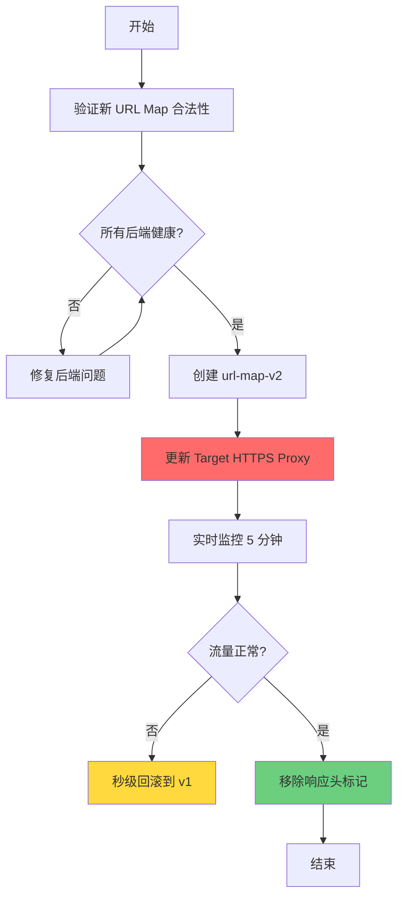

# GCP URL Map 零停机生产切换与全验证指南

在生产环境中将单 Backend Service 架构切换为 **"API 分流 (Split Backends)"** 模式时，核心挑战在于如何确保在**不中断业务**的前提下，百分之百确认流量已正确路由到预期的后端服务。

本文档提供一套“金融级”的蓝绿切换与验证方案。

---

## 1. 核心策略：蓝绿切换 (Blue/Green Switch)

为了实现真正的零停机并具备秒级回滚能力，我们不建议在生产环境直接使用 `gcloud import` 修改现有的 URL Map。

### 推荐流程：
1.  **保持现状**：旧的 URL Map (`url-map-v1`) 继续对外服务。
2.  **创建影子配置**：创建一个全新的 URL Map 资源 (`url-map-v2`)，包含所有的分流规则。
3.  **原子切换**：通过更新 Target Proxy，将流量一瞬间从 `v1` 切换到 `v2`。

```bash
# 原子切换命令
gcloud compute target-https-proxies update $HTTPS_PROXY_NAME \
    --url-map=url-map-v2 \
    --global
```

---

## 2. 变更后如何验证路由正确性？

仅仅看到 HTTP 200 是不够的，你需要证据证明请求确实经过了**正确的 Backend Service**。

### 方案 A：打标验证 (Response Header Tagging) —— 最直观
在创建或更新各个 Backend Service 时，添加一个临时的自定义响应头作为“指纹”。

```bash
# 给 Payment 后端加标签
gcloud compute backend-services update payment-bs \
    --custom-response-header="X-Verified-Backend: payment-bs" \
    --global
```

**验证方法**：
使用 `curl -I` 观察响应头：
```bash
curl -I https://www.abc.com/payment-v1/health
# 预期输出中包含：
# X-Verified-Backend: payment-bs
```
*如果看到的是 `X-Verified-Backend: default-bs`，说明路由匹配逻辑有误。*

### 方案 B：日志指纹法 (Logging Correlation)
GCP 请求日志中记录了处理该请求的 `backendServiceName`。

**查询语句 (Cloud Logging)**：
```sql
resouce.labels.backend_service_name="payment-backend-service"
```
通过观察日志是否有新的流量流入特定的 Backend Service 名，可以实锤路由是否生效。

---

## 3. 如何确保切换不中断在线服务？

### 第一阶段：灰度和测试 (Pre-Switch)
在切换生产 Proxy 之前，你可以先用一个**测试负载均衡器**或**临时端口**来加载 `url-map-v2` 进行全面测试。

*   **小技巧**：你可以创建一个临时的 `Target HTTP Proxy` (非 HTTPS)，绑定到一个不常用的端口，指向 `url-map-v2`。然后通过这个端口验证所有 Path。

### 第二阶段：实施切换 (The Switch)
1.  **健康检查预热**：确保所有新创建的 Backend Service 的健康检测（Health Check）均为 `HEALTHY`。
    > [!CAUTION]
    > 如果新后端还没 Ready 就切换，会导致全站 502。
2.  **原子更新**：执行 `target-https-proxies update`。
3.  **实时监控**：在切换瞬间，盯着 Cloud Dashboard 的 `Request Count` 波动图。

---

## 4. 验证清单 (Verification Checklist)

| 验证项 | 验证工具 | 预期结果 |
| :--- | :--- | :--- |
| **URL Map 合法性** | `gcloud compute url-maps validate` | 返回 `valid: true`，无路径重叠。 |
| **后端健康度** | GCP Console / `gcloud get-health` | 所有分流后端均为 **Healthy** 状态。 |
| **路由准确性** | `curl -I` + 自定义 Header | 不同路径返回对应的 `X-Verified-Backend` 标签。 |
| **防护生效验证** | 模拟攻击 (如 SQLi 字符) | 对应的 Cloud Armor 策略返回 **403 Forbidden**。 |
| **兜底逻辑** | 访问不存在的路径 | 流量掉入 `Host: All unmatched` 对应的安全后端。 |

---

## 5. 快速回滚方案 (Rollback)

如果切换后发现异常，立即执行以下命令切回旧配置：

```bash
# 秒级切回 v1
gcloud compute target-https-proxies update $HTTPS_PROXY_NAME \
    --url-map=url-map-v1 \
    --global
```

---

## 总结

通过 **“响应头打标 (Custom Headers)”** 确认身份，结合 **“蓝绿资源切换 (Blue/Green Switch)”** 规避停机，这是生产环境下最稳健的实施路径。建议在正式推送生产前，先在 Staging 环境演练一次完整的 Proxy 切换流程。

# Claude
# GCP URL Map 生产切换验证方案分析

## 问题分析

您的核心诉求是在**生产环境**将单一 Backend Service 切换为多 Backend + URL Map 分流架构，需要确保：
1. **零停机**切换
2. **百分百验证**路由正确性
3. **快速回滚**能力

---

## 解决方案：分阶段验证与蓝绿切换

### 阶段一：预生产完整性验证（Pre-Production）

#### 1.1 配置验证（Static Validation）

```bash
# 验证 URL Map 语法合法性
gcloud compute url-maps describe url-map-v2 --global --format=yaml > urlmap-v2.yaml

# 检查路径匹配冲突
gcloud compute url-maps validate --source=urlmap-v2.yaml
```

**验证要点**：
- 路径优先级是否正确（最长匹配优先）
- 是否有路径重叠导致的非预期匹配
- Default Service 是否设置为安全兜底后端

#### 1.2 后端健康检查

```bash
# 检查所有 Backend Service 健康状态
for BS in payment-bs order-bs default-bs; do
  echo "=== Checking $BS ==="
  gcloud compute backend-services get-health $BS --global
done
```

**预期输出**：
```
healthStatus:
- healthState: HEALTHY
  instance: https://www.googleapis.com/compute/v1/projects/.../instanceGroups/...
```

> [!CAUTION]
> 如果任何 Backend Service 的实例为 `UNHEALTHY`，切换后会导致该路径 502 错误。

---

### 阶段二：灰度验证（Canary Testing）

#### 2.1 创建测试负载均衡器

**核心思路**：不直接修改生产 LB，而是创建一个临时的测试入口。

```bash
# 创建测试 URL Map（指向新配置）
gcloud compute url-maps create url-map-test \
    --default-service=default-bs \
    --global

# 创建测试 Target HTTP Proxy（使用非标准端口）
gcloud compute target-http-proxies create test-proxy \
    --url-map=url-map-test \
    --global

# 创建测试转发规则（使用临时 IP 或端口）
gcloud compute forwarding-rules create test-lb-rule \
    --global \
    --target-http-proxy=test-proxy \
    --ports=8080
```

#### 2.2 响应头打标验证（推荐）

为每个 Backend Service 添加唯一标识：

```bash
# Payment 后端打标
gcloud compute backend-services update payment-bs \
    --custom-response-header="X-Backend-ID: payment-bs" \
    --custom-response-header="X-Team: payment-team" \
    --global

# Order 后端打标
gcloud compute backend-services update order-bs \
    --custom-response-header="X-Backend-ID: order-bs" \
    --custom-response-header="X-Team: order-team" \
    --global

# Default 后端打标
gcloud compute backend-services update default-bs \
    --custom-response-header="X-Backend-ID: default-bs" \
    --custom-response-header="X-Team: security" \
    --global
```

**测试脚本**：

```bash
#!/bin/bash
TEST_LB_IP="<测试负载均衡器 IP>"

# 测试 Payment 路径
echo "=== Testing Payment API ==="
curl -I http://$TEST_LB_IP:8080/payment-v1/health \
    -H "Host: www.abc.com" | grep "X-Backend-ID"
# 预期: X-Backend-ID: payment-bs

# 测试 Order 路径
echo "=== Testing Order API ==="
curl -I http://$TEST_LB_IP:8080/order/v2/status \
    -H "Host: www.abc.com" | grep "X-Backend-ID"
# 预期: X-Backend-ID: order-bs

# 测试兜底逻辑
echo "=== Testing Default Fallback ==="
curl -I http://$TEST_LB_IP:8080/unknown-path \
    -H "Host: www.abc.com" | grep "X-Backend-ID"
# 预期: X-Backend-ID: default-bs
```

#### 2.3 Cloud Armor 策略验证

**方法一：差异化 IP 白名单**

```bash
# Payment 后端：仅允许办公网 IP
gcloud compute security-policies rules create 1000 \
    --security-policy=payment-armor \
    --src-ip-ranges="203.0.113.0/24" \
    --action=allow

# Order 后端：仅允许合作伙伴 IP
gcloud compute security-policies rules create 1000 \
    --security-policy=order-armor \
    --src-ip-ranges="198.51.100.0/24" \
    --action=allow
```

**验证方法**：
```bash
# 从办公网测试 Payment API（预期成功）
curl -I https://www.abc.com/payment-v1/health

# 从办公网测试 Order API（预期 403）
curl -I https://www.abc.com/order/v2/status
```

**方法二：自定义 Header 规则**

```bash
# Payment 后端：要求特定 Header
gcloud compute security-policies rules create 2000 \
    --security-policy=payment-armor \
    --expression="request.headers['X-Test-Token'] == 'payment-secret'" \
    --action=allow
```

**验证方法**：
```bash
# 携带正确 Token（预期成功）
curl -I https://www.abc.com/payment-v1/health \
    -H "X-Test-Token: payment-secret"

# 不携带 Token（预期 403）
curl -I https://www.abc.com/payment-v1/health
```

---

### 阶段三：生产切换（Blue/Green Switch）

#### 3.1 蓝绿切换流程



#### 3.2 切换命令

```bash
# 1. 获取当前 Proxy 配置（备份）
gcloud compute target-https-proxies describe $HTTPS_PROXY_NAME \
    --global --format="value(urlMap)" > current-urlmap.txt

# 2. 原子切换
gcloud compute target-https-proxies update $HTTPS_PROXY_NAME \
    --url-map=url-map-v2 \
    --global

# 3. 验证切换结果
gcloud compute target-https-proxies describe $HTTPS_PROXY_NAME \
    --global --format="value(urlMap)"
```

**切换时间窗口**：
- GCP 全局负载均衡器的配置传播时间通常为 **30-60 秒**
- 建议在**低峰期**（如凌晨 2-4 点）执行

#### 3.3 实时监控指标

**Cloud Console 监控面板**：
```bash
# 打开以下监控页面
https://console.cloud.google.com/net-services/loadbalancing/details/http/YOUR_LB_NAME?project=YOUR_PROJECT
```

**关键指标**：
| 指标 | 正常范围 | 异常阈值 |
|------|----------|----------|
| **总 QPS** | 切换前后波动 < 5% | 下降 > 10% |
| **5xx 错误率** | < 0.1% | > 1% |
| **平均延迟** | 切换前后波动 < 20ms | 增加 > 100ms |
| **后端健康实例数** | 保持 100% | 任何后端 < 100% |

**实时日志查询**：
```bash
# Cloud Logging 查询（最近 5 分钟）
gcloud logging read "resource.type=http_load_balancer
httpRequest.status>=500
timestamp>=\"$(date -u -d '5 minutes ago' +%Y-%m-%dT%H:%M:%SZ)\"" \
    --limit 50 \
    --format json
```

---

### 阶段四：后端路由验证（Post-Switch）

#### 4.1 Nginx 日志验证法

**在后端 Nginx 配置中添加自定义日志格式**：

```nginx
# nginx.conf
log_format backend_tracking '$remote_addr - $remote_user [$time_local] '
                           '"$request" $status $body_bytes_sent '
                           '"$http_x_forwarded_for" '
                           '"$http_user_agent" '
                           'backend_service="payment-bs"';  # 硬编码后端标识

access_log /var/log/nginx/access.log backend_tracking;
```

**验证方法**：
```bash
# 在 Payment 后端实例上执行
tail -f /var/log/nginx/access.log | grep "POST /payment-v1/transaction"

# 预期看到日志中包含 backend_service="payment-bs"
```

#### 4.2 Cloud Logging 聚合验证

```sql
-- 查询最近 10 分钟各 Backend Service 的流量分布
resource.type="http_load_balancer"
timestamp >= "2026-01-30T00:00:00Z"
| stats 
    count(*) as request_count,
    avg(httpRequest.latency) as avg_latency
  by jsonPayload.backendServiceName
```

**预期输出**：
```
backendServiceName       | request_count | avg_latency
-------------------------|---------------|-------------
payment-bs               | 5234          | 0.12s
order-bs                 | 3421          | 0.09s
default-bs               | 127           | 0.05s
```

> [!WARNING]
> 如果 `default-bs` 的流量占比 > 5%，说明有大量请求未匹配到预期路径。

---

## 验证清单（Checklist）

### 切换前验证（Pre-Switch）

- [ ] URL Map 语法验证通过（`gcloud compute url-maps validate`）
- [ ] 所有 Backend Service 健康检查为 **HEALTHY**
- [ ] Cloud Armor 策略已绑定到对应 Backend Service
- [ ] 已在测试环境完整验证所有 API 路径
- [ ] 已配置响应头标记（`X-Backend-ID`）
- [ ] 已通过差异化 Cloud Armor 规则验证路由正确性
- [ ] 已准备回滚命令和脚本
- [ ] 已通知相关团队切换时间窗口

### 切换中监控（During Switch）

- [ ] 实时监控 Cloud Console 的 QPS/错误率
- [ ] 观察 Cloud Logging 中的 5xx 错误日志
- [ ] 验证 Target Proxy 的 URL Map 已更新为 v2
- [ ] 配置传播完成（等待 60 秒）

### 切换后验证（Post-Switch）

- [ ] 各 API 路径返回正确的 `X-Backend-ID` 响应头
- [ ] Nginx 日志显示流量已路由到预期后端
- [ ] Cloud Logging 聚合查询显示流量分布正确
- [ ] Cloud Armor 策略生效（测试拦截规则）
- [ ] 总 QPS 和延迟无明显波动
- [ ] 持续监控 30 分钟无异常

---

## 快速回滚方案

```bash
#!/bin/bash
# rollback.sh - 快速回滚脚本

HTTPS_PROXY_NAME="your-https-proxy"
OLD_URL_MAP="url-map-v1"

echo "⚠️  开始回滚到旧配置..."

gcloud compute target-https-proxies update $HTTPS_PROXY_NAME \
    --url-map=$OLD_URL_MAP \
    --global

if [ $? -eq 0 ]; then
    echo "✅ 回滚成功！等待 60 秒配置传播..."
    sleep 60
    echo "✅ 回滚完成，请验证服务恢复正常"
else
    echo "❌ 回滚失败，请手动检查配置！"
    exit 1
fi
```

**执行回滚**：
```bash
chmod +x rollback.sh
./rollback.sh
```

---

## 补充建议

### 1. 渐进式切换（Canary Release）

如果担心一次性切换风险太大，可以使用 **Traffic Splitting**：

```bash
# 配置 90% 流量走旧后端，10% 走新后端
gcloud compute backend-services update payment-bs \
    --global \
    --session-affinity=CLIENT_IP \
    --connection-draining-timeout=300
```

### 2. 自动化验证脚本

```bash
#!/bin/bash
# validate-routing.sh

API_ENDPOINTS=(
    "/payment-v1/health:payment-bs"
    "/order/v2/status:order-bs"
    "/unknown:default-bs"
)

for ENDPOINT in "${API_ENDPOINTS[@]}"; do
    PATH="${ENDPOINT%%:*}"
    EXPECTED_BACKEND="${ENDPOINT##*:}"
    
    ACTUAL_BACKEND=$(curl -s -I https://www.abc.com$PATH \
        | grep "X-Backend-ID" \
        | awk '{print $2}' \
        | tr -d '\r')
    
    if [ "$ACTUAL_BACKEND" == "$EXPECTED_BACKEND" ]; then
        echo "✅ $PATH -> $ACTUAL_BACKEND (正确)"
    else
        echo "❌ $PATH -> $ACTUAL_BACKEND (预期: $EXPECTED_BACKEND)"
        exit 1
    fi
done
```

### 3. 移除临时标记

切换完成并验证无误后，清理响应头标记：

```bash
# 移除所有自定义响应头
for BS in payment-bs order-bs default-bs; do
    gcloud compute backend-services update $BS \
        --no-custom-response-headers \
        --global
done
```

---

## 总结

您提出的验证思路是**合理且可行**的，建议的完整流程为:

1. **阶段一**：通过 `gcloud validate` 验证配置合法性
2. **阶段二**：创建测试 LB + 响应头打标 + Cloud Armor 差异化规则验证
3. **阶段三**：蓝绿切换（保留旧 URL Map 以便秒级回滚）
4. **阶段四**：Nginx 日志 + Cloud Logging 聚合验证路由正确性

**核心要点**：
- ✅ **响应头打标**是最直观的验证手段
- ✅ **Cloud Armor 差异化规则**可以强制验证路由路径
- ✅ **蓝绿切换**确保零停机和快速回滚
- ✅ **多层验证**（配置 + 灰度 + 生产 + 日志）确保万无一失

建议在**正式推送生产前**在 Staging 环境完整演练一次切换流程，包括故意触发回滚场景。