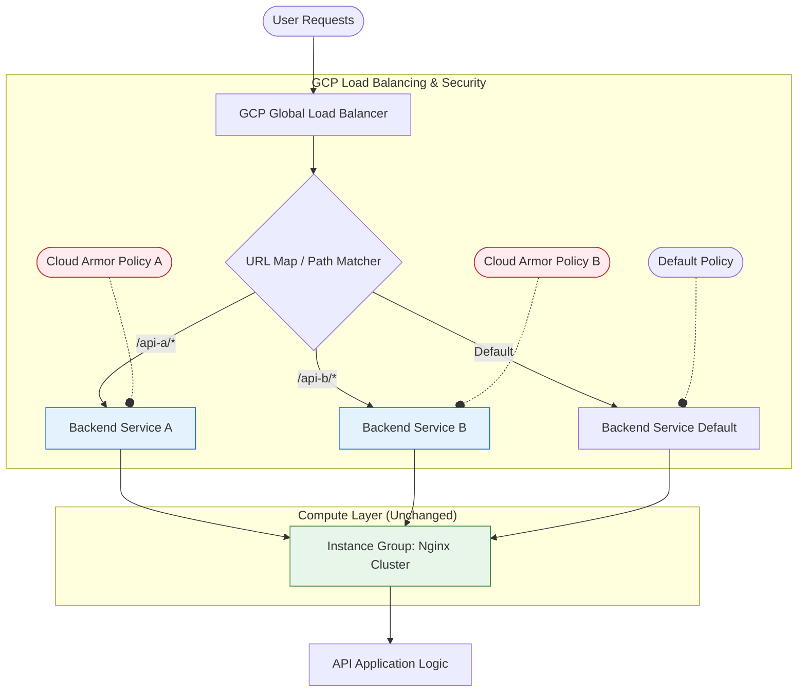

# Cloud Armor Granular Policy Design

## 1. 背景与需求 (Background & Requirement)

**现状 (As-Is)**:
- **架构**: GCP GLB (HTTPS) -> Backend Service (Unified) -> MIG (Nginx)
- **流量模型**: `https://www.abc.com/api-name-mjor-version/endpoint`
- **当前限制**: Cloud Armor Policy 绑定在 Backend Service 上。由于所有 API 共享同一个 Backend Service，导致所有 API 只能使用同一套 WAF 规则，无法实现差异化防护。
- 对于我们的实际情况来说 ，可能还会存在一个team下所有的API 使用同一个 backend service。 

**目标 (To-Be)**:
- 针对不同的 API (如 `/api-a/*`, `/api-b/*`) 应用**不同**的 Cloud Armor 规则。
- 允许对架构进行必要的改造。

## 2. 解决方案探索 (Solution Exploration)

### 方案 A：单策略 + 高级规则 (Single Policy with Advanced Rules)
在同一个 Policy 中，利用 CEL (Common Expression Language) 表达式结合 `request.path` 来区分规则。

*   **配置方式**:
    ```yaml
    rule:
      match:
        expr: request.path.startsWith('/api-a/') && evaluatePreConfiguredWaf('sqli-v33-stable')
      action: deny
    ```
*   **优点**: 架构无需变动。
*   **缺点**:
    *   **复杂度爆炸**: 当 API 数量增多时，Policy 会变得极难维护。
    *   **功能受限**: 某些基础配置（如 `src_ip_ranges` 黑白名单）很难与 Path 逻辑优雅混用。
    *   **配额限制**: 单个 Policy 的 rule 数量有限。

### 方案 B：拆分后端服务 (Split Backend Services) - **推荐方案 (Recommended)**
利用 GCP GLB 的 **URL Map** 分发能力，将不同 API 的流量指向**不同的 Backend Service**，但这些 Backend Service **共享同一个 Instance Group (Nginx)**。

*   **核心逻辑**:
    1.  **URL Map**: 负责根据 Path (`/api-a/*`) 路由。
    2.  **Backend Services**: 创建多个 BS (如 `bs-api-a`, `bs-api-b`)，它们都指向**同一个** MIG。
    3.  **Cloud Armor**: 每个 BS 绑定独立的 Policy。

*   **优点**:
    *   **解耦**: 策略完全隔离，修改 A 不影响 B。
    *   **标准**: 符合 GCP 原生设计模式。
    *   **零侵入**: Nginx 和 应用代码**完全不需要修改**，仅在 GLB 层变动。

## 3. 架构设计 (Architecture Design)

### 流量分发与安全层 (Traffic & Security Layer)



## 4. 实施指南 (Implementation Guide)

只需在 GCP 层面操作，无需触碰 Nginx 配置文件。

### Step 1: 准备安全策略
为不同的 API 创建独立的策略文件。

```bash
# Policy for API A (High Security)
gcloud compute security-policies create policy-api-a --description "Strict WAF for API A"

# Policy for API B (Geo Blocking only)
gcloud compute security-policies create policy-api-b --description "Geo block for API B"
```

### Step 2: 创建新的 Backend Services
**关键点**: 创建新的 Backend Service，但将其 Backend 设置为**现有的** Nginx Instance Group。

```bash
# 1. 创建 Backend Service
gcloud compute backend-services create bs-api-a \
    --protocol=HTTP \
    --port-name=http \
    --health-checks=existing-health-check \
    --global

# 2. 添加现有的 Instance Group 作为后端
gcloud compute backend-services add-backend bs-api-a \
    --instance-group=nginx-prod-mig \
    --global \
    --balancing-mode=RATE \
    --max-rate-per-instance=100

# 3. 绑定对应的 Cloud Armor Policy
gcloud compute backend-services update bs-api-a --security-policy=policy-api-a --global
```

*(重复此步骤为 API B 创建 `bs-api-b`)*

### Step 3: 更新 URL Map 路由
将特定 Path 的流量指向新创建的 Backend Service。

```bash
#这一步建议通过 Console 或 Terraform 操作 path-matcher
# 逻辑如下:
# hostRules:
# - hosts: ["www.abc.com"]
#   pathMatcher: main-matcher
# pathMatchers:
# - name: main-matcher
#   defaultService: bs-default
#   pathRules:
#   - paths: ["/api-a/*"]
#     service: bs-api-a  <-- 流量被分流，并应用 policy-api-a
#   - paths: ["/api-b/*"]
#     service: bs-api-b  <-- 流量被分流，并应用 policy-api-b
```

## 5. 总结 (Summary)

通过 **"Backend Service Splitting"** 模式，我们成功实现了：
1.  **精细化控制**: 不同的 API 路径拥有了独立的安全策略上下文。
2.  **架构复用**: 底层计算资源 (Nginx MIG) 保持共享，无需重复部署资源。
3.  **灵活运维**: 若某 API 遭受攻击，可单独收紧其策略，而不影响全站其他业务。