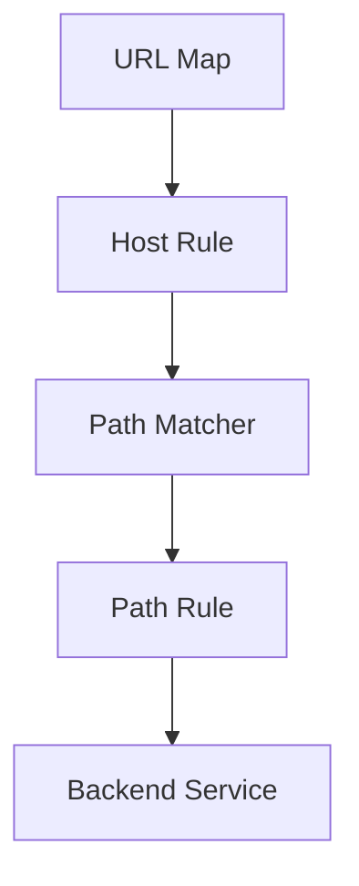

# GCP HTTPS Load Balancer —— URL Map 深度解析与可实施配置指南

> 本文目标  
> **把 URL Map 这个“黑盒”彻底讲清楚**：  
>
> - 它是什么  
> - 它在请求链路中到底干了什么  
> - 它的内部匹配逻辑  
> - 它和 Backend Service / Cloud Armor 的真实关系  
> - 如何“安全、可控”地修改与演进  
> - **URL Map ≈ 把「是否需要在 Nginx 做的那一部分 L7 路由能力，上移到了 GLB 层」**

---

## 1. URL Map 是什么？（一句话 + 本质）

### 1.1 一句话定义

> **URL Map 是 HTTPS Global Load Balancer 的 L7 路由规则引擎，用于根据 Host + Path 决定请求应该转发到哪个 Backend Service。
****

---

### 1.2 在 GLB 中的位置

```flow
Client
  ↓
HTTPS Proxy
  ↓
URL Map        ← L7 决策核心
  ↓
Backend Service
  ↓
Instance Group / NEG
```

👉 **URL Map = L7 Router**

👉 **Backend Service = 安全 & 负载边界**

---

## **2. URL Map 能做什么 / 不能做什么**

### **2.1 URL Map 能做的事**

|**能力**|**是否支持**|
|---|---|
|按 Host 分流|✅|
|按 Path 分流|✅|
|Path 优先级匹配|✅|
|一个 URL Map 指向多个 Backend Service|✅|
|一个 Backend Service 被多个 Path 使用|✅|

---

### **2.2 URL Map 不能做的事（关键认知）**

|**能力**|**是否支持**|
|---|---|
|绑定 Cloud Armor|❌|
|执行安全规则|❌|
|修改请求内容|❌|
|根据 Header 做复杂逻辑|❌|

👉 **URL Map 只做“去哪”，不做“能不能”**

---

## **3. URL Map 的内部结构（必须理解）**

### **3.1 URL Map 的逻辑结构图**



---

### **3.2 关键对象解释**

#### **3.2.1 Host Rule**

- 决定 **某个 Host 用哪个 Path Matcher**

- 示例：

  - <www.abc.com> → api-path-matcher

> 即使只有一个域名，也必须存在 Host Rule

---

#### **3.2.2 Path Matcher（逻辑分组器）**

- 一组 Path Rule 的集合

- 每个 Path Matcher：

  - 有 **一个 default backend service**

  - 有 **多条 path → backend** 映射

---

#### **3.2.3 Path Rule**

```
/api-a-v1/* → bs-api-a-v1
/api-b-v1/* → bs-api-b-v1
```

- 支持通配符 *

- 不支持正则

- **最长路径优先匹配**

---

## **4. URL Map 的真实匹配顺序（非常重要）**

> GCP 官方内部顺序（你必须记住）

```
1. Host Rule 匹配 Host
2. 找到对应 Path Matcher
3. Path Rule：Longest Path Match
4. 若无匹配 → Default Backend Service
```

---

### **4.1 Longest Path Match 示例**

|**Path Rule**|**请求 Path**|**是否命中**|
|---|---|---|
|/api/*|/api/a/v1|命中|
|/api-a-v1/*|/api-a-v1/order|**优先命中**|

👉 **路径越具体，优先级越高**

---

## **5. URL Map 与 Backend Service / Cloud Armor 的关系**

### **5.1 责任边界（非常关键）**

```
URL Map        → 决定用哪个 Backend Service
Backend Service → 决定：
                  - Cloud Armor Policy
                  - Health Check
                  - Session Affinity
```

---

### **5.2 为什么“共享 MIG + 多 Backend Service”可行？**

```
bs-api-a ─┐
          ├─→ nginx-mig
bs-api-b ─┘
```

- URL Map：只关心 BS 名称

- BS：只关心后端是谁

- MIG：完全无感

---

## **6. 一个完整 URL Map 示例（概念级）**

```
hostRules:
- hosts:
  - www.abc.com
  pathMatcher: api-matcher

pathMatchers:
- name: api-matcher
  defaultService: bs-default
  pathRules:
  - paths:
    - /api-a-v1/*
    service: bs-api-a-v1
  - paths:
    - /api-b-v1/*
    service: bs-api-b-v1
```

---

## **7. URL Map 的更新方式（生产实践重点）**

### **7.1 三种更新方式对比**

|**方式**|**推荐度**|**说明**|
|---|---|---|
|gcloud url-maps edit|⭐⭐⭐⭐|安全、可控|
|Terraform|⭐⭐⭐⭐⭐|最佳实践|
|Console 手动|⭐|不推荐|

---

### **7.2**

### **gcloud compute url-maps edit**

### **（推荐）**

#### **7.2.1 执行命令**

```
gcloud compute url-maps edit your-url-map
```

- 自动拉取 YAML

- 本地编辑

- 保存后自动校验 & 更新

---

#### **7.2.2 添加一条 API Path（示例）**

```
 pathMatchers:
 - name: api-matcher
   defaultService: bs-default
   pathRules:
+  - paths:
+    - /api-c-v1/*
+    service: bs-api-c-v1
```

> ⚠️ 不会影响已有 Path

---

## **8. URL Map 变更的“安全原则”（非常重要）**

### **8.1 变更原则**

- 只新增 Path Rule

- 不动 defaultService

- 不覆盖已有 Path

---

### **8.2 灰度迁移建议**

```
/api-a-v1/internal/* → 新 BS（先灰度）
/api-a-v1/*          → 旧 BS
```

---

## **9. 常见误解澄清**

|**误解**|**事实**|
|---|---|
|URL Map 执行安全策略|❌ Cloud Armor 执行|
|Path Rule 有顺序|❌ 按最长匹配|
|一个 Path 只能一个 BS|❌ 可复用|
|必须拆域名|❌ Path 即可|

---

## **10. 总结一句话（URL Map 的本质）**

> **URL Map 是一个纯 L7 路由决策表，它唯一的职责就是：根据 Host + Path，选中一个 Backend Service；而安全、策略、健康检查全部发生在 Backend Service 层。**

---

## **11. 下一步你可以继续深入的方向**

- 我可以帮你：

  - **画出你当前 URL Map 的完整结构图**

  - 给你一个 **Terraform module：url-map + path matcher**

  - 帮你制定 **API Path 设计规范**

  - 结合 Cloud Armor 设计 **Policy 模板**

你是想 **先完全搞懂概念**，还是 **直接看一个可以复制用的 URL Map 模板**？

# GCP HTTPS Load Balancer —— URL Map 完整结构图（概念 + 实例）

下面这张图是 **URL Map 在 GLB 中的完整、真实逻辑结构**，不是简化图，**可以直接对应到 gcloud / Terraform 的配置结构**。

---

## 1. URL Map 完整逻辑结构图（官方语义级）

```mermaid
graph TD
  A["HTTPS Proxy"]
  B["URL Map"]

  C["Host Rule<br/>hosts: www.abc.com"]
  D["Path Matcher: api-matcher"]

  E["Path Rule<br/>/api-a-v1/*"]
  F["Path Rule<br/>/api-b-v1/*"]
  G["Default Service"]

  H["Backend Service: bs-api-a-v1<br/>Cloud Armor: policy-api-a-v1"]
  I["Backend Service: bs-api-b-v1<br/>Cloud Armor: policy-api-b-v1"]
  J["Backend Service: bs-default<br/>Cloud Armor: policy-default"]

  K["Nginx MIG"]

  A --> B
  B --> C
  C --> D

  D --> E
  D --> F
  D --> G

  E --> H --> K
  F --> I --> K
  G --> J --> K
````

---

## **2. 从「请求视角」再画一遍（执行路径版）**

> 这张图是 **真正发生在运行时的决策顺序**

```mermaid
graph LR
  R["Client Request<br/>https://www.abc.com/api-a-v1/orders"]

  H["Host Match<br/>www.abc.com"]
  P["Path Match<br/>/api-a-v1/*"]
  BSA["Backend Service<br/>bs-api-a-v1"]
  CA["Cloud Armor<br/>policy-api-a-v1"]
  MIG["Nginx MIG"]
  APP["Backend App"]

  R --> H --> P --> BSA --> CA --> MIG --> APP
```

---

## **3. URL Map 对应的“真实配置结构”（和上图一一对应）**

```
hostRules:
- hosts:
  - www.abc.com
  pathMatcher: api-matcher

pathMatchers:
- name: api-matcher
  defaultService: bs-default
  pathRules:
  - paths:
    - /api-a-v1/*
    service: bs-api-a-v1
  - paths:
    - /api-b-v1/*
    service: bs-api-b-v1
```

> ⚠️ 注意：

- > **Host Rule 只是“入口选择器”**

- > **Path Matcher 才是你真正维护的核心对象**

---

## **4. 和你当前方案的“关键对应关系表”**

|**你关心的点**|**在图中的位置**|
|---|---|
|URL Map 做路由|Host Rule + Path Matcher|
|API Path 分流|Path Rule|
|Cloud Armor 隔离|Backend Service|
|共享 Nginx|所有 BS 指向同一个 MIG|
|Nginx 零改动|MIG 完全无感|

---

## **5. 为什么这个结构**

## **天然支持 API 级安全隔离**

```
/api-a-v1/* → bs-api-a-v1 → policy-api-a-v1
/api-b-v1/* → bs-api-b-v1 → policy-api-b-v1
```

- URL Map：只负责“选哪个 BS”

- Cloud Armor：只看“自己绑的 BS”

- MIG：只是执行请求

👉 **三层职责完全正交**

---

## **6. 你在生产中“真正会改的只有哪一块？”**

**99% 的情况下，只动这一小块：**

```
pathRules:
- paths:
  - /api-new-v1/*
  service: bs-api-new-v1
```

其他都 **不需要动**：

- 不动 HTTPS Proxy

- 不动 Host Rule

- 不动 Nginx

- 不动已有 API Path

---

## **7. 一句话帮你彻底记住 URL Map**

> **URL Map 就是一张「Host + Path → Backend Service」的静态路由表；真正的安全和能力边界，永远在 Backend Service。**

---

如果你愿意，下一步我可以：

- ✅ **按你当前生产 URL Map 帮你画“现网版”结构图**

- ✅ 给你 **Terraform 版 URL Map 模块**

- ✅ 设计 **API Path / Backend Service / Policy 的命名与生命周期规范**

你更想 **对照你现在的配置来画一张 1:1 的图**，还是 **直接上 Terraform？**

# RL Map 是 HTTPS Global Load Balancer 的 L7 路由规则引擎

URL Map 是 HTTPS Global Load Balancer 的 L7 路由规则引擎，用于根据 Host + Path 决定请求应该转发到哪个 Backend Service。**
那这个其实是完全把我 Nginx里面的配置提到了这个地方是不是也可以这么理解。毕竟我后面的 Nginx也是基于这个逻辑去做的对应转发 ?

这个理解 **方向是对的，但需要稍微“校准一下边界”**。

可以这么说：

> **URL Map ≈ 把「是否需要在 Nginx 做的那一部分 L7 路由能力，上移到了 GLB 层」**

> 但 **它不是 Nginx 的完全替代**，而是 **职责拆分后的前半段**。

我分 4 个层次把这个问题讲透，你会发现这其实正好解释了你们现在这套架构为什么“看起来有点重复”。

---

# URL Map vs Nginx：是不是把 Nginx 配置“提到”了 GLB？

## 1. 直观结论（给一个你能直接用的判断）

✅ **可以理解为：**
> URL Map 把 **Nginx 中「基于 Host / Path 决定去哪」的那一部分逻辑，上移到了 GCP GLB。**

❌ **但不能理解为：**
> URL Map = Nginx

---

## 2. 把 Nginx 的能力拆开看（这是关键）

你现在 Nginx 的典型能力其实是三类：

| 能力类型 | 示例 |
|---|---|
| **L7 路由** | `location /api-a/ { proxy_pass ... }` |
| 流量控制 | rewrite、header 操作 |
| 协议 / 连接管理 | keepalive、buffer、http2 |

**URL Map 只覆盖第一类，而且是一个「受限版」的第一类。**

---

## 3. 一一对照：URL Map 和 Nginx location 的对应关系

### 3.1 Nginx 中你熟得不能再熟的东西

```nginx
server {
  server_name www.abc.com;

  location /api-a-v1/ {
    proxy_pass http://upstream_a;
  }

  location /api-b-v1/ {
    proxy_pass http://upstream_b;
  }
}
````

### **3.2 在 GLB 中对应的是：**

```
Host Rule: www.abc.com
  └── Path Matcher
        ├── /api-a-v1/* → bs-api-a-v1
        └── /api-b-v1/* → bs-api-b-v1
```

👉 **语义是完全等价的**：

都是在做「看到这个 Path，就把请求送到哪个后端」。

---

## **4. 那为什么还需要 Nginx？（核心区别点）**

### **4.1 URL Map 做不了的事（Nginx 必须存在）**

|**能力**|**URL Map**|**Nginx**|
|---|---|---|
|Path → Backend|✅|✅|
|正则匹配|❌|✅|
|Header 判断|❌|✅|
|rewrite / redirect|❌|✅|
|认证、限流|❌|（可选）|
|L7 到 L4 转换|❌|✅|

> URL Map = **非常“干净”的静态路由表**

> Nginx = **真正的 L7 代理引擎**

---

## **5. 从「责任边界」角度再看一次（非常重要）**

```
GLB（URL Map）
  ├── 做什么？
  │   └── API Path → Backend Service
  │
  └── 不做什么？
      └── 不理解 API 语义、不碰请求内容

Nginx
  ├── 做什么？
  │   ├── proxy / rewrite / header
  │   ├── 协议转换（HTTP → gRPC 等）
  │   └── 连接管理
```

👉 **这其实是一个“前置路由 + 深度代理”的分层设计**

---

## **6. 用一句工程师能接受的话总结**

> **URL Map 相当于把 Nginx 里“最外层、最稳定、最不该频繁改的 location 路由”，前移到了 GLB；**

> **而 Nginx 保留所有需要灵活性、表达力、协议处理能力的部分。**

---

## **7. 放到你们 API 平台语境下的「最佳实践理解」**

对你们这种：

- 统一入口域名

- API path 清晰、版本化

- 强调安全隔离（Cloud Armor）

👉 **非常适合：**

- GLB URL Map：

  - /api-x-v{n}/* 级别路由

  - 稳定、少变、与安全策略强绑定

- Nginx：

  - 内部细分

  - Header / rewrite / upstream 管理

---

## **8. 一句话给你一个“是否该上移”的判断标准**

> **如果这段 Nginx 配置只依赖 Host + Path，且和安全策略 / API 边界强相关，那它就非常适合被上移到 URL Map。**

---

如果你愿意，下一步我可以帮你做一件**非常有价值的事**：

- 拿你现在的 **Nginx location 列表**

- 帮你拆成：

  - ✅「应该上移到 URL Map 的」

  - ⚠️「必须留在 Nginx 的」

- 顺便告诉你 **哪些 location 会成为 Cloud Armor 的天然边界**

这个拆完，你们的架构会**非常清爽**。
