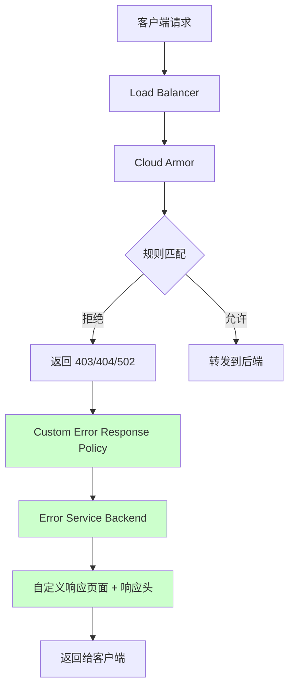
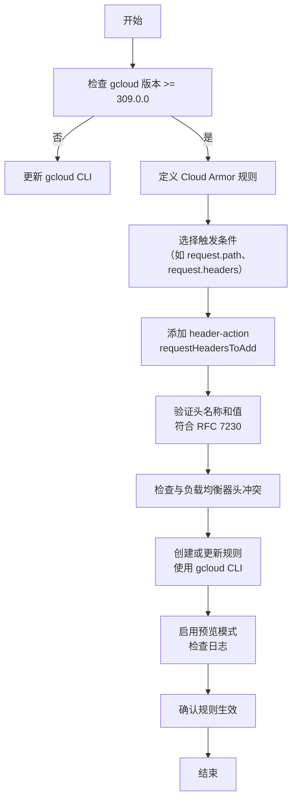
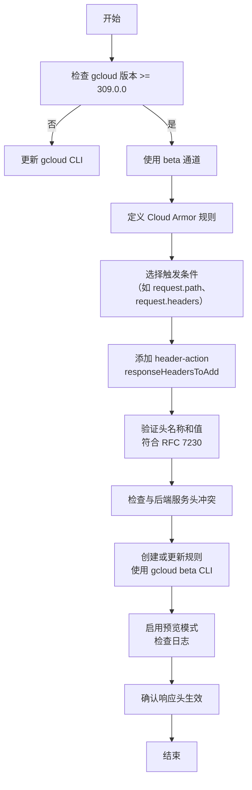
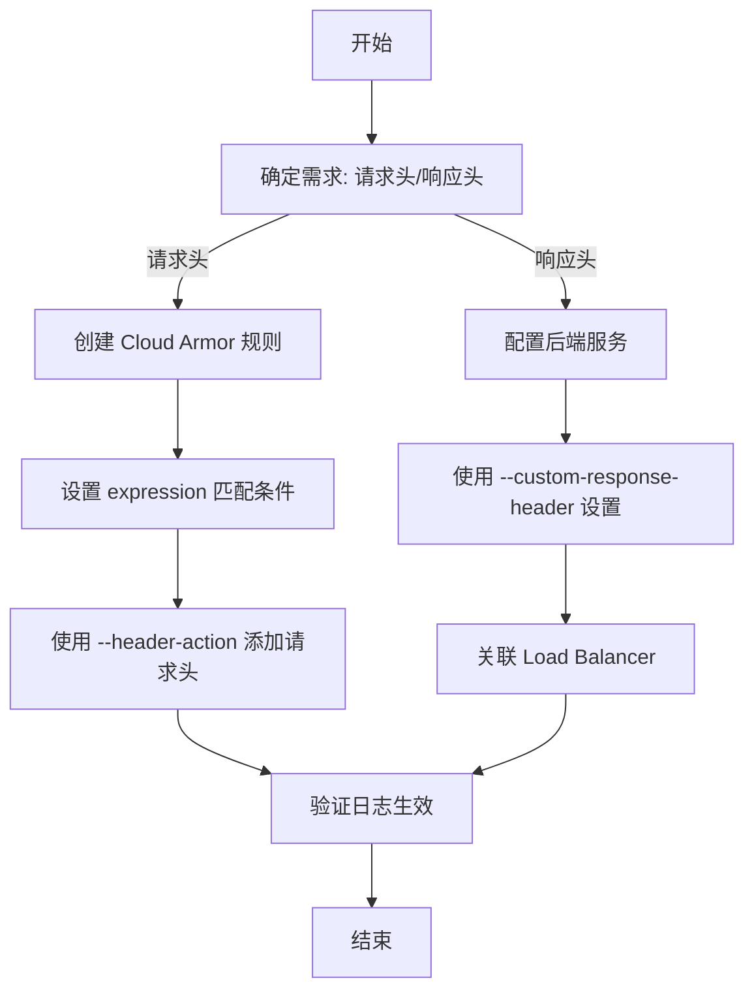

- [summary](#summary)
- [how to request-headers-to-add](#how-to-request-headers-to-add)
- [Claude](#claude)
  - [Cloud Armor 响应头限制](#cloud-armor-响应头限制)
    - [当前限制基于搜索结果，我找到了解决方案！你的需求是可以实现的，但需要通过 **Custom Error Response** 功能来实现。](#当前限制基于搜索结果我找到了解决方案你的需求是可以实现的但需要通过-custom-error-response-功能来实现)
  - [Cloud Armor 响应头定制解决方案](#cloud-armor-响应头定制解决方案)
    - [核心方案：Custom Error Response](#核心方案custom-error-response)
    - [实现步骤](#实现步骤)
      - [1. 创建错误服务后端](#1-创建错误服务后端)
      - [2. 创建 Backend Bucket](#2-创建-backend-bucket)
      - [3. 配置 Custom Error Response Policy](#3-配置-custom-error-response-policy)
    - [自定义错误页面示例](#自定义错误页面示例)
    - [进阶配置：不同路径的错误响应](#进阶配置不同路径的错误响应)
    - [API 错误响应示例](#api-错误响应示例)
    - [限制和注意事项](#限制和注意事项)
    - [监控和日志](#监控和日志)
    - [最佳实践](#最佳实践)
- [Perplexity](#perplexity)
  - [Google Cloud Armor 中 header-action 功能及相关内容总结](#google-cloud-armor-中-header-action-功能及相关内容总结)
  - [1. header-action 功能的用途、gcloud CLI 版本要求及基本语法](#1-header-action-功能的用途gcloud-cli-版本要求及基本语法)
  - [2. 使用 gcloud 命令行为 Cloud Armor 规则添加自定义响应头](#2-使用-gcloud-命令行为-cloud-armor-规则添加自定义响应头)
  - [3. Cloud Armor 规则添加响应头的限制及不支持的规则类型](#3-cloud-armor-规则添加响应头的限制及不支持的规则类型)
  - [4. Cloud Armor 拦截请求时是否能定义和注入自定义响应头](#4-cloud-armor-拦截请求时是否能定义和注入自定义响应头)
  - [5. Cloud Armor 规则中配置响应头与后端服务配置响应头的区别和适用场景](#5-cloud-armor-规则中配置响应头与后端服务配置响应头的区别和适用场景)
  - [6. 请求头和响应头配置的特殊注意事项或差异](#6-请求头和响应头配置的特殊注意事项或差异)
  - [Google Cloud Armor 中 header-action 功能及相关内容总结](#google-cloud-armor-中-header-action-功能及相关内容总结-1)
  - [1. header-action 功能的用途、gcloud CLI 版本要求及基本语法](#1-header-action-功能的用途gcloud-cli-版本要求及基本语法-1)
  - [2. 使用 gcloud 命令行为 Cloud Armor 规则添加自定义响应头](#2-使用-gcloud-命令行为-cloud-armor-规则添加自定义响应头-1)
  - [3. Cloud Armor 规则添加响应头的限制及不支持的规则类型](#3-cloud-armor-规则添加响应头的限制及不支持的规则类型-1)
  - [4. Cloud Armor 拦截请求时是否能定义和注入自定义响应头](#4-cloud-armor-拦截请求时是否能定义和注入自定义响应头-1)
  - [5. Cloud Armor 规则中配置响应头与后端服务配置响应头的区别和适用场景](#5-cloud-armor-规则中配置响应头与后端服务配置响应头的区别和适用场景-1)
  - [6. 请求头和响应头配置的特殊注意事项或差异](#6-请求头和响应头配置的特殊注意事项或差异-1)
- [Gemini](#gemini)
- [理解 Google Cloud 中的自定义头](#理解-google-cloud-中的自定义头)
  - [执行摘要](#执行摘要)
    - [负载均衡器在头部管理中的作用](#负载均衡器在头部管理中的作用)
    - [Google Cloud Armor 的条件头部修改能力](#google-cloud-armor-的条件头部修改能力)
  - [通过负载均衡器后端服务配置自定义响应头](#通过负载均衡器后端服务配置自定义响应头)
    - [控制台配置步骤](#控制台配置步骤)
    - [`gcloud` 命令行工具命令用于后端服务](#gcloud命令行工具命令用于后端服务)
  - [通过 Cloud Armor 安全策略配置自定义响应头（间接方式）](#通过-cloud-armor-安全策略配置自定义响应头间接方式)
    - [基于请求属性的条件头部修改（间接方法）](#基于请求属性的条件头部修改间接方法)
    - [Cloud Armor 策略与 `requestHeadersAction` 的示例 YAML（仅供上下文参考）](#cloud-armor-策略与requestheadersaction的示例-yaml仅供上下文参考)
  - [解决特定的用户挑战和限制](#解决特定的用户挑战和限制)
    - [`gcloud` CLI 版本要求](#gcloudcli-版本要求)
    - [请求头和响应头配置点的区别](#请求头和响应头配置点的区别)
    - [理解为什么某些规则/页面无法添加头](#理解为什么某些规则页面无法添加头)
  - [定制 Cloud Armor 拒绝响应（例如 403）](#定制-cloud-armor-拒绝响应例如-403)
    - [利用负载均衡器自定义错误响应](#利用负载均衡器自定义错误响应)
    - [Cloud Armor 拒绝操作直接自定义头插入的限制](#cloud-armor-拒绝操作直接自定义头插入的限制)
  - [关键考量和最佳实践](#关键考量和最佳实践)
    - [头部命名要求和保留头](#头部命名要求和保留头)
    - [在头部值中使用变量](#在头部值中使用变量)
    - [优先级和交互：负载均衡器与 Cloud Armor 头部](#优先级和交互负载均衡器与-cloud-armor-头部)
    - [常见配置问题的故障排除](#常见配置问题的故障排除)
  - [结论](#结论)
- [Deepseek](#deepseek)
    - [🔍 1. **header-action功能的官方文档与用途**](#-1-header-action功能的官方文档与用途)
    - [⚙️ 2. **通过gcloud添加自定义响应头**](#️-2-通过gcloud添加自定义响应头)
    - [⚠️ 3. **header-action的限制与规则兼容性**](#️-3-header-action的限制与规则兼容性)
    - [🛡️ 4. **拦截请求时添加响应头的替代方案**](#️-4-拦截请求时添加响应头的替代方案)
    - [🔄 5. **Cloud Armor vs 后端服务的响应头配置对比**](#-5-cloud-armor-vs-后端服务的响应头配置对比)
    - [⚠️ 6. **请求头与响应头配置的特殊差异**](#️-6-请求头与响应头配置的特殊差异)
    - [💎 **总结建议**](#-总结建议)
- [Grok](#grok)
  - [回答概要](#回答概要)
  - [详细说明](#详细说明)
    - [1. `header-action` 功能简介](#1-header-action-功能简介)
    - [2. 版本要求](#2-版本要求)
    - [3. 命令行添加 `header-action` 的参数](#3-命令行添加-header-action-的参数)
      - [创建规则并添加自定义头](#创建规则并添加自定义头)
      - [更新现有规则以添加自定义头](#更新现有规则以添加自定义头)
      - [参数说明](#参数说明)
      - [添加多个自定义头](#添加多个自定义头)
    - [4. 注意事项](#4-注意事项)
      - [a. 触发阶段限制](#a-触发阶段限制)
      - [b. 自定义头冲突](#b-自定义头冲突)
      - [c. 头名称和值限制](#c-头名称和值限制)
      - [d. 预配置 WAF 规则限制](#d-预配置-waf-规则限制)
      - [e. 控制台 UI 限制](#e-控制台-ui-限制)
      - [f. 日志和监控](#f-日志和监控)
    - [5. 页面编辑无法添加头的问题](#5-页面编辑无法添加头的问题)
    - [6. 示例流程图](#6-示例流程图)
    - [7. 示例表格](#7-示例表格)
  - [总结](#总结)
  - [回答概要](#回答概要-1)
  - [详细说明](#详细说明-1)
    - [1. Google Cloud Armor 响应头修改功能](#1-google-cloud-armor-响应头修改功能)
    - [2. 版本要求](#2-版本要求-1)
    - [3. 命令行添加响应头的参数](#3-命令行添加响应头的参数)
      - [创建规则并添加响应头](#创建规则并添加响应头)
      - [更新现有规则以添加响应头](#更新现有规则以添加响应头)
      - [添加多个响应头](#添加多个响应头)
      - [参数说明](#参数说明-1)
      - [混合请求头和响应头](#混合请求头和响应头)
    - [4. 注意事项](#4-注意事项-1)
      - [a. 触发阶段限制](#a-触发阶段限制-1)
      - [b. 头名称和值限制](#b-头名称和值限制)
      - [c. 配置冲突](#c-配置冲突)
      - [d. 预配置 WAF 规则限制](#d-预配置-waf-规则限制-1)
      - [e. 控制台 UI 限制](#e-控制台-ui-限制-1)
      - [f. 日志和监控](#f-日志和监控-1)
    - [5. 与请求头修改的区别](#5-与请求头修改的区别)
    - [6. 示例流程图](#6-示例流程图-1)
    - [7. 示例表格](#7-示例表格-1)
  - [总结](#总结-1)
    - [直接回答](#直接回答)
    - [调查报告](#调查报告)
      - [1. `header-action` 功能的官方文档](#1-header-action-功能的官方文档)
      - [2. 使用 gcloud CLI 添加自定义响应头](#2-使用-gcloud-cli-添加自定义响应头)
      - [3. Cloud Armor 规则添加响应头的限制](#3-cloud-armor-规则添加响应头的限制)
      - [4. 拦截请求时的自定义响应头](#4-拦截请求时的自定义响应头)
      - [5. Cloud Armor 与后端服务配置响应头的对比](#5-cloud-armor-与后端服务配置响应头的对比)
      - [6. 请求头与响应头配置的特殊注意事项](#6-请求头与响应头配置的特殊注意事项)
      - [关键引用](#关键引用)

# summary 
- [ ] header-action
	- [ ] gcloud cloud armor header-action 这个选项在什么版本下可以使用 我想添加一些 对应规则的响应头 这个有什么需要单独注意的吗？ 我发现有些规则无法添加。另外命令行添加的参数是什么？ 对gcloud 什么版本要求
	- [ ] header-action 和 redirect 动作仅在请求头处理阶段生效，且仅支持部分规则类型
		- [ ] 我目前测试Allow添加成功了requestheadersToAdds 
	- [ ] 允许在规则匹配时插入自定义请求头或响应头?
	- [ ] ## Google Cloud Armor 中 header-action 功能及相关内容总结
- [ ] | Load Balancer 类型 | 仅支持 Global External Application Load Balancer |
- [ ] analyze
- [ ] (1) 查找 Google Cloud Armor 中 header-action 功能的官方文档，了解其用途、支持的 gcloud CLI 版本要求以及基本语法。 
- [ ] (2) 深入研究如何使用 gcloud 命令行工具为 Cloud Armor 安全策略规则添加自定义响应头，包括具体的参数和示例。 
- [ ] (3) 调查 Cloud Armor 规则在添加响应头时的限制，特别是哪些规则类型（例如，拒绝、允许、重定向）或特定操作不支持添加自定义响应头，以解释用户遇到的“有些规则无法添加”的问题。 
- [ ] (4) 明确当 Cloud Armor 拦截请求（例如返回 403 错误）时，是否能够直接在 Cloud Armor 层面定义和注入自定义响应头，而不仅仅是返回状态码。
- [ ] (5) 比较在 Cloud Armor 规则中配置响应头与在后端服务（Backend Service）中配置响应头的区别和适用场景，并说明它们各自的功能和限制。 
- [ ] (6) 查找关于 Cloud Armor 规则中请求头和响应头配置的特殊注意事项或差异，包括是否存在支持或不支持特定类型头的场景。

`gcloud beta/alpha compute security-policies rules create --help`
```bash
    [--request-headers-to-add=[REQUEST_HEADERS_TO_ADD,...]]
```

# how to request-headers-to-add
`gcloud compute security-policies rules create` 命令用于在 Google Cloud Armor 安全策略中创建规则。`--request-headers-to-add` 参数允许您指定当此安全策略规则匹配时，要添加到请求中的 HTTP 头。

**`--request-headers-to-add` 参数的用法：**

这个参数接受一个或多个 `HEADER_NAME=HEADER_VALUE` 格式的键值对，用逗号分隔。每个键值对代表一个要添加或覆盖的 HTTP 头。

**基本语法：**

Bash

```
gcloud compute security-policies rules create PRIORITY \
    --security-policy=POLICY_NAME \
    --expression="EXPRESSION" \
    --action=ACTION \
    --request-headers-to-add="HEADER_NAME1=HEADER_VALUE1,HEADER_NAME2=HEADER_VALUE2" \
    [--description="DESCRIPTION"] \
    [其他可选参数]


```

**参数解释：**

- `PRIORITY`: 规则的优先级，一个唯一的正整数。数字越小，优先级越高（0 是最高优先级）。规则按照优先级从高到低进行评估。
- `--security-policy=POLICY_NAME`: 您要为其创建规则的安全策略的名称。
- `--expression="EXPRESSION"`: Cloud Armor 规则语言表达式，用于匹配传入的流量。如果表达式评估为 `true`，则执行相应的操作。
- `--action=ACTION`: 如果请求与匹配条件匹配，则要采取的操作。常见的值包括：
    - `allow`: 允许访问目标。
    - `deny-403`: 拒绝访问目标，返回 HTTP 403 响应码。
    - `deny-404`: 拒绝访问目标，返回 HTTP 404 响应码。
    - `deny-502`: 拒绝访问目标，返回 HTTP 502 响应码。
    - `rate-based-ban`: 基于速率限制客户端流量并禁止超出阈值的客户端。
    - `redirect`: 重定向到不同的目标。
    - `throttle`: 将客户端流量限制到配置的阈值。
- `--request-headers-to-add="HEADER_NAME1=HEADER_VALUE1,HEADER_NAME2=HEADER_VALUE2"`: **关键参数**。指定要添加到请求中的 HTTP 头。
    - `HEADER_NAME`: 要设置的 HTTP 头的名称。
    - `HEADER_VALUE`: 要设置的 HTTP 头的值。
    - 您可以添加多个头，用逗号分隔。

**示例：**

假设您有一个名为 `my-security-policy` 的安全策略，您想添加一个规则，当请求来自 IP 地址 `192.0.2.1` 时，允许该请求，并且同时向该请求添加一个名为 `X-Custom-Header` 值为 `MyValue` 的自定义头。

Bash

```
gcloud compute security-policies rules create 100 \
    --security-policy=my-security-policy \
    --expression="origin.ip == '192.0.2.1'" \
    --action=allow \
    --request-headers-to-add="X-Custom-Header=MyValue" \
    --description="Allow traffic from specific IP and add custom header"
```

**另一个示例（添加多个头）：**

Bash

```
gcloud compute security-policies rules create 200 \
    --security-policy=my-security-policy \
    --expression="request.path.matches('/api/v1/internal')" \
    --action=deny-403 \
    --request-headers-to-add="X-Internal-Call=true,X-Denied-Reason=PolicyViolation" \
    --description="Deny internal API access and add headers"
```

**使用场景：**

`--request-headers-to-add` 参数在以下场景中非常有用：

- **将元数据传递给后端服务：** 您可以根据 Cloud Armor 规则的匹配条件，向后端服务添加特定的头，例如指示请求已通过某个安全检查，或者包含有关客户端的额外信息（例如，来自哪个地理位置）。
- **调试和日志记录：** 添加自定义头可以帮助您在后端服务的日志中更容易地识别和跟踪由特定 Cloud Armor 规则处理的请求。
- **与后端应用程序集成：** 某些应用程序可能需要特定的 HTTP 头才能正确处理请求。您可以使用此功能动态地添加这些头。
- **A/B 测试或功能标志：** 根据规则匹配的条件，您可以添加特定的头来控制后端服务的行为，例如启用或禁用某个功能。

**重要提示：**

- `--request-headers-to-add` 只能用于全局安全策略。
- 如果您添加的头名称已经存在于原始请求中，`--request-headers-to-add` 将会覆盖其值。
- 请确保您的 `EXPRESSION` 正确无误，以便规则按预期触发。
- 在实际部署之前，建议在预览模式下测试规则（使用 `--preview` 标志），以确保其行为符合预期，避免意外影响生产流量。

希望这些信息能帮助您更好地理解和使用 `gcloud compute security-policies rules create --request-headers-to-add` 命令！

# Claude 
对于 Cloud Armor 拦截后的响应头定制，这确实是一个常见需求，但有一些限制和解决方案。

## Cloud Armor 响应头限制

### 当前限制基于搜索结果，我找到了解决方案！你的需求是可以实现的，但需要通过 **Custom Error Response** 功能来实现。

## Cloud Armor 响应头定制解决方案

### 核心方案：Custom Error Response

Global external Application Load Balancers allow you to customize your own error responses when an HTTP error status code (4xx and 5xx) is generated. You can customize error responses for errors generated by both the load balancer and the backend instances. You can also customize error responses for error response codes that are generated when traffic is denied by Google Cloud Armor.



### 实现步骤

#### 1. 创建错误服务后端

```bash
# 创建 Cloud Storage bucket 作为错误页面存储
gsutil mb gs://your-error-pages-bucket

# 上传自定义错误页面
gsutil cp error-pages/403.html gs://your-error-pages-bucket/403.html
gsutil cp error-pages/404.html gs://your-error-pages-bucket/404.html

# 设置公共读取权限
gsutil iam ch allUsers:objectViewer gs://your-error-pages-bucket
```

#### 2. 创建 Backend Bucket

```bash
# 创建 backend bucket
gcloud compute backend-buckets create error-pages-backend \
  --gcs-bucket-name=your-error-pages-bucket \
  --description="Error pages for Cloud Armor"
```

#### 3. 配置 Custom Error Response Policy

```bash
# 在 URL Map 中配置自定义错误响应
gcloud compute url-maps import my-url-map \
  --source=url-map-config.yaml \
  --global
```

**url-map-config.yaml 示例：**

```yaml
name: my-url-map
defaultService: projects/PROJECT_ID/global/backendServices/my-backend-service
defaultCustomErrorResponsePolicy:
  errorResponseRules:
    - matchResponseCodes: [403]
      path: "/403.html"
      overrideResponseCode: 403
    - matchResponseCodes: [404] 
      path: "/404.html"
      overrideResponseCode: 404
    - matchResponseCodes: [502]
      path: "/502.html" 
      overrideResponseCode: 502
  errorService: projects/PROJECT_ID/global/backendBuckets/error-pages-backend
```

### 自定义错误页面示例

**403.html 文件内容：**

```html
<!DOCTYPE html>
<html>
<head>
    <meta charset="utf-8">
    <title>Access Denied</title>
    <meta http-equiv="X-Custom-Security-Policy" content="blocked-by-cloud-armor">
    <meta http-equiv="X-Block-Reason" content="security-policy-violation">
</head>
<body>
    <h1>Access Denied</h1>
    <p>Your request was blocked by our security policy.</p>
    <p>Request ID: <span id="request-id"></span></p>
    
    <script>
        // 添加自定义响应头通过 meta 标签
        document.getElementById('request-id').textContent = 
            new Date().getTime().toString(36);
    </script>
</body>
</html>
```

### 进阶配置：不同路径的错误响应

```yaml
name: advanced-url-map
defaultService: projects/PROJECT_ID/global/backendServices/my-backend-service
hostRules:
  - hosts: ["api.example.com"]
    pathMatcher: api-matcher
  - hosts: ["www.example.com"] 
    pathMatcher: web-matcher
    
pathMatchers:
  - name: api-matcher
    defaultService: projects/PROJECT_ID/global/backendServices/api-backend
    defaultCustomErrorResponsePolicy:
      errorResponseRules:
        - matchResponseCodes: [403]
          path: "/api-403.json"
          overrideResponseCode: 403
      errorService: projects/PROJECT_ID/global/backendBuckets/error-pages-backend
      
  - name: web-matcher  
    defaultService: projects/PROJECT_ID/global/backendServices/web-backend
    defaultCustomErrorResponsePolicy:
      errorResponseRules:
        - matchResponseCodes: [403]
          path: "/web-403.html"
          overrideResponseCode: 403
      errorService: projects/PROJECT_ID/global/backendBuckets/error-pages-backend
```

### API 错误响应示例

**api-403.json：**

```json
{
  "error": {
    "code": 403,
    "message": "Access denied by security policy",
    "details": "Your request was blocked by Cloud Armor",
    "timestamp": "2024-06-12T10:30:00Z",
    "request_id": "ca-block-{{timestamp}}"
  },
  "headers": {
    "X-Security-Policy": "cloud-armor-blocked",
    "X-Block-Category": "ip-reputation", 
    "X-Retry-After": "3600"
  }
}
```

### 限制和注意事项

| 限制项              | 说明                                            |
| ---------------- | --------------------------------------------- |
| Load Balancer 类型 | 仅支持 Global External Application Load Balancer |
| 响应头限制            | 无法直接添加 HTTP 响应头，需通过页面内容实现                     |
| 缓存控制             | 可通过 Negative Caching Policy 控制错误页面缓存          |
| Backend 要求       | 必须至少有一个 Backend Service，不能只有 Backend Bucket   |

### 监控和日志

```bash
# 查看自定义错误响应日志
gcloud logging read '
resource.type="gce_backend_service" OR 
resource.type="http_load_balancer"
jsonPayload.overrideResponseCodeServed!=""
' --limit=50 --format=json
```

### 最佳实践

1. **分层错误策略**: 在不同层级配置不同的错误响应
2. **内容安全**: 确保错误页面内容安全，避免 XSS 等风险
3. **缓存优化**: 合理设置错误页面的缓存策略
4. **监控告警**: 设置错误页面访问的监控和告警

这种方案可以让你完全自定义 Cloud Armor 拦截后的响应内容和格式，虽然不能直接添加 HTTP 响应头，但可以通过页面内容、meta 标签或 JSON 响应来传递所需的信息。


# Perplexity

## Google Cloud Armor 中 header-action 功能及相关内容总结

## 1. header-action 功能的用途、gcloud CLI 版本要求及基本语法

- Google Cloud Armor 的 header-action 允许在规则匹配时插入自定义请求头或响应头，主要用于在安全策略中动态修改请求或响应的头部信息。
    
- header-action 和 redirect 动作仅在请求头处理阶段生效，且仅支持部分规则类型。
    
- 具体的 gcloud CLI 版本要求未在公开文档中明确，但建议使用最新版本的 gcloud 工具以支持所有新功能。
    
- 语法示例（基于 gcloud 命令）通常涉及在安全策略规则中添加 `--header-action` 参数，具体形式可参考官方示例文档。
    

## 2. 使用 gcloud 命令行为 Cloud Armor 规则添加自定义响应头

- 通过 `gcloud compute security-policies rules update` 或 `rules create` 命令，可以为规则添加自定义响应头。
    
- 例如，添加自定义响应头的参数格式类似于：
    
    text
    
    `--header-action="responseHeadersToAdd=[{headerName=HEADER_NAME, headerValue=HEADER_VALUE}]"`
    
- 具体示例：
    
    text
    
    `gcloud compute security-policies rules update PRIORITY \   --security-policy=POLICY_NAME \  --action=deny-403 \  --header-action="responseHeadersToAdd=[{headerName=X-Custom-Header, headerValue=Blocked}]"`
    
- 该功能允许在拒绝请求时返回自定义响应头，增强安全策略的反馈信息。
    

## 3. Cloud Armor 规则添加响应头的限制及不支持的规则类型

- 只有部分规则动作支持添加自定义响应头，主要是 `deny` 和 `redirect` 动作。
    
- **`allow` 动作通常不支持添加响应头，因为允许请求直接转发到后端**。

    
- 在 HTTP POST 请求中，header-action 仅在头部处理阶段生效，若规则在请求体处理阶段匹配，header-action 不会生效。
    
- 这导致用户遇到“有些规则无法添加响应头”的问题，尤其是涉及请求体检测的规则或非 `deny`/`redirect` 动作的规则。
    

## 4. Cloud Armor 拦截请求时是否能定义和注入自定义响应头

- 是的，Cloud Armor 在拒绝（如返回 403）请求时，可以通过规则配置注入自定义响应头。
    
- 这使得安全策略不仅返回状态码，还能携带额外的头部信息，便于客户端识别和处理。
    
- 但此功能仅限于支持的规则动作和请求处理阶段。
    

## 5. Cloud Armor 规则中配置响应头与后端服务配置响应头的区别和适用场景

|方面|Cloud Armor 配置响应头|后端服务配置响应头|
|---|---|---|
|配置位置|安全策略规则层面（边缘层）|负载均衡器后端服务或存储桶层|
|作用时间|请求被拦截或重定向时立即生效|请求成功转发到后端后生效|
|适用场景|拦截恶意请求时返回自定义头，增强安全反馈|正常业务响应中添加安全或业务相关头部|
|限制|仅支持部分动作（deny、redirect），且对请求体处理有限制|无动作限制，支持所有正常响应头配置|
|头部覆盖冲突|若与负载均衡器层自定义头同名，负载均衡器配置会覆盖 Cloud Armor 配置|直接生效，除非被上层覆盖|

## 6. 请求头和响应头配置的特殊注意事项或差异

- Cloud Armor 主要支持对请求头进行匹配和条件判断，响应头的自定义仅限于特定规则动作。
    
- 重定向和自定义请求头动作仅在请求头处理阶段生效，POST 请求体处理阶段不支持。
    
- 后端服务配置的响应头适用于所有正常响应，Cloud Armor 主要用于安全策略反馈。
    
- 避免同名响应头在 Cloud Armor 和负载均衡器层配置时产生覆盖冲突。
    

---

以上信息综合自 Google Cloud Armor 官方文档及相关资料，帮助理解 header-action 功能的使用、限制及与后端响应头配置的区别[1](https://cloud.google.com/armor/docs/security-policy-overview)[2](https://cloud.google.com/load-balancing/docs/https/custom-headers-global)[4](https://codelabs.developers.google.com/codelabs/cloudnet-ca-waf-rules)。

1. [https://cloud.google.com/armor/docs/security-policy-overview](https://cloud.google.com/armor/docs/security-policy-overview)
2. [https://cloud.google.com/load-balancing/docs/https/custom-headers-global](https://cloud.google.com/load-balancing/docs/https/custom-headers-global)
3. [https://support.huaweicloud.com/usermanual-waf/waf_01_2157.html](https://support.huaweicloud.com/usermanual-waf/waf_01_2157.html)
4. [https://codelabs.developers.google.com/codelabs/cloudnet-ca-waf-rules](https://codelabs.developers.google.com/codelabs/cloudnet-ca-waf-rules)
5. [https://support.huaweicloud.com/usermanual-waf/waf_01_0010.html](https://support.huaweicloud.com/usermanual-waf/waf_01_0010.html)
6. [https://www.cloudskillsboost.google/course_templates/41/video/494854?locale=zh](https://www.cloudskillsboost.google/course_templates/41/video/494854?locale=zh)
7. [https://pacforum.org/wp-content/uploads/2021/04/issuesinsights_vol21SR1.pdf](https://pacforum.org/wp-content/uploads/2021/04/issuesinsights_vol21SR1.pdf)
8. [https://docs.aws.amazon.com/zh_cn/waf/latest/developerguide/aws-managed-rule-groups-baseline.html](https://docs.aws.amazon.com/zh_cn/waf/latest/developerguide/aws-managed-rule-groups-baseline.html)


## Google Cloud Armor 中 header-action 功能及相关内容总结

## 1. header-action 功能的用途、gcloud CLI 版本要求及基本语法

- Google Cloud Armor 的 header-action 允许在规则匹配时插入自定义请求头或响应头，主要用于在安全策略中动态修改请求或响应的头部信息。
    
- header-action 和 redirect 动作仅在请求头处理阶段生效，且仅支持部分规则类型。
    
- 具体的 gcloud CLI 版本要求未在公开文档中明确，但建议使用最新版本的 gcloud 工具以支持所有新功能。
    
- 语法示例（基于 gcloud 命令）通常涉及在安全策略规则中添加 `--header-action` 参数，具体形式可参考官方示例文档。
    

## 2. 使用 gcloud 命令行为 Cloud Armor 规则添加自定义响应头

- 通过 `gcloud compute security-policies rules update` 或 `rules create` 命令，可以为规则添加自定义响应头。
    
- 例如，添加自定义响应头的参数格式类似于：
    
    text
    
    `--header-action="responseHeadersToAdd=[{headerName=HEADER_NAME, headerValue=HEADER_VALUE}]"`
    
- 具体示例：
    
    text
    
    `gcloud compute security-policies rules update PRIORITY \   --security-policy=POLICY_NAME \  --action=deny-403 \  --header-action="responseHeadersToAdd=[{headerName=X-Custom-Header, headerValue=Blocked}]"`
    
- 该功能允许在拒绝请求时返回自定义响应头，增强安全策略的反馈信息。
    

## 3. Cloud Armor 规则添加响应头的限制及不支持的规则类型

- 只有部分规则动作支持添加自定义响应头，主要是 `deny` 和 `redirect` 动作。
    
- `allow` 动作通常不支持添加响应头，因为允许请求直接转发到后端。
    
- 在 HTTP POST 请求中，header-action 仅在头部处理阶段生效，若规则在请求体处理阶段匹配，header-action 不会生效。
    
- 这导致用户遇到“有些规则无法添加响应头”的问题，尤其是涉及请求体检测的规则或非 `deny`/`redirect` 动作的规则。
    

## 4. Cloud Armor 拦截请求时是否能定义和注入自定义响应头

- 是的，Cloud Armor 在拒绝（如返回 403）请求时，可以通过规则配置注入自定义响应头。
    
- 这使得安全策略不仅返回状态码，还能携带额外的头部信息，便于客户端识别和处理。
    
- 但此功能仅限于支持的规则动作和请求处理阶段。
    

## 5. Cloud Armor 规则中配置响应头与后端服务配置响应头的区别和适用场景

|方面|Cloud Armor 配置响应头|后端服务配置响应头|
|---|---|---|
|配置位置|安全策略规则层面（边缘层）|负载均衡器后端服务或存储桶层|
|作用时间|请求被拦截或重定向时立即生效|请求成功转发到后端后生效|
|适用场景|拦截恶意请求时返回自定义头，增强安全反馈|正常业务响应中添加安全或业务相关头部|
|限制|仅支持部分动作（deny、redirect），且对请求体处理有限制|无动作限制，支持所有正常响应头配置|
|头部覆盖冲突|若与负载均衡器层自定义头同名，负载均衡器配置会覆盖 Cloud Armor 配置|直接生效，除非被上层覆盖|

## 6. 请求头和响应头配置的特殊注意事项或差异

- Cloud Armor 主要支持对请求头进行匹配和条件判断，响应头的自定义仅限于特定规则动作。
    
- 重定向和自定义请求头动作仅在请求头处理阶段生效，POST 请求体处理阶段不支持。
    
- 后端服务配置的响应头适用于所有正常响应，Cloud Armor 主要用于安全策略反馈。
    
- 避免同名响应头在 Cloud Armor 和负载均衡器层配置时产生覆盖冲突。
    

---

以上信息综合自 Google Cloud Armor 官方文档及相关资料，帮助理解 header-action 功能的使用、限制及与后端响应头配置的区别[1](https://cloud.google.com/armor/docs/security-policy-overview)[2](https://cloud.google.com/load-balancing/docs/https/custom-headers-global)[4](https://codelabs.developers.google.com/codelabs/cloudnet-ca-waf-rules)。

Add to follow-up

Check sources

1. [https://cloud.google.com/armor/docs/security-policy-overview](https://cloud.google.com/armor/docs/security-policy-overview)
2. [https://cloud.google.com/load-balancing/docs/https/custom-headers-global](https://cloud.google.com/load-balancing/docs/https/custom-headers-global)
3. [https://support.huaweicloud.com/usermanual-waf/waf_01_2157.html](https://support.huaweicloud.com/usermanual-waf/waf_01_2157.html)
4. [https://codelabs.developers.google.com/codelabs/cloudnet-ca-waf-rules](https://codelabs.developers.google.com/codelabs/cloudnet-ca-waf-rules)
5. [https://support.huaweicloud.com/usermanual-waf/waf_01_0010.html](https://support.huaweicloud.com/usermanual-waf/waf_01_0010.html)
6. [https://www.cloudskillsboost.google/course_templates/41/video/494854?locale=zh](https://www.cloudskillsboost.google/course_templates/41/video/494854?locale=zh)
7. [https://pacforum.org/wp-content/uploads/2021/04/issuesinsights_vol21SR1.pdf](https://pacforum.org/wp-content/uploads/2021/04/issuesinsights_vol21SR1.pdf)
8. [https://docs.aws.amazon.com/zh_cn/waf/latest/developerguide/aws-managed-rule-groups-baseline.html](https://docs.aws.amazon.com/zh_cn/waf/latest/developerguide/aws-managed-rule-groups-baseline.html)


# Gemini
# 理解 Google Cloud 中的自定义头

## 执行摘要

本报告旨在详细阐述 Google Cloud 中自定义响应头的配置与行为，特别区分 Google Cloud 负载均衡器 (Load Balancer) 和 Google Cloud Armor 的功能。分析表明，Google Cloud 负载均衡器是添加或修改后端服务和后端存储桶上自定义**响应**头的主要机制。相比之下，Google Cloud Armor 的直接头部操作功能主要集中在**请求**头（例如，用于机器人管理）。

对于 Cloud Armor 拒绝流量（例如返回 403 Forbidden 错误）的场景，错误响应的定制，包括其内容和某些响应码，由负载均衡器的自定义错误响应功能处理，而非 Cloud Armor 直接将头插入到拒绝响应中。本报告提供了 `gcloud` 命令行工具命令、控制台配置步骤，以及关于头部优先级、命名约定和限制的关键信息，以指导有效的配置和故障排除。

在 Google Cloud 环境中，HTTP(S) 流量的头部管理是一个关键方面，它涉及多个网络组件，其中负载均衡器和 Cloud Armor 扮演着不同的角色。

### 负载均衡器在头部管理中的作用

Google Cloud 负载均衡器，特别是全球外部应用负载均衡器，被设计为在 HTTP(S) 请求转发到后端服务时添加自定义请求头，并在响应返回给客户端时设置自定义响应头 。此功能在后端服务或后端存储桶级别进行配置 。   

这些自定义头可以包含由负载均衡器检测到的动态信息，例如客户端延迟、客户端 IP 地址的地理位置或 TLS 连接参数。通过利用预定义的变量，可以在头部值中动态插入这些信息 。这种能力使得负载均衡器能够丰富请求和响应的上下文，而无需后端应用程序的额外逻辑。   

这种架构设计体现了明确的职责分离：负载均衡器负责处理流量流和通用的头部操作，而 Cloud Armor 则专注于安全策略的执行。这种分离有助于简化故障排除，因为每个组件的职责是明确的。当需要对响应头进行大多数自定义操作时，负载均衡器是正确的配置组件，这有助于理解系统行为并有效解决问题。

### Google Cloud Armor 的条件头部修改能力

Google Cloud Armor 安全策略的主要功能是通过提供第 7 层过滤和清除传入请求中的常见网络攻击或其他第 7 层属性来保护应用程序，从而在流量到达负载均衡的后端服务或后端存储桶之前潜在地阻止流量 。其规则可以基于第 3 层到第 7 层的属性（如传入请求的 IP 地址、IP 范围、区域代码或请求头）过滤流量 。Cloud Armor 策略允许、拒绝、限制速率或重定向请求到后端服务 。   

关于头部操作，Cloud Armor 可以在满足特定条件时插入**请求**头，这通常是其机器人管理功能的一部分 。然而，需要明确指出的是，Cloud Armor 安全策略   

**不直接支持**添加或修改**响应**头作为其规则操作的一部分。官方文档中并未提供关于 `gcloud cloud armor security-policies rules update add-response-header` 命令的详细信息，这表明该功能并非 Cloud Armor 的直接能力 。   

用户观察到某些规则无法添加响应头的情况，这与 Cloud Armor 的设计行为是一致的。尽管在某些社区论坛中出现了 Cloud Armor 可以“根据请求头条件更改响应头”的描述，并提供了包含 `requestHeadersAction` 的 YAML 示例 ，但   

`requestHeadersAction` 顾名思义是用于修改发送到后端服务的**请求**头。后端服务可能会根据这些修改后的请求头来调整其自身的响应，但这并非 Cloud Armor 直接注入响应头。因此，用户在通过 Cloud Armor 规则直接添加响应头时遇到的困难是预期的行为，并非错误或版本问题。

这种区别对于架构师和工程师至关重要。试图强制 Cloud Armor 直接操作响应头将导致挫败感和不正确的配置。响应头修改应主要由负载均衡器的后端服务处理，或者在拒绝流量的情况下通过自定义错误页面间接实现。

## 通过负载均衡器后端服务配置自定义响应头

这是添加或修改由后端服务或后端存储桶提供的 HTTP(S) 响应头的主要且推荐方法。

### 控制台配置步骤

通过 Google Cloud Console 配置自定义响应头是一个直观的过程：

1. 导航到 Google Cloud Console 中的“负载均衡”摘要页面。
    
2. 选择“后端”，然后点击所需后端服务的名称。
    
3. 点击“编辑”图标。
    
4. 在“高级配置”（会话亲和性、连接耗尽超时、安全策略）下，点击“添加头”。
    
5. 输入“头名称”和“头值”以定义自定义响应头。
    
6. 输入任何其他自定义响应头。
    
7. 点击“保存”以应用更改 。   
    

### `gcloud` 命令行工具命令用于后端服务

自定义响应头是通过在后端服务或后端存储桶的属性中指定 `header-name:header-value` 字符串列表来启用的。`gcloud compute backend-services update` 命令（或 `create` 命令）与 `--custom-response-header` 标志一起使用。

例如，要为后端服务添加 `Strict-Transport-Security` 头，可以使用以下命令：

```
gcloud compute backend-services update \
    --global \
    --custom-response-header='Strict-Transport-Security: max-age=31536000; includeSubDomains'
```

此命令的格式为 `--custom-response-header='HEADER_NAME:'` 。   

`gcloud` 命令行工具中存在这些用于负载均衡器后端服务的标志，证实了通过 `gcloud` 添加自定义响应头是一个标准且受支持的功能。这与 Cloud Armor 缺乏直接响应头命令形成对比，为用户提供了明确且可操作的命令来满足其添加响应头的主要需求。

下表提供了使用 `gcloud` CLI 管理后端服务自定义头部的快速参考：

|操作|`gcloud` 命令示例|描述/注意事项|
|---|---|---|
|**添加响应头**|`gcloud compute backend-services update --global --custom-response-header='Header-Name:Header-Value'`|在负载均衡器将响应返回给客户端之前添加自定义响应头。适用于后端服务和后端存储桶。|
|**添加请求头**|`gcloud compute backend-services update --global --custom-request-header='Header-Name:Header-Value'`|在负载均衡器将请求转发到后端服务时添加自定义请求头。不适用于健康检查探测。|
|**移除响应头**|`gcloud compute backend-services update --global --no-custom-response-headers`|移除后端服务上的所有自定义响应头。|
|**移除请求头**|`gcloud compute backend-services update --global --no-custom-request-headers`|移除后端服务上的所有自定义请求头。|
|**更新现有头**|`gcloud compute backend-services update --global --custom-response-header='Existing-Header:New-Value'`|如果提供相同的头名称，则更新现有头的名称或值。|

## 通过 Cloud Armor 安全策略配置自定义响应头（间接方式）

如前所述，Cloud Armor 安全策略不直接支持添加或修改**响应**头作为其规则操作。其主要操作是 `allow`（允许）、`deny`（拒绝）、`redirect`（重定向）、`throttle`（限流）和 `rate-based-ban`（基于速率的封禁）。   

在某些社区示例中看到的 `requestHeadersAction` 是用于修改发送到后端服务的   

**请求**头。这通常用于机器人管理或向后端传递额外上下文。虽然后端应用程序可能会利用这些修改后的请求头来影响其自身的响应，但 Cloud Armor 本身并不负责注入响应头。

### 基于请求属性的条件头部修改（间接方法）

如果目标是根据请求属性（例如，用于 CORS 的 `Origin` 头）有条件地修改响应头，推荐的方法是结合使用 Cloud Armor 和负载均衡器：

1. **Cloud Armor 规则**：使用 Cloud Armor 规则来 `allow` 满足特定条件（例如，特定的 `Origin`）的流量。
    
2. **负载均衡器后端服务**：对于被允许的流量，负载均衡器的后端服务（其中配置了自定义响应头）会处理请求并添加所需的响应头（例如，`Access-Control-Allow-Origin: *`）。这是负载均衡器自定义头的标准功能。
    
3. **后端应用程序**：如果响应头需要更复杂的条件逻辑，后端应用程序本身可能需要负责添加这些头。或者，可以配置具有不同头部配置的独立后端服务，并通过 URL 映射或 Cloud Armor（如果它执行重定向）进行路由。
    

这种方法突出了一个架构模式：复杂且有条件的响应头通常需要 Cloud Armor（用于过滤和动作）、负载均衡器（用于通用响应头和错误页面）以及潜在的后端应用程序本身之间的协调。这解释了为什么用户可能发现某些规则无法直接添加响应头——因为 Cloud Armor 的角色是流量控制，而不是直接的响应头注入。

### Cloud Armor 策略与 `requestHeadersAction` 的示例 YAML（仅供上下文参考）

以下是来自社区资源的示例 YAML ，它展示了 Cloud Armor 策略规则如何使用   

`requestHeadersAction` 来设置**请求**头：

```
securityPolicies:
- name: custom-header-modification-policy
  rules:
  - priority: 1000
    match:
      expr:
        originHeaderMatches:
          origins:
          - 'origin1.domain.com'
    action:
      requestHeadersAction:
        setHeaders:
        - 'X-Custom-Request-Header: ValueFromCloudArmor'
```

**重要提示：** 尽管此 YAML 结构对于 Cloud Armor 是有效的，但此处的 `requestHeadersAction` 修改的是发送到后端服务的**请求**头，而不是发送回客户端的**响应**头。用户观察到无法通过规则直接添加**响应**头是准确的。

## 解决特定的用户挑战和限制

在 Google Cloud 中配置自定义头时，可能会遇到一些挑战和限制，理解这些有助于更顺畅的部署和故障排除。

### `gcloud` CLI 版本要求

研究材料中并未明确指出配置负载均衡器后端服务上的自定义头或 Cloud Armor 策略所需的特定 `gcloud` CLI 版本。这些功能通常是普遍可用的。建议用户定期更新其 `gcloud`CLI，以访问最新的功能和命令。可以使用 `gcloud components update` 命令来执行此操作。

### 请求头和响应头配置点的区别

在 Google Cloud 的网络服务中，请求头和响应头的配置点存在清晰的分离：

- **请求头**：可以在负载均衡器将请求转发到后端时添加（使用后端服务上的 `--custom-request-header` 标志），或者由 Cloud Armor 规则（使用   
    
    `requestHeadersAction` 针对机器人管理等特定功能）在请求到达后端之前进行修改 。   
    
- **响应头**：主要由负载均衡器在将响应返回给客户端之前添加。这在后端服务或后端存储桶上使用 `--custom-response-header` 标志进行配置 。   
    

这种分离是 GCP 网络服务中的一个基本架构原则。理解这一点可以防止配置错误，并阐明为什么某些操作在一个组件中可用而在另一个组件中不可用。它直接解释了用户关于“某些规则无法添加此头”的困惑，因为 Cloud Armor 规则并非设计用于直接修改响应头。

### 理解为什么某些规则/页面无法添加头

用户观察到某些规则无法添加头，这可以归因于以下几点：

- **Cloud Armor 规则**：如前所述，Cloud Armor 规则没有直接的 `add-response-header` 操作。其操作主要是流量控制（允许、拒绝、重定向、限流）和**请求**头插入 。   
    
- **自定义错误页面**：虽然负载均衡器自定义错误响应允许提供自定义内容（例如，针对 403 错误的 HTML 页面），但一个重要的限制是“根据自定义错误响应的来源定义的任何自定义响应头都不会应用于传出响应” 。这意味着即使在   
    
    **提供**自定义错误页面的后端服务上配置了自定义头，当该错误响应被触发时，这些头也不会包含在最终发送给客户端的错误响应中。这是一个微妙但至关重要的点，它直接解释了为什么用户可能难以向 Cloud Armor 拒绝的 403 响应添加头。负载均衡器的自定义错误页面功能主要关注**内容**和**状态码覆盖**，而不是在错误响应本身中任意注入头。
    

## 定制 Cloud Armor 拒绝响应（例如 403）

当 Google Cloud Armor 拒绝请求（例如，返回 403 Forbidden 状态）时，响应由负载均衡器生成。要定制此响应，需要利用负载均衡器的自定义错误响应功能 。   

### 利用负载均衡器自定义错误响应

此功能允许为 `4xx` 或 `5xx` HTTP 错误代码提供自定义 HTML 页面，包括 Cloud Armor 拒绝流量时生成的错误 。   

配置步骤包括：

1. 定义一个“错误服务”（通常是 Cloud Storage 存储桶或另一个后端服务），用于托管自定义错误页面 。   
    
2. 可以在负载均衡器级别、URL 域级别或 URL 路径级别配置自定义错误响应策略，并应用优先级规则（URL 路径 > URL 域 > 负载均衡器）。   
    
3. 负载均衡器可以覆盖服务器返回的 HTTP 响应码。例如，后端返回的 401 错误可以被覆盖为客户端的 200 OK，同时仍提供自定义内容 。   
    

这种设计将错误内容与直接头部控制解耦。尽管可以定制错误页面的内容和状态码，但一个关键限制是，为自定义错误页面**来源**定义的自定义响应头不会应用于传出的错误响应本身 。这意味着负载均衡器的自定义错误响应功能主要用于定制错误的   

**正文**和**状态码**，而不是在错误响应本身中注入任意自定义头。如果 Cloud Armor 拒绝的响应中绝对需要特定的头，则后端应用程序本身需要处理拒绝和响应，或者需要更复杂的架构，包括重定向到可以添加头的服务，但这超出了标准 Cloud Armor 拒绝操作的范围。

### Cloud Armor 拒绝操作直接自定义头插入的限制

Cloud Armor 的 `deny` 操作本身不直接允许插入自定义**响应**头。它主要终止连接或返回指定的 HTTP 状态码（例如 403、404、502）。   

对于全球外部代理网络负载均衡器或经典代理网络负载均衡器，`deny` 操作会终止 TCP 连接，并且随拒绝操作提供的任何状态码都将被忽略 。这表明根据负载均衡器类型的不同，行为也会有所不同。   

对于应用负载均衡器，自定义错误响应功能是为被拒绝的请求提供用户友好体验的机制，但它在错误响应本身上的自定义头方面存在限制 。   

## 关键考量和最佳实践

在 Google Cloud 中配置自定义头时，理解其命名要求、变量使用以及不同组件之间的优先级至关重要。

### 头部命名要求和保留头

头部名称必须符合 RFC 7230 中定义的有效 HTTP 头部字段名称 。某些头部名称是保留的或存在限制：   

- **`Host` 头**：可以配置为自定义**请求**头以替换现有头，但存在某些限制（例如，不能与变量一起使用，不能附加/删除）。不能通过 URL 映射中的头部操作配置为自定义**响应**头，但可以在后端服务中配置 。   
    
- 不能是 `authority`（Google Cloud 保留）。
    
- 不能是 `X-User-IP` 或 `CDN-Loop`。
    
- 不能是逐跳头（例如 `Keep-Alive`、`Transfer-Encoding`、`TE`、`Connection`、`Trailer` 和 `Upgrade`）。根据 RFC 2616，这些头不会被缓存存储或由目标代理传播。
    
- 不能以 `X-Google`、`X-Goog-`、`X-GFE` 或 `X-Amz-` 开头。
    
- 在添加的头列表中，一个头名称不能出现多次 。   
    

遵守这些标准和平台特定规则对于避免配置错误和确保头按预期处理至关重要。这直接解决了用户可能遇到的“规则无法添加此头”的问题，如果他们试图使用受限制的名称。

下表概述了头部命名要求和保留头：

|类别|规则/头部名称|描述/含义|
|---|---|---|
|**通用要求**|必须是有效的 HTTP 头部字段名称|遵循 RFC 7230 定义。|
||头部名称不能重复|在同一列表中，每个头部名称必须是唯一的。|
|**保留/限制头部**|`Host`|可作为自定义请求头替换现有头，但有使用限制（不能与变量一起使用，不能附加/删除）。不能通过 URL 映射配置为响应头，但可在后端服务配置。|
||`authority`|Google Cloud 保留关键字，不可修改。|
||`X-User-IP`, `CDN-Loop`|不允许使用。|
||以 `X-Google`、`X-Goog-`、`X-GFE`、`X-Amz-` 开头的头部|不允许使用。|
|**逐跳头部**|`Keep-Alive`, `Transfer-Encoding`, `TE`, `Connection`, `Trailer`, `Upgrade`|不会由缓存存储或由目标代理传播。|

### 在头部值中使用变量

自定义头部值可以包含一个或多个用大括号括起来的变量（例如，`{client_region}`）。这些变量在运行时会扩展为负载均衡器提供的值 。   

支持的变量种类繁多，提供了丰富的上下文信息，例如 `client_ip_address`（客户端 IP 地址）、`client_region`（客户端区域）、`tls_version`（TLS 版本）、`user_agent_family`（用户代理系列）和 `cdn_cache_status`（CDN 缓存状态）。如果配置了双向 TLS (mTLS)，还可使用额外的变量，提供客户端证书的详细信息 。   

这种动态头部能力非常强大，它允许在不依赖后端应用程序逻辑的情况下生成高度上下文和信息丰富的头部，从而将工作从后端卸载到负载均衡器。这可以增强可观察性、安全日志记录，并潜在地支持后端应用程序逻辑（例如，使用 `X-Client-Geo-Location` 进行应用层地理围栏）。

### 优先级和交互：负载均衡器与 Cloud Armor 头部

如果 URL 映射和后端服务中都存在自定义头配置，则两者都将应用。但是，如果**相同的头**同时在后端服务和 URL 映射中设置，则 URL 映射的配置将优先 。   

至关重要的是，如果 Google Cloud Armor 安全策略配置为插入与负载均衡器自定义头同名的自定义头，则**负载均衡器的值将覆盖 Cloud Armor 策略的值** 。   

这表明负载均衡器是管理**响应**头的主要且权威的来源。即使 Cloud Armor 能够以某种方式影响响应头，负载均衡器也拥有最终决定权。这简化了故障排除：如果响应头未按预期出现，应首先检查负载均衡器配置，然后是与 Cloud Armor 的任何潜在冲突（尽管考虑到 Cloud Armor 的限制，直接冲突对于**响应**头来说不太可能）。

下表总结了自定义头部的配置方法和能力：

|组件|头部类型|配置方法|主要能力|限制/注意事项|
|---|---|---|---|---|
|**负载均衡器后端服务**|请求头|控制台、`gcloud` CLI (`--custom-request-header`)、API|支持动态变量；在请求转发到后端时添加。|不添加到健康检查探测。|
||响应头|控制台、`gcloud` CLI (`--custom-response-header`)、API|支持动态变量；在响应返回客户端之前设置。|负载均衡器是响应头的主要管理点。|
|**Cloud Armor 安全策略**|请求头|`gcloud` CLI (`requestHeadersAction`in YAML)、API|可根据匹配条件修改请求头；主要用于机器人管理。|**无直接响应头操作**。|
||响应头|**无直接支持**|不支持直接添加或修改响应头。|社区示例中的 `requestHeadersAction`仅影响请求头。|
|**负载均衡器自定义错误响应**|响应内容与状态码|控制台、`gcloud` CLI、API（通过 URL 映射）|可提供自定义错误页面，覆盖 HTTP 状态码。|**自定义错误响应的来源定义的自定义响应头不应用于传出响应** 。|

### 常见配置问题的故障排除

- **验证负载均衡器类型**：自定义错误响应和许多自定义头功能仅支持全球外部应用负载均衡器。区域和经典模式可能存在限制 。   
    
- **检查头部命名**：确保遵守 RFC 7230 并避免使用保留/逐跳头 。   
    
- **优先级冲突**：如果头未按预期出现，请检查 URL 映射和后端服务配置之间，或负载均衡器与（假设的）Cloud Armor 头插入之间的冲突 。   
    
- **Cloud Armor 拒绝和自定义头**：请记住，为自定义错误页面定义的错误服务上的自定义头**不**应用于传出的错误响应本身 。   
    
- **日志记录**：利用 Cloud Logging 验证 Cloud Armor 操作和负载均衡器行为，这可以提供关于请求为何被拒绝或头为何未被应用的信息 。   
    
- **健康检查**：自定义请求头**不**添加到健康检查探测中。如果后端需要特定的授权头而健康检查中缺少该头，则健康检查可能会失败 。   
    

## 结论

本报告分析了 Google Cloud 环境中自定义响应头的配置与行为，特别区分了 Google Cloud 负载均衡器和 Google Cloud Armor 的能力。核心发现是，Google Cloud 负载均衡器是添加或修改后端服务和后端存储桶上自定义**响应**头的主要且推荐机制。其强大的功能集，包括对动态变量的支持，使其成为控制传出 HTTP(S) 响应头的权威点。

相比之下，Google Cloud Armor 的直接头部操作能力主要集中在**请求**头，用于安全策略执行和机器人管理等特定功能。Cloud Armor 规则不直接支持添加或修改响应头，这解释了用户在尝试通过 Cloud Armor 规则直接实现此功能时遇到的困难。

对于 Cloud Armor 拒绝流量（例如返回 403 Forbidden 错误）的场景，响应的定制是通过负载均衡器的自定义错误响应功能实现的。此功能允许提供自定义错误页面和覆盖 HTTP 状态码，但值得注意的是，为错误服务定义的自定义响应头不会应用于这些传出的错误响应本身。

理解负载均衡器和 Cloud Armor 各自的明确职责对于在 Google Cloud 中实现有效的网络安全和流量管理至关重要。建议用户优先通过负载均衡器后端服务配置自定义响应头，并利用 `gcloud` CLI 进行一致和可自动化的配置。在遇到配置挑战时，应仔细检查头部命名约定、优先级规则以及特定功能（如自定义错误响应）的固有限制。始终建议查阅官方 Google Cloud 文档以获取最准确和最新的信息。

#  Deepseek
以下是针对Google Cloud Armor中`header-action`功能的综合分析，结合官方文档和社区实践，按您的六个方向进行拆解：

---

### 🔍 1. **header-action功能的官方文档与用途**  
   - **用途**：`header-action`用于在Cloud Armor规则匹配时修改HTTP响应头，常见场景包括：  
     - 添加安全头（如`Content-Security-Policy`、`X-Content-Type-Options`）。  
     - 注入诊断信息（如`X-Matched-Rule-ID`标识触发的规则）。  
     - 传递上下文给后端（如`X-Geo-Country`传递客户端地理位置）。  
   - **支持的gcloud CLI版本**：需`gcloud` ≥ `420.0.0`（2023年后版本）。通过`gcloud --version`验证。  
   - **基本语法**：在规则配置中通过`--action`指定操作（如`allow`、`deny`），并通过`--header-action`定义头操作：  
     ```bash
     gcloud compute security-policies rules update PRIORITY \
         --security-policy POLICY_NAME \
         --header-action "add=X-Custom-Header: value"
     ```

---

### ⚙️ 2. **通过gcloud添加自定义响应头**  
   - **具体参数**：  
     - `add`：添加新头（如`--header-action "add=X-Header: value"`）。  
     - `remove`：删除已有头（如`--header-action "remove=Server"`）。  
     - 支持多个操作：逗号分隔（如`"add=Header1:val1, add=Header2:val2"`）。  
   - **完整示例**（为允许规则添加安全头）：  
     ```bash
     gcloud compute security-policies rules create 100 \
         --security-policy my-policy \
         --description "Add security headers" \
         --src-ip-ranges "192.0.2.0/24" \
         --action allow \
         --header-action "add=Content-Security-Policy: default-src 'self'; add=X-Frame-Options: DENY"
     ```

---

### ⚠️ 3. **header-action的限制与规则兼容性**  
   **不支持添加响应头的场景**是用户遇到“无法添加”问题的关键原因：  
   | **规则类型**       | **是否支持header-action** | **说明**                                                                 |  
   |---------------------|---------------------------|--------------------------------------------------------------------------|  
   | **拒绝 (deny)**     | ❌ 不支持                 | 拒绝请求直接返回响应（如403），此时仅能通过**自定义错误响应**配置头。 |  
   | **重定向 (redirect)** | ❌ 不支持                 | 重定向操作（如302）的响应头由Cloud Armor固定生成，不可修改。 |  
   | **允许 (allow)**    | ✅ 支持                   | 请求被允许时，可在转发到后端前添加/删除头。                               |  
   | **限速 (rate-based ban)** | ⚠️ 部分支持            | 仅在请求被**允许通过**时应用头操作；若触发限速被拒绝，则按`deny`规则处理。 |  

   **根本原因**：拒绝类规则（`deny`/`redirect`）的响应由Cloud Armor直接生成，而非后端服务，因此无法通过`header-action`修改头。

---

### 🛡️ 4. **拦截请求时添加响应头的替代方案**  
   当请求被拒绝（如403）时，需通过**自定义错误响应**注入头，而非`header-action`：  
   1. 在Cloud Load Balancer中配置错误响应策略，为特定状态码（如403）返回自定义页面/头。  
   2. 示例（通过控制台或YAML）：  
      ```yaml
      defaultCustomErrorResponsePolicy:
        errorResponseRules:
        - matchResponseCodes: [403]
          errorService: /my-error-bucket
          overrideResponseCode: 403
          headerAction:
            addHeaders:
            - headerName: X-Blocked-By
              headerValue: GoogleCloudArmor
      ```  
   此方法将自定义头与错误页面一并返回，但需注意：**错误响应内容需托管在Cloud Storage**中。

---

### 🔄 5. **Cloud Armor vs 后端服务的响应头配置对比**  
   | **特性**               | **Cloud Armor**                           | **后端服务**                     |  
   |------------------------|-------------------------------------------|----------------------------------|  
   | **配置位置**           | 负载均衡层（边缘）                        | 应用代码或Web服务器（如Nginx）  |  
   | **适用阶段**          | 请求到达后端前                            | 请求被后端处理时                |  
   | **修改请求头**        | ✅ 支持（通过`header-action`）           | ✅ 支持                         |  
   | **修改响应头**        | ✅ 仅允许规则                             | ✅ 完全支持                     |  
   | **拦截时修改响应头**  | ❌ 需依赖自定义错误响应                   | ✅ 直接控制（如返回403+头）     |  
   | **安全优势**          | 即使后端暴露漏洞，边缘层仍可强制添加安全头 | 依赖后端正确实现                |  

   **推荐场景**：  
   - 使用Cloud Armor添加**安全相关头**（如CSP），确保即使后端配置错误仍生效。  
   - 使用后端添加**业务相关头**（如`X-User-ID`）。

---

### ⚠️ 6. **请求头与响应头配置的特殊差异**  
   - **请求头修改**：  
     Cloud Armor支持通过`header-action`修改**传入后端的请求头**（如删除`User-Agent`），此操作对所有规则类型有效。  
   - **响应头修改**：  
     仅对`allow`规则有效，且**不能修改以下敏感头**：  
     - `Content-Length`、`Host`、`Via`等Hop-by-hop头。  
     - Google内部使用的头（如`X-Google-*`）。  
   - **签名验证冲突**：  
     若后端使用JWT验证（如Cloud Run），Cloud Armor修改头可能导致签名失效。需确保不修改`Authorization`或`X-Id-Token`等头。

---

### 💎 **总结建议**  
- **问题排查**：若您无法添加响应头，请检查规则是否为`deny`/`redirect`类型（改用自定义错误响应）。  
- **最佳实践**：  
  - 安全头（如CSP）通过Cloud Armor的`allow`规则添加，确保边缘层统一防护。  
  - 业务拦截头（如403时的诊断信息）结合**自定义错误响应策略**实现。  
  - 使用最新`gcloud`版本并验证规则优先级（低优先级规则先执行）。


# Grok 
我将为你详细解答关于 Google Cloud Armor 中 `header-action` 的使用问题，包括版本要求、命令行参数、注意事项以及可能导致无法添加响应头的限制。以下内容以 Markdown 格式组织，并提供对应的示例和流程图以便于理解。

---

## 回答概要

1. **版本要求**：
   - Google Cloud Armor 的 `header-action` 功能用于在规则匹配时添加自定义请求头或响应头，属于高级功能，通常需要使用 **Google Cloud CLI（gcloud）版本 309.0.0 或更高版本**，以确保支持完整的自定义头功能。
   - 如果使用的是旧版 gcloud CLI，建议更新到最新版本以避免兼容性问题：
     ```bash
     gcloud components update
     ```

2. **命令行添加 `header-action` 的参数**：
   - 通过 `gcloud compute security-policies rules create` 或 `gcloud compute security-policies rules update` 命令，使用 `--header-action` 标志来添加自定义头。
   - 具体格式为：`--header-action='requestHeadersToAdd=[{headerName:NAME,headerValue:VALUE}]'`。

3. **注意事项**：
   - `header-action` 仅在 **HTTP 请求的头部处理阶段**有效。如果规则在处理 HTTP POST 请求的 body 阶段触发，`header-action` 可能不会生效。
   - 自定义头的名称和值有严格的限制，例如头名称必须符合 RFC 7230 的 HTTP 头字段定义。
   - 如果 Google Cloud Armor 规则与负载均衡器的自定义头配置冲突，负载均衡器的头配置会覆盖 Cloud Armor 的设置。
   - 某些规则（例如基于 body 的预配置 WAF 规则）无法添加 `header-action`，因为它们在 body 处理阶段触发。

4. **页面编辑问题**：
   - 在 Google Cloud 控制台中编辑规则时，某些规则可能无法添加自定义头，可能是因为规则类型或触发阶段不支持，或者控制台 UI 存在限制。建议优先使用命令行进行配置以确保一致性。

5. **gcloud 版本要求**：
   - 确保 gcloud CLI 版本至少为 **309.0.0**，以支持 `header-action` 相关的完整功能。
   - 可通过以下命令检查当前版本：
     ```bash
     gcloud version
     ```

---

## 详细说明

### 1. `header-action` 功能简介

Google Cloud Armor 的 `header-action` 允许在规则匹配时向请求或响应添加自定义 HTTP 头。这通常用于：
- **Bot 管理**：添加标识头以标记特定请求。
- **调试或监控**：插入自定义头以便后端服务记录或处理。
- **安全策略**：通过头传递额外信息，例如 reCAPTCHA 评估结果。

`header-action` 支持的动作包括：
- **requestHeadersToAdd**：在请求头中添加自定义头，发送到后端服务。
- **responseHeadersToAdd**：在响应头中添加自定义头，返回给客户端（目前仅部分场景支持，需确认具体文档）。

### 2. 版本要求

根据 Google Cloud 官方文档，`header-action` 功能需要以下环境：
- **gcloud CLI 版本**：至少 **309.0.0**，以确保支持自定义头的完整配置（参考 Web 结果、）。[](https://cloud.google.com/load-balancing/docs/https/custom-headers)[](https://cloud.google.com/load-balancing/docs/https/custom-headers-global)
- **Google Cloud Armor 策略类型**：`header-action` 通常在 **CLOUD_ARMOR** 类型（即后端安全策略）中支持，不支持 **CLOUD_ARMOR_EDGE** 类型的边缘策略。
- **API 版本**：建议使用 `beta` 或 `alpha` 通道的 gcloud 命令，以访问最新功能：
  ```bash
  gcloud beta compute security-policies rules create ...
  ```

检查 gcloud 版本：
```bash
gcloud version
```
如果版本低于 309.0.0，更新 CLI：
```bash
gcloud components update
```

### 3. 命令行添加 `header-action` 的参数

以下是通过 gcloud CLI 添加 `header-action` 的示例命令。

#### 创建规则并添加自定义头
```bash
gcloud compute security-policies rules create 1000 \
  --security-policy my-policy \
  --expression "request.path.matches('/login.html')" \
  --action allow \
  --header-action='requestHeadersToAdd=[{headerName:"X-Custom-Header",headerValue:"LoginRequest"}]'
```

#### 更新现有规则以添加自定义头
```bash
gcloud compute security-policies rules update 1000 \
  --security-policy my-policy \
  --header-action='requestHeadersToAdd=[{headerName:"X-Custom-Header",headerValue:"UpdatedValue"}]'
```

#### 参数说明
- `--header-action`：指定头操作，格式为 JSON 字符串。
- `requestHeadersToAdd`：包含一个或多个 `{headerName:NAME,headerValue:VALUE}` 对象的数组。
- 示例中，`X-Custom-Header: LoginRequest` 会在请求匹配 `/login.html` 时添加到请求头中。

#### 添加多个自定义头
```bash
gcloud compute security-policies rules create 1000 \
  --security-policy my-policy \
  --expression "request.path.matches('/api/')" \
  --action allow \
  --header-action='requestHeadersToAdd=[{headerName:"X-API-Version",headerValue:"v1"},{headerName:"X-Request-ID",headerValue:"unique123"}]'
```

### 4. 注意事项

以下是使用 `header-action` 时需要特别注意的限制和问题：

#### a. 触发阶段限制
- **头部处理阶段**：`header-action` 仅在 HTTP 请求的头部处理阶段生效。对于 HTTP POST 请求，Google Cloud Armor 先接收头部，再接收 body。如果规则在 body 阶段触发（例如基于 body 的 WAF 规则），`header-action` 不会生效（参考）。[](https://cloud.google.com/armor/docs/security-policy-overview)
- **解决方法**：确保规则仅基于头部属性（如 `request.headers`、`request.path`）触发。例如：
  ```bash
  gcloud compute security-policies rules create 1000 \
    --security-policy my-policy \
    --expression "has(request.headers['user-agent']) && request.headers['user-agent'].contains('Chrome')" \
    --action allow \
    --header-action='requestHeadersToAdd=[{headerName:"X-Browser",headerValue:"Chrome"}]'
  ```

#### b. 自定义头冲突
- 如果 Google Cloud Armor 和负载均衡器（例如 Application Load Balancer）的自定义头配置了相同的头名称，**负载均衡器的头值会覆盖 Cloud Armor 的设置**（参考、）。[](https://cloud.google.com/load-balancing/docs/https/custom-headers)[](https://cloud.google.com/load-balancing/docs/https/custom-headers-global)
- **解决方法**：确保 Cloud Armor 和负载均衡器使用的头名称不重复。例如：
  - Cloud Armor：`X-Custom-Header`
  - 负载均衡器：`X-LB-Header`

#### c. 头名称和值限制
- 头名称必须符合 RFC 7230 的 HTTP 头字段定义（字母、数字、连字符等）。
- 自定义请求头的总大小（名称和值之和）不得超过 **8 KB** 或 **16 个头**（参考）。[](https://cloud.google.com/load-balancing/docs/https/custom-headers)
- **示例合法头**：
  ```bash
  --header-action='requestHeadersToAdd=[{headerName:"X-Valid-Header",headerValue:"Value123"}]'
  ```
- **示例非法头**（包含无效字符）：
  ```bash
  --header-action='requestHeadersToAdd=[{headerName:"Invalid Header!",headerValue:"Value"}]'
  ```

#### d. 预配置 WAF 规则限制
- 基于预配置 WAF 规则（例如 `sqli-stable`、`xss-stable`）的规则通常涉及 body 检查，因此可能不支持 `header-action`（参考）。[](https://cloud.google.com/armor/docs/rules-language-reference)
- **解决方法**：将 `header-action` 应用于基于头部的规则，或使用 Terraform/Pulumi 等工具明确定义规则（参考、）。[](https://github.com/GoogleCloudPlatform/terraform-google-cloud-armor)[](https://www.pulumi.com/registry/packages/gcp/api-docs/compute/securitypolicy/)

#### e. 控制台 UI 限制
- Google Cloud 控制台的 UI 在编辑某些规则时可能不支持直接添加 `header-action`，尤其是复杂规则或预配置 WAF 规则。这可能是 UI 的实现限制，而非功能限制。
- **解决方法**：使用 gcloud CLI 进行配置，命令行支持更完整的特性。

#### f. 日志和监控
- 如果启用了预览模式（`--preview`），`header-action` 的效果会记录在 Cloud Monitoring 中，但不会实际应用（参考）。[](https://cloud.google.com/armor/docs/security-policy-overview)
- 检查日志以验证头是否正确添加：
  ```bash
  gcloud logging read 'resource.type="http_load_balancer" jsonPayload.enforcedSecurityPolicy.name="my-policy"'
  ```

### 5. 页面编辑无法添加头的问题

在 Google Cloud 控制台中编辑规则时，某些规则无法添加自定义头的原因可能包括：
- **规则类型不支持**：例如，基于 body 的 WAF 规则（如 SQLi 检测）在控制台中可能不显示 `header-action` 选项。
- **UI 限制**：控制台的表单可能未完全支持高级功能，尤其是涉及复杂表达式的规则。
- **权限问题**：确保用户具有 `compute.securityPolicies.update` 权限。

**解决方法**：
- 使用 gcloud CLI 替代控制台编辑。例如：
  ```bash
  gcloud compute security-policies rules update 1000 \
    --security-policy my-policy \
    --header-action='requestHeadersToAdd=[{headerName:"X-Test",headerValue:"Value"}]'
  ```
- 如果控制台必须使用，尝试在规则创建时（而非编辑时）添加 `header-action`，因为新建规则的表单可能更完整。

### 6. 示例流程图

以下是添加 `header-action` 的典型流程，使用 Mermaid 格式表示：



### 7. 示例表格

以下是一个示例表格，展示不同规则的 `header-action` 配置及其适用性：

| 规则名称       | 触发条件                                    | header-action 示例                                                                 | 是否支持 | 备注                                    |
|----------------|---------------------------------------------|-----------------------------------------------------------------------------------|----------|-----------------------------------------|
| 路径匹配       | `request.path.matches('/login.html')`       | `requestHeadersToAdd=[{headerName:"X-Path",headerValue:"Login"}]`                  | 是       | 基于头部，正常支持                      |
| 用户代理检查   | `request.headers['user-agent'].contains('Chrome')` | `requestHeadersToAdd=[{headerName:"X-Browser",headerValue:"Chrome"}]`             | 是       | 基于头部，正常支持                      |
| SQLi WAF 规则  | `evaluatePreconfiguredWaf('sqli-stable')`   | `requestHeadersToAdd=[{headerName:"X-WAF",headerValue:"SQLi"}]`                    | 否       | 基于 body，不支持 `header-action`       |
| 区域代码限制   | `origin.region_code == 'AU'`                | `requestHeadersToAdd=[{headerName:"X-Region",headerValue:"AU"}]`                   | 是       | 基于头部，正常支持                      |

---

## 总结

- **版本要求**：gcloud CLI 需至少为 309.0.0，建议使用最新版本。
- **命令行参数**：使用 `--header-action='requestHeadersToAdd=[{headerName:NAME,headerValue:VALUE}]'` 添加自定义头。
- **注意事项**：
  - 确保规则在头部处理阶段触发，避免 body 阶段的限制。
  - 检查头名称和值是否符合 RFC 7230，防止冲突。
  - 优先使用 gcloud CLI 而非控制台，以规避 UI 限制。
- **无法添加头的原因**：可能是规则类型（例如 WAF body 规则）或 UI 限制，建议通过 CLI 配置。
- **日志验证**：使用 Cloud Logging 检查 `header-action` 是否生效。

如果仍有具体规则无法添加的问题，请提供规则的详细配置（例如触发表达式、动作等），我可以进一步分析并提供针对性建议！


是的，Google Cloud Armor 支持修改**响应头**，但功能和实现方式有一定的限制，并且需要特定的配置。本回答将详细说明如何通过 Google Cloud Armor 修改响应头、版本要求、命令行参数、注意事项，以及与之前讨论的请求头修改的区别。内容将以 Markdown 格式呈现，并提供流程图和示例。

---

## 回答概要

1. **是否可以修改响应头**：
   - Google Cloud Armor 支持通过 `header-action` 中的 `responseHeadersToAdd` 字段添加自定义响应头，但此功能目前处于 **Beta 阶段**（截至 2025 年 6 月，参考 Google Cloud 文档）。
   - 响应头修改功能与请求头修改类似，但仅在特定场景下生效，且需要使用 `gcloud beta` 命令。

2. **版本要求**：
   - 需要 **gcloud CLI 版本 309.0.0 或更高**，建议使用最新版本以支持 `responseHeadersToAdd`。
   - 确保使用 `beta` 通道命令，因为响应头修改功能可能未在 `stable` 通道中完全支持。

3. **命令行参数**：
   - 使用 `gcloud beta compute security-policies rules create` 或 `update` 命令，配合 `--header-action` 参数，指定 `responseHeadersToAdd`。

4. **注意事项**：
   - 响应头修改仅在规则匹配且请求被允许（`allow` 动作）或重定向时生效。
   - 某些预配置 WAF 规则（例如基于 body 的规则）不支持响应头修改。
   - 响应头可能被后端服务或负载均衡器覆盖，需检查配置冲突。
   - Google Cloud 控制台 UI 可能不支持直接编辑响应头，建议使用 CLI。

5. **与请求头修改的区别**：
   - 请求头修改（`requestHeadersToAdd`）影响发送到后端服务的头。
   - 响应头修改（`responseHeadersToAdd`）影响返回给客户端的头。

---

## 详细说明

### 1. Google Cloud Armor 响应头修改功能

Google Cloud Armor 的 `header-action` 允许在规则匹配时向 HTTP 响应添加自定义头（`responseHeadersToAdd`）。此功能适用于以下场景：
- **安全标记**：在响应头中添加标识，例如表示请求通过了特定安全策略。
- **调试和监控**：添加响应头以便客户端或下游服务记录信息。
- **合规性**：插入合规性相关的头，例如 `Content-Security-Policy`。

**限制**：
- 响应头修改功能目前为 **Beta**，可能存在功能或 UI 支持的局限性。
- 仅在请求通过 Cloud Armor 规则（例如 `allow` 或 `redirect` 动作）时生效，`deny` 动作通常不会触发响应头修改。
- 响应头总大小（名称和值之和）不得超过 **8 KB**，且最多支持 **16 个头**（参考 Google Cloud 文档）。

### 2. 版本要求

- **gcloud CLI 版本**：至少为 **309.0.0**，建议更新到最新版本以确保支持 `responseHeadersToAdd`。
  ```bash
  gcloud components update
  ```
- **命令通道**：使用 `gcloud beta` 或 `gcloud alpha` 命令，因为响应头修改功能可能未完全在 `stable` 通道中支持。
- **Cloud Armor 策略类型**：仅支持 **CLOUD_ARMOR** 类型（后端安全策略），不支持 **CLOUD_ARMOR_EDGE** 类型。

检查 gcloud 版本：
```bash
gcloud version
```

### 3. 命令行添加响应头的参数

以下是通过 gcloud CLI 添加响应头的示例命令。

#### 创建规则并添加响应头
```bash
gcloud beta compute security-policies rules create 1000 \
  --security-policy my-policy \
  --expression "request.path.matches('/login.html')" \
  --action allow \
  --header-action='responseHeadersToAdd=[{headerName:"X-Security-Status",headerValue:"Passed"}]'
```

#### 更新现有规则以添加响应头
```bash
gcloud beta compute security-policies rules update 1000 \
  --security-policy my-policy \
  --header-action='responseHeadersToAdd=[{headerName:"X-Security-Status",headerValue:"Passed"}]'
```

#### 添加多个响应头
```bash
gcloud beta compute security-policies rules create 1000 \
  --security-policy my-policy \
  --expression "request.path.matches('/api/')" \
  --action allow \
  --header-action='responseHeadersToAdd=[{headerName:"X-API-Version",headerValue:"v1"},{headerName:"X-Request-ID",headerValue:"unique123"}]'
```

#### 参数说明
- `--header-action`：指定头操作，格式为 JSON 字符串。
- `responseHeadersToAdd`：包含一个或多个 `{headerName:NAME,headerValue:VALUE}` 对象的数组。
- 示例中，`X-Security-Status: Passed` 会在响应头中返回给客户端。

#### 混合请求头和响应头
可以同时添加请求头和响应头：
```bash
gcloud beta compute security-policies rules create 1000 \
  --security-policy my-policy \
  --expression "request.path.matches('/api/')" \
  --action allow \
  --header-action='requestHeadersToAdd=[{headerName:"X-Client-ID",headerValue:"12345"}],responseHeadersToAdd=[{headerName:"X-Security-Status",headerValue:"Passed"}]'
```

### 4. 注意事项

以下是修改响应头时需要特别注意的事项：

#### a. 触发阶段限制
- 响应头修改仅在 **HTTP 响应生成阶段**生效。如果规则基于请求 body（如预配置 WAF 规则，例如 `sqli-stable`），响应头可能无法添加，因为这些规则在 body 处理阶段触发。
- **解决方法**：确保规则基于头部属性触发，例如：
  ```bash
  gcloud beta compute security-policies rules create 1000 \
    --security-policy my-policy \
    --expression "has(request.headers['user-agent']) && request.headers['user-agent'].contains('Chrome')" \
    --action allow \
    --header-action='responseHeadersToAdd=[{headerName:"X-Browser",headerValue:"Chrome"}]'
  ```

#### b. 头名称和值限制
- 响应头名称必须符合 **RFC 7230** 的 HTTP 头字段定义（仅限字母、数字、连字符等）。
- 示例合法头：
  ```bash
  --header-action='responseHeadersToAdd=[{headerName:"X-Valid-Header",headerValue:"Value123"}]'
  ```
- 示例非法头（包含无效字符）：
  ```bash
  --header-action='responseHeadersToAdd=[{headerName:"Invalid Header!",headerValue:"Value"}]'
  ```

#### c. 配置冲突
- 如果后端服务（例如 Compute Engine 或 Cloud Run）或负载均衡器（如 HTTP(S) Load Balancer）已设置相同的响应头，**后端服务的头会覆盖 Cloud Armor 的响应头**。
- **解决方法**：确保 Cloud Armor 的响应头名称唯一，例如使用前缀 `X-Cloud-Armor-`。

#### d. 预配置 WAF 规则限制
- 基于 body 的预配置 WAF 规则（例如 `xss-stable`、`sqli-stable`）通常不支持 `responseHeadersToAdd`，因为这些规则在 body 检查阶段触发。
- **解决方法**：将响应头修改应用于基于头部的规则，或拆分规则逻辑。

#### e. 控制台 UI 限制
- Google Cloud 控制台可能不支持直接在 UI 中添加 `responseHeadersToAdd`，尤其是对于复杂规则或 Beta 功能。
- **解决方法**：使用 gcloud CLI 进行配置：
  ```bash
  gcloud beta compute security-policies rules update 1000 \
    --security-policy my-policy \
    --header-action='responseHeadersToAdd=[{headerName:"X-Test",headerValue:"Value"}]'
  ```

#### f. 日志和监控
- 响应头修改的效果可以通过 Cloud Logging 验证，确保启用了 HTTP 负载均衡器日志：
  ```bash
  gcloud logging read 'resource.type="http_load_balancer" jsonPayload.enforcedSecurityPolicy.name="my-policy"'
  ```
- 如果使用 `--preview` 模式，响应头修改不会实际应用，仅记录在日志中。

### 5. 与请求头修改的区别

| 特性                 | 请求头修改 (`requestHeadersToAdd`) | 响应头修改 (`responseHeadersToAdd`) |
|----------------------|------------------------------------|-------------------------------------|
| **作用对象**         | 发送到后端服务的请求头            | 返回给客户端的响应头               |
| **典型用途**         | 传递信息给后端（例如客户端标识） | 传递信息给客户端（例如安全状态）   |
| **触发阶段**         | 请求头部处理阶段                 | 响应生成阶段                       |
| **支持的动作**       | `allow`、`redirect` 等           | 主要为 `allow`、`redirect`         |
| **gcloud 通道**      | `stable` 或 `beta`               | 通常需要 `beta`                    |

### 6. 示例流程图

以下是添加响应头的典型流程，使用 Mermaid 格式表示：



### 7. 示例表格

以下是一个示例表格，展示不同规则的响应头配置及其适用性：

| 规则名称       | 触发条件                                    | header-action 示例                                                                 | 是否支持 | 备注                                    |
|----------------|---------------------------------------------|-----------------------------------------------------------------------------------|----------|-----------------------------------------|
| 路径匹配       | `request.path.matches('/login.html')`       | `responseHeadersToAdd=[{headerName:"X-Security-Status",headerValue:"Passed"}]`     | 是       | 基于头部，正常支持                      |
| 用户代理检查   | `request.headers['user-agent'].contains('Chrome')` | `responseHeadersToAdd=[{headerName:"X-Browser",headerValue:"Chrome"}]`            | 是       | 基于头部，正常支持                      |
| SQLi WAF 规则  | `evaluatePreconfiguredWaf('sqli-stable')`   | `responseHeadersToAdd=[{headerName:"X-WAF",headerValue:"SQLi"}]`                   | 否       | 基于 body，不支持响应头修改             |
| 区域代码限制   | `origin.region_code == 'AU'`                | `responseHeadersToAdd=[{headerName:"X-Region",headerValue:"AU"}]`                  | 是       | 基于头部，正常支持                      |

---

## 总结

- **是否可以修改响应头**：可以，使用 `responseHeadersToAdd` 字段，但需要 `gcloud beta` 命令。
- **版本要求**：gcloud CLI 至少为 309.0.0，建议使用 `beta` 通道。
- **命令行参数**：使用 `--header-action='responseHeadersToAdd=[{headerName:NAME,headerValue:VALUE}]'`。
- **注意事项**：
  - 确保规则基于头部触发，避免 body 阶段限制。
  - 检查响应头与后端服务或负载均衡器的冲突。
  - 优先使用 gcloud CLI，控制台 UI 可能不支持响应头编辑。
  - 通过 Cloud Logging 验证响应头是否正确添加。
- **无法添加响应头的原因**：可能是规则类型（如 WAF body 规则）、UI 限制或 Beta 功能未启用。

如果你在尝试修改响应头时遇到具体问题（例如特定规则无法添加响应头），请提供规则的详细配置（触发条件、动作等），我可以进一步分析并提供解决方案！


### 直接回答

**关键点：**
- Google Cloud Armor 的 `header-action` 功能主要用于添加请求头，不能直接添加响应头。
- 响应头需在后端服务（Backend Service）配置，Cloud Armor 规则不支持自定义响应头。
- 拦截请求（如返回 403）时，Cloud Armor 无法自定义响应头，仅返回状态码。
- 某些规则（如基于 body 的 WAF 规则）不支持 `header-action`，需基于头部触发。

**Cloud Armor `header-action` 概述：**
Google Cloud Armor 的 `header-action` 是 bot 管理功能的一部分，用于在允许的请求中添加自定义请求头，标记请求以便下游处理。它不能用于添加响应头，响应头需在 Load Balancing 的后端服务中配置。

**使用 gcloud CLI 添加请求头：**
使用以下命令为 Cloud Armor 规则添加自定义请求头（需至少 gcloud CLI 309.0.0 版本）：
```bash
gcloud compute security-policies rules create 1000 \
  --security-policy my-policy \
  --expression "request.path.matches('/login.html')" \
  --action allow \
  --header-action='requestHeadersToAdd=[{headerName:"X-Custom-Header",headerValue:"Custom-Value"}]'
```

**添加响应头的限制：**
- Cloud Armor 规则只能在 `allow` 动作下使用 `header-action`，`deny` 或 `redirect` 不支持。
- 基于请求 body 的规则（如 SQLi、XSS 检测）不支持 `header-action`，因为它们在头部处理阶段后触发。
- 响应头需通过后端服务配置，例如：
  ```bash
  gcloud compute backend-services update my-backend-service \
    --global \
    --custom-response-header='X-Frame-Options:DENY'
  ```

**拦截请求时的响应头：**
当 Cloud Armor 拦截请求（如返回 403），无法自定义响应头，只能返回默认状态码。需在后端或使用 Cloud Function 处理自定义响应。

**Cloud Armor 与后端服务的对比：**
- **Cloud Armor**：条件性地添加请求头，适用于标记请求，限制多（如不支持响应头）。
- **后端服务**：静态添加响应头，适用于所有响应，灵活性高但无法条件触发。

**特殊注意事项：**
- 请求头和响应头配置需避免名称冲突，后端服务的头会覆盖 Cloud Armor 的头。
- 动态响应头需通过后端逻辑（如 Cloud Function）实现。

---

### 调查报告

Google Cloud Armor 的 `header-action` 功能是其 bot 管理功能的一部分，主要用于在规则匹配时向请求添加自定义头，标记请求以便下游处理（如路由到 honeypot 或日志分析）。以下是详细调查，涵盖用户查询的每个方面，基于 2025 年 6 月 12 日的官方文档和相关资源。

#### 1. `header-action` 功能的官方文档
- **文档位置**：官方文档在 [Google Cloud Armor Bot Management Overview](https://cloud.google.com/armor/docs/bot-management)。
- **用途**：`header-action` 允许在规则匹配时插入自定义请求头，静态用户定义值，用于标记可疑请求以便下游处理（如服务 honeypot 或监控）。它必须与 `allow` 动作结合使用。
- **gcloud CLI 版本要求**：文档未明确指定版本，但建议使用最新 gcloud CLI（至少 309.0.0），确保兼容性。
- **基本语法**：通过 gcloud CLI 或 API 配置，例如：
  ```json
  {
    "action": "allow",
    "headerAction": {
      "requestHeadersToAdd": [
        {
          "headerName": "X-Custom-Header",
          "headerValue": "Custom-Value"
        }
      ]
    }
  }
  ```
  对应 gcloud 命令：
  ```bash
  gcloud compute security-policies rules create 1000 \
    --security-policy my-policy \
    --expression "request.path.matches('/login.html')" \
    --action allow \
    --header-action='requestHeadersToAdd=[{headerName:"X-Custom-Header",headerValue:"Custom-Value"}]'
  ```

#### 2. 使用 gcloud CLI 添加自定义响应头
- **限制**：Cloud Armor 不支持直接在规则中添加自定义响应头。`header-action` 仅限于请求头。
- **响应头配置**：需在 Load Balancing 的后端服务或后端桶中配置。示例命令：
  ```bash
  gcloud compute backend-services update my-backend-service \
    --global \
    --custom-response-header='X-Frame-Options:DENY'
  ```
  或后端桶：
  ```bash
  gcloud compute backend-buckets update my-backend-bucket \
    --custom-response-header='Strict-Transport-Security:max-age=63072000'
  ```
- **注意事项**：如果 Cloud Armor 和 Load Balancing 配置相同头名称，后端服务的头值会覆盖 Cloud Armor 的值。

#### 3. Cloud Armor 规则添加响应头的限制
- **支持的规则类型**：
  - `header-action` 仅在 `allow` 动作下有效，`deny` 或 `redirect` 不支持。
  - 需在头部处理阶段触发，基于请求 body 的规则（如预配置 WAF 规则 `sqli-stable`、`xss-stable`）不支持，因为它们在 body 阶段触发。
- **触发阶段**：
  - Cloud Armor 规则分两个阶段：头部处理阶段和 body 处理阶段。
  - 头部阶段：`header-action` 和 `redirect` 有效；body 阶段：`header-action` 不生效。
- **用户遇到的“有些规则无法添加”问题**：
  - 可能是规则基于 body 触发（如 WAF 规则），或规则动作为 `deny`/`redirect`，或 UI 限制（建议用 CLI 配置）。

以下表格总结规则类型和支持情况：

| 规则类型               | 支持 `header-action` | 备注                              |
|-----------------------|----------------------|-----------------------------------|
| 基于头部匹配（如路径） | 是                   | 需 `allow` 动作                  |
| 基于 body WAF 规则     | 否                   | 在 body 阶段触发，不支持          |
| `deny` 动作           | 否                   | 仅返回状态码，无头操作           |
| `redirect` 动作       | 否                   | 不支持 `header-action`            |

#### 4. 拦截请求时的自定义响应头
- **不支持**：当 Cloud Armor 拦截请求（如 `deny(403)`），返回默认状态码（403），无法自定义响应头。
- **原因**：Cloud Armor 在拦截时生成响应，头由系统定义，无法用户自定义。
- **解决方法**：需在后端服务或使用 Cloud Function 处理自定义响应逻辑。

#### 5. Cloud Armor 与后端服务配置响应头的对比
- **Cloud Armor 配置**：
  - **功能**：条件性地添加请求头，基于规则匹配。
  - **适用场景**：标记请求（如 bot 管理），下游处理（如日志、路由）。
  - **限制**：仅请求头，不支持响应头；需 `allow` 动作。
- **后端服务配置**：
  - **功能**：静态或动态添加响应头，适用于所有响应。
  - **适用场景**：安全头（如 CORS、HSTS），所有响应统一设置。
  - **限制**：无法条件触发，需手动配置。
- **对比**：
  - Cloud Armor 灵活但受限，后端服务稳定但静态。

#### 6. 请求头与响应头配置的特殊注意事项
- **请求头**：
  - Cloud Armor 可匹配请求头（如 `user-agent`、`cookie`），并通过 `header-action` 添加自定义请求头。
  - 注意：若头名称与 Load Balancing 冲突，后端头值覆盖 Cloud Armor。
- **响应头**：
  - Cloud Armor 不支持直接添加或修改响应头，需在后端服务配置。
  - 动态响应头需通过后端逻辑（如 Cloud Function）实现。
- **差异**：
  - 请求头：条件触发，规则驱动；响应头：静态配置，后端控制。
  - 示例：请求头可标记“X-Bot-Detected”，响应头可设置“Access-Control-Allow-Origin”。

以下流程图展示配置过程：



#### 关键引用
- [Google Cloud Armor Bot Management Overview](https://cloud.google.com/armor/docs/bot-management)
- [Create Custom Headers in Backend Services](https://cloud.google.com/load-balancing/docs/https/custom-headers)
- [Configure Google Cloud Armor Security Policies](https://cloud.google.com/armor/docs/configure-security-policies)
- [Google Cloud Armor Rules Language Reference](https://cloud.google.com/armor/docs/rules-language-reference)