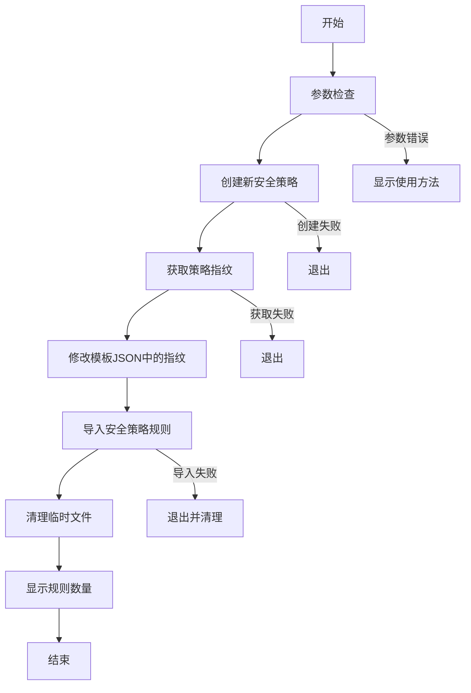

# claude

我将为您创建一个高效的Shell脚本，用于批量导入安全策略规则。​​​​​​​​​​​​​​​​

```bash
#!/bin/bash

# 安全策略批量导入脚本
# 用途：从模板JSON创建新的安全策略并导入所有规则

# 颜色定义
GREEN='\033[0;32m'
YELLOW='\033[1;33m'
RED='\033[0;31m'
NC='\033[0m' # No Color

# 使用方法
function show_usage {
  echo -e "使用方法: $0 <security-policy-name> <template-json-file>"
  echo -e "例如: $0 my-new-security-policy simply.json"
  exit 1
}

# 参数检查
if [ $# -ne 2 ]; then
  show_usage
fi

POLICY_NAME=$1
TEMPLATE_JSON=$2
TEMP_JSON="/tmp/modified_policy_$(date +%s).json"

# 检查模板文件是否存在
if [ ! -f "$TEMPLATE_JSON" ]; then
  echo -e "${RED}错误: 模板文件 $TEMPLATE_JSON 不存在${NC}"
  exit 1
fi

echo -e "${YELLOW}步骤 1: 创建新的安全策略 $POLICY_NAME ${NC}"
gcloud compute security-policies create $POLICY_NAME --description "Created by automation script"

if [ $? -ne 0 ]; then
  echo -e "${RED}创建安全策略失败，请检查策略名称是否已存在${NC}"
  exit 1
fi

echo -e "${YELLOW}步骤 2: 获取新安全策略的指纹${NC}"
FINGERPRINT=$(gcloud compute security-policies describe $POLICY_NAME --format="value(fingerprint)")

if [ -z "$FINGERPRINT" ]; then
  echo -e "${RED}获取指纹失败${NC}"
  exit 1
fi

echo -e "${GREEN}获取到指纹: $FINGERPRINT${NC}"

echo -e "${YELLOW}步骤 3: 修改模板JSON文件中的指纹${NC}"
# 检查JSON是否有fingerprint字段
if grep -q "fingerprint" "$TEMPLATE_JSON"; then
  # 替换指纹
  cat $TEMPLATE_JSON | sed "s/\"fingerprint\": \"[^\"]*\"/\"fingerprint\": \"$FINGERPRINT\"/" > $TEMP_JSON
else
  # 添加指纹（假设是有效的JSON格式）
  cat $TEMPLATE_JSON | sed "s/{/{\"fingerprint\": \"$FINGERPRINT\",/" > $TEMP_JSON
fi

echo -e "${YELLOW}步骤 4: 导入安全策略规则${NC}"
gcloud compute security-policies import $POLICY_NAME --file-name $TEMP_JSON

if [ $? -ne 0 ]; then
  echo -e "${RED}导入安全策略规则失败${NC}"
  rm -f $TEMP_JSON
  exit 1
fi

echo -e "${GREEN}成功导入安全策略规则${NC}"
echo -e "${YELLOW}步骤 5: 清理临时文件${NC}"
rm -f $TEMP_JSON

echo -e "${GREEN}完成！新的安全策略 $POLICY_NAME 已创建并导入所有规则${NC}"

# 显示规则数量进行确认
RULE_COUNT=$(gcloud compute security-policies rules list $POLICY_NAME --format="value(priority)" | wc -l)
echo -e "${GREEN}安全策略包含 $RULE_COUNT 条规则${NC}"
``` 

## 安全策略批量导入方案

脚本已创建，具有以下功能：

1. 创建新的安全策略
2. 自动获取安全策略的指纹值
3. 修改模板JSON文件中的指纹
4. 批量导入所有规则
5. 完成后显示规则数量进行确认

### 使用方法

```bash
./security-policy-import-script.sh <security-policy-name> <template-json-file>
```

例如：

```bash
./security-policy-import-script.sh my-new-security-policy simply.json
```

### 工作流程



这个脚本会大大提高您创建多条安全策略规则的效率，只需维护一个模板JSON文件，然后可以快速应用到新创建的策略。​​​​​​​​​​​​​​​​

# ChatGPT 

你这个场景很常见：通过 JSON 模板导入 Google Cloud Security Policy 规则，确实比逐条用 gcloud compute security-policies rules create 效率高很多。

下面是你要的 Shell 脚本，实现以下流程：
	1.	接收输入参数：安全策略名称 + 模板 JSON 文件（如 simply.json）；
	2.	获取当前 policy 的最新 fingerprint；
	3.	替换模板文件中的 fingerprint 字段；
	4.	使用 gcloud compute security-policies import 执行批量导入操作。

⸻

✅ Shell 脚本示例
```bash
#!/bin/bash

# 参数校验
if [ $# -ne 2 ]; then
  echo "Usage: $0 <SECURITY_POLICY_NAME> <TEMPLATE_JSON_PATH>"
  exit 1
fi

POLICY_NAME="$1"
TEMPLATE_JSON="$2"
TMP_JSON="/tmp/tmp_security_policy.json"

# 获取当前 security policy 的 fingerprint
FINGERPRINT=$(gcloud compute security-policies describe "$POLICY_NAME" \
  --format="value(fingerprint)")

if [ -z "$FINGERPRINT" ]; then
  echo "Failed to get fingerprint for policy: $POLICY_NAME"
  exit 2
fi

echo "Current fingerprint: $FINGERPRINT"

# 替换模板 JSON 中的 fingerprint 字段
cp "$TEMPLATE_JSON" "$TMP_JSON"
sed -i "s/\"fingerprint\": \".*\"/\"fingerprint\": \"$FINGERPRINT\"/" "$TMP_JSON"

# 执行导入操作
gcloud compute security-policies import "$POLICY_NAME" \
  --source="$TMP_JSON" \
  --quiet

if [ $? -eq 0 ]; then
  echo "Successfully imported security policy rules from $TEMPLATE_JSON"
else
  echo "Failed to import rules. Please check the JSON format and fingerprint."
  exit 3
fi
``` 

⸻

📝 使用方法示例

假设你的 security policy 叫 my-policy，模板文件是 simply.json：

chmod +x import_policy.sh
./import_policy.sh my-policy simply.json


⸻

🧠 补充说明
	•	fingerprint 是为了防止并发修改引起的冲突，必须始终使用最新值；
	•	import 操作是全量替换（所有规则），不是增量添加；
	•	如果你只想批量添加而不替换原有规则，那仍需写循环逻辑逐条创建（可以考虑并发优化，比如 xargs -P 或 parallel）；
	•	sed -i 是 GNU 风格（Linux），如果你在 macOS，请改为 sed -i '' ...。

⸻

如你之后需要支持多环境或者多策略名，可以继续封装成函数或加循环。如果你有多个 policy 一起导入，也可以告诉我，我可以帮你改造成批量导入脚本。

# grok
在使用 Google Cloud Armor 创建安全策略规则时，如果你需要批量创建大量规则（例如50条），通过逐条执行 gcloud compute security-policies rules create 命令确实效率较低。Google Cloud 提供了更高效的方法来批量管理安全策略规则，主要通过 原子更新（atomic updates） 和 导入/导出安全策略 的方式。以下是详细的解决方案和步骤，结合你的需求，我会提供 Markdown 格式的回答，并包含流程图和代码示例。

  

高效创建和更新多条 Google Cloud Armor 安全策略规则

问题分析

- 逐条创建规则的低效性：每次执行 gcloud compute security-policies rules create 都会发起单独的 API 调用，创建50条规则需要50次 API 请求，耗时较长且容易出错。
- 解决方案：通过导出安全策略到 YAML/JSON 文件，批量编辑规则，然后使用 gcloud compute security-policies import 一次性导入所有规则，实现原子更新。这种方法可以大幅减少 API 调用次数，提高效率。

推荐方法：使用 YAML/JSON 文件批量管理规则

Google Cloud Armor 支持将安全策略导出为 YAML 或 JSON 文件，编辑后通过 import 命令一次性更新所有规则。这种方法适合批量创建或更新大量规则。

步骤 1：创建或导出安全策略

1. 如果还没有安全策略，先创建一个：  
    gcloud compute security-policies create my-policy \
2.     --description "My security policy"
3.   
    
4. 导出当前安全策略到 YAML 文件（即使是新创建的策略，也可以导出）：  
    gcloud compute security-policies export my-policy \
5.     --file-name my-policy.yaml \
6.     --file-format yaml
7.   
    这会生成一个 my-policy.yaml 文件，包含策略的当前配置（包括默认规则）。

步骤 2：编辑 YAML 文件添加规则

打开 my-policy.yaml 文件，添加你的50条规则。以下是一个示例 YAML 文件，包含多条规则：
```yaml
name: my-policy

description: My security policy

rules:

  - action: deny(403)

    priority: 1000

    match:

      versionedExpr: SRC_IPS_V1

      config:

        srcIpRanges:

        - 192.0.2.0/24

        - 198.51.100.0/24

    description: Block traffic from specific IP ranges

  - action: allow

    priority: 2000

    match:

      expr:

        expression: "request.path.matches('/login.html')"

    description: Allow access to login page

  - action: throttle

    priority: 3000

    match:

      versionedExpr: SRC_IPS_V1

      config:

        srcIpRanges:

        - "*"

    rateLimitOptions:

      conformAction: allow

      exceedAction: deny(404)

      enforceOnKey: IP

      rateLimit InfinitiveThreshold:

        count: 100

        intervalSec: 60

    description: Throttle requests from all IPs

  # 继续添加其他规则...

  - action: allow

    priority: 2147483647

    match:

      versionedExpr: SRC_IPS_V1

      config:

        srcIpRanges:

        - "*"

    description: Default allow rule

注意：

- 每条规则需要指定唯一的 priority（优先级，0 为最高，2147483647 为最低）。
- 默认规则通常使用优先级 2147483647，匹配所有流量（srcIpRanges: ["*"]）。
- 你可以根据需要添加复杂的匹配条件（如 expression）或速率限制（rateLimitOptions）。

步骤 3：导入更新后的安全策略

使用以下命令将编辑好的 YAML 文件导入，原子更新所有规则：

gcloud compute security-policies import my-policy \

    --file-name my-policy.yaml \

    --file-format yaml

这会一次性将 YAML 文件中的所有规则应用到 my-policy 策略，效率远高于逐条创建。

步骤 4：验证规则

检查安全策略是否正确更新：

gcloud compute security-policies describe my-policy

列出所有规则：

gcloud compute security-policies rules list \

    --security-policy my-policy

步骤 5：关联策略到后端服务

如果需要，将安全策略关联到目标后端服务：

gcloud compute backend-services update my-backend-service \

    --security-policy my-policy \

    --global

流程图

以下是批量创建安全策略规则的流程图，使用 Mermaid 格式：

graph TD

    A[创建或选择安全策略] --> B[导出策略到 YAML 文件]

    B --> C[编辑 YAML 文件，添加多条规则]

    C --> D[导入 YAML 文件，原子更新策略]

    D --> E[验证规则是否正确应用]

    E --> F[关联策略到后端服务]

其他高效方法

1. 使用 Terraform 管理规则： 如果你熟悉 Terraform，可以使用 gcp.compute.SecurityPolicy 资源来定义和批量管理规则。以下是一个 Terraform 示例：resource "google_compute_security_policy" "policy" {
2.   name = "my-policy"
3.   description = "My security policy"
4.   
    
5.   rule {
6.     action = "deny(403)"
7.     priority = 1000
8.     match {
9.       versioned_expr = "SRC_IPS_V1"
10.       config {
11.         src_ip_ranges = ["192.0.2.0/24", "198.51.100.0/24"]
12.       }
13.     }
14.     description = "Block traffic from specific IP ranges"
15.   }
16.   
    
17.   rule {
18.     action = "allow"
19.     priority = 2000
20.     match {
21.       expr {
22.         expression = "request.path.matches('/login.html')"
23.       }
24.     }
25.     description = "Allow access to login page"
26.   }
27.   
    
28.   rule {
29.     action = "allow"
30.     priority = 2147483647
31.     match {
32.       versioned_expr = "SRC_IPS_V1"
33.       config {
34.         src_ip_ranges = ["*"]
35.       }
36.     }
37.     description = "Default allow rule"
38.   }
39. }
40.   
    运行 terraform apply 即可一次性创建所有规则。Terraform 适合基础设施即代码（IaC）管理，适合长期维护。
41. 使用脚本自动化： 如果你有规则的模板或数据源（例如 CSV 文件），可以用脚本（Python/Bash）生成 YAML 文件或直接调用 gcloud 命令。例如，使用 Python 结合 PyYAML 动态生成 YAML 文件，然后导入。import yaml
42.   
    
43. policy = {
44.     "name": "my-policy",
45.     "description": "My security policy",
46.     "rules": [
47.         {
48.             "action": "deny(403)",
49.             "priority": 1000,
50.             "match": {
51.                 "versionedExpr": "SRC_IPS_V1",
52.                 "config": {
53.                     "srcIpRanges": ["192.0.2.0/24", "198.51.100.0/24"]
54.                 }
55.             },
56.             "description": "Block traffic from specific IP ranges"
57.         },
58.         # 添加更多规则...
59.         {
60.             "action": "allow",
61.             "priority": 2147483647,
62.             "match": {
63.                 "versionedExpr": "SRC_IPS_V1",
64.                 "config": {
65.                     "srcIpRanges": ["*"]
66.                 }
67.             },
68.             "description": "Default allow rule"
69.         }
70.     ]
71. }
72.   
    
73. with open("my-policy.yaml", "w") as f:
74.     yaml.dump(policy, f, default_flow_style=False)
75.   
    然后运行：  
    gcloud compute security-policies import my-policy --file-name my-policy.yaml --file-format yaml
76.   
    

优点与注意事项

优点

- 高效性：原子更新通过一次 API 调用完成所有规则的创建/更新，适合处理50条或更多规则。
- 一致性：避免逐条更新可能导致的中间状态不一致问题。
- 可维护性：YAML/JSON 文件或 Terraform 配置文件易于版本控制，便于团队协作和审计。

注意事项

- 优先级管理：确保每条规则的优先级唯一，避免冲突。优先级从 0（最高）到 2147483647（最低）。
- 指纹验证：如果策略被其他用户修改，导入时需要最新的指纹（fingerprint）。可通过 gcloud compute security-policies describe my-policy 获取指纹并在导入时指定：gcloud compute security-policies import my-policy \
-     --file-name my-policy.yaml \
-     --file-format yaml \
-     --fingerprint 
-   
    
- 预览模式：如果需要测试规则效果，可以在 YAML 中为规则添加 preview: true，启用后规则仅记录不执行。
- 日志启用：确保后端服务启用了 HTTP(S) 日志，以便监控规则效果：  
    gcloud compute backend-services update my-backend-service \
-     --enable-logging \
-     --logging-sample-rate=1 \
-     --global
-   
    

示例表格：规则优先级与描述

以下是一个示例 Markdown 表格，展示部分规则的配置：

|   |   |   |   |
|---|---|---|---|
|Priority|Action|Match Condition|Description|
|1000|deny(403)|srcIpRanges: 192.0.2.0/24, 198.51.100.0/24|Block specific IP ranges|
|2000|allow|request.path.matches(’/login.html’)|Allow access to login page|
|3000|throttle|srcIpRanges: *|Throttle all IPs (100 req/60s)|
|2147483647|allow|srcIpRanges: *|Default allow rule|

参考资料

- Google Cloud Armor 官方文档：
- gcloud compute security-policies 命令参考：

  

通过上述方法，你可以高效地创建和更新50条或更多 Google Cloud Armor 安全策略规则。如果你有更具体的需求（例如特定的规则类型或自动化脚本），请提供更多细节，我可以进一步优化方案！


你的场景描述非常清晰：你有一个预定义的 simply.json 文件作为模板，包含一组默认的 Google Cloud Armor 安全策略规则，希望通过 gcloud compute security-policies import 命令将这些规则导入到一个新创建的安全策略中。但由于 Google Cloud Armor 的原子更新机制，要求导入时提供的 JSON 文件中的指纹（fingerprint）必须与目标策略的当前指纹一致，因此你需要在导入前手动更新 simply.json 中的指纹值。这种方法虽然可行，但手动更新指纹值会增加操作复杂性和出错风险。以下是针对你的场景的优化方案，旨在提高效率并尽量自动化，同时遵循你的 Markdown 格式和流程图要求。

优化方案：高效导入 Google Cloud Armor 安全策略规则
问题分析
	•	当前流程：你创建一个新的安全策略，获取其指纹，修改 simply.json 中的指纹值，然后通过 gcloud compute security-policies import 导入规则。
	•	痛点：
	◦	手动更新指纹值繁琐，尤其当你需要频繁创建或更新多个策略时。
	◦	如果指纹不匹配，导入会失败，导致重复操作。
	•	优化目标：
	◦	减少手动更新指纹的操作。
	◦	提供自动化的方式处理指纹或绕过指纹验证。
	◦	保持 simply.json 作为通用模板的复用性。
推荐方法：自动化指纹处理与规则导入
以下是优化的步骤和工具，结合你的场景，提供高效的批量规则创建方法。
步骤 1：准备模板 JSON 文件
假设你的 simply.json 是一个模板，包含默认规则。以下是一个示例 simply.json 文件：
{
  "name": "my-policy",
  "description": "My default security policy",
  "rules": [
    {
      "action": "deny(403)",
      "priority": 1000,
      "match": {
        "versionedExpr": "SRC_IPS_V1",
        "config": {
          "srcIpRanges": ["192.0.2.0/24", "198.51.100.0/24"]
        }
      },
      "description": "Block specific IP ranges"
    },
    {
      "action": "allow",
      "priority": 2000,
      "match": {
        "expr": {
          "expression": "request.path.matches('/login.html')"
        }
      },
      "description": "Allow access to login page"
    },
    {
      "action": "allow",
      "priority": 2147483647,
      "match": {
        "versionedExpr": "SRC_IPS_V1",
        "config": {
          "srcIpRanges": ["*"]
        }
      },
      "description": "Default allow rule"
    }
  ]
}
注意：模板中的 name 字段在导入时会被替换为目标策略的名称，因此可以保留占位值（如 "my-policy"）。指纹字段（fingerprint）在模板中可以暂时省略，稍后通过脚本动态添加。
步骤 2：创建新安全策略
创建一个新的安全策略（如果尚未创建）：
gcloud compute security-policies create my-new-policy \
    --description "New security policy"
步骤 3：获取目标策略的指纹
为了避免手动修改 simply.json 中的指纹，你可以通过以下命令获取新策略的指纹：
gcloud compute security-policies describe my-new-policy --format="value(fingerprint)"
这会输出一个 Base64 编码的指纹值，例如 C2FtZS1maW5nZXJwcmludA==。
步骤 4：自动化更新指纹并导入规则
手动修改指纹值效率低下，推荐使用脚本（例如 Bash 或 Python）自动获取指纹并更新 simply.json，然后执行导入。以下是一个 Bash 脚本示例：
#!/bin/bash

# 目标安全策略名称
POLICY_NAME="my-new-policy"
TEMPLATE_FILE="simply.json"
TEMP_FILE="temp-policy.json"

# 获取目标策略的指纹
FINGERPRINT=$(gcloud compute security-policies describe $POLICY_NAME --format="value(fingerprint)")

# 检查指纹是否获取成功
if [ -z "$FINGERPRINT" ]; then
  echo "Error: Failed to retrieve fingerprint for $POLICY_NAME"
  exit 1
fi

# 复制模板并更新指纹
jq --arg fingerprint "$FINGERPRINT" '. + {fingerprint: $fingerprint}' "$TEMPLATE_FILE" > "$TEMP_FILE"

# 导入更新后的 JSON 文件
gcloud compute security-policies import $POLICY_NAME \
    --file-name "$TEMP_FILE" \
    --file-format json

# 清理临时文件
rm "$TEMP_FILE"

echo "Rules imported successfully to $POLICY_NAME"
说明：
	•	使用 jq 工具动态将指纹添加到 simply.json，生成临时文件 temp-policy.json。
	•	jq 是一个轻量级的 JSON 处理工具，需确保已安装（sudo apt-get install jq 或 brew install jq）。
	•	导入完成后，删除临时文件以保持干净。
步骤 5：验证规则
检查导入的规则是否正确应用：
gcloud compute security-policies describe my-new-policy
列出所有规则：
gcloud compute security-policies rules list \
    --security-policy my-new-policy
步骤 6：关联策略到后端服务（可选）
如果需要，将安全策略关联到目标后端服务：
gcloud compute backend-services update my-backend-service \
    --security-policy my-new-policy \
    --global
流程图
以下是自动化导入规则的流程图，使用 Mermaid 格式：
graph TD
    A[准备 simply.json 模板] --> B[创建新安全策略]
    B --> C[获取目标策略的指纹]
    C --> D[使用脚本更新 simply.json 中的指纹]
    D --> E[导入 JSON 文件到安全策略]
    E --> F[验证规则是否正确应用]
    F --> G[关联策略到后端服务（可选）]
替代方法：绕过指纹验证
如果你的 simply.json 模板只用于新创建的策略，且不涉及并发修改，可以省略指纹字段，直接导入。Google Cloud Armor 在导入到新策略时，如果 JSON 文件中没有指纹字段，会忽略指纹验证。步骤如下：
	1	确保 simply.json 不包含 fingerprint 字段。
	2	创建新策略：
gcloud compute security-policies create my-new-policy
	3	
	4	直接导入：
gcloud compute security-policies import my-new-policy \
	5	    --file-name simply.json \
	6	    --file-format json
	7	
注意：此方法仅适用于新策略或无并发修改的场景。如果策略已被其他用户或进程修改，导入可能会失败，提示需要指纹。
Python 脚本示例（可选）
如果你更倾向于使用 Python 自动化，以下是一个等效的 Python 脚本，使用 google-cloud-securitycenter 或直接调用 gcloud 命令：
import json
import subprocess
import os

def import_security_policy(policy_name, template_file):
    # 获取指纹
    result = subprocess.run(
        ["gcloud", "compute", "security-policies", "describe", policy_name, "--format=value(fingerprint)"],
        capture_output=True,
        text=True
    )
    fingerprint = result.stdout.strip()
    if not fingerprint:
        raise Exception(f"Failed to retrieve fingerprint for {policy_name}")

    # 读取模板 JSON
    with open(template_file, "r") as f:
        policy_data = json.load(f)

    # 添加指纹
    policy_data["fingerprint"] = fingerprint

    # 写入临时文件
    temp_file = "temp-policy.json"
    with open(temp_file, "w") as f:
        json.dump(policy_data, f, indent=2)

    # 执行导入
    subprocess.run(
        [
            "gcloud", "compute", "security-policies", "import", policy_name,
            "--file-name", temp_file,
            "--file-format", "json"
        ],
        check=True
    )

    # 清理临时文件
    os.remove(temp_file)
    print(f"Rules imported successfully to {policy_name}")

if __name__ == "__main__":
    import_security_policy("my-new-policy", "simply.json")
依赖：需要安装 subprocess 和 json（Python 内置模块）。如果直接调用 Google Cloud API，还需安装 google-cloud-securitycenter。
优点与注意事项
优点
	•	自动化：通过脚本自动获取和更新指纹，减少手动操作。
	•	可复用：simply.json 作为模板可重复使用，适合批量创建多个策略。
	•	一致性：原子更新确保规则一次性应用，避免中间状态问题。
注意事项
	•	指纹冲突：如果策略被其他用户或进程修改，指纹可能失效，需重新获取。
	•	工具依赖：Bash 脚本需要 jq，Python 脚本需要 subprocess 或 Google Cloud SDK。
	•	规则优先级：确保 simply.json 中的规则优先级（priority）唯一且合理（0 为最高，2147483647 为最低）。
	•	日志监控：建议启用后端服务日志以验证规则效果：
gcloud compute backend-services update my-backend-service \
	•	    --enable-logging \
	•	    --logging-sample-rate=1 \
	•	    --global
	•	
示例表格：规则配置
以下是 simply.json 中规则的 Markdown 表格示例：
Priority
Action
Match Condition
Description
1000
deny(403)
srcIpRanges: 192.0.2.0/24, 198.51.100.0/24
Block specific IP ranges
2000
allow
request.path.matches(’/login.html’)
Allow access to login page
2147483647
allow
srcIpRanges: *
Default allow rule
扩展建议
	1	版本控制：将 simply.json 纳入 Git 仓库，便于跟踪模板变化。
	2	参数化模板：如果需要为不同策略生成不同规则，可以在 simply.json 中使用占位符，结合脚本动态替换。例如，使用 sed 或 Python 替换 IP 地址或路径。
	3	Terraform 替代：如果长期管理多个策略，考虑使用 Terraform 定义规则（参考上一回答中的 Terraform 示例），避免手动处理 JSON。
参考资料
	•	Google Cloud Armor 官方文档
	•	gcloud compute security-policies import 命令参考

通过上述方案，你可以高效地使用 simply.json 模板创建规则，自动化处理指纹问题。如果你有更复杂的场景（例如动态生成规则或多策略管理），请提供更多细节，我可以进一步定制解决方案！
