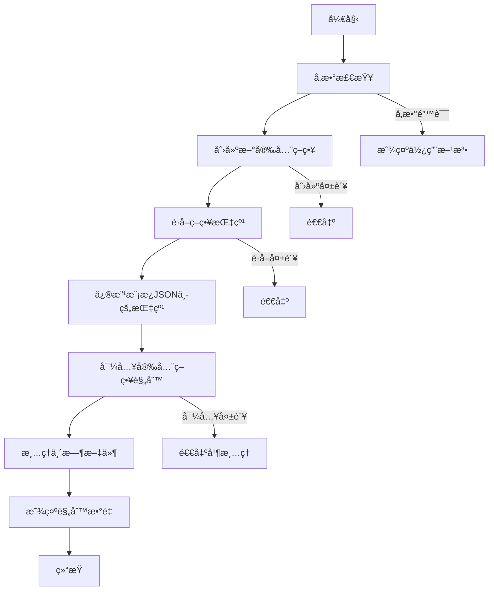

# claude

我将为您创建一个高效的Shell脚本，用äºæ‰¹é‡å¯¼å…¥å®‰å…¨ç­–略规则。​​​​​​​​​​​​​​​​

```bash
#!/bin/bash

# 安全策略批é‡å¯¼å…¥è„šæœ¬
# 用途：ä»æ¨¡æ¿JSON创建新的安全策略并导入所有规则

# 颜色定义
GREEN='\033[0;32m'
YELLOW='\033[1;33m'
RED='\033[0;31m'
NC='\033[0m' # No Color

# 使用方法
function show_usage {
  echo -e "使用方法: $0 <security-policy-name> <template-json-file>"
  echo -e "例如: $0 my-new-security-policy simply.json"
  exit 1
}

# å‚数检查
if [ $# -ne 2 ]; then
  show_usage
fi

POLICY_NAME=$1
TEMPLATE_JSON=$2
TEMP_JSON="/tmp/modified_policy_$(date +%s).json"

# 检查模æ¿æ–‡ä»¶æ˜¯å¦å­˜åœ¨
if [ ! -f "$TEMPLATE_JSON" ]; then
  echo -e "${RED}错误: 模æ¿æ–‡ä»¶ $TEMPLATE_JSON ä¸å­˜åœ¨${NC}"
  exit 1
fi

echo -e "${YELLOW}步骤 1: 创建新的安全策略 $POLICY_NAME ${NC}"
gcloud compute security-policies create $POLICY_NAME --description "Created by automation script"

if [ $? -ne 0 ]; then
  echo -e "${RED}创建安全策略失败，请检查策略å称是å¦å·²å­˜åœ¨${NC}"
  exit 1
fi

echo -e "${YELLOW}步骤 2: è·å–新安全策略的指纹${NC}"
FINGERPRINT=$(gcloud compute security-policies describe $POLICY_NAME --format="value(fingerprint)")

if [ -z "$FINGERPRINT" ]; then
  echo -e "${RED}è·å–指纹失败${NC}"
  exit 1
fi

echo -e "${GREEN}è·å–到指纹: $FINGERPRINT${NC}"

echo -e "${YELLOW}步骤 3: 修改模æ¿JSON文件中的指纹${NC}"
# 检查JSON是å¦æœ‰fingerprint字段
if grep -q "fingerprint" "$TEMPLATE_JSON"; then
  # 替æ¢æŒ‡çº¹
  cat $TEMPLATE_JSON | sed "s/\"fingerprint\": \"[^\"]*\"/\"fingerprint\": \"$FINGERPRINT\"/" > $TEMP_JSON
else
  # 添加指纹（å‡è®¾æ˜¯æœ‰æ•ˆçš„JSONæ ¼å¼ï¼‰
  cat $TEMPLATE_JSON | sed "s/{/{\"fingerprint\": \"$FINGERPRINT\",/" > $TEMP_JSON
fi

echo -e "${YELLOW}步骤 4: 导入安全策略规则${NC}"
gcloud compute security-policies import $POLICY_NAME --file-name $TEMP_JSON

if [ $? -ne 0 ]; then
  echo -e "${RED}导入安全策略规则失败${NC}"
  rm -f $TEMP_JSON
  exit 1
fi

echo -e "${GREEN}æˆåŠŸå¯¼å…¥å®‰å…¨ç­–略规则${NC}"
echo -e "${YELLOW}步骤 5: 清ç†ä¸´æ—¶æ–‡ä»¶${NC}"
rm -f $TEMP_JSON

echo -e "${GREEN}完æˆï¼æ–°çš„安全策略 $POLICY_NAME 已创建并导入所有规则${NC}"

# 显示规则数é‡è¿›è¡Œç¡®è®¤
RULE_COUNT=$(gcloud compute security-policies rules list $POLICY_NAME --format="value(priority)" | wc -l)
echo -e "${GREEN}å®‰å…¨ç­–ç•¥åŒ…å« $RULE_COUNT æ¡è§„则${NC}"
``` 

## 安全策略批é‡å¯¼å…¥æ–¹æ¡ˆ

脚本已创建，具有以下功能：

1. 创建新的安全策略
2. 自动è·å–安全策略的指纹值
3. 修改模æ¿JSON文件中的指纹
4. 批é‡å¯¼å…¥æ‰€æœ‰è§„则
5. 完æˆå显示规则数é‡è¿›è¡Œç¡®è®¤

### 使用方法

```bash
./security-policy-import-script.sh <security-policy-name> <template-json-file>
```

例如：

```bash
./security-policy-import-script.sh my-new-security-policy simply.json
```

### 工作æµç¨‹



这个脚本会大大æ高您创建多æ¡å®‰å…¨ç­–略规则的效ç‡ï¼Œåªéœ€ç»´æŠ¤ä¸€ä¸ªæ¨¡æ¿JSON文件，然åå¯ä»¥å¿«é€Ÿåº”用到新创建的策略。​​​​​​​​​​​​​​​​

# ChatGPT 

你这个场景很常è§ï¼šé€šè¿‡ JSON 模æ¿å¯¼å…¥ Google Cloud Security Policy 规则，确å®æ¯”é€æ¡ç”¨ gcloud compute security-policies rules create 效ç‡é«˜å¾ˆå¤šã€‚

下é¢æ˜¯ä½ è¦çš„ Shell 脚本，å®ç°ä»¥ä¸‹æµç¨‹ï¼š
	1.	æ¥æ”¶è¾“å…¥å‚数：安全策略å称 + æ¨¡æ¿ JSON 文件（如 simply.json）；
	2.	è·å–å½“å‰ policy 的最新 fingerprintï¼›
	3.	替æ¢æ¨¡æ¿æ–‡ä»¶ä¸­çš„ fingerprint 字段；
	4.	使用 gcloud compute security-policies import 执行批é‡å¯¼å…¥æ“作。

⸻

✅ Shell 脚本示例
```bash
#!/bin/bash

# å‚数校验
if [ $# -ne 2 ]; then
  echo "Usage: $0 <SECURITY_POLICY_NAME> <TEMPLATE_JSON_PATH>"
  exit 1
fi

POLICY_NAME="$1"
TEMPLATE_JSON="$2"
TMP_JSON="/tmp/tmp_security_policy.json"

# è·å–å½“å‰ security policy çš„ fingerprint
FINGERPRINT=$(gcloud compute security-policies describe "$POLICY_NAME" \
  --format="value(fingerprint)")

if [ -z "$FINGERPRINT" ]; then
  echo "Failed to get fingerprint for policy: $POLICY_NAME"
  exit 2
fi

echo "Current fingerprint: $FINGERPRINT"

# 替æ¢æ¨¡æ¿ JSON 中的 fingerprint 字段
cp "$TEMPLATE_JSON" "$TMP_JSON"
sed -i "s/\"fingerprint\": \".*\"/\"fingerprint\": \"$FINGERPRINT\"/" "$TMP_JSON"

# 执行导入æ“作
gcloud compute security-policies import "$POLICY_NAME" \
  --source="$TMP_JSON" \
  --quiet

if [ $? -eq 0 ]; then
  echo "Successfully imported security policy rules from $TEMPLATE_JSON"
else
  echo "Failed to import rules. Please check the JSON format and fingerprint."
  exit 3
fi
``` 

⸻

📠使用方法示例

å‡è®¾ä½ çš„ security policy å« my-policy，模æ¿æ–‡ä»¶æ˜¯ simply.json：

chmod +x import_policy.sh
./import_policy.sh my-policy simply.json


⸻

🧠 补充说æ˜
	•	fingerprint 是为了防止并å‘修改引起的冲çªï¼Œå¿…须始终使用最新值；
	•	import æ“作是全é‡æ›¿æ¢ï¼ˆæ‰€æœ‰è§„则），ä¸æ˜¯å¢é‡æ·»åŠ ï¼›
	•	如æœä½ åªæƒ³æ‰¹é‡æ·»åŠ è€Œä¸æ›¿æ¢åŸæœ‰è§„则，那ä»éœ€å†™å¾ªç¯é€»è¾‘é€æ¡åˆ›å»ºï¼ˆå¯ä»¥è€ƒè™‘并å‘优化，比如 xargs -P 或 parallel）；
	•	sed -i 是 GNU é£æ ¼ï¼ˆLinux），如æœä½ åœ¨ macOS，请改为 sed -i '' ...。

⸻

如你之å需è¦æ”¯æŒå¤šç¯å¢ƒæˆ–者多策略å，å¯ä»¥ç»§ç»­å°è£…æˆå‡½æ•°æˆ–加循ç¯ã€‚如æœä½ æœ‰å¤šä¸ª policy 一起导入，也å¯ä»¥å‘Šè¯‰æˆ‘，我å¯ä»¥å¸®ä½ æ”¹é€ æˆæ‰¹é‡å¯¼å…¥è„šæœ¬ã€‚

# grok
在使用 Google Cloud Armor 创建安全策略规则时，如æœä½ éœ€è¦æ‰¹é‡åˆ›å»ºå¤§é‡è§„则（例如50æ¡ï¼‰ï¼Œé€šè¿‡é€æ¡æ‰§è¡Œ gcloud compute security-policies rules create 命令确å®æ•ˆç‡è¾ƒä½ã€‚Google Cloud æ供了更高效的方法æ¥æ‰¹é‡ç®¡ç†å®‰å…¨ç­–略规则，主è¦é€šè¿‡ åŸå­æ›´æ–°ï¼ˆatomic updates） å’Œ 导入/导出安全策略 çš„æ–¹å¼ã€‚以下是详细的解决方案和步骤，结åˆä½ çš„需求，我会æä¾› Markdown æ ¼å¼çš„å›ç­”，并包å«æµç¨‹å›¾å’Œä»£ç ç¤ºä¾‹ã€‚

  

é«˜æ•ˆåˆ›å»ºå’Œæ›´æ–°å¤šæ¡ Google Cloud Armor 安全策略规则

问题分æ

- é€æ¡åˆ›å»ºè§„则的ä½æ•ˆæ€§ï¼šæ¯æ¬¡æ‰§è¡Œ gcloud compute security-policies rules create 都会å‘èµ·å•ç‹¬çš„ API 调用，创建50æ¡è§„则需è¦50次 API 请求，耗时较长且容易出错。
- 解决方案：通过导出安全策略到 YAML/JSON 文件，批é‡ç¼–辑规则，然å使用 gcloud compute security-policies import 一次性导入所有规则，å®ç°åŸå­æ›´æ–°ã€‚è¿™ç§æ–¹æ³•å¯ä»¥å¤§å¹…å‡å°‘ API 调用次数，æ高效ç‡ã€‚

æ¨è方法：使用 YAML/JSON 文件批é‡ç®¡ç†è§„则

Google Cloud Armor 支æŒå°†å®‰å…¨ç­–略导出为 YAML 或 JSON 文件，编辑å通过 import 命令一次性更新所有规则。这ç§æ–¹æ³•é€‚åˆæ‰¹é‡åˆ›å»ºæˆ–更新大é‡è§„则。

步骤 1：创建或导出安全策略

1. 如æœè¿˜æ²¡æœ‰å®‰å…¨ç­–略，先创建一个：  
    gcloud compute security-policies create my-policy \
2.     --description "My security policy"
3.   
    
4. 导出当å‰å®‰å…¨ç­–略到 YAML 文件（å³ä½¿æ˜¯æ–°åˆ›å»ºçš„策略，也å¯ä»¥å¯¼å‡ºï¼‰ï¼š  
    gcloud compute security-policies export my-policy \
5.     --file-name my-policy.yaml \
6.     --file-format yaml
7.   
    这会生æˆä¸€ä¸ª my-policy.yaml 文件，包å«ç­–略的当å‰é…置（包括默认规则）。

步骤 2：编辑 YAML 文件添加规则

打开 my-policy.yaml 文件，添加你的50æ¡è§„则。以下是一个示例 YAML 文件，包å«å¤šæ¡è§„则：
```yaml
name: my-policy

description: My security policy

rules:

  - action: deny(403)

    priority: 1000

    match:

      versionedExpr: SRC_IPS_V1

      config:

        srcIpRanges:

        - 192.0.2.0/24

        - 198.51.100.0/24

    description: Block traffic from specific IP ranges

  - action: allow

    priority: 2000

    match:

      expr:

        expression: "request.path.matches('/login.html')"

    description: Allow access to login page

  - action: throttle

    priority: 3000

    match:

      versionedExpr: SRC_IPS_V1

      config:

        srcIpRanges:

        - "*"

    rateLimitOptions:

      conformAction: allow

      exceedAction: deny(404)

      enforceOnKey: IP

      rateLimit InfinitiveThreshold:

        count: 100

        intervalSec: 60

    description: Throttle requests from all IPs

  # 继续添加其他规则...

  - action: allow

    priority: 2147483647

    match:

      versionedExpr: SRC_IPS_V1

      config:

        srcIpRanges:

        - "*"

    description: Default allow rule

注æ„：

- æ¯æ¡è§„则需è¦æŒ‡å®šå”¯ä¸€çš„ priority（优先级，0 为最高，2147483647 为最ä½ï¼‰ã€‚
- 默认规则通常使用优先级 2147483647，匹é…所有æµé‡ï¼ˆsrcIpRanges: ["*"]）。
- ä½ å¯ä»¥æ ¹æ®éœ€è¦æ·»åŠ å¤æ‚的匹é…æ¡ä»¶ï¼ˆå¦‚ expression）或速ç‡é™åˆ¶ï¼ˆrateLimitOptions）。

步骤 3：导入更新å的安全策略

使用以下命令将编辑好的 YAML 文件导入，åŸå­æ›´æ–°æ‰€æœ‰è§„则：

gcloud compute security-policies import my-policy \

    --file-name my-policy.yaml \

    --file-format yaml

这会一次性将 YAML 文件中的所有规则应用到 my-policy 策略，效ç‡è¿œé«˜äºé€æ¡åˆ›å»ºã€‚

步骤 4：验è¯è§„则

检查安全策略是å¦æ­£ç¡®æ›´æ–°ï¼š

gcloud compute security-policies describe my-policy

列出所有规则：

gcloud compute security-policies rules list \

    --security-policy my-policy

步骤 5：关è”策略到å端æœåŠ¡

如æœéœ€è¦ï¼Œå°†å®‰å…¨ç­–略关è”到目标å端æœåŠ¡ï¼š

gcloud compute backend-services update my-backend-service \

    --security-policy my-policy \

    --global

æµç¨‹å›¾

以下是批é‡åˆ›å»ºå®‰å…¨ç­–略规则的æµç¨‹å›¾ï¼Œä½¿ç”¨ Mermaid æ ¼å¼ï¼š

graph TD

    A[创建或选择安全策略] --> B[导出策略到 YAML 文件]

    B --> C[编辑 YAML 文件，添加多æ¡è§„则]

    C --> D[导入 YAML 文件，åŸå­æ›´æ–°ç­–ç•¥]

    D --> E[验è¯è§„则是å¦æ­£ç¡®åº”用]

    E --> F[å…³è”策略到å端æœåŠ¡]

其他高效方法

1. 使用 Terraform 管ç†è§„则： 如æœä½ ç†Ÿæ‚‰ Terraform，å¯ä»¥ä½¿ç”¨ gcp.compute.SecurityPolicy 资æºæ¥å®šä¹‰å’Œæ‰¹é‡ç®¡ç†è§„则。以下是一个 Terraform 示例：resource "google_compute_security_policy" "policy" {
2.   name = "my-policy"
3.   description = "My security policy"
4.   
    
5.   rule {
6.     action = "deny(403)"
7.     priority = 1000
8.     match {
9.       versioned_expr = "SRC_IPS_V1"
10.       config {
11.         src_ip_ranges = ["192.0.2.0/24", "198.51.100.0/24"]
12.       }
13.     }
14.     description = "Block traffic from specific IP ranges"
15.   }
16.   
    
17.   rule {
18.     action = "allow"
19.     priority = 2000
20.     match {
21.       expr {
22.         expression = "request.path.matches('/login.html')"
23.       }
24.     }
25.     description = "Allow access to login page"
26.   }
27.   
    
28.   rule {
29.     action = "allow"
30.     priority = 2147483647
31.     match {
32.       versioned_expr = "SRC_IPS_V1"
33.       config {
34.         src_ip_ranges = ["*"]
35.       }
36.     }
37.     description = "Default allow rule"
38.   }
39. }
40.   
    è¿è¡Œ terraform apply å³å¯ä¸€æ¬¡æ€§åˆ›å»ºæ‰€æœ‰è§„则。Terraform 适åˆåŸºç¡€è®¾æ–½å³ä»£ç ï¼ˆIaC）管ç†ï¼Œé€‚åˆé•¿æœŸç»´æŠ¤ã€‚
41. 使用脚本自动化： 如æœä½ æœ‰è§„则的模æ¿æˆ–æ•°æ®æºï¼ˆä¾‹å¦‚ CSV 文件），å¯ä»¥ç”¨è„šæœ¬ï¼ˆPython/Bashï¼‰ç”Ÿæˆ YAML 文件或直æ¥è°ƒç”¨ gcloud 命令。例如，使用 Python ç»“åˆ PyYAML 动æ€ç”Ÿæˆ YAML 文件，然å导入。import yaml
42.   
    
43. policy = {
44.     "name": "my-policy",
45.     "description": "My security policy",
46.     "rules": [
47.         {
48.             "action": "deny(403)",
49.             "priority": 1000,
50.             "match": {
51.                 "versionedExpr": "SRC_IPS_V1",
52.                 "config": {
53.                     "srcIpRanges": ["192.0.2.0/24", "198.51.100.0/24"]
54.                 }
55.             },
56.             "description": "Block traffic from specific IP ranges"
57.         },
58.         # 添加更多规则...
59.         {
60.             "action": "allow",
61.             "priority": 2147483647,
62.             "match": {
63.                 "versionedExpr": "SRC_IPS_V1",
64.                 "config": {
65.                     "srcIpRanges": ["*"]
66.                 }
67.             },
68.             "description": "Default allow rule"
69.         }
70.     ]
71. }
72.   
    
73. with open("my-policy.yaml", "w") as f:
74.     yaml.dump(policy, f, default_flow_style=False)
75.   
    然åè¿è¡Œï¼š  
    gcloud compute security-policies import my-policy --file-name my-policy.yaml --file-format yaml
76.   
    

优点ä¸æ³¨æ„事项

优点

- 高效性：åŸå­æ›´æ–°é€šè¿‡ä¸€æ¬¡ API 调用完æˆæ‰€æœ‰è§„则的创建/更新，适åˆå¤„ç†50æ¡æˆ–更多规则。
- 一致性：é¿å…é€æ¡æ›´æ–°å¯èƒ½å¯¼è‡´çš„中间状æ€ä¸ä¸€è‡´é—®é¢˜ã€‚
- å¯ç»´æŠ¤æ€§ï¼šYAML/JSON 文件或 Terraform é…置文件易äºç‰ˆæœ¬æ§åˆ¶ï¼Œä¾¿äºå›¢é˜Ÿå作和审计。

注æ„事项

- 优先级管ç†ï¼šç¡®ä¿æ¯æ¡è§„则的优先级唯一，é¿å…冲çªã€‚ä¼˜å…ˆçº§ä» 0（最高）到 2147483647（最ä½ï¼‰ã€‚
- 指纹验è¯ï¼šå¦‚æœç­–略被其他用户修改，导入时需è¦æœ€æ–°çš„指纹（fingerprint）。å¯é€šè¿‡ gcloud compute security-policies describe my-policy è·å–指纹并在导入时指定：gcloud compute security-policies import my-policy \
-     --file-name my-policy.yaml \
-     --file-format yaml \
-     --fingerprint 
-   
    
- 预览模å¼ï¼šå¦‚æœéœ€è¦æµ‹è¯•è§„则效æœï¼Œå¯ä»¥åœ¨ YAML 中为规则添加 preview: true，å¯ç”¨å规则仅记录ä¸æ‰§è¡Œã€‚
- 日志å¯ç”¨ï¼šç¡®ä¿å端æœåŠ¡å¯ç”¨äº† HTTP(S) 日志，以便监æ§è§„则效æœï¼š  
    gcloud compute backend-services update my-backend-service \
-     --enable-logging \
-     --logging-sample-rate=1 \
-     --global
-   
    

示例表格：规则优先级ä¸æè¿°

以下是一个示例 Markdown 表格，展示部分规则的é…置：

|   |   |   |   |
|---|---|---|---|
|Priority|Action|Match Condition|Description|
|1000|deny(403)|srcIpRanges: 192.0.2.0/24, 198.51.100.0/24|Block specific IP ranges|
|2000|allow|request.path.matches(’/login.html’)|Allow access to login page|
|3000|throttle|srcIpRanges: *|Throttle all IPs (100 req/60s)|
|2147483647|allow|srcIpRanges: *|Default allow rule|

å‚考资料

- Google Cloud Armor 官方文档：
- gcloud compute security-policies 命令å‚考：

  

通过上述方法，你å¯ä»¥é«˜æ•ˆåœ°åˆ›å»ºå’Œæ›´æ–°50æ¡æˆ–更多 Google Cloud Armor 安全策略规则。如æœä½ æœ‰æ›´å…·ä½“的需求（例如特定的规则类å‹æˆ–自动化脚本），请æ供更多细节，我å¯ä»¥è¿›ä¸€æ­¥ä¼˜åŒ–方案ï¼


你的场景æè¿°é常清晰：你有一个预定义的 simply.json 文件作为模æ¿ï¼ŒåŒ…å«ä¸€ç»„默认的 Google Cloud Armor 安全策略规则，希望通过 gcloud compute security-policies import å‘½ä»¤å°†è¿™äº›è§„åˆ™å¯¼å…¥åˆ°ä¸€ä¸ªæ–°åˆ›å»ºçš„å®‰å…¨ç­–ç•¥ä¸­ã€‚ä½†ç”±äº Google Cloud Armor çš„åŸå­æ›´æ–°æœºåˆ¶ï¼Œè¦æ±‚导入时æ供的 JSON 文件中的指纹（fingerprint）必须ä¸ç›®æ ‡ç­–略的当å‰æŒ‡çº¹ä¸€è‡´ï¼Œå› æ­¤ä½ éœ€è¦åœ¨å¯¼å…¥å‰æ‰‹åŠ¨æ›´æ–° simply.json 中的指纹值。这ç§æ–¹æ³•è™½ç„¶å¯è¡Œï¼Œä½†æ‰‹åŠ¨æ›´æ–°æŒ‡çº¹å€¼ä¼šå¢åŠ æ“作å¤æ‚性和出错é£é™©ã€‚以下是针对你的场景的优化方案，旨在æ高效ç‡å¹¶å°½é‡è‡ªåŠ¨åŒ–，åŒæ—¶éµå¾ªä½ çš„ Markdown æ ¼å¼å’Œæµç¨‹å›¾è¦æ±‚。

优化方案：高效导入 Google Cloud Armor 安全策略规则
问题分æ
	•	当å‰æµç¨‹ï¼šä½ åˆ›å»ºä¸€ä¸ªæ–°çš„安全策略，è·å–其指纹，修改 simply.json 中的指纹值，然å通过 gcloud compute security-policies import 导入规则。
	•	痛点：
	â—¦	手动更新指纹值ç¹ç，尤其当你需è¦é¢‘ç¹åˆ›å»ºæˆ–更新多个策略时。
	â—¦	如æœæŒ‡çº¹ä¸åŒ¹é…，导入会失败，导致é‡å¤æ“作。
	•	优化目标：
	â—¦	å‡å°‘手动更新指纹的æ“作。
	â—¦	æ供自动化的方å¼å¤„ç†æŒ‡çº¹æˆ–绕过指纹验è¯ã€‚
	â—¦	ä¿æŒ simply.json 作为通用模æ¿çš„å¤ç”¨æ€§ã€‚
æ¨è方法：自动化指纹处ç†ä¸è§„则导入
以下是优化的步骤和工具，结åˆä½ çš„场景，æ供高效的批é‡è§„则创建方法。
步骤 1ï¼šå‡†å¤‡æ¨¡æ¿ JSON 文件
å‡è®¾ä½ çš„ simply.json 是一个模æ¿ï¼ŒåŒ…å«é»˜è®¤è§„则。以下是一个示例 simply.json 文件：
{
  "name": "my-policy",
  "description": "My default security policy",
  "rules": [
    {
      "action": "deny(403)",
      "priority": 1000,
      "match": {
        "versionedExpr": "SRC_IPS_V1",
        "config": {
          "srcIpRanges": ["192.0.2.0/24", "198.51.100.0/24"]
        }
      },
      "description": "Block specific IP ranges"
    },
    {
      "action": "allow",
      "priority": 2000,
      "match": {
        "expr": {
          "expression": "request.path.matches('/login.html')"
        }
      },
      "description": "Allow access to login page"
    },
    {
      "action": "allow",
      "priority": 2147483647,
      "match": {
        "versionedExpr": "SRC_IPS_V1",
        "config": {
          "srcIpRanges": ["*"]
        }
      },
      "description": "Default allow rule"
    }
  ]
}
注æ„：模æ¿ä¸­çš„ name 字段在导入时会被替æ¢ä¸ºç›®æ ‡ç­–略的å称，因此å¯ä»¥ä¿ç•™å ä½å€¼ï¼ˆå¦‚ "my-policy"）。指纹字段（fingerprint）在模æ¿ä¸­å¯ä»¥æš‚æ—¶çœç•¥ï¼Œç¨å通过脚本动æ€æ·»åŠ ã€‚
步骤 2：创建新安全策略
创建一个新的安全策略（如æœå°šæœªåˆ›å»ºï¼‰ï¼š
gcloud compute security-policies create my-new-policy \
    --description "New security policy"
步骤 3：è·å–目标策略的指纹
为了é¿å…手动修改 simply.json 中的指纹，你å¯ä»¥é€šè¿‡ä»¥ä¸‹å‘½ä»¤è·å–新策略的指纹：
gcloud compute security-policies describe my-new-policy --format="value(fingerprint)"
这会输出一个 Base64 ç¼–ç çš„指纹值，例如 C2FtZS1maW5nZXJwcmludA==。
步骤 4：自动化更新指纹并导入规则
手动修改指纹值效ç‡ä½ä¸‹ï¼Œæ¨è使用脚本（例如 Bash 或 Python）自动è·å–指纹并更新 simply.json，然å执行导入。以下是一个 Bash 脚本示例：
#!/bin/bash

# 目标安全策略å称
POLICY_NAME="my-new-policy"
TEMPLATE_FILE="simply.json"
TEMP_FILE="temp-policy.json"

# è·å–目标策略的指纹
FINGERPRINT=$(gcloud compute security-policies describe $POLICY_NAME --format="value(fingerprint)")

# 检查指纹是å¦è·å–æˆåŠŸ
if [ -z "$FINGERPRINT" ]; then
  echo "Error: Failed to retrieve fingerprint for $POLICY_NAME"
  exit 1
fi

# å¤åˆ¶æ¨¡æ¿å¹¶æ›´æ–°æŒ‡çº¹
jq --arg fingerprint "$FINGERPRINT" '. + {fingerprint: $fingerprint}' "$TEMPLATE_FILE" > "$TEMP_FILE"

# 导入更新åçš„ JSON 文件
gcloud compute security-policies import $POLICY_NAME \
    --file-name "$TEMP_FILE" \
    --file-format json

# 清ç†ä¸´æ—¶æ–‡ä»¶
rm "$TEMP_FILE"

echo "Rules imported successfully to $POLICY_NAME"
说æ˜ï¼š
	•	使用 jq 工具动æ€å°†æŒ‡çº¹æ·»åŠ åˆ° simply.json，生æˆä¸´æ—¶æ–‡ä»¶ temp-policy.json。
	•	jq 是一个轻é‡çº§çš„ JSON 处ç†å·¥å…·ï¼Œéœ€ç¡®ä¿å·²å®‰è£…（sudo apt-get install jq 或 brew install jq）。
	•	导入完æˆå，删除临时文件以ä¿æŒå¹²å‡€ã€‚
步骤 5：验è¯è§„则
检查导入的规则是å¦æ­£ç¡®åº”用：
gcloud compute security-policies describe my-new-policy
列出所有规则：
gcloud compute security-policies rules list \
    --security-policy my-new-policy
步骤 6：关è”策略到å端æœåŠ¡ï¼ˆå¯é€‰ï¼‰
如æœéœ€è¦ï¼Œå°†å®‰å…¨ç­–略关è”到目标å端æœåŠ¡ï¼š
gcloud compute backend-services update my-backend-service \
    --security-policy my-new-policy \
    --global
æµç¨‹å›¾
以下是自动化导入规则的æµç¨‹å›¾ï¼Œä½¿ç”¨ Mermaid æ ¼å¼ï¼š
graph TD
    A[准备 simply.json 模æ¿] --> B[创建新安全策略]
    B --> C[è·å–目标策略的指纹]
    C --> D[使用脚本更新 simply.json 中的指纹]
    D --> E[导入 JSON 文件到安全策略]
    E --> F[验è¯è§„则是å¦æ­£ç¡®åº”用]
    F --> G[å…³è”策略到å端æœåŠ¡ï¼ˆå¯é€‰ï¼‰]
替代方法：绕过指纹验è¯
如æœä½ çš„ simply.json 模æ¿åªç”¨äºæ–°åˆ›å»ºçš„策略，且ä¸æ¶‰åŠå¹¶å‘修改，å¯ä»¥çœç•¥æŒ‡çº¹å­—段，直æ¥å¯¼å…¥ã€‚Google Cloud Armor åœ¨å¯¼å…¥åˆ°æ–°ç­–ç•¥æ—¶ï¼Œå¦‚æœ JSON 文件中没有指纹字段，会忽略指纹验è¯ã€‚步骤如下：
	1	ç¡®ä¿ simply.json ä¸åŒ…å« fingerprint 字段。
	2	创建新策略：
gcloud compute security-policies create my-new-policy
	3	
	4	ç›´æ¥å¯¼å…¥ï¼šâ€¨gcloud compute security-policies import my-new-policy \
	5	    --file-name simply.json \
	6	    --file-format json
	7	
注æ„：此方法仅适用äºæ–°ç­–略或无并å‘修改的场景。如æœç­–略已被其他用户或进程修改，导入å¯èƒ½ä¼šå¤±è´¥ï¼Œæ示需è¦æŒ‡çº¹ã€‚
Python 脚本示例（å¯é€‰ï¼‰
如æœä½ æ›´å€¾å‘äºä½¿ç”¨ Python 自动化，以下是一个等效的 Python 脚本，使用 google-cloud-securitycenter 或直æ¥è°ƒç”¨ gcloud 命令：
import json
import subprocess
import os

def import_security_policy(policy_name, template_file):
    # è·å–指纹
    result = subprocess.run(
        ["gcloud", "compute", "security-policies", "describe", policy_name, "--format=value(fingerprint)"],
        capture_output=True,
        text=True
    )
    fingerprint = result.stdout.strip()
    if not fingerprint:
        raise Exception(f"Failed to retrieve fingerprint for {policy_name}")

    # 读å–æ¨¡æ¿ JSON
    with open(template_file, "r") as f:
        policy_data = json.load(f)

    # 添加指纹
    policy_data["fingerprint"] = fingerprint

    # 写入临时文件
    temp_file = "temp-policy.json"
    with open(temp_file, "w") as f:
        json.dump(policy_data, f, indent=2)

    # 执行导入
    subprocess.run(
        [
            "gcloud", "compute", "security-policies", "import", policy_name,
            "--file-name", temp_file,
            "--file-format", "json"
        ],
        check=True
    )

    # 清ç†ä¸´æ—¶æ–‡ä»¶
    os.remove(temp_file)
    print(f"Rules imported successfully to {policy_name}")

if __name__ == "__main__":
    import_security_policy("my-new-policy", "simply.json")
ä¾èµ–：需è¦å®‰è£… subprocess å’Œ json（Python 内置模å—）。如æœç›´æ¥è°ƒç”¨ Google Cloud API，还需安装 google-cloud-securitycenter。
优点ä¸æ³¨æ„事项
优点
	•	自动化：通过脚本自动è·å–和更新指纹，å‡å°‘手动æ“作。
	•	å¯å¤ç”¨ï¼šsimply.json 作为模æ¿å¯é‡å¤ä½¿ç”¨ï¼Œé€‚åˆæ‰¹é‡åˆ›å»ºå¤šä¸ªç­–略。
	•	一致性：åŸå­æ›´æ–°ç¡®ä¿è§„则一次性应用，é¿å…中间状æ€é—®é¢˜ã€‚
注æ„事项
	•	指纹冲çªï¼šå¦‚æœç­–略被其他用户或进程修改，指纹å¯èƒ½å¤±æ•ˆï¼Œéœ€é‡æ–°è·å–。
	•	工具ä¾èµ–：Bash è„šæœ¬éœ€è¦ jq，Python è„šæœ¬éœ€è¦ subprocess 或 Google Cloud SDK。
	•	è§„åˆ™ä¼˜å…ˆçº§ï¼šç¡®ä¿ simply.json 中的规则优先级（priority）唯一且åˆç†ï¼ˆ0 为最高，2147483647 为最ä½ï¼‰ã€‚
	•	日志监æ§ï¼šå»ºè®®å¯ç”¨å端æœåŠ¡æ—¥å¿—以验è¯è§„则效æœï¼šâ€¨gcloud compute backend-services update my-backend-service \
	•	    --enable-logging \
	•	    --logging-sample-rate=1 \
	•	    --global
	•	
示例表格：规则é…ç½®
以下是 simply.json 中规则的 Markdown 表格示例：
Priority
Action
Match Condition
Description
1000
deny(403)
srcIpRanges: 192.0.2.0/24, 198.51.100.0/24
Block specific IP ranges
2000
allow
request.path.matches(’/login.html’)
Allow access to login page
2147483647
allow
srcIpRanges: *
Default allow rule
扩展建议
	1	版本æ§åˆ¶ï¼šå°† simply.json 纳入 Git 仓库，便äºè·Ÿè¸ªæ¨¡æ¿å˜åŒ–。
	2	å‚数化模æ¿ï¼šå¦‚æœéœ€è¦ä¸ºä¸åŒç­–略生æˆä¸åŒè§„则，å¯ä»¥åœ¨ simply.json 中使用å ä½ç¬¦ï¼Œç»“åˆè„šæœ¬åŠ¨æ€æ›¿æ¢ã€‚例如，使用 sed 或 Python æ›¿æ¢ IP 地å€æˆ–路径。
	3	Terraform 替代：如æœé•¿æœŸç®¡ç†å¤šä¸ªç­–略，考虑使用 Terraform 定义规则（å‚考上一å›ç­”中的 Terraform 示例），é¿å…æ‰‹åŠ¨å¤„ç† JSON。
å‚考资料
	•	Google Cloud Armor 官方文档
	•	gcloud compute security-policies import 命令å‚考

通过上述方案，你å¯ä»¥é«˜æ•ˆåœ°ä½¿ç”¨ simply.json 模æ¿åˆ›å»ºè§„则，自动化处ç†æŒ‡çº¹é—®é¢˜ã€‚如æœä½ æœ‰æ›´å¤æ‚的场景（例如动æ€ç”Ÿæˆè§„则或多策略管ç†ï¼‰ï¼Œè¯·æ供更多细节，我å¯ä»¥è¿›ä¸€æ­¥å®šåˆ¶è§£å†³æ–¹æ¡ˆï¼
