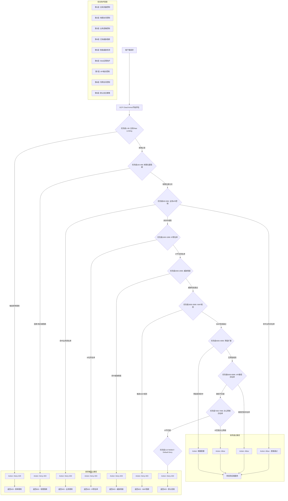
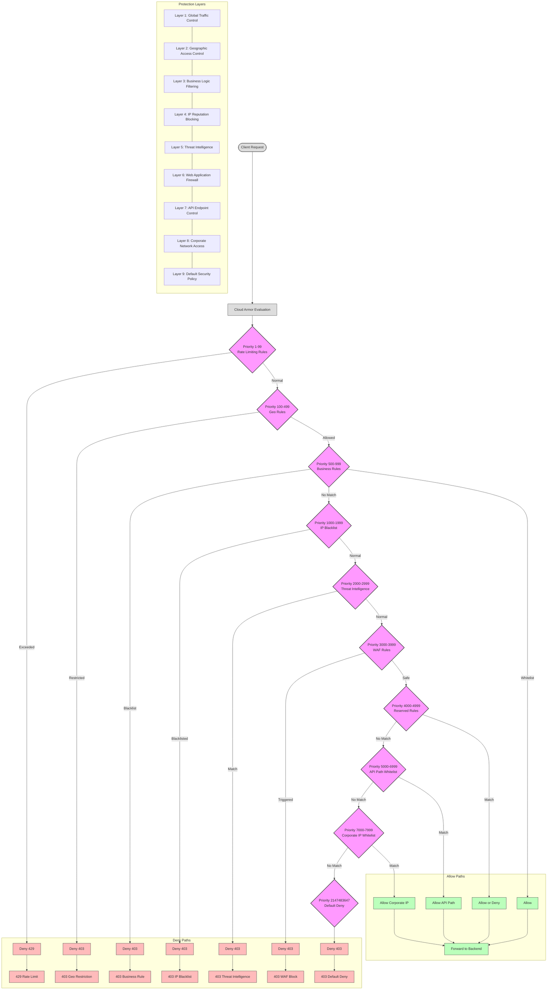
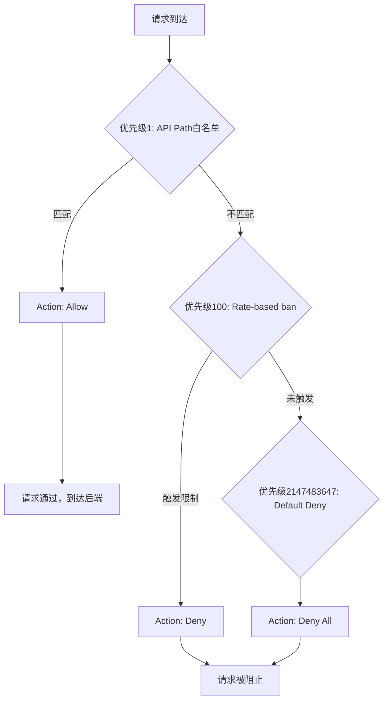
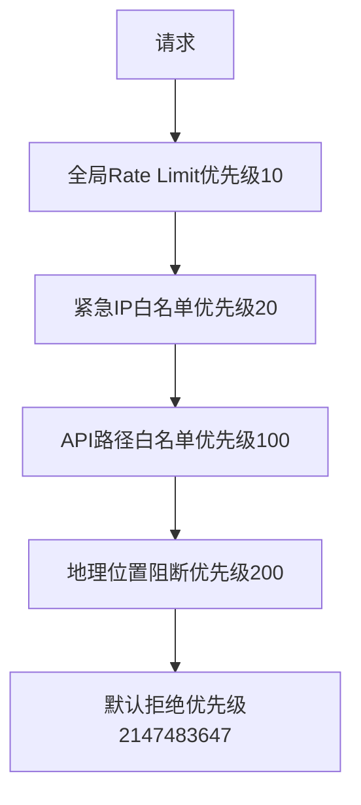
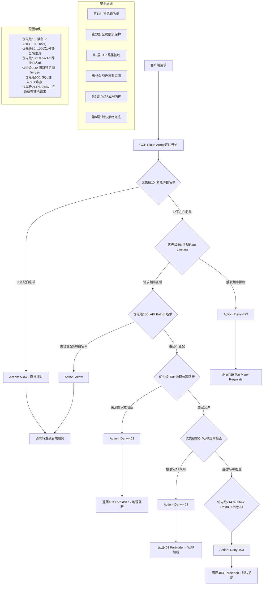
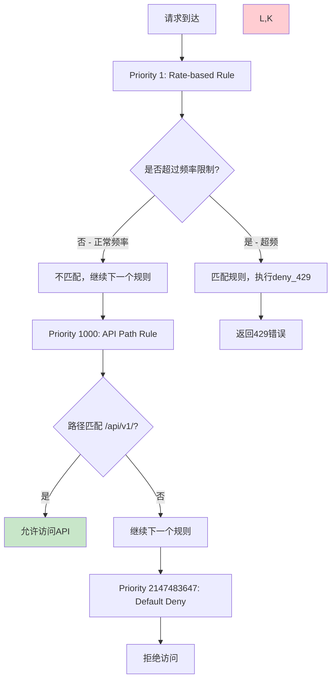

- [Summary](#summary)
- [GCP Cloud Armor 优先级规划表](#gcp-cloud-armor-优先级规划表)
  - [优先级设计理念](#优先级设计理念)
    - [安全层级说明](#安全层级说明)
    - [配置建议](#配置建议)
      - [Rate Limiting层 (1-99)](#rate-limiting层-1-99)
      - [Geo Blocking层 (100-499)](#geo-blocking层-100-499)
      - [威胁防护层 (1000-3999)](#威胁防护层-1000-3999)
      - [合法访问层 (5000-7999)](#合法访问层-5000-7999)
- [Verify](#verify)
- [Claude 4](#claude-4)
  - [Cloud Armor规则评估机制](#cloud-armor规则评估机制)
    - [规则匹配逻辑验证](#规则匹配逻辑验证)
      - [1. 规则优先级数值含义](#1-规则优先级数值含义)
      - [2. 场景分析验证](#2-场景分析验证)
    - [场景验证结果](#场景验证结果)
    - [关键验证点](#关键验证点)
      - [Rate-based规则匹配逻辑](#rate-based规则匹配逻辑)
      - [推荐最佳实践配置](#推荐最佳实践配置)
    - [风险缓解建议](#风险缓解建议)
      - [1. 分层防护策略](#1-分层防护策略)
      - [2. 白名单攻击防护](#2-白名单攻击防护)
    - [验证结论](#验证结论)
  - [场景2最佳配置说明](#场景2最佳配置说明)
    - [核心设计原则](#核心设计原则)
    - [优先级配置表](#优先级配置表)
    - [关键优势](#关键优势)
    - [配置代码示例](#配置代码示例)
- [Claude 3.7](#claude-37)
  - [关于GCP Cloud Armor规则优先级的验证](#关于gcp-cloud-armor规则优先级的验证)
    - [关键结论](#关键结论)
    - [文档中的配置示例](#文档中的配置示例)
    - [处理流程](#处理流程)
  - [总结](#总结)
  - [Rate-based Rules 的实际工作机制](#rate-based-rules-的实际工作机制)
    - [正确的处理流程](#正确的处理流程)
  - [你的配置实际上是正确的](#你的配置实际上是正确的)
  - [实际处理场景](#实际处理场景)
    - [场景1：正常频率 + API路径](#场景1正常频率--api路径)
    - [场景2：正常频率 + 非API路径](#场景2正常频率--非api路径)
    - [场景3：超频请求](#场景3超频请求)
  - [优化建议](#优化建议)
    - [方案1：多层次频率限制](#方案1多层次频率限制)
    - [方案2：差异化频率限制](#方案2差异化频率限制)
  - [总结](#总结-1)

# Summary

# GCP Cloud Armor 优先级规划表

|Priority|Rule Type|Description|Action|Purpose|
|---|---|---|---|---|
|1-99|Rate Limiting|Global Rate Limiting|Deny-429|DDoS Prevention, Global Traffic Control|
|100-499|Geo Blocking|Geographic Location Blocking|Deny-403|Country/Region Level Access Control|
|500-999|Business API Whitelist/Blacklist|API Business Logic Control|Allow/Deny|Business Level Access Control|
|1000-1999|IP Blacklist|DDoS Attack IPs|Deny-403|Known Attack Source Blocking|
|2000-2999|Threat Intelligence|Threat Intelligence/DDoS/Zero Day|Deny-403|Advanced Threat Protection|
|3000-3999|WAF Rules|SQL Injection/XSS/Code Injection etc.|Deny-403|Web Application Attack Protection|
|4000-4999|Reserved Extension|Future Reservation|-|Reserved for Future Features|
|5000-6999|API Path Whitelist|API Path Whitelist|Allow|Legitimate API Endpoint Access|
|7000-7999|Office Network|Office IP/VPN Whitelist|Allow|Internal Network Access|
|2147483647|Default Deny|Default Deny All|Deny-403|Default Security Policy|
## 优先级设计理念

### 安全层级说明

- **1-99**: 最高优先级 - 全局保护层
- **100-999**: 高优先级 - 业务访问控制层
- **1000-3999**: 中优先级 - 威胁检测防护层
- **4000-4999**: 预留扩展空间
- **5000-7999**: 低优先级 - 合法访问放行层
- **2147483647**: 最低优先级 - 兜底拒绝

### 配置建议

#### Rate Limiting层 (1-99)

```yaml
# 全局基础限流
priority: 10
count: 10000/minute

# API特定限流  
priority: 20
count: 1000/minute for /api/*

# 登录接口限流
priority: 30  
count: 100/minute for /login
```

#### Geo Blocking层 (100-499)

```yaml
# 高风险国家阻断
priority: 100
block: CN,RU,KP

# 特定地区允许
priority: 200  
allow: US,EU,JP
```

#### 威胁防护层 (1000-3999)

```yaml
# IP黑名单
priority: 1000
known_attack_ips: [...]

# 威胁情报
priority: 2000
threat_feeds: enabled

# WAF规则
priority: 3000
owasp_top10: enabled
```

#### 合法访问层 (5000-7999)

```yaml
# API白名单
priority: 5000
paths: /api/v1/*, /health

# 办公网络
priority: 7000  
office_ips: 192.168.1.0/24
```



---



# Verify 
About gcp cloud armor 
GCP Cloud Armor Best Practices
1. Create whitelist access based on API location Path
2. Default Deny All access with rule priority like 2147483647
3. Block specific countries using region_code configuration
4. Configure WAF rules
5. DDOS attack protection rules
6. Rate-based ban configuration (source IP throttling) For example, regarding the first point, our APIs are dynamically added, so we need to focus on priority design

我现在关心这样2个场景.
比如
1 API location Path如果priority 高于Rate-based ban 那么我的规则仅仅命中API location Path. 因为这个是Allow.所以不会命中Rate-based ban ? 这个风险就是假如我允许的白名单对我的服务进行攻击
2 Rate-based ban 高于API location Path 那么先会命中 Rate-Base
但是对于Rate-Base来说默认的配置也仅有一个动作就是Deny 所以说我如果Trigger到这个频率限制 我的评估终止就是Deny.不会下面的规则了
但是如果不命中这个Deny. 没有Trigger到频率限制.也就是不会Deny /换句话说就是规则没有匹配成功,成功的标准是频率超出和动作Deny,也就是规则没用命中这个/,那么我们的规则会继续评估后面的比如基于API location Path
3 我们默认2147483647是Deny ALL

# Claude 4

我来验证你关于GCP Cloud Armor规则优先级和匹配逻辑的理解。

## Cloud Armor规则评估机制

### 规则匹配逻辑验证

你的理解基本正确，但需要澄清几个关键点：

#### 1. 规则优先级数值含义
- **数值越小，优先级越高**
- 优先级1 > 优先级100 > 优先级2147483647
- 规则按优先级**从小到大**依次评估

#### 2. 场景分析验证



### 场景验证结果

| 场景 | 优先级设置 | 匹配结果 | 风险评估 |
|------|------------|----------|----------|
| 场景1 | API Path(低) > Rate-ban(高) | ✅ 正确：白名单优先，**存在攻击风险** | ⚠️ 高风险 |
| 场景2 | Rate-ban(低) > API Path(高) | ✅ 正确：先限流再白名单 | ✅ 推荐配置 |
| 场景3 | Default Deny最低优先级 | ✅ 正确：兜底规则 | ✅ 标准配置 |

### 关键验证点

#### Rate-based规则匹配逻辑
```yaml
# Rate-based规则示例
- priority: 100
  match:
    expr: "true"  # 匹配所有请求
  rateLimitOptions:
    rateLimitThreshold:
      count: 100
      intervalSec: 60
  action: "deny-429"
```

**匹配逻辑**：
- Rate-based规则**总是匹配**所有符合条件的请求
- 但只有**超过阈值时才执行Deny动作**
- **未超过阈值时继续评估下一规则**

#### 推荐最佳实践配置

```yaml
# 优先级配置示例
security_policy_rules:
  - priority: 10
    description: "Emergency IP whitelist"
    match:
      versioned_expr: SRC_IPS_V1
      config:
        src_ip_ranges: ["203.0.113.0/24"]
    action: "allow"
    
  - priority: 50  
    description: "Rate limiting - Global"
    match:
      expr: "true"
    rateLimitOptions:
      rateLimitThreshold:
        count: 1000
        intervalSec: 60
    action: "deny-429"
    
  - priority: 100
    description: "API Path whitelist"
    match:
      expr: "request.path.matches('/api/v1/.*')"
    action: "allow"
    
  - priority: 200
    description: "Geographic blocking"
    match:
      expr: "origin.region_code == 'CN'"
    action: "deny-403"
    
  - priority: 2147483647
    description: "Default deny all"
    match:
      expr: "true"
    action: "deny-403"
```

### 风险缓解建议

#### 1. 分层防护策略


#### 2. 白名单攻击防护
- **细化白名单范围**：避免过宽泛的路径匹配
- **设置白名单专用限流**：即使在白名单内也要有合理限制
- **监控白名单流量**：异常流量及时告警

```yaml
# 白名单专用限流示例
- priority: 95
  description: "Whitelist specific rate limit"
  match:
    expr: "request.path.matches('/api/v1/.*')"
  rateLimitOptions:
    rateLimitThreshold:
      count: 500  # 比全局限制更宽松但仍有限制
      intervalSec: 60
  action: "deny-429"
```

### 验证结论

你对Cloud Armor规则评估逻辑的理解是**正确的**：

1. ✅ 高优先级Allow规则会跳过后续Rate-based检查
2. ✅ Rate-based规则未触发时会继续评估后续规则  
3. ✅ Default Deny作为最低优先级兜底规则

**建议采用场景2的配置**，将Rate-based规则设置为更高优先级，在白名单之前进行全局限流保护。


## 场景2最佳配置说明

### 核心设计原则

**分层防护，逐级过滤**：每一层都有明确的职责，形成完整的安全防护体系。

### 优先级配置表

| 优先级 | 规则类型 | 描述 | Action | 目的 |
|--------|----------|------|--------|------|
| 10 | IP白名单 | 紧急访问IP | Allow | 管理员/监控系统绿色通道 |
| 50 | Rate Limiting | 全局频率限制 | Deny-429 | 防DDoS，全局流量控制 |
| 100 | API Path | 业务API白名单 | Allow | 合法业务路径放行 |
| 200 | Geo Blocking | 地理位置阻断 | Deny-403 | 国家/地区级别访问控制 |
| 500 | WAF Rules | Web应用防火墙 | Deny-403 | 应用层攻击防护 |
| 2147483647 | Default Deny | 兜底拒绝 | Deny-403 | 零信任默认拒绝 |

### 关键优势

1. **Rate Limiting优先**：在业务逻辑之前进行全局流量控制
2. **攻击缓解**：即使白名单IP也受到合理的频率限制
3. **灵活应急**：紧急IP白名单可绕过所有限制
4. **分层防护**：多重安全检查，任一层都可独立工作

### 配置代码示例

```yaml
# terraform配置示例
resource "google_compute_security_policy" "cloud_armor_policy" {
  name = "api-protection-policy"

  # 紧急IP白名单
  rule {
    action   = "allow"
    priority = "10"
    match {
      versioned_expr = "SRC_IPS_V1"
      config {
        src_ip_ranges = ["203.0.113.0/24"]  # 管理网段
      }
    }
    description = "Emergency admin access whitelist"
  }

  # 全局Rate Limiting
  rule {
    action   = "deny(429)"
    priority = "50"
    match {
      expr = "true"
    }
    rate_limit_options {
      rate_limit_threshold {
        count        = 1000
        interval_sec = 60
      }
    }
    description = "Global rate limiting protection"
  }

  # API路径白名单
  rule {
    action   = "allow"
    priority = "100"
    match {
      expr = "request.path.matches('/api/v1/.*')"
    }
    description = "API endpoint whitelist"
  }

  # 默认拒绝
  rule {
    action   = "deny(403)"
    priority = "2147483647"
    match {
      expr = "true"
    }
    description = "Default deny all"
  }
}
```

这种配置确保了**安全性和可用性的最佳平衡**，既保护了系统免受攻击，又保证了合法流量的正常访问。


# Claude 3.7
## 关于GCP Cloud Armor规则优先级的验证

文档中的核心观点是关于Rate-based ban规则和API location Path规则的优先级关系，这些观点是正确的：

### 关键结论

1. **Rate-based规则的工作机制**：Rate-based规则只有在触发频率限制时才会匹配并执行动作（通常是deny_429）。如果请求未超过频率限制，规则不会匹配，请求会继续评估下一个规则。

2. **优先级设计的影响**：
   - 如果Rate-based规则优先级高于API Path规则：当请求未超频时，会继续评估API Path规则；当请求超频时，会被Rate-based规则拒绝，不再继续评估。
   - 如果API Path规则优先级高于Rate-based规则：对于匹配API Path的请求，会直接允许访问，不再评估Rate-based规则，这可能导致允许的白名单路径被用于攻击。

### 文档中的配置示例

文档提供的配置示例是合理的：
```yaml
rules:
  # 1. 频率限制保护 (只在超频时触发)
  - priority: 1
    match:
      rateLimitOptions:
        rateLimitThreshold: 100
        rateLimitPeriod: 60
        exceedAction: "deny_429"
        enforceOnKey: "IP"
    description: "Rate-based Ban"
    
  # 2. API路径白名单 (正常频率时生效)
  - priority: 1000
    match:
      expr: "request.url_map.path.matches('/api/v1/.*')"
    action: "allow"
    description: "API Path Whitelist"
    
  # 3. 默认拒绝
  - priority: 2147483647
    match:
      expr: "true"
    action: "deny_403"
    description: "Default Deny All"
```

这种配置将Rate-based规则的优先级设置为最高（priority: 1），确保无论请求路径如何，都会先检查请求频率。这样可以防止任何路径（包括白名单路径）被用于DDoS攻击。

### 处理流程

文档中的流程图和处理场景描述也是准确的：
1. 请求首先经过Rate-based规则评估
2. 如果未超频，继续评估API Path规则
3. 如果路径匹配，允许访问；否则继续评估
4. 最后是默认拒绝规则

## 总结

文档中关于GCP Cloud Armor路径优先级配置的说法是正确的。将Rate-based规则优先级设置为高于API Path规则是一种良好的安全实践，可以在保护API免受DDoS攻击的同时，仍然允许合法的API访问。
        


Rate-based Ban默认是Deny的动作
所以我们如果请求不命中,也就是不Trigger这个频率限制.也就是不会遇到Deny,还是Allow的动作,我的请求还会往下走.这样的话
我的request.url_map.path.matches对于用户白名单就会生效.如果是黑名单就不能访问我的API了


**完全正确！** 我之前的理解有误。让我重新分析：

## Rate-based Rules 的实际工作机制

Rate-based rules 只有在 **触发频率限制时** 才会匹配并执行动作。

### 正确的处理流程



## 你的配置实际上是正确的

```yaml
rules:
  # 1. 频率限制保护 (只在超频时触发)
  - priority: 1
    match:
      rateLimitOptions:
        rateLimitThreshold: 100
        rateLimitPeriod: 60
        exceedAction: "deny_429"
        enforceOnKey: "IP"
    description: "Rate-based Ban"
    
  # 2. API路径白名单 (正常频率时生效)
  - priority: 1000
    match:
      expr: "request.url_map.path.matches('/api/v1/.*')"
    action: "allow"
    description: "API Path Whitelist"
    
  # 3. 默认拒绝
  - priority: 2147483647
    match:
      expr: "true"
    action: "deny_403"
    description: "Default Deny All"
```

## 实际处理场景

### 场景1：正常频率 + API路径
```
Request: GET /api/v1/users (第50次/分钟)
Priority 1: 未超频 → 不匹配 → 继续
Priority 1000: 路径匹配 → Allow ✅
```

### 场景2：正常频率 + 非API路径  
```
Request: GET /admin/panel (第50次/分钟)
Priority 1: 未超频 → 不匹配 → 继续
Priority 1000: 路径不匹配 → 继续
Priority 2147483647: 默认匹配 → Deny ❌
```

### 场景3：超频请求
```
Request: GET /api/v1/users (第150次/分钟)
Priority 1: 超频 → 匹配 → Deny 429 ❌
```

## 优化建议

你的理解是对的，但可以进一步优化：

### 方案1：多层次频率限制

```yaml
rules:
  # 1. 恶意攻击检测 (极高频率)
  - priority: 100
    match:
      rateLimitOptions:
        rateLimitThreshold: 1000  # 1000/分钟
        rateLimitPeriod: 60
        exceedAction: "deny_429"
        enforceOnKey: "IP"
    description: "DDoS Protection"
    
  # 2. API路径白名单
  - priority: 1000
    match:
      expr: "request.url_map.path.matches('/api/v1/.*')"
    action: "allow"
    description: "API Access"
    
  # 3. 一般路径频率限制 (更严格)
  - priority: 2000
    match:
      rateLimitOptions:
        rateLimitThreshold: 100   # 100/分钟
        rateLimitPeriod: 60
        exceedAction: "deny_429"
        enforceOnKey: "IP"
    description: "General Rate Limiting"
    
  # 4. 默认拒绝
  - priority: 2147483647
    match:
      expr: "true"
    action: "deny_403"
    description: "Default Deny"
```

### 方案2：差异化频率限制

```yaml
rules:
  # 1. API路径专用频率限制
  - priority: 1000
    match:
      expr: "request.url_map.path.matches('/api/v1/.*')"
      rateLimitOptions:
        rateLimitThreshold: 500   # API专用限制
        rateLimitPeriod: 60
        conformAction: "allow"
        exceedAction: "deny_429"
        enforceOnKey: "IP"
    description: "API with Rate Limit"
    
  # 2. 静态资源频率限制
  - priority: 2000
    match:
      expr: "request.url_map.path.matches('/static/.*')"
      rateLimitOptions:
        rateLimitThreshold: 200
        rateLimitPeriod: 60
        conformAction: "allow"
        exceedAction: "deny_429"
        enforceOnKey: "IP"
    description: "Static Resources Rate Limit"
    
  # 3. 默认拒绝
  - priority: 2147483647
    match:
      expr: "true"
    action: "deny_403"
    description: "Default Deny"
```

## 总结

| 请求类型 | 频率状态 | 路径匹配 | 最终结果 |
|----------|----------|----------|----------|
| API请求 | 正常频率 | ✅ 匹配 | ✅ 允许访问 |
| API请求 | 超频 | - | ❌ 429限制 |
| 非API请求 | 正常频率 | ❌ 不匹配 | ❌ 403拒绝 |
| 非API请求 | 超频 | - | ❌ 429限制 |

你的配置逻辑是正确的！Rate-based rules 作为保护层，路径白名单作为访问控制层，两者可以很好地协同工作。