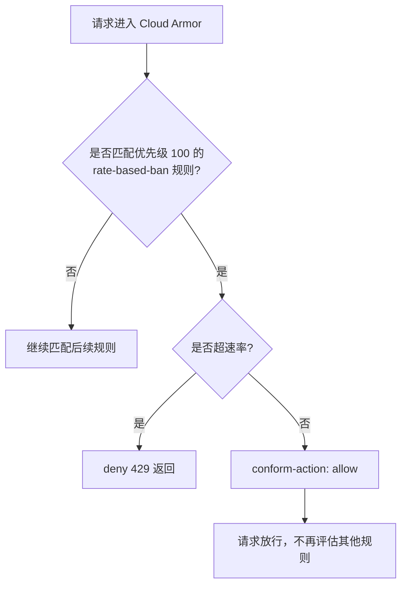

- [Rate-based ban](#rate-based-ban)
  - [在基于速率的禁止规则和节流速率限制规则之间进行选择](#在基于速率的禁止规则和节流速率限制规则之间进行选择)
- [Summary](#summary)
    - [问题 2：访问未触发限制 (Not Triggered) - 这是关键区别所在！](#问题-2访问未触发限制-not-triggered---这是关键区别所在)
  - [**问题 2：如果请求没有达到该规则的 ban 条件，会不会继续评估后续规则？**](#问题-2如果请求没有达到该规则的-ban-条件会不会继续评估后续规则)
- [ChatGPT](#chatgpt)
- [**Cloud Armor 安全策略规划示例**](#cloud-armor-安全策略规划示例)
  - [**✅** ](#)
  - [**--preview**](#--preview)
  - [ **参数说明**](#参数说明)
    - [**❓ 如何设置为生效？**](#-如何设置为生效)
  - [**⚠️ 设置为生效后（去掉 –preview）有何风险？**](#️-设置为生效后去掉-preview有何风险)
    - [**如果优先级（priority）较高（比如 100），**](#如果优先级priority较高比如-100)
    - [**会优先评估**](#会优先评估)
    - [**该规则。**](#该规则)
  - [**🧠 问题 1：如果某 IP 已被封禁（已被 ban），是否还会继续匹配其他规则？**](#-问题-1如果某-ip-已被封禁已被-ban是否还会继续匹配其他规则)
  - [**🧠 问题 2：如果请求没有达到该规则的 ban 条件，会不会继续评估后续规则？**](#-问题-2如果请求没有达到该规则的-ban-条件会不会继续评估后续规则)
  - [**✅ 建议的方式：利用条件细化，避免规则优先级过高带来误杀**](#-建议的方式利用条件细化避免规则优先级过高带来误杀)
    - [**示例：将 rate-based-ban 限制到某些路径或方法**](#示例将-rate-based-ban-限制到某些路径或方法)
  - [**🔄 总结**](#-总结)
    - [**💡 表格说明：**](#-表格说明)
    - [**✅ 建议：**](#-建议)
- [ChatGPT summary](#chatgpt-summary)
  - [Q](#q)
  - [A](#a)
  - [**🔍 针对你规则的具体情况分析：**](#-针对你规则的具体情况分析)
    - [\*\*规则 100（\*\*rate-based-ban\*\*\*\*）](#规则-100rate-based-ban)
  - [**✅ 结论**](#-结论)
  - [**🛠️ 解决建议**](#️-解决建议)
  - [**💡 小总结（优先级设计建议）**](#-小总结优先级设计建议)
- [注意 action 改为 throttle，并且没有 conform-action](#注意-action-改为-throttle并且没有-conform-action)
  - [**🔁 规则对比表**](#-规则对比表)
  - [**✅ 你新写的** ](#-你新写的)
  - [**throttle**](#throttle)
  - [ **规则解释**](#规则解释)
    - [**含义：**](#含义)
    - [**优点：**](#优点)
  - [**🚨 关键行为区别总结**](#-关键行为区别总结)
  - [**🧠 建议组合（推荐策略）**](#-建议组合推荐策略)
- [gemini](#gemini)
    - [Google Cloud Armor 安全策略规划表](#google-cloud-armor-安全策略规划表)
    - [深入探讨：`rate_based_ban` 设置在哪里最合适？](#深入探讨rate_based_ban-设置在哪里最合适)
      - [1. 优先级位置 (Placement in Priority Order)](#1-优先级位置-placement-in-priority-order)
      - [2. 匹配条件 (The `match` Condition) - 应该保护什么？](#2-匹配条件-the-match-condition---应该保护什么)
      - [3. 封禁的键 (The `ban` Key) - 基于什么来封禁？](#3-封禁的键-the-ban-key---基于什么来封禁)
      - [示例：为登录接口配置 `rate_based_ban`](#示例为登录接口配置-rate_based_ban)
    - [总结](#总结)
    - [简单回答](#简单回答)
    - [详细解释：`rate_based_ban` 的内部逻辑](#详细解释rate_based_ban-的内部逻辑)
      - [状态一：匹配规则，但未超限 (Conforming)](#状态一匹配规则但未超限-conforming)
      - [状态二：匹配规则，且刚好超限 (Exceeding)](#状态二匹配规则且刚好超限-exceeding)
      - [状态三：来源已被封禁 (Banned)](#状态三来源已被封禁-banned)
    - [总结与表格解释](#总结与表格解释)
    - [问题 1：访问已触发限制 (Triggered)](#问题-1访问已触发限制-triggered)
    - [问题 2：访问未触发限制 (Not Triggered) - 这是关键区别所在！](#问题-2访问未触发限制-not-triggered---这是关键区别所在-1)
    - [结论与风险](#结论与风险)
    - [如何修正以达到您的目的？](#如何修正以达到您的目的)
- [Gemini2](#gemini2)
- [Google Cloud Armor 策略规划：从战术规则到战略纵深防御](#google-cloud-armor-策略规划从战术规则到战略纵深防御)
  - [引言：从战术问题到战略防御](#引言从战术问题到战略防御)
  - [第一节：解构 `rate-based-ban` 规则：深度剖析](#第一节解构-rate-based-ban-规则深度剖析)
    - [规则的构成要素](#规则的构成要素)
    - [动作是 `rate-based-ban`，结果是 `allow` 或 `deny`](#动作是-rate-based-ban结果是-allow-或-deny)
  - [第二节：执行的逻辑：Cloud Armor 的规则评估顺序](#第二节执行的逻辑cloud-armor-的规则评估顺序)
    - [黄金法则：自顶向下，首次匹配即终止](#黄金法则自顶向下首次匹配即终止)
    - [解答核心疑问](#解答核心疑问)
    - [`rate-based-ban` 作为“终端放行”及其安全隐患](#rate-based-ban-作为终端放行及其安全隐患)
  - [第三节：Cloud Armor 策略设计的战略框架](#第三节cloud-armor-策略设计的战略框架)
    - [指导原则：分层防御](#指导原则分层防御)
    - [Cloud Armor 策略规划表](#cloud-armor-策略规划表)
    - [应对动态架构的优先级分配策略](#应对动态架构的优先级分配策略)
  - [第四节：实施蓝图：从规划到生产](#第四节实施蓝图从规划到生产)
    - [使用 Terraform 实现基础设施即代码](#使用-terraform-实现基础设施即代码)
    - [`gcloud` 命令行参考](#gcloud-命令行参考)
  - [第五节：高级威胁缓解与精细化调优](#第五节高级威胁缓解与精细化调优)
    - [`rate-based-ban` vs. `throttle`：用例分析](#rate-based-ban-vs-throttle用例分析)
    - [集成 reCAPTCHA Enterprise 增强速率限制](#集成-recaptcha-enterprise-增强速率限制)
  - [第六节：运维生命周期：监控、日志与安全部署](#第六节运维生命周期监控日志与安全部署)
    - [解读速率限制事件的 Cloud Armor 日志](#解读速率限制事件的-cloud-armor-日志)
    - [预览模式工作流：先测试，后执行](#预览模式工作流先测试后执行)
    - [自动化响应与 SOAR 集成](#自动化响应与-soar-集成)
  - [结论与建议](#结论与建议)
- [Claude4](#claude4)

# Rate-based ban

https://cloud.google.com/armor/docs/rate-limiting-overview

## 在基于速率的禁止规则和节流速率限制规则之间进行选择

Google Cloud Armor `rate-based ban`  和  `throttle`  速率限制规则在处理超出配置阈值的流量方面有所不同。

- `rate_based_ban`：当请求速率超过定义的阈值时，Cloud Armor 会在指定时间段内阻止来自这些请求的来源或目标的所有后续请求。
- `throttle`：节流不会阻止所有流量，而是将请求速率限制在指定的上限。这样可允许部分流量通过，但速率受控以防止发生过载。

- GCP Cloud Armor Best Practices
- Create whitelist access based on API location Path
- Default Deny All access with rule priority like 2147483647
- Block specific countries using region_code configuration
- Configure WAF rules
- DDOS attack protection rules
- Rate-based ban configuration (source IP throttling) For example, regarding the first point, our APIs are dynamically added, so we need to focus on priority design

我想要一个规划的表.另外我比较关心这个 rate_based_ban 设置在哪里比较合适.

```bash
gcloud compute security-policies rules create 100 \
  --security-policy=POLICY_NAME \
  --action=rate-based-ban \
  --description="Source IP throttling" \
  --src-ip-ranges=* \
  --rate-limit-threshold-count=2000 \
  --rate-limit-threshold-interval-sec=10 \
  --ban-duration-sec=60 \
  --conform-action=allow \
  --exceed-action="deny(429)" \
  --enforce-on-key=IP

gcloud compute security-policies rules create 1000 \
--security-policy=cloud-armor-policy \
--project=${PROJECT_ID} \
--description="Allow traffic to /api_name_version1/v1/_" \
--expression='request.path.matches("/api_name_version1/v1/_") && (inIpRange(origin.ip, "1.2.3.4/24") || inIpRange(origin.ip, "5.6.7.8/24"))'
--action=allow
```

# Summary

### 问题 2：访问未触发限制 (Not Triggered) - 这是关键区别所在！

> 如果用户访问没有 Trigger 我这个规则的限制,那么其会继续往下走? 因为我后面还有一些比如基于 API 和 PATH 的白名单

**不，它不会继续往下走。** 这就是全局`rate-based-ban`规则需要特别小心处理的地方

action 改为 throttle，并且没有 conform-action

- **速率限制（Throttle）**：使用 throttle 动作对流量突增做缓解。可以基于客户端 IP（或组合 HTTP-PATH、Cookie 等多个键 ）设定阈值。举例：限速为每 IP 每 60 秒 100 次请求，超出部分返回 429 错误。节流允许部分请求通过，适用于高并发但合法的情况，以防止过载 。
- **速率禁止（Rate-based ban）**：使用 rate-based-ban 动作在检测到持续的高频请求时短期封禁来源。可配置基本阈值（如 60 秒内 100 次）和 ban 阈值（如 600 秒内 1000 次），当客户端超限并多次超过阈值时即触发封禁 。此规则放在节流之后、默认拒绝之前，专门对可能的攻击流量执行临时封锁。由于 Cloud Armor 在负载均衡层面执行规则，它可以提前丢弃攻击流量，减轻后端 Nginx/应用压力 。

## **问题 2：如果请求没有达到该规则的 ban 条件，会不会继续评估后续规则？**

**不会继续评估。**

这是 Cloud Armor 的默认行为：**只要某条规则匹配了条件（如 IP 命中，速率未超）且执行了一个 conform-action，比如 allow，那么后续规则就不会再被评估。**

因此，即使请求速率未达到限流阈值，只是 conform-action=allow，请求被放行，**也不会再走你后面针对路径、API 的白名单规则**。

# ChatGPT

# **Cloud Armor 安全策略规划示例**

Google Cloud Armor 提供基于安全策略的规则集，可部署在外部 HTTP(S) 或 TCP/SSL 负载均衡器的后端服务上 。在设计策略时，需要考虑规则优先级、匹配条件和动作。下表给出一个示例性的规则规划表，包括优先级、名称、匹配条件、动作和说明。表中举例了基于路径的访问白名单、国家/地区封锁、WAF 规则、速率限制（节流/禁止）和默认拒绝等常见策略。此设计将 Cloud Armor 策略附加于全局负载均衡器的后端服务，针对进入的请求在到达 Nginx 后端前进行过滤。

| **优先级** | **规则名称**              | **匹配条件**                                          | **动作**  | **说明**                                                                                                                            |
| ---------- | ------------------------- | ----------------------------------------------------- | --------- | ----------------------------------------------------------------------------------------------------------------------------------- |
| 100        | API 路径白名单 (Prefix)   | request.path 以 /api/ 开头（可根据实际 API 前缀设置） | 允许      | 允许所有合法 API 路径流量，可按前缀或精确路径匹配 。由于 API 动态增加，可采用通配前缀匹配。                                         |
| 110        | 特定国家访问拒绝          | origin.region_code == '<国家代码>'                    | 拒绝      | 封锁指定国家/地区的访问（如需阻止 China/CN、India/IN 等），使用 origin.region_code 表达式 。                                        |
| 120        | 预配置 WAF 规则组         | evaluatePreconfiguredWaf('...')（多条 OWASP 规则）    | 拒绝      | 应用 Cloud Armor 的 OWASP 预配置 WAF 规则（SQL 注入、XSS 等），使用前建议在**预览模式**中测试规则效果 。                            |
| 130        | 速率限制（节流）          | 源 IP（或 IP+路径 组合），超过阈值                    | 节流/拒绝 | 基于源 IP（可加 HTTP-PATH）限制请求速率，允许部分流量以控制速率。比如每 IP 每 60 秒不超过 100 次请求，超出时返回 429 或 redirect 。 |
| 140        | 速率禁止 (rate_based_ban) | 源 IP（或多键），超过阈值并持续超过 ban 阈值          | 拒绝      | 当客户端请求频率超过阈值并累计多次超限时，短期封禁其所有请求。例如 IP 超限超过指定次数后封禁 300 秒 。                              |
| 2147483647 | 默认拒绝                  | 无                                                    | 拒绝      | 默认规则（INT-MAX=2147483647）始终存在，缺省动作为拒绝 。所有未被前序规则允许的请求将被阻断。                                       |

- **API 路径白名单 (Prefix)**：针对 /api/ 路径前缀（或具体路径）设置允许规则，优先级较高（数字较小）。Cloud Armor 可匹配 HTTP 请求路径（属性 request.path） 。例如 request.path.startsWith("/api/")，允许对应 API 的合法流量访问后端。由于 API 可能动态新增，使用宽泛前缀能自动包含新接口，避免频繁更新策略。
- **国家/地区屏蔽**：使用规则表达式如 origin.region_code == 'XX' 阻止特定国家流量 （支持 ISO 3166-1 alpha2 代码）。示例中将此规则放在白名单之后，优先级仅次。这样可以在允许规则未命中时，拦截来自被封锁国家的请求，体现“先允许再拒绝”的逻辑 。需要注意，较高优先级（小数字）的规则首先匹配，因此如果要允许某个 IP 段或路径，则应将允许规则置于更高优先级。
- **WAF 预配置规则**：启用 Cloud Armor 的 OWASP 预配置 WAF 规则（如 SQL 注入、XSS 检测）来防护常见漏洞攻击。由于这些规则可能产生误杀，建议先使用“预览模式”进行测试 。在表中我们把 WAF 阻断规则放在 IP 限流之后，实际可根据流量特点调整优先级。
- **速率限制（Throttle）**：使用 throttle 动作对流量突增做缓解。可以基于客户端 IP（或组合 HTTP-PATH、Cookie 等多个键 ）设定阈值。举例：限速为每 IP 每 60 秒 100 次请求，超出部分返回 429 错误。节流允许部分请求通过，适用于高并发但合法的情况，以防止过载 。
- **速率禁止（Rate-based ban）**：使用 rate-based-ban 动作在检测到持续的高频请求时短期封禁来源。可配置基本阈值（如 60 秒内 100 次）和 ban 阈值（如 600 秒内 1000 次），当客户端超限并多次超过阈值时即触发封禁 。此规则放在节流之后、默认拒绝之前，专门对可能的攻击流量执行临时封锁。由于 Cloud Armor 在负载均衡层面执行规则，它可以提前丢弃攻击流量，减轻后端 Nginx/应用压力 。
- **DDoS 防护**：Cloud Armor 专为防御层七 DDoS 攻击和常见网络威胁而设计 。对于大规模攻击，可启用自适应保护（Adaptive Protection），它会实时监控流量异常并给出建议 。此外，可考虑使用网络边缘安全策略（Network Edge Security Policy）在 Google 网络边缘阻断流量（适用于协议转发/通过型负载均衡） 。
- **默认拒绝规则**：每个安全策略都包含一个默认规则（优先级 INT-MAX=2147483647），默认阻止所有流量 。我们建议保持默认拒绝（动作为拒绝）并根据需要显式允许合法流量。这符合“最小权限”原则，只允许通过明确白名单或其他安全检查放行的请求。

**关于 rate_based_ban 的设置**：通常在 Cloud Armor 安全策略中配置此规则，将策略**附加到全局负载均衡器的后端服务** 。在 Google Cloud 控制台或 gcloud CLI 中为目标后端服务创建安全策略，并添加 throttle 或 rate-based-ban 规则即可。例如，使用 --action=rate-based-ban 并指定 --src-ip-ranges 或其他表达式条件，配置阈值和封禁时长 。由于 Cloud Armor 的规则在边缘生效，无论源请求最终路由到哪个实例或 Pod，违规流量都会在到达后端前被限制或封禁，避免浪费后端资源。

**引用来源**：以上策略设计基于 Cloud Armor 文档和最佳实践，如速率封锁与节流的对比说明 、规则优先级和默认规则说明 、优先级间隔建议 、国家代码与路径匹配属性 等。规划中的配置示例可根据实际业务需要调整阈值和匹配条件，以兼顾安全性和服务可用性。

你的问题很专业，下面我会从 **Cloud Armor 安全策略中 rate-based-ban 规则的行为机制** 角度进行说明，并解答你提出的两个具体问题。

---

## **✅** 

## **--preview**

##  **参数说明**

你提到：

```
--preview
```

这个参数表示：**规则处于预览状态，并不会实际生效，仅用于观察命中情况**。

### **❓ 如何设置为生效？**

要让规则真正生效（不是预览），只需要**不要加 --preview 参数**：

```
gcloud compute security-policies rules create 100 \
  --security-policy=POLICY_NAME \
  --action=rate-based-ban \
  --description="Source IP throttling" \
  --src-ip-ranges=* \
  --rate-limit-threshold-count=2000 \
  --rate-limit-threshold-interval-sec=10 \
  --ban-duration-sec=60 \
  --conform-action=allow \
  --exceed-action="deny(429)" \
  --enforce-on-key=IP
```

---

## **⚠️ 设置为生效后（去掉 –preview）有何风险？**

### **如果优先级（priority）较高（比如 100），**

### **会优先评估**

### **该规则。**

你关心的两个问题如下：

---

## **🧠 问题 1：如果某 IP 已被封禁（已被 ban），是否还会继续匹配其他规则？**

**不会。**

Cloud Armor 的规则是**优先匹配的模型**，当某条规则匹配并执行 action 后，**后续规则不会再被评估**。

> ✅ 所以，如果某个 IP 已达到 rate limit 阈值并被 ban（即进入 60 秒封禁状态），那么该请求直接返回 429，**不会再走后续白名单等规则**。

---

## **🧠 问题 2：如果请求没有达到该规则的 ban 条件，会不会继续评估后续规则？**

**不会继续评估。**
这是 Cloud Armor 的默认行为：**只要某条规则匹配了条件（如 IP 命中，速率未超）且执行了一个 conform-action，比如 allow，那么后续规则就不会再被评估。**

因此，即使请求速率未达到限流阈值，只是 conform-action=allow，请求被放行，**也不会再走你后面针对路径、API 的白名单规则**。

---

## **✅ 建议的方式：利用条件细化，避免规则优先级过高带来误杀**

由于你后面有一些细化规则（如 API/path 白名单），我们建议你使用条件（matcher）**缩小规则影响范围**，避免率先放行请求导致白名单规则失效。

### **示例：将 rate-based-ban 限制到某些路径或方法**

```
gcloud compute security-policies rules create 100 \
  --security-policy=POLICY_NAME \
  --action=rate-based-ban \
  --description="Limit POST to /login" \
  --src-ip-ranges=* \
  --rate-limit-threshold-count=100 \
  --rate-limit-threshold-interval-sec=10 \
  --ban-duration-sec=60 \
  --conform-action=allow \
  --exceed-action="deny(429)" \
  --enforce-on-key=IP \
  --match="expr= (request.path == '/login' && request.method == 'POST')"
```

---

## **🔄 总结**

| **问题**                           | **回答**                                                   |
| ---------------------------------- | ---------------------------------------------------------- |
| 设置 --preview 是否生效？          | 否，必须移除 --preview 才生效                              |
| 已触发 ban，是否继续往后走规则？   | 否，直接返回 deny，不评估后续                              |
| 未触发 ban，是否继续评估其他规则？ | 否，匹配 conform-action=allow 后即放行，不继续匹配后续规则 |
| 如何避免影响后续规则？             | 限定 match 范围，或调整优先级与顺序                        |

---

如需对规则流程进行可视化理解，可参考下列流程图：



---

如你后续希望做白名单优先评估，我可以给你整理一份 Cloud Armor 多规则最佳优先级建议。需要的话告诉我即可。

以下是基于你描述的 Cloud Armor 安全策略规则建议，采用 Markdown 表格格式输出，方便你直接复制使用。该策略遵循如下逻辑：

- 默认 Deny All
- 配置 API 的白名单（基于 Location + Path）
- 限制特定国家
- 启用 rate-based-ban
- 启用 WAF 的 OWASP 规则
- 启用 L7 DDoS 保护（Cloud Armor 自带）

---

| priority   | rule_name       | match_condition                                 | action         | description                                  |
| ---------- | --------------- | ----------------------------------------------- | -------------- | -------------------------------------------- |
| 100        | api-whitelist   | path and/or geo-based allow rules               | allow          | 显式允许特定 API 路径和地区                  |
| 200        | block-countries | request.geo.country in ["CN", "RU", "KP", "IR"] | deny(403)      | 拒绝来自高风险国家的访问                     |
| 300        | rate-limit-ip   | request.path starts_with "/"                    | rate-based-ban | 针对所有路径启用 IP 限流保护（如 DDoS 预防） |
| 400        | waf-owasp-core  | preconfigured WAF rule set                      | deny(403)      | 启用 OWASP WAF 规则                          |
| 2147483647 | default-deny    | \*                                              | deny(403)      | 默认拒绝所有未匹配流量                       |

---

### **💡 表格说明：**

| **字段**        | **说明**                                               |
| --------------- | ------------------------------------------------------ |
| priority        | 数值越小优先级越高；Cloud Armor 规则按此顺序匹配       |
| rule_name       | 给规则起个描述性名字                                   |
| match_condition | 可使用路径、地理位置、Header、Query、IP 等作为匹配条件 |
| action          | allow / deny(403) / rate-based-ban / redirect 等       |
| description     | 对规则做简要说明，便于维护                             |

---

### **✅ 建议：**

- 将白名单规则放在最前（优先评估），确保合法流量先被允许；
- 国别拒绝建议放在 200，并控制不影响 CDN；
- rate-based-ban 建议匹配具体路径或敏感动作（如 POST /login），避免全局误伤；
- waf-owasp-core 可使用 Cloud Armor 预置的规则集；
- 最后一条设置默认拒绝所有未匹配流量。

如果你希望我为某条规则生成完整的 gcloud 命令或 Terraform 定义，也可以告诉我规则名称或匹配条件。

# ChatGPT summary

## Q

那么比如我的这个 Ban 规则是 100 我在 1000 的时候创建了一个用户 API 的白名单,也就是允许这些 IP 访问

最后的 Default 规则是 Deny A LL

```bash

gcloud compute security-policies rules create 100 \
  --security-policy=POLICY_NAME \
  --action=rate-based-ban \
  --description="Source IP throttling" \
  --src-ip-ranges=* \
  --rate-limit-threshold-count=2000 \
  --rate-limit-threshold-interval-sec=10 \
  --ban-duration-sec=60 \
  --conform-action=allow \
  --exceed-action="deny(429)" \
  --enforce-on-key=IP


gcloud compute security-policies rules create 1000 \
--security-policy=cloud-armor-policy \
--project=${PROJECT_ID} \
--description="Allow traffic to /api_name_version1/v1/_" \
--expression='request.path.matches("/api_name_version1/v1/_") && (inIpRange(origin.ip, "1.2.3.4/24") || inIpRange(origin.ip, "5.6.7.8/24"))'
--action=allow
```

按照上面的描述,如果用户命中第一个 100 的规则,

如果用户访问没有 Trigger 我这个规则的限制,直接就允许通行了?

并不会再到我的白名单去判断允许放行对应的 IP

## A

是的，你的理解完全正确，Cloud Armor 的规则是**按优先级顺序依次评估**的，并且**一旦某条规则被命中（即条件满足），就会立即执行对应的 action，不会继续评估后续规则**。

---

## **🔍 针对你规则的具体情况分析：**

### **规则 100（**rate-based-ban\*\*\*\*）

```bash
gcloud compute security-policies rules create 100 \
  --security-policy=POLICY_NAME \
  --action=rate-based-ban \
  --description="Source IP throttling" \
  --src-ip-ranges=* \
  --rate-limit-threshold-count=2000 \
  --rate-limit-threshold-interval-sec=10 \
  --ban-duration-sec=60 \
  --conform-action=allow \
  --exceed-action="deny(429)" \
  --enforce-on-key=IP
```

> 如果用户命中这个规则：

- 如果 IP **没有超阈值**（即未被 ban），则立即执行 conform-action=allow ✅。
- 如果 IP **已经被 ban**（超过阈值），则立即执行 exceed-action=deny(429) ❌。
- **不会再继续判断后续的白名单规则（如优先级 1000）**。

---

## **✅ 结论**

- **只要 IP 没有触发 rate limit，被 100 条规则直接 allow，不会进入 1000 规则**
- **只有没有被前面规则命中，才会继续评估后续规则（如 IP 白名单）**

---

## **🛠️ 解决建议**

如果你希望**优先允许白名单流量**（例如特定 API 路径 + IP），避免其受限于 rate-based-ban，**你应该调整优先级：**

```
# 白名单规则，优先级更高（例如 50）
gcloud compute security-policies rules create 50 \
  --security-policy=POLICY_NAME \
  --description="Allow traffic to /api_name_version1/v1/_ from specific IPs" \
  --expression='request.path.matches("/api_name_version1/v1/_") && (inIpRange(origin.ip, "1.2.3.4/24") || inIpRange(origin.ip, "5.6.7.8/24"))' \
  --action=allow
```

> ✅ 这样白名单流量会**优先被放行，不会进入后续 rate limit 流程**。

---

## **💡 小总结（优先级设计建议）**

| **priority** | **rule_name** | **purpose**                      |
| ------------ | ------------- | -------------------------------- |
| 50           | API whitelist | 允许来自特定 IP 对特定路径的访问 |
| 100          | Rate Ban      | 针对所有 IP 做速率限制防御       |
| 1000+        | 其他规则      | 如区域拒绝、WAF 等               |
| 2147483647   | Default Deny  | 默认拒绝所有未匹配流量           |

如需我帮助你重排并生成所有规则命令或 Terraform 配置，也可以继续告诉我。

如果我还想全局使用,那么是不是下面这个可行

# 注意 action 改为 throttle，并且没有 conform-action
```bash
gcloud compute security-policies rules create 100 \
--security-policy=POLICY_NAME \
--action=throttle \
--description="Global DDoS protection throttling" \
--src-ip-ranges=\* \
--rate-limit-threshold-count=2000 \
--rate-limit-threshold-interval-sec=10 \
--exceed-action="deny(429)" \
--enforce-on-key=IP
```
如果可行帮我详细解释这个和我原来的区别?

是的，你这个新的配置是**可行的**，它使用了 Cloud Armor 的 action=throttle 动作，确实可以用于**全局 IP 限速防护（如 DDoS 缓解）**，但其行为和你原先的 rate-based-ban 有本质区别。以下是详细的对比分析：

---

## **🔁 规则对比表**

| **项目**            | rate-based-ban                            | throttle                                   |
| ------------------- | ----------------------------------------- | ------------------------------------------ |
| 动作 (action)       | rate-based-ban                            | throttle                                   |
| 被触发时            | 达到速率阈值时，**自动进入封锁期（ban）** | 达到速率阈值时，**立即对请求限速**         |
| 状态持久性          | 是，触发后 IP 会被 ban N 秒               | 否，限速仅在速率超过阈值的那一刻生效       |
| 封禁持续时间        | --ban-duration-sec 控制（如 60s）         | 无持续 ban，下一秒速率低了就不 throttle 了 |
| conform-action 支持 | ✅（可设置 allow）                        | ❌（不支持 conform-action）                |
| 是否有 ban 列表     | ✅（Cloud Armor 会维护 ban 列表）         | ❌（没有持久 ban）                         |
| 场景适用性          | 更适合保护高价值资源，或封禁攻击者 IP     | 更适合全局节流和流量平滑，防止突发 DDoS    |

---

## **✅ 你新写的** 

## **throttle**

##  **规则解释**

```
gcloud compute security-policies rules create 100 \
    --security-policy=POLICY_NAME \
    --action=throttle \
    --description="Global DDoS protection throttling" \
    --src-ip-ranges=* \
    --rate-limit-threshold-count=2000 \
    --rate-limit-threshold-interval-sec=10 \
    --exceed-action="deny(429)" \
    --enforce-on-key=IP
```

### **含义：**

- **全 IP 都会被评估（src-ip-ranges=\*）**
- **当某个 IP 在 10 秒内超过 2000 个请求**
    - 此时会立即触发 exceed-action=deny(429)，请求失败
- **没有 conform-action**
    - 如果未超过阈值，Cloud Armor 自动继续下一条规则评估

### **优点：**

- 限速是**临时的**，不会像 rate-based-ban 那样封禁 IP
- 如果你希望允许 IP 在未来恢复访问，不会有“ban”的状态残留
- 更适合配合其他规则使用，如你提到的 Path+IP 白名单

---

## **🚨 关键行为区别总结**

| **行为场景**              | rate-based-ban                       | throttle                                |
| ------------------------- | ------------------------------------ | --------------------------------------- |
| 是否会封 IP               | ✅ 是，ban-duration 内所有请求都拒绝 | ❌ 否，仅限速时拒绝，恢复后不拒绝       |
| 是否会终止规则链评估      | ✅ 是，被 ban 时直接 deny            | ❌ 否，未超过阈值仍继续往后规则走       |
| 是否适合与 whitelist 搭配 | ❌ 不适合，优先级必须很小            | ✅ 更灵活，适合搭配后续规则如 whitelist |
| 推荐用途                  | 恶意 IP 的封禁，攻击时硬拦截         | 全局平滑流量，缓解高并发                |

---

## **🧠 建议组合（推荐策略）**

你可以按如下方式设置策略组合：

```
graph TD;
    A[优先级 50: API + IP 白名单 allow] --> B[优先级 100: 全局 throttle 限速];
    B --> C[优先级 500: 国家封锁];
    C --> D[优先级 1000+: WAF 或路径限制];
    D --> E[优先级 max: 默认 deny all];
```

---

如果你需要我再帮你生成一套完整的 gcloud 命令或者 Terraform 文件来配置这种结构，也可以继续告诉我 ✅

# gemini

好的，我们来规划一下 Google Cloud Armor 的安全策略，并重点讨论 `rate_based_ban` 的最佳放置位置。

首先，我将根据您提供的最佳实践和您的具体需求（动态添加的 API 和优先级设计）创建一个详细的规划表。

### Google Cloud Armor 安全策略规划表

这个表格遵循一个核心原则：**规则优先级数字越小，越先执行**。流量从上到下依次通过规则的评估，一旦匹配成功，则执行相应动作（如 `allow` 或 `deny`），后续规则（优先级数字更大的）将不再被评估。

| 规则类型/最佳实践                     | 推荐优先级 (Priority) | 动作 (Action)    | 关键配置/匹配条件 (Expression)                                                        | 目的与理由                                                                                                              | 备注/注意事项                                                                                        |
| :------------------------------------ | :-------------------- | :--------------- | :------------------------------------------------------------------------------------ | :---------------------------------------------------------------------------------------------------------------------- | :--------------------------------------------------------------------------------------------------- |
| **1. 核心服务白名单**                 | 10                    | `allow`          | `origin.ip in ['信任的IP地址']`                                                       | 确保内部监控、运维、健康检查等核心服务永远不会被任何规则阻挡。                                                          | 这是最高优先级的规则，是安全策略的“紧急出口”。                                                       |
| **2. 地理位置封禁**                   | 100-200               | `deny(403)`      | `origin.region_code.in(['KP', 'IR', 'RU', '...'])`                                    | 快速屏蔽来自无业务往来或高风险国家/地区的流量，降低攻击面。                                                             | 这是第一道粗粒度的防线，成本低、效率高。                                                             |
| **3. 登录/认证接口暴力破解防护**      | 500                   | `rate_based_ban` | `request.path.matches('/api/v1/auth')` 或 `request.path == '/login'`                  | **（关键场景）** 保护登录、密码重置、获取令牌等认证接口，防止凭据填充和暴力破解攻击。                                   | **这是 `rate_based_ban` 最经典、最有效的应用场景。** 阈值可以设置得比较低（如 1 分钟内 10 次请求）。 |
| **4. 核心 API 接口滥用防护**          | 600                   | `throttle`       | `request.path.matches('/api/v1/search')` 或 `request.path.matches('/api/v1/reports')` | 对资源消耗大的查询、报表生成等 API 进行节流，防止单个用户滥用导致服务过载，确保公平使用。                               | `throttle` 比 `ban` 更温和，允许正常用户在一定限速下继续使用，适合用于业务功能防护而非安全威胁。     |
| **5. 预配置 WAF 规则 (OWASP Top 10)** | 1000                  | `deny(403)`      | `evaluate('sqli-stable')`, `evaluate('xss-stable')`, `evaluate('cve-canary')` 等      | 防护常见的 Web 应用漏洞，如 SQL 注入、跨站脚本等。                                                                      | 这是应用层安全的核心。建议先在 `preview` 模式下运行，观察是否会误杀正常请求，再正式启用。            |
| **6. API 路径白名单**                 | 8000                  | `allow`          | `request.path.matches('/api/v1/.*') \|\| request.path.matches('/api/v2/.*')`          | **（解决动态 API 问题）** 显式允许所有已知和合法的 API 路径格式。只有通过了前面所有安全检查的流量，才能进入这个白名单。 | 当您新增 `/api/v3/` 时，需要更新此规则。这是一种“积极安全模型”，更安全但需要维护。                   |
| **7. 默认拒绝规则**                   | 2147483647 (最低)     | `deny(404)`      | `true`                                                                                | **安全兜底。** 任何没有被前面规则明确`allow`的请求，都会被默认拒绝。                                                    | 使用 `deny(404)` 而不是 `deny(403)` 可以隐藏路径的存在，减少信息泄露。这是安全最佳实践。             |

---

### 深入探讨：`rate_based_ban` 设置在哪里最合适？

您最关心的问题是 `rate_based_ban` 的配置位置。这不仅仅是优先级的问题，还包括它应该**匹配哪些请求**以及**基于什么来进行封禁**。

总的原则是：**`rate_based_ban` 应该用在识别恶意行为模式的场景，而不是用于常规的流量管理。** 它是一张“红牌”，一旦触发，目标在一段时间内将完全无法访问。

以下是 `rate_based_ban` 最合适的应用场景和配置建议：

#### 1. 优先级位置 (Placement in Priority Order)

如上表所示，`rate_based_ban` 的理想位置是：

- **在全局白名单（如运维 IP）之后**：确保您不会意外地封禁自己的监控或管理工具。
- **在地理位置封禁之后**：先过滤掉大范围的无效流量。
- **在核心 WAF 规则和业务逻辑（API 路径白名单）之前**：目的是在恶意流量（如暴力破解）接触到您的应用逻辑之前就将其快速封禁，从而保护后端服务。如果一个 IP 在 1 分钟内对登录接口尝试了 100 次，您没必要再用 WAF 去分析这 100 次请求的具体内容，直接封禁 IP 是最高效的方式。

#### 2. 匹配条件 (The `match` Condition) - 应该保护什么？

不要将 `rate_based_ban` 应用于所有流量（例如 `request.path.matches('.*')`），这很容易误伤共用 NAT 出口的正常用户。应该精确地将其应用在以下高风险端点：

- **认证端点**：
    - **登录接口** (`/login`, `/api/auth/token`): 防止密码暴力破解和凭证填充。
    - **注册接口** (`/register`): 防止恶意批量注册。
    - **密码重置/短信验证码接口** (`/reset-password`, `/send-sms-code`): 防止攻击者耗尽您的短信费用或骚扰用户。
- **敏感操作端点**：
    - **执行敏感数据修改的 API**：例如，修改用户权限、删除重要数据的接口。
    - **需要高计算资源的 API**: 如果某个 API 的调用成本极高，并且不希望被频繁调用，可以用它来阻止滥用者。但通常这种场景用 `throttle` 更合适，除非您能确定高频调用就是恶意行为。

#### 3. 封禁的键 (The `ban` Key) - 基于什么来封禁？

这是 `rate_based_ban` 规则中 `rate_limit_options` 的一个关键参数。

- **`IP` (源 IP 地址)**：这是最常用、最简单的键。`rate_based_ban` 默认就是基于源 IP。
    - **优点**：能有效阻止来自单个服务器或僵尸网络的攻击。
    - **缺点**：如果多个正常用户在一个大型企业或学校的 NAT 网络后面，封禁这个出口 IP 会影响所有用户。因此，阈值设置需要谨慎。
- **`HTTP-HEADER` 或 `HTTP-COOKIE`**:
    - **场景**：如果您的 API 需要一个`X-API-Key`头，您可以基于这个 API Key 的值进行封禁。这比封禁 IP 更精确，可以准确地禁用掉某个滥用的 Key，而不会影响使用其他 Key 的正常用户。
    - **配置**：`ban_key: 'HTTP-HEADER:X-Api-Key'`。

#### 示例：为登录接口配置 `rate_based_ban`

```gcloud
gcloud compute security-policies rules create 500 \
    --security-policy YOUR_POLICY_NAME \
    --expression "request.path.matches('/api/v1/login')" \
    --action "rate-based-ban" \
    --rate-limit-threshold-count 10 \
    --rate-limit-threshold-interval-sec 60 \
    --ban-duration-sec 300 \
    --conform-action "allow" \
    --exceed-action "deny(429)" \
    --description "Ban IPs that brute-force the login endpoint"
```

这个命令的含义是：

- **优先级 (Priority)**: `500`
- **匹配条件 (Expression)**: 针对路径 `/api/v1/login` 的请求。
- **动作 (Action)**: `rate-based-ban` (基于速率的封禁)。
- **阈值 (Threshold)**: `10`次请求 / `60`秒。
- **封禁时长 (Ban Duration)**: `300`秒 (5 分钟)。
- **未超限时 (Conform Action)**: `allow` (允许请求通过)。
- **超限时 (Exceed Action)**: `deny(429)` (拒绝请求并返回 "Too Many Requests" 状态码)。Cloud Armor 会开始统计，一旦触发封禁，该 IP 后续所有请求（无论访问哪个路径）都会在 5 分钟内被拒绝。

### 总结

将 `rate_based_ban` 视为一把用于外科手术式打击的“狙击枪”，而不是用于区域覆盖的“机枪”。将它精确地部署在最需要保护、最容易被自动化工具攻击的端点上，并设置合理的阈值，这样才能在不影响正常用户体验的前提下，最大化地发挥其安全防护作用。

我想确认下比如先命中 rate_based_ban 规则,
1 比如其访问已经 Trigger 这个对应的限制,那么请求肯定不会走到后续的对应的规则
2 如果用户访问没有 Trigger 我这个规则的限制,那么其会继续往下走?
所以对于 rate_based_ban 来说. 命中等于 DENY ? 我看你表里给的动作是。rate_based_ban ? 帮我理解下这个

您对这个工作流程的理解非常敏锐，提出的问题也直击核心。我们来逐一分解，这会让概念变得非常清晰。

### 简单回答

1.  **访问触发了限制 (已超限)?**
    是的，您的理解完全正确。一旦某个来源（比如一个 IP 地址）的请求速率超过了您设定的阈值，这个 IP 就会被**封禁**。Cloud Armor 会立即拒绝这个 IP 的**所有**后续请求（无论请求什么路径），并且**请求处理流程到此为止，不会再评估任何优先级更低的规则**。

2.  **访问没有触发限制 (未超限)?**
    这是最关键的一点，也是最容易混淆的地方。如果一个请求**匹配**了`rate_based_ban`规则的条件（比如访问了`/login`页面），但其来源 IP 的请求速率**没有**超过阈值，那么这个请求会执行该规则内部配置的`conform-action`（合规动作）。

    通常情况下，`conform-action`被设置为`allow`。`allow`是一个**终止性动作**。这意味着，**请求会被允许通过，并且处理流程到此为止，同样不会再评估任何优先级更低的规则。**

    所以，一个未超限的请求**不会**继续往下走去匹配其他规则。

### 详细解释：`rate_based_ban` 的内部逻辑

为了彻底理解这一点，我们不能把`rate_based_ban`看作一个简单的`deny`。它更像是一个内置了逻辑判断的“智能守卫”或“状态机”。

当您在 Cloud Armor 中配置一个动作为 `rate_based_ban` 的规则时，您实际上是在说：
“嘿，Cloud Armor，对于所有匹配这个规则表达式（`expression`）的请求，请启动一个计数器，并根据以下逻辑进行处理：”

这个“智能守卫”有三种状态：

---

#### 状态一：匹配规则，但未超限 (Conforming)

- **场景**: 一个 IP 首次访问`/login`，或者在规定时间内（例如 60 秒）的访问次数小于阈值（例如 10 次）。
- **内部逻辑**:
    1.  请求匹配 `expression "request.path.matches('/login')"`。
    2.  Cloud Armor 检查该 IP 的计数器，发现未超限。
    3.  执行 `conform-action` (合规动作)，这个动作通常是 `allow`。
- **最终结果**: 请求被**允许**。规则处理流程**终止**。请求被发送到您的后端服务。

---

#### 状态二：匹配规则，且刚好超限 (Exceeding)

- **场景**: 同一个 IP 在 60 秒内发起了第 10 个到`/login`的请求。
- **内部逻辑**:
    1.  请求匹配 `expression`。
    2.  Cloud Armor 检查该 IP 的计数器，发现这个请求使得计数器**达到了阈值**。
    3.  执行 `exceed-action` (超限动作)，这个动作通常是 `deny(429)`。
    4.  同时，将这个 IP 地址加入一个临时的封禁名单，封禁计时开始（例如 `ban-duration-sec 300`）。
- **最终结果**: 这个请求被**拒绝**（返回 429）。规则处理流程**终止**。这个 IP 被封禁 5 分钟。

---

#### 状态三：来源已被封禁 (Banned)

- **场景**: 在上一个状态发生后的 5 分钟内，同一个 IP 又发起了任何请求（比如访问首页`/`或者另一个 API `/api/v2/data`）。
- **内部逻辑**:
    1.  Cloud Armor 首先检查这个请求的来源 IP 是否在封禁名单上。
    2.  发现该 IP 处于封禁状态。
    3.  **立即拒绝请求**，甚至不需要去匹配`expression`。
- **最终结果**: 请求被**拒绝**。规则处理流程**终止**。

### 总结与表格解释

现在我们回头看那个表格，您就会明白为什么“动作”列写的是 `rate_based_ban`：

- **`rate_based_ban` 不是一个简单的`allow`或`deny`，而是一种复合的、有状态的动作类型。**
- **命中这条规则不等于 DENY。** 只有在**速率超限**时，结果才是 DENY。在未超限时，结果是`conform-action`所定义的动作（通常是`allow`）。
- **无论结果是`allow`还是`deny`，`rate_based_ban`规则一旦被一个请求完整地评估（即请求的`expression`匹配了规则），它就是一个终止点。** 流量不会再继续向下传递给其他规则。

这正是它强大之处：它能在一个规则里同时处理“好流量”（放行）和“坏流量”（封禁），而不需要再用其他规则来补充。

看起来你给我的这个例子是针对了"request.path.matches('/api/v1/login')" 配置了 rate-based-ban  
我的规则其实是全局的配置,且是针对来源 IP 的配置 那么应该是什么样子的  
gcloud compute security-policies rules create 100  
    --security-policy=POLICY_NAME  
    --action=rate-based-ban  
    --description="Source IP throttling"  
    --src-ip-ranges=\*  
    --rate-limit-threshold-count=2000  
    --rate-limit-threshold-interval-sec=10  
    --ban-duration-sec=60  
    --conform-action=allow  
    --exceed-action="deny(429)"  
    --enforce-on-key=IP  
    --preview  
对于这个我的关心是我想确认下比如先命中 rate_based_ban 规则,  
1 比如其访问已经 Trigger 这个对应的限制,那么请求肯定不会走到后续的对应的规则  
2 如果用户访问没有 Trigger 我这个规则的限制,那么其会继续往下走? 因为我后面还有一些比如基于 API 和 PATH 的白名单

好的，我们来详细分析您提供的这个**全局性**的 `rate-based-ban` 规则。您的理解和担忧非常到位，这两种配置（全局 vs. 特定路径）的行为模式有显著差异，尤其是在规则优先级和流量处理流程上。

您的 `gcloud` 命令：

```bash
gcloud compute security-policies rules create 100 \
    --security-policy=POLICY_NAME \
    --action=rate-based-ban \
    --description="Source IP throttling" \
    --src-ip-ranges=* \
    --rate-limit-threshold-count=2000 \
    --rate-limit-threshold-interval-sec=10 \
    --ban-duration-sec=60 \
    --conform-action=allow \
    --exceed-action="deny(429)" \
    --enforce-on-key=IP \
    --preview
```

这个规则的含义是：

- **优先级 (Priority)**: `100` (一个比较高的优先级)
- **匹配条件 (Match Condition)**: `--src-ip-ranges=*` (匹配所有来源 IP 的流量，即**所有请求**)。在 Cloud Armor 的 CEL 表达式里，这等价于 `true` 或者 `origin.ip.in('0.0.0.0/0')`。
- **动作 (Action)**: `rate-based-ban`
- **阈值 (Threshold)**: 任何单个 IP，如果在`10`秒内请求超过`2000`次，则触发。
- **封禁时长 (Ban Duration)**: 触发后封禁`60`秒。
- **合规动作 (Conform Action)**: `allow`
- **超限动作 (Exceed Action)**: `deny(429)`

现在，我们来回答您最关心的两个核心问题。

### 问题 1：访问已触发限制 (Triggered)

> 比如其访问已经 Trigger 这个对应的限制,那么请求肯定不会走到后续的对应的规则

**您的理解完全正确。**

一旦某个 IP（例如 `1.2.3.4`）在 10 秒内发起了第 2001 个请求，它就触发了限制。Cloud Armor 会执行以下操作：

1.  **拒绝**这个触发的请求（返回`429`）。
2.  将 IP `1.2.3.4` 加入一个持续 60 秒的**封禁名单**。
3.  在这 60 秒内，任何来自 `1.2.3.4` 的新请求，无论访问什么 URL，都会被**立即拒绝**。
4.  **处理流程到此终止，请求绝对不会走到任何优先级更低的规则**（比如您后续的 API 路径白名单）。

### 问题 2：访问未触发限制 (Not Triggered) - 这是关键区别所在！

> 如果用户访问没有 Trigger 我这个规则的限制,那么其会继续往下走? 因为我后面还有一些比如基于 API 和 PATH 的白名单

**不，它不会继续往下走。** 这就是全局`rate-based-ban`规则需要特别小心处理的地方。

我们来分析一个正常用户的请求流程：

1.  一个正常用户的请求到达 Cloud Armor。
2.  Cloud Armor 从优先级最高的规则开始评估，首先遇到的是您这个优先级为 `100` 的全局限速规则。
3.  由于规则匹配所有 IP (`--src-ip-ranges=*`)，这个用户的请求**必然会命中**这条规则。
4.  Cloud Armor 检查该用户的 IP，发现其请求速率远低于 `2000 req / 10 sec` 的阈值。
5.  因此，该请求被判定为**合规 (Conforming)**。
6.  Cloud Armor 会执行您为这条规则配置的**`conform-action`**，也就是 **`allow`**。
7.  `allow` 是一个**终止性动作 (Terminating Action)**。

**最终结果：** 这个正常用户的请求被**直接允许通过**，并发送到您的后端。Cloud Armor 的规则评估流程**到此结束**。它**不会**再去看优先级为 `1000` 的 WAF 规则，也不会去看优先级为 `8000` 的 API 路径白名单，更不会去看优先级为 `2147483647` 的默认`deny`规则。

### 结论与风险

您设计的这个全局`rate-based-ban`规则，如果放在高优先级（如`100`），实际上会产生一个意想不到的副作用：
**它变成了一个事实上的“全局允许规则”，绕过了所有优先级比它低的、更精细的安全规则（如 WAF、API 路径白名单、地理封禁等）。**

只有当某个 IP 表现出极端的 DDoS 攻击行为时，它才会被封禁。而对于所有正常流量和低速攻击流量，这条规则的作用就是 `allow`。

### 如何修正以达到您的目的？

如果您想实现一个全局的 DDoS 防护层，同时又不影响后续更精细的规则，您需要使用 `throttle` 动作，而不是 `rate-based-ban`。

**`throttle`** 和 **`rate-based-ban`** 的一个核心区别在于：`throttle` **不是终止性动作**。

如果将动作改为`throttle`，流程会变成这样：

1.  请求到达，匹配优先级为`100`的全局节流规则。
2.  **情况 A（未超限）**: 用户 IP 速率未超限。Cloud Armor **不会**执行任何动作，而是**继续向下评估**优先级更低的规则（比如 WAF、API 白名单等）。这正是您想要的！
3.  **情况 B（已超限）**: 用户 IP 速率超限。Cloud Armor 会**节流**其流量（即丢弃超出部分的请求），然后对于未被丢弃的请求，**继续向下评估**优先级更低的规则。

**推荐的全局 DDoS 防护规则应该是这样的：**

```bash
gcloud compute security-policies rules create 100 \
    --security-policy=POLICY_NAME \
    --action=rate-based-ban \
    --description="Source IP throttling" \
    --src-ip-ranges=* \
    --rate-limit-threshold-count=2000 \
    --rate-limit-threshold-interval-sec=10 \
    --ban-duration-sec=60 \
    --conform-action=allow \
    --exceed-action="deny(429)" \
    --enforce-on-key=IP \
    --preview
# 注意 action 改为 throttle，并且没有 conform-action
gcloud compute security-policies rules create 100 \
    --security-policy=POLICY_NAME \
    --action=throttle \
    --description="Global DDoS protection throttling" \
    --src-ip-ranges=* \
    --rate-limit-threshold-count=2000 \
    --rate-limit-threshold-interval-sec=10 \
    --exceed-action="deny(429)" \
    --enforce-on-key=IP \
    --preview
```

**这样修改后：**

- **高流量 IP**：会被限制在 `2000 req / 10 sec` 的速率。
- **正常流量 IP**：会无缝地通过这个规则，然后接受后续 WAF、API 白名单等规则的检查。

这样就完美地实现了您的目标：既有一个全局的 DDoS 防护伞，又不影响后续精细化的安全策略。

# Gemini2

# Google Cloud Armor 策略规划：从战术规则到战略纵深防御

## 引言：从战术问题到战略防御

本报告旨在深入解答关于 Google Cloud Armor `rate-based-ban` 规则及其优先级的具体技术问题。然而，本报告的目标不止于此。它将超越战术层面的解答，提供一个全面的战略框架，旨在帮助云安全工程师和 DevOps 专家构建一个健壮、可扩展且易于维护的 Cloud Armor 安全策略。对于已经超越基础配置，正在设计生产级防御体系的专业人士而言，本报告将成为一份详尽的指南 1。

报告的结构将遵循一个逻辑递进的顺序：首先深入剖析 `rate-based-ban` 规则的内部机制和 Cloud Armor 的执行逻辑；然后，基于这些基础知识，构建一个分层的策略设计框架，并提供一个可操作的规划表；最后，探讨实施细节、高级技术以及持续的运维最佳实践。

## 第一节：解构 `rate-based-ban` 规则：深度剖析

为了透彻理解，我们将从您提供的 `gcloud` 命令入手，逐一解析其参数，从而建立坚实的基础。

Bash

```
gcloud compute security-policies rules create 100 \
    --security-policy=POLICY_NAME \
    --action=rate-based-ban \
    --description="Source IP throttling" \
    --src-ip-ranges=* \
    --rate-limit-threshold-count=2000 \
    --rate-limit-threshold-interval-sec=10 \
    --ban-duration-sec=60 \
    --conform-action=allow \
    --exceed-action="deny(429)" \
    --enforce-on-key=IP \
    --preview
```

### 规则的构成要素

- `--action=rate-based-ban`: 此参数定义了规则的**类型**。它不同于简单的 `allow` 或 `deny`，而是一种有状态的规则，它会根据一个指定的“键”（key）在一段时间内跟踪请求 2。
- `--src-ip-ranges=*` 和 `--enforce-on-key=IP`: 这两个参数协同工作。`--src-ip-ranges` 是匹配条件（match condition），它决定了**哪些**请求需要被此规则评估。在这里，`*` 表示所有来源 IP 的请求都会被纳入考量。而 `--enforce-on-key=IP` 则指定了用于速率跟踪的客户端标识符，即每个独立的源 IP 地址 3。
- `--rate-limit-threshold-count=2000` 和 `--rate-limit-threshold-interval-sec=10`: 这是速率限制的核心参数。它们共同定义了一个阈值：如果任何一个客户端（即某个特定的 IP 地址）在任意 10 秒的窗口期内发起的请求超过 2000 次，该客户端即被视为违反了阈值 3。
- `--conform-action=allow`: 这是一个至关重要但常被误解的参数。它定义了当请求**匹配**规则的表达式（此处为所有 IP），但其速率**低于或等于**所定义的阈值时，应执行的操作。对于速率限制规则，此操作**始终**是 `allow` 3。
- `--exceed-action="deny(429)"`: 这是当某个客户端的请求速率**超过**阈值后，在该时间间隔（10 秒）的剩余时间内，对其后续请求所执行的操作。返回 `429 (Too Many Requests)` 状态码是推荐的最佳实践，明确告知客户端其请求过于频繁 3。
- `--ban-duration-sec=60`: 此参数定义了“封禁”或“冷静”期。在最初的 10 秒评估周期中，一旦客户端的速率超过阈值，除了在该周期剩余时间内拒绝其超额请求外，Cloud Armor 还会在该周期结束后，对该客户端执行一个为期 60 秒的**额外**封禁。在此 60 秒封禁期内，来自该客户端的**所有**请求都将被拒绝，无论其请求速率如何 3。

### 动作是 `rate-based-ban`，结果是 `allow` 或 `deny`

您的问题“命中等于 DENY 吗？我看你表里给的动作是 rate_based_ban？”揭示了一个常见的认知误区，即将规则的“动作”视为单一、静态的结果。

实际情况更为精妙。在 Cloud Armor 的语境中，`--action=rate-based-ban` 定义的是 Cloud Armor 将要采用的**评估机制**。而针对每一个具体请求包的最终**处置结果**，则是由其子动作 `conform-action` 和 `exceed-action` 决定的。

因此，一个请求“命中”或“匹配”了这条规则，并不意味着它本身被拒绝了。它仅仅意味着这个请求被送入了该规则的速率限制引擎进行计数。最终结果取决于这个计数器的状态：

- 如果计数器显示该客户端（IP）的速率在阈值之内，则执行 `conform-action=allow`，请求被放行。
- 如果计数器显示该客户端的速率已超过阈值，则执行 `exceed-action="deny(429)"`，请求被拒绝。

简而言之，`rate-based-ban` 不是一个最终动作，而是一个**决策过程**。

## 第二节：执行的逻辑：Cloud Armor 的规则评估顺序

### 黄金法则：自顶向下，首次匹配即终止

理解 Cloud Armor 策略行为的关键在于掌握其评估顺序。Cloud Armor 严格按照规则的**优先级（priority）**进行评估，从最小的数字（最高优先级）到最大的数字（最低优先级）依次进行 2。

最重要的一点是：**一旦某个请求的属性匹配了某条规则的表达式，该规则定义的操作将被执行，并且所有后续的评估将立即停止。**

### 解答核心疑问

现在我们可以直接回答您的第二个核心问题：“如果用户访问没有 Trigger 我这个规则的限制，那么其会继续往下走吗？”

明确的答案是：**不会**。

让我们通过一个清晰的步骤来演示这个过程：

1. 一个来自 IP `1.2.3.4` 的请求到达。
2. Cloud Armor 开始从最高优先级的规则开始评估。请求首先遇到**优先级为 100 的 `rate-based-ban` 规则**。该规则的匹配条件是 `--src-ip-ranges=*`，因此请求被匹配。
3. 速率限制引擎检查 IP `1.2.3.4` 的当前请求计数。假设在过去的 10 秒内，这是第 50 个请求，远低于 2000 次的阈值。
4. 因此，`conform-action=allow` 被应用。请求被允许通过，并被发送到后端服务。
5. **至关重要的一步：评估在此终止。** 这个请求将**永远不会**被优先级为 200、1000 或任何其他数字更大的规则看到。

### `rate-based-ban` 作为“终端放行”及其安全隐患

社区论坛中充满了用户通过试错才发现这一行为的案例，一位用户总结道：“看起来第一个 Rate-based ban 是一个终端规则……（后续规则）永远不会被评估到” 7。这种来自实践的经验比单纯的文档更具说服力。

我们已经确定，一个符合速率限制的请求会被放行，且评估会停止。这意味着，对于任何匹配其表达式但速率低于限制的流量，`rate-based-ban` 规则实际上起到了**“终端放行”（Terminal Allow）**的作用。

如果不理解这一点，将带来严重的安全隐患。设想以下策略：

- **优先级 100**：`rate-based-ban` 规则，匹配所有 IP (`src-ip-ranges=*`)，就像您的示例一样。
- **优先级 1000**：`deny` 规则，用于阻止一个已知的恶意 IP `x.y.z.w`。

当恶意 IP `x.y.z.w` 发起一个低速率的探测攻击（例如，单个请求）时，它首先被优先级为 100 的规则匹配。由于其速率远低于阈值，它将被**允许**通过。因为评估已经终止，这个恶意请求永远不会到达优先级为 1000 的 `deny` 规则。

在这种情况下，这条用于防范 DDoS 的 `rate-based-ban` 规则，无意中为低速率的攻击者创建了一个**隐形的白名单**，使其绕过了专门针对它的封禁规则。这是在设计 Cloud Armor 策略时必须规避的最重要的陷阱之一。

## 第三节：Cloud Armor 策略设计的战略框架

为了构建一个安全且可维护的策略，我们推荐采用一种分层防御的模型，就像剥洋葱一样，从最具体、最受信任的规则到最通用的规则进行排序。

### 指导原则：分层防御

- **第一层：VIP 名单（最高优先级的 `allow`）**：将绝对可信的 IP 地址放在最前面，例如 Google Cloud 的健康检查器、支付网关、办公室网络、安全扫描工具等 10。这些规则必须拥有最高的优先级，以确保它们能绕过所有其他检查。
- **第二层：黑名单（高优先级的 `deny`）**：主动封禁已知的恶意行为者。这包括来自威胁情报的恶意 IP、您不提供服务的国家或地区的 IP（地理位置封禁），以及已知的恶意 User-Agent 11。
- **第三层：WAF 防护（中等优先级的 `deny`）**：应用预配置的 WAF 规则，提供对 SQL 注入（SQLi）、跨站脚本（XSS）等常见网络攻击的广泛防护 1。
- **第四层：流量控制（中低优先级的 `rate-based-ban` / `throttle`）**：这是 `rate-based-ban` 和 `throttle` 规则应该存在的位置。它们用于防范大规模的容量攻击和应用层滥用 3。如上一节所述，将它们放置在明确的
    `allow`/`deny` 规则之后至关重要。
- **第五层：默认姿态（最低优先级的 `deny`）**：策略的最后一条规则（优先级为 `2147483647`）应该是一个**默认拒绝**（deny-all）规则。这遵循了最小权限原则，确保任何未被前面规则明确允许的流量都会被阻止 1。

### Cloud Armor 策略规划表

此表格不仅是一个规则列表，更是一份设计文档。它强制进行结构化思考，记录每条规则背后的“为什么”，并可作为基础设施即代码（IaC）实施的“真相之源”。

| 优先级                                    | 规则描述                     | 匹配条件 (CEL 表达式)                          | 动作                                                                       | 关键参数                                                       | 战略理由与备注                                                                                                                                               |
| ----------------------------------------- | ---------------------------- | ---------------------------------------------- | -------------------------------------------------------------------------- | -------------------------------------------------------------- | ------------------------------------------------------------------------------------------------------------------------------------------------------------ |
| **100-999: 白名单**                       |                              |                                                |                                                                            |                                                                |                                                                                                                                                              |
| 100                                       | 允许 GCP 健康检查器          | `inIpRange(origin.ip, '130.211.0.0/22')        |                                                                            |                                                                |                                                                                                                                                              |
| inIpRange(origin.ip, '35.191.0.0/16')`    | `allow`                      |                                                | **关键。** 必须设为最高优先级，以确保负载均衡器能正确报告后端健康状况 14。 |                                                                |                                                                                                                                                              |
| 200                                       | 允许办公室网络               | `inIpRange(origin.ip, 'your_office_cidr/24')`  | `allow`                                                                    |                                                                | 授予受信任的内部用户无限制访问权限，绕过所有其他规则。                                                                                                       |
| **1000-1999: 黑名单**                     |                              |                                                |                                                                            |                                                                |                                                                                                                                                              |
| 1000                                      | 拒绝已知恶意 IP              | `origin.ip == 'x.y.z.w'                        |                                                                            |                                                                |                                                                                                                                                              |
| origin.ip.inIpRange('blocklist_cidr/24')` | `deny(403)`                  |                                                | 在恶意流量接触更复杂的规则之前就将其阻止。                                 |                                                                |                                                                                                                                                              |
| 1100                                      | 阻止特定国家/地区            | `origin.region_code == 'KP'                    |                                                                            |                                                                |                                                                                                                                                              |
| origin.region_code == 'IR'`               | `deny(403)`                  |                                                | 基于业务需求进行地理围栏。使用 ISO 3166-1 alpha 2 代码 11。                |                                                                |                                                                                                                                                              |
| **2000-9999: WAF 防护**                   |                              |                                                |                                                                            |                                                                |                                                                                                                                                              |
| 2000                                      | OWASP Top 10 - SQLi          | `evaluatePreconfiguredWaf('sqli-stable')`      | `deny(403)`                                                                | 敏感度: 1                                                      | 提供对 SQL 注入的广泛防护。建议先在 `--preview` 模式下运行以观察误报 11。                                                                                    |
| 2010                                      | OWASP Top 10 - XSS           | `evaluatePreconfiguredWaf('xss-stable')`       | `deny(403)`                                                                | 敏感度: 1                                                      | 提供对跨站脚本的广泛防护。同样建议先使用 `--preview` 模式 11。                                                                                               |
| **10000-19999: 速率限制**                 |                              |                                                |                                                                            |                                                                |                                                                                                                                                              |
| 10000                                     | **全局速率限制（您的规则）** | `!inIpRange(origin.ip, 'your_office_cidr/24')` | `rate_based_ban`                                                           | `阈值: 2000/10s`, `封禁: 60s`, `键: IP`, `超出动作: deny(429)` | **这是您的规则。** 放置在明确的 allow/deny/WAF 规则之后。用于防御大规模 DDoS。匹配条件至关重要，此处排除了办公室网络，避免将可信流量错误地纳入终端放行范围。 |
| 10100                                     | API 登录接口速率限制         | `request.path.matches('/api/v1/auth/login')`   | `throttle`                                                                 | `阈值: 10/60s`, `键: IP`, `超出动作: deny(429)`                | 对登录等敏感端点进行更精细的保护，以防止凭证填充攻击 4。                                                                                                     |
| **默认规则**                              |                              |                                                |                                                                            |                                                                |                                                                                                                                                              |
| 2147483647                                | 默认拒绝所有                 | `*`                                            | `deny(404)`                                                                |                                                                | **基础安全原则。** 任何未被更高优先级规则明确允许的流量都将被阻止。使用 404 而非 403 可以避免泄露资源存在的信息 1。                                          |

### 应对动态架构的优先级分配策略

针对您提到的“API 是动态添加的”这一挑战，上述表格中采用的策略是：将不同类型的规则分组到不重叠的大范围优先级区间内（例如，100-999，1000-1999，10000-19999）。

这种方法可以进一步系统化，形成一个可扩展的优先级模式。当您的应用不断演进时，这种模式将极大地提升可维护性：

- **`0-999`**: 核心白名单（GCP 基础设施、监控工具等）。
- **`1000-1999`**: 全局黑名单（地理位置、威胁情报）。
- **`2000-9999`**: 全局 WAF 规则。
- **`10000-19999`**: 全局速率限制规则。
- **`20000-29999`**: 专用于“用户服务” (`/api/users/**`) 的规则。
- **`30000-39999`**: 专用于“订单服务” (`/api/orders/**`) 的规则。
- **`40000-49999`**: 预留给未来新的“产品服务”。

当一个新的微服务（例如“产品服务”）上线时，负责的工程师可以清晰地知道，他们可以在 `40000-49999` 这个预留的区间内安全地添加新规则，而无需担心与现有规则冲突或需要重新编号。这为动态和微服务化的环境提供了巨大的操作可预测性和可扩展性。

## 第四节：实施蓝图：从规划到生产

### 使用 Terraform 实现基础设施即代码

强烈建议使用 Terraform 等工具来管理您的 Cloud Armor 策略。这能带来版本控制、代码审查和自动化部署等诸多好处 1。以下是一个 Terraform 示例，它实现了我们规划表中的核心逻辑。

Terraform

```
resource "google_compute_security_policy" "api_protection_policy" {
  name        = "api-protection-policy"
  description = "Comprehensive security policy for APIs"
  project     = "your-gcp-project-id"

  # 默认规则：拒绝所有未明确允许的流量
  rule {
    action   = "deny(404)"
    priority = 2147483647
    match {
      versioned_expr = "SRC_IPS_V1"
      config {
        src_ip_ranges = ["*"]
      }
    }
    description = "Default deny all rule"
  }

  # 第一层：白名单
  rule {
    action   = "allow"
    priority = 100
    match {
      versioned_expr = "SRC_IPS_V1"
      config {
        src_ip_ranges = ["130.211.0.0/22", "35.191.0.0/16"]
      }
    }
    description = "Allow GCP Health Checkers"
  }

  # 第二层：黑名单
  rule {
    action   = "deny(403)"
    priority = 1100
    match {
      expr = "origin.region_code == 'KP'"
    }
    description = "Block traffic from specific regions"
  }

  # 第三层：WAF
  rule {
    action   = "deny(403)"
    priority = 2000
    match {
      expr = "evaluatePreconfiguredWaf('sqli-stable')"
    }
    description = "OWASP Top 10 - SQLi Protection"
    preview = true # 建议初始部署时开启预览模式
  }

  # 第四层：速率限制 (您的规则)
  rule {
    action   = "rate_based_ban"
    priority = 10000
    match {
      versioned_expr = "SRC_IPS_V1"
      config {
        src_ip_ranges = ["*"] # 在生产中，应使用更精确的匹配条件
      }
    }
    description = "Global rate limit to prevent volumetric attacks"

    rate_limit_options {
      conform_action = "allow"
      exceed_action  = "deny(429)"

      rate_limit_threshold {
        count           = 2000
        interval_sec    = 10
      }

      ban_duration_sec = 60
      enforce_on_key   = "IP"
    }
  }
}
```

此示例清晰地展示了如何将规划表中的规则转换为 HCL 代码，包括为您的 `rate-based-ban` 规则配置详细的 `rate_limit_options` 块 2。

### `gcloud` 命令行参考

对于偏好脚本或需要快速进行命令式更改的场景，以下是等效的 `gcloud` 命令：

- **创建地理位置封禁规则:**
    Bash
    ```
    gcloud compute security-policies rules create 1100 \
      --security-policy=api-protection-policy \
      --expression="origin.region_code == 'KP'" \
      --action=deny-403 \
      --description="Block traffic from specific regions"
    ```
- **创建 WAF 规则 (带预览模式):**
    Bash
    ```
    gcloud compute security-policies rules create 2000 \
      --security-policy=api-protection-policy \
      --expression="evaluatePreconfiguredWaf('sqli-stable')" \
      --action=deny-403 \
      --description="OWASP Top 10 - SQLi Protection" \
      --preview
    ```
- **创建您的 `rate-based-ban` 规则:**
    Bash
    ```
    gcloud compute security-policies rules create 10000 \
      --security-policy=api-protection-policy \
      --action=rate-based-ban \
      --description="Global rate limit" \
      --src-ip-ranges="*" \
      --rate-limit-threshold-count=2000 \
      --rate-limit-threshold-interval-sec=10 \
      --ban-duration-sec=60 \
      --conform-action=allow \
      --exceed-action="deny(429)" \
      --enforce-on-key=IP
    ```

这些命令提供了从规划到可执行命令的直接转换路径 5。

## 第五节：高级威胁缓解与精细化调优

### `rate-based-ban` vs. `throttle`：用例分析

选择 `rate-based-ban` 还是 `throttle` 不仅仅是一个技术决策，更是一个业务和用户体验的决策。

- **`rate-based-ban` (基于速率的封禁)**:
    - **机制**: 当客户端速率超过阈值，会对其进行**临时封禁**，在封禁期内拒绝其所有请求。
    - **适用场景**: 适用于处理明确的恶意或滥用行为，目标是**彻底消除**来自该来源的威胁。例如：
        - 大规模 L7 DDoS 攻击。
        - 恶意的凭证填充或暴力破解尝试。
        - 高频的漏洞扫描行为 3。
- **`throttle` (节流)**:
    - **机制**: 当客户端速率超过阈值，仅**拒绝超出部分**的请求，但允许其以受控的速率继续访问。
    - **适用场景**: 更适合管理那些“过于热情”但可能是合法的客户端，或在不完全阻止用户的情况下实施 API 使用配额。目标是**保障资源公平分配**和维持整体服务可用性。例如：
        - 防止某个编写不佳的合法脚本耗尽所有 API 资源。
        - 对免费套餐用户实施 API 调用频率限制 3。

封禁一个行为异常但合法的自动化脚本可能会损害业务，而对其进行节流则能让它在不影响整体服务的前提下继续（缓慢地）工作。

### 集成 reCAPTCHA Enterprise 增强速率限制

Cloud Armor 提供了一种强大的方式来区分复杂机器人和真实人类。您可以将速率限制规则的 `exceed_action` 设置为 `redirect`，并指定重定向类型为 `google-recaptcha` 3。

- **用户流程**: 当一个客户端的请求速率超过限制时，它不会收到一个生硬的 `deny` 响应，而是被重定向到一个 reCAPTCHA Enterprise 质询页面。如果用户成功通过质询，他们可能会被授予一个豁免 Cookie，并被允许继续访问 20。
- **适用场景**: 这是一个介于严厉封禁和简单节流之间的有效中间地带。它对于处理疑似机器人活动（例如，登录页面、表单提交）非常理想，因为它能在不阻塞可能因网络问题而快速重试的真实用户的情况下，有效过滤掉自动化程序。

以下是一个将速率限制与 reCAPTCHA 重定向相结合的 `gcloud` 命令示例：

Bash

```
gcloud compute security-policies rules create 10100 \
  --security-policy=api-protection-policy \
  --expression="request.path.matches('/api/v1/auth/login')" \
  --action=throttle \
  --rate-limit-threshold-count=5 \
  --rate-limit-threshold-interval-sec=60 \
  --conform-action=allow \
  --exceed-action=redirect \
  --exceed-redirect-type=google-recaptcha \
  --enforce-on-key=IP
```

此规则对登录接口进行节流，当某个 IP 在 60 秒内尝试登录超过 5 次时，会要求其进行人机验证 5。

## 第六节：运维生命周期：监控、日志与安全部署

### 解读速率限制事件的 Cloud Armor 日志

要有效地运维您的策略，必须能够解读其生成的日志。首先，请确保您已经在后端服务上启用了日志记录，因为 Cloud Armor 的日志是 Cloud Load Balancing 日志的一部分 22。

您可以使用以下 Cloud Logging 查询来查找由 `rate-based-ban` 规则处理的事件：

SQL

```
resource.type="http_load_balancer"
jsonPayload.enforcedSecurityPolicy.configuredAction="RATE_BASED_BAN"
```

在日志条目中，`jsonPayload` 包含了关键信息 22：

- `enforcedSecurityPolicy.name`: 触发的策略名称。
- `enforcedSecurityPolicy.priority`: 触发的规则优先级。
- `enforcedSecurityPolicy.outcome`: 对于符合速率的请求，结果为 `ACCEPT`；对于超出速率或被封禁的请求，结果为 `DENY`。
- `rateLimitAction.key`: 被跟踪的键的值（例如，触发规则的具体 IP 地址）。
- `rateLimitAction.outcome`: **最关键的字段**。其值可能是 `"RATE_LIMIT_THRESHOLD_CONFORM"` (符合阈值), `"RATE_LIMIT_THRESHOLD_EXCEED"` (超出阈值), 或 `"BAN_THRESHOLD_EXCEED"` (超出封禁阈值)。这个字段精确地告诉您规则采取行动的原因。

### 预览模式工作流：先测试，后执行

**预览模式（Preview Mode）**是避免因策略配置错误导致服务中断的最重要的最佳实践 6。

部署任何新规则或对现有规则进行重大修改时，都应遵循以下工作流程：

1. 使用 `--preview` 标志创建或更新规则。
2. 此时，规则的匹配逻辑会被评估，但其定义的 `action` 不会被强制执行。
3. 让规则在预览模式下运行一段有代表性的时间（例如 24-48 小时），以收集足够的生产流量数据。
4. 使用以下查询来监控被预览规则匹配到的流量：`jsonPayload.enforcedSecurityPolicy.outcome="PREVIEW"`。
5. 仔细分析这些日志，识别潜在的**误报（False Positives）**，即那些本应被允许但会被新规阻止的合法流量 15。
6. 根据分析结果，调整规则的匹配表达式或参数（例如，放宽 WAF 敏感度或提高速率限制阈值）。
7. 重复此过程，直到您确信规则不会对正常业务产生负面影响。
8. 最后，移除 `--preview` 标志，正式启用规则。

预览模式不仅适用于 `deny` 规则，对于 WAF 规则（发现误报）和新的 `rate-based-ban` 规则（确保阈值合理，不会影响合法的高流量用户）同样至关重要。

### 自动化响应与 SOAR 集成

对于更成熟的安全运维体系，可以构建自动化响应流程。基本思路是利用日志接收器（Log Sink）将 Cloud Armor 的日志实时发送到 Pub/Sub 主题 25。

这个 Pub/Sub 主题可以触发一个 Cloud Function。这开启了多种自动化响应的可能性，例如：

- 一个 Cloud Function 接收到关于某个 IP 因速率超限被封禁的日志后，可以调用 Cloud Armor API 将该 IP 添加到一个长期的黑名单规则中。
- 当 Adaptive Protection 检测到可疑攻击时，触发一个函数向安全团队的 Slack 或 PagerDuty 发送告警。

更进一步，可以与 SOAR (Security Orchestration, Automation, and Response) 平台（如 Chronicle SOAR）集成。SOAR 平台可以消费这些事件，并根据预设的剧本（Playbook）执行一系列自动化动作，例如自动创建或更新 Cloud Armor 规则、查询威胁情报、隔离受影响的资源等 27。这展示了一条通往全自动化安全运维的路径。

## 结论与建议

Google Cloud Armor 是一个功能强大的网络安全工具，但其有效性高度依赖于对规则执行逻辑的深刻理解和战略性的策略规划。

本报告的核心结论与建议如下：

1. **理解规则的“终端”效应**：Cloud Armor 规则评估是“首次匹配即终止”的。特别是 `rate-based-ban` 和 `throttle` 规则，对于未超限的流量会执行 `allow` 操作并终止评估。这可能无意中绕过后续的 `deny` 规则，形成安全漏洞。因此，速率限制规则的优先级必须低于明确的白名单和黑名单规则。
2. **采用分层策略设计**：强烈建议采用一种结构化的、分层的策略模型。将规则按功能（白名单、黑名单、WAF、速率限制、默认拒绝）分组，并为每个功能组分配独立的、大跨度的优先级范围。这为动态、不断演进的应用程序架构提供了必需的可扩展性和可维护性。
3. **规划表是成功的基石**：在实施任何规则之前，使用规划表（如本文档第三节所示）来设计和记录您的策略。这有助于确保逻辑的严密性，并为团队协作和未来的审计提供清晰的文档。
4. **预览模式是您的安全网**：切勿在未经过预览模式充分测试的情况下，在生产环境中直接应用新的 `deny`、WAF 或速率限制规则。利用预览模式和日志分析来识别和修复潜在的误报，是防止服务中断的关键步骤。
5. **选择正确的工具**：`rate-based-ban` 适用于对抗恶意攻击，而 `throttle` 更适合管理资源消耗和保障服务公平性。结合 reCAPTCHA Enterprise 可以为区分人机流量提供一个更智能、用户体验更佳的中间方案。

通过遵循这些原则，您可以将 Cloud Armor 从一系列孤立的规则，转变为一个协调一致、有纵深的战略防御体系，有效地保护您的应用免受日益复杂的网络威胁。

# Claude4

[https://cloud.google.com/armor/docs/rate-limiting-overview](https://cloud.google.com/armor/docs/rate-limiting-overview) ## 在基于速率的禁止规则和节流速率限制规则之间进行选择 Google Cloud Armor `rate-based ban`  和  `throttle`  速率限制规则在处理超出配置阈值的流量方面有所不同。 - `rate_based_ban`：当请求速率超过定义的阈值时，Cloud Armor 会在指定时间段内阻止来自这些请求的来源或目标的所有后续请求。 - `throttle`：节流不会阻止所有流量，而是将请求速率限制在指定的上限。这样可允许部分流量通过，但速率受控以防止发生过载。 GCP Cloud Armor Best Practices Create whitelist access based on API location Path Default Deny All access with rule priority like 2147483647 Block specific countries using region_code configuration Configure WAF rules DDOS attack protection rules Rate-based ban configuration (source IP throttling) For example, regarding the first point, our APIs are dynamically added, so we need to focus on priority design 我想要一个规划的表.另外我比较关心这个 rate_based_ban 设置在哪里比较合适. 假设命令如下 gcloud compute security-policies rules create 100 \ --security-policy=POLICY_NAME \ --action=rate-based-ban \ --description="Source IP throttling" \ --src-ip-ranges=\* \ --rate-limit-threshold-count=2000 \ --rate-limit-threshold-interval-sec=10 \ --ban-duration-sec=60 \ --conform-action=allow \ --exceed-action="deny(429)" \ --enforce-on-key=IP 对于这个我的关心是我想确认下比如先命中 rate_based_ban 规则, 1 比如其访问已经 Trigger 这个对应的限制,那么请求肯定不会走到后续的对应的规则 2 如果用户访问没有 Trigger 我这个规则的限制,那么其会继续往下走? 因为我后面还有一些比如基于 API 和 PATH 的白名单
