# Summary

- The Protocal is http2
    - Using Cloud-Run Running Stream Events api
    - 
- Nginx7_enable http2 ==> Forward to internal ==> Cloud Run

# Explorer

你这个思路是 ✅**完全可行的**，而且在 GCP 上部署 gRPC 双向流服务到 Cloud Run 有几个**优势**，但也有一些需要注意的地方。以下是对你的设想的详细分析：

---

# **✅ Cloud Run 支持 gRPC 双向流是否可行？**

### **✔ 是的，Cloud Run** 

### **原生支持 gRPC 双向流（双向 Streaming）**

### **，只要满足以下条件：**

| **要求项** | **是否支持** | **说明** |
| :--- | :--- | :--- |
| HTTP/2 协议 | ✅ | Cloud Run 默认启用 HTTP/2（不管是内部还是外部） |
| gRPC Streaming | ✅ | 包括 Unary、Server-stream、Client-stream、双向 |
| TLS 支持 | ✅ | Cloud Run 对外统一启用 HTTPS/HTTP2（TLS） |
| h2c（明文）支持 | ❌ | Cloud Run 不支持 h2c，必须是 TLS gRPC |

> ✅ 所以你只需要将服务部署为支持 gRPC over TLS 即可，不需要额外处理证书��由 Cloud Run 管理）。

---

# **🔁 端到端连接方案（Cloud Run 前面接 nginx L7）**

```mermaid
flowchart TD
    client[grpc 客户端（grpcurl、gRPC 应用）] --> nginx[外部 nginx L7（支持 http2）]
    nginx --> cloudrun[Cloud Run 服务（gRPC 双向 Streaming）]
```



---

# **🔐 Cloud Run 如何暴露服务（两种方式）**

| **暴露方式** | **场景** | **是否支持 gRPC Streaming** | **推荐情况** |
| :--- | :--- | :--- | :--- |
| 直接暴露域名 | https://<hash>-<region>.a.run.app | ✅ | 简单测试适用 |
| 自定义域名 + HTTPS | 使用 GCP HTTPS LB + Cloud Run | ✅ | 生产推荐 |
| 私网访问（内网） | Cloud Run + VPC Connector | ✅ | 仅适用于内部系统通信 |

---

# **🧱 示例：部署到 Cloud Run 的步骤（以 Go / Python 为例）**

### **1. Dockerfile**

```dockerfile
FROM python:3.11-slim
WORKDIR /app
COPY . .
RUN pip install grpcio grpcio-tools
CMD ["python", "server.py"]
```

### **2. 构建并部署（通过 gcloud）**

```bash
gcloud builds submit --tag gcr.io/YOUR_PROJECT_ID/grpc-server

gcloud run deploy grpc-server \
  --image gcr.io/YOUR_PROJECT_ID/grpc-server \
  --platform managed \
  --region asia-east1 \
  --allow-unauthenticated \
  --ingress all \
  --port 8080
```

> 📌 默认 Cloud Run 暴露 HTTPS 且支持 HTTP/2。

---

# **🌐 nginx L7 转发到 Cloud Run（gRPC）**

## **关键：必须启用 HTTP/2 + TLS**

```nginx
server {
    listen 443 ssl http2;
    server_name grpc.myapi.com;

    ssl_certificate /etc/nginx/ssl/fullchain.pem;
    ssl_certificate_key /etc/nginx/ssl/privkey.pem;

    location / {
        grpc_pass grpcs://<your-cloud-run-url>;  # 必须使用 grpcs://
        error_page 502 = /error502grpc;
    }

    location = /error502grpc {
        internal;
        default_type application/grpc;
        add_header grpc-status 14;
        add_header grpc-message "unavailable";
        return 204;
    }
}
```

> ✅ 如果你用的是 Kong Gateway 也可以通过 grpcs:// 将请求转发到 Cloud Run。

---

# **✅ 验证方式**

```bash
grpcurl -proto chat.proto \
  -d '{"user": "xu", "message": "hello"}' \
  -H "Host: grpc.myapi.com" \
  --insecure \
  grpc.myapi.com:443 ChatService/ChatStream
```

---

# **🎯 总结：你的策略是否可行？**

| **项目** | **是否满足要求** | **说明** |
| :--- | :--- | :--- |
| gRPC Streaming 支持 | ✅ | Cloud Run 默认支持，不用额外配置 |
| HTTP/2 支持 | ✅ | Cloud Run 启用 HTTPS + HTTP/2 |
| h2c 支持 | ❌ | Cloud Run **不支持 h2c**，要确保前端是 grpcs:// 协议 |
| Nginx 转发兼容 | ✅ | Nginx L7 配置正确即可转发 gRPC over TLS 到 Cloud Run |
| 简化架构 | ✅ | 不需要配置复杂的 GKE/Kong 路由，适合快速 PoC 和中等量级场景 |

---

## **📘 建议做法**

| **目标** | **推荐方案** |
| :--- | :--- |
| PoC / 测试场景 | 直接将服务部署到 Cloud Run + 开启外部访问即可 |
| 生产 | Cloud Run + 自定义域名（或 Google LB）+ mTLS/Cloud Armor |
| 内部集成 | Cloud Run + VPC Connector + 通过负载均衡或内部入口 |

---

是否需要我：

- 给你一个完整的 Cloud Run + gRPC Streaming 服务示例代码（Python / Go / Java 可选）？
- 或者输出 nginx/kong 访问 Cloud Run 的终极配置示例？

以下是你请求的完整内容，包含：

1. ✅ Cloud Run 上部署的 gRPC 双向 Streaming 服务（Python 实现）
2. ✅ 配套的 .proto 文件
3. ✅ Dockerfile & 部署命令
4. ✅ Nginx 配置（终极版，支持 TLS + HTTP/2 + gRPC over HTTPS）

---

## **📦 1. 目录结构建议**

```
grpc-cloudrun/
├── chat.proto
├── server.py
├── Dockerfile
├── requirements.txt
```

---

## **📜 2.** 

## **chat.proto**

```proto
syntax = "proto3";

package chat;

service ChatService {
  rpc ChatStream(stream ChatMessage) returns (stream ChatMessage);
}

message ChatMessage {
  string user = 1;
  string message = 2;
  int64 timestamp = 3;
}
```

---

## **🧠 3.** 

## **server.py**

```python
import time
import grpc
from concurrent import futures
import chat_pb2
import chat_pb2_grpc

class ChatService(chat_pb2_grpc.ChatServiceServicer):
    def ChatStream(self, request_iterator, context):
        for req in request_iterator:
            print(f"[{req.user}] {req.message}")
            yield chat_pb2.ChatMessage(
                user="server",
                message=f"ack: {req.message}",
                timestamp=int(time.time())
            )

def serve():
    server = grpc.server(futures.ThreadPoolExecutor(max_workers=10))
    chat_pb2_grpc.add_ChatServiceServicer_to_server(ChatService(), server)
    server.add_insecure_port('[::]:8080')
    server.start()
    print("gRPC server started on port 8080")
    server.wait_for_termination()

if __name__ == '__main__':
    serve()
```

---

## **📦 4.** 

## **requirements.txt**

```
grpcio
grpcio-tools
```

---

## **🐳 5.** 

## **Dockerfile**

```dockerfile
FROM python:3.11-slim
WORKDIR /app
COPY . .
RUN pip install -r requirements.txt && python -m grpc_tools.protoc -I. --python_out=. --grpc_python_out=. chat.proto
CMD ["python", "server.py"]
```

---

## **☁️ 6. 部署到 Cloud Run**

```bash
gcloud builds submit --tag gcr.io/[PROJECT_ID]/grpc-chat

gcloud run deploy grpc-chat \
  --image gcr.io/[PROJECT_ID]/grpc-chat \
  --platform managed \
  --region asia-east1 \
  --allow-unauthenticated \
  --port 8080
```

获取服务的 HTTPS 地址（例如）：

https://grpc-chat-abc123-uc.a.run.app

---

## **🌐 7. Nginx gRPC 转发到 Cloud Run (终极配置)**

```nginx
server {
    listen 443 ssl http2;
    server_name grpc.myapi.com;

    ssl_certificate /etc/nginx/ssl/fullchain.pem;
    ssl_certificate_key /etc/nginx/ssl/privkey.pem;

    location / {
        grpc_pass grpcs://grpc-chat-abc123-uc.a.run.app:443; # cloud run HTTPS endpoint
        grpc_set_header Host grpc-chat-abc123-uc.a.run.app;
        error_page 502 = /error502grpc;
    }

    location = /error502grpc {
        internal;
        default_type application/grpc;
        add_header grpc-status 14;
        add_header grpc-message "unavailable";
        return 204;
    }
}
```

---

## **🧪 8. 验证连接**

```bash
grpcurl -proto chat.proto \
  -d '{"user": "test", "message": "hello"}' \
  -H "Host: grpc.myapi.com" \
  --insecure \
  grpc.myapi.com:443 chat.ChatService/ChatStream
```

---

## **✅ 检查点 Checklist**

| **项目** | **状态** | **验证方式** |
| :--- | :--- | :--- |
| gRPC Server 正常运行 | ✅ | Cloud Run 日志控制台 |
| Nginx 是否监听 HTTP/2 | ✅ | listen 443 ssl http2 |
| TLS 配置是否完整 | ✅ | 证书路径正确无误 |
| 请求是否成功转发 | ✅ | grpcurl 能收到响应 |
| Cloud Run 是否启用 HTTPS | ✅ | 默认开启，不支持 h2c |

---

是否需要我补充一个：

- 前端（Python/Node）gRPC 客户端脚本？
- 自动化部署 Cloud Run + Nginx 的 CI/CD 流程 YAML？