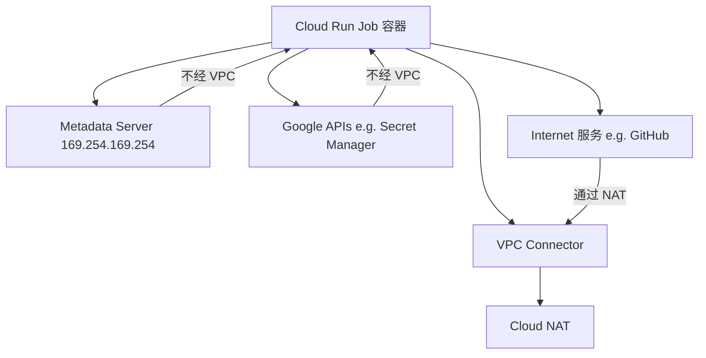

# Summary

- **当你配置了 VPC Connector 且 --vpc-egress=all-traffic 时，Cloud Run 的所有出站流量都会走 VPC，此时 metadata server 的流量也会被错误地 NAT 出网**，导致返回错误或 403。
- 日志指出了 **Cloud Run Job 容器内访问 metadata server 失败，状态码是 403**，而且从错误页面来看，是被 **公司内部代理（Squid）拦截了**。
- 那比如我既想让访问 Google 的 metadata 又想要能访问公司内部的 github 或者 Jira 或者 nexus  应该如何配置这个 cloud run 的网络?对于我们 GCE 里面的主机 我们配置了自己的路由允许其访问这些地址
-

---

## **🔍 先说结论**

> **Cloud Run 已正确使用了 Service Account，但访问 metadata server 失败是由于网络拦截，不是权限或 token 问题。**

---

## **🔍 报错关键分析**

你看到的核心报错是：

```
Failed to retrieve http://metadata.google.internal/computeMetadata/v1/instance/service-accounts/... from the Google Compute Engine metadata service. Status: 403
...
<title>ERROR: The requested URL could not be retrieved</title>
...
The Squid Software Foundation
```

说明：

- Cloud Run Job 容器尝试访问 metadata server（**169.254.169.254 / metadata.google.internal**）。
- 被代理（如 squid）拦截了访问，返回了 **403 Forbidden**。
- 导致 gcloud 和 google-cloud-\* 客户端拿不到 ADC 的 Token。

---

## **✅ Cloud Run Job 中访问 metadata server 的正常流程**

在 Cloud Run 中，metadata server 是通过如下方式访问的：

```
curl -H "Metadata-Flavor: Google" http://metadata.google.internal/computeMetadata/v1/
```

或者你运行 gcloud、Python 客户端时，内部也会尝试访问它。

---

## **❗ 为什么你这里失败？**

### **可能原因：**

1. **你的 Cloud Run Job 是通过 Serverless VPC Access Connector 出网的**
2. 你使用了 **VPC Connector + --vpc-egress=all-traffic**
3. 此时 metadata 请求也被强制通过 VPC 转发，导致无法命中 Google 内部提供的 metadata 服务地址
4. 你所在的网络配置里拦截了 metadata.google.internal（比如 DNS 重写或 squid 拦截）

---

## **🛠️ 解决方案**

### **✅ 方案 1：保留 metadata server 通路（**

### **推荐**

### **）**

你当前使用：

```
--vpc-connector=xxx \
--vpc-egress=all-traffic
```

改为：

```
--vpc-egress=private-ranges-only
```

说明：

- private-ranges-only 只让私有地址（如你的 GitHub、数据库）走 VPC 出口
- 其它请求（如访问 metadata）仍然保留走 Google 管理的路径
- 这样可以让 Cloud Run 正常访问 metadata server 获取 token

> ⚠️ 此方案需要你确认，访问 GitHub、API Server 是否仍然能走出公网（可以配置 Cloud NAT）

---

### **✅ 方案 2：配置内部 DNS 保留 metadata**

确保 metadata 地址没有被 DNS 重写或 HTTP 代理拦截：

- 保留 169.254.169.254 的默认路由
- 不要将 metadata 请求通过 proxy 或 redirect 重写

---

## **🔁 补充你的问题：**

> 我只是运行脚本，比如 ./a.sh -e env -c component，那应该怎么处理 gcloud 的身份？

**如果 metadata 正常可用，就不需要 gcloud auth login 或 activate-service-account。**

比如：

```
gcloud compute instance-groups managed list \
    --filter="name ~ 'mig-.*'" \
    --format="value(name)"
```

这类命令会自动使用当前容器内的 ADC，也就是通过 --service-account 指定的服务账号。

---

## **✅ 总结建议**

| **问题点**                                                   | **状态**                 |
| ------------------------------------------------------------ | ------------------------ |
| Cloud Run 使用了指定 Service Account                         | ✅ 正确                  |
| 出现 metadata 403 错误                                       | ❌ Squid 或 VPC 路由拦截 |
| 建议使用 --vpc-egress=private-ranges-only                    | ✅ 推荐做法              |
| 避免脚本里使用 gcloud auth login 或 activate-service-account | ✅ 应该避免              |

---

如果你需要我帮你生成一份 Cloud Run Job 的推荐配置，包括 VPC、NAT、网络范围等搭配示例，也可以提供。是否需要？

好的，下面是一份推荐配置，适用于你的场景：**Cloud Run Job 需要访问私有资源（如 GitHub、数据库），又需要使用 Metadata Server 获取 Service Account Token 来运行脚本（如 gcloud 命令）**。

---

## **✅ 推荐配置目标**

- ✅ 支持访问外部服务（如 GitHub）
- ✅ 支持通过 Service Account 使用 gcloud（自动使用 ADC）
- ✅ 不需 gcloud auth 命令，也不需要 key 文件
- ✅ 避免 metadata server 被拦截（保留默认访问通路）

---

## **🧱 架构概览（推荐路径）**



---

## **🧾 推荐配置参数（部署 Job）**

```
gcloud run jobs deploy my-agent-4 \
  --image=europe-west2-docker.pkg.dev/myproject/containers/my-agent:latest \
  --region=europe-west2 \
  --vpc-connector=vpc-conn-europe \
  --vpc-egress=private-ranges-only \    # ✅ 核心：保留 metadata 通路
  --max-retries=3 \
  --set-env-vars=env=pdev,name=testvalue,region=uk,version=release_17.0.0 \
  --set-secrets=cloud_run_secret=cloud_run_test:latest \
  --task-timeout=10m \
  --cpu=1 \
  --memory=512Mi \
  --labels=refersh=image \
  --key=projects/my-kms-project/locations/europe-west2/keyRings/run/cryptoKeys/HSMrunSharedKey \
  --project=myproject \
  --service-account=mgmt@myproject.iam.gserviceaccount.com
```

---

## **🌐 网络组件配置建议**

### **1️⃣ Serverless VPC Access Connector**

创建时建议使用一个 /28 的子网段：

```
gcloud compute networks vpc-access connectors create vpc-conn-europe \
  --region=europe-west2 \
  --network=default \
  --range=10.8.0.0/28
```

> ⚠️ 注意 --range 是一个小的 CIDR，不应与已有子网冲突。

---

### **2️⃣ Cloud NAT（支持出公网）**

```
gcloud compute routers create nat-router-europe \
  --network=default \
  --region=europe-west2

gcloud compute routers nats create nat-config-europe \
  --router=nat-router-europe \
  --region=europe-west2 \
  --nat-all-subnet-ip-ranges \
  --enable-logging
```

---

## **✅ 权限配置**

确保你绑定的 SA（例如 mgmt@myproject.iam.gserviceaccount.com）具备：

| **GCP 服务**                     | **IAM Role**                       |
| -------------------------------- | ---------------------------------- |
| Secret Manager                   | roles/secretmanager.secretAccessor |
| Compute API（如 gcloud compute） | roles/compute.viewer 或更细粒度    |
| Logging                          | roles/logging.logWriter            |
| 其他你使用到的 API               | 对应读写权限                       |

---

## **🧪 测试脚本（容器内）**

```
#!/bin/bash
echo "🔧 获取 metadata 中的 access token"
ACCESS_TOKEN=$(curl -s -H "Metadata-Flavor: Google" \
  "http://metadata.google.internal/computeMetadata/v1/instance/service-accounts/default/token" | jq -r .access_token)

echo "✅ token 已获取"

echo "📡 测试调用 compute API"
gcloud compute instance-groups managed list \
  --format="table(name,region)" || echo "⚠️ gcloud 调用失败"
```

---

## **✅ 总结表格：关键参数说明**

| **参数**                         | **说明**                                  |
| -------------------------------- | ----------------------------------------- |
| --vpc-connector                  | 用于让 Cloud Run 能连接 VPC               |
| --vpc-egress=private-ranges-only | 保留 metadata server 直连通路（不经 VPC） |
| Cloud NAT                        | 支持出公网访问                            |
| Service Account 权限             | 需具备 GCP API 调用权限                   |
| 容器内 gcloud / 客户端库         | 自动使用 ADC，无需显式登录                |

---

如你需要我补一份部署检查 checklist 或 Terraform 配置，也可以告诉我。是否还需要？

你的理解非常接近真实情况，下面我为你系统梳理下 Cloud Run 和 GCE 中 metadata server 的访问机制及 DNS/IP 解析的区别，并回答你关于是否可以在 Cloud Run 中用 169.254.169.254 或自定义 DNS 的问题。

---

## **✅ GCP Metadata Server 概览**

GCP 提供的 **Metadata Server** 是通过以下固定地址暴露的：

```
http://metadata.google.internal/
```

或者它的底层 IP：

```
http://169.254.169.254/
```

这两者是等价的，**都指向 metadata server 本身**，其中：

- metadata.google.internal 是一个 GCP 内部 DNS 域名；
- 169.254.169.254 是 [RFC 3927](https://datatracker.ietf.org/doc/html/rfc3927) 定义的 Link-local 地址，是不经过网关、路由器的本地直接地址。

---

## **📍 Cloud Run vs GCE 中访问 metadata server 的区别**

| **特性**                 | **GCE VM 实例**                             | **Cloud Run 容器**                               |
| ------------------------ | ------------------------------------------- | ------------------------------------------------ |
| 网络环境                 | 完整 VPC 网络 + 外网                        | 沙箱环境，仅支持 VPC Connector（可选）           |
| Metadata 地址解析方式    | 可使用 DNS（metadata.google.internal）或 IP | 同样支持 DNS 和 IP，但行为与 VPC Egress 配置有关 |
| 能否访问 Metadata Server | ✅ 默认可访问                               | ✅ 默认可访问，但配置错误时可能失败              |
| 是否可自定义 DNS         | ✅ 完全可控                                 | ❌ 不可自定义 DNS，Cloud Run 采用隔离的 DNS 服务 |

---

## **📌 回答你的问题**

### **❓ 你问：**

> 我能不能在 Cloud Run 中通过配置 DNS 或直接使用 IP（如 nameserver 169.254.169.254）来访问 metadata？

### **✅ 回答：**

1. ✅ **你可以直接使用 169.254.169.254，不需要配置 DNS。**

```
curl -H "Metadata-Flavor: Google" http://169.254.169.254/computeMetadata/v1/
```

1. 它是 metadata server 的真实 IP，**不依赖 DNS 服务**。
2. ❌ **你不能也不需要修改 /etc/resolv.conf 或 DNS 配置来指定 metadata server 的 IP。**

    - Cloud Run 是一个受限的托管环境，不支持修改 /etc/resolv.conf。
    - 而且 GCP 已内置了 metadata.google.internal 到 DNS 中。

3. ⚠️ 关键点：**当你配置了 VPC Connector 且 --vpc-egress=all-traffic 时，Cloud Run 的所有出站流量都会走 VPC，此时 metadata server 的流量也会被错误地 NAT 出网**，导致返回错误或 403。

---

## **🧯 解决 metadata server 访问 403 的关键设置**

```
--vpc-egress=private-ranges-only
```

- ✅ 这个设置会让 metadata server（169.254.169.254）走 **默认直连路径（link-local）**，不会被转发到 VPC/NAT。
- 否则 Cloud NAT 不允许访问 169.254.169.254，会返回类似 403 或 ERR_EMPTY_RESPONSE 错误。

---

## **✅ 最推荐的方式**

在 Cloud Run Job 中访问 metadata server，建议你使用**明确的 IP 地址**，例如：

```
curl -H "Metadata-Flavor: Google" http://169.254.169.254/computeMetadata/v1/instance/service-accounts/default/token
```

或者用：

```
curl -H "Metadata-Flavor: Google" http://metadata.google.internal/computeMetadata/v1/instance/service-accounts/default/token
```

这两者效果相同，只要你设置了：

```
--vpc-egress=private-ranges-only
```

---

## **✅ 总结表格**

| **项目**                      | **是否可行**                       | **建议**                     |
| ----------------------------- | ---------------------------------- | ---------------------------- |
| 使用 169.254.169.254          | ✅                                 | 最稳妥，绕过 DNS             |
| 使用 metadata.google.internal | ✅                                 | 默认解析正常，只要没错误配置 |
| 修改 /etc/resolv.conf         | ❌                                 | Cloud Run 不支持             |
| --vpc-egress=all-traffic      | ⚠️ 易导致 metadata server 不可访问 | 建议改为 private-ranges-only |

---

如果你想我给你写一个用于 Cloud Run Job 的 shell 脚本模板，自动调用 metadata 获取 token 并执行 gcloud 命令，也可以告诉我。是否需要？

下面是一个适用于 **Cloud Run Job** 的 Shell 脚本模板，它将使用 Metadata Server 自动获取当前绑定的 **Service Account 的 OAuth Token**，然后通过 gcloud 命令进行后续操作（如调用 GCE、Cloud Storage 等服务），**无需手动认证或密钥文件**。

---

### **✅ 脚本目标**

- 通过 Metadata Server 获取当前 Job 使用的 Service Account 的访问 Token；
- 利用该 Token 通过 gcloud 或 curl 调用 GCP API；
- 避免使用 gcloud auth login 或 gcloud auth activate-service-account;

---

### **📄** 

### **run-job.sh**

```
#!/bin/bash
set -euo pipefail

# 获取 ADC token（使用 metadata server）
get_access_token() {
  curl -s -H "Metadata-Flavor: Google" \
    "http://169.254.169.254/computeMetadata/v1/instance/service-accounts/default/token" \
    | jq -r '.access_token'
}

# 设置 gcloud 使用 access token
configure_gcloud_token() {
  local TOKEN="$1"
  gcloud config set auth/disable_credentials true
  gcloud auth activate-refresh-token "dummy-user" "$TOKEN"
}

# 示例函数：使用 gcloud 获取 GCE managed instance groups（MIG）
list_migs() {
  local REGION="$1"
  local TOKEN
  TOKEN=$(get_access_token)

  # 使用 token 设置 gcloud 会话
  configure_gcloud_token "$TOKEN"

  echo "[INFO] Listing MIGs in region: $REGION"
  gcloud compute instance-groups managed list --filter="region:($REGION)"
}

# 主入口
main() {
  REGION="${1:-europe-west2}"
  list_migs "$REGION"
}

main "$@"
```

---

### **✅ 使用方式（示例 Cloud Run Job 配置）**

```
gcloud run jobs deploy my-agent-job \
  --image=gcr.io/myproject/myimage \
  --region=europe-west2 \
  --vpc-connector=my-vpc-conn \
  --vpc-egress=private-ranges-only \ # ⚠️ 非常重要！
  --service-account=my-sa@myproject.iam.gserviceaccount.com \
  --task-timeout=10m \
  --memory=512Mi \
  --cpu=1 \
  --args="europe-west2"
```

---

### **✅ 脚本依赖**

请确保你的容器镜像中预装了以下工具：

```
RUN apt-get update && apt-get install -y curl jq google-cloud-cli
```

---

### **✅ Mermaid 流程图说明**

```
flowchart TD
    A[Cloud Run Job 启动] --> B[通过 metadata server 获取 access token]
    B --> C[使用 token 配置 gcloud]
    C --> D[执行 gcloud 命令调用 GCP API]
```

---

如果你希望换成使用纯 curl 调用 GCP REST API 的形式（不依赖 gcloud CLI），我也可以提供另一个版本。是否需要？

--vpc-egress 是 Cloud Run（尤其是 Job）配置 VPC Connector 出站流量行为的关键选项，它控制了**哪些流量需要经过你配置的 VPC 网络**，影响权限、NAT、连通性和访问 Metadata Server。

---

## **✅ 参数选项解释**

| **参数值**                  | **说明**                                                                                                       |
| --------------------------- | -------------------------------------------------------------------------------------------------------------- |
| private-ranges-only（默认） | **只有目标是 RFC1918 私有 IP** 的出站流量才会通过 VPC Connector，其它如 metadata server、公网 DNS 仍走默认路径 |
| all-traffic                 | **所有出站流量（包括访问 metadata server、Google API）** 都会被强制走 VPC Connector，需要配合 Cloud NAT 使用   |

---

## **🔍 详细对比**

| **比较点**                      | --vpc-egress=private-ranges-only                  | --vpc-egress=all-traffic                   |
| ------------------------------- | ------------------------------------------------- | ------------------------------------------ |
| 默认行为                        | ✅ 是默认设置                                     | ❌ 不是默认，需手动开启                    |
| Metadata Server 访问            | ✅ 保留默认 metadata 路径，可访问 169.254.169.254 | ❌ 被强制转发，经常访问失败（403）         |
| DNS 解析行为                    | 使用 Cloud Run 内置 DNS，默认行为                 | 仍然使用 Cloud DNS，但所有解析流量经过 VPC |
| 访问 GCP API（如 gcr.io）       | ✅ 默认走外部直连，不需 NAT                       | ❌ 必须依赖 Cloud NAT 否则失败             |
| 访问私有 GCE VM / 私有 Redis 等 | ✅ 可访问（如果 VPC Connector 配置正确）          | ✅ 可访问                                  |
| 容器内部网络能力                | 限制：只有访问私网 IP 走 VPC Connector            | 所有都走 VPC，更可控但更易出错             |
| 常见问题                        | 很少，最稳定                                      | 容易遇到 metadata 403、curl timeout 等     |

---

## **📌 应用场景对比**

### **✅ 适合使用** 

### **private-ranges-only**

###  **的场景：**

- 默认使用，无需配置 NAT；
- Cloud Run 需要访问私有资源（如 GCE、Memorystore），同时还需访问 metadata server；
- 需要访问公网 API，GCP API；
- 最少出错情况。

### **✅ 适合使用** 

### **all-traffic**

###  **的场景：**

- 企业对出站流量审计或强管控（全流量必须走 VPC + NAT + Firewall）；
- 需要 VPC DNS，Private Google Access；
- 已配置好 NAT Gateway 和完整路由。

---

## **❗ 典型错误示例（你遇到的就属于这种）**

```
There was a problem refreshing your current auth tokens:
Failed to retrieve http://metadata.google.internal/...
```

这种情况就很可能是：

- 设置了 --vpc-egress=all-traffic；
- 没有为 metadata server 设置路由/Cloud NAT；
- 导致 Cloud Run 无法访问 169.254.169.254。

---

## **✅ 最安全建议**

```
--vpc-egress=private-ranges-only
```

保留 metadata 和 GCP 默认访问通道，避免权限和连接问题，是最推荐的设置。

---

## **✅ Mermaid 图示**

```
flowchart TD
    A[Cloud Run Job 容器] -->|访问私有IP（如10.x）| B[VPC Connector]
    A -->|访问 metadata.google.internal| C[默认 metadata 路径]
    A -->|访问 GCP API（如 gcr.io）| D[直连公网或 Google 直连]
    style C fill:#aaffaa,stroke:#333,stroke-width:2px
```

```
flowchart TD
    A[Cloud Run Job 容器 --vpc-egress=all-traffic] -->|所有出站流量| B[VPC Connector]
    B -->|需要 NAT 才能出公网| C[Cloud NAT]
    B -->|访问 metadata.google.internal| D[失败 ❌]
    style D fill:#ffaaaa,stroke:#f00,stroke-width:2px
```

---

如你还有 Cloud NAT 或 VPC 路由的配置不清晰，也可以告诉我，我可以帮你生成 Cloud NAT 配置建议和路由图。是否需要？


非常好的问题！这是 **Cloud Run 网络设计中最常见的需求之一**：

  

> ✅「既能访问 Google 内部的 metadata server，又能访问公司私有系统（如 GitHub Enterprise / Jira / Nexus 等）」

---

## **✅ 目标需求分析**

|**需求**|**网络路径类型**|**是否需要经过 VPC**|
|---|---|---|
|访问 GCP Metadata Server (169.254.169.254)|GCP 内部特殊 IP|❌ 不能走 VPC（否则失效）|
|访问公司内部 GitHub/Jira/Nexus（一般是私网地址或固定公网 IP）|通常是私有地址或 NAT 访问|✅ 必须走 VPC Connector|

---

## **✅ 正确做法总结：**

```
✅ 设置 VPC Connector
✅ 使用 --vpc-egress=private-ranges-only
✅ 创建 Private Route + DNS/Firewall 规则，确保 Cloud Run 能访问公司内部服务
```

---

## **✅ 推荐配置方案如下**

  

### **1. VPC Connector 创建（假设你已存在）**

```
gcloud compute networks vpc-access connectors create vpc-conn-europe \
  --region=europe-west2 \
  --network=default \
  --range=10.8.0.0/28
```

> ⚠️ 该 range 是 Cloud Run 发出的 IP，需要纳入你的防火墙策略！

---

### **2. Cloud Run Job 配置：**

```
gcloud run jobs deploy my-job \
  --image=gcr.io/myproject/my-image \
  --region=europe-west2 \
  --vpc-connector=vpc-conn-europe \
  --vpc-egress=private-ranges-only \
  --service-account=your-job-sa@your-project.iam.gserviceaccount.com \
  ...
```

> ✅ 保留 metadata server 可用（因为没设置 all-traffic）

> ✅ 访问公司内网地址自动走 VPC Connector

---

### **3. 私有地址接入：路由 / DNS / 防火墙准备**

  

#### **📌 如果你的 GitHub/Jira/Nexus 是「私网地址」**

|**项目**|**配置项**|
|---|---|
|🔁 路由|Cloud Run 出的流量通过 VPC Connector 指向你的 VPC，VPC 必须能路由到这些 IP|
|🧱 防火墙|允许 10.8.0.0/28 的出站 IP 访问内部服务|
|🧭 DNS|DNS 解析内部域名（如 nexus.internal.mycorp.com），可使用 Cloud DNS 转发或 /etc/hosts 注入|

#### **📌 如果是公网 IP（但公司控制访问）**

  

你需要在 VPC 的防火墙规则中允许 Cloud Run VPC Connector 的 IP 范围（如 10.8.0.0/28）访问这些公网地址。

---

## **❗避免的做法**

|**错误做法**|**问题**|
|---|---|
|--vpc-egress=all-traffic|会导致 metadata server 访问失败 unless 特别设置|
|不设置 VPC Connector|无法访问私网地址（Nexus/Jira）|
|忽略 DNS 设置|无法解析你公司的域名服务地址|

---

## **✅ Mermaid 流程图说明**

```
flowchart TD
    A[Cloud Run 容器] -->|访问 metadata server| B[169.254.169.254]
    A -->|访问私有 GitHub/Jira/Nexus| C[VPC Connector]
    C --> D[Company Private Network]
    B --> E[返回 Access Token]
```

---

## **✅ DNS 提示（如你需要）**

  

若你使用内网域名如：

- nexus.mycorp.local
    
- jira.intra.local
    

  

你可以使用 Cloud DNS 转发器：

```
gcloud dns policies create custom-dns-policy \
  --description="Forward internal domains" \
  --networks=default \
  --enable-inbound-forwarding \
  --enable-logging

gcloud dns policies update custom-dns-policy \
  --add-dns-forwarding-targets=10.1.2.3 \
  --target-name-servers=your.internal.dns.server
```

---

## **✅ 总结**

|**动作**|**是否需要**|
|---|---|
|设置 VPC Connector|✅|
|使用 all-traffic|❌（避免）|
|保留 metadata 可用|✅（默认即可）|
|创建内部服务可访问路由 + DNS|✅|

---

需要我帮你生成一个完整的 GCP 资源清单（包括 VPC Connector、DNS 策略、防火墙）吗？可以直接出 Markdown 表格 + flow 图形式。