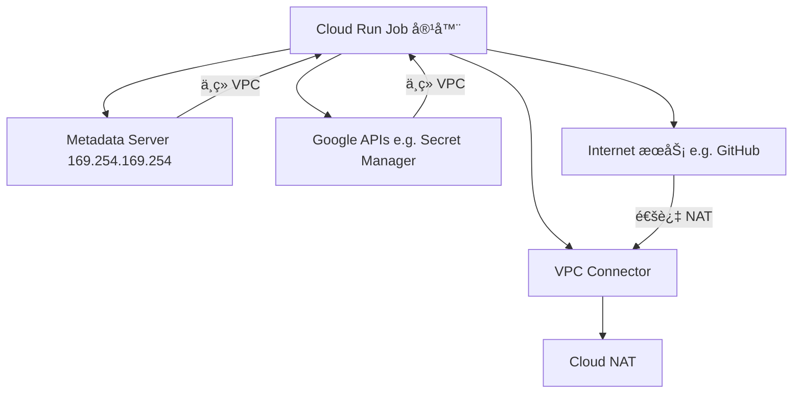

# Summary

- **当你é…置了 VPC Connector 且 --vpc-egress=all-traffic 时，Cloud Run 的所有出站æµé‡éƒ½ä¼šèµ° VPC，此时 metadata server çš„æµé‡ä¹Ÿä¼šè¢«é”™è¯¯åœ° NAT 出网**，导致返å›é”™è¯¯æˆ– 403。
- 日志指出了 **Cloud Run Job 容器内访问 metadata server 失败，状æ€ç æ˜¯ 403**，而且ä»é”™è¯¯é¡µé¢æ¥çœ‹ï¼Œæ˜¯è¢« **å…¬å¸å†…部代ç†ï¼ˆSquid）拦截了**。
- 那比如我既想让访问 Google çš„ metadata åˆæƒ³è¦èƒ½è®¿é—®å…¬å¸å†…部的 github 或者 Jira 或者 nexus  应该如何é…置这个 cloud run 的网络?对äºæˆ‘们 GCE 里é¢çš„主机 我们é…置了自己的路由å…许其访问这些地å€
-

---

## **🔠先说结论**

> **Cloud Run 已正确使用了 Service Account，但访问 metadata server 失败是由äºç½‘络拦截，ä¸æ˜¯æƒé™æˆ– token 问题。**

---

## **🔠报错关键分æ**

你看到的核心报错是：

```
Failed to retrieve http://metadata.google.internal/computeMetadata/v1/instance/service-accounts/... from the Google Compute Engine metadata service. Status: 403
...
<title>ERROR: The requested URL could not be retrieved</title>
...
The Squid Software Foundation
```

说æ˜ï¼š

- Cloud Run Job 容器å°è¯•è®¿é—® metadata server（**169.254.169.254 / metadata.google.internal**）。
- 被代ç†ï¼ˆå¦‚ squid）拦截了访问，返å›äº† **403 Forbidden**。
- 导致 gcloud å’Œ google-cloud-\* 客户端拿ä¸åˆ° ADC çš„ Token。

---

## **✅ Cloud Run Job 中访问 metadata server 的正常æµç¨‹**

在 Cloud Run 中，metadata server 是通过如下方å¼è®¿é—®çš„：

```
curl -H "Metadata-Flavor: Google" http://metadata.google.internal/computeMetadata/v1/
```

或者你è¿è¡Œ gcloudã€Python 客户端时，内部也会å°è¯•è®¿é—®å®ƒã€‚

---

## **◠为什么你这里失败？**

### **å¯èƒ½åŸå› ï¼š**

1. **你的 Cloud Run Job 是通过 Serverless VPC Access Connector 出网的**
2. 你使用了 **VPC Connector + --vpc-egress=all-traffic**
3. 此时 metadata 请求也被强制通过 VPC 转å‘，导致无法命中 Google 内部æ供的 metadata æœåŠ¡åœ°å€
4. 你所在的网络é…置里拦截了 metadata.google.internal（比如 DNS é‡å†™æˆ– squid 拦截）

---

## **ğŸ› ï¸ è§£å†³æ–¹æ¡ˆ**

### **✅ 方案 1：ä¿ç•™ metadata server 通路（**

### **æ¨è**

### **）**

你当å‰ä½¿ç”¨ï¼š

```
--vpc-connector=xxx \
--vpc-egress=all-traffic
```

改为：

```
--vpc-egress=private-ranges-only
```

说æ˜ï¼š

- private-ranges-only åªè®©ç§æœ‰åœ°å€ï¼ˆå¦‚ä½ çš„ GitHubã€æ•°æ®åº“）走 VPC 出å£
- 其它请求（如访问 metadata）ä»ç„¶ä¿ç•™èµ° Google 管ç†çš„路径
- 这样å¯ä»¥è®© Cloud Run 正常访问 metadata server è·å– token

> âš ï¸ æ­¤æ–¹æ¡ˆéœ€è¦ä½ ç¡®è®¤ï¼Œè®¿é—® GitHubã€API Server 是å¦ä»ç„¶èƒ½èµ°å‡ºå…¬ç½‘（å¯ä»¥é…ç½® Cloud NAT）

---

### **✅ 方案 2：é…置内部 DNS ä¿ç•™ metadata**

ç¡®ä¿ metadata 地å€æ²¡æœ‰è¢« DNS é‡å†™æˆ– HTTP 代ç†æ‹¦æˆªï¼š

- ä¿ç•™ 169.254.169.254 的默认路由
- ä¸è¦å°† metadata 请求通过 proxy 或 redirect é‡å†™

---

## **🔠补充你的问题：**

> 我åªæ˜¯è¿è¡Œè„šæœ¬ï¼Œæ¯”如 ./a.sh -e env -c component，那应该æ€ä¹ˆå¤„ç† gcloud 的身份？

**å¦‚æœ metadata 正常å¯ç”¨ï¼Œå°±ä¸éœ€è¦ gcloud auth login 或 activate-service-account。**

比如：

```
gcloud compute instance-groups managed list \
    --filter="name ~ 'mig-.*'" \
    --format="value(name)"
```

这类命令会自动使用当å‰å®¹å™¨å†…çš„ ADC，也就是通过 --service-account 指定的æœåŠ¡è´¦å·ã€‚

---

## **✅ 总结建议**

| **问题点**                                                   | **状æ€**                 |
| ------------------------------------------------------------ | ------------------------ |
| Cloud Run 使用了指定 Service Account                         | ✅ 正确                  |
| å‡ºç° metadata 403 错误                                       | ⌠Squid 或 VPC 路由拦截 |
| 建议使用 --vpc-egress=private-ranges-only                    | ✅ æ¨èåšæ³•              |
| é¿å…脚本里使用 gcloud auth login 或 activate-service-account | ✅ 应该é¿å…              |

---

如æœä½ éœ€è¦æˆ‘帮你生æˆä¸€ä»½ Cloud Run Job çš„æ¨èé…置，包括 VPCã€NATã€ç½‘络范围等æ­é…示例，也å¯ä»¥æ供。是å¦éœ€è¦ï¼Ÿ

好的，下é¢æ˜¯ä¸€ä»½æ¨èé…置，适用äºä½ çš„场景：**Cloud Run Job 需è¦è®¿é—®ç§æœ‰èµ„æºï¼ˆå¦‚ GitHubã€æ•°æ®åº“），åˆéœ€è¦ä½¿ç”¨ Metadata Server è·å– Service Account Token æ¥è¿è¡Œè„šæœ¬ï¼ˆå¦‚ gcloud 命令）**。

---

## **✅ æ¨èé…置目标**

- ✅ 支æŒè®¿é—®å¤–部æœåŠ¡ï¼ˆå¦‚ GitHub）
- ✅ 支æŒé€šè¿‡ Service Account 使用 gcloud（自动使用 ADC）
- ✅ ä¸éœ€ gcloud auth 命令，也ä¸éœ€è¦ key 文件
- ✅ é¿å… metadata server 被拦截（ä¿ç•™é»˜è®¤è®¿é—®é€šè·¯ï¼‰

---

## **🧱 æ¶æ„概览（æ¨è路径）**



---

## **🧾 æ¨èé…ç½®å‚数（部署 Job）**

```
gcloud run jobs deploy my-agent-4 \
  --image=europe-west2-docker.pkg.dev/myproject/containers/my-agent:latest \
  --region=europe-west2 \
  --vpc-connector=vpc-conn-europe \
  --vpc-egress=private-ranges-only \    # ✅ 核心：ä¿ç•™ metadata 通路
  --max-retries=3 \
  --set-env-vars=env=pdev,name=testvalue,region=uk,version=release_17.0.0 \
  --set-secrets=cloud_run_secret=cloud_run_test:latest \
  --task-timeout=10m \
  --cpu=1 \
  --memory=512Mi \
  --labels=refersh=image \
  --key=projects/my-kms-project/locations/europe-west2/keyRings/run/cryptoKeys/HSMrunSharedKey \
  --project=myproject \
  --service-account=mgmt@myproject.iam.gserviceaccount.com
```

---

## **🌠网络组件é…置建议**

### **1ï¸âƒ£ Serverless VPC Access Connector**

创建时建议使用一个 /28 çš„å­ç½‘段：

```
gcloud compute networks vpc-access connectors create vpc-conn-europe \
  --region=europe-west2 \
  --network=default \
  --range=10.8.0.0/28
```

> âš ï¸ æ³¨æ„ --range 是一个å°çš„ CIDR，ä¸åº”ä¸å·²æœ‰å­ç½‘冲çªã€‚

---

### **2ï¸âƒ£ Cloud NAT（支æŒå‡ºå…¬ç½‘）**

```
gcloud compute routers create nat-router-europe \
  --network=default \
  --region=europe-west2

gcloud compute routers nats create nat-config-europe \
  --router=nat-router-europe \
  --region=europe-west2 \
  --nat-all-subnet-ip-ranges \
  --enable-logging
```

---

## **✅ æƒé™é…ç½®**

ç¡®ä¿ä½ ç»‘定的 SA（例如 mgmt@myproject.iam.gserviceaccount.com）具备：

| **GCP æœåŠ¡**                     | **IAM Role**                       |
| -------------------------------- | ---------------------------------- |
| Secret Manager                   | roles/secretmanager.secretAccessor |
| Compute API（如 gcloud compute） | roles/compute.viewer 或更细粒度    |
| Logging                          | roles/logging.logWriter            |
| 其他你使用到的 API               | 对应读写æƒé™                       |

---

## **🧪 测试脚本（容器内）**

```
#!/bin/bash
echo "🔧 è·å– metadata 中的 access token"
ACCESS_TOKEN=$(curl -s -H "Metadata-Flavor: Google" \
  "http://metadata.google.internal/computeMetadata/v1/instance/service-accounts/default/token" | jq -r .access_token)

echo "✅ token å·²è·å–"

echo "📡 测试调用 compute API"
gcloud compute instance-groups managed list \
  --format="table(name,region)" || echo "âš ï¸ gcloud 调用失败"
```

---

## **✅ 总结表格：关键å‚数说æ˜**

| **å‚æ•°**                         | **说æ˜**                                  |
| -------------------------------- | ----------------------------------------- |
| --vpc-connector                  | 用äºè®© Cloud Run 能è¿æ¥ VPC               |
| --vpc-egress=private-ranges-only | ä¿ç•™ metadata server ç›´è¿é€šè·¯ï¼ˆä¸ç» VPC） |
| Cloud NAT                        | 支æŒå‡ºå…¬ç½‘访问                            |
| Service Account æƒé™             | 需具备 GCP API 调用æƒé™                   |
| 容器内 gcloud / 客户端库         | 自动使用 ADC，无需显å¼ç™»å½•                |

---

如你需è¦æˆ‘补一份部署检查 checklist 或 Terraform é…置，也å¯ä»¥å‘Šè¯‰æˆ‘。是å¦è¿˜éœ€è¦ï¼Ÿ

ä½ çš„ç†è§£é常æ¥è¿‘真å®æƒ…况，下é¢æˆ‘为你系统梳ç†ä¸‹ Cloud Run å’Œ GCE 中 metadata server çš„è®¿é—®æœºåˆ¶åŠ DNS/IP 解æ的区别，并å›ç­”ä½ å…³äºæ˜¯å¦å¯ä»¥åœ¨ Cloud Run 中用 169.254.169.254 或自定义 DNS 的问题。

---

## **✅ GCP Metadata Server 概览**

GCP æ供的 **Metadata Server** 是通过以下固定地å€æš´éœ²çš„：

```
http://metadata.google.internal/
```

或者它的底层 IP：

```
http://169.254.169.254/
```

这两者是等价的，**éƒ½æŒ‡å‘ metadata server 本身**，其中：

- metadata.google.internal 是一个 GCP 内部 DNS 域åï¼›
- 169.254.169.254 是 [RFC 3927](https://datatracker.ietf.org/doc/html/rfc3927) 定义的 Link-local 地å€ï¼Œæ˜¯ä¸ç»è¿‡ç½‘å…³ã€è·¯ç”±å™¨çš„本地直æ¥åœ°å€ã€‚

---

## **📠Cloud Run vs GCE 中访问 metadata server 的区别**

| **特性**                 | **GCE VM å®ä¾‹**                             | **Cloud Run 容器**                               |
| ------------------------ | ------------------------------------------- | ------------------------------------------------ |
| 网络ç¯å¢ƒ                 | 完整 VPC 网络 + 外网                        | 沙箱ç¯å¢ƒï¼Œä»…æ”¯æŒ VPC Connector（å¯é€‰ï¼‰           |
| Metadata 地å€è§£ææ–¹å¼    | å¯ä½¿ç”¨ DNS（metadata.google.internal）或 IP | åŒæ ·æ”¯æŒ DNS å’Œ IPï¼Œä½†è¡Œä¸ºä¸ VPC Egress é…置有关 |
| 能å¦è®¿é—® Metadata Server | ✅ 默认å¯è®¿é—®                               | ✅ 默认å¯è®¿é—®ï¼Œä½†é…置错误时å¯èƒ½å¤±è´¥              |
| 是å¦å¯è‡ªå®šä¹‰ DNS         | ✅ 完全å¯æ§                                 | ⌠ä¸å¯è‡ªå®šä¹‰ DNS，Cloud Run 采用隔离的 DNS æœåŠ¡ |

---

## **📌 å›ç­”你的问题**

### **ⓠ你问：**

> 我能ä¸èƒ½åœ¨ Cloud Run 中通过é…ç½® DNS 或直æ¥ä½¿ç”¨ IP（如 nameserver 169.254.169.254）æ¥è®¿é—® metadata？

### **✅ å›ç­”：**

1. ✅ **ä½ å¯ä»¥ç›´æ¥ä½¿ç”¨ 169.254.169.254，ä¸éœ€è¦é…ç½® DNS。**

```
curl -H "Metadata-Flavor: Google" http://169.254.169.254/computeMetadata/v1/
```

1. 它是 metadata server çš„çœŸå® IP，**ä¸ä¾èµ– DNS æœåŠ¡**。
2. ⌠**ä½ ä¸èƒ½ä¹Ÿä¸éœ€è¦ä¿®æ”¹ /etc/resolv.conf 或 DNS é…ç½®æ¥æŒ‡å®š metadata server çš„ IP。**

    - Cloud Run 是一个å—é™çš„托管ç¯å¢ƒï¼Œä¸æ”¯æŒä¿®æ”¹ /etc/resolv.conf。
    - 而且 GCP 已内置了 metadata.google.internal 到 DNS 中。

3. âš ï¸ å…³é”®ç‚¹ï¼š**当你é…置了 VPC Connector 且 --vpc-egress=all-traffic 时，Cloud Run 的所有出站æµé‡éƒ½ä¼šèµ° VPC，此时 metadata server çš„æµé‡ä¹Ÿä¼šè¢«é”™è¯¯åœ° NAT 出网**，导致返å›é”™è¯¯æˆ– 403。

---

## **🧯 解决 metadata server 访问 403 的关键设置**

```
--vpc-egress=private-ranges-only
```

- ✅ 这个设置会让 metadata server（169.254.169.254）走 **默认直è¿è·¯å¾„（link-local）**，ä¸ä¼šè¢«è½¬å‘到 VPC/NAT。
- å¦åˆ™ Cloud NAT ä¸å…许访问 169.254.169.254，会返å›ç±»ä¼¼ 403 或 ERR_EMPTY_RESPONSE 错误。

---

## **✅ 最æ¨èçš„æ–¹å¼**

在 Cloud Run Job 中访问 metadata server，建议你使用**æ˜ç¡®çš„ IP 地å€**，例如：

```
curl -H "Metadata-Flavor: Google" http://169.254.169.254/computeMetadata/v1/instance/service-accounts/default/token
```

或者用：

```
curl -H "Metadata-Flavor: Google" http://metadata.google.internal/computeMetadata/v1/instance/service-accounts/default/token
```

这两者效æœç›¸åŒï¼Œåªè¦ä½ è®¾ç½®äº†ï¼š

```
--vpc-egress=private-ranges-only
```

---

## **✅ 总结表格**

| **项目**                      | **是å¦å¯è¡Œ**                       | **建议**                     |
| ----------------------------- | ---------------------------------- | ---------------------------- |
| 使用 169.254.169.254          | ✅                                 | 最稳妥，绕过 DNS             |
| 使用 metadata.google.internal | ✅                                 | 默认解æ正常，åªè¦æ²¡é”™è¯¯é…ç½® |
| 修改 /etc/resolv.conf         | ⌠                                | Cloud Run ä¸æ”¯æŒ             |
| --vpc-egress=all-traffic      | âš ï¸ æ˜“å¯¼è‡´ metadata server ä¸å¯è®¿é—® | 建议改为 private-ranges-only |

---

如æœä½ æƒ³æˆ‘ç»™ä½ å†™ä¸€ä¸ªç”¨äº Cloud Run Job çš„ shell 脚本模æ¿ï¼Œè‡ªåŠ¨è°ƒç”¨ metadata è·å– token 并执行 gcloud 命令，也å¯ä»¥å‘Šè¯‰æˆ‘。是å¦éœ€è¦ï¼Ÿ

下é¢æ˜¯ä¸€ä¸ªé€‚ç”¨äº **Cloud Run Job** çš„ Shell 脚本模æ¿ï¼Œå®ƒå°†ä½¿ç”¨ Metadata Server 自动è·å–当å‰ç»‘定的 **Service Account çš„ OAuth Token**，然å通过 gcloud 命令进行åç»­æ“作（如调用 GCEã€Cloud Storage ç­‰æœåŠ¡ï¼‰ï¼Œ**无需手动认è¯æˆ–密钥文件**。

---

### **✅ 脚本目标**

- 通过 Metadata Server è·å–å½“å‰ Job 使用的 Service Account 的访问 Tokenï¼›
- 利用该 Token 通过 gcloud 或 curl 调用 GCP API；
- é¿å…使用 gcloud auth login 或 gcloud auth activate-service-account;

---

### **📄** 

### **run-job.sh**

```
#!/bin/bash
set -euo pipefail

# è·å– ADC token（使用 metadata server）
get_access_token() {
  curl -s -H "Metadata-Flavor: Google" \
    "http://169.254.169.254/computeMetadata/v1/instance/service-accounts/default/token" \
    | jq -r '.access_token'
}

# 设置 gcloud 使用 access token
configure_gcloud_token() {
  local TOKEN="$1"
  gcloud config set auth/disable_credentials true
  gcloud auth activate-refresh-token "dummy-user" "$TOKEN"
}

# 示例函数：使用 gcloud è·å– GCE managed instance groups（MIG）
list_migs() {
  local REGION="$1"
  local TOKEN
  TOKEN=$(get_access_token)

  # 使用 token 设置 gcloud 会è¯
  configure_gcloud_token "$TOKEN"

  echo "[INFO] Listing MIGs in region: $REGION"
  gcloud compute instance-groups managed list --filter="region:($REGION)"
}

# 主入å£
main() {
  REGION="${1:-europe-west2}"
  list_migs "$REGION"
}

main "$@"
```

---

### **✅ 使用方å¼ï¼ˆç¤ºä¾‹ Cloud Run Job é…置）**

```
gcloud run jobs deploy my-agent-job \
  --image=gcr.io/myproject/myimage \
  --region=europe-west2 \
  --vpc-connector=my-vpc-conn \
  --vpc-egress=private-ranges-only \ # âš ï¸ é常é‡è¦ï¼
  --service-account=my-sa@myproject.iam.gserviceaccount.com \
  --task-timeout=10m \
  --memory=512Mi \
  --cpu=1 \
  --args="europe-west2"
```

---

### **✅ 脚本ä¾èµ–**

请确ä¿ä½ çš„容器镜åƒä¸­é¢„装了以下工具：

```
RUN apt-get update && apt-get install -y curl jq google-cloud-cli
```

---

### **✅ Mermaid æµç¨‹å›¾è¯´æ˜**

```
flowchart TD
    A[Cloud Run Job å¯åŠ¨] --> B[通过 metadata server è·å– access token]
    B --> C[使用 token é…ç½® gcloud]
    C --> D[执行 gcloud 命令调用 GCP API]
```

---

如æœä½ å¸Œæœ›æ¢æˆä½¿ç”¨çº¯ curl 调用 GCP REST API çš„å½¢å¼ï¼ˆä¸ä¾èµ– gcloud CLI），我也å¯ä»¥æä¾›å¦ä¸€ä¸ªç‰ˆæœ¬ã€‚是å¦éœ€è¦ï¼Ÿ

--vpc-egress 是 Cloud Run（尤其是 Job）é…ç½® VPC Connector 出站æµé‡è¡Œä¸ºçš„关键选项，它æ§åˆ¶äº†**哪些æµé‡éœ€è¦ç»è¿‡ä½ é…置的 VPC 网络**，影å“æƒé™ã€NATã€è¿é€šæ€§å’Œè®¿é—® Metadata Server。

---

## **✅ å‚数选项解释**

| **å‚数值**                  | **说æ˜**                                                                                                       |
| --------------------------- | -------------------------------------------------------------------------------------------------------------- |
| private-ranges-only（默认） | **åªæœ‰ç›®æ ‡æ˜¯ RFC1918 ç§æœ‰ IP** 的出站æµé‡æ‰ä¼šé€šè¿‡ VPC Connector，其它如 metadata serverã€å…¬ç½‘ DNS ä»èµ°é»˜è®¤è·¯å¾„ |
| all-traffic                 | **所有出站æµé‡ï¼ˆåŒ…括访问 metadata serverã€Google API）** 都会被强制走 VPC Connector，需è¦é…åˆ Cloud NAT 使用   |

---

## **🔠详细对比**

| **比较点**                      | --vpc-egress=private-ranges-only                  | --vpc-egress=all-traffic                   |
| ------------------------------- | ------------------------------------------------- | ------------------------------------------ |
| 默认行为                        | ✅ 是默认设置                                     | ⌠ä¸æ˜¯é»˜è®¤ï¼Œéœ€æ‰‹åŠ¨å¼€å¯                    |
| Metadata Server 访问            | ✅ ä¿ç•™é»˜è®¤ metadata 路径，å¯è®¿é—® 169.254.169.254 | ⌠被强制转å‘，ç»å¸¸è®¿é—®å¤±è´¥ï¼ˆ403）         |
| DNS 解æ行为                    | 使用 Cloud Run 内置 DNS，默认行为                 | ä»ç„¶ä½¿ç”¨ Cloud DNS，但所有解ææµé‡ç»è¿‡ VPC |
| 访问 GCP API（如 gcr.io）       | ✅ 默认走外部直è¿ï¼Œä¸éœ€ NAT                       | ⌠必须ä¾èµ– Cloud NAT å¦åˆ™å¤±è´¥             |
| 访问ç§æœ‰ GCE VM / ç§æœ‰ Redis ç­‰ | ✅ å¯è®¿é—®ï¼ˆå¦‚æœ VPC Connector é…置正确）          | ✅ å¯è®¿é—®                                  |
| 容器内部网络能力                | é™åˆ¶ï¼šåªæœ‰è®¿é—®ç§ç½‘ IP èµ° VPC Connector            | 所有都走 VPC，更å¯æ§ä½†æ›´æ˜“出错             |
| 常è§é—®é¢˜                        | 很少，最稳定                                      | 容易é‡åˆ° metadata 403ã€curl timeout ç­‰     |

---

## **📌 应用场景对比**

### **✅ 适åˆä½¿ç”¨** 

### **private-ranges-only**

###  **的场景：**

- 默认使用，无需é…ç½® NATï¼›
- Cloud Run 需è¦è®¿é—®ç§æœ‰èµ„æºï¼ˆå¦‚ GCEã€Memorystore），åŒæ—¶è¿˜éœ€è®¿é—® metadata serverï¼›
- 需è¦è®¿é—®å…¬ç½‘ API，GCP APIï¼›
- 最少出错情况。

### **✅ 适åˆä½¿ç”¨** 

### **all-traffic**

###  **的场景：**

- ä¼ä¸šå¯¹å‡ºç«™æµé‡å®¡è®¡æˆ–强管æ§ï¼ˆå…¨æµé‡å¿…须走 VPC + NAT + Firewall）；
- éœ€è¦ VPC DNS，Private Google Accessï¼›
- å·²é…置好 NAT Gateway 和完整路由。

---

## **â— å…¸å‹é”™è¯¯ç¤ºä¾‹ï¼ˆä½ é‡åˆ°çš„å°±å±äºè¿™ç§ï¼‰**

```
There was a problem refreshing your current auth tokens:
Failed to retrieve http://metadata.google.internal/...
```

è¿™ç§æƒ…况就很å¯èƒ½æ˜¯ï¼š

- 设置了 --vpc-egress=all-traffic；
- 没有为 metadata server 设置路由/Cloud NAT；
- 导致 Cloud Run 无法访问 169.254.169.254。

---

## **✅ 最安全建议**

```
--vpc-egress=private-ranges-only
```

ä¿ç•™ metadata å’Œ GCP 默认访问通é“，é¿å…æƒé™å’Œè¿æ¥é—®é¢˜ï¼Œæ˜¯æœ€æ¨è的设置。

---

## **✅ Mermaid 图示**

```
flowchart TD
    A[Cloud Run Job 容器] -->|访问ç§æœ‰IP（如10.x）| B[VPC Connector]
    A -->|访问 metadata.google.internal| C[默认 metadata 路径]
    A -->|访问 GCP API（如 gcr.io）| D[ç›´è¿å…¬ç½‘或 Google ç›´è¿]
    style C fill:#aaffaa,stroke:#333,stroke-width:2px
```

```
flowchart TD
    A[Cloud Run Job 容器 --vpc-egress=all-traffic] -->|所有出站æµé‡| B[VPC Connector]
    B -->|éœ€è¦ NAT æ‰èƒ½å‡ºå…¬ç½‘| C[Cloud NAT]
    B -->|访问 metadata.google.internal| D[失败 âŒ]
    style D fill:#ffaaaa,stroke:#f00,stroke-width:2px
```

---

如你还有 Cloud NAT 或 VPC 路由的é…ç½®ä¸æ¸…晰，也å¯ä»¥å‘Šè¯‰æˆ‘，我å¯ä»¥å¸®ä½ ç”Ÿæˆ Cloud NAT é…置建议和路由图。是å¦éœ€è¦ï¼Ÿ


é常好的问题ï¼è¿™æ˜¯ **Cloud Run 网络设计中最常è§çš„需求之一**：

  

> ✅「既能访问 Google 内部的 metadata server，åˆèƒ½è®¿é—®å…¬å¸ç§æœ‰ç³»ç»Ÿï¼ˆå¦‚ GitHub Enterprise / Jira / Nexus 等）ã€

---

## **✅ 目标需求分æ**

|**需求**|**网络路径类å‹**|**是å¦éœ€è¦ç»è¿‡ VPC**|
|---|---|---|
|访问 GCP Metadata Server (169.254.169.254)|GCP 内部特殊 IP|⌠ä¸èƒ½èµ° VPC（å¦åˆ™å¤±æ•ˆï¼‰|
|访问公å¸å†…部 GitHub/Jira/Nexus（一般是ç§ç½‘地å€æˆ–固定公网 IP）|通常是ç§æœ‰åœ°å€æˆ– NAT 访问|✅ 必须走 VPC Connector|

---

## **✅ 正确åšæ³•æ€»ç»“：**

```
✅ 设置 VPC Connector
✅ 使用 --vpc-egress=private-ranges-only
✅ 创建 Private Route + DNS/Firewall è§„åˆ™ï¼Œç¡®ä¿ Cloud Run 能访问公å¸å†…部æœåŠ¡
```

---

## **✅ æ¨èé…置方案如下**

  

### **1. VPC Connector 创建（å‡è®¾ä½ å·²å­˜åœ¨ï¼‰**

```
gcloud compute networks vpc-access connectors create vpc-conn-europe \
  --region=europe-west2 \
  --network=default \
  --range=10.8.0.0/28
```

> âš ï¸ è¯¥ range 是 Cloud Run å‘出的 IP，需è¦çº³å…¥ä½ çš„防ç«å¢™ç­–ç•¥ï¼

---

### **2. Cloud Run Job é…置：**

```
gcloud run jobs deploy my-job \
  --image=gcr.io/myproject/my-image \
  --region=europe-west2 \
  --vpc-connector=vpc-conn-europe \
  --vpc-egress=private-ranges-only \
  --service-account=your-job-sa@your-project.iam.gserviceaccount.com \
  ...
```

> ✅ ä¿ç•™ metadata server å¯ç”¨ï¼ˆå› ä¸ºæ²¡è®¾ç½® all-traffic）

> ✅ 访问公å¸å†…网地å€è‡ªåŠ¨èµ° VPC Connector

---

### **3. ç§æœ‰åœ°å€æ¥å…¥ï¼šè·¯ç”± / DNS / 防ç«å¢™å‡†å¤‡**

  

#### **📌 如æœä½ çš„ GitHub/Jira/Nexus 是「ç§ç½‘地å€ã€**

|**项目**|**é…置项**|
|---|---|
|🔠路由|Cloud Run 出的æµé‡é€šè¿‡ VPC Connector 指å‘ä½ çš„ VPC，VPC 必须能路由到这些 IP|
|🧱 防ç«å¢™|å…许 10.8.0.0/28 的出站 IP 访问内部æœåŠ¡|
|🧭 DNS|DNS 解æ内部域å（如 nexus.internal.mycorp.com），å¯ä½¿ç”¨ Cloud DNS 转å‘或 /etc/hosts 注入|

#### **📌 如æœæ˜¯å…¬ç½‘ IP（但公å¸æ§åˆ¶è®¿é—®ï¼‰**

  

你需è¦åœ¨ VPC 的防ç«å¢™è§„则中å…许 Cloud Run VPC Connector çš„ IP 范围（如 10.8.0.0/28）访问这些公网地å€ã€‚

---

## **â—é¿å…çš„åšæ³•**

|**错误åšæ³•**|**问题**|
|---|---|
|--vpc-egress=all-traffic|会导致 metadata server 访问失败 unless 特别设置|
|ä¸è®¾ç½® VPC Connector|无法访问ç§ç½‘地å€ï¼ˆNexus/Jira）|
|忽略 DNS 设置|无法解æä½ å…¬å¸çš„域åæœåŠ¡åœ°å€|

---

## **✅ Mermaid æµç¨‹å›¾è¯´æ˜**

```
flowchart TD
    A[Cloud Run 容器] -->|访问 metadata server| B[169.254.169.254]
    A -->|访问ç§æœ‰ GitHub/Jira/Nexus| C[VPC Connector]
    C --> D[Company Private Network]
    B --> E[è¿”å› Access Token]
```

---

## **✅ DNS æ示（如你需è¦ï¼‰**

  

若你使用内网域å如：

- nexus.mycorp.local
    
- jira.intra.local
    

  

ä½ å¯ä»¥ä½¿ç”¨ Cloud DNS 转å‘器：

```
gcloud dns policies create custom-dns-policy \
  --description="Forward internal domains" \
  --networks=default \
  --enable-inbound-forwarding \
  --enable-logging

gcloud dns policies update custom-dns-policy \
  --add-dns-forwarding-targets=10.1.2.3 \
  --target-name-servers=your.internal.dns.server
```

---

## **✅ 总结**

|**动作**|**是å¦éœ€è¦**|
|---|---|
|设置 VPC Connector|✅|
|使用 all-traffic|âŒï¼ˆé¿å…）|
|ä¿ç•™ metadata å¯ç”¨|✅（默认å³å¯ï¼‰|
|创建内部æœåŠ¡å¯è®¿é—®è·¯ç”± + DNS|✅|

---

需è¦æˆ‘帮你生æˆä¸€ä¸ªå®Œæ•´çš„ GCP 资æºæ¸…å•ï¼ˆåŒ…括 VPC Connectorã€DNS ç­–ç•¥ã€é˜²ç«å¢™ï¼‰å—？å¯ä»¥ç›´æ¥å‡º Markdown 表格 + flow 图形å¼ã€‚