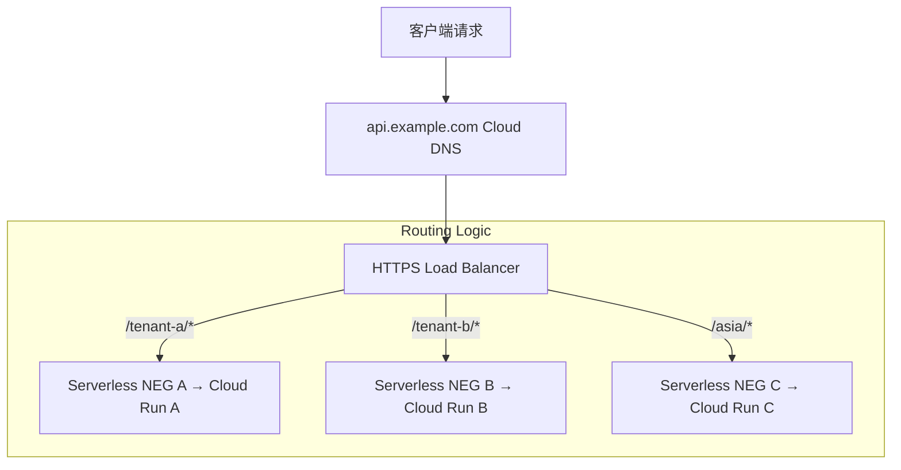
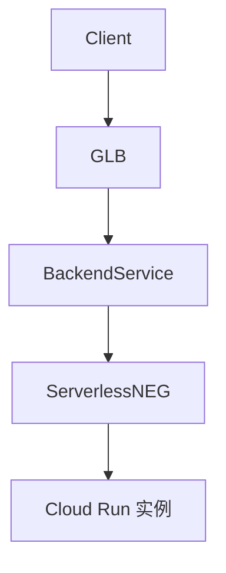
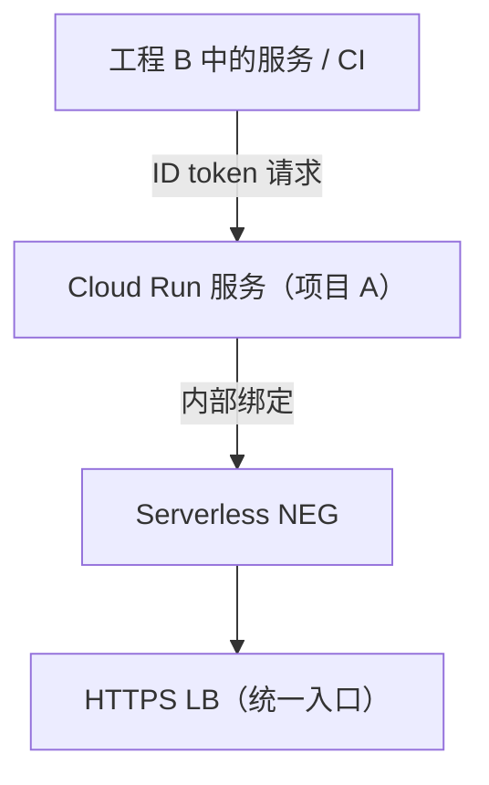
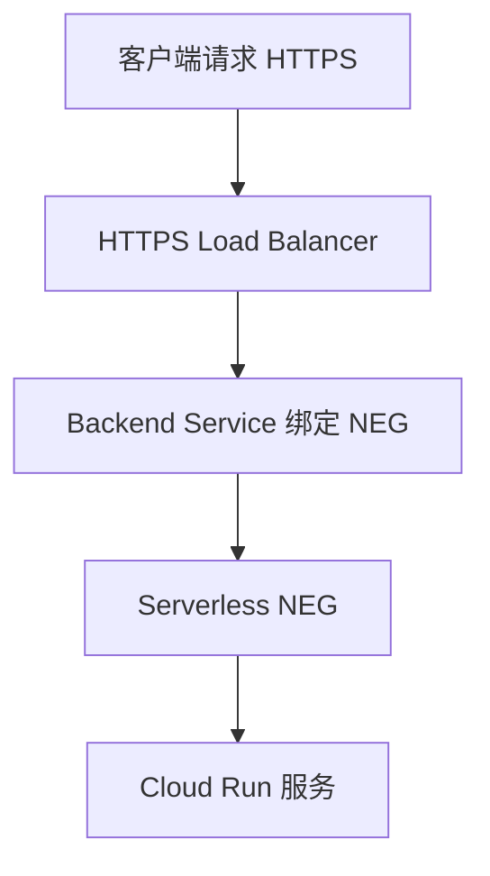

# summary

- 如何跨 GCP 工程访问 Cloud Run 服务”，这是一个**非常典型的问题**，尤其是在多项目（multi-project）架构中。以下是最佳实践、选型对比、以及推荐的 Google 原生方案。
- 平台需求后，我们可以设计一个**统一入口 + 多 Cloud Run 服务后端 + 按 Path/Location 路由**的 GCP 原生架构。该架构不仅满足多用户隔离，还具备可扩展性、安全性和便于运营维护的特性。

# 场景建模

---

## **✅ 目标场景建模**

| **用户** | **请求入口**                     | **路由策略**               | **后端服务（Cloud Run）** |
| -------- | -------------------------------- | -------------------------- | ------------------------- |
| 用户 A   | https://api.example.com/tenant-a | Path 前缀匹配 /tenant-a/\* | Cloud Run A（独立服务）   |
| 用户 B   | https://api.example.com/tenant-b | Path 前缀匹配 /tenant-b/\* | Cloud Run B（独立服务）   |
| 用户 C   | https://api.example.com/asia     | 地区匹配 asia + 路由       | Cloud Run C（亚洲区服务） |

---

## **🧱 架构设计（统一入口、多后端）**



---

## **✅ 架构核心组件**

| **组件**                  | **作用**                                         |
| ------------------------- | ------------------------------------------------ |
| **HTTPS Load Balancer**   | 单一公网入口，支持路径、Header、地理等多维路由   |
| **URL Map**               | 定义 /tenant-a/\* 等路径路由到对应的 Backend     |
| **Serverless NEG**        | 每个 Cloud Run 服务都对应一个专属 Serverless NEG |
| **Backend Service**       | 每个 Cloud Run 服务都配置一个 Backend            |
| **Cloud DNS + 证书**      | 自定义域名绑定，统一 HTTPS 证书                  |
| **Cloud Armor**           | 可选：接入 WAF、安全策略、用户白名单             |
| **Cloud Logging + Quota** | 可选：按租户记录流量、配额分析                   |

---

## **🧩 多后端配置策略（按需拆分）**

| **拆分方式**        | **是否支持** | **示例说明**                             |
| ------------------- | ------------ | ---------------------------------------- |
| **按 Path 拆分**    | ✅           | /tenant-a/\* → Cloud Run A               |
| **按 Region 拆分**  | ✅           | Asia 用户请求自动转发到亚洲服务区        |
| **按 Header 拆分**  | ✅           | Header 中含 X-Tenant-ID: abc → B         |
| **按 Cookie/Query** | ❌（不推荐） | 不支持复杂动态规则（可通过中转代理实现） |

---

## **☁️ 资源规划建议**

| **模块**           | **说明**                                   |
| ------------------ | ------------------------------------------ |
| 统一域名入口       | api.example.com 对应 HTTPS LB + SSL        |
| Cloud Run 服务命名 | 建议命名为 tenant-<name> 或 region-<id>    |
| IAM 控制           | 每个 Cloud Run 服务配置独立的 Invoker 权限 |
| CI/CD 集成         | 不同租户/模块可以有独立的部署流水线        |
| 日志与监控         | 利用 Cloud Logging 打 tag 区分租户请求     |

---

## **⚙ 示例配置片段：路径路由（URL Map）**

```bash
gcloud compute url-maps add-path-matcher platform-url-map \
  --default-service=backend-default \
  --path-matcher-name=tenant-router \
  --backend-service-path-rules=/tenant-a/*=backend-a,/tenant-b/*=backend-b,/asia/*=backend-asia
```

---

## **🔐 安全建议**

| **目标**     | **实施方案**                                    |
| ------------ | ----------------------------------------------- |
| 统一访问控制 | Cloud Armor / JWT 验证器 / Identity-Aware Proxy |
| 用户隔离     | 每个 Cloud Run 服务 IAM 仅授权对应租户访问      |
| 限流保护     | GCLB 层可配合 Cloud Armor 配额策略              |

---

## **📈 扩展性展望**

- ✅ 未来如需迁移某租户服务至 GKE，可直接切换 Serverless NEG → GKE NEG
- ✅ 接入 Cloud CDN 缓存部分响应
- ✅ 自动扩展 Cloud Run 实例数（scale to 0 → scale up）

---

是否需要我：

- 帮你生成一个**平台多租户入口的 gcloud 命令模板合集**？
- 或者输出支持路径/租户路由的**Terraform 模块结构**？

## **✅ 背景假设**

- 你部署了一个 Cloud Run 服务在工程 A 中（如：grpc-chat-a.run.app）
- 工程 B 或者其他项目想要访问这个服务
- 你希望不暴露给全网，**仅在 GCP 内部或受控范围内使用**

---

## **✅ 最佳实践（3 个推荐方案）**

| **方案编号** | **方案描述**                                    | **是否 Google 原生** | **跨项目访问** | **备注**                                             |
| ------------ | ----------------------------------------------- | -------------------- | -------------- | ---------------------------------------------------- |
| ✅①          | **使用 Cloud Run with IAM + IAM 条件访问**      | ✅                   | ✅             | 精准控制跨项目服务账号或组的访问权限                 |
| ✅②          | **使用 VPC Access + Serverless NEG + HTTPS LB** | ✅                   | ✅             | GCP 推荐的生产级方案，允许通过统一入口访问 Cloud Run |
| ③            | 使用 Cloud Run 默认公网地址 + token             | ✅                   | ✅（较弱）     | 简单场景适用，但不够安全可靠                         |

---

## **✅ 方案 ①：Cloud Run IAM 授权 + 跨项目服务账号访问（\*\***强烈推荐\*\*

## **）**

### **🌐 核心思路：**

1. Cloud Run 服务使用私有访问权限（**不允许未认证用户访问**）
2. 工程 B 中的调用方（可以是服务账号）通过 **Cloud Run IAM 权限控制**
3. 客户端使用 **ID Token** 调用服务

---

### **👣 步骤详解：**

#### **✅ 1. Cloud Run 设置为私有访问（在工程 A）**

```
gcloud run services update grpc-chat \
  --no-allow-unauthenticated \
  --region asia-east1
```

#### **✅ 2. 将工程 B 的服务账号添加到 Cloud Run IAM 中（工程 A）**

```
gcloud run services add-iam-policy-binding grpc-chat \
  --region asia-east1 \
  --member="serviceAccount:service-account-b@project-b.iam.gserviceaccount.com" \
  --role="roles/run.invoker"
```

#### **✅ 3. 工程 B 的服务账号调用 Cloud Run**

使用 curl + ID token：

```bash
ID_TOKEN=$(gcloud auth print-identity-token)
curl -H "Authorization: Bearer ${ID_TOKEN}" \
     https://grpc-chat-abc123-uc.a.run.app
```

> 🧠 更推荐用客户端语言（如 Python）调用支持 gRPC + ID token 的库，如 [google.auth](https://googleapis.dev/python/google-auth/latest/index.html)。

---

## **✅ 方案 ②：Cloud Run → Serverless NEG → HTTPS LB（统一域名入口）**

### **🌐 核心思路**

1. 创建 Cloud Run 服务（私有或公开）
2. 创建一个 **Serverless NEG**（Network Endpoint Group）绑定该 Cloud Run 服务
3. 创建一个 **HTTPS Load Balancer**，将流量导向这个 NEG
4. 统一用自定义域名（例如 grpc-api.mycorp.com）进行访问

---

### **🔧 步骤概述**

```bash
# 创建 Serverless NEG
gcloud compute network-endpoint-groups create grpc-cloudrun-neg \
  --region=asia-east1 \
  --network-endpoint-type=serverless \
  --cloud-run-service=grpc-chat

# 创建 Backend Service
gcloud compute backend-services create grpc-cloudrun-backend \
  --global \
  --protocol=HTTP2
gcloud compute backend-services add-backend grpc-cloudrun-backend \
  --global \
  --network-endpoint-group=grpc-cloudrun-neg \
  --network-endpoint-group-region=asia-east1

# 后续可绑定 HTTPS LB + 自定义证书 + Cloud Armor + Logging
```

> ✅ 支持从任何工程访问（即使 Cloud Run 是私有的），因为 LB 是公共资源
> Serverless NEG 用于 Cloud Run 场景**

在 Cloud Run 中，你会看到如下结构：



你可以在配置 Load Balancer 的 backend 时直接引用 Cloud Run 服务名，此时后台会自动创建 serverless NEG。

---

## **✅ 方案 ③：公网地址 + ID Token（适合快速测试）**

- 保持 Cloud Run 为公共地址
- 对调用方配置 Authorization: Bearer <id_token> 验证身份

但此方式仍是走公网，不适合 **内部 API** 或 **跨项目安全传输**

---

## **✅ 补充：私网部署 Cloud Run（VPC）**

| **要素**               | **是否支持**             |
| ---------------------- | ------------------------ |
| Cloud Run 绑定私有 VPC | ✅（通过 VPC connector） |
| 内部访问地址           | ❌（仍然通过 HTTPS）     |
| 支持 Cloud DNS 映射    | ✅（结合 Cloud LB）      |

---

## **🎯 推荐策略**

| **场景**           | **推荐方式**                  |
| ------------------ | ----------------------------- |
| 跨项目内部访问     | ✅ 方案 ①（IAM 控制 + token） |
| 多服务统一访问入口 | ✅ 方案 ②（Serverless NEG）   |
| 简单测试或 PoC     | 方案 ③                        |

---

## **☑ 示例组合建议**



---

需要我：

- 帮你输出方案 ①/② 的自动化脚本？
- 或者生成一个 Cloud Run + HTTPS LB + NEG 的 Terraform 模板？

以下是你请求的两个完整方案：

---

# **✅ 方案 ①：**

# **Cloud Run 私有 + IAM 授权跨项目访问脚本**

### **🎯 适合场景：**

- Cloud Run 服务部署在工程 A
- 工程 B 的服务/CI/CD 需要通过身份认证访问
- 避免对公网开放，保证安全

### **🧾 脚本（适用于工程 A）**

```bash
#!/bin/bash

# ---------- 基础变量 ----------
PROJECT_A="project-a-id"                      # Cloud Run 服务所在项目
PROJECT_B="project-b-id"                      # 调用方服务账号所在项目
SERVICE_ACCOUNT_B="svc-b@${PROJECT_B}.iam.gserviceaccount.com"
CLOUD_RUN_SERVICE="grpc-chat"
REGION="asia-east1"

# ---------- 切换到工程 A ----------
gcloud config set project "${PROJECT_A}"

# 关闭未认证访问
gcloud run services update "${CLOUD_RUN_SERVICE}" \
  --region "${REGION}" \
  --no-allow-unauthenticated

# 添加 IAM 权限，允许工程 B 服务账号调用
gcloud run services add-iam-policy-binding "${CLOUD_RUN_SERVICE}" \
  --region "${REGION}" \
  --member "serviceAccount:${SERVICE_ACCOUNT_B}" \
  --role roles/run.invoker
```

> 🔐 工程 B 可使用 gcloud auth print-identity-token 或 Workload Identity Federation 生成 token 请求 Cloud Run。

---

# **✅ 方案 ②：**

# **Cloud Run + HTTPS Load Balancer + Serverless NEG**

### **🎯 适合场景：**

- 统一入口访问多个 Cloud Run 服务
- 支持自定义域名、TLS 证书、Cloud Armor、防火墙控制
- 允许跨项目访问，也适合生产环境

---

## **🧾 脚本步骤（工程 A 中操作）**

### **1️⃣ 设置变量**

```
PROJECT_ID="project-a-id"
REGION="asia-east1"
SERVICE_NAME="grpc-chat"
LB_NAME="grpc-lb"
NEG_NAME="grpc-neg"
BACKEND_NAME="grpc-backend"
```

---

### **2️⃣ 创建 Serverless NEG**

```
gcloud compute network-endpoint-groups create "${NEG_NAME}" \
  --region="${REGION}" \
  --network-endpoint-type=serverless \
  --cloud-run-service="${SERVICE_NAME}"
```

---

### **3️⃣ 创建 Backend Service 并添加 NEG**

```
gcloud compute backend-services create "${BACKEND_NAME}" \
  --global \
  --protocol=HTTP2

gcloud compute backend-services add-backend "${BACKEND_NAME}" \
  --global \
  --network-endpoint-group="${NEG_NAME}" \
  --network-endpoint-group-region="${REGION}"
```

---

### **4️⃣ 创建 URL Map**

```
gcloud compute url-maps create "${LB_NAME}-map" \
  --default-service="${BACKEND_NAME}"
```

---

### **5️⃣ 创建 Target HTTPS Proxy**

```
gcloud compute target-https-proxies create "${LB_NAME}-proxy" \
  --url-map="${LB_NAME}-map" \
  --ssl-certificates=[YOUR_CERT]  # 或使用 --certificate-manager-certificates
```

---

### **6️⃣ 分配 Global IP & Forwarding Rule**

```
# 分配 IP
gcloud compute addresses create "${LB_NAME}-ip" \
  --global

# 创建转发规则
gcloud compute forwarding-rules create "${LB_NAME}-fr" \
  --address="${LB_NAME}-ip" \
  --global \
  --target-https-proxy="${LB_NAME}-proxy" \
  --ports=443
```

---

### **🔚 最终效果**

```
flowchart TD
    client[外部请求 (https://api.example.com)] --> lb[HTTPS Load Balancer]
    lb --> neg[Serverless NEG]
    neg --> cloudrun[Cloud Run 服务 grpc-chat]
```

---

## **🎯 总结对比**

| **项目**                     | **方案 ①：IAM 认证**        | **方案 ②：LB + Serverless NEG** |
| ---------------------------- | --------------------------- | ------------------------------- |
| 跨项目访问                   | ✅ 支持                     | ✅ 支持                         |
| 自定义域名                   | ❌ 需结合 Cloud DNS         | ✅ 可配置 SSL + 域名            |
| Cloud Armor / 认证策略 / JWT | ❌ 需要客户端逻辑配合       | ✅ 可统一加在 LB 层             |
| 安全性                       | 高（最小权限 + token 控制） | 高（LB + NEG + IAM）            |
| 复杂度                       | 中                          | 较高（适合生产）                |

---

是否需要我补充 Terraform 模板或支持多个 Cloud Run 服务的 NEG 集成示例？

你理解得**基本正确**，但我们来更精准地梳理一下：

---

## **✅ Cloud Run 服务的 NEG（Network Endpoint Group）是怎么工作的？**

### **🌐 简单定义：**

> **Serverless NEG**（Network Endpoint Group for Cloud Run / App Engine / Cloud Function）是 Google Cloud 提供的一种特殊类型的网络端点集合，它让你可以通过 **HTTPS Load Balancer** 将流量路由到 **Cloud Run 服务**。

---

## **🧠 本质结构理解（简化版）：**



---

## **✅ 回答你的两个问题：**

### **🔸 问题 1：Cloud Run 服务的 NEG 是不是绑定到了 Google 的 HTTPS Load Balancer？**

- ✅ **是的，Serverless NEG** 是一种特殊的 **后端目标类型（backend target）**，它专门用于绑定 **Cloud Run / App Engine / Cloud Functions**。
- 它通过 HTTPS LB 将请求流量导向 Cloud Run 服务，不再需要 GKE Ingress 或 Nginx 代理。

---

### **🔸 问题 2：Backend Service 是不是就是 Cloud Run 服务？**

- ❌ **不完全是**。
    Backend Service 是 **HTTP(S) Load Balancer 的配置资源**，它**通过引用一个 Serverless NEG** 来将流量导向 Cloud Run。

所以结构是：

```
HTTPS LB → Backend Service → Serverless NEG → Cloud Run 服务
```

---

## **🧩 Serverless NEG 绑定 Cloud Run 的典型命令：**

```
# 创建 serverless NEG，绑定 Cloud Run 服务
gcloud compute network-endpoint-groups create grpc-neg \
  --region=asia-east1 \
  --network-endpoint-type=serverless \
  --cloud-run-service=grpc-chat
```

> 注意：这个 NEG 只是一个逻辑映射，不是真正的 IP 地址池。

---

## **✅ 为什么不用直接设置 Cloud Run 域名当后端？**

因为：

1. Cloud Run 默认是动态的、随机的 HTTPS 域名（无法绑定 LB）
2. GCP 原生只支持通过 NEG 映射实现统一接入
3. NEG 支持自动负载均衡、自动探测（探活）、Cloud Armor、证书绑定等功能

---

## **🎯 最佳实践总结**

| **项目**                        | **是否推荐**                |
| ------------------------------- | --------------------------- |
| 将 Cloud Run 绑定 HTTPS LB      | ✅ 强烈推荐                 |
| 使用 Serverless NEG             | ✅ 必须                     |
| 直接用域名绕过 NEG              | ❌ 不支持                   |
| 多个 Cloud Run 服务通过 LB 接入 | ✅ 支持基于路径或子域名路由 |

---

如果你希望：

- 管理多个 Cloud Run 服务（如 /api1/_、/api2/_）统一接入
- 设置统一的 TLS 证书和 Cloud Armor 策略

那 Serverless NEG 是你必须走的路径。

是否需要我生成一个绑定多个 Cloud Run 服务的路径匹配 LB 配置示例？
