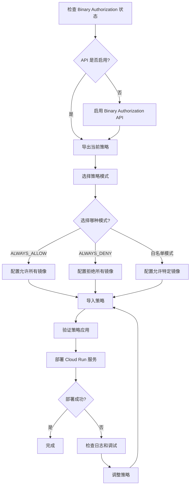

#claude 
根据你的描述，你遇到了 GCP Binary Authorization 的违规问题。让我为你提供完整的解决方案和步骤。

## Binary Authorization 概述

Binary Authorization 是 GCP 的容器镜像验证服务，确保只有经过验证的镜像才能部署到你的环境中。

## 问题分析

当你使用 `binary-authorization=default` 参数时，GCP 会检查你的项目是否有适当的 Binary Authorization 策略配置。默认情况下可能没有配置，导致违规。

## 解决步骤

### 1. 检查当前 Binary Authorization 状态

```bash
# 检查当前策略
gcloud container binauthz policy export

# 检查是否启用了 Binary Authorization API
gcloud services list --enabled | grep binaryauthorization
```

### 2. 启用 Binary Authorization API

```bash
gcloud services enable binaryauthorization.googleapis.com
gcloud services enable containeranalysis.googleapis.com
```

### 3. 导出和修改策略

```bash
# 导出当前策略
gcloud container binauthz policy export > policy.yaml

# 备份原始策略
cp policy.yaml policy.yaml.backup
```

### 4. 策略配置选项

你有三个主要的评估模式选择：

#### 选项 A: ALWAYS_ALLOW（最宽松）

```yaml
admissionWhitelistPatterns: []
clusterAdmissionRules: {}
defaultAdmissionRule:
  enforcementMode: ENFORCED_BLOCK_AND_AUDIT_LOG
  evaluationMode: ALWAYS_ALLOW
  requireAttestationsBy: []
description: ""
etag: [current-etag]
name: projects/[PROJECT-ID]/policy
updateTime: [timestamp]
```

#### 选项 B: ALWAYS_DENY（最严格）

```yaml
admissionWhitelistPatterns: []
clusterAdmissionRules: {}
defaultAdmissionRule:
  enforcementMode: ENFORCED_BLOCK_AND_AUDIT_LOG
  evaluationMode: ALWAYS_DENY
  requireAttestationsBy: []
description: ""
etag: [current-etag]
name: projects/[PROJECT-ID]/policy
updateTime: [timestamp]
```

#### 选项 C: 允许特定镜像仓库

```yaml
admissionWhitelistPatterns:
- namePattern: "gcr.io/[PROJECT-ID]/*"
- namePattern: "us.gcr.io/[PROJECT-ID]/*"
- namePattern: "asia.gcr.io/[PROJECT-ID]/*"
- namePattern: "eu.gcr.io/[PROJECT-ID]/*"
clusterAdmissionRules: {}
defaultAdmissionRule:
  enforcementMode: ENFORCED_BLOCK_AND_AUDIT_LOG
  evaluationMode: ALWAYS_DENY
  requireAttestationsBy: []
description: "Allow only project images"
etag: [current-etag]
name: projects/[PROJECT-ID]/policy
updateTime: [timestamp]
```

### 5. 应用策略

```bash
# 导入修改后的策略
gcloud container binauthz policy import policy.yaml

# 验证策略已应用
gcloud container binauthz policy export
```

## 针对 Cloud Run 的配置

### Cloud Run 特定设置

```bash
# 为 Cloud Run 服务配置 Binary Authorization
gcloud run deploy [SERVICE-NAME] \
  --image=[IMAGE-URL] \
  --platform=managed \
  --region=[REGION] \
  --binary-authorization=default
```

### 检查 Cloud Run 服务状态

```bash
# 检查服务配置
gcloud run services describe [SERVICE-NAME] --region=[REGION]

# 查看部署日志
gcloud logging read "resource.type=cloud_run_revision AND resource.labels.service_name=[SERVICE-NAME]" --limit=50
```

## 流程图



## 推荐配置

对于生产环境，我推荐使用白名单模式：

```yaml
admissionWhitelistPatterns:
- namePattern: "gcr.io/[YOUR-PROJECT-ID]/*"
- namePattern: "asia.gcr.io/[YOUR-PROJECT-ID]/*"
- namePattern: "docker.io/library/*"  # 如果需要公共镜像
clusterAdmissionRules: {}
defaultAdmissionRule:
  enforcementMode: ENFORCED_BLOCK_AND_AUDIT_LOG
  evaluationMode: REQUIRE_ATTESTATION
  requireAttestationsBy: []
description: "Production security policy"
```

## 故障排除

### 常见错误和解决方案

|错误类型             |原因                          |解决方案                                                          |
|-----------------|----------------------------|--------------------------------------------------------------|
|API not enabled  |Binary Authorization API 未启用|执行 `gcloud services enable binaryauthorization.googleapis.com`|
|Policy not found |没有策略配置                      |创建并导入策略文件                                                     |
|Image blocked    |镜像不在白名单中                    |添加镜像模式到 `admissionWhitelistPatterns`                          |
|Permission denied|IAM 权限不足                    |确保有 `roles/binaryauthorization.policyEditor` 角色               |

### 调试命令

```bash
# 查看详细日志
gcloud logging read "protoPayload.serviceName=binaryauthorization.googleapis.com" --limit=20

# 检查 IAM 权限
gcloud projects get-iam-policy [PROJECT-ID]

# 测试镜像是否被允许
gcloud container binauthz attestations list --artifact-url=[IMAGE-URL]
```

这样配置后，你的 Cloud Run 服务应该能够正常部署，同时满足 Binary Authorization 的安全要求。​​​​​​​​​​​​​​​​

# grok
Fixing Binary Authorization Violation in GCP Cloud Run
Overview
Your Cloud Run deployment is encountering a violation because Binary Authorization is enabled with --binary-authorization=default, but the project’s policy is likely set to ALWAYS_ALLOW by default, or lacks required attestations for enforcement. To fix this, update the policy to ALWAYS_DENY (disallow all unless exempted) or REQUIRE_ATTESTATION (require signed attestations for allowed images). For allowing specific images, use REQUIRE_ATTESTATION and configure attestors. This ensures only trusted container images deploy, similar to how GKE enforces signed images during CI/CD pipelines.
Prerequisites
	•	Enable Binary Authorization, Cloud Run, and Artifact Registry APIs.
	•	Install and initialize Google Cloud CLI (gcloud init).
	•	Ensure billing is enabled for the project.
Step-by-Step Fix
1. Export and Update Binary Authorization Policy
Export the current policy, edit the evaluationMode, and import it back. This changes from default ALWAYS_ALLOW to a stricter mode.
gcloud container binauthz policy export > policy.yaml
Edit policy.yaml (example structure below). Change evaluationMode under defaultAdmissionRule to REQUIRE_ATTESTATION or ALWAYS_DENY. For REQUIRE_ATTESTATION, add requireAttestationsBy with attestor references (e.g., projects/your-project/attestors/your-attestor).
Example edited policy.yaml for REQUIRE_ATTESTATION:
name: projects/your-project-id/policy
defaultAdmissionRule:
  evaluationMode: REQUIRE_ATTESTATION
  enforcementMode: ENFORCED_BLOCK_AND_AUDIT_LOG
  requireAttestationsBy:
    - projects/your-project-id/attestors/your-attestor
globalPolicyEvaluationMode: ENABLE
gcloud container binauthz policy import policy.yaml
This fixes violations by enforcing verification. For ALWAYS_DENY, add exemptions under admissionWhitelistPatterns for specific images, e.g., imagePath: "gcr.io/your-project/*".
2. Create and Configure Attestors (for REQUIRE_ATTESTATION)
If using REQUIRE_ATTESTATION, create an attestor to verify images. This involves creating a note in Artifact Analysis and attaching it to the attestor.
Set environment variables:
export PROJECT_ID=your-project-id
export NOTE_ID=your-note-id  # e.g., secure-build-note
export DESCRIPTION="Secure Build Attestor Note"
export NOTE_URI="projects/${PROJECT_ID}/notes/${NOTE_ID}"
Create note payload JSON (/tmp/note_payload.json):
{
  "name": "${NOTE_URI}",
  "attestation": {
    "hint": {
      "human_readable_name": "${DESCRIPTION}"
    }
  }
}
Create the note:
curl -X POST \
  -H "Content-Type: application/json" \
  -H "Authorization: Bearer $(gcloud auth print-access-token)" \
  -H "x-goog-user-project: ${PROJECT_ID}" \
  --data-binary @/tmp/note_payload.json \
  "https://containeranalysis.googleapis.com/v1/projects/${PROJECT_ID}/notes/?noteId=${NOTE_ID}"
Set IAM on the note (add viewer role): Create /tmp/iam_request.json:
{
  "resource": "${NOTE_URI}",
  "policy": {
    "bindings": [
      {
        "role": "roles/containeranalysis.notes.occurrences.viewer",
        "members": [
          "serviceAccount:service-$(gcloud projects describe ${PROJECT_ID} --format='value(projectNumber)')@gcp-sa-binaryauthorization.iam.gserviceaccount.com"
        ]
      }
    ]
  }
}
Apply IAM:
curl -X POST \
  -H "Content-Type: application/json" \
  -H "Authorization: Bearer $(gcloud auth print-access-token)" \
  -H "x-goog-user-project: ${PROJECT_ID}" \
  --data-binary @/tmp/iam_request.json \
  "https://containeranalysis.googleapis.com/v1/projects/${PROJECT_ID}/notes/${NOTE_ID}:setIamPolicy"
Create the attestor (using PKIX or KMS key; example with local key setup assumed):
gcloud container binauthz attestors create your-attestor \
  --project=${PROJECT_ID} \
  --attestation-authority-note=${NOTE_ID} \
  --attestation-authority-note-project=${PROJECT_ID}
Add public key (generate key pair first if needed, e.g., with openssl):
gcloud container binauthz attestors public-keys add \
  --attestor=your-attestor \
  --public-key-file=your-public-key.pem \
  --pkix-public-key-algorithm=sha256-with-rsa-encryption
Update the policy to reference this attestor (as in Step 1). This allows images signed by the attestor, fixing violations for unauthorized images.
3. Enable/Update Binary Authorization on Cloud Run Service
For existing services:
gcloud run services update your-service-name \
  --binary-authorization=default \
  --region=your-region
For new services:
gcloud run deploy your-service-name \
  --image=your-image-url \
  --binary-authorization=default \
  --region=your-region
If violation persists, check audit logs for details (gcloud logging read "resource.type=cloud_run_revision AND protoPayload.methodName=google.cloud.binaryauthorization.v1.Validation").
Setup Flowchart
graph TD
    A[Enable APIs & CLI Setup] --> B[Export Policy YAML]
    B --> C{Choose Mode?}
    C -->|ALWAYS_DENY| D[Edit to ALWAYS_DENY & Add Exemptions]
    C -->|REQUIRE_ATTESTATION| E[Create Note & Attestor]
    E --> F[Set IAM on Note]
    F --> G[Add Public Key to Attestor]
    G --> H[Edit Policy: Set REQUIRE_ATTESTATION & requireAttestationsBy]
    D --> I[Import Updated Policy]
    H --> I
    I --> J[Update Cloud Run Service with --binary-authorization=default]
    J --> K[Test Deployment & Check Logs for Violations]
Additional Analysis
	•	Similar Example: In GKE, Binary Authorization integrates with admission controllers to block unsigned pods, akin to Cloud Run’s deploy-time checks. For network aspects, ensure HTTPS for API calls (TCP port 443) when using curl in attestor setup.
	•	Depth from Docs: Policies are project-level; for multi-cluster, use clusterAdmissionRules. Violations often stem from missing attestations—use Cloud Build to automate signing during CI/CD. 18 19 16 17 


# ChatGPT 

好的，你遇到的情况是 GCP Binary Authorization (BinAuthz) 在 Cloud Run 部署时没有默认的 policy，导致 Violation。
默认情况下，GCP 项目里 Binary Authorization policy 是 ALWAYS_ALLOW（不做校验），如果启用了 binary-authorization=default，Cloud Run 就会强制检查 policy，但如果没配置，就会出错。

下面我帮你梳理一个从 无 policy → 启用 Binary Authorization 并限制镜像来源 的完整步骤。

⸻

一、Binary Authorization 基本概念

Binary Authorization (BinAuthz) 是 GCP 的镜像签名和策略校验机制，用来 确保只能运行受信任的镜像。

核心要素有三个：
	1.	Policy：全局策略，控制镜像是否允许运行（AlwaysAllow、AlwaysDeny、RequireAttestation）。
	2.	Attestors：见证者，通常绑定到 KMS key，用于签名镜像。
	3.	Attestations：镜像的签名声明（例如 CI/CD 流水线签署镜像）。

⸻

二、操作步骤

1. 导出并修改默认 Policy

默认 Policy 是 ALWAYS_ALLOW，需要改成 REQUIRE_ATTESTATION 或者针对特定镜像设置允许策略。

# 导出当前策略
gcloud container binauthz policy export > policy.yaml

你会看到类似内容：

globalPolicyEvaluationMode: ENABLE
defaultAdmissionRule:
  evaluationMode: ALWAYS_ALLOW
  enforcementMode: ENFORCED_BLOCK_AND_AUDIT_LOG

修改为：

globalPolicyEvaluationMode: ENABLE
defaultAdmissionRule:
  evaluationMode: REQUIRE_ATTESTATION
  enforcementMode: ENFORCED_BLOCK_AND_AUDIT_LOG

然后重新导入：

gcloud container binauthz policy import policy.yaml


⸻

2. 允许特定镜像

比如你只允许从 gcr.io/my-project/* 拉取镜像，可以在 policy.yaml 中添加规则：

admissionWhitelistPatterns:
- namePattern: "gcr.io/my-project/*"
- namePattern: "us-docker.pkg.dev/my-project/my-repo/*"

导入后执行：

gcloud container binauthz policy import policy.yaml

这样，Cloud Run 在部署时如果镜像不在白名单内，就会被拒绝。

⸻

3. 配置 Attestor（签名人）

如果你需要 强制签名验证，必须先创建一个 Attestor。
	1.	创建 KMS key（用于签名）：

gcloud kms keyrings create my-keyring --location=global
gcloud kms keys create my-key --location=global --keyring=my-keyring --purpose=asymmetric-signing --default-algorithm=ec-sign-p256-sha256

	2.	创建 attestor：

gcloud container binauthz attestors create my-attestor \
    --project=$PROJECT_ID \
    --attestation-authority-note=my-attestor-note \
    --note-project=$PROJECT_ID

	3.	生成签名并打 Attestation：

gcloud beta container binauthz attestations sign-and-create \
    --artifact-url=gcr.io/my-project/my-image:tag \
    --attestor=my-attestor \
    --keyversion=my-key \
    --keyversion-location=global \
    --keyversion-keyring=my-keyring \
    --keyversion-key=my-key


⸻

4. 部署 Cloud Run 并启用 Binary Authorization

在部署时指定 binary-authorization：

gcloud run deploy my-service \
  --image=gcr.io/my-project/my-image:tag \
  --platform=managed \
  --region=us-central1 \
  --binary-authorization=default


⸻

三、分析和最佳实践
	•	如果你只是想白名单镜像来源，不一定要配置 attestor，只需要在 policy.yaml 中写 admissionWhitelistPatterns。
	•	如果你要签名验证（高安全要求），则必须配合 Attestor + CI/CD 签名流程。
	•	Cloud Run 和 GKE 都能使用 Binary Authorization，逻辑是一样的。
	•	生产场景建议：
	•	开发环境：admissionWhitelistPatterns + ENFORCED_BLOCK_AND_AUDIT_LOG
	•	生产环境：REQUIRE_ATTESTATION + CI/CD 签名

⸻

Mermaid 流程

graph TD;
    A[Cloud Run 部署镜像] --> B[Binary Authorization Policy检查]
    B -->|镜像在白名单| C[允许部署]
    B -->|需要签名验证| D[检查Attestation]
    D -->|有有效签名| C[允许部署]
    D -->|无签名/不匹配| E[拒绝部署]


⸻

要不要我帮你直接写一个 最简 policy.yaml 模板（允许 GCR/Artifact Registry 某项目的镜像，不强制签名）给你直接应用？