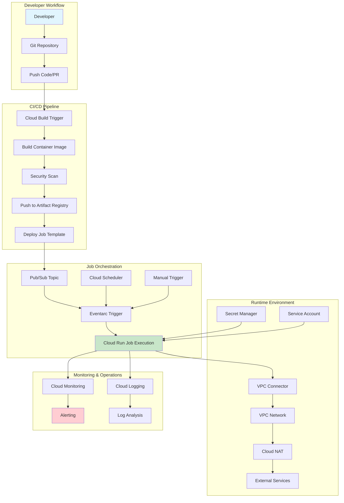
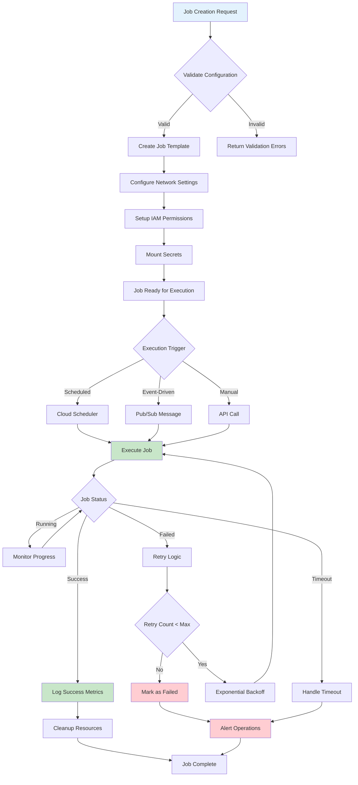
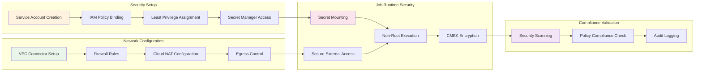
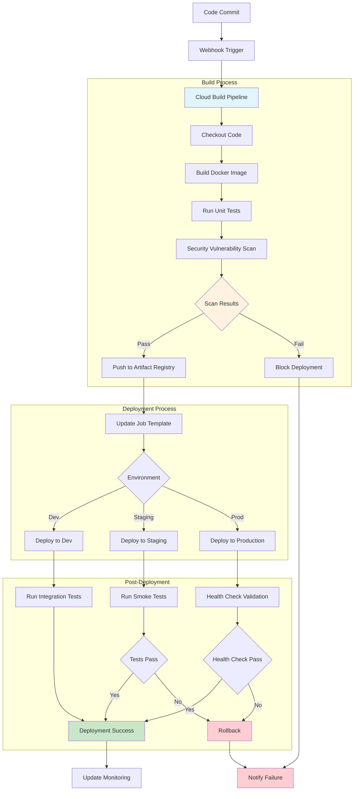
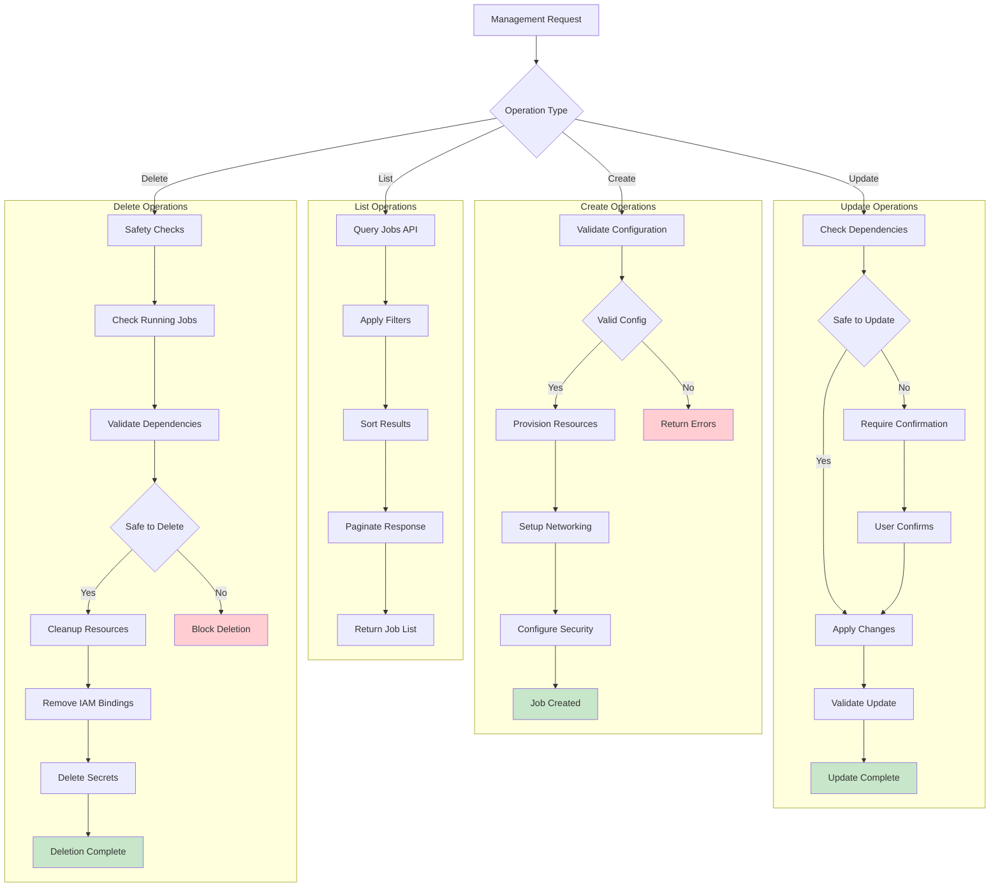
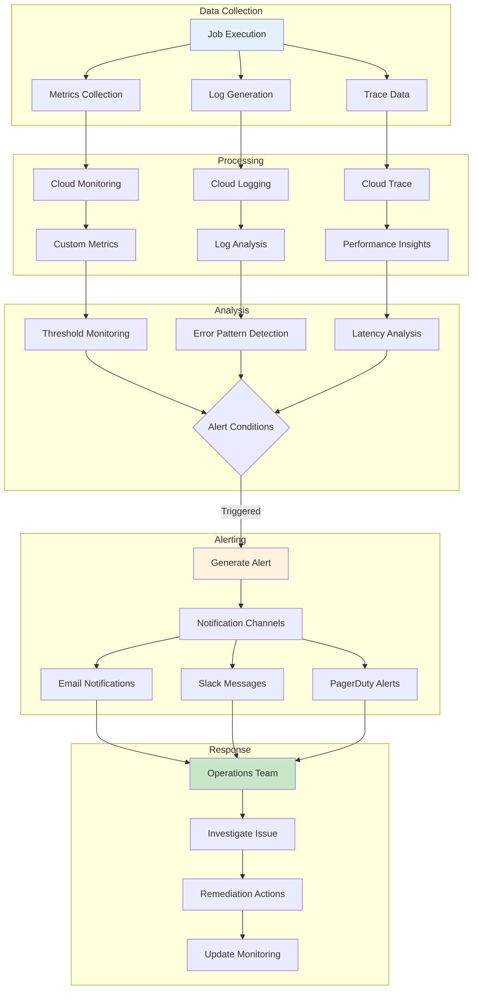
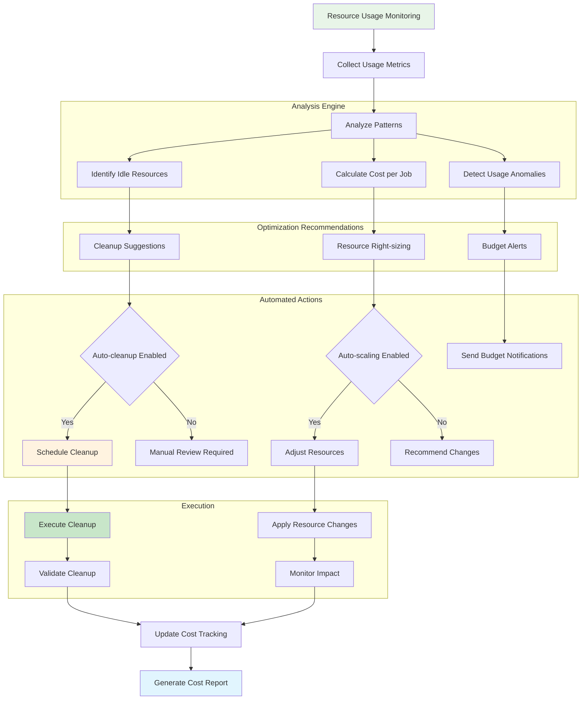
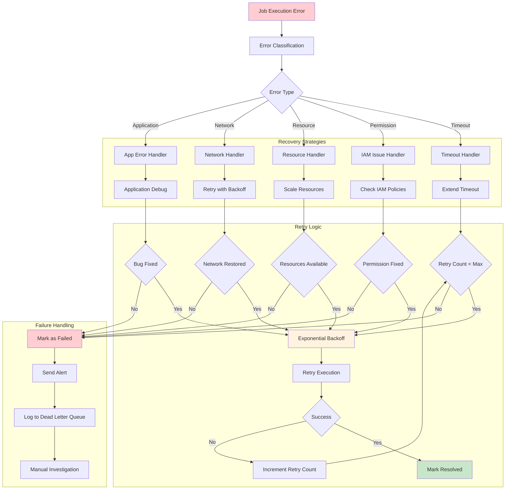
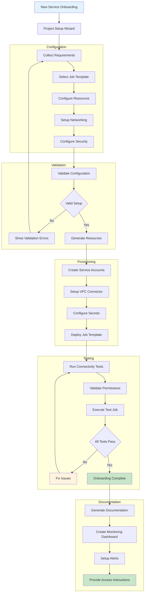
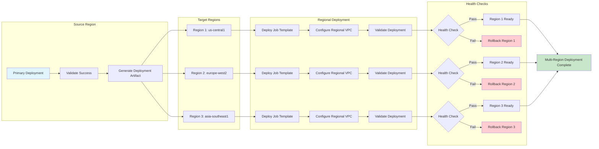

# summary

created a comprehensive visual flow documentation that captures all the key processes and concepts from your Cloud Run automation platform design. The document includes 10 detailed Mermaid flow diagrams covering:

- High-Level Architecture Flow - Overall system components and data flow
- Job Lifecycle Management - Complete job execution lifecycle with error handling
- Security and Network Configuration - Security setup and network configuration processes
- Deployment Pipeline Flow - CI/CD pipeline with build, test, and deployment stages
- Job Management Operations - CRUD operations for job management
- Monitoring and Alerting Flow - Observability and incident response workflows
- Cost Optimization Flow - Resource usage analysis and cost management
- Error Handling and Recovery Flow - Comprehensive error classification and recovery strategies
- Onboarding Process Flow - New service onboarding with validation and testing
- Multi-Region Deployment Flow - Cross-region deployment and validation processes
- Each diagram uses color coding to highlight different states (success in green, errors in red, processes in blue, etc.) and shows the decision points, parallel processes, and feedback loops that are critical to understanding how the system operates.

The visual flows make it much easier to understand the complex interactions between different components and help with both implementation planning and operational understanding of the platform.

# Cloud Run Automation Platform - Visual Flow Documentation

## 1. High-Level Architecture Flow

## 2. Job Lifecycle Management Flow

## 3. Security and Network Configuration Flow

## 4. Deployment Pipeline Flow

## 5. Job Management Operations Flow

## 6. Monitoring and Alerting Flow

## 7. Cost Optimization Flow

## 8. Error Handling and Recovery Flow

## 9. Onboarding Process Flow

## 10. Multi-Region Deployment Flow

This visual documentation provides comprehensive flow diagrams for all major processes in the Cloud Run automation platform, making it easier to understand the system architecture, workflows, and operational procedures.