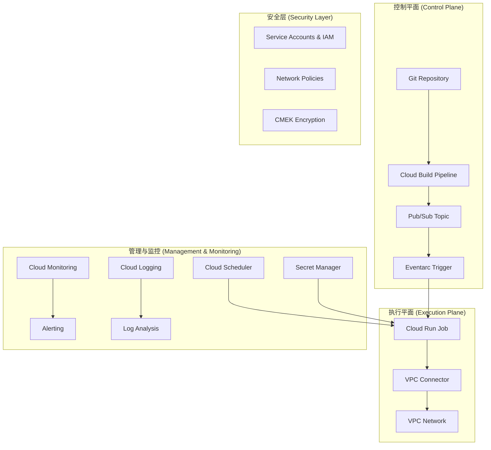

# Cloud Run 自动化平台建设摘要

## 1. 项目目标与愿景

旨在构建一个全面、标准化且自动化的 Cloud Run 管理平台。该平台将统一多个项目和区域的 Cloud Run 作业的部署、管理、监控和安全合规流程。核心目标是提升开发效率、保障生产环境的稳定性和安全性，并实现成本的有效控制。

## 2. 核心架构与组件

平台采用分层架构，解耦控制、执行和管理平面，确保系统的灵活性和可扩展性。

**核心组件包括:**

-   **标准化的作业模板**: 提供包含通用工具的基础镜像和灵活的入口脚本。
-   **自动化部署管道**: 基于 Git 和 Cloud Build，实现 CI/CD 流程自动化。
-   **作业编排引擎**: 支持事件驱动（Eventarc）、定时（Cloud Scheduler）和手动触发。
-   **统一网络架构**: 通过 VPC Connector 和 Cloud NAT 实现安全可控的网络访问。
-   **集成的安全框架**: 统一管理服务账号、IAM 策略、网络策略和密钥。

## 3. 关键任务与实施阶段

根据 `tasks.md` 的规划，整个项目可以分为以下几个关键实施阶段：

| 阶段 | 核心任务 | 关联需求 |
| :--- | :--- | :--- |
| **阶段一: 基础框架搭建** | 1. 定义项目结构、接口和数据模型。 2. 实现标准化的作业模板系统（基础镜像、入口脚本）。 | `Req 1`, `Req 4` |
| **阶段二: 自动化部署** | 1. 构建基于 Cloud Build 的 CI/CD 部署管道。 2. 集成 Git 工作流，支持多环境部署。 | `Req 2` |
| **阶段三: 作业编排与管理** | 1. 实现事件驱动和定时作业的编排。 2. 开发作业管理的 API（执行、查询、更新、删除）。 | `Req 3`, `Req 5` |
| **阶段四: 网络与安全** | 1. 自动化配置 VPC 连接器、防火墙和 NAT。 2. 实现服务账号和 Secret Manager 的集成。 | `Req 1`, `Req 6` |
| **阶段五: 监控与可观测性** | 1. 集成 Cloud Monitoring 和 Logging。 2. 建立多层次的告警策略和可视化的监控仪表板。 | `Req 3` |
| **阶段六: 优化与合规** | 1. 开发成本监控与资源自动清理机制。 2. 实施安全扫描与合规性检查。 | `Req 6`, `Req 7` |

## 4. 核心功能与需求

平台需满足以下核心用户故事和功能需求：

-   **标准化部署**:
    -   自动配置 VPC 连接和网络策略。
    -   强制执行资源限制和最小权限原则。
    -   生产环境强制使用 CMEK 加密。
-   **自动化 CI/CD**:
    -   代码提交自动触发构建和部署。
    -   支持多环境（dev, staging, prod）配置。
    -   部署失败时提供日志和回滚能力。
-   **生命周期管理**:
    -   集成 Cloud Scheduler 实现定时任务。
    -   失败任务自动重试（指数退避）。
    -   提供任务状态监控和自动清理机制。
    -   **自动化的清理 (Housekeeping)**: 定期清理已完成、失败或长期处于错误状态的作业执行记录，以回收资源并维护系统整洁。
-   **简化的 onboarding**:
    -   提供模板化的作业创建流程。
    -   自动完成网络和安全配置。
    -   集成 Secret Manager 进行凭证管理。
-   **统一的作业管理**:
    -   跨项目、跨区域的作业列表与筛选。
    -   支持批量更新和安全删除。
    -   所有操作均有详细的审计日志。

## 5. 监控与可观测性策略

根据 `cloud-run-monitor.md` 的设计，监控体系需覆盖以下层面：

-   **多层次监控**:
    -   **应用层**: 业务指标、APM 追踪。
    -   **服务层**: 请求延迟、错误率、资源使用率、冷启动。
    -   **基础设施层**: VPC 网络延迟、外部依赖性能。
-   **结构化日志**:
    -   所有日志采用统一的 JSON 格式，包含 `trace_id`, `request_id` 等关键字段。
    -   通过 BigQuery 进行日志聚合分析。
-   **智能告警**:
    -   定义 P1 到 P4 的多级告警严重性。
    -   针对关键指标（如错误率 > 5%, P95 延迟 > 2s）设置告警。
    -   采用告警降噪和抑制策略，避免告警风暴。
-   **可视化仪表板**:
    -   **服务概览仪表板**: 展示请求率、错误率、延迟分布等核心 SLI。
    -   **资源使用仪表板**: 监控 CPU、内存、实例数和冷启动情况。

## 6. 安全与合规性

安全是平台设计的核心部分，必须满足：

-   **最小权限原则**: 为每个作业分配专用的、权限受限的服务账号。
-   **网络安全**: 默认使用 VPC 出口，并通过防火墙规则严格控制流量。
-   **容器安全**: 强制执行非 root 用户运行容器，并对镜像进行漏洞扫描。
-   **凭证管理**: 所有敏感信息必须通过 Secret Manager 进行管理和注入。
-   **审计与合警**: 所有管理操作都必须有详细的审计日志，并对可疑活动进行监控。

## 7. 工作流程图参考

`cloud-run-flow.md` 文件提供了详细的 Mermaid 流程图，是理解系统各部分交互的关键。在设计和实施过程中，应频繁参考以下核心流程图：

-   **High-Level Architecture Flow**: 理解系统整体架构。
-   **Deployment Pipeline Flow**: 指导 CI/CD 流程的实现。
-   **Job Lifecycle Management Flow**: 定义作业从创建到销毁的全过程。
-   **Security and Network Configuration Flow**: 确保安全和网络配置的正确性。
-   **Monitoring and Alerting Flow**: 构建有效的监控和响应机制。

---

此摘要文档整合了您提供的所有设计和需求信息，旨在为您提供一个清晰、结构化的行动指南。
