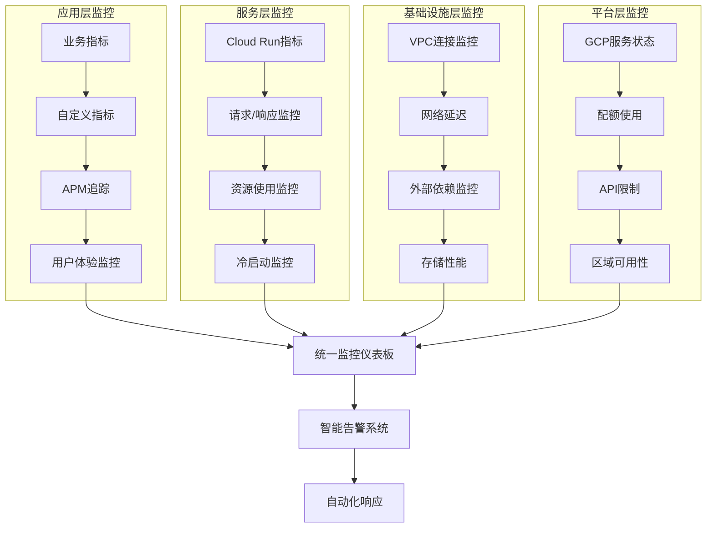

# Cloud Run 监控完整方案

## 概述

本文档提供了Google Cloud Run的全面监控策略，涵盖性能监控、日志管理、告警配置、成本优化和安全监控等方面。通过多层次的监控体系，确保Cloud Run服务的可靠性、性能和成本效益。

## 监控架构

### 监控层次结构



## 核心监控指标

### 1. 性能指标 (Performance Metrics)

#### 请求级别指标
```yaml
# 关键性能指标配置
performance_metrics:
  request_metrics:
    - name: "request_count"
      description: "每秒请求数"
      type: "rate"
      threshold:
        warning: 1000
        critical: 5000
    
    - name: "request_latency"
      description: "请求延迟分布"
      type: "distribution"
      percentiles: [50, 90, 95, 99]
      threshold:
        p95_warning: "500ms"
        p95_critical: "2s"
    
    - name: "error_rate"
      description: "错误率"
      type: "rate"
      threshold:
        warning: "1%"
        critical: "5%"
    
    - name: "success_rate"
      description: "成功率"
      type: "rate"
      threshold:
        warning: "99%"
        critical: "95%"
```

#### 资源使用指标
```yaml
resource_metrics:
  cpu_metrics:
    - name: "cpu_utilization"
      description: "CPU使用率"
      threshold:
        warning: "70%"
        critical: "90%"
    
    - name: "cpu_allocation"
      description: "CPU分配量"
      unit: "cores"
  
  memory_metrics:
    - name: "memory_utilization"
      description: "内存使用率"
      threshold:
        warning: "80%"
        critical: "95%"
    
    - name: "memory_allocation"
      description: "内存分配量"
      unit: "MB"
  
  network_metrics:
    - name: "network_egress"
      description: "出站网络流量"
      unit: "bytes/sec"
    
    - name: "network_ingress"
      description: "入站网络流量"
      unit: "bytes/sec"
```

### 2. 可用性指标 (Availability Metrics)

#### 实例和容器指标
```yaml
availability_metrics:
  instance_metrics:
    - name: "instance_count"
      description: "运行实例数量"
      type: "gauge"
    
    - name: "cold_start_count"
      description: "冷启动次数"
      type: "counter"
      threshold:
        warning: 10  # per minute
        critical: 50
    
    - name: "cold_start_latency"
      description: "冷启动延迟"
      type: "distribution"
      threshold:
        p95_warning: "5s"
        p95_critical: "15s"
  
  container_metrics:
    - name: "container_startup_time"
      description: "容器启动时间"
      type: "distribution"
    
    - name: "container_crash_count"
      description: "容器崩溃次数"
      type: "counter"
      threshold:
        warning: 1
        critical: 5
```

### 3. 业务指标 (Business Metrics)

#### 自定义业务指标
```python
# 业务指标收集示例
from google.cloud import monitoring_v3
import time

class BusinessMetricsCollector:
    def __init__(self, project_id: str):
        self.project_id = project_id
        self.client = monitoring_v3.MetricServiceClient()
        self.project_name = f"projects/{project_id}"
    
    def record_business_transaction(self, transaction_type: str, amount: float, status: str):
        """记录业务交易指标"""
        series = monitoring_v3.TimeSeries()
        series.metric.type = "custom.googleapis.com/business/transaction_amount"
        series.resource.type = "cloud_run_revision"
        
        # 添加标签
        series.metric.labels["transaction_type"] = transaction_type
        series.metric.labels["status"] = status
        
        # 添加数据点
        now = time.time()
        seconds = int(now)
        nanos = int((now - seconds) * 10 ** 9)
        interval = monitoring_v3.TimeInterval(
            {"end_time": {"seconds": seconds, "nanos": nanos}}
        )
        point = monitoring_v3.Point({
            "interval": interval,
            "value": {"double_value": amount}
        })
        series.points = [point]
        
        # 发送指标
        self.client.create_time_series(
            name=self.project_name, 
            time_series=[series]
        )
    
    def record_user_activity(self, activity_type: str, user_count: int):
        """记录用户活动指标"""
        series = monitoring_v3.TimeSeries()
        series.metric.type = "custom.googleapis.com/user/activity_count"
        series.resource.type = "cloud_run_revision"
        
        series.metric.labels["activity_type"] = activity_type
        
        now = time.time()
        seconds = int(now)
        nanos = int((now - seconds) * 10 ** 9)
        interval = monitoring_v3.TimeInterval(
            {"end_time": {"seconds": seconds, "nanos": nanos}}
        )
        point = monitoring_v3.Point({
            "interval": interval,
            "value": {"int64_value": user_count}
        })
        series.points = [point]
        
        self.client.create_time_series(
            name=self.project_name, 
            time_series=[series]
        )
```

## 日志管理策略

### 1. 结构化日志配置

#### 日志格式标准
```json
{
  "timestamp": "2024-01-15T10:30:00.123Z",
  "severity": "INFO",
  "service": "user-service",
  "version": "v1.2.3",
  "trace": "projects/PROJECT_ID/traces/TRACE_ID",
  "span": "SPAN_ID",
  "request_id": "req_123456789",
  "user_id": "user_987654321",
  "operation": "user_login",
  "duration_ms": 245,
  "status_code": 200,
  "message": "User login successful",
  "metadata": {
    "ip_address": "192.168.1.100",
    "user_agent": "Mozilla/5.0...",
    "region": "us-central1"
  }
}
```

#### Python日志配置示例
```python
import json
import logging
import os
from datetime import datetime
from google.cloud import trace_v1

class CloudRunLogger:
    def __init__(self, service_name: str, version: str):
        self.service_name = service_name
        self.version = version
        self.logger = logging.getLogger(service_name)
        self.logger.setLevel(logging.INFO)
        
        # 配置JSON格式化器
        formatter = logging.Formatter(
            '%(message)s'
        )
        
        handler = logging.StreamHandler()
        handler.setFormatter(formatter)
        self.logger.addHandler(handler)
    
    def log_request(self, request_id: str, operation: str, 
                   duration_ms: int, status_code: int, 
                   user_id: str = None, **kwargs):
        """记录请求日志"""
        log_entry = {
            "timestamp": datetime.utcnow().isoformat() + "Z",
            "severity": "INFO" if status_code < 400 else "ERROR",
            "service": self.service_name,
            "version": self.version,
            "request_id": request_id,
            "operation": operation,
            "duration_ms": duration_ms,
            "status_code": status_code,
        }
        
        if user_id:
            log_entry["user_id"] = user_id
        
        # 添加trace信息
        trace_header = os.environ.get('HTTP_X_CLOUD_TRACE_CONTEXT')
        if trace_header:
            trace_id = trace_header.split('/')[0]
            log_entry["trace"] = f"projects/{os.environ.get('GOOGLE_CLOUD_PROJECT')}/traces/{trace_id}"
        
        # 添加额外元数据
        log_entry["metadata"] = kwargs
        
        self.logger.info(json.dumps(log_entry))
    
    def log_error(self, error: Exception, context: dict = None):
        """记录错误日志"""
        log_entry = {
            "timestamp": datetime.utcnow().isoformat() + "Z",
            "severity": "ERROR",
            "service": self.service_name,
            "version": self.version,
            "error_type": type(error).__name__,
            "error_message": str(error),
            "stack_trace": str(error.__traceback__) if error.__traceback__ else None
        }
        
        if context:
            log_entry["context"] = context
        
        self.logger.error(json.dumps(log_entry))
```

### 2. 日志聚合和分析

#### 日志查询示例
```sql
-- 查询错误率趋势
SELECT
  TIMESTAMP_TRUNC(timestamp, MINUTE) as minute,
  COUNT(*) as total_requests,
  COUNTIF(severity = 'ERROR') as error_count,
  SAFE_DIVIDE(COUNTIF(severity = 'ERROR'), COUNT(*)) * 100 as error_rate
FROM `PROJECT_ID.cloud_run_logs.requests`
WHERE timestamp >= TIMESTAMP_SUB(CURRENT_TIMESTAMP(), INTERVAL 1 HOUR)
GROUP BY minute
ORDER BY minute DESC;

-- 查询慢请求
SELECT
  request_id,
  operation,
  duration_ms,
  status_code,
  user_id,
  timestamp
FROM `PROJECT_ID.cloud_run_logs.requests`
WHERE duration_ms > 1000
  AND timestamp >= TIMESTAMP_SUB(CURRENT_TIMESTAMP(), INTERVAL 1 HOUR)
ORDER BY duration_ms DESC
LIMIT 100;

-- 查询用户活动模式
SELECT
  EXTRACT(HOUR FROM timestamp) as hour,
  COUNT(DISTINCT user_id) as unique_users,
  COUNT(*) as total_requests,
  AVG(duration_ms) as avg_duration
FROM `PROJECT_ID.cloud_run_logs.requests`
WHERE timestamp >= TIMESTAMP_SUB(CURRENT_TIMESTAMP(), INTERVAL 24 HOUR)
  AND user_id IS NOT NULL
GROUP BY hour
ORDER BY hour;
```

## 告警配置

### 1. 多层次告警策略

#### 告警严重级别定义
```yaml
alert_severity_levels:
  P1_CRITICAL:
    description: "服务完全不可用或严重影响用户"
    response_time: "5分钟内"
    escalation: "立即通知on-call工程师"
    examples:
      - "服务错误率 > 10%"
      - "服务完全无响应"
      - "安全事件"
  
  P2_HIGH:
    description: "服务性能严重下降"
    response_time: "15分钟内"
    escalation: "通知团队负责人"
    examples:
      - "错误率 > 5%"
      - "P95延迟 > 2秒"
      - "冷启动频繁"
  
  P3_MEDIUM:
    description: "服务性能轻微下降"
    response_time: "1小时内"
    escalation: "通知开发团队"
    examples:
      - "错误率 > 1%"
      - "P95延迟 > 500ms"
      - "资源使用率高"
  
  P4_LOW:
    description: "潜在问题或趋势警告"
    response_time: "4小时内"
    escalation: "记录到工单系统"
    examples:
      - "成本异常增长"
      - "配额使用率高"
      - "依赖服务延迟"
```

#### 告警策略配置
```python
from google.cloud import monitoring_v3
from google.cloud.monitoring_dashboard import v1

class AlertPolicyManager:
    def __init__(self, project_id: str):
        self.project_id = project_id
        self.client = monitoring_v3.AlertPolicyServiceClient()
        self.project_name = f"projects/{project_id}"
    
    def create_error_rate_alert(self, service_name: str, threshold: float = 0.05):
        """创建错误率告警策略"""
        policy = monitoring_v3.AlertPolicy(
            display_name=f"{service_name} - High Error Rate",
            documentation=monitoring_v3.AlertPolicy.Documentation(
                content=f"Error rate for {service_name} exceeds {threshold*100}%",
                mime_type="text/markdown"
            ),
            conditions=[
                monitoring_v3.AlertPolicy.Condition(
                    display_name="Error rate condition",
                    condition_threshold=monitoring_v3.AlertPolicy.Condition.MetricThreshold(
                        filter=f'resource.type="cloud_run_revision" AND '
                               f'resource.labels.service_name="{service_name}" AND '
                               f'metric.type="run.googleapis.com/request_count"',
                        comparison=monitoring_v3.ComparisonType.COMPARISON_GREATER_THAN,
                        threshold_value=threshold,
                        duration={"seconds": 300},  # 5分钟
                        aggregations=[
                            monitoring_v3.Aggregation(
                                alignment_period={"seconds": 60},
                                per_series_aligner=monitoring_v3.Aggregation.Aligner.ALIGN_RATE,
                                cross_series_reducer=monitoring_v3.Aggregation.Reducer.REDUCE_SUM,
                                group_by_fields=["resource.labels.service_name"]
                            )
                        ]
                    )
                )
            ],
            alert_strategy=monitoring_v3.AlertPolicy.AlertStrategy(
                auto_close={"seconds": 1800}  # 30分钟自动关闭
            ),
            enabled=True
        )
        
        return self.client.create_alert_policy(
            name=self.project_name,
            alert_policy=policy
        )
    
    def create_latency_alert(self, service_name: str, threshold_ms: int = 2000):
        """创建延迟告警策略"""
        policy = monitoring_v3.AlertPolicy(
            display_name=f"{service_name} - High Latency",
            documentation=monitoring_v3.AlertPolicy.Documentation(
                content=f"P95 latency for {service_name} exceeds {threshold_ms}ms",
                mime_type="text/markdown"
            ),
            conditions=[
                monitoring_v3.AlertPolicy.Condition(
                    display_name="Latency condition",
                    condition_threshold=monitoring_v3.AlertPolicy.Condition.MetricThreshold(
                        filter=f'resource.type="cloud_run_revision" AND '
                               f'resource.labels.service_name="{service_name}" AND '
                               f'metric.type="run.googleapis.com/request_latencies"',
                        comparison=monitoring_v3.ComparisonType.COMPARISON_GREATER_THAN,
                        threshold_value=threshold_ms,
                        duration={"seconds": 300},
                        aggregations=[
                            monitoring_v3.Aggregation(
                                alignment_period={"seconds": 60},
                                per_series_aligner=monitoring_v3.Aggregation.Aligner.ALIGN_DELTA,
                                cross_series_reducer=monitoring_v3.Aggregation.Reducer.REDUCE_PERCENTILE_95,
                                group_by_fields=["resource.labels.service_name"]
                            )
                        ]
                    )
                )
            ],
            enabled=True
        )
        
        return self.client.create_alert_policy(
            name=self.project_name,
            alert_policy=policy
        )
```

### 2. 智能告警和降噪

#### 告警聚合策略
```python
class IntelligentAlerting:
    def __init__(self, project_id: str):
        self.project_id = project_id
        self.alert_history = {}
        self.suppression_rules = {}
    
    def should_suppress_alert(self, alert_type: str, service: str, 
                            current_time: datetime) -> bool:
        """判断是否应该抑制告警"""
        key = f"{alert_type}:{service}"
        
        # 检查是否在抑制期内
        if key in self.suppression_rules:
            suppression_end = self.suppression_rules[key]
            if current_time < suppression_end:
                return True
        
        # 检查告警频率
        if key in self.alert_history:
            recent_alerts = [
                alert_time for alert_time in self.alert_history[key]
                if (current_time - alert_time).seconds < 3600  # 1小时内
            ]
            
            # 如果1小时内告警超过5次，抑制后续告警
            if len(recent_alerts) >= 5:
                self.suppression_rules[key] = current_time + timedelta(hours=2)
                return True
        
        return False
    
    def record_alert(self, alert_type: str, service: str, timestamp: datetime):
        """记录告警历史"""
        key = f"{alert_type}:{service}"
        if key not in self.alert_history:
            self.alert_history[key] = []
        
        self.alert_history[key].append(timestamp)
        
        # 只保留最近24小时的记录
        cutoff = timestamp - timedelta(hours=24)
        self.alert_history[key] = [
            t for t in self.alert_history[key] if t > cutoff
        ]
```

## 监控仪表板

### 1. 服务概览仪表板

#### 仪表板配置
```json
{
  "displayName": "Cloud Run Service Overview",
  "mosaicLayout": {
    "tiles": [
      {
        "width": 6,
        "height": 4,
        "widget": {
          "title": "Request Rate",
          "xyChart": {
            "dataSets": [{
              "timeSeriesQuery": {
                "timeSeriesFilter": {
                  "filter": "resource.type=\"cloud_run_revision\"",
                  "aggregation": {
                    "alignmentPeriod": "60s",
                    "perSeriesAligner": "ALIGN_RATE",
                    "crossSeriesReducer": "REDUCE_SUM"
                  }
                }
              }
            }],
            "timeshiftDuration": "0s",
            "yAxis": {
              "label": "Requests/sec",
              "scale": "LINEAR"
            }
          }
        }
      },
      {
        "width": 6,
        "height": 4,
        "xPos": 6,
        "widget": {
          "title": "Error Rate",
          "xyChart": {
            "dataSets": [{
              "timeSeriesQuery": {
                "timeSeriesFilter": {
                  "filter": "resource.type=\"cloud_run_revision\" AND metric.labels.response_code_class!=\"2xx\"",
                  "aggregation": {
                    "alignmentPeriod": "60s",
                    "perSeriesAligner": "ALIGN_RATE",
                    "crossSeriesReducer": "REDUCE_SUM"
                  }
                }
              }
            }],
            "yAxis": {
              "label": "Error Rate %",
              "scale": "LINEAR"
            }
          }
        }
      },
      {
        "width": 12,
        "height": 4,
        "yPos": 4,
        "widget": {
          "title": "Request Latency Distribution",
          "xyChart": {
            "dataSets": [
              {
                "timeSeriesQuery": {
                  "timeSeriesFilter": {
                    "filter": "resource.type=\"cloud_run_revision\" AND metric.type=\"run.googleapis.com/request_latencies\"",
                    "aggregation": {
                      "alignmentPeriod": "60s",
                      "perSeriesAligner": "ALIGN_DELTA",
                      "crossSeriesReducer": "REDUCE_PERCENTILE_50"
                    }
                  }
                },
                "legendTemplate": "P50"
              },
              {
                "timeSeriesQuery": {
                  "timeSeriesFilter": {
                    "filter": "resource.type=\"cloud_run_revision\" AND metric.type=\"run.googleapis.com/request_latencies\"",
                    "aggregation": {
                      "alignmentPeriod": "60s",
                      "perSeriesAligner": "ALIGN_DELTA",
                      "crossSeriesReducer": "REDUCE_PERCENTILE_95"
                    }
                  }
                },
                "legendTemplate": "P95"
              },
              {
                "timeSeriesQuery": {
                  "timeSeriesFilter": {
                    "filter": "resource.type=\"cloud_run_revision\" AND metric.type=\"run.googleapis.com/request_latencies\"",
                    "aggregation": {
                      "alignmentPeriod": "60s",
                      "perSeriesAligner": "ALIGN_DELTA",
                      "crossSeriesReducer": "REDUCE_PERCENTILE_99"
                    }
                  }
                },
                "legendTemplate": "P99"
              }
            ],
            "yAxis": {
              "label": "Latency (ms)",
              "scale": "LINEAR"
            }
          }
        }
      }
    ]
  }
}
```

### 2. 资源使用仪表板

#### 资源监控配置
```python
class ResourceDashboard:
    def __init__(self, project_id: str):
        self.project_id = project_id
        self.dashboard_client = monitoring_dashboard_v1.DashboardsServiceClient()
    
    def create_resource_dashboard(self, service_name: str):
        """创建资源使用仪表板"""
        dashboard = {
            "display_name": f"{service_name} - Resource Usage",
            "mosaic_layout": {
                "tiles": [
                    self._create_cpu_tile(),
                    self._create_memory_tile(),
                    self._create_instance_count_tile(),
                    self._create_cold_start_tile()
                ]
            }
        }
        
        return self.dashboard_client.create_dashboard(
            parent=f"projects/{self.project_id}",
            dashboard=dashboard
        )
    
    def _create_cpu_tile(self):
        """创建CPU使用率图表"""
        return {
            "width": 6,
            "height": 4,
            "widget": {
                "title": "CPU Utilization",
                "xy_chart": {
                    "data_sets": [{
                        "time_series_query": {
                            "time_series_filter": {
                                "filter": 'resource.type="cloud_run_revision" AND metric.type="run.googleapis.com/container/cpu/utilizations"',
                                "aggregation": {
                                    "alignment_period": "60s",
                                    "per_series_aligner": "ALIGN_MEAN",
                                    "cross_series_reducer": "REDUCE_MEAN"
                                }
                            }
                        }
                    }],
                    "y_axis": {
                        "label": "CPU Utilization %",
                        "scale": "LINEAR"
                    }
                }
            }
        }
    
    def _create_memory_tile(self):
        """创建内存使用率图表"""
        return {
            "width": 6,
            "height": 4,
            "x_pos": 6,
            "widget": {
                "title": "Memory Utilization",
                "xy_chart": {
                    "data_sets": [{
                        "time_series_query": {
                            "time_series_filter": {
                                "filter": 'resource.type="cloud_run_revision" AND metric.type="run.googleapis.com/container/memory/utilizations"',
                                "aggregation": {
                                    "alignment_period": "60s",
                                    "per_series_aligner": "ALIGN_MEAN",
                                    "cross_series_reducer": "REDUCE_MEAN"
                                }
                            }
                        }
                    }],
                    "y_axis": {
                        "label": "Memory Utilization %",
                        "scale": "LINEAR"
                    }
                }
            }
        }
```

## 成本监控

### 1. 成本分析和优化

#### 成本监控指标
```python
from google.cloud import billing_v1
from google.cloud import bigquery

class CostMonitoring:
    def __init__(self, project_id: str, billing_account_id: str):
        self.project_id = project_id
        self.billing_account_id = billing_account_id
        self.billing_client = billing_v1.CloudBillingClient()
        self.bq_client = bigquery.Client()
    
    def analyze_cloud_run_costs(self, days: int = 30):
        """分析Cloud Run成本"""
        query = f"""
        SELECT
          service.description as service_name,
          sku.description as sku_description,
          SUM(cost) as total_cost,
          SUM(usage.amount) as total_usage,
          usage.unit as usage_unit,
          DATE(usage_start_time) as usage_date
        FROM `{self.project_id}.cloud_billing_export.gcp_billing_export_v1_{self.billing_account_id.replace('-', '_')}`
        WHERE service.description LIKE '%Cloud Run%'
          AND usage_start_time >= TIMESTAMP_SUB(CURRENT_TIMESTAMP(), INTERVAL {days} DAY)
          AND project.id = '{self.project_id}'
        GROUP BY service_name, sku_description, usage_unit, usage_date
        ORDER BY usage_date DESC, total_cost DESC
        """
        
        return list(self.bq_client.query(query))
    
    def get_cost_optimization_recommendations(self):
        """获取成本优化建议"""
        recommendations = []
        
        # 分析CPU和内存使用率
        cpu_usage = self._get_average_cpu_usage()
        memory_usage = self._get_average_memory_usage()
        
        if cpu_usage < 0.3:  # CPU使用率低于30%
            recommendations.append({
                "type": "cpu_optimization",
                "message": f"CPU使用率较低 ({cpu_usage:.1%})，建议降低CPU分配",
                "potential_savings": "20-40%"
            })
        
        if memory_usage < 0.5:  # 内存使用率低于50%
            recommendations.append({
                "type": "memory_optimization", 
                "message": f"内存使用率较低 ({memory_usage:.1%})，建议降低内存分配",
                "potential_savings": "15-30%"
            })
        
        # 分析冷启动频率
        cold_starts = self._get_cold_start_frequency()
        if cold_starts > 100:  # 每小时超过100次冷启动
            recommendations.append({
                "type": "cold_start_optimization",
                "message": f"冷启动频率较高 ({cold_starts}/hour)，建议配置最小实例数",
                "potential_cost_increase": "10-20%",
                "performance_benefit": "显著降低延迟"
            })
        
        return recommendations
    
    def _get_average_cpu_usage(self) -> float:
        """获取平均CPU使用率"""
        # 实现CPU使用率查询逻辑
        pass
    
    def _get_average_memory_usage(self) -> float:
        """获取平均内存使用率"""
        # 实现内存使用率查询逻辑
        pass
    
    def _get_cold_start_frequency(self) -> int:
        """获取冷启动频率"""
        # 实现冷启动频率查询逻辑
        pass
```

### 2. 预算告警配置

#### 预算监控设置
```python
from google.cloud import billing_budgets_v1

class BudgetAlerting:
    def __init__(self, billing_account_id: str):
        self.billing_account_id = billing_account_id
        self.client = billing_budgets_v1.BudgetServiceClient()
    
    def create_cloud_run_budget(self, project_id: str, monthly_budget: float):
        """为Cloud Run服务创建预算告警"""
        budget = billing_budgets_v1.Budget(
            display_name=f"Cloud Run Budget - {project_id}",
            budget_filter=billing_budgets_v1.Filter(
                projects=[f"projects/{project_id}"],
                services=[
                    "services/152E-C115-5142"  # Cloud Run service ID
                ]
            ),
            amount=billing_budgets_v1.BudgetAmount(
                specified_amount={"currency_code": "USD", "units": int(monthly_budget)}
            ),
            threshold_rules=[
                billing_budgets_v1.ThresholdRule(
                    threshold_percent=0.5,  # 50%
                    spend_basis=billing_budgets_v1.ThresholdRule.Basis.CURRENT_SPEND
                ),
                billing_budgets_v1.ThresholdRule(
                    threshold_percent=0.8,  # 80%
                    spend_basis=billing_budgets_v1.ThresholdRule.Basis.CURRENT_SPEND
                ),
                billing_budgets_v1.ThresholdRule(
                    threshold_percent=1.0,  # 100%
                    spend_basis=billing_budgets_v1.ThresholdRule.Basis.CURRENT_SPEND
                )
            ]
        )
        
        return self.client.create_budget(
            parent=f"billingAccounts/{self.billing_account_id}",
            budget=budget
        )
```

## 安全监控

### 1. 安全事件监控

#### 安全指标配置
```yaml
security_monitoring:
  authentication_metrics:
    - name: "failed_authentication_rate"
      description: "认证失败率"
      threshold:
        warning: "5%"
        critical: "15%"
    
    - name: "suspicious_login_patterns"
      description: "可疑登录模式"
      indicators:
        - "异常地理位置登录"
        - "短时间内多次失败尝试"
        - "异常时间段登录"
  
  access_control_metrics:
    - name: "unauthorized_access_attempts"
      description: "未授权访问尝试"
      threshold:
        warning: 10  # per hour
        critical: 50
    
    - name: "privilege_escalation_attempts"
      description: "权限提升尝试"
      threshold:
        warning: 1
        critical: 5
  
  data_protection_metrics:
    - name: "data_access_anomalies"
      description: "数据访问异常"
      indicators:
        - "大量数据下载"
        - "敏感数据访问"
        - "异常查询模式"
```

#### 安全监控实现
```python
import re
from datetime import datetime, timedelta
from typing import List, Dict

class SecurityMonitor:
    def __init__(self, project_id: str):
        self.project_id = project_id
        self.security_patterns = {
            'sql_injection': [
                r"(\%27)|(\')|(\-\-)|(\%23)|(#)",
                r"((\%3D)|(=))[^\n]*((\%27)|(\')|(\-\-)|(\%3B)|(;))",
                r"union.*select",
                r"select.*from.*information_schema"
            ],
            'xss_attempt': [
                r"<script[^>]*>.*?</script>",
                r"javascript:",
                r"on\w+\s*=",
                r"<iframe[^>]*>.*?</iframe>"
            ],
            'path_traversal': [
                r"\.\./",
                r"\.\.\\",
                r"%2e%2e%2f",
                r"%2e%2e/"
            ]
        }
    
    def analyze_request_logs(self, logs: List[Dict]) -> List[Dict]:
        """分析请求日志中的安全威胁"""
        threats = []
        
        for log in logs:
            request_path = log.get('request_path', '')
            user_agent = log.get('user_agent', '')
            ip_address = log.get('ip_address', '')
            
            # 检测SQL注入
            if self._detect_sql_injection(request_path):
                threats.append({
                    'type': 'sql_injection',
                    'severity': 'HIGH',
                    'ip_address': ip_address,
                    'timestamp': log.get('timestamp'),
                    'details': f'Potential SQL injection in path: {request_path}'
                })
            
            # 检测XSS攻击
            if self._detect_xss_attempt(request_path):
                threats.append({
                    'type': 'xss_attempt',
                    'severity': 'MEDIUM',
                    'ip_address': ip_address,
                    'timestamp': log.get('timestamp'),
                    'details': f'Potential XSS attempt in path: {request_path}'
                })
            
            # 检测路径遍历
            if self._detect_path_traversal(request_path):
                threats.append({
                    'type': 'path_traversal',
                    'severity': 'HIGH',
                    'ip_address': ip_address,
                    'timestamp': log.get('timestamp'),
                    'details': f'Path traversal attempt: {request_path}'
                })
        
        return threats
    
    def _detect_sql_injection(self, text: str) -> bool:
        """检测SQL注入攻击"""
        for pattern in self.security_patterns['sql_injection']:
            if re.search(pattern, text, re.IGNORECASE):
                return True
        return False
    
    def _detect_xss_attempt(self, text: str) -> bool:
        """检测XSS攻击"""
        for pattern in self.security_patterns['xss_attempt']:
            if re.search(pattern, text, re.IGNORECASE):
                return True
        return False
    
    def _detect_path_traversal(self, text: str) -> bool:
        """检测路径遍历攻击"""
        for pattern in self.security_patterns['path_traversal']:
            if re.search(pattern, text, re.IGNORECASE):
                return True
        return False
    
    def generate_security_report(self, threats: List[Dict]) -> Dict:
        """生成安全报告"""
        report = {
            'total_threats': len(threats),
            'threat_breakdown': {},
            'top_attacking_ips': {},
            'severity_distribution': {'HIGH': 0, 'MEDIUM': 0, 'LOW': 0}
        }
        
        for threat in threats:
            # 统计威胁类型
            threat_type = threat['type']
            report['threat_breakdown'][threat_type] = report['threat_breakdown'].get(threat_type, 0) + 1
            
            # 统计攻击IP
            ip = threat['ip_address']
            report['top_attacking_ips'][ip] = report['top_attacking_ips'].get(ip, 0) + 1
            
            # 统计严重程度
            severity = threat['severity']
            report['severity_distribution'][severity] += 1
        
        return report
```

## 性能优化监控

### 1. 冷启动优化监控

#### 冷启动分析
```python
class ColdStartAnalyzer:
    def __init__(self, project_id: str):
        self.project_id = project_id
    
    def analyze_cold_start_patterns(self, days: int = 7) -> Dict:
        """分析冷启动模式"""
        # 查询冷启动数据
        query = f"""
        SELECT
          TIMESTAMP_TRUNC(timestamp, HOUR) as hour,
          COUNT(*) as cold_start_count,
          AVG(CAST(JSON_EXTRACT_SCALAR(jsonPayload, '$.cold_start_duration') AS FLOAT64)) as avg_duration,
          MAX(CAST(JSON_EXTRACT_SCALAR(jsonPayload, '$.cold_start_duration') AS FLOAT64)) as max_duration
        FROM `{self.project_id}.cloud_run_logs.cold_starts`
        WHERE timestamp >= TIMESTAMP_SUB(CURRENT_TIMESTAMP(), INTERVAL {days} DAY)
        GROUP BY hour
        ORDER BY hour DESC
        """
        
        results = list(self.bq_client.query(query))
        
        analysis = {
            'peak_hours': [],
            'average_frequency': 0,
            'optimization_recommendations': []
        }
        
        # 分析高峰时段
        for row in results:
            if row.cold_start_count > 50:  # 每小时超过50次冷启动
                analysis['peak_hours'].append({
                    'hour': row.hour,
                    'count': row.cold_start_count,
                    'avg_duration': row.avg_duration
                })
        
        # 计算平均频率
        total_cold_starts = sum(row.cold_start_count for row in results)
        analysis['average_frequency'] = total_cold_starts / len(results) if results else 0
        
        # 生成优化建议
        if analysis['average_frequency'] > 20:
            analysis['optimization_recommendations'].append({
                'type': 'min_instances',
                'description': '建议设置最小实例数以减少冷启动',
                'expected_improvement': '减少80%的冷启动'
            })
        
        if any(row.avg_duration > 5000 for row in results):  # 平均冷启动时间超过5秒
            analysis['optimization_recommendations'].append({
                'type': 'image_optimization',
                'description': '建议优化容器镜像大小和启动时间',
                'expected_improvement': '减少50%的启动时间'
            })
        
        return analysis
    
    def recommend_min_instances(self, service_name: str) -> int:
        """推荐最小实例数"""
        # 分析请求模式
        traffic_pattern = self._analyze_traffic_pattern(service_name)
        
        if traffic_pattern['type'] == 'steady':
            return max(1, traffic_pattern['min_concurrent_requests'] // 100)
        elif traffic_pattern['type'] == 'bursty':
            return max(1, traffic_pattern['baseline_requests'] // 100)
        else:
            return 0  # 对于非常低的流量，不建议设置最小实例
    
    def _analyze_traffic_pattern(self, service_name: str) -> Dict:
        """分析流量模式"""
        # 实现流量模式分析逻辑
        pass
```

### 2. 资源使用优化

#### 资源优化建议
```python
class ResourceOptimizer:
    def __init__(self, project_id: str):
        self.project_id = project_id
    
    def analyze_resource_efficiency(self, service_name: str, days: int = 30) -> Dict:
        """分析资源使用效率"""
        metrics = self._get_resource_metrics(service_name, days)
        
        analysis = {
            'cpu_efficiency': self._analyze_cpu_efficiency(metrics['cpu']),
            'memory_efficiency': self._analyze_memory_efficiency(metrics['memory']),
            'recommendations': []
        }
        
        # CPU优化建议
        if analysis['cpu_efficiency']['avg_utilization'] < 0.3:
            analysis['recommendations'].append({
                'type': 'cpu_reduction',
                'current_allocation': metrics['cpu']['allocation'],
                'recommended_allocation': metrics['cpu']['allocation'] * 0.7,
                'expected_savings': '30%'
            })
        
        # 内存优化建议
        if analysis['memory_efficiency']['avg_utilization'] < 0.5:
            analysis['recommendations'].append({
                'type': 'memory_reduction',
                'current_allocation': metrics['memory']['allocation'],
                'recommended_allocation': metrics['memory']['allocation'] * 0.8,
                'expected_savings': '20%'
            })
        
        return analysis
    
    def _get_resource_metrics(self, service_name: str, days: int) -> Dict:
        """获取资源使用指标"""
        # 实现资源指标查询逻辑
        pass
    
    def _analyze_cpu_efficiency(self, cpu_metrics: Dict) -> Dict:
        """分析CPU使用效率"""
        return {
            'avg_utilization': cpu_metrics.get('avg_utilization', 0),
            'peak_utilization': cpu_metrics.get('peak_utilization', 0),
            'efficiency_score': min(cpu_metrics.get('avg_utilization', 0) / 0.7, 1.0)
        }
    
    def _analyze_memory_efficiency(self, memory_metrics: Dict) -> Dict:
        """分析内存使用效率"""
        return {
            'avg_utilization': memory_metrics.get('avg_utilization', 0),
            'peak_utilization': memory_metrics.get('peak_utilization', 0),
            'efficiency_score': min(memory_metrics.get('avg_utilization', 0) / 0.8, 1.0)
        }
```

## 监控最佳实践

### 1. 监控策略建议

#### 分层监控策略
```yaml
monitoring_strategy:
  tier_1_critical:
    description: "核心业务指标，影响用户体验"
    metrics:
      - "service_availability"
      - "error_rate"
      - "response_time_p95"
    alert_threshold: "立即告警"
    review_frequency: "实时"
  
  tier_2_important:
    description: "重要性能指标，影响服务质量"
    metrics:
      - "throughput"
      - "resource_utilization"
      - "cold_start_frequency"
    alert_threshold: "5分钟内告警"
    review_frequency: "每小时"
  
  tier_3_operational:
    description: "运营指标，用于优化和规划"
    metrics:
      - "cost_trends"
      - "capacity_planning"
      - "security_events"
    alert_threshold: "1小时内告警"
    review_frequency: "每日"
  
  tier_4_diagnostic:
    description: "诊断指标，用于问题排查"
    metrics:
      - "detailed_traces"
      - "debug_logs"
      - "system_metrics"
    alert_threshold: "仅记录，不告警"
    review_frequency: "按需"
```

### 2. 监控工具集成

#### 第三方工具集成
```python
class MonitoringIntegration:
    def __init__(self, config: Dict):
        self.config = config
        self.integrations = {}
    
    def setup_datadog_integration(self):
        """配置Datadog集成"""
        if 'datadog' in self.config:
            from datadog import initialize, api
            
            initialize(**self.config['datadog'])
            
            # 创建自定义仪表板
            dashboard = {
                'title': 'Cloud Run Monitoring',
                'widgets': [
                    {
                        'definition': {
                            'type': 'timeseries',
                            'requests': [{
                                'q': 'avg:gcp.run.request_count{*}',
                                'display_type': 'line'
                            }],
                            'title': 'Request Rate'
                        }
                    }
                ]
            }
            
            api.Dashboard.create(**dashboard)
    
    def setup_prometheus_integration(self):
        """配置Prometheus集成"""
        if 'prometheus' in self.config:
            # 配置Prometheus指标导出
            from prometheus_client import CollectorRegistry, Gauge, Counter
            
            registry = CollectorRegistry()
            
            # 定义自定义指标
            request_count = Counter(
                'cloud_run_requests_total',
                'Total number of requests',
                ['service', 'method', 'status'],
                registry=registry
            )
            
            response_time = Gauge(
                'cloud_run_response_time_seconds',
                'Response time in seconds',
                ['service', 'percentile'],
                registry=registry
            )
            
            self.integrations['prometheus'] = {
                'registry': registry,
                'metrics': {
                    'request_count': request_count,
                    'response_time': response_time
                }
            }
    
    def setup_grafana_dashboards(self):
        """配置Grafana仪表板"""
        if 'grafana' in self.config:
            dashboard_config = {
                "dashboard": {
                    "title": "Cloud Run Performance",
                    "panels": [
                        {
                            "title": "Request Rate",
                            "type": "graph",
                            "targets": [{
                                "expr": "rate(cloud_run_requests_total[5m])",
                                "legendFormat": "{{service}}"
                            }]
                        },
                        {
                            "title": "Error Rate",
                            "type": "graph", 
                            "targets": [{
                                "expr": "rate(cloud_run_requests_total{status!~\"2..\"}[5m]) / rate(cloud_run_requests_total[5m])",
                                "legendFormat": "Error Rate"
                            }]
                        }
                    ]
                }
            }
            
            # 通过Grafana API创建仪表板
            # 实现Grafana API调用逻辑
```

### 3. 监控自动化

#### 自动化监控配置
```python
class AutomatedMonitoring:
    def __init__(self, project_id: str):
        self.project_id = project_id
    
    def auto_configure_monitoring(self, service_name: str, service_config: Dict):
        """自动配置服务监控"""
        monitoring_config = self._generate_monitoring_config(service_config)
        
        # 创建告警策略
        self._create_alert_policies(service_name, monitoring_config['alerts'])
        
        # 创建仪表板
        self._create_dashboards(service_name, monitoring_config['dashboards'])
        
        # 配置日志导出
        self._setup_log_exports(service_name, monitoring_config['log_exports'])
        
        # 设置SLO
        self._create_slos(service_name, monitoring_config['slos'])
    
    def _generate_monitoring_config(self, service_config: Dict) -> Dict:
        """根据服务配置生成监控配置"""
        config = {
            'alerts': [],
            'dashboards': [],
            'log_exports': [],
            'slos': []
        }
        
        # 根据服务类型生成不同的监控配置
        service_type = service_config.get('type', 'web')
        
        if service_type == 'web':
            config['alerts'].extend([
                {'type': 'error_rate', 'threshold': 0.05},
                {'type': 'latency', 'threshold': 2000},
                {'type': 'availability', 'threshold': 0.99}
            ])
        elif service_type == 'api':
            config['alerts'].extend([
                {'type': 'error_rate', 'threshold': 0.01},
                {'type': 'latency', 'threshold': 500},
                {'type': 'throughput', 'threshold': 1000}
            ])
        elif service_type == 'batch':
            config['alerts'].extend([
                {'type': 'job_failure', 'threshold': 1},
                {'type': 'execution_time', 'threshold': 3600},
                {'type': 'resource_usage', 'threshold': 0.9}
            ])
        
        return config
    
    def _create_alert_policies(self, service_name: str, alert_configs: List[Dict]):
        """创建告警策略"""
        for alert_config in alert_configs:
            # 实现告警策略创建逻辑
            pass
    
    def _create_dashboards(self, service_name: str, dashboard_configs: List[Dict]):
        """创建监控仪表板"""
        for dashboard_config in dashboard_configs:
            # 实现仪表板创建逻辑
            pass
    
    def _setup_log_exports(self, service_name: str, export_configs: List[Dict]):
        """设置日志导出"""
        for export_config in export_configs:
            # 实现日志导出配置逻辑
            pass
    
    def _create_slos(self, service_name: str, slo_configs: List[Dict]):
        """创建服务级别目标"""
        for slo_config in slo_configs:
            # 实现SLO创建逻辑
            pass
```

## 总结

这个comprehensive的Cloud Run监控方案涵盖了：

1. **多层次监控架构** - 从应用层到基础设施层的全面监控
2. **核心指标体系** - 性能、可用性、业务指标的完整覆盖
3. **智能告警系统** - 多级别告警和降噪策略
4. **可视化仪表板** - 服务概览和资源使用监控
5. **成本优化监控** - 成本分析和优化建议
6. **安全监控** - 安全事件检测和威胁分析
7. **性能优化** - 冷启动和资源使用优化
8. **最佳实践** - 分层策略和自动化配置

通过实施这套监控方案，可以确保Cloud Run服务的高可用性、优异性能和成本效益，同时提供全面的可观测性和运营洞察。