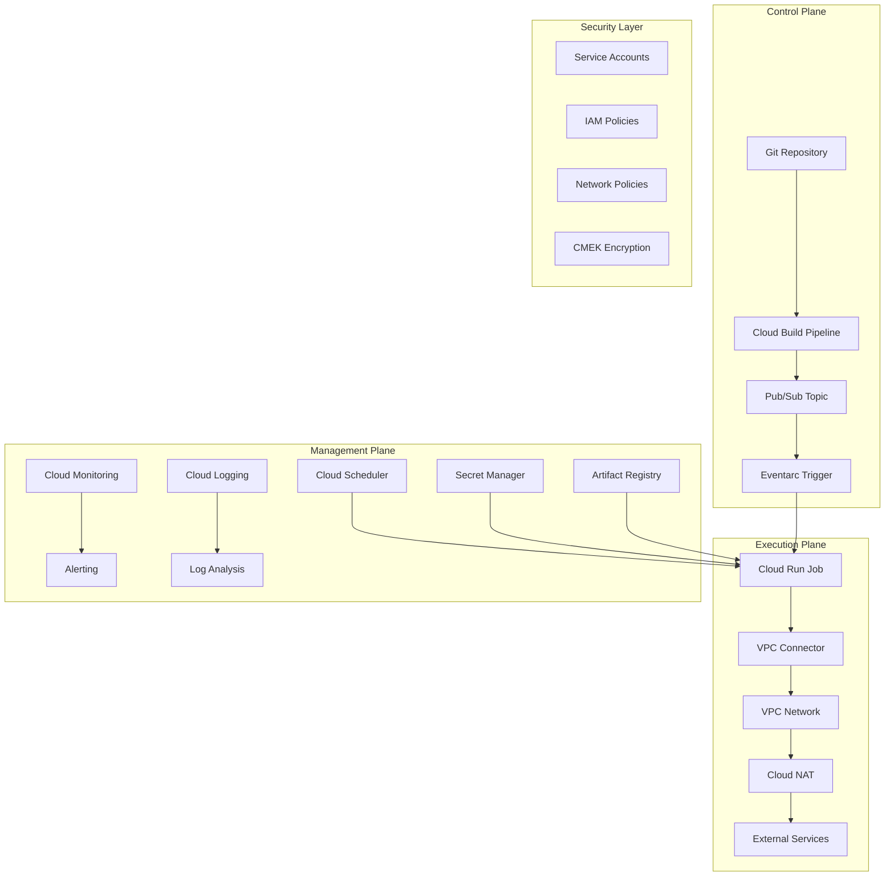

# Design Document

## Overview

This design outlines a comprehensive Cloud Run automation platform that standardizes deployment processes, manages task lifecycles, and provides operational workflows for Cloud Run jobs across multiple regions and projects. The system leverages Google Cloud's native services to create a secure, scalable, and maintainable automation platform.

## Architecture

### High-Level Architecture



### Core Components

#### 1. Standardized Job Templates
- **Base Container Images**: Standardized Ubuntu-based images with common tooling (gcloud SDK, kubectl, Terraform)
- **Entrypoint Pattern**: Flexible `entrypoint.sh` wrapper supporting dynamic command execution
- **Configuration Management**: Environment-specific configurations via environment variables and Secret Manager

#### 2. Deployment Pipeline
- **Source Control Integration**: Git-based workflows with branch protection and PR reviews
- **CI/CD Pipeline**: Cloud Build pipelines for automated testing, building, and deployment
- **Artifact Management**: Container images stored in Artifact Registry with vulnerability scanning

#### 3. Job Orchestration
- **Event-Driven Triggers**: Pub/Sub + Eventarc for decoupled job execution
- **Scheduled Execution**: Cloud Scheduler for time-based job triggers
- **Manual Execution**: CLI and console interfaces for on-demand job execution

#### 4. Network Architecture
- **VPC Connectivity**: Serverless VPC Access connectors for secure network access
- **Egress Control**: Cloud NAT for consistent outbound IP addresses
- **Security Policies**: Network policies and firewall rules for traffic control

## Components and Interfaces

### 1. Job Template System

#### Base Image Structure
```dockerfile
FROM ubuntu:22.04

# Layer 1: Base system dependencies
RUN apt-get update && apt-get install -y \
    curl \
    git \
    jq \
    unzip \
    && rm -rf /var/lib/apt/lists/*

# Layer 2: Cloud tooling
RUN curl -sSL https://sdk.cloud.google.com | bash
RUN curl -LO "https://dl.k8s.io/release/$(curl -L -s https://dl.k8s.io/release/stable.txt)/bin/linux/amd64/kubectl"

# Layer 3: Application-specific tools
COPY entrypoint.sh /usr/local/bin/
RUN chmod +x /usr/local/bin/entrypoint.sh

ENTRYPOINT ["entrypoint.sh"]
CMD ["--help"]
```

#### Entrypoint Script Pattern
```bash
#!/bin/bash
set -euo pipefail

# Pre-execution setup
echo "Starting Cloud Run job at $(date)"

# Environment validation
required_vars=("PROJECT_ID" "REGION")
for var in "${required_vars[@]}"; do
    if [[ -z "${!var:-}" ]]; then
        echo "Error: Required environment variable $var is not set"
        exit 1
    fi
done

# Secret retrieval
if [[ -n "${SECRET_NAMES:-}" ]]; then
    echo "Retrieving secrets from Secret Manager..."
    # Secrets are automatically mounted by Cloud Run
fi

# Execute the main command
echo "Executing: $*"
exec "$@"
```

### 2. Deployment Pipeline Interface

#### Cloud Build Configuration
```yaml
steps:
  # Build and test
  - name: 'gcr.io/cloud-builders/docker'
    args: ['build', '-t', '${_REGION}-docker.pkg.dev/${PROJECT_ID}/${_REPO}/${_IMAGE}:${SHORT_SHA}', '.']
  
  # Security scanning
  - name: 'gcr.io/cloud-builders/gcloud'
    args: ['container', 'images', 'scan', '${_REGION}-docker.pkg.dev/${PROJECT_ID}/${_REPO}/${_IMAGE}:${SHORT_SHA}']
  
  # Push to registry
  - name: 'gcr.io/cloud-builders/docker'
    args: ['push', '${_REGION}-docker.pkg.dev/${PROJECT_ID}/${_REPO}/${_IMAGE}:${SHORT_SHA}']
  
  # Deploy job template
  - name: 'gcr.io/cloud-builders/gcloud'
    args: 
      - 'run'
      - 'jobs'
      - 'replace'
      - 'job-template.yaml'
      - '--region=${_REGION}'

substitutions:
  _REGION: 'europe-west2'
  _REPO: 'cloud-run-jobs'
  _IMAGE: 'automation-agent'
```

### 3. Job Management Interface

#### Job Configuration Template
```yaml
apiVersion: run.googleapis.com/v1
kind: Job
metadata:
  name: automation-job-template
  namespace: ${PROJECT_ID}
  labels:
    managed-by: cloud-run-automation
    environment: ${ENVIRONMENT}
spec:
  template:
    spec:
      template:
        spec:
          serviceAccountName: ${SERVICE_ACCOUNT}
          containers:
          - image: ${IMAGE_URL}
            env:
            - name: PROJECT_ID
              value: ${PROJECT_ID}
            - name: REGION
              value: ${REGION}
            - name: ENVIRONMENT
              value: ${ENVIRONMENT}
            resources:
              limits:
                cpu: "1"
                memory: "2Gi"
          timeoutSeconds: 3600
          taskCount: 1
          parallelism: 1
```

#### Job Execution API
```python
class JobManager:
    def __init__(self, project_id: str, region: str):
        self.project_id = project_id
        self.region = region
        self.client = run_v1.JobsClient()
    
    def execute_job(self, job_name: str, parameters: Dict[str, str]) -> str:
        """Execute a Cloud Run job with parameters"""
        request = run_v1.RunJobRequest(
            name=f"projects/{self.project_id}/locations/{self.region}/jobs/{job_name}",
            overrides=run_v1.RunJobRequest.Overrides(
                container_overrides=[
                    run_v1.RunJobRequest.Overrides.ContainerOverride(
                        env=[
                            run_v1.EnvVar(name=k, value=v) 
                            for k, v in parameters.items()
                        ]
                    )
                ]
            )
        )
        
        operation = self.client.run_job(request=request)
        return operation.name
    
    def list_jobs(self, filters: Dict[str, str] = None) -> List[Job]:
        """List jobs with optional filtering"""
        request = run_v1.ListJobsRequest(
            parent=f"projects/{self.project_id}/locations/{self.region}"
        )
        
        jobs = []
        for job in self.client.list_jobs(request=request):
            if self._matches_filters(job, filters):
                jobs.append(job)
        
        return jobs
```

### 4. Security Interface

#### Service Account Structure
```yaml
# Invoker Service Account (for triggering jobs)
apiVersion: iam.cnrm.cloud.google.com/v1beta1
kind: IAMServiceAccount
metadata:
  name: job-invoker-sa
spec:
  displayName: "Cloud Run Job Invoker"
  
---
# Runtime Service Account (for job execution)
apiVersion: iam.cnrm.cloud.google.com/v1beta1
kind: IAMServiceAccount
metadata:
  name: job-runtime-sa
spec:
  displayName: "Cloud Run Job Runtime"

---
# IAM Policy Bindings
apiVersion: iam.cnrm.cloud.google.com/v1beta1
kind: IAMPolicy
metadata:
  name: job-invoker-policy
spec:
  resourceRef:
    apiVersion: run.googleapis.com/v1
    kind: Job
    name: automation-job
  bindings:
  - role: roles/run.invoker
    members:
    - serviceAccount:job-invoker-sa@PROJECT_ID.iam.gserviceaccount.com
```

## Data Models

### 1. Job Configuration Model
```python
@dataclass
class JobConfiguration:
    name: str
    image_url: str
    region: str
    environment: str
    service_account: str
    vpc_connector: Optional[str] = None
    secrets: Dict[str, str] = field(default_factory=dict)
    env_vars: Dict[str, str] = field(default_factory=dict)
    resource_limits: ResourceLimits = field(default_factory=ResourceLimits)
    timeout_seconds: int = 3600
    max_retries: int = 3
    
@dataclass
class ResourceLimits:
    cpu: str = "1"
    memory: str = "2Gi"
```

### 2. Execution Model
```python
@dataclass
class JobExecution:
    execution_id: str
    job_name: str
    status: ExecutionStatus
    start_time: datetime
    end_time: Optional[datetime] = None
    parameters: Dict[str, str] = field(default_factory=dict)
    logs_url: Optional[str] = None
    error_message: Optional[str] = None

class ExecutionStatus(Enum):
    PENDING = "PENDING"
    RUNNING = "RUNNING"
    SUCCEEDED = "SUCCEEDED"
    FAILED = "FAILED"
    CANCELLED = "CANCELLED"
```

### 3. Network Configuration Model
```python
@dataclass
class NetworkConfiguration:
    vpc_connector: str
    egress_setting: str = "all-traffic"
    firewall_rules: List[FirewallRule] = field(default_factory=list)
    nat_gateway: Optional[str] = None
    
@dataclass
class FirewallRule:
    name: str
    direction: str  # INGRESS or EGRESS
    action: str     # ALLOW or DENY
    priority: int
    source_ranges: List[str] = field(default_factory=list)
    target_tags: List[str] = field(default_factory=list)
    protocols: List[str] = field(default_factory=list)
```

## Error Handling

### 1. Job Execution Errors
- **Timeout Handling**: Automatic retry with exponential backoff for transient failures
- **Resource Exhaustion**: Automatic scaling recommendations based on resource usage patterns
- **Network Failures**: Retry logic with circuit breaker pattern for external service calls
- **Authentication Errors**: Clear error messages with remediation steps for IAM issues

### 2. Error Classification
```python
class ErrorClassifier:
    @staticmethod
    def classify_error(error_message: str, exit_code: int) -> ErrorType:
        if "timeout" in error_message.lower():
            return ErrorType.TIMEOUT
        elif "permission denied" in error_message.lower():
            return ErrorType.PERMISSION
        elif "resource exhausted" in error_message.lower():
            return ErrorType.RESOURCE
        elif exit_code in [1, 2]:
            return ErrorType.APPLICATION
        else:
            return ErrorType.UNKNOWN

class ErrorType(Enum):
    TIMEOUT = "timeout"
    PERMISSION = "permission"
    RESOURCE = "resource"
    APPLICATION = "application"
    NETWORK = "network"
    UNKNOWN = "unknown"
```

### 3. Recovery Strategies
- **Automatic Retry**: Configurable retry policies based on error type
- **Fallback Mechanisms**: Alternative execution paths for critical operations
- **Circuit Breaker**: Prevent cascade failures in dependent services
- **Dead Letter Queue**: Capture failed executions for manual investigation

## Testing Strategy

### 1. Unit Testing
- **Component Testing**: Individual components tested in isolation
- **Mock Services**: External dependencies mocked for reliable testing
- **Test Coverage**: Minimum 80% code coverage requirement

### 2. Integration Testing
- **End-to-End Workflows**: Complete job lifecycle testing
- **Network Connectivity**: VPC connector and NAT gateway functionality
- **Security Validation**: IAM permissions and secret access testing

### 3. Performance Testing
- **Load Testing**: Job execution under various load conditions
- **Scalability Testing**: Auto-scaling behavior validation
- **Resource Optimization**: Memory and CPU usage optimization

### 4. Security Testing
- **Vulnerability Scanning**: Container image security scanning
- **Penetration Testing**: Network security validation
- **Compliance Testing**: Adherence to security policies and standards

### 5. Test Automation
```yaml
# Test Pipeline Configuration
steps:
  - name: 'Unit Tests'
    command: 'python -m pytest tests/unit/ --cov=src --cov-report=xml'
  
  - name: 'Integration Tests'
    command: 'python -m pytest tests/integration/ --env=test'
  
  - name: 'Security Scan'
    command: 'gcloud container images scan $IMAGE_URL'
  
  - name: 'Load Test'
    command: 'python tests/load/run_load_test.py --duration=300'
```

## Monitoring and Observability

### 1. Metrics Collection
- **Job Execution Metrics**: Success rate, duration, resource usage
- **System Metrics**: API latency, error rates, throughput
- **Business Metrics**: Deployment frequency, lead time, recovery time

### 2. Logging Strategy
- **Structured Logging**: JSON-formatted logs with consistent schema
- **Log Aggregation**: Centralized logging with Cloud Logging
- **Log Analysis**: Automated log analysis for error detection and trends

### 3. Alerting Framework
```yaml
# Alert Policy Configuration
alertPolicy:
  displayName: "Cloud Run Job Failures"
  conditions:
  - displayName: "Job failure rate > 5%"
    conditionThreshold:
      filter: 'resource.type="cloud_run_job"'
      comparison: COMPARISON_GREATER_THAN
      thresholdValue: 0.05
      duration: 300s
  notificationChannels:
  - projects/PROJECT_ID/notificationChannels/SLACK_CHANNEL
  - projects/PROJECT_ID/notificationChannels/EMAIL_CHANNEL
```

This design provides a comprehensive foundation for building a robust Cloud Run automation platform that meets all the requirements while following Google Cloud best practices for security, scalability, and maintainability.