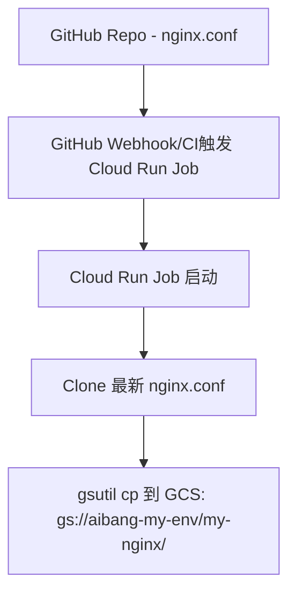

# GCP Cloud Run Job: GitHub 文件变更同步至 GCS

## 🎯 目标场景

- GitHub 上维护的 `nginx.conf` 文件发生变更时  
- 自动触发一个 Cloud Run Job  
- Cloud Run Job 拉取文件并同步到 GCS，如：

```
gs://aibang-my-env/my-nginx/nginx.conf
```

---

## ✅ 架构流程图



---

## ✅ Dockerfile

```Dockerfile
FROM google/cloud-sdk:alpine

RUN apk add --no-cache git

WORKDIR /app

COPY sync.sh .

ENTRYPOINT ["/app/sync.sh"]
```

---

## ✅ sync.sh 脚本

```bash
#!/bin/sh

set -e

REPO_URL="https://github.com/your-org/your-repo.git"
BRANCH="main"
TARGET_FILE="nginx.conf"
DEST_PATH="gs://aibang-my-env/my-nginx/"

git clone --depth=1 --branch $BRANCH $REPO_URL repo
cd repo

echo "Uploading $TARGET_FILE to $DEST_PATH"
gsutil cp $TARGET_FILE $DEST_PATH

echo "Done!"
```

---

## ✅ Cloud Run Job 创建命令

```bash
gcloud run jobs create nginx-sync-job \
  --image=REGION-docker.pkg.dev/PROJECT_ID/REPO/nginx-sync-job \
  --region=REGION \
  --tasks=1 \
  --max-retries=1 \
  --timeout=300s \
  --service-account=job-executor@PROJECT_ID.iam.gserviceaccount.com \
  --set-env-vars="REPO_URL=https://github.com/your-org/your-repo.git,BRANCH=main"
```

---

## ✅ 三种实现方式

### ✅ 方式 1：使用 Cloud Build 自动构建 + 部署

```yaml
# cloudbuild.yaml
steps:
  - name: 'gcr.io/cloud-builders/docker'
    args: ['build', '-t', 'REGION-docker.pkg.dev/PROJECT_ID/REPO/nginx-sync-job', '.']

  - name: 'gcr.io/cloud-builders/docker'
    args: ['push', 'REGION-docker.pkg.dev/PROJECT_ID/REPO/nginx-sync-job']

  - name: 'gcr.io/google.com/cloudsdktool/cloud-sdk'
    entrypoint: bash
    args:
      - -c
      - |
        gcloud run jobs update nginx-sync-job \
          --image=REGION-docker.pkg.dev/PROJECT_ID/REPO/nginx-sync-job \
          --region=REGION \
          --set-env-vars=REPO_URL=https://github.com/your-org/your-repo.git,BRANCH=main \
          --service-account=job-executor@PROJECT_ID.iam.gserviceaccount.com || \
        gcloud run jobs create nginx-sync-job \
          --image=REGION-docker.pkg.dev/PROJECT_ID/REPO/nginx-sync-job \
          --region=REGION \
          --tasks=1 \
          --max-retries=1 \
          --timeout=300s \
          --set-env-vars=REPO_URL=https://github.com/your-org/your-repo.git,BRANCH=main \
          --service-account=job-executor@PROJECT_ID.iam.gserviceaccount.com

images:
  - REGION-docker.pkg.dev/PROJECT_ID/REPO/nginx-sync-job
```

---

### ✅ 方式 2：GitHub Actions 自动触发执行

```yaml
# .github/workflows/trigger-job.yml
name: Trigger Cloud Run Job

on:
  push:
    paths:
      - "nginx.conf"

jobs:
  trigger:
    runs-on: ubuntu-latest
    steps:
    - name: Trigger Cloud Run Job Execution
      env:
        GCP_REGION: asia-northeast1
        GCP_PROJECT: your-project-id
        JOB_NAME: nginx-sync-job
        OAUTH_TOKEN: ${{ secrets.GCP_OAUTH_TOKEN }}
      run: |
        curl -X POST \
          -H "Authorization: Bearer $OAUTH_TOKEN" \
          -H "Content-Type: application/json" \
          https://$GCP_REGION-run.googleapis.com/apis/run.googleapis.com/v1/namespaces/$GCP_PROJECT/jobs/$JOB_NAME:run
```

---

### ✅ 方式 3：Shell 脚本部署 + 执行（适用于 GitLab CI、本地测试）

```bash
#!/bin/bash
set -e

IMAGE="REGION-docker.pkg.dev/PROJECT_ID/REPO/nginx-sync-job"
REGION="asia-northeast1"
JOB_NAME="nginx-sync-job"

echo "[1/3] Building image..."
gcloud builds submit --tag $IMAGE .

echo "[2/3] Creating or updating Cloud Run Job..."
gcloud run jobs describe $JOB_NAME --region $REGION >/dev/null 2>&1 && EXISTS=1 || EXISTS=0

if [[ $EXISTS -eq 1 ]]; then
  gcloud run jobs update $JOB_NAME \
    --image=$IMAGE \
    --region=$REGION \
    --set-env-vars=REPO_URL=https://github.com/your-org/your-repo.git,BRANCH=main \
    --service-account=job-executor@PROJECT_ID.iam.gserviceaccount.com
else
  gcloud run jobs create $JOB_NAME \
    --image=$IMAGE \
    --region=$REGION \
    --tasks=1 \
    --max-retries=1 \
    --timeout=300s \
    --set-env-vars=REPO_URL=https://github.com/your-org/your-repo.git,BRANCH=main \
    --service-account=job-executor@PROJECT_ID.iam.gserviceaccount.com
fi

echo "[3/3] Triggering execution..."
gcloud run jobs execute $JOB_NAME --region $REGION
```

---

## ✅ 权限配置（Storage 写入权限）

```bash
gcloud projects add-iam-policy-binding PROJECT_ID \
  --member="serviceAccount:job-executor@PROJECT_ID.iam.gserviceaccount.com" \
  --role="roles/storage.objectAdmin"
```

---

## ✅ 推荐组合使用

| 操作                   | 推荐方式                        |
|------------------------|---------------------------------|
| 镜像构建               | Cloud Build / GitHub Action     |
| Job 部署 & 触发        | gcloud shell 脚本 or GitHub Hook|
| 执行计划调度（定时）   | Cloud Scheduler                 |
| 文件同步逻辑           | Bash + git + gsutil             |