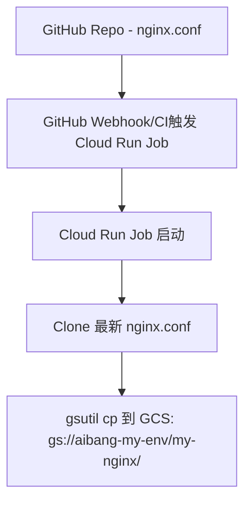

# Cloud Run 访问 Cloud Storage Buckets

Cloud Run 服务默认情况下无法直接访问 Cloud Storage Buckets,需要为 Cloud Run 服务关联一个具有相应权限的 Service Account.

## 操作步骤

1. 创建一个 Service Account

   ```bash
   gcloud iam service-accounts create ${sa_name} --display-name="${sa_name}"
   ```

2. 为 Service Account 授予访问 Bucket 的权限

   ```bash
   gsutil iam ch serviceAccount:${sa_name}@${project_id}.iam.gserviceaccount.com:objectAdmin gs://${bucket_name}
   ```

3. 部署 Cloud Run 服务时,指定 Service Account

   ```bash
   gcloud run deploy ${service_name} --image=${image_name} --service-account=${sa_name}@${project_id}.iam.gserviceaccount.com
   ```

## 权限说明

| 角色 | 权限 |
| :--- | :--- |
| `roles/storage.objectViewer` | 查看对象和其元数据,不包括 ACL |
| `roles/storage.objectCreator` | 创建对象 |
| `roles/storage.objectAdmin` | 完全控制对象,包括读、写、删除和设置 ACL |

## 总结

通过为 Cloud Run 服务关联具有相应权限的 Service Account,可以安全地访问 Cloud Storage Buckets.

# Q

关于这个结构，比如我想实现一个最简单的通过 Cloud Run 运行的 Dockerfile build 一个 Images 来实现 schedule job 调用 比如更改了 GitHub 里面的源文件 nginx.conf 然后需要同步到 GCP 的 buckets 里面，比如 Buckets 目录对应为 gs://aibang-my-env/my-nginx/ 整个流程帮我梳理出来并给出一些关键配置。

---

### **✅**

### **目标场景**

1. 你在 GitHub 上维护了一个配置文件（如 nginx.conf）
2. 每当该文件更新（例如合并 PR），就通过一个 Cloud Run Job 自动运行
3. Cloud Run Job 拉取 GitHub 文件，将其同步到 GCS 中指定路径，如：

   gs://aibang-my-env/my-nginx/nginx.conf

---

## **✅ 总体流程架构（简洁清晰）**



---

## **✅ 步骤详解**

---

### **🔹 Step 1: 准备 Cloud Run Job 的 Image**

#### **🔸**

#### **Dockerfile**

```dockerfile
FROM google/cloud-sdk:alpine

RUN apk add --no-cache git

WORKDIR /app

COPY sync.sh .

ENTRYPOINT ["/app/sync.sh"]
```

---

#### **🔸**

#### **sync.sh**

```bash
#!/bin/sh

set -e

# 配置参数（可改为环境变量形式）
REPO_URL="https://github.com/your-org/your-repo.git"
BRANCH="main"
TARGET_FILE="nginx.conf"
DEST_PATH="gs://aibang-my-env/my-nginx/"

# 克隆仓库
git clone --depth=1 --branch $BRANCH $REPO_URL repo
cd repo

# 同步目标文件到 GCS
echo "Uploading $TARGET_FILE to $DEST_PATH"
gsutil cp $TARGET_FILE $DEST_PATH

echo "Done!"
```

---

### **🔹 Step 2: 构建并上传镜像到 GAR**

```bash
gcloud builds submit --tag REGION-docker.pkg.dev/PROJECT_ID/REPO_NAME/nginx-sync-job
```

---

### **🔹 Step 3: 创建 Cloud Run Job（一次性）**

```bash
gcloud run jobs create nginx-sync-job \
  --image=REGION-docker.pkg.dev/PROJECT_ID/REPO_NAME/nginx-sync-job \
  --region=REGION \
  --tasks=1 \
  --max-retries=1 \
  --timeout=300s \
  --service-account=job-executor@PROJECT_ID.iam.gserviceaccount.com \
  --set-env-vars="REPO_URL=https://github.com/your-org/your-repo.git,BRANCH=main"
```

---

### **🔹 Step 4: 权限设置**

确保 job-executor@ 具有如下权限：

```bash
gcloud projects add-iam-policy-binding PROJECT_ID \
  --member="serviceAccount:job-executor@PROJECT_ID.iam.gserviceaccount.com" \
  --role="roles/storage.objectAdmin"
```

---

### **🔹 Step 5: 创建触发器（定时 or CI/CD）**

#### **✅ 方式一：Cloud Scheduler 定时触发**

```bash
gcloud scheduler jobs create http trigger-nginx-sync \
  --schedule="*/30 * * * *" \
  --uri="https://REGION-run.googleapis.com/apis/run.googleapis.com/v1/namespaces/PROJECT_ID/jobs/nginx-sync-job:run" \
  --http-method POST \
  --oauth-service-account-email=job-trigger@PROJECT_ID.iam.gserviceaccount.com \
  --location=REGION
```

#### **✅ 方式二：GitHub Action 触发**

.github/workflows/sync.yaml

```yaml
name: Sync NGINX Conf

on:
  push:
    paths:
      - "nginx.conf"

jobs:
  trigger:
    runs-on: ubuntu-latest
    steps:
    - name: Trigger Cloud Run Job
      run: |
        curl -X POST -H "Authorization: Bearer ${{ secrets.GCP_OAUTH_TOKEN }}" \
          "https://REGION-run.googleapis.com/apis/run.googleapis.com/v1/namespaces/PROJECT_ID/jobs/nginx-sync-job:run"
```

---

## **✅ 文件结构建议**

```bash
.
├── Dockerfile
├── sync.sh
├── .github
│   └── workflows
│       └── sync.yaml
```

---

## **✅ 总结表格**

| **项目** | **内容说明** |
| :--- | :--- |
| 镜像基础 | google/cloud-sdk:alpine，包含 gsutil 和 git |
| 脚本入口 | sync.sh，clone Git + gsutil cp |
| Cloud Run Job 权限 | 需有 roles/storage.objectAdmin 权限 |
| 镜像构建方式 | 使用 Cloud Build 提交 Dockerfile 构建至 GAR |
| Job 触发方式 | 支持 Cloud Scheduler 定时或 GitHub Action 事件触发 |
| GCS 路径 | 目标文件路径如 gs://aibang-my-env/my-nginx/nginx.conf |

---

需要我再补充 Cloud Build 的自动 build 配置（如 cloudbuild.yaml）或者 .gitlab-ci.yml 类型的脚本集成吗？还是你希望把这套流程用 Terraform 落地？

当然可以，除了 Terraform 以外，整个流程你可以通过 **以下三种方式**自动化落地：

---

## **✅ 三种部署方式汇总**

| **方法** | **特点** | **适合场景** |
| :--- | :--- | :--- |
| **1. Cloud Build (YAML)** | 原生集成 GCP，适合镜像构建 & Job 自动部署 | 持续集成 / 镜像自动构建 |
| **2. GitHub Actions** | 可与 GitHub 仓库直接集成，无需 GCP 控制台 | push 触发 / 文件变更自动发布 |
| **3. Shell 脚本 + gcloud CLI** | 简单快速，无外部系统依赖 | 本地测试 / CI 执行脚本 |

---

## **✅ 方式 1：使用 Cloud Build 自动构建 + 部署 Cloud Run Job**

### **📄**

### **cloudbuild.yaml**

```yaml
steps:
  - name: 'gcr.io/cloud-builders/docker'
    args: ['build', '-t', 'REGION-docker.pkg.dev/PROJECT_ID/REPO/nginx-sync-job', '.']

  - name: 'gcr.io/cloud-builders/docker'
    args: ['push', 'REGION-docker.pkg.dev/PROJECT_ID/REPO/nginx-sync-job']

  - name: 'gcr.io/google.com/cloudsdktool/cloud-sdk'
    entrypoint: bash
    args:
      - -c
      - |
        gcloud run jobs update nginx-sync-job \
          --image=REGION-docker.pkg.dev/PROJECT_ID/REPO/nginx-sync-job \
          --region=REGION \
          --set-env-vars=REPO_URL=https://github.com/your-org/your-repo.git,BRANCH=main \
          --service-account=job-executor@PROJECT_ID.iam.gserviceaccount.com || \
        gcloud run jobs create nginx-sync-job \
          --image=REGION-docker.pkg.dev/PROJECT_ID/REPO/nginx-sync-job \
          --region=REGION \
          --tasks=1 \
          --max-retries=1 \
          --timeout=300s \
          --set-env-vars=REPO_URL=https://github.com/your-org/your-repo.git,BRANCH=main \
          --service-account=job-executor@PROJECT_ID.iam.gserviceaccount.com

images:
  - REGION-docker.pkg.dev/PROJECT_ID/REPO/nginx-sync-job
```

> 使用 gcloud run jobs update || create 语法确保幂等操作。

---

## **✅ 方式 2：使用 GitHub Actions 自动触发 Cloud Run Job 执行**

### **📄**

### **.github/workflows/trigger-job.yml**

```yaml
name: Trigger Cloud Run Job

on:
  push:
    paths:
      - "nginx.conf"

jobs:
  trigger:
    runs-on: ubuntu-latest
    steps:
    - name: Trigger Cloud Run Job Execution
      env:
        GCP_REGION: asia-northeast1
        GCP_PROJECT: your-project-id
        JOB_NAME: nginx-sync-job
        OAUTH_TOKEN: ${{ secrets.GCP_OAUTH_TOKEN }}
      run: |
        curl -X POST \
          -H "Authorization: Bearer $OAUTH_TOKEN" \
          -H "Content-Type: application/json" \
          https://$GCP_REGION-run.googleapis.com/apis/run.googleapis.com/v1/namespaces/$GCP_PROJECT/jobs/$JOB_NAME:run
```

---

## **✅ 方式 3：Shell 脚本部署 + 执行 Job（适合 GitLab CI 或本地 CLI）**

### **📄**

### **deploy-and-run.sh**

```bash
#!/bin/bash
set -e

IMAGE="REGION-docker.pkg.dev/PROJECT_ID/REPO/nginx-sync-job"
REGION="asia-northeast1"
JOB_NAME="nginx-sync-job"

echo "[1/3] Building image..."
gcloud builds submit --tag $IMAGE .

echo "[2/3] Creating or updating Cloud Run Job..."
gcloud run jobs describe $JOB_NAME --region $REGION >/dev/null 2>&1 && EXISTS=1 || EXISTS=0

if [[ $EXISTS -eq 1 ]]; then
  gcloud run jobs update $JOB_NAME \
    --image=$IMAGE \
    --region=$REGION \
    --set-env-vars=REPO_URL=https://github.com/your-org/your-repo.git,BRANCH=main \
    --service-account=job-executor@PROJECT_ID.iam.gserviceaccount.com
else
  gcloud run jobs create $JOB_NAME \
    --image=$IMAGE \
    --region=$REGION \
    --tasks=1 \
    --max-retries=1 \
    --timeout=300s \
    --set-env-vars=REPO_URL=https://github.com/your-org/your-repo.git,BRANCH=main \
    --service-account=job-executor@PROJECT_ID.iam.gserviceaccount.com
fi

echo "[3/3] Triggering execution..."
gcloud run jobs execute $JOB_NAME --region $REGION
```

---

## **✅ 推荐组合使用**

| **操作** | **推荐方式** |
| :--- | :--- |
| 镜像构建 | Cloud Build / GitHub Action |
| Job 部署 & 触发 | gcloud shell 脚本 or GitHub Webhook |
| 执行计划调度（定时） | Cloud Scheduler |
| 文件同步核心逻辑 | Bash + git + gsutil |

---

你可以选择 **方式 1 + 方式 3 组合** 来落地：

- **Cloud Build** 自动构建上传镜像
- **Shell 脚本** 自动更新 Job 并触发执行

是否需要我给你打包一个完整的代码目录结构 zip，或输出合适的 .gitlab-ci.yml 示例用于 GitLab?