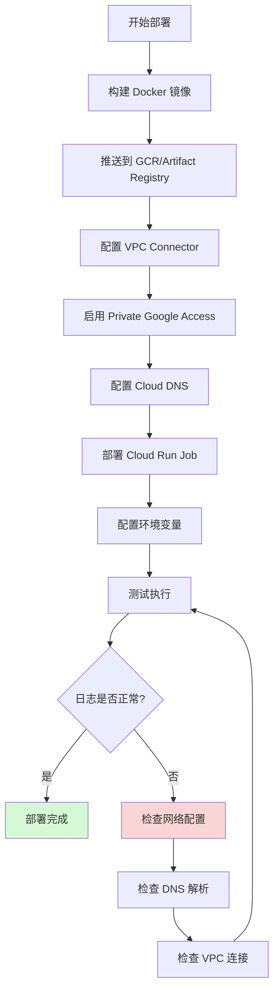
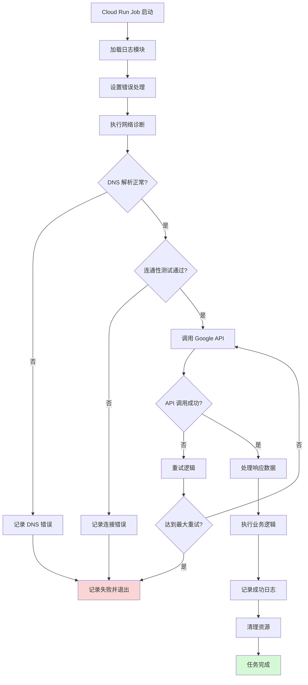
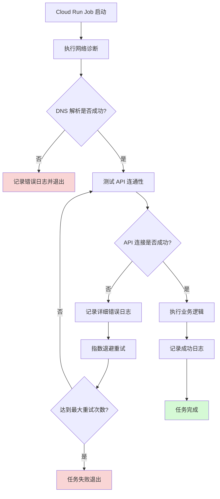

# Cloud Run Job 日志缺失问题分析与最佳实践

## 问题分析

您遇到的核心问题包括：

1. **网络连接问题**：Cloud Run Job 无法访问 `private.googleapis.com` 等 Google 内部 API
2. **DNS 解析问题**：VPC 缺少 Private Google Access 的 DNS 配置
3. **日志缺失**：由于网络请求失败且缺少错误处理，导致无任何日志输出

根本原因是：**应用在网络请求失败时没有捕获异常并输出日志，导致静默失败**。


# Shell 脚本 Cloud Run Job 日志与网络诊断最佳实践

## 问题分析

Shell 脚本在 Cloud Run Job 中需要特别注意：

1. **标准输出重定向**：确保所有日志输出到 stdout/stderr
2. **错误捕获**：Shell 默认不会捕获命令失败
3. **网络诊断**：需要使用系统工具进行诊断
4. **结构化日志**：Shell 需要手动格式化 JSON 日志

---

## 完整解决方案

### 1. 日志函数库（logging.sh）

```bash
#!/bin/bash

# 颜色定义（本地调试用，Cloud Run 会忽略）
RED='\033[0;31m'
YELLOW='\033[1;33m'
GREEN='\033[0;32m'
BLUE='\033[0;34m'
NC='\033[0m' # No Color

# 日志级别
LOG_LEVEL=${LOG_LEVEL:-INFO}

# 获取当前时间戳（ISO 8601 格式）
get_timestamp() {
    date -u +"%Y-%m-%dT%H:%M:%S.%3NZ"
}

# 结构化日志输出（JSON 格式，便于 Cloud Logging 解析）
log_json() {
    local severity=$1
    local message=$2
    shift 2
    local extra_fields=""
    
    # 处理额外字段
    while [[ $# -gt 0 ]]; do
        extra_fields="${extra_fields},\"$1\":\"$2\""
        shift 2
    done
    
    # 输出 JSON 格式日志
    echo "{\"timestamp\":\"$(get_timestamp)\",\"severity\":\"${severity}\",\"message\":\"${message}\"${extra_fields}}"
}

# 便捷日志函数
log_debug() {
    [[ "$LOG_LEVEL" == "DEBUG" ]] && log_json "DEBUG" "$*"
}

log_info() {
    log_json "INFO" "$*" >&1
}

log_warning() {
    log_json "WARNING" "$*" >&2
}

log_error() {
    log_json "ERROR" "$*" >&2
}

log_critical() {
    log_json "CRITICAL" "$*" >&2
}

# 带额外字段的日志
log_with_context() {
    local severity=$1
    local message=$2
    shift 2
    log_json "$severity" "$message" "$@"
}
```

---

### 2. 网络诊断模块（network_diagnostics.sh）

```bash
#!/bin/bash

source ./logging.sh

# DNS 解析检查
check_dns_resolution() {
    local domain=$1
    log_info "Checking DNS resolution for: ${domain}"
    
    if command -v nslookup &> /dev/null; then
        local result=$(nslookup "${domain}" 2>&1)
        local exit_code=$?
        
        if [[ $exit_code -eq 0 ]]; then
            local ip=$(echo "$result" | grep -A1 "Name:" | grep "Address:" | awk '{print $2}' | head -1)
            log_with_context "INFO" "DNS resolution successful" \
                "domain" "${domain}" \
                "ip" "${ip}"
            return 0
        else
            log_with_context "ERROR" "DNS resolution failed" \
                "domain" "${domain}" \
                "error" "${result}"
            return 1
        fi
    else
        log_warning "nslookup command not found, trying host command"
        
        if command -v host &> /dev/null; then
            local result=$(host "${domain}" 2>&1)
            if [[ $? -eq 0 ]]; then
                log_info "DNS resolution successful using host: ${result}"
                return 0
            else
                log_error "DNS resolution failed: ${result}"
                return 1
            fi
        else
            log_error "No DNS lookup tools available (nslookup/host)"
            return 1
        fi
    fi
}

# 连通性测试
check_connectivity() {
    local host=$1
    local port=${2:-443}
    
    log_info "Checking connectivity to ${host}:${port}"
    
    if command -v nc &> /dev/null; then
        if timeout 5 nc -zv "${host}" "${port}" 2>&1 | tee /dev/stderr; then
            log_with_context "INFO" "Connectivity test successful" \
                "host" "${host}" \
                "port" "${port}"
            return 0
        else
            log_with_context "ERROR" "Connectivity test failed" \
                "host" "${host}" \
                "port" "${port}"
            return 1
        fi
    elif command -v telnet &> /dev/null; then
        if timeout 5 bash -c "echo quit | telnet ${host} ${port}" 2>&1 | grep -q "Connected"; then
            log_info "Connectivity successful (telnet)"
            return 0
        else
            log_error "Connectivity failed (telnet)"
            return 1
        fi
    else
        log_warning "No connectivity test tools available (nc/telnet), using curl"
        if timeout 5 curl -s -o /dev/null -w "%{http_code}" "https://${host}" > /dev/null 2>&1; then
            log_info "Connectivity test passed via curl"
            return 0
        else
            log_error "Connectivity test failed via curl"
            return 1
        fi
    fi
}

# 路由表检查
check_routes() {
    log_info "Checking route table"
    
    if command -v ip &> /dev/null; then
        local routes=$(ip route show 2>&1)
        log_info "Route table: ${routes}"
    elif command -v netstat &> /dev/null; then
        local routes=$(netstat -rn 2>&1)
        log_info "Route table: ${routes}"
    else
        log_warning "No route checking tools available"
    fi
}

# 元数据服务检查（验证是否在 GCP 环境）
check_metadata_service() {
    log_info "Checking GCP metadata service"
    
    local metadata_url="http://metadata.google.internal/computeMetadata/v1/instance/id"
    local response=$(curl -s -H "Metadata-Flavor: Google" "${metadata_url}" 2>&1)
    
    if [[ $? -eq 0 ]] && [[ -n "$response" ]]; then
        log_with_context "INFO" "Metadata service accessible" \
            "instance_id" "${response}"
        return 0
    else
        log_error "Cannot access metadata service"
        return 1
    fi
}

# 综合网络诊断
run_network_diagnostics() {
    log_info "========== Network Diagnostics Start =========="
    
    local overall_status=0
    
    # 检查元数据服务
    check_metadata_service || overall_status=1
    
    # 检查关键域名的 DNS 解析
    local domains=(
        "private.googleapis.com"
        "www.googleapis.com"
        "storage.googleapis.com"
        "oauth2.googleapis.com"
    )
    
    for domain in "${domains[@]}"; do
        check_dns_resolution "$domain" || overall_status=1
    done
    
    # 检查连通性
    check_connectivity "private.googleapis.com" 443 || overall_status=1
    
    # 检查路由
    check_routes
    
    log_info "========== Network Diagnostics End =========="
    
    return $overall_status
}
```

---

### 3. API 调用封装（api_utils.sh）

```bash
#!/bin/bash

source ./logging.sh

# 带重试的 API 调用
call_api_with_retry() {
    local url=$1
    local max_retries=${2:-3}
    local timeout=${3:-30}
    local retry_count=0
    
    log_with_context "INFO" "Starting API call" \
        "url" "${url}" \
        "max_retries" "${max_retries}"
    
    while [[ $retry_count -lt $max_retries ]]; do
        retry_count=$((retry_count + 1))
        
        log_with_context "INFO" "API call attempt" \
            "attempt" "${retry_count}" \
            "max_retries" "${max_retries}"
        
        # 使用 curl 调用 API（-w 显示详细信息）
        local http_code
        local response
        local curl_exit_code
        
        response=$(curl -s -w "\n%{http_code}" \
            --max-time "${timeout}" \
            --connect-timeout 10 \
            -H "Authorization: Bearer $(gcloud auth print-access-token 2>/dev/null)" \
            -H "Content-Type: application/json" \
            "${url}" 2>&1)
        
        curl_exit_code=$?
        http_code=$(echo "$response" | tail -n1)
        response=$(echo "$response" | sed '$d')
        
        # 判断调用是否成功
        if [[ $curl_exit_code -eq 0 ]] && [[ $http_code -ge 200 ]] && [[ $http_code -lt 300 ]]; then
            log_with_context "INFO" "API call successful" \
                "http_code" "${http_code}" \
                "attempt" "${retry_count}"
            echo "$response"
            return 0
        else
            # 记录失败详情
            case $curl_exit_code in
                6)  log_error "Couldn't resolve host - DNS resolution failed" ;;
                7)  log_error "Failed to connect to host - Connection refused" ;;
                8) log_error "Operation timeout" ;;
                9) log_error "SSL connect error" ;;
                *)  log_with_context "ERROR" "API call failed" \
                        "curl_exit_code" "${curl_exit_code}" \
                        "http_code" "${http_code}" \
                        "response" "${response}" ;;
            esac
        fi
        
        # 重试前等待（指数退避）
        if [[ $retry_count -lt $max_retries ]]; then
            local wait_time=$((2 ** (retry_count - 1)))
            log_info "Retrying in ${wait_time} seconds..."
            sleep "$wait_time"
        fi
    done
    
    log_critical "All API call attempts failed after ${max_retries} retries"
    return 1
}

# 带认证的 Google API 调用
call_google_api() {
    local api_endpoint=$1
    local method=${2:-GET}
    local data=${3:-}
    
    log_info "Calling Google API: ${api_endpoint}"
    
    # 获取访问令牌
    local access_token
    access_token=$(gcloud auth print-access-token 2>&1)
    
    if [[ $? -ne 0 ]]; then
        log_error "Failed to get access token: ${access_token}"
        return 1
    fi
    
    log_debug "Access token obtained successfully"
    
    # 构建 curl 命令
    local curl_cmd="curl -s -w \"\n%{http_code}\" "
    curl_cmd+="-H \"Authorization: Bearer ${access_token}\" "
    curl_cmd+="-H \"Content-Type: application/json\" "
    curl_cmd+="-X ${method} "
    
    if [[ -n "$data" ]]; then
        curl_cmd+="-d '${data}' "
    fi
    
    curl_cmd+="\"${api_endpoint}\""
    
    log_debug "Executing: ${curl_cmd}"
    
    # 执行调用
    eval "$curl_cmd"
}
```

---

### 4. 主脚本示例（main.sh）

```bash
#!/bin/bash

# 严格模式
set -euo pipefail

# 加载依赖脚本
SCRIPT_DIR="$(cd "$(dirname "${BASH_SOURCE[0]}")" && pwd)"
source "${SCRIPT_DIR}/logging.sh"
source "${SCRIPT_DIR}/network_diagnostics.sh"
source "${SCRIPT_DIR}/api_utils.sh"

# 错误处理
trap 'handle_error $? $LINENO' ERR

handle_error() {
    local exit_code=$1
    local line_number=$2
    log_critical "Script failed at line ${line_number} with exit code ${exit_code}"
    exit "$exit_code"
}

# 清理函数
cleanup() {
    log_info "Cleaning up resources..."
    # 添加清理逻辑
}

trap cleanup EXIT

# 主函数
main() {
    log_info "========== Cloud Run Job Started =========="
    log_with_context "INFO" "Job configuration" \
        "log_level" "${LOG_LEVEL}" \
        "script_dir" "${SCRIPT_DIR}"
    
    # 步骤 1: 网络诊断
    log_info "Step 1: Running network diagnostics"
    if ! run_network_diagnostics; then
        log_error "Network diagnostics failed, but continuing..."
        # 根据需求决定是否继续执行
    fi
    
    # 步骤 2: 调用 Google API
    log_info "Step 2: Calling Google API"
    local api_url="https://private.googleapis.com/your-api-endpoint"
    
    if response=$(call_api_with_retry "$api_url" 3 30); then
        log_info "API call successful"
        log_debug "Response: ${response}"
        
        # 处理响应
        process_response "$response"
    else
        log_critical "Failed to call API after all retries"
        exit 1
    fi
    
    # 步骤 3: 执行业务逻辑
    log_info "Step 3: Executing business logic"
    execute_business_logic
    
    log_info "========== Cloud Run Job Completed Successfully =========="
}

# 处理 API 响应
process_response() {
    local response=$1
    log_info "Processing API response..."
    
    # 使用 jq 解析 JSON（如果可用）
    if command -v jq &> /dev/null; then
        local status=$(echo "$response" | jq -r '.status // "unknown"')
        log_with_context "INFO" "Response parsed" "status" "${status}"
    else
        log_warning "jq not available, cannot parse JSON response"
        log_debug "Raw response: ${response}"
    fi
}

# 业务逻辑
execute_business_logic() {
    log_info "Executing main business logic..."
    
    # 示例：处理数据
    local data_file="${DATA_FILE:-/tmp/data.txt}"
    
    if [[ -f "$data_file" ]]; then
        local line_count=$(wc -l < "$data_file")
        log_with_context "INFO" "Processing data file" \
            "file" "${data_file}" \
            "lines" "${line_count}"
        
        # 处理每一行
        while IFS= read -r line; do
            log_debug "Processing line: ${line}"
            # 添加实际处理逻辑
        done < "$data_file"
    else
        log_warning "Data file not found: ${data_file}"
    fi
}

# 执行主函数
main "$@"
```

---

### 5. Dockerfile（包含诊断工具）

```dockerfile
FROM google/cloud-sdk:alpine

# 安装网络诊断工具和依赖
RUN apk add --no-cache \
    bash \
    curl \
    jq \
    bind-tools \
    netcat-openbsd \
    iputils \
    net-tools \
    ca-certificates

# 复制脚本
WORKDIR /app
COPY logging.sh .
COPY network_diagnostics.sh .
COPY api_utils.sh .
COPY main.sh .

# 设置权限
RUN chmod +x *.sh

# 环境变量
ENV LOG_LEVEL=INFO
ENV MAX_RETRIES=3
ENV API_TIMEOUT=30

# 执行主脚本
ENTRYPOINT ["/app/main.sh"]
```

---

### 6. 本地测试脚本（test_local.sh）

```bash
#!/bin/bash

# 模拟 Cloud Run 环境
export LOG_LEVEL=DEBUG
export GOOGLE_APPLICATION_CREDENTIALS="${HOME}/.config/gcloud/application_default_credentials.json"

# 运行主脚本
docker build -t cloud-run-job-test .

docker run -it --rm \
    -v "${HOME}/.config/gcloud:/root/.config/gcloud:ro" \
    -e GOOGLE_APPLICATION_CREDENTIALS=/root/.config/gcloud/application_default_credentials.json \
    -e LOG_LEVEL=DEBUG \
    cloud-run-job-test
```

---

## 部署流程图



---

## 执行流程图



---

## 部署命令

```bash
#!/bin/bash

# 配置变量
PROJECT_ID="your-project-id"
REGION="us-central1"
JOB_NAME="data-processing-job"
IMAGE_NAME="gcr.io/${PROJECT_ID}/${JOB_NAME}"
VPC_CONNECTOR="your-vpc-connector"
SERVICE_ACCOUNT="your-service-account@${PROJECT_ID}.iam.gserviceaccount.com"

# 1. 构建并推送镜像
log_info() { echo "[INFO] $*"; }

log_info "Building Docker image..."
docker build -t "${IMAGE_NAME}:latest" .

log_info "Pushing image to GCR..."
docker push "${IMAGE_NAME}:latest"

# 2. 部署 Cloud Run Job
log_info "Deploying Cloud Run Job..."
gcloud run jobs deploy "${JOB_NAME}" \
    --image="${IMAGE_NAME}:latest" \
    --region="${REGION}" \
    --vpc-connector="${VPC_CONNECTOR}" \
    --vpc-egress=all-traffic \
    --service-account="${SERVICE_ACCOUNT}" \
    --set-env-vars="LOG_LEVEL=INFO,MAX_RETRIES=3,API_TIMEOUT=30" \
    --max-retries=3 \
    --task-timeout=3600 \
    --memory=512Mi \
    --cpu=1

# 3. 执行测试
log_info "Executing job for testing..."
gcloud run jobs execute "${JOB_NAME}" \
    --region="${REGION}" \
    --wait

# 4. 查看日志
log_info "Fetching logs..."
gcloud logging read "resource.type=cloud_run_job AND resource.labels.job_name=${JOB_NAME}" \
    --limit=50 \
    --format=json \
    --project="${PROJECT_ID}"
```

---

## 日志查询命令

```bash
# 查看所有日志
gcloud logging read "resource.type=cloud_run_job" \
    --limit=100 \
    --format=json

# 查看错误日志
gcloud logging read "resource.type=cloud_run_job AND severity>=ERROR" \
    --limit=50 \
    --format=json

# 查看特定 Job 的日志
gcloud logging read "resource.type=cloud_run_job AND resource.labels.job_name=data-processing-job" \
    --limit=50 \
    --format=table

# 实时查看日志（流式）
gcloud logging tail "resource.type=cloud_run_job" --format=json

# 查询包含特定关键词的日志
gcloud logging read "resource.type=cloud_run_job AND textPayload=~\"DNS resolution\"" \
    --limit=20
```

---

## 最佳实践总结表

|实践项|说明|优先级|
|---|---|---|
|结构化日志|使用 JSON 格式输出，便于查询和告警|⭐⭐⭐|
|错误处理|使用 `set -euo pipefail` 和 trap|⭐⭐⭐|
|网络诊断|启动时检查 DNS、连通性、路由|⭐⭐⭐|
|重试机制|API 调用失败时指数退避重试|⭐⭐⭐|
|超时控制|所有网络操作设置合理超时|⭐⭐|
|上下文日志|记录关键参数和状态|⭐⭐|
|工具齐全|Dockerfile 包含诊断工具|⭐⭐|
|本地测试|使用 Docker 本地调试|⭐⭐|

---

## 注意事项

### Shell 脚本特殊要点

1. **管道失败检测**

```bash
# 使用 pipefail 捕获管道中的错误
set -o pipefail

# 示例
cat non_existent_file.txt | grep "pattern"  # 会被捕获
```

2. **变量未定义检测**

```bash
# 使用 nounset 防止使用未定义变量
set -u

# 如需使用可能未定义的变量
VALUE="${OPTIONAL_VAR:-default_value}"
```

3. **并发控制**

```bash
# 如需并发执行，使用后台任务
for i in {1..5}; do
    process_item "$i" &
done

# 等待所有后台任务完成
wait
log_info "All background jobs completed"
```

4. **信号处理**

```bash
# 捕获 SIGTERM（Cloud Run 优雅停止）
trap 'log_info "Received SIGTERM, shutting down..."; cleanup; exit 0' SIGTERM
```

### 性能优化

```bash
# 避免在循环中多次调用外部命令
# 不好的做法
for file in *.txt; do
    line_count=$(wc -l < "$file")
    echo "$file: $line_count"
done

# 好的做法
wc -l *.txt | while read count file; do
    echo "$file: $count"
done
```

---

通过以上 Shell 脚本方案，您的 Cloud Run Job 将具备：

✅ **完善的日志记录**：JSON 格式，结构化，易于查询  
✅ **网络自诊断**：启动时自动检测 DNS、连通性问题  
✅ **健壮的错误处理**：捕获所有异常并记录详细信息  
✅ **优雅的重试机制**：API 调用失败自动重试  
✅ **生产级可维护性**：模块化设计，易于扩展

---

## 解决方案

### 1. 应用层面优化（最重要）

#### 1.1 添加结构化日志记录

```python
import logging
import sys
from google.cloud import logging as cloud_logging

# 配置日志输出到 stdout（Cloud Run 要求）
logging.basicConfig(
    level=logging.INFO,
    format='%(asctime)s - %(name)s - %(levelname)s - %(message)s',
    handlers=[logging.StreamHandler(sys.stdout)]
)

logger = logging.getLogger(__name__)

# 可选：集成 Cloud Logging
try:
    client = cloud_logging.Client()
    client.setup_logging()
except Exception as e:
    logger.warning(f"Cloud Logging setup failed: {e}, using stdout only")
```

#### 1.2 网络请求错误处理

```python
import requests
from google.auth.transport.requests import Request
from google.oauth2 import service_account
import time

def call_google_api_with_retry(url, max_retries=3):
    """
    带重试和详细日志的 API 调用
    """
    for attempt in range(max_retries):
        try:
            logger.info(f"Attempting API call to {url} (attempt {attempt + 1}/{max_retries})")
            
            # 记录网络环境信息
            logger.info(f"Resolving DNS for {url.split('/')[2]}")
            
            response = requests.get(url, timeout=30)
            response.raise_for_status()
            
            logger.info(f"API call successful: {response.status_code}")
            return response.json()
            
        except requests.exceptions.ConnectionError as e:
            logger.error(f"Connection error: {e}")
            logger.error("Possible causes: DNS resolution failure, VPC routing issue, Private Google Access not enabled")
            
        except requests.exceptions.Timeout as e:
            logger.error(f"Request timeout: {e}")
            
        except requests.exceptions.RequestException as e:
            logger.error(f"Request failed: {e}")
            
        if attempt < max_retries - 1:
            wait_time = 2 ** attempt  # 指数退避
            logger.info(f"Retrying in {wait_time} seconds...")
            time.sleep(wait_time)
    
    logger.error(f"All {max_retries} attempts failed for {url}")
    raise Exception(f"Failed to call {url} after {max_retries} attempts")
```

#### 1.3 启动时网络诊断

```python
import socket
import subprocess

def diagnose_network():
    """
    在 Job 启动时进行网络诊断
    """
    logger.info("=== Network Diagnostics Start ===")
    
    # 检查 DNS 解析
    test_domains = [
        "private.googleapis.com",
        "www.googleapis.com",
        "metadata.google.internal"
    ]
    
    for domain in test_domains:
        try:
            ip = socket.gethostbyname(domain)
            logger.info(f"DNS resolution success: {domain} -> {ip}")
        except socket.gaierror as e:
            logger.error(f"DNS resolution failed for {domain}: {e}")
    
    # 检查路由（如果容器有权限）
    try:
        result = subprocess.run(
            ["ip", "route", "show"],
            capture_output=True,
            text=True,
            timeout=5
        )
        logger.info(f"Route table:\n{result.stdout}")
    except Exception as e:
        logger.warning(f"Cannot check route: {e}")
    
    logger.info("=== Network Diagnostics End ===")

# 在主函数开始时调用
if __name__ == "__main__":
    diagnose_network()
    # ... 其他业务逻辑
```

---

### 2. GCP 基础设施配置

#### 2.1 启用 Private Google Access

```bash
# 为子网启用 Private Google Access
gcloud compute networks subnets update SUBNET_NAME \
    --region=REGION \
    --enable-private-ip-google-access
```

#### 2.2 配置 Cloud DNS（针对严格权限场景）

```bash
# 创建 Private DNS Zone
gcloud dns managed-zones create google-apis \
    --description="Google APIs Private Zone" \
    --dns-name=googleapis.com. \
    --networks=VPC_NAME \
    --visibility=private

# 添加 A 记录指向 restricted.googleapis.com
gcloud dns record-sets create private.googleapis.com. \
    --zone=google-apis \
    --type=A \
    --ttl=300 \
    --rrdatas=199.36.153.8,199.36.153.9,199.36.153.10,199.36.153.11
```

#### 2.3 Cloud Run Job 网络配置

```bash
# 部署 Cloud Run Job 时绑定 VPC
gcloud run jobs create JOB_NAME \
    --image=IMAGE_URL \
    --vpc-connector=VPC_CONNECTOR_NAME \
    --vpc-egress=all-traffic \
    --region=REGION
```

---

### 3. 最佳实践流程图



---

## 开发最佳实践

### 1. 日志级别分层

|级别|使用场景|示例|
|---|---|---|
|DEBUG|详细调试信息|请求参数、响应体|
|INFO|关键流程节点|Job 启动、API 调用成功|
|WARNING|非关键错误|重试次数、配置缺失|
|ERROR|业务失败|API 调用失败、数据处理错误|
|CRITICAL|系统级错误|无法启动、致命异常|

### 2. 结构化日志格式

```python
import json

def log_structured(event_type, **kwargs):
    """
    输出 JSON 格式日志便于 Cloud Logging 查询
    """
    log_entry = {
        "severity": kwargs.pop("severity", "INFO"),
        "eventType": event_type,
        "timestamp": time.time(),
        **kwargs
    }
    print(json.dumps(log_entry))

# 使用示例
log_structured("API_CALL", 
               url="https://private.googleapis.com/api", 
               method="GET",
               severity="INFO")
```

### 3. 健康检查端点（如果是 Cloud Run Service）

```python
from flask import Flask, jsonify

app = Flask(__name__)

@app.route('/health')
def health_check():
    """
    健康检查端点，验证关键依赖
    """
    checks = {
        "dns": check_dns_resolution(),
        "api_connectivity": check_api_connectivity(),
        "credentials": check_credentials()
    }
    
    all_healthy = all(checks.values())
    status_code = 200 if all_healthy else 503
    
    return jsonify(checks), status_code
```

### 4. 环境变量配置

```bash
# 通过环境变量控制日志级别
export LOG_LEVEL=DEBUG
export API_TIMEOUT=30
export MAX_RETRIES=3
```

```python
import os

LOG_LEVEL = os.getenv('LOG_LEVEL', 'INFO')
logging.basicConfig(level=getattr(logging, LOG_LEVEL))
```

---

## 本地测试建议

### 使用 Cloud Run Emulator

```bash
# 安装 Cloud Run Emulator
gcloud components install cloud-run-proxy

# 本地运行并连接到 GCP 资源
gcloud run jobs execute JOB_NAME \
    --region=REGION \
    --wait
```

### Docker 本地调试

```dockerfile
FROM python:3.11-slim

# 安装网络诊断工具
RUN apt-get update && apt-get install -y \
    iputils-ping \
    dnsutils \
    curl \
    net-tools

COPY requirements.txt .
RUN pip install -r requirements.txt

COPY . /app
WORKDIR /app

CMD ["python", "main.py"]
```

```bash
# 本地运行并挂载凭证
docker run -it \
    -v $HOME/.config/gcloud:/root/.config/gcloud \
    -e GOOGLE_APPLICATION_CREDENTIALS=/root/.config/gcloud/application_default_credentials.json \
    YOUR_IMAGE
```

---

## 注意事项

### 安全性

- ⚠️ 避免在日志中输出敏感信息（API Key、Token）
- ✅ 使用 Workload Identity 而非 Service Account Key 文件
- ✅ 限制日志保留期限符合合规要求

### 性能

- 🔍 日志级别在生产环境设为 INFO 或 WARNING
- 🔍 避免过度日志导致费用增加（Cloud Logging 按量计费）
- 🔍 使用异步日志写入避免阻塞主流程

### 监控告警

```bash
# 创建日志告警策略
gcloud logging metrics create job-error-rate \
    --description="Cloud Run Job error rate" \
    --log-filter='resource.type="cloud_run_job" AND severity>=ERROR'
```

---

## 问题验证清单

完成配置后，请验证：

- [ ] Cloud Run Job 能否正常访问 `private.googleapis.com`
- [ ] 日志能否在 Cloud Logging 中正常查看
- [ ] DNS 解析是否返回 `199.36.153.x` 的私有 IP
- [ ] VPC Connector 是否正确绑定
- [ ] 应用异常时是否有详细错误日志
- [ ] 重试机制是否正常工作

---

通过以上优化，您的 Cloud Run Job 将具备：

1. ✅ 完善的日志记录机制
2. ✅ 网络问题自诊断能力
3. ✅ 优雅的错误处理和重试
4. ✅ 可观测性和可调试性


