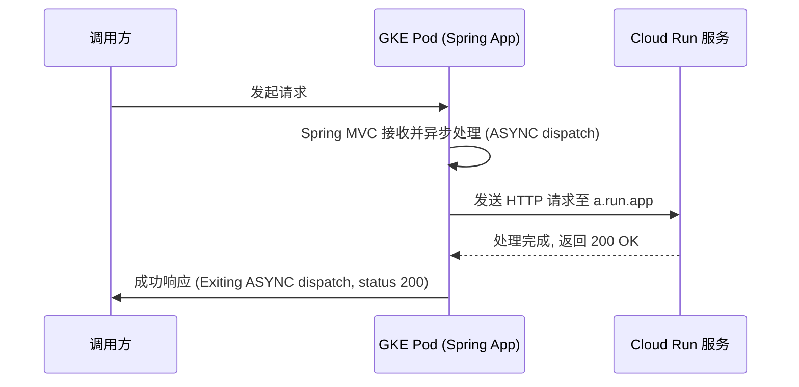
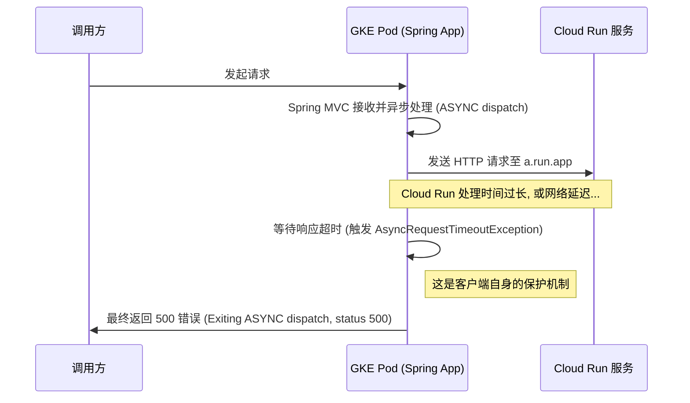

# 诊断 GKE 调用 Cloud Run 时的 AsyncRequestTimeoutException (500)

本文档旨在分析和解决一个典型场景：一个部署在 GKE (Google Kubernetes Engine) 上的 Spring Boot 应用，在调用另一个 Cloud Run 服务时，客户端出现 `org.springframework.web.context.request.async.AsyncRequestTimeoutException` 并最终向上返回 500 状态码的问题。

## 1. 理解工作流程

首先，我们需要理清正常和异常两种情况下的请求处理流程。

### 正常工作流

在一个理想的场景下，请求的生命周期如下：



### 异常工作流 (超时)

根据您提供的日志，实际发生的异常流程如下：



**核心结论**：您在 GKE Pod 中看到的 500 错误，是由 Spring Boot 应用在等待 Cloud Run 响应超时后 **自己生成的**，它是一个客户端侧的错误。问题的根源在于“等待超时”，而非 Cloud Run 主动返回了 500。

## 2. 问题根源分析

导致“等待超时”的根本原因有以下几种可能：

1.  **Cloud Run 服务处理缓慢 (最常见)**
    *   **业务逻辑复杂**：服务内部需要执行耗时的数据库查询、调用其他 API 或进行大量计算。
    *   **冷启动 (Cold Start)**：如果 Cloud Run 服务长时间无请求，实例数会缩容到 0。当新请求到达时，需要花费额外的时间（从几秒到几十秒不等）来启动一个新实例。如果客户端的超时设置得很短，就很容易在冷启动期间超时。
    *   **资源瓶颈**：分配给 Cloud Run 服务的 CPU 或内存不足，导致请求处理速度变慢。

2.  **Cloud Run 服务内部确实出错了**
    *   Cloud Run 服务在处理请求时遇到了未捕获的异常，但它在崩溃或返回 500 错误之前花费了很长时间，超过了 GKE 客户端的等待时间。

3.  **客户端 (GKE Pod) 超时设置过短**
    *   您的 Spring Boot 应用中，MVC 的异步请求超时 (`spring.mvc.async.request-timeout`) 或 HTTP 客户端 (如 `WebClient`, `RestTemplate`) 的读取超时 (`readTimeout`) 设置得太短，无法容忍 Cloud Run 正常的处理时间和网络延迟。

4.  **网络问题**
    *   GKE 和 Cloud Run 之间的网络路径存在延迟或不稳定。例如，VPC Connector 配置不当、防火墙规则限制等。

## 3. 如何 Debug (排查步骤)

请遵循“先服务端，后客户端，再网络”的顺序进行排查。

### 第 1 步：检查 Cloud Run 服务端日志 (最关键)

这是定位问题的首要步骤。您需要确认在 GKE Pod 报超时的那个时间点，Cloud Run 服务正在做什么。

1.  **打开 Google Cloud Console** -> **Cloud Logging** -> **Logs Explorer**。
2.  使用以下查询语句，将 `your-service-name` 替换为您的 Cloud Run 服务名：

    ```gcl
    resource.type="cloud_run_revision"
    resource.labels.service_name="your-service-name"
    ```

3.  **重点关注以下信息**：
    *   **是否存在 5xx 错误？**：查看 `httpRequest.status` 字段是否为 500 或其他 5xx。如果存在，展开日志的 `jsonPayload` 或 `textPayload`，查找详细的错误堆栈信息。
    *   **请求延迟 (Latency) 是多少？**：查看 `httpRequest.latency` 字段。如果这个延迟时间超过了您 GKE 客户端的超时设置，那么问题就找到了。例如，如果延迟是 15s，而客户端超时是 10s，那么超时就是必然的。
    *   **是否存在 "Container Sandbox" 或 "OOM" 日志？**：这些日志表明实例可能因为内存不足而被重启，导致请求处理失败。

### 第 2 步：检查 Cloud Run 服务端指标

在 Cloud Run 服务页面，切换到 **METRICS** 标签页。

*   **请求延迟 (Request Latency)**：查看 P95/P99 延迟，确认是否存在普遍的处理缓慢问题。
*   **实例数 (Instance Count)**：如果在错误发生时，实例数从 0 变为 1，这强烈暗示问题与 **冷启动** 有关。
*   **CPU / 内存利用率**：检查是否存在资源瓶颈。

### 第 3 步：检查并调整 GKE 客户端配置

如果 Cloud Run 端看起来一切正常（没有错误，延迟在可接受范围内），那么就需要检查客户端的配置。

1.  **检查 Spring MVC 异步超时**：
    在 GKE Pod 的 `application.yml` 或 `application.properties` 中检查或增加此配置：

    ```yaml
    # application.yml
    spring:
      mvc:
        async:
          request-timeout: 60000  # 将异步请求超时设置为 60 秒 (单位: 毫秒)
    ```

2.  **检查 HTTP Client 超时**：
    如果您使用 `RestTemplate` 或 `WebClient`，请确保其读取超时 (`readTimeout`) 也足够长。

    **临时性地将这些超时时间调大** (例如 60-120 秒) 是一个非常有效的测试方法。如果调大后问题消失，则证明就是客户端超时设置过短。

### 第 4 步：隔离问题并复现

使用 `curl` 直接从 GKE Pod 内部调用 Cloud Run 服务，以排除 Spring 应用本身带来的复杂性。

```bash
# 1. 进入 GKE Pod
kubectl exec -it <your-gke-pod-name> -- /bin/bash

# 2. 在 Pod 内部使用 curl 调用 (如果需要认证，请先获取 token)
#    -w "..." 用于打印详细的时间分解
curl -w "dns_lookup: %{time_namelookup}, connect: %{time_connect}, appconnect: %{time_appconnect}, pretransfer: %{time_pretransfer}, starttransfer: %{time_starttransfer}, total: %{time_total}\n" \
-H "Authorization: Bearer $(gcloud auth print-identity-token)" \
https://abcd.a.run.app/your-endpoint
```

通过分析 `curl` 的输出，您可以判断时间主要消耗在哪个阶段（DNS 解析、连接、还是等待服务器响应）。

## 4. 解决方案建议

根据排查结果，采取相应措施：

*   **问题：Cloud Run 处理慢**
    *   **方案**：优化 Cloud Run 服务代码，减少耗时操作。如果无法优化，考虑为 Cloud Run 服务 **增加 CPU/内存** 或设置 **最小实例数 (min instances)** 为 1 或更高，以避免冷启动。
*   **问题：Cloud Run 内部报错**
    *   **方案**：根据 Cloud Run 日志中的错误堆栈，修复代码 Bug。
*   **问题：客户端超时太短**
    *   **方案**：评估 Cloud Run 服务的正常 P99 延迟，并据此在 GKE 客户端设置一个合理的、更长的超时时间。
