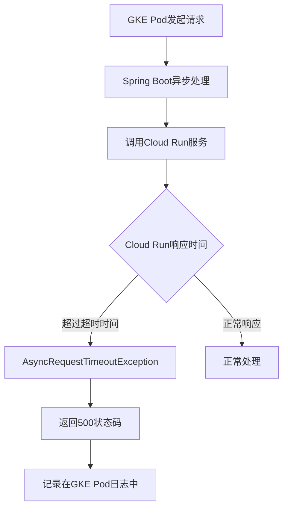
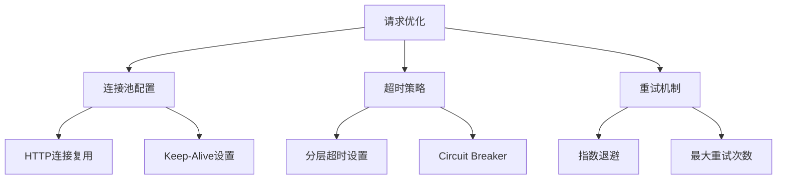
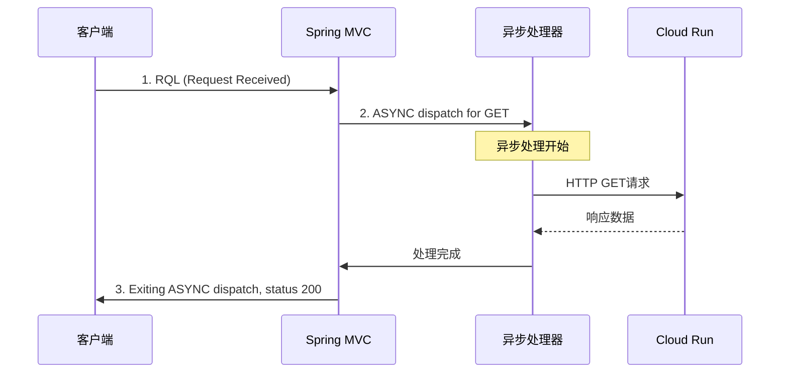
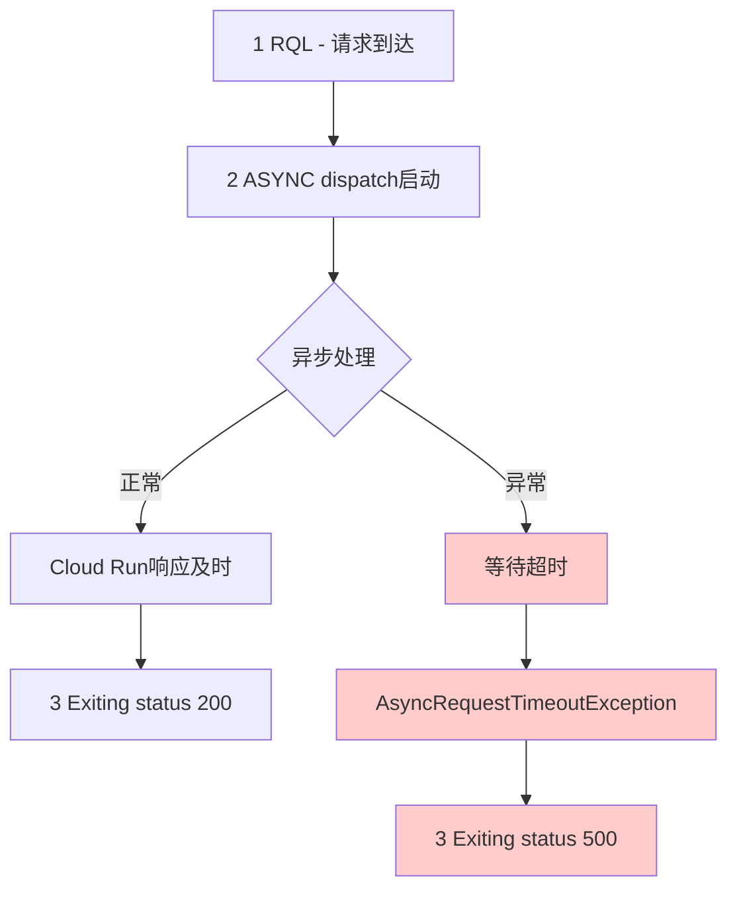
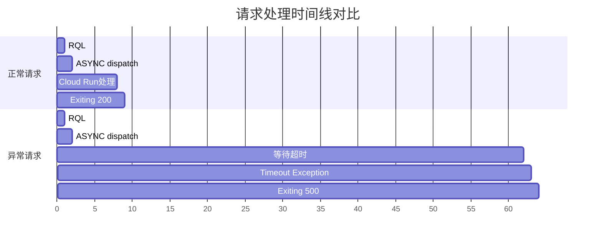

```
关于GCP的Cloud Run 
我们的一个用户的RT是运行在GKE 里面的Pod 现在Pod会发送请求到一个CLoud Run服务.比如地址为https://abcd.a.run.app/
如果目的服务器给我的客户端返回500报错,那么这个500会记录在服务器端么? 
我的这个GKE 的Pod同时有类似日志debug org.springframework.web.servlet.DispatherServlet - Exiting form "ASYNC" dispatch ,status 500 "
也有类似AsyncRequestTimeoutException

关于GCP的Cloud Run 

我们的一个用户的RT是运行在GKE 里面的Pod 现在Pod会发送请求到一个CLoud Run服务.比如地址为https://abcd.a.run.app/

如果目的服务器给我的客户端返回500报错,那么这个500会记录在服务器端么? 

我的这个GKE 的Pod同时有类似日志 帮我分析这个问题 可能的原因 以及如何Debug

"DEBUG": "org.springframework.web.servlet.DispatcherServlet - Exiting from \"ASYNC\" dispatch, status 500"

  

"org.springframework.web.context.request.async.AsyncRequestTimeoutException: null

org.springframework.web.context.request.async.TimeoutDeferredResultProcessingInterceptor.handleTimeout(TimeoutDeferredResultProcessingInterceptor.java:42)

org.springframework.web.context.request.async.DeferredResultInterceptorChain.triggerAfterTimeout(DeferredResultInterceptorChain.java:81)

org.springframework.web.context.request.async.WebAsyncManager.lambda$startDeferredResultProcessing$5(WebAsyncManager.java:434)

java.base/java.util.ArrayList.forEach(Unknown Source)

  

org.springframework.web.context.request.async.StandardServletAsyncWebRequest.onTimeout(StandardServletAsyncWebRequest.java:186)

org.eclipse.jetty.ee10.servlet.ServletChannelState$2.run(ServletChannelState.java:761)

org.eclipse.jetty.server.handler.ContextHandler$ScopedContext.run(ContextHandler.java:1507)

org.eclipse.jetty.server.handler.ContextHandler$ScopedContext.run(ContextHandler.java:1500)

org.eclipse.jetty.ee10.servlet.ServletChannelState.runInContext(ServletChannelState.java:1308)

org.eclipse.jetty.ee10.servlet.ServletChannelState.onTimeout(ServletChannelState.java:780)

org.eclipse.jetty.ee10.servlet.ServletChannel.handle(ServletChannel.java:448)

org.eclipse.jetty.server.handler.ContextHandler$ScopedContext.run(ContextHandler.java:1513)

org.eclipse.jetty.server.handler.ContextHandler$ScopedContext.lambda$execute$0(ContextHandler.java:1530)

org.eclipse.jetty.util.thread.QueuedThreadPool.runJob(QueuedThreadPool.java:979)

org.eclipse.jetty.util.thread.QueuedThreadPool$Runner.doRunJob(QueuedThreadPool.java:1209)

org.eclipse.jetty.util.thread.QueuedThreadPool$Runner.run(QueuedThreadPool.java:1164)

java.base/java.lang.Thread.run(Unknown Source)
```


# Claude
## 问题分析

根据您提供的日志，这是一个典型的**异步请求超时**导致的500错误，而不是Cloud Run服务端返回的500错误。

### 错误原因分析



### 日志分析

|组件|状态|说明|
|---|---|---|
|**Spring Boot**|异步超时|`AsyncRequestTimeoutException`表示异步请求处理超时|
|**Jetty容器**|触发超时处理|`ServletChannelState.onTimeout`被调用|
|**HTTP状态**|500|由客户端（GKE Pod）生成，不是Cloud Run返回|

## 可能原因

1. **网络延迟**：GKE到Cloud Run的网络连接慢
2. **Cloud Run冷启动**：服务实例需要启动时间
3. **Cloud Run处理慢**：目标服务处理请求耗时长
4. **超时配置过短**：Spring Boot异步超时配置不合理
5. **资源限制**：Cloud Run实例资源不足

## Debug方法

### 1. 检查Cloud Run服务日志

```bash
# 查看Cloud Run服务日志
gcloud logging read "resource.type=cloud_run_revision AND resource.labels.service_name=your-service-name" \
  --limit=50 --format="table(timestamp,severity,textPayload)"
```

### 2. 检查网络连通性

```bash
# 在GKE Pod中测试连通性
kubectl exec -it <pod-name> -- curl -w "@curl-format.txt" https://abcd.a.run.app/health

# curl-format.txt内容：
#     time_namelookup:  %{time_namelookup}\n
#        time_connect:  %{time_connect}\n
#     time_appconnect:  %{time_appconnect}\n
#    time_pretransfer:  %{time_pretransfer}\n
#       time_redirect:  %{time_redirect}\n
#  time_starttransfer:  %{time_starttransfer}\n
#                     ----------\n
#          time_total:  %{time_total}\n
```

### 3. 调整Spring Boot配置

```yaml
# application.yml
spring:
  mvc:
    async:
      request-timeout: 60000  # 60秒，根据实际需要调整
```

### 4. 监控Cloud Run性能

```bash
# 查看Cloud Run指标
gcloud monitoring metrics list --filter="metric.type:run.googleapis.com"

# 获取请求延迟数据
gcloud logging read "resource.type=cloud_run_revision" \
  --format="value(httpRequest.latency)" --limit=100
```

### 5. 代码层面优化

```java
@RestController
public class ApiController {
    
    @Autowired
    private WebClient webClient;
    
    @GetMapping("/api/call-cloud-run")
    public DeferredResult<ResponseEntity<String>> callCloudRun() {
        DeferredResult<ResponseEntity<String>> deferredResult = 
            new DeferredResult<>(120000L); // 2分钟超时
            
        webClient.get()
            .uri("https://abcd.a.run.app/")
            .retrieve()
            .toEntity(String.class)
            .timeout(Duration.ofSeconds(90)) // WebClient超时
            .subscribe(
                response -> deferredResult.setResult(response),
                error -> {
                    logger.error("Cloud Run调用失败", error);
                    deferredResult.setErrorResult(
                        ResponseEntity.status(502).body("Service Unavailable")
                    );
                }
            );
            
        return deferredResult;
    }
}
```

## 解决方案

### 短期解决方案

1. **增加超时时间**：调整Spring Boot异步超时配置
2. **添加重试机制**：实现指数退避重试
3. **健康检查**：确保Cloud Run服务正常运行

### 长期优化方案



### WebClient优化配置

```java
@Configuration
public class WebClientConfig {
    
    @Bean
    public WebClient webClient() {
        return WebClient.builder()
            .clientConnector(new ReactorClientHttpConnector(
                HttpClient.create()
                    .option(ChannelOption.CONNECT_TIMEOUT_MILLIS, 10000)
                    .responseTimeout(Duration.ofSeconds(60))
                    .keepAlive(true)
            ))
            .build();
    }
}
```

## 监控建议

|监控项|工具|阈值建议|
|---|---|---|
|**响应时间**|Cloud Monitoring|P95 < 5s|
|**错误率**|Cloud Logging|< 1%|
|**冷启动频率**|Cloud Run Metrics|监控实例启动|
|**并发数**|Cloud Run Console|根据配置监控|

通过以上分析和解决方案，可以有效诊断和解决GKE Pod调用Cloud Run服务的超时问题。


一个正常请求是1 RQL 2 ASYNC dispatch for get 3 exiting from async dispath status 200 根据这个信息你能逆推些什么?

## 逆推分析

根据您提供的正常请求流程信息，可以逆推出以下关键信息：

### 正常流程分析



### 关键逆推信息

|阶段|正常流程|异常流程|推断结果|
|---|---|---|---|
|**1. RQL**|正常记录|应该也有记录|请求成功到达Spring Boot|
|**2. ASYNC dispatch**|`for GET`|可能缺失或异常|异步处理启动成功|
|**3. Exiting**|`status 200`|`status 500`|**关键差异点**|

## 问题定位

### 根据逆推分析，您的500错误发生在：



### 推断的执行路径

**正常情况：**

```
RQL → ASYNC dispatch for GET → [Cloud Run处理] → Exiting ASYNC dispatch, status 200
```

**您的异常情况：**

```
RQL → ASYNC dispatch for GET → [等待超时] → AsyncRequestTimeoutException → Exiting ASYNC dispatch, status 500
```

## 进一步验证方法

### 1. 检查完整日志序列

```bash
# 搜索同一个请求ID的完整日志链路
kubectl logs <pod-name> | grep -A 10 -B 10 "RQL\|ASYNC dispatch\|Exiting"
```

### 2. 验证推断 - 缺失的日志模式

在您的异常case中，应该能看到类似的模式：

```
DEBUG: RQL (Request received)
DEBUG: ASYNC dispatch for GET  
[长时间等待...]
ERROR: AsyncRequestTimeoutException
DEBUG: Exiting from "ASYNC" dispatch, status 500
```

### 3. 时间戳分析



### 4. 代码中的对应关系

基于逆推，您的代码结构应该是：

```java
@RestController
public class YourController {
    
    @GetMapping("/your-endpoint")
    public DeferredResult<ResponseEntity<String>> handleRequest() {
        // 1. RQL - 请求接收日志会在这里
        logger.debug("RQL - Request received");
        
        DeferredResult<ResponseEntity<String>> deferredResult = new DeferredResult<>();
        
        // 2. ASYNC dispatch for GET - 异步处理开始
        logger.debug("ASYNC dispatch for GET");
        
        // 异步调用Cloud Run
        asyncService.callCloudRun()
            .subscribe(
                response -> {
                    // 正常情况：这里会执行
                    deferredResult.setResult(ResponseEntity.ok(response));
                    // 3. Exiting ASYNC dispatch, status 200
                },
                error -> {
                    // 超时情况：这里不会执行，而是触发timeout handler
                    deferredResult.setErrorResult(ResponseEntity.status(500).build());
                }
            );
            
        // 超时处理器会触发 AsyncRequestTimeoutException
        // 最终导致: Exiting ASYNC dispatch, status 500
        
        return deferredResult;
    }
}
```

## 关键发现

1. **请求确实到达了您的服务**（有RQL日志）
2. **异步处理正常启动**（有ASYNC dispatch日志）
3. **问题出现在等待Cloud Run响应阶段**
4. **超时机制正常工作**（返回了500而不是hang住）

## 下一步调试建议

```bash
# 1. 确认是否有RQL和ASYNC dispatch日志
kubectl logs <pod> | grep -E "(RQL|ASYNC dispatch)" -A 5 -B 5

# 2. 检查时间间隔
kubectl logs <pod> --timestamps=true | grep "ASYNC\|Exiting"

# 3. 验证Cloud Run端是否收到请求
gcloud logging read "resource.type=cloud_run_revision" --limit=10
```

通过这个逆推分析，基本可以确定问题是**网络延迟或Cloud Run服务响应慢**导致的超时，而不是服务端主动返回500。

# Gemini

好的，我们来分析一下您遇到的这个问题。

这是一个非常典型的微服务通信中遇到的问题，涉及到 GKE (Google Kubernetes Engine) 和 Cloud Run 之间的调用。下面我将为您详细解答，分析问题原因并提供调试步骤。

### 核心问题解答：500 错误会记录在服务器端（Cloud Run）吗？

**答案是：会。**

当您的 Cloud Run 服务 (`https://abcd.a.run.app/`) 返回 500 错误时，这个错误 **会** 被记录在 Cloud Run 的服务端日志中。

- **Cloud Run 自动集成 Cloud Logging**：所有部署在 Cloud Run 上的服务，其标准输出（`stdout`）和标准错误（`stderr`）以及请求日志都会被自动收集到 Google Cloud's operations suite (以前叫 Stackdriver) 的 Cloud Logging 中。
    
- **记录内容**：对于每一个请求，Cloud Run 都会生成一条请求日志（Request Log）。如果您的服务代码在处理请求时遇到内部错误并导致了 500 Internal Server Error，这条请求日志的状态码（`status`）字段就会被标记为 500。此外，如果您在代码中打印了错误堆栈信息（stack trace），这些信息也会作为应用日志（Application Log）被记录下来。
    

因此，排查问题的第一步，就应该是去查看 Cloud Run 服务的日志。

---

### 日志分析：GKE Pod 中的 `AsyncRequestTimeoutException`

您在 GKE Pod 中看到的日志是客户端（请求发起方）的错误日志。我们来逐层分析这个日志揭示的信息。

```
"DEBUG": "org.springframework.web.servlet.DispatcherServlet - Exiting from \"ASYNC\" dispatch, status 500"
"org.springframework.web.context.request.async.AsyncRequestTimeoutException: null
```

- **`Exiting from "ASYNC" dispatch, status 500`**: 这条日志说明 Spring 的 `DispatcherServlet` 正在结束一个异步（ASYNC）请求的处理，并最终返回了 500 状态码。这通常是下游错误传递到上游的结果。
    
- **`AsyncRequestTimeoutException`**: 这是问题的关键。这个异常表明，您的 GKE Pod 中的 Spring 应用发起了一个异步请求，但是在预设的超时时间内没有收到来自目标服务器（也就是您的 Cloud Run 服务）的响应。
    

**简单来说，GKE Pod 发送请求到 Cloud Run，但是 Cloud Run “太久”没有回复，导致 GKE Pod 这边的请求超时了。**

### 可能的原因分析

综合客户端（GKE）的超时日志和服务端（Cloud Run）可能存在的 500 错误，我们可以推断出以下几种主要可能性：

1. **Cloud Run 服务真的出错了 (最常见)**
    
    - **代码 Bug**：Cloud Run 服务在处理这个特定请求时，内部逻辑出现 Bug，抛出了未捕获的异常，导致返回 500 错误。
        
    - **资源问题**：Cloud Run 实例可能因为内存不足（OOM, Out of Memory）或其他资源限制而被强制终止和重启，导致请求处理失败。
        
    - **启动时间过长 (冷启动)**：如果 Cloud Run 服务有一段时间没有被调用，它可能会缩容到 0。此时新的请求进来，需要启动一个新的实例（冷启动）。如果您的服务启动过程比较慢，并且 GKE 客户端的超时设置得很短，就可能在服务完全启动并处理请求之前，客户端已经超时了。
        
2. **Cloud Run 服务处理时间过长，导致 GKE 客户端超时**
    
    - 您的 Cloud Run 服务本身没有报错，但是处理该请求的业务逻辑非常耗时（例如，复杂的数据库查询、调用其他慢速的第三方 API 等）。
        
    - 这个处理时间超过了您 GKE Pod 中 `RestTemplate`、`WebClient` 或其他 HTTP 客户端配置的请求超时时间，从而在客户端侧触发了 `AsyncRequestTimeoutException`。
        
3. **网络问题或配置错误**
    
    - **VPC 网络配置**：如果您的 GKE 和 Cloud Run 都配置在 VPC 网络中，并设置了 VPC Connector，可能存在防火墙规则、路由或 Connector 配置不当的问题，导致请求在网络层面被延迟或丢弃。
        
    - **IAM 权限问题**：如果您的 Cloud Run 服务设置了需要认证（Authentication），而 GKE Pod 的服务账号（Service Account）没有对应的 `Cloud Run Invoker` 权限，请求会被拒绝，但这通常返回 401/403 错误，而不是 500。不过，在复杂的调用链中，一个 4xx 错误有时也可能被上游错误地包装成 500。
        

---

### 如何 Debug：一步步排查问题

请按照以下步骤进行排查，这能最高效地定位问题根源。

#### 第 1 步：检查 Cloud Run 的日志

这是最重要的一步。

1. **进入 Google Cloud Console**。
    
2. 导航到 **Cloud Run**。
    
3. 点击您的服务（例如 `abcd`）。
    
4. 选择 **"日志" (LOGS)** 标签页。
    
5. **筛选时间范围**：将时间范围调整到您 GKE Pod 报出超时错误的时间点附近。
    
6. **查看日志条目**：
    
    - 寻找 `httpRequest.status` 为 `5xx` 的日志。
        
    - 点击展开这些日志条目，查看其内部的 `jsonPayload` 或 `textPayload`。这里通常会包含您的应用程序打印的详细错误堆栈（stack trace），直接告诉您是什么原因导致了 500 错误。
        
    - 如果没有找到 500 错误，但看到了处理时间（`latency`）非常长的请求日志，那么就可能是原因 2（处理超时）。
        

#### 第 2 步：检查 Cloud Run 的指标 (Metrics)

1. 在您的 Cloud Run 服务页面，选择 **"指标" (METRICS)** 标签页。
    
2. **查看 "请求延迟" (Request latency)**：确认请求的处理时间是否普遍很长，或者在特定时间点有尖峰。
    
3. **查看 "容器 CPU 利用率" (Container CPU utilization) 和 "容器内存利用率" (Container memory utilization)**：检查服务是否遇到了资源瓶颈。如果内存使用率接近 100%，很可能发生了 OOM。
    
4. **查看 "实例数" (Instance count)**：结合请求量查看实例扩容情况。如果在错误发生时实例数从 0 开始增加，可以重点怀疑是冷启动问题。
    

#### 第 3 步：在 GKE 客户端增加和审视配置

1. **增加日志**：在 GKE Pod 发起请求的代码处，增加更详细的日志。在发起请求前打印 `log.info("Sending request to Cloud Run...")`，在收到响应或捕获到异常后打印 `log.info("Received response from Cloud Run")` 或 `log.error("Error calling Cloud Run", e)`。这能帮助您精确计算出请求的耗时。
    
2. **检查并调整超时设置**：
    
    - 检查您的 Spring 应用中 HTTP 客户端（如 `RestTemplate` 或 `WebClient`）的连接超时（`connectTimeout`）和读取超时（`readTimeout`）。
        
    - 同时，检查 Spring MVC 的异步请求超时配置。在 `application.properties` 或 `application.yml` 中，可以设置：
        
        YAML
        
        ```
        spring:
          mvc:
            async:
              request-timeout: 30000 # 设置为 30 秒 (单位: 毫秒)
        ```
        
    - 尝试**临时性地调大**这些超时时间，看看问题是否消失。如果调大后问题消失，那就证明是 Cloud Run 处理慢导致了客户端超时。
        

#### 第 4 步：主动触发和复现问题

1. **使用 `curl` 或 Postman**：直接从您的本地机器或者 GKE Pod 内部（使用 `kubectl exec`）发送相同的请求到 Cloud Run 地址，看看是否能稳定复现 500 错误。
    
    Bash
    
    ```
    # 在能访问公网的环境中
    curl -H "Authorization: Bearer $(gcloud auth print-identity-token)" https://abcd.a.run.app/your-endpoint
    ```
    
    _注意：如果您的 Cloud Run 需要认证，需要带上认证头。_
    
2. **检查请求内容**：确认 GKE Pod 发送的请求体（Request Body）、请求头（Headers）和参数是否符合 Cloud Run 服务的预期。一个格式错误的请求也可能导致服务端无法解析而报错。
    

### 总结

您 GKE Pod 中的 `AsyncRequestTimeoutException` 是一个**果**，而不是**因**。根本原因很大概率出在 Cloud Run 服务端。

**行动路线图：**

1. **立即去查 Cloud Run 的日志**，寻找与错误时间点匹配的 `status: 500` 的请求日志和相关的应用错误堆栈。这是定位问题的最快路径。
    
2. 如果日志显示是**处理超时**而非直接报错，检查 Cloud Run 代码逻辑，优化耗时操作。
    
3. 如果日志显示是**代码异常**，根据错误堆栈修复 Bug。
    
4. 如果 Cloud Run 日志**没有任何异常**，那么就需要回头检查 GKE 客户端的超时配置是否过短，以及检查 GKE 与 Cloud Run 之间的网络链路。
    

希望这个详细的分析和排查步骤能帮助您快速解决问题！

# ChatGPT  

好的，我们来拆解这个问题。

---

## **1. 问题分析**

  

你的架构是：

```
GKE Pod (Spring Boot 应用) -> 请求 -> Cloud Run 服务 (https://abcd.a.run.app)
```

日志中关键点：

- status 500 出现在 **客户端（GKE Pod）** 的 Spring Boot 日志里。
    
- 报错栈是 **AsyncRequestTimeoutException**，这是 Spring MVC 的 **异步请求超时**，意味着 **客户端等待结果超时**，并不是直接说明 Cloud Run 返回了 500。
    
- DispatcherServlet - Exiting from "ASYNC" dispatch, status 500 → Spring 在超时时候默认返回 **500 Internal Server Error**。
    

  

也就是说：

这个 500 很可能是 **你自己的 GKE Pod（客户端/网关）返回给调用者的 500**，并不一定是 Cloud Run 真正返回了 500。

---

## **2. 可能原因**

1. **Cloud Run 响应超时**
    
    - Cloud Run 默认请求超时：**5 分钟（可配置）**。
        
    - 如果 Cloud Run 没有在超时时间内返回，客户端会挂起，最后 Spring Async 机制抛出超时异常，返回 500。
        
    
2. **客户端超时更小**
    
    - 你的 Spring Boot 应用（GKE Pod）内部设置的超时（如 AsyncRequestTimeout 或 RestTemplate/WebClient 超时）比 Cloud Run 更短。
        
    - 结果是：客户端先超时 -> 返回 500，Cloud Run 其实还在处理。
        
    
3. **Cloud Run 真正返回了 500**
    
    - 如果 Cloud Run 内部报错（未捕获异常、500 错误响应），那么 Cloud Run 日志会记录 500。
        
    - 这时 GKE Pod 的日志也会显示 500，但原因不同。
        
    

---

## **3. 如何 Debug**

  

你需要同时看 **客户端（GKE Pod）日志** 和 **服务端（Cloud Run）日志**：

  

### **Step 1: 确认 Cloud Run 是否真的返回了 500**

  

在 Cloud Run 中查看日志（Cloud Logging）：

```
gcloud logging read \
  'resource.type="cloud_run_revision" \
   resource.labels.service_name="your-cloud-run-service" \
   severity>=ERROR' \
 
```