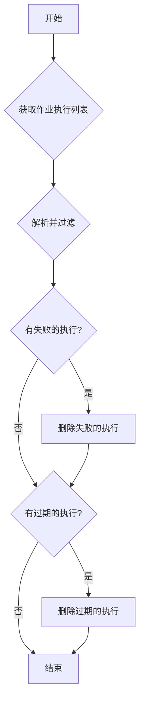

# Cloud Run Job Housekeeping

本文档提供了一个脚本和指南，用于清理 Google Cloud Run 作业的多余或失败的执行 (Executions)。这对于保持环境整洁、降低混乱和潜在的成本至关重要。

## 核心需求

- **删除失败的执行**: 自动识别并删除所有状态为失败的作业执行。
- **删除过期的执行**: 根据指定的时间点，删除在此之前完成的所有执行。
- **灵活性**: 脚本应支持通过参数指定目标作业和区域。

## 设计思路与流程

清理流程可以通过以下步骤实现：

1.  **列出执行**: 使用 `gcloud` CLI 列出指定作业的所有执行，并以 JSON 格式输出。
2.  **解析与过滤**: 利用 `jq` 工具解析 JSON 输出，根据预设条件（如状态、时间）进行过滤。
3.  **执行删除**: 对过滤后的结果执行删除操作。

### 可视化流程 (Mermaid)



## Housekeeping 脚本

这是一个示例脚本，您可以根据自己的需求进行修改和扩展。

```bash
#!/bin/bash

# 脚本用途: 清理 Cloud Run 作业的执行 (Executions)
#
# 使用方法:
# ./housekeep.sh <JOB_NAME> <REGION> [DELETE_FAILED] [DELETE_OLDER_THAN_DAYS]
#
# 示例:
#   - 删除所有失败的执行:
#     ./housekeep.sh my-job europe-west2 true
#
#   - 删除30天前完成的执行:
#     ./housekeep.sh my-job europe-west2 false 30
#
#   - 删除所有失败的执行 和 30天前完成的执行:
#     ./housekeep.sh my-job europe-west2 true 30

# --- 参数配置 ---
JOB_NAME="$1"
REGION="$2"
DELETE_FAILED=${3:-false} # 是否删除失败的执行 (true/false)
DELETE_OLDER_THAN_DAYS="$4" # 删除多少天前的执行 (例如: 30)

# --- 安全检查 ---
if [ -z "$JOB_NAME" ] || [ -z "$REGION" ]; then
  echo "错误: 必须提供 JOB_NAME 和 REGION."
  echo "用法: $0 <JOB_NAME> <REGION> [DELETE_FAILED] [DELETE_OLDER_THAN_DAYS]"
  exit 1
fi

echo "配置信息:"
echo "  - Job Name: $JOB_NAME"
echo "  - Region: $REGION"
echo "  - 删除失败的执行: $DELETE_FAILED"
if [ -n "$DELETE_OLDER_THAN_DAYS" ]; then
  echo "  - 删除天数早于: $DELETE_OLDER_THAN_DAYS 天"
fi
echo "---"

# --- 获取执行列表 ---
echo "正在获取 '$JOB_NAME' 的执行列表..."
EXECUTIONS_JSON=$(gcloud run jobs executions list --job="$JOB_NAME" --region="$REGION" --format="json")

if [ -z "$EXECUTIONS_JSON" ]; then
  echo "未找到任何执行，或获取时出错。"
  exit 0
fi

# --- 1. 删除失败的执行 ---
if [ "$DELETE_FAILED" = true ]; then
  echo "正在查找失败的执行..."
  FAILED_EXECUTIONS=$(echo "$EXECUTIONS_JSON" | jq -r '.[] | select(.status.failedCount > 0) | .metadata.name')

  if [ -n "$FAILED_EXECUTIONS" ]; then
    echo "找到以下失败的执行，将进行删除:"
    echo "$FAILED_EXECUTIONS"
    echo "$FAILED_EXECUTIONS" | while read -r EXECUTION_NAME; do
      echo "  -> 正在删除 $EXECUTION_NAME..."
      gcloud run jobs executions delete "$EXECUTION_NAME" --region="$REGION" --quiet
    done
  else
    echo "没有找到失败的执行。"
  fi
fi

# --- 2. 删除过期的执行 ---
if [ -n "$DELETE_OLDER_THAN_DAYS" ]; then
  echo "正在查找 $DELETE_OLDER_THAN_DAYS 天前完成的执行..."
  # 计算截止日期 (ISO 8601 格式)
  CUTOFF_DATE=$(date -v-"$DELETE_OLDER_THAN_DAYS"d -u +"%Y-%m-%dT%H:%M:%SZ")
  echo "截止日期: $CUTOFF_DATE"

  OLDER_EXECUTIONS=$(echo "$EXECUTIONS_JSON" | jq -r --arg CUTOFF_DATE "$CUTOFF_DATE" '.[] | select(.status.completionTime and .status.completionTime < $CUTOFF_DATE) | .metadata.name')

  if [ -n "$OLDER_EXECUTIONS" ]; then
    echo "找到以下过期的执行，将进行删除:"
    echo "$OLDER_EXECUTIONS"
    echo "$OLDER_EXECUTIONS" | while read -r EXECUTION_NAME; do
      echo "  -> 正在删除 $EXECUTION_NAME..."
      gcloud run jobs executions delete "$EXECUTION_NAME" --region="$REGION" --quiet
    done
  else
    echo "没有找到符合条件的过期执行。"
  fi
fi

echo "---"
echo "Housekeeping 完成。"

```

### 如何使用脚本

1.  **保存脚本**: 将上面的代码保存到一个名为 `cloud-run-job-housekeep.sh` 的文件中。
2.  **授予执行权限**: 在终端中运行 `chmod +x cloud-run-job-housekeep.sh`。
3.  **运行脚本**:
    - **仅删除失败的执行**:
      ```bash
      ./cloud-run-job-housekeep.sh your-job-name your-region true
      ```
    - **仅删除 30 天前的执行**:
      ```bash
      ./cloud-run-job-housekeep.sh your-job-name your-region false 30
      ```
    - **同时删除失败和 30 天前的执行**:
      ```bash
      ./cloud-run-job-housekeep.sh your-job-name your-region true 30
      ```

## `jq` 命令解析

脚本的核心是 `jq` 查询，这里是关键部分的解释：

- **查找失败的执行**:

  ```jq
  jq -r '.[] | select(.status.failedCount > 0) | .metadata.name'
  ```

  - `.[]`: 遍历 JSON 数组中的每个执行对象。
  - `select(.status.failedCount > 0)`: 选择 `status` 对象中 `failedCount` 大于 0 的执行。
  - `.metadata.name`: 提取该执行的名称。

- **查找过期的执行**:
  ```jq
  jq -r --arg CUTOFF_DATE "$CUTOFF_DATE" '.[] | select(.status.completionTime and .status.completionTime < $CUTOFF_DATE) | .metadata.name'
  ```
  - `--arg CUTOFF_DATE "$CUTOFF_DATE"`: 将 shell 变量 `$CUTOFF_DATE` 传递给 `jq`。
  - `select(.status.completionTime and .status.completionTime < $CUTOFF_DATE)`: 选择那些 `completionTime` 存在且早于我们计算的截止日期的执行。
# Claude


通过这种方式，您可以轻松地扩展脚本以支持更复杂的清理逻辑。

## 增强版 Housekeep 脚本

以下是一个功能更完整的 housekeep 脚本，包含了更多的功能和错误处理：

```bash
#!/bin/bash

# =============================================================================
# Cloud Run Job Housekeeping Script (Enhanced Version)
# =============================================================================
#
# 功能:
# - 删除失败的执行
# - 删除过期的执行
# - 支持批量处理多个作业
# - 支持干运行模式
# - 详细的日志记录
# - 错误处理和重试机制
# - 统计报告
#
# 作者: DevOps Team
# 版本: 2.0
# 更新时间: $(date +"%Y-%m-%d")
#
# =============================================================================

set -euo pipefail

# --- 颜色定义 ---
RED='\033[0;31m'
GREEN='\033[0;32m'
YELLOW='\033[1;33m'
BLUE='\033[0;34m'
NC='\033[0m' # No Color

# --- 全局变量 ---
SCRIPT_NAME=$(basename "$0")
LOG_FILE="/tmp/cloud-run-housekeep-$(date +%Y%m%d-%H%M%S).log"
DRY_RUN=false
VERBOSE=false
BATCH_MODE=false
CONFIG_FILE=""
DELETED_COUNT=0
FAILED_COUNT=0
SKIPPED_COUNT=0

# --- 日志函数 ---
log() {
    local level="$1"
    shift
    local message="$*"
    local timestamp=$(date '+%Y-%m-%d %H:%M:%S')

    case $level in
        "INFO")
            echo -e "${GREEN}[INFO]${NC} $message" | tee -a "$LOG_FILE"
            ;;
        "WARN")
            echo -e "${YELLOW}[WARN]${NC} $message" | tee -a "$LOG_FILE"
            ;;
        "ERROR")
            echo -e "${RED}[ERROR]${NC} $message" | tee -a "$LOG_FILE"
            ;;
        "DEBUG")
            if [ "$VERBOSE" = true ]; then
                echo -e "${BLUE}[DEBUG]${NC} $message" | tee -a "$LOG_FILE"
            fi
            ;;
    esac

    echo "[$timestamp] [$level] $message" >> "$LOG_FILE"
}

# --- 帮助信息 ---
show_help() {
    cat << EOF
$SCRIPT_NAME - Cloud Run Job Housekeeping Script

用法:
    $SCRIPT_NAME [选项] <JOB_NAME> <REGION>
    $SCRIPT_NAME [选项] --batch --config <CONFIG_FILE>

选项:
    -h, --help              显示此帮助信息
    -d, --dry-run           干运行模式，不实际删除
    -v, --verbose           详细输出
    -f, --delete-failed     删除失败的执行
    -o, --older-than DAYS   删除指定天数前的执行
    -b, --batch             批量模式
    -c, --config FILE       配置文件路径
    -l, --log-file FILE     指定日志文件路径
    -r, --retry COUNT       重试次数 (默认: 3)

示例:
    # 删除失败的执行
    $SCRIPT_NAME -f my-job europe-west2

    # 删除30天前的执行 (干运行)
    $SCRIPT_NAME -d -o 30 my-job europe-west2

    # 批量处理
    $SCRIPT_NAME -b -c jobs.conf

    # 完整清理
    $SCRIPT_NAME -f -o 7 -v my-job europe-west2

配置文件格式 (jobs.conf):
    # 格式: JOB_NAME,REGION,DELETE_FAILED,OLDER_THAN_DAYS
    my-job-1,europe-west2,true,30
    my-job-2,us-central1,false,7
    my-job-3,asia-northeast1,true,14

EOF
}

# --- 参数解析 ---
parse_arguments() {
    local delete_failed=false
    local older_than_days=""
    local retry_count=3

    while [[ $# -gt 0 ]]; do
        case $1 in
            -h|--help)
                show_help
                exit 0
                ;;
            -d|--dry-run)
                DRY_RUN=true
                shift
                ;;
            -v|--verbose)
                VERBOSE=true
                shift
                ;;
            -f|--delete-failed)
                delete_failed=true
                shift
                ;;
            -o|--older-than)
                older_than_days="$2"
                shift 2
                ;;
            -b|--batch)
                BATCH_MODE=true
                shift
                ;;
            -c|--config)
                CONFIG_FILE="$2"
                shift 2
                ;;
            -l|--log-file)
                LOG_FILE="$2"
                shift 2
                ;;
            -r|--retry)
                retry_count="$2"
                shift 2
                ;;
            -*)
                log "ERROR" "未知选项: $1"
                show_help
                exit 1
                ;;
            *)
                if [ "$BATCH_MODE" = false ]; then
                    if [ -z "${JOB_NAME:-}" ]; then
                        JOB_NAME="$1"
                    elif [ -z "${REGION:-}" ]; then
                        REGION="$1"
                    else
                        log "ERROR" "过多的参数: $1"
                        exit 1
                    fi
                fi
                shift
                ;;
        esac
    done

    # 导出变量供其他函数使用
    export DELETE_FAILED="$delete_failed"
    export OLDER_THAN_DAYS="$older_than_days"
    export RETRY_COUNT="$retry_count"
}

# --- 验证依赖 ---
check_dependencies() {
    local deps=("gcloud" "jq" "date")

    for dep in "${deps[@]}"; do
        if ! command -v "$dep" &> /dev/null; then
            log "ERROR" "依赖 '$dep' 未找到，请先安装"
            exit 1
        fi
    done

    # 检查 gcloud 认证
    if ! gcloud auth list --filter=status:ACTIVE --format="value(account)" | head -n1 &> /dev/null; then
        log "ERROR" "gcloud 未认证，请先运行 'gcloud auth login'"
        exit 1
    fi

    log "DEBUG" "所有依赖检查通过"
}

# --- 重试机制 ---
retry_command() {
    local max_attempts="$1"
    local delay="$2"
    shift 2
    local command=("$@")

    local attempt=1
    while [ $attempt -le $max_attempts ]; do
        log "DEBUG" "尝试执行命令 (第 $attempt 次): ${command[*]}"

        if "${command[@]}"; then
            return 0
        else
            local exit_code=$?
            log "WARN" "命令执行失败 (第 $attempt 次)，退出码: $exit_code"

            if [ $attempt -lt $max_attempts ]; then
                log "INFO" "等待 $delay 秒后重试..."
                sleep "$delay"
            fi

            ((attempt++))
        fi
    done

    log "ERROR" "命令在 $max_attempts 次尝试后仍然失败"
    return 1
}

# --- 获取执行列表 ---
get_executions() {
    local job_name="$1"
    local region="$2"

    log "DEBUG" "获取作业 '$job_name' 在区域 '$region' 的执行列表"

    local executions_json
    if ! executions_json=$(retry_command "$RETRY_COUNT" 2 gcloud run jobs executions list \
        --job="$job_name" \
        --region="$region" \
        --format="json" 2>/dev/null); then
        log "ERROR" "无法获取作业 '$job_name' 的执行列表"
        return 1
    fi

    if [ "$executions_json" = "[]" ] || [ -z "$executions_json" ]; then
        log "INFO" "作业 '$job_name' 没有找到任何执行"
        return 1
    fi

    echo "$executions_json"
}

# --- 删除失败的执行 ---
delete_failed_executions() {
    local job_name="$1"
    local region="$2"
    local executions_json="$3"

    log "INFO" "查找作业 '$job_name' 的失败执行..."

    local failed_executions
    failed_executions=$(echo "$executions_json" | jq -r '
        .[] |
        select(
            (.status.conditions[]? | select(.type == "Completed" and .status == "False")) or
            (.status.failedCount? and .status.failedCount > 0)
        ) |
        .metadata.name
    ')

    if [ -z "$failed_executions" ]; then
        log "INFO" "没有找到失败的执行"
        return 0
    fi

    local count=0
    while IFS= read -r execution_name; do
        [ -z "$execution_name" ] && continue

        log "INFO" "处理失败的执行: $execution_name"

        if [ "$DRY_RUN" = true ]; then
            log "INFO" "[DRY RUN] 将删除失败的执行: $execution_name"
            ((SKIPPED_COUNT++))
        else
            if retry_command "$RETRY_COUNT" 2 gcloud run jobs executions delete \
                "$execution_name" --region="$region" --quiet; then
                log "INFO" "成功删除失败的执行: $execution_name"
                ((DELETED_COUNT++))
            else
                log "ERROR" "删除失败的执行失败: $execution_name"
                ((FAILED_COUNT++))
            fi
        fi
        ((count++))
    done <<< "$failed_executions"

    log "INFO" "处理了 $count 个失败的执行"
}

# --- 删除过期的执行 ---
delete_older_executions() {
    local job_name="$1"
    local region="$2"
    local executions_json="$3"
    local days="$4"

    log "INFO" "查找作业 '$job_name' 中 $days 天前的执行..."

    # 计算截止日期
    local cutoff_date
    if command -v gdate &> /dev/null; then
        # macOS with GNU date
        cutoff_date=$(gdate -d "$days days ago" -u +"%Y-%m-%dT%H:%M:%SZ")
    else
        # Linux date
        cutoff_date=$(date -d "$days days ago" -u +"%Y-%m-%dT%H:%M:%SZ" 2>/dev/null || \
                     date -v-"$days"d -u +"%Y-%m-%dT%H:%M:%SZ" 2>/dev/null)
    fi

    if [ -z "$cutoff_date" ]; then
        log "ERROR" "无法计算截止日期"
        return 1
    fi

    log "DEBUG" "截止日期: $cutoff_date"

    local older_executions
    older_executions=$(echo "$executions_json" | jq -r --arg CUTOFF_DATE "$cutoff_date" '
        .[] |
        select(
            .status.completionTime and
            .status.completionTime < $CUTOFF_DATE and
            (.status.conditions[]? | select(.type == "Completed" and .status == "True"))
        ) |
        .metadata.name
    ')

    if [ -z "$older_executions" ]; then
        log "INFO" "没有找到 $days 天前的执行"
        return 0
    fi

    local count=0
    while IFS= read -r execution_name; do
        [ -z "$execution_name" ] && continue

        log "INFO" "处理过期的执行: $execution_name"

        if [ "$DRY_RUN" = true ]; then
            log "INFO" "[DRY RUN] 将删除过期的执行: $execution_name"
            ((SKIPPED_COUNT++))
        else
            if retry_command "$RETRY_COUNT" 2 gcloud run jobs executions delete \
                "$execution_name" --region="$region" --quiet; then
                log "INFO" "成功删除过期的执行: $execution_name"
                ((DELETED_COUNT++))
            else
                log "ERROR" "删除过期的执行失败: $execution_name"
                ((FAILED_COUNT++))
            fi
        fi
        ((count++))
    done <<< "$older_executions"

    log "INFO" "处理了 $count 个过期的执行"
}

# --- 处理单个作业 ---
process_job() {
    local job_name="$1"
    local region="$2"
    local delete_failed="$3"
    local older_than_days="$4"

    log "INFO" "开始处理作业: $job_name (区域: $region)"

    # 验证作业是否存在
    if ! gcloud run jobs describe "$job_name" --region="$region" &>/dev/null; then
        log "ERROR" "作业 '$job_name' 在区域 '$region' 中不存在"
        ((FAILED_COUNT++))
        return 1
    fi

    # 获取执行列表
    local executions_json
    if ! executions_json=$(get_executions "$job_name" "$region"); then
        log "WARN" "跳过作业 '$job_name'"
        ((SKIPPED_COUNT++))
        return 0
    fi

    # 删除失败的执行
    if [ "$delete_failed" = true ]; then
        delete_failed_executions "$job_name" "$region" "$executions_json"
    fi

    # 删除过期的执行
    if [ -n "$older_than_days" ]; then
        delete_older_executions "$job_name" "$region" "$executions_json" "$older_than_days"
    fi

    log "INFO" "完成处理作业: $job_name"
}

# --- 批量处理 ---
process_batch() {
    local config_file="$1"

    if [ ! -f "$config_file" ]; then
        log "ERROR" "配置文件不存在: $config_file"
        exit 1
    fi

    log "INFO" "开始批量处理，配置文件: $config_file"

    local line_number=0
    while IFS=',' read -r job_name region delete_failed older_than_days || [ -n "$job_name" ]; do
        ((line_number++))

        # 跳过空行和注释
        if [[ -z "$job_name" || "$job_name" =~ ^[[:space:]]*# ]]; then
            continue
        fi

        # 清理空格
        job_name=$(echo "$job_name" | xargs)
        region=$(echo "$region" | xargs)
        delete_failed=$(echo "$delete_failed" | xargs)
        older_than_days=$(echo "$older_than_days" | xargs)

        log "INFO" "处理配置行 $line_number: $job_name,$region,$delete_failed,$older_than_days"

        # 验证参数
        if [ -z "$job_name" ] || [ -z "$region" ]; then
            log "ERROR" "配置文件第 $line_number 行格式错误"
            ((FAILED_COUNT++))
            continue
        fi

        # 处理作业
        process_job "$job_name" "$region" "$delete_failed" "$older_than_days"

    done < "$config_file"
}

# --- 生成报告 ---
generate_report() {
    log "INFO" "==================== 清理报告 ===================="
    log "INFO" "执行时间: $(date)"
    log "INFO" "日志文件: $LOG_FILE"
    log "INFO" "干运行模式: $DRY_RUN"
    log "INFO" ""
    log "INFO" "统计信息:"
    log "INFO" "  - 成功删除: $DELETED_COUNT"
    log "INFO" "  - 跳过处理: $SKIPPED_COUNT"
    log "INFO" "  - 处理失败: $FAILED_COUNT"
    log "INFO" "=================================================="

    if [ $FAILED_COUNT -gt 0 ]; then
        log "WARN" "存在处理失败的项目，请检查日志文件: $LOG_FILE"
        return 1
    fi

    return 0
}

# --- 清理函数 ---
cleanup() {
    local exit_code=$?

    if [ $exit_code -ne 0 ]; then
        log "ERROR" "脚本异常退出，退出码: $exit_code"
    fi

    generate_report

    if [ "$VERBOSE" = true ]; then
        log "INFO" "详细日志已保存到: $LOG_FILE"
    fi

    exit $exit_code
}

# --- 主函数 ---
main() {
    # 设置信号处理
    trap cleanup EXIT INT TERM

    log "INFO" "开始 Cloud Run Job Housekeeping"
    log "INFO" "脚本版本: 2.0"
    log "INFO" "日志文件: $LOG_FILE"

    # 检查依赖
    check_dependencies

    # 解析参数
    parse_arguments "$@"

    # 验证参数
    if [ "$BATCH_MODE" = true ]; then
        if [ -z "$CONFIG_FILE" ]; then
            log "ERROR" "批量模式需要指定配置文件"
            show_help
            exit 1
        fi
        process_batch "$CONFIG_FILE"
    else
        if [ -z "${JOB_NAME:-}" ] || [ -z "${REGION:-}" ]; then
            log "ERROR" "必须提供 JOB_NAME 和 REGION"
            show_help
            exit 1
        fi

        if [ "$DELETE_FAILED" = false ] && [ -z "$OLDER_THAN_DAYS" ]; then
            log "ERROR" "必须指定至少一个清理选项 (-f 或 -o)"
            show_help
            exit 1
        fi

        process_job "$JOB_NAME" "$REGION" "$DELETE_FAILED" "$OLDER_THAN_DAYS"
    fi

    log "INFO" "Housekeeping 完成"
}

# --- 脚本入口 ---
if [[ "${BASH_SOURCE[0]}" == "${0}" ]]; then
    main "$@"
fi
```

## 配置文件示例

创建一个名为 `jobs.conf` 的配置文件用于批量处理：

```bash
# Cloud Run Jobs Housekeeping Configuration
# 格式: JOB_NAME,REGION,DELETE_FAILED,OLDER_THAN_DAYS
#
# JOB_NAME: Cloud Run Job 名称
# REGION: GCP 区域
# DELETE_FAILED: 是否删除失败的执行 (true/false)
# OLDER_THAN_DAYS: 删除多少天前的执行 (数字，空值表示不删除)

# 生产环境作业 - 保留7天
prod-data-processor,europe-west2,true,7
prod-report-generator,europe-west2,true,7
prod-backup-job,us-central1,true,3

# 开发环境作业 - 保留3天
dev-test-runner,europe-west2,true,3
dev-build-job,us-central1,true,3

# 临时作业 - 只删除失败的
temp-migration-job,asia-northeast1,true,
temp-cleanup-job,europe-west2,true,

# 长期作业 - 保留30天
monthly-report,europe-west2,false,30
quarterly-analysis,us-central1,false,90
```

## 使用示例

### 1. 基本使用

```bash
# 删除失败的执行
./cloud-run-job-housekeep.sh -f my-job europe-west2

# 删除7天前的执行
./cloud-run-job-housekeep.sh -o 7 my-job europe-west2

# 同时删除失败和过期的执行
./cloud-run-job-housekeep.sh -f -o 30 my-job europe-west2
```

### 2. 干运行模式

```bash
# 查看将要删除的内容，但不实际删除
./cloud-run-job-housekeep.sh -d -f -o 7 my-job europe-west2
```

### 3. 批量处理

```bash
# 使用配置文件批量处理多个作业
./cloud-run-job-housekeep.sh -b -c jobs.conf

# 批量处理 + 详细输出
./cloud-run-job-housekeep.sh -v -b -c jobs.conf
```

### 4. 定时任务集成

可以将脚本添加到 crontab 中定期执行：

```bash
# 每天凌晨2点执行清理
0 2 * * * /path/to/cloud-run-job-housekeep.sh -b -c /path/to/jobs.conf >> /var/log/housekeep.log 2>&1

# 每周日执行深度清理
0 3 * * 0 /path/to/cloud-run-job-housekeep.sh -f -o 30 critical-job europe-west2
```

## 脚本特性

### 增强功能

- **干运行模式**: 预览将要删除的内容
- **批量处理**: 支持配置文件批量处理多个作业
- **重试机制**: 自动重试失败的操作
- **详细日志**: 完整的操作日志记录
- **错误处理**: 完善的错误处理和恢复
- **统计报告**: 执行结果统计

### 安全特性

- **参数验证**: 严格的参数验证
- **依赖检查**: 自动检查必需的工具
- **认证验证**: 检查 gcloud 认证状态
- **确认机制**: 重要操作前的确认

### 运维特性

- **日志轮转**: 自动生成带时间戳的日志文件
- **进度显示**: 实时显示处理进度
- **状态码**: 标准的退出状态码
- **信号处理**: 优雅的中断处理

这个增强版脚本提供了生产环境所需的所有功能，可以安全、可靠地管理 Cloud Run Job 的执行清理工作。
