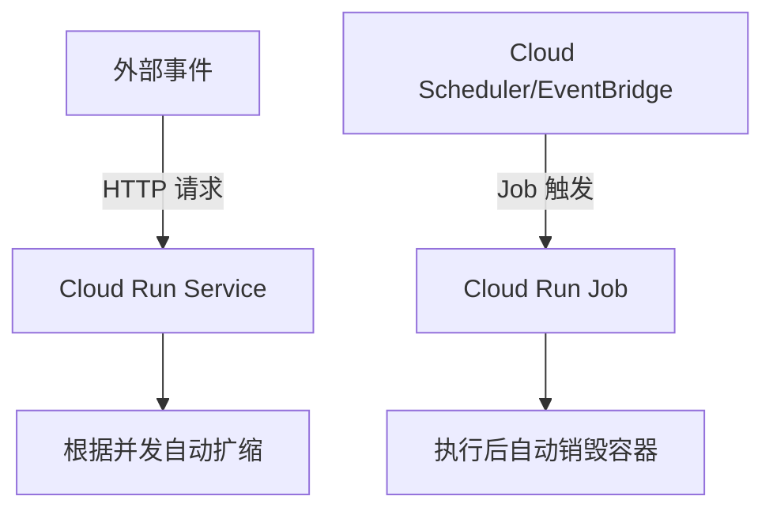

以下是关于 GCP Cloud Run Services 和 Cloud Run Jobs 的详细概念解释与对比分析，适合你用于平台架构梳理、权限管理和组件选型：

📌 Cloud Run Services vs Cloud Run Jobs 概念与对比

|                      |                                                                      |                                                                    |
| -------------------- | -------------------------------------------------------------------- | ------------------------------------------------------------------ |
| 项目                 | Cloud Run Services                                                   | Cloud Run Jobs                                                     |
| 核心用途             | 持续响应 HTTP 请求的无服务器服务（适用于 Web/API 服务）              | 执行一次性、批处理或后台任务（例如 ETL、定期数据抓取）             |
| 触发方式             | 自动通过 HTTP(S) 请求触发（支持 Webhook、API Gateway、Scheduler 等） | 显式调用（命令行 gcloud run jobs execute、Scheduler、Cloud Tasks） |
| 请求处理             | 会自动监听 HTTP 请求，服务长期运行                                   | 启动后执行任务，任务完成即终止                                     |
| 支持并发             | ✅ 支持请求并发（通过 maxConcurrency 设置）                          | ❌ 不支持并发，按 job execution 创建实例，每次执行新 container     |
| 运行时长限制         | 默认 15 分钟，最大 60 分钟（可设置 timeout）                         | 每次执行最长支持 60 分钟                                           |
| 可伸缩性（自动扩缩） | ✅ 支持，根据请求量自动扩缩（0~N 实例）                              | ✅ 每次执行时，按需要创建多个 Task 实例（并发执行）                |
| VPC 连接             | ✅ 支持通过 Serverless VPC Connector                                 | ✅ 同样支持，常用于访问私有资源（如 DB）                           |
| 适合场景             | - HTTP API                                                           |                                                                    |

- Web 服务
- 公共/私有 API
- SaaS Endpoint                                      | - 数据处理、日志转存
- 报告生成
- 自动化脚本任务
- 调用外部 API、运行 Agent                          |

    | 日志与监控         | ✅ 支持 Cloud Logging、Cloud Trace、Cloud Monitoring                                | ✅ 同样支持完整的日志与运行状态跟踪                                             |  
     | IAM 权限粒度       | 支持每个 Service 设置 invoker（调用者）角色控制                                   | 支持每个 Job 设置执行权限（执行者需具备 roles/run.jobRunner 等角色）        |  
     | 部署命令示例       |                                                                                     |                                                                                 |  
     |                       | bash                                                                             | bash                                                                         |  
     |                       | gcloud run deploy my-api \                                                          | gcloud run jobs deploy my-job \                                                 |  
     |                       | –image=gcr.io/my-project/image \                                                   | –image=gcr.io/my-project/job-image \                                           |  
     |                       | –region=us-central1                                                                | –region=us-central1                                                            |  
     |                       |                                                                                 |                                                                             |  
     | 执行命令示例       | 自动响应 HTTP 请求                                                                 | ```bash  
     gcloud run jobs execute my-job –region=us-central1

---

## 🧠 总结建议

### ✅ 你选择 Cloud Run **Services** 的场景：

- 提供 HTTP API（对外或内部使用）

- 实时响应用户请求或事件通知（例如 Webhook）

- 长时间运行并随流量自动扩缩的服务

### ✅ 你选择 Cloud Run **Jobs** 的场景：

- 后台任务如清理、拉取、导出数据等

- 需要定时运行的逻辑（通过 Cloud Scheduler 定期触发）

- 无需暴露 HTTP Endpoint，仅执行完即退出

---

## 🔁 Mermaid 流程图：触发路径对比



如需深入配置 Job 的 IAM 权限、VPC connector 限制、日志抓取等，我可继续为你补充。是否需要举一个 Scheduler + Cloud Run Job 的实际触发场景例子？
