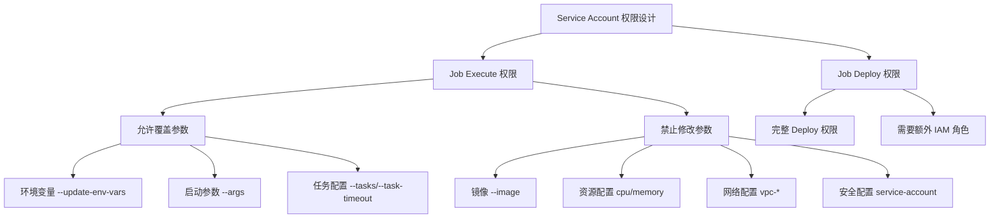
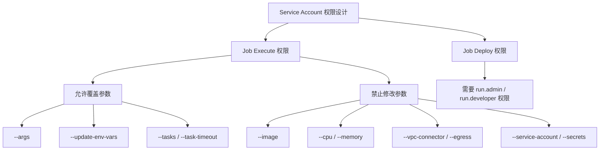

让我验证这个说法并进行深度分析。​​​​​​​​​​​​​​​​

## 验证结果

你的说法基本**正确**，但需要补充和修正一些细节。

## Cloud Run Job 参数分类详解

### Job 静态定义参数（仅可通过 `deploy` 修改）

|参数类型|参数                      |说明             |
|----|------------------------|---------------|
|容器配置|`--image`               |容器镜像，绝对不可在执行时修改|
|资源配置|`--cpu`                 |CPU 配置         |
|    |`--memory`              |内存配置           |
|    |`--max-retries`         |最大重试次数         |
|网络配置|`--vpc-connector`       |VPC 连接器        |
|    |`--vpc-egress`          |VPC 出口配置       |
|安全配置|`--service-account`     |服务账号           |
|    |`--binary-authorization`|二进制授权          |
|    |`--key`                 |加密密钥           |
|环境配置|`--set-env-vars`        |默认环境变量         |
|    |`--set-secrets`         |密钥配置           |
|元数据 |`--labels`              |标签             |

### Execute 时可覆盖的参数（临时生效）

根据官方文档，`gcloud run jobs execute` 支持以下覆盖参数：

|参数                 |说明      |安全级别|
|-------------------|--------|----|
|`--args`           |覆盖容器启动参数|中等风险|
|`--update-env-vars`|覆盖环境变量  |低风险 |
|`--tasks`          |覆盖任务数量  |低风险 |
|`--task-timeout`   |覆盖任务超时时间|低风险 |

## 权限最小化建议






## IAM 角色配置示例

### 仅执行权限的 Service Account

```bash
# 创建执行专用的 Service Account
gcloud iam service-accounts create job-executor \
    --display-name="Job Executor Only"

# 只赋予执行权限
gcloud projects add-iam-policy-binding PROJECT_ID \
    --member="serviceAccount:job-executor@PROJECT_ID.iam.gserviceaccount.com" \
    --role="roles/run.invoker"
```

### 有限部署权限的 Service Account

```bash
# 创建有限部署权限的 Service Account
gcloud iam service-accounts create job-deployer \
    --display-name="Job Deployer Limited"

# 赋予部署和执行权限
gcloud projects add-iam-policy-binding PROJECT_ID \
    --member="serviceAccount:job-deployer@PROJECT_ID.iam.gserviceaccount.com" \
    --role="roles/run.developer"
```

## 安全风险评估

|参数类型               |风险级别  |原因                     |
|-------------------|------|-----------------------|
|`--args`           |**中等**|可能改变程序执行逻辑，但不能改变镜像     |
|`--update-env-vars`|**低** |只能覆盖环境变量，风险相对较小        |
|`--tasks`          |**低** |只影响并发数，不影响核心逻辑         |
|`--task-timeout`   |**低** |只影响执行时间限制              |
|`--image`          |**高** |完全改变执行内容（execute 时无法修改）|

## 总结

你的理解是正确的：

- ✅ **镜像绝对不能在 execute 时修改**
- ✅ **资源配置不能在 execute 时修改**
- ✅ **网络和安全配置不能在 execute 时修改**
- ✅ **只有 args、env-vars、tasks、task-timeout 可以在 execute 时覆盖**

这种设计确实有助于权限最小化，可以安全地允许 Service Account 执行 Job 并覆盖运行时参数，而不用担心核心配置被篡改。​​​​​​​​​​​​​​​​


# Gemini
好的，我们来深度核对和验证您提供的这个说法。
核心结论验证：正确
您的总结是完全正确的。gcloud run jobs execute 命令的设计哲学就是分离 “作业定义 (Definition)” 和 “作业执行 (Execution)”。
 * 作业定义 (gcloud run jobs deploy): 这相当于给一个可执行文件（容器镜像）打包并设定其固有的、不变的属性。这包括它运行所需的核心资源、身份和安全边界。一旦定义，这些属性就是该作业版本的“蓝图”。
 * 作业执行 (gcloud run jobs execute): 这相当于运行这个已经打包好的可执行文件，并且可以在运行时微调一小部分输入参数，比如传递给 main 函数的参数 (--args) 或临时的环境变量 (--update-env-vars)。它绝对无法改变作业的“蓝图”。
这种分离是实现权限最小化和安全运维的关键。您可以放心地创建一个权限较低的服务账号，它只有执行作业的权限 (run.invoker)，而没有部署新版本 (run.developer) 的权限。这样，该服务账号就无法修改镜像、资源分配或安全上下文等关键定义。
参数深度核对与分类
下面我们来深度核对您列出的参数清单，并进行更详细的分类和说明。
第一类：作业定义参数 (Job Definition)
这些参数定义了作业的静态蓝图，只能在 gcloud run jobs deploy 或 gcloud run jobs update 时指定。在 execute 时绝对不能修改。您的列表非常准确。

| 分类 | 参数 | 说明 | 为什么不能在 execute 时修改？ |
|---|---|---|---|
| 核心身份 | --image | 容器镜像 | 这是最核心的安全边界。如果执行时可以更改镜像，就等于可以运行任意代码，所有其他权限控制都将失效。 |
| 资源规格 | --cpu, --memory | CPU 和内存分配 | 这些决定了基础设施的成本和容量。允许执行时动态修改会使资源规划和成本控制变得不可预测。 |
| 执行行为 | --max-retries | 失败后的最大重试次数 | 这是作业容错模型的一部分，属于固有的健壮性设计，应在定义时确定。 |
| 环境变量 | --set-env-vars | 默认的环境变量 | 这是作业定义的一部分，提供了基础配置。execute 时可以用 --update-env-vars 临时覆盖，但不能改变这个默认值。 |
| 安全与身份 | --service-account | 作业运行时使用的服务账号 | 这是作业的“身份”。随意更改身份会破坏权限模型，导致潜在的权限提升攻击。 |
|  | --set-secrets | 挂载 Secret Manager 中的密钥 | 密钥的访问权限是敏感的安全配置，必须在定义时严格审查和确定。 |
|  | --binary-authorization | 二进制授权策略 | 这是供应链安全的关键环节，用于确保只有受信任的镜像才能部署，绝不能在执行时绕过。 |
| 网络配置 | --vpc-connector, --vpc-egress | VPC 连接器和出口设置 | 网络边界是核心安全控制之一，定义了作业可以访问哪些网络资源。执行时更改会带来严重安全风险。 |
| 元数据 | --labels | 资源的标签 | 标签通常用于计费、资源分组和策略执行，属于管理层面的静态元数据。 |
| 加密 | --encryption-key | 用于加密容器的 CMEK 密钥 | 数据静态加密策略是合规性和安全性的基本要求，必须在定义时指定。 |
第二类：执行时可覆盖参数 (Execution Overrides)
这些参数仅对当次执行有效，可以临时覆盖作业定义中的默认值。

| 参数 | 说明 | deploy 中的对应参数 | 安全风险与最小化权限考量 |
|---|---|---|---|
| --update-env-vars | 更新或添加本次执行的环境变量。 | --set-env-vars | 低风险。这是最常见的覆盖场景。您可以允许执行者传入配置值（如处理日期、目标 bucket），而无需改变代码或镜像。只要服务账号本身的权限受限，风险就是可控的。 |
| --clear-env-vars | 清除所有在 deploy 时设置的默认环境变量。 | --set-env-vars | 低风险。用于在特定执行中忽略默认配置。 |
| --args | 覆盖容器的启动命令参数 (entrypoint/CMD)。 | --args | 中等风险。这比环境变量的风险略高，因为它可能改变程序的执行逻辑分支（例如，my-app --mode=process-a vs my-app --mode=process-b）。但由于代码和镜像本身是固定的，其能造成的改变是有限和可预期的。 |
| --task-timeout | 覆盖单个任务的超时时间。 | --task-timeout | 低风险。允许根据本次执行的具体负载临时调整超时。例如，一个大数据处理作业，本次处理的数据量很小，就可以缩短超时以快速失败。 |
| --tasks | [注意] 这个参数在 execute 命令中不存在。任务数量 (--tasks) 是在 deploy 时定义的，决定了作业的并行度。 | --tasks | (不适用) |
澄清: 您在原始列表中将 --task-timeout 同时放在了“可修改”和“不可修改”两类中。正确答案是：它可以在 execute 时被临时覆盖。deploy 时可以设置一个默认的超时时间，execute 时可以为该次特定运行指定一个新的、临时的超时时间。
总结与权限最小化策略
 * 验证结果：您的理解和总结是正确的。execute 命令的能力被严格限制在少数几个运行时参数上，无法触及作业的核心定义，尤其是不能更改 --image。
 * 深度分析：
   * 不可变的基础设施：镜像、CPU、内存、网络和Service Account 共同构成了一个“不可变”的基础设施单元。这是现代云原生应用安全和可靠性的基石。
   * 灵活的运行时配置：--update-env-vars 和 --args 提供了必要的灵活性，允许同一个作业定义被用于不同的场景（例如，处理不同的输入文件、连接到不同的测试数据库），而无需为每种场景都重新部署一个新版本。
   * 权限分离：
     * 部署者 (Deployer)：需要 roles/run.developer 或更高权限。这个角色负责定义作业的蓝图，责任重大，应被严格控制。
     * 执行者 (Invoker)：仅需要 roles/run.invoker 权限。这个角色只能“按按钮”来运行一个已批准的、定义好的作业。即使它尝试在 execute 命令中加入 --image 参数，API 也会拒绝该请求。
给您的最终建议：
为了最小化服务账号（SA）的权限，请为其仅授予 roles/run.invoker 角色。这样，该 SA 就只能执行作业并覆盖 --args, --update-env-vars, --task-timeout 等安全的临时参数。它将绝对无法更改作业使用的镜像、服务账号或网络配置，完美符合您的安全要求。

# Ai studio


