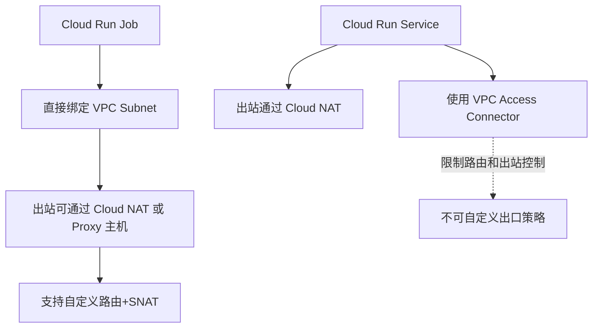

# summary

- 我们使用 Cloud Run Jobs
- 这两个参数的**本质区别**在于：
- Cloud Run Job ➜ VPC Access Connector ➜ VPC ➜ Cloud NAT ➜ GitHub
- 创建一个 Cloud NAT + Serverless VPC Connector，并使用 --vpc-egress=all-traffic
- 我们**没有用 --network + --subnet 的 Job VPC 直连模式**，而是走的是 **Serverless VPC Access Connector 路径**

> --vpc-connector=xxx 是通过 **Serverless VPC Access Connector（托管的、间接接入）**

> --network=xxx --subnet=xxx 是通过 **自定义 VPC 网络直连（直接路由层绑定）**

我用如下命令可以创建一个 GCP 里面的 Cloud Run 任务. 有连接比如 github 的需求

```bash
gcloud run jobs deploy my-agent-4 \
--image=europe-west2-docker.pkg.dev/myproject/containers/my-agent:latest \
--region=europe-west2 \
--vpc-connector=vpc-conn-europe \
--vpc-egress=all-traffic \
--max-retries=3 \
--set-env-vars=env=pdev,name=testvalue,region=uk,version=release_17.0.0 \
--set-secrets=cloud_run_secret=cloud_run_test:latest \
--task-timeout=10m \
--cpu=1 \
--memory=512Mi \
--labels=refersh=image \
--key=projects/my-kms-project/locations/europe-west2/keyRings/run/cryptoKeys/HSMrunSharedKey \
--project=myproject \
--service-account=mgmt@myproject.iam.gserviceaccount.com
```

---

现在我有如下信息:
我们使用 Cloud Run Jobs
应该是使用的 Cloud Run Job ➜ VPC Access Connector ➜ VPC ➜ Cloud NAT ➜ GitHub

- 我们**没有用 --network + --subnet 的 Job VPC 直连模式**，而是走的是 **Serverless VPC Access Connector 路径**
我想了解Serverless VPC Access 的详细解析 比如以及如何创建,比如什么命令,创建之后在Google的Console页面哪里查询.比如另外会创建一个对应的Egress Firewall
帮我深度分析这个过程

## **✅ 核心区别对比**

| **维度** | --vpc-connector**（Serverless VPC Access）** | --network **+** --subnet**（Custom VPC for Job）** |
| :--- | :--- | :--- |
| **作用方式** | Cloud Run 通过 VPC Access Connector 连入你的 VPC | Cloud Run Job 实际运行在你指定的 VPC / Subnet 里 |
| **适用资源类型** | Cloud Run（Service）、Cloud Functions、Cloud Tasks | 仅支持 Cloud Run Job（不支持 Cloud Run Service） |
| **IP 来源** | 由 VPC Connector 控制，会用固定的 /28 子网段 | 分配你指定 subnet 中的 IP（真正加入该 VPC） |
| **Egress 控制能力** | 限制较多，需搭配 Cloud NAT 使用 | 控制精细，自定义路由/NAT 直接生效 |
| **可见性/排查难度** | VPC Connector 是黑盒，不支持查看内部实现 | 全部在你掌控中，可用 VPC Flow Logs、VPC 路由调试 |
| **推荐场景** | Cloud Run Service 需要访问内部资源（如 Cloud SQL） | Job 需强控制网络，比如公网出口策略、跑爬虫或 CI |
| **访问 Cloud SQL 方式** | 需配置 Cloud SQL Proxy 或 Cloud SQL IAM 代理 | 同样支持，但更灵活（可走 Cloud NAT 出去） |
| **Egress 出口控制** | 仅支持 all-traffic / private-ranges-only 两种策略 | 你可定义完整的 VPC Route + Firewall 策略 |
| **是否支持通过三层路由转发** | 否，仅支持通过 NAT | 是，可自定义下一跳路由转发到 proxy host |

---

## **🔍 示例说明**

### **🔹** 

### **--vpc-connector=vpc-conn-europe**

```bash
gcloud run deploy my-service \
  --vpc-connector=vpc-conn-europe \
  --vpc-egress=all-traffic
```

- **适用场景**：Cloud Run **Service** 要访问 Redis/Cloud SQL/内网 HTTP API
- 出站走 Connector，若要访问公网必须配置 **Cloud NAT**
- 不是真正挂载到你定义的子网上

---

### **🔹** 

### **--network + --subnet**

###  **模式（你当前使用）**

```bash
gcloud run jobs deploy my-job \
  --network=my-vpc \
  --subnet=my-subnet \
  --vpc-egress=all-traffic
```

- 只有 **Cloud Run Job** 支持（Cloud Run Service 不支持）
- 真正绑定到你的 VPC 子网，IP 从你子网段中分配
- 可精细定义下一跳，比如你定义的三层 proxy
- 可以配置网络标签、VPC Flow Logs，增强可观测性

---

## **✅ 总结建议**

| **场景** | **推荐用法** |
| :--- | :--- |
| 一般 Serverless 服务访问 VPC 内部资源 | --vpc-connector=xxx 搭配 vpc-egress 和 Cloud NAT |
| Job 场景，需要控制公网访问、配合 proxy、抓取任务等 | --network + --subnet 方式更灵活 |
| 要用三层代理主机转发、做特定路由策略 | 必须使用 --network + --subnet |

---

## **🔁 Mermaid 关系图说明**



---

如需具体结合你现在的 proxy 主机、Egress 路由方案部署脚本，也可以继续输出。是否需要我帮你生成这个方案？

非常关键的信息！你指出：

> ✅ **你使用的是 Cloud Run Job，但必须用 --vpc-connector=xxx 才能正常联网。**

这说明你并 **没有用 --network + --subnet 的 Job VPC 直连模式**，而是走的是 **Serverless VPC Access Connector 路径**。我们马上来澄清这个重点区别——因为确实容易混淆，**Cloud Run Job 同时支持两种方式**，但你只能用一种，不能混用。

---

## **✅ 核心结论：Cloud Run Job 有两种网络连接模式**

| **模式** | **参数** | **特点** | **是否支持访问公网** | **适用性** |
| :--- | :--- | :--- | :--- | :--- |
| 🔹 **Serverless VPC Access 模式** | --vpc-connector=xxx | 借助托管的 Connector 接入 VPC，但 Job 实际不绑定 Subnet | ✅ 可以通过 Cloud NAT 出公网 | 最常用 |
| 🔸 **Custom VPC Network 模式（Private Job）** | --network=xxx --subnet=xxx（且 **不能加** --vpc-connector） | Job 实例在自定义子网中运行，有 VPC IP，可控制默认路由和 NAT | ✅ 需你配置好 NAT 或三层路由 | 高级控制 |

---

### **❗ 不能混用这两个模式！**

你不能在同一个 Cloud Run Job 命令中同时使用：

```
--vpc-connector=xxx  ❌ 和 --network=xxx --subnet=xxx
```

---

## **🧪 你遇到的现象是：**

你用了：

```
--network=xxx --subnet=xxx
```

但是没有配置：

- ❌ 没有 Cloud NAT
- ❌ 没有默认路由指向 Proxy 主机

所以 Job 出不了网，**不能访问 GitHub** —— 这是预期行为。

---

当你改用：

```
--vpc-connector=xxx \
--vpc-egress=all-traffic
```

由于 Cloud Run Job 会通过 Serverless VPC Access Connector 路由出站（并在你 VPC 中已有 NAT），因此能联网访问 GitHub，**这才是你现在网络正常的根本原因**。

---

## **🧠 那我们来直观对比两者模式的区别**

### **☑️ 模式一：你当前** 

### **能联网成功**

###  **的配置**

```bash
gcloud run jobs deploy ... \
  --vpc-connector=vpc-conn-europe \
  --vpc-egress=all-traffic
```

> ✅ 实际路径：Cloud Run Job ➜ VPC Access Connector ➜ VPC ➜ Cloud NAT ➜ GitHub

---

### **❌ 模式二：你配置了但无法联网的方式**

```bash
gcloud run jobs deploy ... \
  --network=my-vpc \
  --subnet=my-subnet
```

> ❌ 实际路径：Cloud Run Job ➜ Subnet ➜ **没有路由/NAT** ➜ ❌ GitHub 访问失败

---

## **✅ 推荐解决方法（如果你要继续用** 

## **--network**

## **）**

如果你坚持用 --network + --subnet 模式，则你必须手动配置网络出口路径：

### **✅ 选项 1：配置 Cloud NAT**

```bash
gcloud compute routers create nat-router \
  --network=my-vpc \
  --region=europe-west2

gcloud compute routers nats create nat-config \
  --router=nat-router \
  --region=europe-west2 \
  --auto-allocate-nat-external-ips \
  --nat-all-subnet-ip-ranges
```

---

### **✅ 选项 2：配置三层 Proxy 主机 + 自定义默认路由**

```bash
gcloud compute routes create proxy-egress \
  --network=my-vpc \
  --destination-range=0.0.0.0/0 \
  --next-hop-address=<proxy-vm-ip> \
  --priority=1000
```

> 同时确保该 proxy VM 设置了：

```bash
echo 1 > /proc/sys/net/ipv4/ip_forward
iptables -t nat -A POSTROUTING -o eth0 -j MASQUERADE
```

---

## **✅ 总结对比表（再次强化）**

| **模式** | **连接方式** | **能否联网（默认）** | **是否用到 Cloud NAT** | **支持三层 Proxy** | **是否推荐** |
| :--- | :--- | :--- | :--- | :--- | :--- |
| --vpc-connector | Serverless VPC Access | ❌（需 Cloud NAT） | ✅（推荐） | ❌ 不支持 | ✅ 推荐 |
| --network + --subnet | Private VPC Execution | ❌（需你手动设路由） | ✅（或 Proxy） | ✅ 支持 | ✅ 高级用法 |

---

### **🎯 建议**

如果你已有 NAT 并只是希望出公网，**就继续使用 --vpc-connector=xxx 是最简单有效的方式**。

如果你未来要定向出流量（例如走某台三层代理、拦截 GitHub 下载行为等），才推荐使用 --network + --subnet 模式。

---