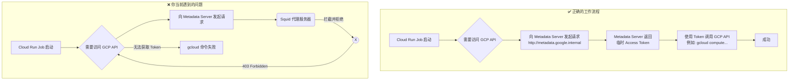

好的，我们来分析一下这个问题。

你遇到的错误和你之前的理解是完全一致的：**在 Cloud Run 中，你不需要手动激活服务账号（activate-service-account）**。Cloud Run 环境会自动处理。

那么，为什么你的脚本会失败呢？关键在于错误日志本身。

### 错误分析：这不是认证问题，而是网络问题

让我们仔细看一下你提供的错误日志：

```
ERROR: (gcloud.compute.instance-groups.managed.list) There was a problem refreshing your current auth tokens: 
('Failed to retrieve http://metadata.google.internal/computeMetadata/v1/instance/service-accounts/aibang-uk-mgmt-sa@myproject.iam.gserviceaccount.com/?recursive=true from the Google Compute Engine metadata service. Status: 403
Response: ... <!DOCTYPE html PUBLIC ...> ... <title>ERROR: The requested URL could not be retrieved</title> ...
<meta type="copyright" content="Copyright (C) 1996-2021 The Squid Software Foundation and contributors">
```

这个日志告诉我们几个关键信息：

1.  **`Failed to retrieve http://metadata.google.internal/...`**: `gcloud` CLI（以及所有 GCP 客户端库）尝试联系 GCP 的 **Metadata 服务**。这个服务是 GCP 环境（包括 Cloud Run, GCE, GKE 等）的“身份证”服务中心。运行在 GCP 上的服务通过查询它来获取自己的身份信息，包括临时的访问令牌（Access Token）。
2.  **`Status: 403 Forbidden`**: 请求被拒绝了。
3.  **`The Squid Software Foundation`**: 这是最关键的线索！错误响应不是来自 Google 的 Metadata 服务，而是来自一个 **Squid 代理服务器**。

**结论：** 你的 Cloud Run Job 的出站网络流量被一个代理（Proxy）服务器拦截了。这个代理服务器阻止了你的 Job 访问 GCP 的 Metadata 服务，导致 `gcloud` 无法获取认证令牌，因此后续的 API 调用（`gcloud compute instance-groups managed list`）失败。

### 正确的工作流程

为了让你更清晰地理解，下面是 Cloud Run 中服务账号的正确工作流程，以及你当前遇到的问题。



### 如何解决

你不需要修改代码或在容器内执行 `gcloud auth` 命令。你需要检查并修复你的网络配置，允许 Cloud Run Job 访问 Metadata 服务。

#### 检查点 1: VPC 网络和防火墙规则

如果你的 Cloud Run Job 连接到了一个 VPC 网络（通过 **Serverless VPC Access connector**），那么你需要检查该 VPC 的网络配置：

1.  **防火墙规则 (Firewall Rules)**: 确保没有防火墙规则阻止从你的 VPC 到 `169.254.169.254`（Metadata Server 的固定 IP 地址）的出站（Egress）流量。
2.  **代理配置**: 你的日志明确指出了 Squid 代理。你需要检查这个代理的配置，确保它允许（whitelist）到 `metadata.google.internal` (IP: `169.254.169.254`) 的流量通过。这通常是在代理的访问控制列表（ACL）中设置的。

#### 检查点 2: 容器镜像和启动脚本

检查你的容器镜像或启动脚本，确认是否在其中配置了全局代理（例如，通过设置 `http_proxy` 或 `https_proxy` 环境变量）。如果是这样，你需要确保代理配置中包含了对 GCP Metadata 服务的例外规则。

例如，在设置代理时，通常会配置 `NO_PROXY` 环境变量，告诉系统哪些地址**不**通过代理访问。

```bash
# 在你的 Dockerfile 或启动脚本中，确保 metadata.google.internal 被排除
export http_proxy="http://your-proxy-address:port"
export https_proxy="http://your-proxy-address:port"
export NO_PROXY="localhost,127.0.0.1,metadata.google.internal,169.254.169.254"
```

### 总结

1.  **坚持原则**：你在 Cloud Run 中**永远**不需要手动处理服务账号的 key 或执行 `gcloud auth activate-service-account`。
2.  **定位问题**：错误日志是你的朋友。`403 Forbidden` 加上 `Squid` 的签名清晰地指向了网络代理问题，而不是 GCP 的权限问题。
3.  **解决方向**：
    *   **检查网络配置**：与你的网络管理员或 DevOps 团队合作，检查 VPC 防火墙规则和代理服务器（Squid）的配置。
    *   **放行 Metadata 服务**：确保到 `metadata.google.internal` (IP: `169.254.169.254`) 的流量被允许通过，或者被排除在代理之外。

一旦网络路径被打通，你的 `gcloud` 命令以及其他所有依赖 ADC (Application Default Credentials) 的 Google Cloud 工具和库就能自动、安全地完成认证。
