# Summary 
Below is a summarized version of the provided article on "GCP Cloud Run Binary Authorization using OpenPGP Signatures" in three parts: Summary, Abstract, and Viewpoints.

### Summary
The document outlines a detailed workflow for implementing Binary Authorization on Google Cloud Platform's (GCP) Cloud Run using OpenPGP signatures to ensure that only trusted container images are deployed. The process involves generating GPG key pairs for signing and verification, configuring Binary Authorization policies, creating attestors and container analysis notes, signing images with private keys, creating attestations, and deploying to Cloud Run with automatic validation. A comprehensive Bash script is provided to automate these steps, covering everything from setup to deployment, including environment variable configuration, tool checks, and error handling. Additionally, a simplified script for signing existing images and troubleshooting tips are included, along with a visual flowchart to illustrate the process. The goal is to enforce security by ensuring only signed and verified images are deployed to production environments.

### Abstract
This article presents a complete guide to implementing Binary Authorization in GCP Cloud Run using OpenPGP signatures for container image verification. It covers the end-to-end process of securing deployments through cryptographic signing, including key generation, policy setup, attestor creation, image signing, attestation upload, and deployment validation. An automated script streamlines the workflow, ensuring reproducibility and ease of use, while troubleshooting commands and a detailed flowchart provide clarity on handling failures and understanding the process. This approach enhances security by mandating that only authorized, signed images are deployed, protecting Cloud Run environments from unverified code.

### Viewpoints
- **Security Enhancement**: The use of Binary Authorization with OpenPGP signatures significantly improves the security posture of Cloud Run deployments by enforcing strict validation of container images, preventing unauthorized or tampered images from running.
- **Automation Efficiency**: The provided Bash script is a valuable tool for automating complex setup and deployment processes, reducing human error and saving time, especially for teams managing frequent deployments.
- **Complexity and Learning Curve**: While thorough, the process involves multiple steps and technical configurations, which could be daunting for beginners or teams without prior experience with GCP or cryptographic tools like GPG.
- **Troubleshooting Support**: The inclusion of troubleshooting commands and a flowchart is beneficial for diagnosing issues, offering a practical way to address deployment failures or policy misconfigurations.
- **Scalability Concerns**: Although effective for smaller projects, the manual key management and attestation process might become cumbersome at scale, potentially requiring integration with more automated key management systems or CI/CD pipelines for larger environments.

# GCP Cloud Run Binary Authorization 使用 OpenPGP 签名的完整流程

我将为您详细梳理整个流程，并提供一个完整的自动化脚本。Claude4.5

## **流程概述**

Binary Authorization 通过加密签名来验证容器镜像的可信度。整个流程包括密钥生成、attestor 配置、镜像签名、attestation 创建和部署验证等步骤。这个过程确保只有经过授权和签名的镜像才能在 Cloud Run 上运行。

## **详细步骤说明**

### **第一步：生成 GPG 密钥对**

首先需要生成一对 GPG 密钥，私钥用于签名镜像，公钥用于验证签名。生成过程中需要注意密钥类型、长度和有效期的设置。推荐使用 RSA 4096 位密钥以确保足够的安全性。

生成密钥时，您需要提供邮箱地址和名称，这些信息将与密钥关联。生成后，私钥必须妥善保管，建议导出并存储在安全的位置，如 Secret Manager 中。

### **第二步：配置 Binary Authorization Policy**

创建 Binary Authorization 策略，指定哪些 attestor 需要验证。策略定义了部署规则，例如要求所有镜像必须有特定 attestor 的签名才能部署。您需要在策略中指定 `attestor-cloud-run` 作为必需的验证者。

### **第三步：创建 Attestor 和 Container Analysis Note**

Attestor 是验证实体，它关联一个 Container Analysis Note 和一个或多个公钥。Note 是存储 attestation 的容器。创建 attestor 时，需要指定 note 的完整资源路径，并添加 OpenPGP 公钥。

### **第四步：将 OpenPGP 公钥添加到 Attestor**

从 GPG 密钥环中导出 ASCII 格式的公钥，然后将其添加到 attestor。这个公钥将用于验证后续创建的所有 attestation。公钥必须是 ASCII-armored 格式，这样才能正确地通过 API 传输。

### **第五步：构建和推送镜像**

使用 Docker 或 Cloud Build 构建容器镜像，并推送到 Google Container Registry (GCR) 或 Artifact Registry。推送后，记录镜像的完整 digest（SHA256 哈希值），这个 digest 将用于后续的签名过程。

### **第六步：使用 GPG 私钥签名镜像**

使用 GPG 私钥对镜像的 digest 进行签名。签名过程生成一个加密签名，证明该镜像已被授权的密钥持有者验证。签名必须是 ASCII-armored 格式，以便存储在 attestation 中。

### **第七步：创建 Attestation**

将签名上传到 Container Analysis，创建一个 attestation。Attestation 包含镜像的 digest、签名内容和签名者的公钥指纹。这个 attestation 存储在之前创建的 note 中，作为镜像可信度的证明。

### **第八步：部署到 Cloud Run**

部署镜像到 Cloud Run 时，Binary Authorization 会自动验证是否存在有效的 attestation。如果验证通过，部署继续；如果失败，部署会被拒绝。

## **完整自动化脚本**

以下是一个完整的 Bash 脚本，实现了上述所有步骤：

```bash
#!/bin/bash

set -e

# ============================================================================
# GCP Cloud Run Binary Authorization with OpenPGP Signing Script
# Purpose: Sign and deploy Cloud Run images using OpenPGP keys
# ============================================================================

# 配置变量
PROJECT_ID="${GCP_PROJECT_ID:-your-project-id}"
REGION="${GCP_REGION:-us-central1}"
ATTESTOR_NAME="attestor-cloud-run"
NOTE_ID="note-cloud-run"
IMAGE_NAME="${IMAGE_NAME:-my-cloud-run-app}"
IMAGE_TAG="${IMAGE_TAG:-latest}"
SERVICE_NAME="${SERVICE_NAME:-my-service}"

# GPG 配置
GPG_KEY_NAME="cloud-run-signer"
GPG_KEY_EMAIL="cloud-run-signer@${PROJECT_ID}.iam.gserviceaccount.com"
GPG_KEY_COMMENT="Cloud Run Image Signer"

# 颜色输出
RED='\033[0;31m'
GREEN='\033[0;32m'
YELLOW='\033[1;33m'
NC='\033[0m' # No Color

# 日志函数
log_info() {
    echo -e "${GREEN}[INFO]${NC} $1"
}

log_warn() {
    echo -e "${YELLOW}[WARN]${NC} $1"
}

log_error() {
    echo -e "${RED}[ERROR]${NC} $1"
}

# 检查必需的工具
check_prerequisites() {
    log_info "检查必需的工具..."

    local tools=("gcloud" "docker" "gpg" "jq")
    for tool in "${tools[@]}"; do
        if ! command -v "$tool" &> /dev/null; then
            log_error "$tool 未安装，请先安装"
            exit 1
        fi
    done

    log_info "所有必需工具已安装"
}

# 设置 GCP 项目
setup_gcp_project() {
    log_info "设置 GCP 项目: $PROJECT_ID"
    gcloud config set project "$PROJECT_ID"

    # 启用必需的 API
    log_info "启用必需的 GCP API..."
    gcloud services enable \
        containeranalysis.googleapis.com \
        binaryauthorization.googleapis.com \
        run.googleapis.com \
        artifactregistry.googleapis.com \
        cloudkms.googleapis.com
}

# 生成 GPG 密钥对
generate_gpg_key() {
    log_info "检查 GPG 密钥是否已存在..."

    # 检查密钥是否已存在
    if gpg --list-keys "$GPG_KEY_EMAIL" &> /dev/null; then
        log_warn "GPG 密钥已存在，跳过生成"
        return 0
    fi

    log_info "生成新的 GPG 密钥对..."

    # 创建 GPG 密钥生成配置
    cat > /tmp/gpg-key-config <<EOF
%no-protection
Key-Type: RSA
Key-Length: 4096
Subkey-Type: RSA
Subkey-Length: 4096
Name-Real: $GPG_KEY_NAME
Name-Comment: $GPG_KEY_COMMENT
Name-Email: $GPG_KEY_EMAIL
Expire-Date: 0
EOF

    # 生成密钥
    gpg --batch --generate-key /tmp/gpg-key-config
    rm /tmp/gpg-key-config

    log_info "GPG 密钥对生成成功"

    # 导出密钥信息
    GPG_KEY_ID=$(gpg --list-keys --with-colons "$GPG_KEY_EMAIL" | grep fpr | head -1 | cut -d: -f10)
    log_info "GPG Key ID: $GPG_KEY_ID"
}

# 导出 GPG 公钥
export_gpg_public_key() {
    log_info "导出 GPG 公钥..."

    GPG_PUBLIC_KEY_FILE="/tmp/gpg-public-key.asc"
    gpg --armor --export "$GPG_KEY_EMAIL" > "$GPG_PUBLIC_KEY_FILE"

    log_info "公钥已导出到: $GPG_PUBLIC_KEY_FILE"
}

# 创建 Container Analysis Note
create_container_analysis_note() {
    log_info "创建 Container Analysis Note: $NOTE_ID"

    # 检查 note 是否已存在
    if gcloud container binauthz attestors describe "$ATTESTOR_NAME" \
        --project="$PROJECT_ID" &> /dev/null; then
        log_warn "Note 已存在，跳过创建"
        return 0
    fi

    # 创建 note payload
    cat > /tmp/note_payload.json <<EOF
{
  "name": "projects/${PROJECT_ID}/notes/${NOTE_ID}",
  "attestation": {
    "hint": {
      "human_readable_name": "Cloud Run attestation note"
    }
  }
}
EOF

    # 创建 note
    curl -X POST \
        -H "Content-Type: application/json" \
        -H "Authorization: Bearer $(gcloud auth print-access-token)" \
        -H "X-Goog-User-Project: ${PROJECT_ID}" \
        --data-binary @/tmp/note_payload.json \
        "https://containeranalysis.googleapis.com/v1/projects/${PROJECT_ID}/notes/?noteId=${NOTE_ID}"

    log_info "Container Analysis Note 创建成功"
}

# 创建 Attestor
create_attestor() {
    log_info "创建 Attestor: $ATTESTOR_NAME"

    # 检查 attestor 是否已存在
    if gcloud container binauthz attestors describe "$ATTESTOR_NAME" \
        --project="$PROJECT_ID" &> /dev/null; then
        log_warn "Attestor 已存在，将更新公钥"
    else
        # 创建新的 attestor
        gcloud container binauthz attestors create "$ATTESTOR_NAME" \
            --project="$PROJECT_ID" \
            --attestation-authority-note="$NOTE_ID" \
            --attestation-authority-note-project="$PROJECT_ID"

        log_info "Attestor 创建成功"
    fi
}

# 添加 OpenPGP 公钥到 Attestor
add_public_key_to_attestor() {
    log_info "添加 OpenPGP 公钥到 Attestor..."

    # 添加公钥
    gcloud container binauthz attestors public-keys add \
        --project="$PROJECT_ID" \
        --attestor="$ATTESTOR_NAME" \
        --pgp-public-key-file="$GPG_PUBLIC_KEY_FILE"

    log_info "公钥已成功添加到 Attestor"
}

# 配置 Binary Authorization Policy
configure_binauthz_policy() {
    log_info "配置 Binary Authorization Policy..."

    # 获取当前策略
    gcloud container binauthz policy export > /tmp/policy.yaml

    # 创建新策略
    cat > /tmp/policy.yaml <<EOF
admissionWhitelistPatterns:
- namePattern: gcr.io/google_containers/*
- namePattern: gcr.io/google-containers/*
- namePattern: k8s.gcr.io/*
- namePattern: gke.gcr.io/*
- namePattern: gcr.io/stackdriver-agents/*
defaultAdmissionRule:
  enforcementMode: ENFORCED_BLOCK_AND_AUDIT_LOG
  evaluationMode: REQUIRE_ATTESTATION
  requireAttestationsBy:
  - projects/${PROJECT_ID}/attestors/${ATTESTOR_NAME}
globalPolicyEvaluationMode: ENABLE
name: projects/${PROJECT_ID}/policy
EOF

    # 导入策略
    gcloud container binauthz policy import /tmp/policy.yaml

    log_info "Binary Authorization Policy 配置完成"
}

# 构建和推送镜像
build_and_push_image() {
    log_info "构建和推送镜像..."

    # 设置镜像 URL
    IMAGE_URL="gcr.io/${PROJECT_ID}/${IMAGE_NAME}:${IMAGE_TAG}"

    # 如果存在 Dockerfile，构建镜像
    if [ -f "Dockerfile" ]; then
        log_info "构建镜像: $IMAGE_URL"
        docker build -t "$IMAGE_URL" .

        # 推送镜像
        log_info "推送镜像到 GCR..."
        docker push "$IMAGE_URL"
    else
        log_warn "未找到 Dockerfile，假设镜像已存在"
    fi

    # 获取镜像 digest
    IMAGE_DIGEST=$(gcloud container images describe "$IMAGE_URL" \
        --format='get(image_summary.digest)')

    IMAGE_URL_WITH_DIGEST="gcr.io/${PROJECT_ID}/${IMAGE_NAME}@${IMAGE_DIGEST}"

    log_info "镜像 URL: $IMAGE_URL_WITH_DIGEST"
}

# 签名镜像并创建 Attestation
sign_and_create_attestation() {
    log_info "签名镜像并创建 Attestation..."

    # 创建签名 payload
    SIGNATURE_PAYLOAD=$(cat <<EOF
{
  "critical": {
    "identity": {
      "docker-reference": "${IMAGE_URL_WITH_DIGEST}"
    },
    "image": {
      "docker-manifest-digest": "${IMAGE_DIGEST}"
    },
    "type": "Google cloud binauthz container signature"
  }
}
EOF
)

    # 保存 payload 到文件
    echo "$SIGNATURE_PAYLOAD" > /tmp/signature_payload.json

    # 使用 GPG 签名
    log_info "使用 GPG 签名 payload..."
    gpg --local-user "$GPG_KEY_EMAIL" \
        --armor \
        --clearsign \
        --output /tmp/signature.pgp \
        /tmp/signature_payload.json

    # 提取签名内容
    SIGNATURE=$(cat /tmp/signature.pgp)

    # 创建 attestation
    log_info "创建 Attestation..."

    cat > /tmp/attestation.json <<EOF
{
  "resourceUri": "${IMAGE_URL_WITH_DIGEST}",
  "note_name": "projects/${PROJECT_ID}/notes/${NOTE_ID}",
  "attestation": {
    "serialized_payload": $(echo "$SIGNATURE_PAYLOAD" | base64 -w 0 | jq -R .),
    "signatures": [
      {
        "public_key_id": "${GPG_KEY_ID}",
        "signature": $(echo "$SIGNATURE" | base64 -w 0 | jq -R .)
      }
    ]
  }
}
EOF

    # 上传 attestation
    curl -X POST \
        -H "Content-Type: application/json" \
        -H "Authorization: Bearer $(gcloud auth print-access-token)" \
        -H "X-Goog-User-Project: ${PROJECT_ID}" \
        --data-binary @/tmp/attestation.json \
        "https://containeranalysis.googleapis.com/v1/projects/${PROJECT_ID}/occurrences/"

    log_info "Attestation 创建成功"
}

# 部署到 Cloud Run
deploy_to_cloud_run() {
    log_info "部署到 Cloud Run..."

    gcloud run deploy "$SERVICE_NAME" \
        --image="$IMAGE_URL_WITH_DIGEST" \
        --platform=managed \
        --region="$REGION" \
        --project="$PROJECT_ID" \
        --binary-authorization=default \
        --allow-unauthenticated

    log_info "Cloud Run 服务部署成功"

    # 获取服务 URL
    SERVICE_URL=$(gcloud run services describe "$SERVICE_NAME" \
        --platform=managed \
        --region="$REGION" \
        --project="$PROJECT_ID" \
        --format='value(status.url)')

    log_info "服务 URL: $SERVICE_URL"
}

# 验证部署
verify_deployment() {
    log_info "验证部署..."

    # 检查 attestation
    log_info "检查 Attestation..."
    gcloud container binauthz attestations list \
        --project="$PROJECT_ID" \
        --attestor="$ATTESTOR_NAME" \
        --artifact-url="$IMAGE_URL_WITH_DIGEST"

    log_info "部署验证完成"
}

# 清理临时文件
cleanup() {
    log_info "清理临时文件..."
    rm -f /tmp/gpg-key-config /tmp/note_payload.json /tmp/policy.yaml \
          /tmp/signature_payload.json /tmp/signature.pgp /tmp/attestation.json
}

# 主函数
main() {
    log_info "开始 Cloud Run Binary Authorization 设置流程..."

    check_prerequisites
    setup_gcp_project
    generate_gpg_key
    export_gpg_public_key
    create_container_analysis_note
    create_attestor
    add_public_key_to_attestor
    configure_binauthz_policy

    log_info "=========================================="
    log_info "初始设置完成！"
    log_info "=========================================="
    log_info ""
    log_info "接下来的步骤（针对每个镜像部署）："
    log_info "1. 构建和推送镜像"
    log_info "2. 签名镜像并创建 Attestation"
    log_info "3. 部署到 Cloud Run"
    log_info ""

    # 询问是否继续部署
    read -p "是否现在部署镜像？(y/n) " -n 1 -r
    echo
    if [[ $REPLY =~ ^[Yy]$ ]]; then
        build_and_push_image
        sign_and_create_attestation
        deploy_to_cloud_run
        verify_deployment
    fi

    cleanup

    log_info "=========================================="
    log_info "流程完成！"
    log_info "=========================================="
}

# 执行主函数
main "$@"
```

## **脚本使用说明**

### **环境变量配置**

在运行脚本之前，您需要设置以下环境变量：

```bash
export GCP_PROJECT_ID="your-project-id"
export GCP_REGION="us-central1"
export IMAGE_NAME="my-cloud-run-app"
export IMAGE_TAG="latest"
export SERVICE_NAME="my-service"
```

### **运行脚本**

保存脚本为 `setup-binauthz.sh`，然后执行：

```bash
chmod +x setup-binauthz.sh
./setup-binauthz.sh
```

### **仅签名现有镜像的脚本**

如果您已经完成初始设置，只需要签名和部署新镜像，可以使用以下简化脚本：

```bash
#!/bin/bash

set -e

# 配置
PROJECT_ID="${GCP_PROJECT_ID:-your-project-id}"
ATTESTOR_NAME="attestor-cloud-run"
NOTE_ID="note-cloud-run"
IMAGE_URL="$1"  # 从命令行参数获取镜像 URL
GPG_KEY_EMAIL="cloud-run-signer@${PROJECT_ID}.iam.gserviceaccount.com"

if [ -z "$IMAGE_URL" ]; then
    echo "用法: $0 <image-url-with-digest>"
    echo "示例: $0 gcr.io/project-id/image@sha256:abc123..."
    exit 1
fi

# 提取 digest
IMAGE_DIGEST=$(echo "$IMAGE_URL" | grep -oP 'sha256:[a-f0-9]+')

# 获取 GPG Key ID
GPG_KEY_ID=$(gpg --list-keys --with-colons "$GPG_KEY_EMAIL" | grep fpr | head -1 | cut -d: -f10)

# 创建签名 payload
SIGNATURE_PAYLOAD=$(cat <<EOF
{
  "critical": {
    "identity": {
      "docker-reference": "${IMAGE_URL}"
    },
    "image": {
      "docker-manifest-digest": "${IMAGE_DIGEST}"
    },
    "type": "Google cloud binauthz container signature"
  }
}
EOF
)

echo "$SIGNATURE_PAYLOAD" > /tmp/signature_payload.json

# 签名
gpg --local-user "$GPG_KEY_EMAIL" \
    --armor \
    --clearsign \
    --output /tmp/signature.pgp \
    /tmp/signature_payload.json

SIGNATURE=$(cat /tmp/signature.pgp)

# 创建 attestation
cat > /tmp/attestation.json <<EOF
{
  "resourceUri": "${IMAGE_URL}",
  "note_name": "projects/${PROJECT_ID}/notes/${NOTE_ID}",
  "attestation": {
    "serialized_payload": $(echo "$SIGNATURE_PAYLOAD" | base64 -w 0 | jq -R .),
    "signatures": [
      {
        "public_key_id": "${GPG_KEY_ID}",
        "signature": $(echo "$SIGNATURE" | base64 -w 0 | jq -R .)
      }
    ]
  }
}
EOF

# 上传 attestation
curl -X POST \
    -H "Content-Type: application/json" \
    -H "Authorization: Bearer $(gcloud auth print-access-token)" \
    -H "X-Goog-User-Project: ${PROJECT_ID}" \
    --data-binary @/tmp/attestation.json \
    "https://containeranalysis.googleapis.com/v1/projects/${PROJECT_ID}/occurrences/"

echo "镜像签名完成: $IMAGE_URL"

# 清理
rm -f /tmp/signature_payload.json /tmp/signature.pgp /tmp/attestation.json
```

使用方法：

```bash
chmod +x sign-image.sh
./sign-image.sh gcr.io/your-project/image@sha256:abc123...
```

## **故障排查建议**

如果遇到部署失败的情况，可以通过以下命令检查 attestation 状态：

```bash
gcloud container binauthz attestations list \
    --project="$PROJECT_ID" \
    --attestor="attestor-cloud-run" \
    --artifact-url="gcr.io/project-id/image@sha256:..."
```

查看 Binary Authorization 策略：

```bash
gcloud container binauthz policy export
```

检查 Cloud Run 部署日志：

```bash
gcloud logging read "resource.type=cloud_run_revision AND textPayload:binary" --limit 50
```

这个完整的流程和脚本将帮助您实现 Cloud Run 的 Binary Authorization，确保只有经过签名验证的镜像才能部署到生产环境。

## **完整流程图**

以下是 Binary Authorization 完整流程的可视化图表：

```mermaid
flowchart TD
    A[开始 Binary Authorization 设置] --> B[检查必需工具]
    B --> C{工具是否完整?}
    C -->|否| D[安装缺失工具<br/>gcloud, docker, gpg, jq]
    D --> B
    C -->|是| E[设置 GCP 项目]
    
    E --> F[启用必需的 GCP API<br/>- Container Analysis<br/>- Binary Authorization<br/>- Cloud Run<br/>- Artifact Registry]
    
    F --> G[检查 GPG 密钥是否存在]
    G --> H{GPG 密钥存在?}
    H -->|否| I[生成新的 GPG 密钥对<br/>RSA 4096位]
    H -->|是| J[跳过密钥生成]
    I --> K[导出 GPG 公钥]
    J --> K
    
    K --> L[创建 Container Analysis Note]
    L --> M{Note 是否已存在?}
    M -->|是| N[跳过 Note 创建]
    M -->|否| O[创建新的 Note<br/>用于存储 Attestation]
    N --> P[创建 Attestor]
    O --> P
    
    P --> Q{Attestor 是否存在?}
    Q -->|是| R[准备更新公钥]
    Q -->|否| S[创建新的 Attestor<br/>关联到 Note]
    R --> T[添加 OpenPGP 公钥到 Attestor]
    S --> T
    
    T --> U[配置 Binary Authorization Policy<br/>设置强制验证规则]
    
    U --> V[========== 初始设置完成 ==========]
    
    V --> W{是否继续部署镜像?}
    W -->|否| X[流程结束<br/>等待后续镜像部署]
    W -->|是| Y[开始镜像部署流程]
    
    Y --> Z[检查 Dockerfile 是否存在]
    Z --> AA{Dockerfile 存在?}
    AA -->|是| BB[构建 Docker 镜像<br/>docker build -t IMAGE_URL .]
    AA -->|否| CC[假设镜像已存在<br/>跳过构建]
    
    BB --> DD[推送镜像到 GCR<br/>docker push IMAGE_URL]
    CC --> EE[获取镜像 Digest<br/>SHA256 哈希值]
    DD --> EE
    
    EE --> FF[创建签名 Payload<br/>包含镜像引用和 Digest]
    FF --> GG[使用 GPG 私钥签名<br/>gpg --clearsign]
    GG --> HH[创建 Attestation JSON<br/>包含签名和元数据]
    HH --> II[上传 Attestation 到<br/>Container Analysis API]
    
    II --> JJ{Attestation 创建成功?}
    JJ -->|否| KK[签名失败<br/>检查 GPG 密钥和权限]
    JJ -->|是| LL[部署到 Cloud Run<br/>启用 Binary Authorization]
    
    LL --> MM{部署成功?}
    MM -->|否| NN[部署失败<br/>Binary Authorization 拒绝<br/>检查 Attestation]
    MM -->|是| OO[获取 Cloud Run 服务 URL]
    
    OO --> PP[验证部署<br/>检查 Attestation 列表]
    PP --> QQ[清理临时文件]
    QQ --> RR[流程完成 ✅]
    
    KK --> SS[故障排查<br/>检查日志和配置]
    NN --> SS
    SS --> TT[修复问题后重试]
    TT --> Y
    
    %% 样式定义
    classDef startEnd fill:#e1f5fe,stroke:#01579b,stroke-width:2px
    classDef process fill:#f3e5f5,stroke:#4a148c,stroke-width:2px
    classDef decision fill:#fff3e0,stroke:#e65100,stroke-width:2px
    classDef success fill:#e8f5e8,stroke:#2e7d32,stroke-width:2px
    classDef error fill:#ffebee,stroke:#c62828,stroke-width:2px
    classDef milestone fill:#e0f2f1,stroke:#00695c,stroke-width:3px
    
    class A,RR startEnd
    class B,E,F,I,K,L,O,P,S,T,U,BB,DD,EE,FF,GG,HH,II,LL,OO,PP,QQ process
    class C,H,M,Q,W,AA,JJ,MM decision
    class V milestone
    class KK,NN,SS error
    class J,N,R,CC success
```



### **流程图说明**

这个流程图展示了完整的 Binary Authorization 设置和部署过程，包括：

**🔧 初始设置阶段（一次性）：**
- 工具检查和环境准备
- GPG 密钥生成和管理
- GCP 服务配置
- Attestor 和 Policy 设置

**🚀 镜像部署阶段（每次部署）：**
- 镜像构建和推送
- 数字签名创建
- Attestation 上传
- Cloud Run 部署验证

**🔍 关键决策点：**
- 工具和密钥存在性检查
- 用户交互确认
- 部署成功验证

**⚠️ 错误处理：**
- 失败场景的识别
- 故障排查指导

