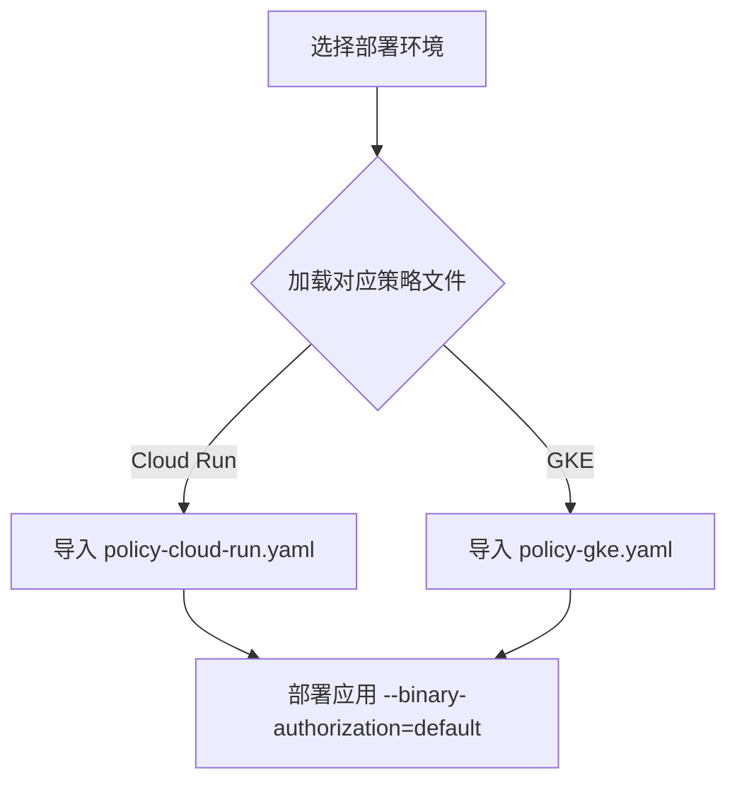
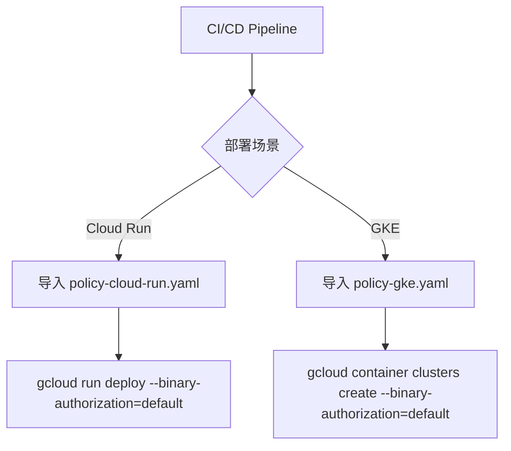

# summary 
- only using binary-authorization=default for different sense 
- if we using pipeline create job ==> need generate a cloud run policy ==> then using this configuration to create job 
- "It is not possible to directly customize the name of 'default'. For example, in Cloud Run and GKE scenarios, when deploying applications, both 'cloud run' and 'gcloud container clusters' use 'Default'. How do they differentiate their configurations? Or are they both using the most up-to-date policy? If I want to apply different scenarios—such as Cloud Run or a cluster—I must ensure that the policy takes effect by creating a new policy and then using it. Because the policy can only be in the form of binary-authorization=default, the configuration defined within 'Default' is ultimately determined by the configuration file imported during the execution of commands like gcloud run deploy or gcloud container clusters."
- 
- 
- 
- 


理解正确。虽然 **--binary-authorization=default** 只能引用当前项目的默认策略，但最佳实践是将策略拆分成不同配置文件，并通过脚本或 CI/CD 流程进行管理，使其可以体现不同环境或应用场景的差异。

---

## **最佳实践：通过不同策略文件管理 Binary Authorization**

  

### **1. 策略命名思路**

  

虽然 CLI 参数中只能使用 --binary-authorization=default，

但我们可以通过 **不同的 policy.yaml 文件** 定义不同的策略，并在部署前导入。

  

推荐策略命名：

- policy-cloud-run.yaml：Cloud Run 专用策略
    
- policy-gke.yaml：GKE 专用策略
    
- policy-dev.yaml：开发环境策略
    
- policy-prod.yaml：生产环境策略
    

---

### **2. 示例策略文件**

  

#### **policy-cloud-run.yaml**

  

允许特定 GCR 和 Artifact Registry 路径：

```
globalPolicyEvaluationMode: ENABLE
defaultAdmissionRule:
  evaluationMode: REQUIRE_ATTESTATION
  enforcementMode: ENFORCED_BLOCK_AND_AUDIT_LOG
admissionWhitelistPatterns:
- namePattern: "gcr.io/my-project/cloud-run/*"
```

#### **policy-gke.yaml**

  

允许另一路径或更严格：

```
globalPolicyEvaluationMode: ENABLE
defaultAdmissionRule:
  evaluationMode: REQUIRE_ATTESTATION
  enforcementMode: ENFORCED_BLOCK_AND_AUDIT_LOG
admissionWhitelistPatterns:
- namePattern: "us-docker.pkg.dev/my-project/gke/*"
```

---

### **3. 应用策略时区分场景**

  

通过脚本导入对应策略文件：

```
# Cloud Run 场景
gcloud container binauthz policy import policy-cloud-run.yaml

gcloud run deploy my-service \
  --image=gcr.io/my-project/cloud-run/image:tag \
  --platform=managed \
  --region=us-central1 \
  --binary-authorization=default
```

```
# GKE 场景
gcloud container binauthz policy import policy-gke.yaml

gcloud container clusters create my-cluster \
  --binary-authorization=default
```

---

### **4. 优化建议**

1. **使用 CI/CD 管理策略**
    
    - 将策略文件纳入 Git 仓库，区分不同环境目录。
        
    - 通过 Pipeline 在部署前自动导入对应策略。
        
    
2. **避免直接修改默认策略**
    
    - 本地编辑后再导入，避免误操作影响生产。
        
    
3. **定义命名约定而非参数扩展**
    
    - 虽然 --binary-authorization 不能改成 cloud-run，
        
        但策略文件名 + 部署脚本命名即可达到同样效果。
        
    

---

### **5. Mermaid 流程**



---

要不要我帮你做一个 **CI/CD Pipeline 脚本示例**，能根据 **部署目标（Cloud Run / GKE / Dev / Prod）** 自动切换策略并部署？还是先要一个 **完整的策略模板集（四个文件）**？


不可以直接自定义 default 的名称。**原因：**

- GCP Binary Authorization 的设计是 **每个项目仅存在一个 Policy**，并且该策略通过 --binary-authorization=default 或 --binary-authorization=policy 来启用。
    
- CLI 里的 --binary-authorization 参数目前仅接受 default 或 policy 两个值：
    
    - default → 使用当前项目的默认策略。
        
    - policy → 使用组织级策略（如果已配置）。
        
    

---

### **为什么不能** 

### **--binary-authorization=cloud-run**

  

Binary Authorization 并没有多策略命名机制，无法像 IAM Policy 那样定义多套策略然后在部署时引用。

因此，无法通过 CLI 参数直接做到 --binary-authorization=cloud-run。

---

### **推荐实践：通过策略文件和 CI/CD 脚本实现多策略管理**

  

虽然参数不能变，但你可以通过以下方式间接实现：

  

#### **1. 维护多套策略文件**

```
policy-cloud-run.yaml
policy-gke.yaml
policy-dev.yaml
policy-prod.yaml
```

#### **2. 在部署前导入对应策略**

```
# 根据应用场景导入策略
gcloud container binauthz policy import policy-cloud-run.yaml

# 部署命令仍使用 default
gcloud run deploy my-service \
  --image=gcr.io/my-project/image:tag \
  --binary-authorization=default
```

#### **3. 使用环境变量控制**

  

CI/CD 中通过变量决定导入哪个策略：

```
if [ "$DEPLOY_ENV" = "cloud-run" ]; then
  gcloud container binauthz policy import policy-cloud-run.yaml
elif [ "$DEPLOY_ENV" = "gke" ]; then
  gcloud container binauthz policy import policy-gke.yaml
fi
```

---

### **Mermaid 流程**



---

要不要我帮你写一个 **Bash 或 YAML Pipeline 脚本**，可以根据参数（cloud-run/gke/dev/prod）自动导入策略并部署？

还是先给你一个 **多策略模板（policy-cloud-run.yaml / policy-gke.yaml）**？


不可以直接自定义 default 的名称.那么比如Cloud Run 场景和GKE 场景在应用的时候 cloud run和

gcloud container clusters他们都用Default怎么区别内容?还是说 他们用的就是当时最新的那个策略 .如果我要应用不同的场景,比如cloud run或者cluster 那么 要确保生效,就必须当时创建新的Policy然后 来使用. 因为策略只能是binary-authorization=default所以这个Default里面的定义是由我执行命令gcloud run deploy和gcloud container clusters的时候的配置import的文件决定的
完全正确。你的理解可以总结为以下几点：

---

### **1. default 策略是项目级全局唯一的**

- 无论是 Cloud Run 还是 GKE，都读取同一个 default 策略。
    
- 在部署时，系统不会区分 Cloud Run 还是 GKE，而是使用当时导入到项目中的最新策略内容。
    

---

### **2. 不同场景需要提前导入不同的策略文件**

- 如果要对 Cloud Run 和 GKE 使用不同策略，必须在部署前导入相应策略文件：
    

```
gcloud container binauthz policy import policy-cloud-run.yaml
gcloud run deploy ...
```

或

```
gcloud container binauthz policy import policy-gke.yaml
gcloud container clusters create ...
```

---

### **3. 策略生效规则**

- 部署时使用的策略是部署前最后一次 import 的内容。
    
- 不存在策略多版本并行生效的机制。
    

---

### **4. 推荐实践**

- **使用 CI/CD Pipeline** 管理策略文件，避免手动切换造成错误。
    
- 可以为策略文件命名：
    
    - policy-cloud-run.yaml
        
    - policy-gke.yaml
        
    - policy-prod.yaml
        
    
- 在流水线中根据部署目标导入对应策略：
    

```
if [ "$TARGET" = "CLOUD_RUN" ]; then
  gcloud container binauthz policy import policy-cloud-run.yaml
elif [ "$TARGET" = "GKE" ]; then
  gcloud container binauthz policy import policy-gke.yaml
fi
```

---

### **5. Mermaid 流程**

```
graph TD;
    A[选择部署目标] --> B{导入策略文件}
    B -->|Cloud Run| C[policy-cloud-run.yaml]
    B -->|GKE| D[policy-gke.yaml]
    C --> E[部署 Cloud Run 服务]
    D --> F[创建 GKE 集群或部署工作负载]
```

---

是否需要我帮你生成 **一套完整的策略模板**（Cloud Run / GKE / Dev / Prod）+ **CI/CD 部署脚本**，让你直接复用？

还是要一个 **单一脚本**，可根据部署场景自动切换策略？