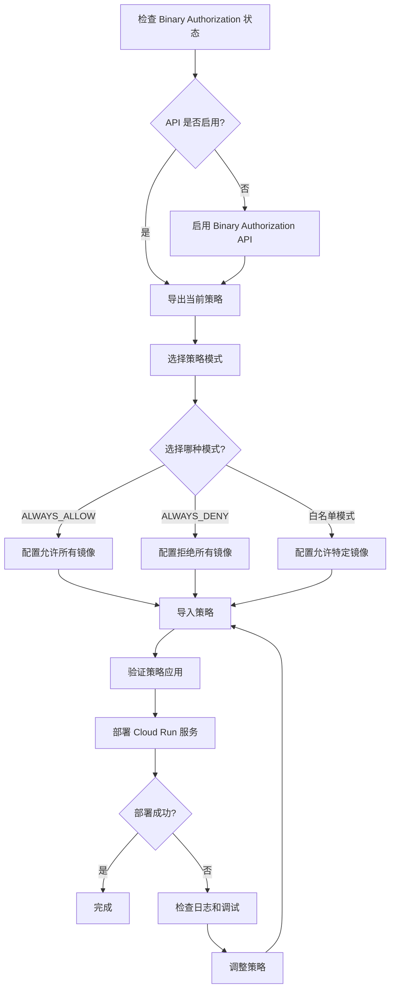

#claude
根据你的描述，你遇到了 GCP Binary Authorization 的违规问题。让我为你提供完整的解决方案和步骤。

## Binary Authorization 概述

Binary Authorization 是 GCP 的容器镜像验证服务，确保只有经过验证的镜像才能部署到你的环境中。

## 问题分析

当你使用 `binary-authorization=default` 参数时，GCP 会检查你的项目是否有适当的 Binary Authorization 策略配置。默认情况下可能没有配置，导致违规。

## 解决步骤

### 1. 检查当前 Binary Authorization 状态

```bash
# 检查当前策略
gcloud container binauthz policy export

# 检查是否启用了 Binary Authorization API
gcloud services list --enabled | grep binaryauthorization
```

### 2. 启用 Binary Authorization API

```bash
gcloud services enable binaryauthorization.googleapis.com
gcloud services enable containeranalysis.googleapis.com
```

### 3. 导出和修改策略

```bash
# 导出当前策略
gcloud container binauthz policy export > policy.yaml

# 备份原始策略
cp policy.yaml policy.yaml.backup
```

### 4. 策略配置选项

你有三个主要的评估模式选择：

#### 选项 A: ALWAYS_ALLOW（最宽松）

```yaml
admissionWhitelistPatterns: []
clustersAdmissionRules: {}
defaultAdmissionRule:
  enforcementMode: ENFORCED_BLOCK_AND_AUDIT_LOG
  evaluationMode: ALWAYS_ALLOW
  requireAttestationsBy: []
description: ""
etag: [current-etag]
name: projects/[PROJECT-ID]/policy
updateTime: [timestamp]
```

#### 选项 B: ALWAYS_DENY（最严格）

```yaml
admissionWhitelistPatterns: []
clustersAdmissionRules: {}
defaultAdmissionRule:
  enforcementMode: ENFORCED_BLOCK_AND_AUDIT_LOG
  evaluationMode: ALWAYS_DENY
  requireAttestationsBy: []
description: ""
etag: [current-etag]
name: projects/[PROJECT-ID]/policy
updateTime: [timestamp]
```

#### 选项 C: 允许特定镜像仓库

```yaml
admissionWhitelistPatterns:
- namePattern: "gcr.io/[PROJECT-ID]/*"
- namePattern: "us.gcr.io/[PROJECT-ID]/*"
- namePattern: "asia.gcr.io/[PROJECT-ID]/*"
- namePattern: "eu.gcr.io/[PROJECT-ID]/*"
clustersAdmissionRules: {}
defaultAdmissionRule:
  enforcementMode: ENFORCED_BLOCK_AND_AUDIT_LOG
  evaluationMode: ALWAYS_DENY ==> need Change to ALWAYS_ALLOW
  requireAttestationsBy: []
description: "Allow only project images"
etag: [current-etag]
name: projects/[PROJECT-ID]/policy
updateTime: [timestamp]
```

### 5. 应用策略

```bash
# 导入修改后的策略
gcloud container binauthz policy import policy.yaml

# 验证策略已应用
gcloud container binauthz policy export
```

## 针对 Cloud Run 的配置

### Cloud Run 特定设置

```bash
# 为 Cloud Run 服务配置 Binary Authorization
gcloud run deploy [SERVICE-NAME] \
  --image=[IMAGE-URL] \
  --platform=managed \
  --region=[REGION] \
  --binary-authorization=default
```

### 检查 Cloud Run 服务状态

```bash
# 检查服务配置
gcloud run services describe [SERVICE-NAME] --region=[REGION]

# 查看部署日志
gcloud logging read "resource.type=cloud_run_revision AND resource.labels.service_name=[SERVICE-NAME]" --limit=50
```

## 流程图



## 推荐配置

对于生产环境，我推荐使用白名单模式：

```yaml
admissionWhitelistPatterns:
- namePattern: "gcr.io/[YOUR-PROJECT-ID]/*"
- namePattern: "asia.gcr.io/[YOUR-PROJECT-ID]/*"
- namePattern: "docker.io/library/*"  # 如果需要公共镜像
clustersAdmissionRules: {}
defaultAdmissionRule:
  enforcementMode: ENFORCED_BLOCK_AND_AUDIT_LOG
  evaluationMode: REQUIRE_ATTESTATION
  requireAttestationsBy: []
description: "Production security policy"
```

## 故障排除

### 常见错误和解决方案

| 错误类型          | 原因                            | 解决方案                                                         |
| ----------------- | ------------------------------- | ---------------------------------------------------------------- |
| API not enabled   | Binary Authorization API 未启用 | 执行 `gcloud services enable binaryauthorization.googleapis.com` |
| Policy not found  | 没有策略配置                    | 创建并导入策略文件                                               |
| Image blocked     | 镜像不在白名单中                | 添加镜像模式到 `admissionWhitelistPatterns`                      |
| Permission denied | IAM 权限不足                    | 确保有 `roles/binaryauthorization.policyEditor` 角色             |

### 调试命令

```bash
# 查看详细日志
gcloud logging read "protoPayload.serviceName=binaryauthorization.googleapis.com" --limit=20

# 检查 IAM 权限
gcloud projects get-iam-policy [PROJECT-ID]

# 测试镜像是否被允许
gcloud container binauthz attestations list --artifact-url=[IMAGE-URL]
```

这样配置后，你的 Cloud Run 服务应该能够正常部署，同时满足 Binary Authorization 的安全要求。​​​​​​​​​​​​​​​​
