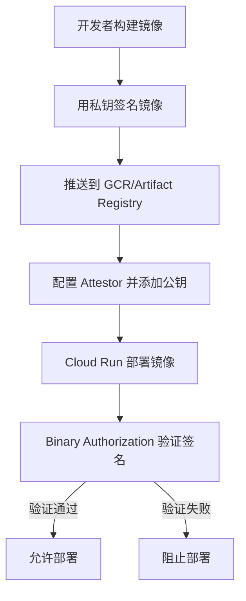
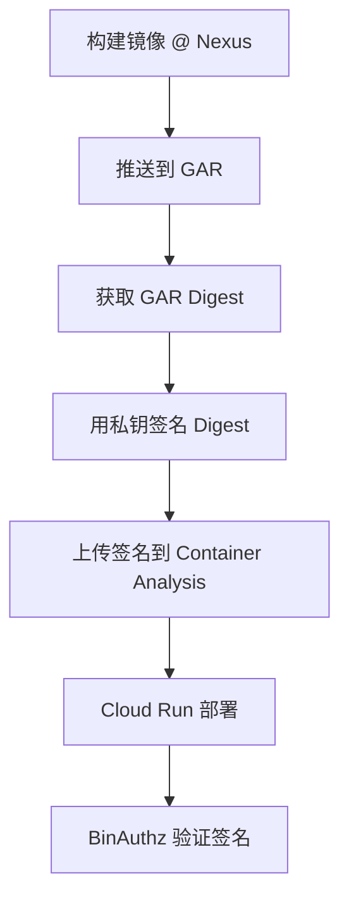

```
关于GCP Cloud Run 因为Violation要求 必须Binary Authorization比如我们需要配置Images的加密
允许特定镜像仓库比如我的attesters 为attestor-cloud-run 我的 container Analysis not ID 为note-cloud-run 
那么我如给给这个策略atttestor-cloud-run 添加PKIX keys and OpenPGP public keys 
我想了解如何创建这个PKIX Public key 和  OpenPGP public keys . 添加之后我还需要做些什么工作,比如我Build的我的Images的时候如何使用这个key去Build Images ?
关于,镜像构建完成需要用私钥签名。 我们默认构建镜像一般是在Nexus 然后把Nexus的包推送到GAR.所以用私钥签名步骤其实可以在Nexus阶段完成,也可以在推送到GAR之后再次签名?
GCP 默认提供了 Cloud Build Attestations 和 gcloud container binauthz attestations create，完全可以不用 cosign。 我就是用的这个命令创建了一个 比如名称为attester-cloud-run的 attesters . 参数--attestation-authority-note指定了一个值 但是Policy不允许用enforcementMode为DRYRUN_AUDIT_LOG_ONLY默认. 而且如果我们构建images不是使用Cloud Build.我们就是自己Build的Images,那么想要推送到GAR之后 重新签名 还要使用GCP的签名工具如何来实现?


```

# Summay

- 必须以 GAR 中的 Digest 为准签名
- GCP 默认提供了 **Cloud Build Attestations** 和 gcloud container binauthz attestations create，完全可以不用 cosign。
- Binary Authorization 必须用非对称密钥
- 需要定义一个签名的账户比如邮箱


```bash
gpg --list-secret-keys
gpg: directory '/Users/lex/.gnupg' created
gpg: /Users/lex/.gnupg/trustdb.gpg: trustdb created
```
# ChatGPT

好的，这个问题本质上是 **Binary Authorization（BinAuthz）在 Cloud Run 中的镜像签名和验证流程**。我来分步骤说明：

---

## **1. 问题分析**

你现在的目标是：

- 在 GCP Cloud Run 上启用 **Binary Authorization**。
- 限制 Cloud Run 只能运行被信任 attestor（如 attestor-cloud-run）签名的镜像。
- 使用 **PKIX 公钥** 或 **OpenPGP 公钥** 来验证镜像签名。
- 理解如何生成公私钥、配置 attestor、签名镜像，以及部署时如何触发验证。

---

## **2. 解决方案步骤**

### **步骤 1：生成密钥对**

Binary Authorization 支持两类密钥：

1. **PKIX 公钥（常见的是 X.509/PKI 格式，基于私钥签名，公钥验证）**

    建议用 cosign 或 openssl 生成。

```
# 使用 cosign 生成 PKIX 密钥对
cosign generate-key-pair
# 会生成 cosign.key (私钥) 和 cosign.pub (公钥)
```

1. 或者使用 OpenSSL：

```
openssl genpkey -algorithm RSA -out private.pem -pkeyopt rsa_keygen_bits:2048
openssl rsa -pubout -in private.pem -out public.pem
```

1.

2. **OpenPGP 公钥（GPG 格式）**

```
gpg --quick-generate-key "attestor-cloud-run <admin@example.com>" rsa2048 sign 1y
gpg --armor --export admin@example.com > public.gpg
gpg --armor --export-secret-keys admin@example.com > private.gpg
```

---

### **步骤 2：创建 Note 与 Attestor**

- **Note**：在 Container Analysis 中定义一个元数据条目（如 note-cloud-run）。
- **Attestor**：关联到 Note，用来验证签名。

```
gcloud container binauthz attestors create attestor-cloud-run \
    --project=$PROJECT_ID \
    --attestation-authority-note=note-cloud-run \
    --attestation-authority-note-project=$PROJECT_ID
```

---

### **步骤 3：添加公钥到 Attestor**

根据你使用的密钥类型：

**PKIX 公钥：**

```
gcloud container binauthz attestors public-keys add \
  --attestor=attestor-cloud-run \
  --keyversion-file=cosign.pub \
  --project=$PROJECT_ID
```

**OpenPGP 公钥：**

```
gcloud container binauthz attestors public-keys add \
  --attestor=attestor-cloud-run \
  --pgp-public-key-file=public.gpg \
  --project=$PROJECT_ID
```

---

### **步骤 4：签名镜像**

镜像构建完成（例如 gcr.io/$PROJECT_ID/myapp:tag）后，需要用私钥签名。

**使用 Cosign（PKIX）签名：**

```
cosign sign --key cosign.key gcr.io/$PROJECT_ID/myapp:tag
```

**使用 GPG（OpenPGP）签名：**

```
gcloud container binauthz attestations create \
  --artifact-url=gcr.io/$PROJECT_ID/myapp:tag \
  --attestor=attestor-cloud-run \
  --pgp-key-fingerprint="$(gpg --with-colons --fingerprint admin@example.com | grep fpr | head -n1 | cut -d: -f10)" \
  --signature-file=signature.pgp \
  --project=$PROJECT_ID
```

---

### **步骤 5：配置 Binary Authorization 策略**

最后，在 Cloud Run 上启用 Binary Authorization 策略，只允许被信任 attestor 签名的镜像运行：

```
gcloud binauthz policy export > policy.yaml
```

修改 policy.yaml，配置允许的 attestor，例如：

```
admissionWhitelistPatterns:
- namePattern: "gcr.io/google_containers/*"
defaultAdmissionRule:
  evaluationMode: ALWAYS_DENY
  enforcementMode: ENFORCED_BLOCK_AND_AUDIT_LOG
  requireAttestationsBy:
  - projects/$PROJECT_ID/attestors/attestor-cloud-run
```

应用：

```
gcloud binauthz policy import policy.yaml
```

---

## **3. 流程图**



---

## **4. 注意事项**

- **私钥管理**：必须放在安全位置（推荐 GCP KMS），不要直接存 Git。
- **Attestor 公钥**：公钥可以公开配置，但私钥必须保密。
- **多仓库支持**：策略里可配置多个 attestor 或允许的镜像前缀。
- **自动化签名**：建议在 CI/CD Pipeline（Cloud Build / GitHub Actions）中加入签名步骤。

---

要不要我帮你整理一份 **基于 cosign + PKIX keys 的 Cloud Run CI/CD 签名和部署完整示例**？这样你可以直接放进你们的 Pipeline 用。

# Which Process Sign

```
关于,镜像构建完成需要用私钥签名。 我们默认构建镜像一般是在Nexus 然后把Nexus的包推送到GAR.所以用私钥签名步骤其实可以在Nexus阶段完成,也可以在推送到GAR之后再次签名?
```

好问题 👍，你理解得很对。这里要区分 **镜像构建**、**推送** 和 **签名** 的顺序关系：

---

## **1. 核心原则**

- **Binary Authorization 验证的对象是镜像在仓库中的 Digest**（如 sha256:xxxx），而不是 tag。
- 因此，**签名必须绑定在最终仓库中的 Digest 上**。
- 只要最终存储在 **GAR（Artifact Registry）** 的镜像有签名，BinAuthz 就能校验。

---

## **2. 两种签名时机**

### **✅ 方式 A：构建完成后、推送到 GAR** 

### **之前**

### **签名**

- 在 Nexus 阶段构建镜像完成后，你可以：
    1. 构建镜像并 push 到 Nexus。
    2. 使用 Digest 或 tag 进行签名。
    3. 将签名和镜像一起 push 到 GAR。

**问题**：Digest 在不同 Registry 推送时可能变化（取决于 manifest/schema），导致签名失效。

👉 因此，**直接对 Nexus 中的 Digest 签名不一定能在 GAR 中被验证通过**。

---

### **✅ 方式 B：推送到 GAR** 

### **之后**

### **签名（推荐）**

- 镜像最终运行在 Cloud Run 时，Cloud Run 拉取的是 **GAR 里的 Digest**。
- 最安全的做法是：
    1. 构建镜像 -> push 到 GAR。
    2. 计算 GAR 中镜像的 Digest。
    3. 用私钥对该 Digest 进行签名。

```
# 获取 GAR 镜像的 digest
gcloud container images describe \
  $REGION-docker.pkg.dev/$PROJECT_ID/my-repo/myimage:tag \
  --format='value(image_summary.digest)'

# 用 cosign 签名
cosign sign --key cosign.key $REGION-docker.pkg.dev/$PROJECT_ID/my-repo/myimage@sha256:<digest>
```

这样保证签名和 Cloud Run 实际拉取的镜像一致。

---

## **3. 最佳实践**

结合 CI/CD 建议这样做：

1. **构建阶段（Nexus 内部用）**

    - Nexus 作为中转或内部缓存，不做最终签名。
    - 如果要内部验证，可加自签名，但不要作为 Cloud Run attestor 的最终来源。

2. **发布阶段（推送 GAR 后）**

    - 以 GAR digest 为准进行签名。
    - 将签名 push 到 Container Analysis，供 Binary Authorization 使用。

3. **Pipeline 集成**

    - Nexus → GAR 的迁移完成后，触发一个 **签名 Job**（用 cosign 或 gcloud binauthz 命令）。
    - 最后一步再触发 Cloud Run 部署。

---

## **4. 简化流程图**



---

✅ 结论：

**必须以 GAR 中的 Digest 为准签名**。

所以推荐 **推送到 GAR 后再签名**。如果在 Nexus 阶段签名，签名结果不保证能在 GAR 中复用。

---

要不要我给你写一个 **CI/CD 脚本模板（Cloud Build 或 GitHub Actions）**，自动完成 “push GAR → 获取 digest → 签名 → 部署 Cloud Run”？

# cosign

好问题 👍。

cosign 不是 GCP 自带的命令，它是 **Sigstore** 开源项目提供的签名工具，常用于容器镜像签名（PKIX/Keyless 签名），也是 Google 推荐搭配 **Binary Authorization** 的工具。

---

## **1. 安装** 

## **cosign**

### **Linux / macOS（推荐）**

```
# 安装最新版 cosign
curl -sSL https://github.com/sigstore/cosign/releases/latest/download/cosign-$(uname -s | tr '[:upper:]' '[:lower:]')-amd64 \
  -o /usr/local/bin/cosign

chmod +x /usr/local/bin/cosign
```

### **Homebrew (macOS / Linux)**

```
brew install cosign
```

### **Windows (Scoop)**

```
scoop install cosign
```

---

## **2. 验证安装**

```
cosign version
```

如果输出版本号，比如：

```
cosign version: v2.4.1
```

说明安装成功。

---

## **3. 在 GCP 上使用场景**

- **生成密钥对**：

```
cosign generate-key-pair
# 生成 cosign.key (私钥) 和 cosign.pub (公钥)
```

-
- **签名镜像**：

```
cosign sign --key cosign.key \
  $REGION-docker.pkg.dev/$PROJECT_ID/my-repo/myimage@sha256:<digest>
```

-
- **验证镜像签名**：

```
cosign verify --key cosign.pub \
  $REGION-docker.pkg.dev/$PROJECT_ID/my-repo/myimage@sha256:<digest>
```

---

## **4. 进阶（结合 GCP KMS）**

你也可以不用文件存储私钥，而是直接把私钥存在 **Cloud KMS**：

```
cosign generate-key-pair --kms gcpkms://projects/$PROJECT_ID/locations/global/keyRings/my-kr/cryptoKeys/my-key
```

然后签名时直接用 KMS：

```
cosign sign --key gcpkms://projects/$PROJECT_ID/locations/global/keyRings/my-kr/cryptoKeys/my-key \
  $REGION-docker.pkg.dev/$PROJECT_ID/my-repo/myimage@sha256:<digest>
```

这样就避免了私钥文件的管理问题。

---

要不要我帮你出一份 **“基于 cosign + Cloud KMS 的 GAR 镜像签名和 Cloud Run 部署流水线示例（Cloud Build 版本）”**？这样你们就不需要在 CI/CD 里管理私钥文件了。

有的 ✅。

在 GCP 里，除了用 cosign（第三方工具），Google 自己其实提供了 **内置的镜像签名与 Binary Authorization 集成工具**。

可以分三类：

---

## **1.** 

## **Cloud Build 内置签名**

如果你用 **Cloud Build** 构建并推送镜像到 GAR，Google 提供了一个叫 **Build Attestations** 的功能。

- 它可以自动生成一个 **SLSA 风格的 provenance（来源证明）**，并存储到 **Container Analysis API**。
- Binary Authorization 可以配置成 **只允许来自 Cloud Build 的镜像**。

使用方法：

1. 在 Cloud Build 触发器里加 --attestations 参数（或在 cloudbuild.yaml 启用 provenance）。
2. 构建完成后，镜像自动有 attestation，无需手动 cosign。

示例：

```
gcloud builds submit --region=us-central1 \
  --config=cloudbuild.yaml \
  --attestations
```

---

## **2.** 

## **gcloud container binauthz attestations create**

GCP 自带的命令，可以用来创建签名并上传到 Container Analysis。

这个命令支持：

- PKIX (X.509 公钥)
- OpenPGP (GPG 公钥)
- KMS（Google Cloud Key Management Service）

示例（用 Cloud KMS 签名）：

```
gcloud container binauthz attestations create \
  --artifact-url=$REGION-docker.pkg.dev/$PROJECT_ID/my-repo/myimage@sha256:<digest> \
  --attestor=attestor-cloud-run \
  --keyversion=$KMS_KEY_VERSION \
  --project=$PROJECT_ID
```

这样签名直接写入 Binary Authorization attestor，整个过程不用 cosign。

---

## **3.** 

## **KMS + Binary Authorization**

如果你不想自己维护私钥文件，可以直接把签名逻辑交给 **Cloud KMS**：

- 在 KMS 里生成非对称密钥（如 RSA）。
- 用 gcloud container binauthz attestations create 指定 --keyversion。
- Binary Authorization 会用 attestor 公钥验证签名。

---

## **对比：**

## **cosign**

##  **vs GCP 原生**

| **工具**                                | **优势**                                   | **适用场景**                                        |
| --------------------------------------- | ------------------------------------------ | --------------------------------------------------- |
| **cosign**                              | 跨云通用、支持 OIDC 无钥签名、社区生态丰富 | 需要多云兼容，或使用 Sigstore 生态（Rekor, Fulcio） |
| **Cloud Build Attestations**            | 完全托管、零配置、自动生成 provenance      | 已经用 Cloud Build 构建镜像                         |
| **gcloud binauthz attestations create** | 官方支持、直接绑定 KMS、公钥管理在 GCP 内  | 不用 cosign，想要 GCP 原生方案                      |

---

✅ 结论：

GCP 默认提供了 **Cloud Build Attestations** 和 gcloud container binauthz attestations create，完全可以不用 cosign。

---

要不要我帮你画一个对比流程图（cosign vs GCP 原生签名）？这样你能一眼看出什么时候该选哪种方案。


# Using GCP
```bash
GCP 默认提供了 Cloud Build Attestations 和 gcloud container binauthz attestations create，完全可以不用 cosign。 我就是用的这个命令创建了一个 比如名称为attester-cloud-run的 attesters . 参数--attestation-authority-note指定了一个值 但是Policy不允许用enforcementMode为DRYRUN_AUDIT_LOG_ONLY默认. 而且如果我们构建images不是使用Cloud Build.我们就是自己Build的Images,那么想要推送到GAR之后 重新签名 还要使用GCP的签名工具如何来实现?
```
你问得非常关键 👍。

场景总结一下：

- 你 **不是用 Cloud Build** 构建镜像，而是自己 build（可能在 Nexus 或本地 CI）。
    
- 镜像最终 push 到 **GAR**。
    
- Cloud Run 启用了 **Binary Authorization**，policy 里 **不能只用 DRYRUN_AUDIT_LOG_ONLY**，必须 **ENFORCED_BLOCK_AND_AUDIT_LOG**。
    
- 你已经有一个 attestor（如 attestor-cloud-run），并且用 --attestation-authority-note 绑定了 Note。
    

  

👉 需求就是：**如何在 GAR 镜像已经存在的情况下，用 GCP 原生工具签名？**

---

## **1. 核心思路**

  

无论镜像是怎么 build 的，只要最终 push 到 **GAR**，你都可以：

1. 获取镜像的 **digest**（sha256:...）。
    
2. 用 **Cloud KMS**（或 OpenPGP/PKIX 公钥）签名这个 digest。
    
3. 用 gcloud container binauthz attestations create 命令，把签名写入 Container Analysis。
    
4. Binary Authorization 在 Cloud Run 部署时，会验证该 digest 是否由 attestor 信任。
    

---

## **2. 实际命令步骤**

  

### **步骤 1：获取 GAR 镜像 digest**

```
gcloud container images describe \
  $REGION-docker.pkg.dev/$PROJECT_ID/my-repo/myimage:tag \
  --format='value(image_summary.digest)'
```

假设返回：

```
sha256:abcd1234ef5678...
```

---

### **步骤 2：使用 Cloud KMS 创建非对称密钥**

  

如果还没创建过，可以先在 GCP 里准备一把签名专用的私钥：

```
gcloud kms keyrings create my-keyring \
  --location=global

gcloud kms keys create my-signing-key \
  --location=global \
  --keyring=my-keyring \
  --purpose=asymmetric-signing \
  --default-algorithm=rsa-sign-pkcs1-2048-sha256
```

---

### **步骤 3：创建 attestor 并绑定 KMS 公钥**

```
gcloud container binauthz attestors create attestor-cloud-run \
  --attestation-authority-note=note-cloud-run \
  --attestation-authority-note-project=$PROJECT_ID \
  --project=$PROJECT_ID

gcloud container binauthz attestors public-keys add \
  --attestor=attestor-cloud-run \
  --keyversion=projects/$PROJECT_ID/locations/global/keyRings/my-keyring/cryptoKeys/my-signing-key/cryptoKeyVersions/1 \
  --project=$PROJECT_ID
```

---

### **步骤 4：创建镜像签名（attestation）**

```
gcloud container binauthz attestations create \
  --artifact-url=$REGION-docker.pkg.dev/$PROJECT_ID/my-repo/myimage@sha256:abcd1234ef5678... \
  --attestor=attestor-cloud-run \
  --keyversion=projects/$PROJECT_ID/locations/global/keyRings/my-keyring/cryptoKeys/my-signing-key/cryptoKeyVersions/1 \
  --project=$PROJECT_ID
```

这一步会调用 Cloud KMS 来签名 digest，并把签名存进 Container Analysis。

---

### **步骤 5：验证 attestation**

```
gcloud container binauthz attestations list \
  --attestor=attestor-cloud-run \
  --project=$PROJECT_ID
```

你应该能看到对应 digest 的签名。

---

## **3. Policy 配置示例**

  

Binary Authorization 策略（policy.yaml）里这样写：

```
defaultAdmissionRule:
  evaluationMode: ALWAYS_DENY
  enforcementMode: ENFORCED_BLOCK_AND_AUDIT_LOG
  requireAttestationsBy:
  - projects/$PROJECT_ID/attestors/attestor-cloud-run
```

导入：

```
gcloud binauthz policy import policy.yaml
```

这样 Cloud Run 只允许被 attestor-cloud-run 签名过的 GAR 镜像运行。

---

## **4. 总结**

- 如果 **不是 Cloud Build** 构建 → 一定要在 **GAR 中的 digest** 上重新签名。
    
- 推荐用 **Cloud KMS + gcloud container binauthz attestations create**，这样不需要 cosign，也不用担心私钥管理。
    
- 流程是：
    
    1. Push 镜像到 GAR。
        
    2. 获取 digest。
        
    3. 用 KMS 签名并生成 attestation。
        
    4. Binary Authorization 在部署时校验。
        
    

---

要不要我帮你写一个 **CI/CD 脚本模板（比如 GitLab CI / Jenkins pipeline）**，自动完成：

「Push GAR → 获取 digest → 调用 gcloud 签名 → 部署 Cloud Run」？