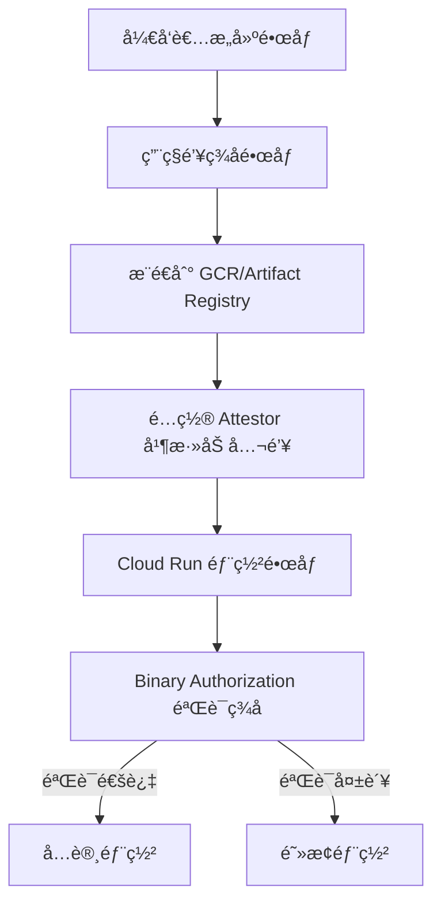
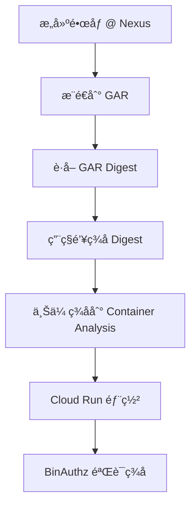

```
å…³äºGCP Cloud Run 因为Violationè¦æ±‚ å¿…é¡»Binary Authorization比如我们需è¦é…ç½®Images的加密
å…许特定镜åƒä»“库比如我的attesters 为attestor-cloud-run 我的 container Analysis not ID 为note-cloud-run 
那么我如给给这个策略atttestor-cloud-run 添加PKIX keys and OpenPGP public keys 
我想了解如何创建这个PKIX Public key 和  OpenPGP public keys . 添加之å我还需è¦åšäº›ä»€ä¹ˆå·¥ä½œ,比如我Build的我的Images的时候如何使用这个keyå»Build Images ?
å…³äº,é•œåƒæ„建完æˆéœ€è¦ç”¨ç§é’¥ç­¾å。 我们默认æ„建镜åƒä¸€èˆ¬æ˜¯åœ¨Nexus 然å把Nexus的包æ¨é€åˆ°GAR.所以用ç§é’¥ç­¾å步骤其å®å¯ä»¥åœ¨Nexus阶段完æˆ,也å¯ä»¥åœ¨æ¨é€åˆ°GAR之åå†æ¬¡ç­¾å?
GCP 默认æ供了 Cloud Build Attestations å’Œ gcloud container binauthz attestations create，完全å¯ä»¥ä¸ç”¨ cosign。 我就是用的这个命令创建了一个 比如å称为attester-cloud-runçš„ attesters . å‚æ•°--attestation-authority-note指定了一个值 但是Policyä¸å…许用enforcementMode为DRYRUN_AUDIT_LOG_ONLY默认. 而且如æœæˆ‘们æ„建imagesä¸æ˜¯ä½¿ç”¨Cloud Build.我们就是自己Buildçš„Images,那么想è¦æ¨é€åˆ°GAR之å é‡æ–°ç­¾å 还è¦ä½¿ç”¨GCPçš„ç­¾å工具如何æ¥å®ç°?


```

# Summay

- 必须以 GAR 中的 Digest 为准签å
- GCP 默认æ供了 **Cloud Build Attestations** å’Œ gcloud container binauthz attestations create，完全å¯ä»¥ä¸ç”¨ cosign。
- Binary Authorization 必须用é对称密钥
- 需è¦å®šä¹‰ä¸€ä¸ªç­¾å的账户比如邮箱


```bash
gpg --list-secret-keys
gpg: directory '/Users/lex/.gnupg' created
gpg: /Users/lex/.gnupg/trustdb.gpg: trustdb created
```
# ChatGPT

好的，这个问题本质上是 **Binary Authorization（BinAuthz）在 Cloud Run 中的镜åƒç­¾å和验è¯æµç¨‹**。我æ¥åˆ†æ­¥éª¤è¯´æ˜ï¼š

---

## **1. 问题分æ**

ä½ ç°åœ¨çš„目标是：

- 在 GCP Cloud Run 上å¯ç”¨ **Binary Authorization**。
- é™åˆ¶ Cloud Run åªèƒ½è¿è¡Œè¢«ä¿¡ä»» attestor（如 attestor-cloud-run）签åçš„é•œåƒã€‚
- 使用 **PKIX 公钥** 或 **OpenPGP 公钥** æ¥éªŒè¯é•œåƒç­¾å。
- ç†è§£å¦‚何生æˆå…¬ç§é’¥ã€é…ç½® attestorã€ç­¾åé•œåƒï¼Œä»¥åŠéƒ¨ç½²æ—¶å¦‚何触å‘验è¯ã€‚

---

## **2. 解决方案步骤**

### **步骤 1：生æˆå¯†é’¥å¯¹**

Binary Authorization 支æŒä¸¤ç±»å¯†é’¥ï¼š

1. **PKIX 公钥（常è§çš„是 X.509/PKI æ ¼å¼ï¼ŒåŸºäºç§é’¥ç­¾å，公钥验è¯ï¼‰**

    建议用 cosign 或 openssl 生æˆã€‚

```
# 使用 cosign ç”Ÿæˆ PKIX 密钥对
cosign generate-key-pair
# ä¼šç”Ÿæˆ cosign.key (ç§é’¥) å’Œ cosign.pub (公钥)
```

1. 或者使用 OpenSSL：

```
openssl genpkey -algorithm RSA -out private.pem -pkeyopt rsa_keygen_bits:2048
openssl rsa -pubout -in private.pem -out public.pem
```

1.

2. **OpenPGP 公钥（GPG æ ¼å¼ï¼‰**

```
gpg --quick-generate-key "attestor-cloud-run <admin@example.com>" rsa2048 sign 1y
gpg --armor --export admin@example.com > public.gpg
gpg --armor --export-secret-keys admin@example.com > private.gpg
```

---

### **步骤 2：创建 Note ä¸ Attestor**

- **Note**：在 Container Analysis 中定义一个元数æ®æ¡ç›®ï¼ˆå¦‚ note-cloud-run）。
- **Attestor**：关è”到 Note，用æ¥éªŒè¯ç­¾å。

```
gcloud container binauthz attestors create attestor-cloud-run \
    --project=$PROJECT_ID \
    --attestation-authority-note=note-cloud-run \
    --attestation-authority-note-project=$PROJECT_ID
```

---

### **步骤 3：添加公钥到 Attestor**

æ ¹æ®ä½ ä½¿ç”¨çš„密钥类å‹ï¼š

**PKIX 公钥：**

```
gcloud container binauthz attestors public-keys add \
  --attestor=attestor-cloud-run \
  --keyversion-file=cosign.pub \
  --project=$PROJECT_ID
```

**OpenPGP 公钥：**

```
gcloud container binauthz attestors public-keys add \
  --attestor=attestor-cloud-run \
  --pgp-public-key-file=public.gpg \
  --project=$PROJECT_ID
```

---

### **步骤 4：签åé•œåƒ**

é•œåƒæ„建完æˆï¼ˆä¾‹å¦‚ gcr.io/$PROJECT_ID/myapp:tag）å，需è¦ç”¨ç§é’¥ç­¾å。

**使用 Cosign（PKIX）签å：**

```
cosign sign --key cosign.key gcr.io/$PROJECT_ID/myapp:tag
```

**使用 GPG（OpenPGP）签å：**

```
gcloud container binauthz attestations create \
  --artifact-url=gcr.io/$PROJECT_ID/myapp:tag \
  --attestor=attestor-cloud-run \
  --pgp-key-fingerprint="$(gpg --with-colons --fingerprint admin@example.com | grep fpr | head -n1 | cut -d: -f10)" \
  --signature-file=signature.pgp \
  --project=$PROJECT_ID
```

---

### **步骤 5：é…ç½® Binary Authorization ç­–ç•¥**

最å，在 Cloud Run 上å¯ç”¨ Binary Authorization 策略，åªå…许被信任 attestor ç­¾åçš„é•œåƒè¿è¡Œï¼š

```
gcloud binauthz policy export > policy.yaml
```

修改 policy.yaml，é…ç½®å…许的 attestor，例如：

```
admissionWhitelistPatterns:
- namePattern: "gcr.io/google_containers/*"
defaultAdmissionRule:
  evaluationMode: ALWAYS_DENY
  enforcementMode: ENFORCED_BLOCK_AND_AUDIT_LOG
  requireAttestationsBy:
  - projects/$PROJECT_ID/attestors/attestor-cloud-run
```

应用：

```
gcloud binauthz policy import policy.yaml
```

---

## **3. æµç¨‹å›¾**



---

## **4. 注æ„事项**

- **ç§é’¥ç®¡ç†**：必须放在安全ä½ç½®ï¼ˆæ¨è GCP KMS），ä¸è¦ç›´æ¥å­˜ Git。
- **Attestor 公钥**：公钥å¯ä»¥å…¬å¼€é…置，但ç§é’¥å¿…é¡»ä¿å¯†ã€‚
- **多仓库支æŒ**：策略里å¯é…置多个 attestor 或å…许的镜åƒå‰ç¼€ã€‚
- **自动化签å**：建议在 CI/CD Pipeline（Cloud Build / GitHub Actions）中加入签å步骤。

---

è¦ä¸è¦æˆ‘帮你整ç†ä¸€ä»½ **åŸºäº cosign + PKIX keys çš„ Cloud Run CI/CD ç­¾å和部署完整示例**？这样你å¯ä»¥ç›´æ¥æ”¾è¿›ä½ ä»¬çš„ Pipeline 用。

# Which Process Sign

```
å…³äº,é•œåƒæ„建完æˆéœ€è¦ç”¨ç§é’¥ç­¾å。 我们默认æ„建镜åƒä¸€èˆ¬æ˜¯åœ¨Nexus 然å把Nexus的包æ¨é€åˆ°GAR.所以用ç§é’¥ç­¾å步骤其å®å¯ä»¥åœ¨Nexus阶段完æˆ,也å¯ä»¥åœ¨æ¨é€åˆ°GAR之åå†æ¬¡ç­¾å?
```

好问题 ğŸ‘，你ç†è§£å¾—很对。这里è¦åŒºåˆ† **é•œåƒæ„建**ã€**æ¨é€** å’Œ **ç­¾å** 的顺åºå…³ç³»ï¼š

---

## **1. 核心åŸåˆ™**

- **Binary Authorization 验è¯çš„对象是镜åƒåœ¨ä»“库中的 Digest**（如 sha256:xxxx），而ä¸æ˜¯ tag。
- 因此，**ç­¾å必须绑定在最终仓库中的 Digest 上**。
- åªè¦æœ€ç»ˆå­˜å‚¨åœ¨ **GAR（Artifact Registry）** çš„é•œåƒæœ‰ç­¾å，BinAuthz 就能校验。

---

## **2. 两ç§ç­¾å时机**

### **✅ æ–¹å¼ A：æ„建完æˆåã€æ¨é€åˆ° GAR** 

### **之å‰**

### **ç­¾å**

- 在 Nexus 阶段æ„建镜åƒå®Œæˆå，你å¯ä»¥ï¼š
    1. æ„建镜åƒå¹¶ push 到 Nexus。
    2. 使用 Digest 或 tag 进行签å。
    3. 将签å和镜åƒä¸€èµ· push 到 GAR。

**问题**：Digest 在ä¸åŒ Registry æ¨é€æ—¶å¯èƒ½å˜åŒ–（å–å†³äº manifest/schema），导致签å失效。

👉 因此，**ç›´æ¥å¯¹ Nexus 中的 Digest ç­¾åä¸ä¸€å®šèƒ½åœ¨ GAR 中被验è¯é€šè¿‡**。

---

### **✅ æ–¹å¼ B：æ¨é€åˆ° GAR** 

### **之å**

### **ç­¾å（æ¨è）**

- é•œåƒæœ€ç»ˆè¿è¡Œåœ¨ Cloud Run 时，Cloud Run 拉å–的是 **GAR 里的 Digest**。
- 最安全的åšæ³•æ˜¯ï¼š
    1. æ„å»ºé•œåƒ -> push 到 GAR。
    2. 计算 GAR 中镜åƒçš„ Digest。
    3. 用ç§é’¥å¯¹è¯¥ Digest 进行签å。

```
# è·å– GAR é•œåƒçš„ digest
gcloud container images describe \
  $REGION-docker.pkg.dev/$PROJECT_ID/my-repo/myimage:tag \
  --format='value(image_summary.digest)'

# 用 cosign ç­¾å
cosign sign --key cosign.key $REGION-docker.pkg.dev/$PROJECT_ID/my-repo/myimage@sha256:<digest>
```

这样ä¿è¯ç­¾åå’Œ Cloud Run å®é™…拉å–çš„é•œåƒä¸€è‡´ã€‚

---

## **3. 最佳å®è·µ**

ç»“åˆ CI/CD 建议这样åšï¼š

1. **æ„建阶段（Nexus 内部用）**

    - Nexus 作为中转或内部缓存，ä¸åšæœ€ç»ˆç­¾å。
    - 如æœè¦å†…部验è¯ï¼Œå¯åŠ è‡ªç­¾å，但ä¸è¦ä½œä¸º Cloud Run attestor 的最终æ¥æºã€‚

2. **å‘布阶段（æ¨é€ GAR å）**

    - 以 GAR digest 为准进行签å。
    - 将签å push 到 Container Analysis，供 Binary Authorization 使用。

3. **Pipeline 集æˆ**

    - Nexus → GAR çš„è¿ç§»å®Œæˆå，触å‘一个 **ç­¾å Job**（用 cosign 或 gcloud binauthz 命令）。
    - 最å一步å†è§¦å‘ Cloud Run 部署。

---

## **4. 简化æµç¨‹å›¾**



---

✅ 结论：

**必须以 GAR 中的 Digest 为准签å**。

所以æ¨è **æ¨é€åˆ° GAR åå†ç­¾å**。如æœåœ¨ Nexus 阶段签å，签å结æœä¸ä¿è¯èƒ½åœ¨ GAR 中å¤ç”¨ã€‚

---

è¦ä¸è¦æˆ‘给你写一个 **CI/CD 脚本模æ¿ï¼ˆCloud Build 或 GitHub Actions）**ï¼Œè‡ªåŠ¨å®Œæˆ â€œpush GAR → è·å– digest → ç­¾å → 部署 Cloud Runâ€ï¼Ÿ

# cosign

好问题 ğŸ‘。

cosign ä¸æ˜¯ GCP 自带的命令，它是 **Sigstore** å¼€æºé¡¹ç›®æ供的签å工具，常用äºå®¹å™¨é•œåƒç­¾å（PKIX/Keyless ç­¾å），也是 Google æ¨èæ­é… **Binary Authorization** 的工具。

---

## **1. 安装** 

## **cosign**

### **Linux / macOS（æ¨è）**

```
# 安装最新版 cosign
curl -sSL https://github.com/sigstore/cosign/releases/latest/download/cosign-$(uname -s | tr '[:upper:]' '[:lower:]')-amd64 \
  -o /usr/local/bin/cosign

chmod +x /usr/local/bin/cosign
```

### **Homebrew (macOS / Linux)**

```
brew install cosign
```

### **Windows (Scoop)**

```
scoop install cosign
```

---

## **2. 验è¯å®‰è£…**

```
cosign version
```

如æœè¾“出版本å·ï¼Œæ¯”如：

```
cosign version: v2.4.1
```

说æ˜å®‰è£…æˆåŠŸã€‚

---

## **3. 在 GCP 上使用场景**

- **生æˆå¯†é’¥å¯¹**：

```
cosign generate-key-pair
# ç”Ÿæˆ cosign.key (ç§é’¥) å’Œ cosign.pub (公钥)
```

-
- **ç­¾åé•œåƒ**：

```
cosign sign --key cosign.key \
  $REGION-docker.pkg.dev/$PROJECT_ID/my-repo/myimage@sha256:<digest>
```

-
- **验è¯é•œåƒç­¾å**：

```
cosign verify --key cosign.pub \
  $REGION-docker.pkg.dev/$PROJECT_ID/my-repo/myimage@sha256:<digest>
```

---

## **4. è¿›é˜¶ï¼ˆç»“åˆ GCP KMS）**

你也å¯ä»¥ä¸ç”¨æ–‡ä»¶å­˜å‚¨ç§é’¥ï¼Œè€Œæ˜¯ç›´æ¥æŠŠç§é’¥å­˜åœ¨ **Cloud KMS**：

```
cosign generate-key-pair --kms gcpkms://projects/$PROJECT_ID/locations/global/keyRings/my-kr/cryptoKeys/my-key
```

然åç­¾å时直æ¥ç”¨ KMS：

```
cosign sign --key gcpkms://projects/$PROJECT_ID/locations/global/keyRings/my-kr/cryptoKeys/my-key \
  $REGION-docker.pkg.dev/$PROJECT_ID/my-repo/myimage@sha256:<digest>
```

这样就é¿å…了ç§é’¥æ–‡ä»¶çš„管ç†é—®é¢˜ã€‚

---

è¦ä¸è¦æˆ‘帮你出一份 **â€œåŸºäº cosign + Cloud KMS çš„ GAR é•œåƒç­¾åå’Œ Cloud Run 部署æµæ°´çº¿ç¤ºä¾‹ï¼ˆCloud Build 版本）â€**？这样你们就ä¸éœ€è¦åœ¨ CI/CD 里管ç†ç§é’¥æ–‡ä»¶äº†ã€‚

有的 ✅。

在 GCP 里，除了用 cosign（第三方工具），Google 自己其å®æ供了 **内置的镜åƒç­¾åä¸ Binary Authorization 集æˆå·¥å…·**。

å¯ä»¥åˆ†ä¸‰ç±»ï¼š

---

## **1.** 

## **Cloud Build 内置签å**

如æœä½ ç”¨ **Cloud Build** æ„建并æ¨é€é•œåƒåˆ° GAR，Google æä¾›äº†ä¸€ä¸ªå« **Build Attestations** 的功能。

- 它å¯ä»¥è‡ªåŠ¨ç”Ÿæˆä¸€ä¸ª **SLSA é£æ ¼çš„ provenance（æ¥æºè¯æ˜ï¼‰**，并存储到 **Container Analysis API**。
- Binary Authorization å¯ä»¥é…ç½®æˆ **åªå…许æ¥è‡ª Cloud Build çš„é•œåƒ**。

使用方法：

1. 在 Cloud Build 触å‘器里加 --attestations å‚数（或在 cloudbuild.yaml å¯ç”¨ provenance）。
2. æ„建完æˆå，镜åƒè‡ªåŠ¨æœ‰ attestation，无需手动 cosign。

示例：

```
gcloud builds submit --region=us-central1 \
  --config=cloudbuild.yaml \
  --attestations
```

---

## **2.** 

## **gcloud container binauthz attestations create**

GCP 自带的命令，å¯ä»¥ç”¨æ¥åˆ›å»ºç­¾å并上传到 Container Analysis。

这个命令支æŒï¼š

- PKIX (X.509 公钥)
- OpenPGP (GPG 公钥)
- KMS（Google Cloud Key Management Service）

示例（用 Cloud KMS ç­¾å）：

```
gcloud container binauthz attestations create \
  --artifact-url=$REGION-docker.pkg.dev/$PROJECT_ID/my-repo/myimage@sha256:<digest> \
  --attestor=attestor-cloud-run \
  --keyversion=$KMS_KEY_VERSION \
  --project=$PROJECT_ID
```

这样签åç›´æ¥å†™å…¥ Binary Authorization attestor，整个过程ä¸ç”¨ cosign。

---

## **3.** 

## **KMS + Binary Authorization**

如æœä½ ä¸æƒ³è‡ªå·±ç»´æŠ¤ç§é’¥æ–‡ä»¶ï¼Œå¯ä»¥ç›´æ¥æŠŠç­¾å逻辑交给 **Cloud KMS**：

- 在 KMS 里生æˆé对称密钥（如 RSA）。
- 用 gcloud container binauthz attestations create 指定 --keyversion。
- Binary Authorization 会用 attestor 公钥验è¯ç­¾å。

---

## **对比：**

## **cosign**

##  **vs GCP åŸç”Ÿ**

| **工具**                                | **优势**                                   | **适用场景**                                        |
| --------------------------------------- | ------------------------------------------ | --------------------------------------------------- |
| **cosign**                              | 跨云通用ã€æ”¯æŒ OIDC 无钥签åã€ç¤¾åŒºç”Ÿæ€ä¸°å¯Œ | 需è¦å¤šäº‘兼容，或使用 Sigstore 生æ€ï¼ˆRekor, Fulcio） |
| **Cloud Build Attestations**            | 完全托管ã€é›¶é…ç½®ã€è‡ªåŠ¨ç”Ÿæˆ provenance      | å·²ç»ç”¨ Cloud Build æ„å»ºé•œåƒ                         |
| **gcloud binauthz attestations create** | 官方支æŒã€ç›´æ¥ç»‘定 KMSã€å…¬é’¥ç®¡ç†åœ¨ GCP 内  | ä¸ç”¨ cosignï¼Œæƒ³è¦ GCP åŸç”Ÿæ–¹æ¡ˆ                      |

---

✅ 结论：

GCP 默认æ供了 **Cloud Build Attestations** å’Œ gcloud container binauthz attestations create，完全å¯ä»¥ä¸ç”¨ cosign。

---

è¦ä¸è¦æˆ‘帮你画一个对比æµç¨‹å›¾ï¼ˆcosign vs GCP åŸç”Ÿç­¾å）？这样你能一眼看出什么时候该选哪ç§æ–¹æ¡ˆã€‚


# Using GCP
```bash
GCP 默认æ供了 Cloud Build Attestations å’Œ gcloud container binauthz attestations create，完全å¯ä»¥ä¸ç”¨ cosign。 我就是用的这个命令创建了一个 比如å称为attester-cloud-runçš„ attesters . å‚æ•°--attestation-authority-note指定了一个值 但是Policyä¸å…许用enforcementMode为DRYRUN_AUDIT_LOG_ONLY默认. 而且如æœæˆ‘们æ„建imagesä¸æ˜¯ä½¿ç”¨Cloud Build.我们就是自己Buildçš„Images,那么想è¦æ¨é€åˆ°GAR之å é‡æ–°ç­¾å 还è¦ä½¿ç”¨GCPçš„ç­¾å工具如何æ¥å®ç°?
```
你问得é常关键 ğŸ‘。

场景总结一下：

- ä½  **ä¸æ˜¯ç”¨ Cloud Build** æ„建镜åƒï¼Œè€Œæ˜¯è‡ªå·± build（å¯èƒ½åœ¨ Nexus 或本地 CI）。
    
- é•œåƒæœ€ç»ˆ push 到 **GAR**。
    
- Cloud Run å¯ç”¨äº† **Binary Authorization**，policy 里 **ä¸èƒ½åªç”¨ DRYRUN_AUDIT_LOG_ONLY**，必须 **ENFORCED_BLOCK_AND_AUDIT_LOG**。
    
- ä½ å·²ç»æœ‰ä¸€ä¸ª attestor（如 attestor-cloud-run），并且用 --attestation-authority-note 绑定了 Note。
    

  

👉 需求就是：**如何在 GAR é•œåƒå·²ç»å­˜åœ¨çš„情况下，用 GCP åŸç”Ÿå·¥å…·ç­¾å？**

---

## **1. 核心æ€è·¯**

  

无论镜åƒæ˜¯æ€ä¹ˆ build 的，åªè¦æœ€ç»ˆ push 到 **GAR**，你都å¯ä»¥ï¼š

1. è·å–é•œåƒçš„ **digest**（sha256:...）。
    
2. 用 **Cloud KMS**（或 OpenPGP/PKIX 公钥）签å这个 digest。
    
3. 用 gcloud container binauthz attestations create 命令，把签å写入 Container Analysis。
    
4. Binary Authorization 在 Cloud Run 部署时，会验è¯è¯¥ digest 是å¦ç”± attestor 信任。
    

---

## **2. å®é™…命令步骤**

  

### **步骤 1：è·å– GAR é•œåƒ digest**

```
gcloud container images describe \
  $REGION-docker.pkg.dev/$PROJECT_ID/my-repo/myimage:tag \
  --format='value(image_summary.digest)'
```

å‡è®¾è¿”å›ï¼š

```
sha256:abcd1234ef5678...
```

---

### **步骤 2：使用 Cloud KMS 创建é对称密钥**

  

如æœè¿˜æ²¡åˆ›å»ºè¿‡ï¼Œå¯ä»¥å…ˆåœ¨ GCP 里准备一把签å专用的ç§é’¥ï¼š

```
gcloud kms keyrings create my-keyring \
  --location=global

gcloud kms keys create my-signing-key \
  --location=global \
  --keyring=my-keyring \
  --purpose=asymmetric-signing \
  --default-algorithm=rsa-sign-pkcs1-2048-sha256
```

---

### **步骤 3：创建 attestor 并绑定 KMS 公钥**

```
gcloud container binauthz attestors create attestor-cloud-run \
  --attestation-authority-note=note-cloud-run \
  --attestation-authority-note-project=$PROJECT_ID \
  --project=$PROJECT_ID

gcloud container binauthz attestors public-keys add \
  --attestor=attestor-cloud-run \
  --keyversion=projects/$PROJECT_ID/locations/global/keyRings/my-keyring/cryptoKeys/my-signing-key/cryptoKeyVersions/1 \
  --project=$PROJECT_ID
```

---

### **步骤 4：创建镜åƒç­¾å（attestation）**

```
gcloud container binauthz attestations create \
  --artifact-url=$REGION-docker.pkg.dev/$PROJECT_ID/my-repo/myimage@sha256:abcd1234ef5678... \
  --attestor=attestor-cloud-run \
  --keyversion=projects/$PROJECT_ID/locations/global/keyRings/my-keyring/cryptoKeys/my-signing-key/cryptoKeyVersions/1 \
  --project=$PROJECT_ID
```

这一步会调用 Cloud KMS æ¥ç­¾å digest，并把签å存进 Container Analysis。

---

### **步骤 5ï¼šéªŒè¯ attestation**

```
gcloud container binauthz attestations list \
  --attestor=attestor-cloud-run \
  --project=$PROJECT_ID
```

你应该能看到对应 digest çš„ç­¾å。

---

## **3. Policy é…置示例**

  

Binary Authorization 策略（policy.yaml）里这样写：

```
defaultAdmissionRule:
  evaluationMode: ALWAYS_DENY
  enforcementMode: ENFORCED_BLOCK_AND_AUDIT_LOG
  requireAttestationsBy:
  - projects/$PROJECT_ID/attestors/attestor-cloud-run
```

导入：

```
gcloud binauthz policy import policy.yaml
```

这样 Cloud Run åªå…许被 attestor-cloud-run ç­¾å过的 GAR é•œåƒè¿è¡Œã€‚

---

## **4. 总结**

- å¦‚æœ **ä¸æ˜¯ Cloud Build** æ„建 → 一定è¦åœ¨ **GAR 中的 digest** 上é‡æ–°ç­¾å。
    
- æ¨è用 **Cloud KMS + gcloud container binauthz attestations create**，这样ä¸éœ€è¦ cosign，也ä¸ç”¨æ‹…心ç§é’¥ç®¡ç†ã€‚
    
- æµç¨‹æ˜¯ï¼š
    
    1. Push é•œåƒåˆ° GAR。
        
    2. è·å– digest。
        
    3. 用 KMS ç­¾åå¹¶ç”Ÿæˆ attestation。
        
    4. Binary Authorization 在部署时校验。
        
    

---

è¦ä¸è¦æˆ‘帮你写一个 **CI/CD 脚本模æ¿ï¼ˆæ¯”如 GitLab CI / Jenkins pipeline）**，自动完æˆï¼š

「Push GAR → è·å– digest → 调用 gcloud ç­¾å → 部署 Cloud Runã€ï¼Ÿ