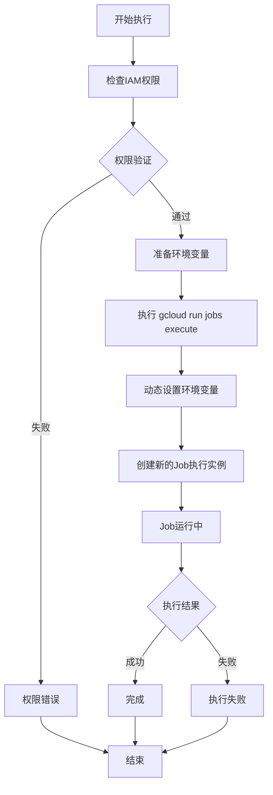

# Q

关于 GCP 工程里面的 Cloud Run. 我想要给予一个帐户仅仅有执行任务的权限，比如 roles 是 run.invoker. 我现在先要探索这个执行 Job 的命令 比如 gcloud run jobs execute 想要让其动态更新 env ,那我们既然是更新那么我创建任务的时候不需要带着些 key,然后随意赋值。还是说不想要，只需要 gcloud run jobs execute —update-env-vars 就可以了.比如说我现在需要这几个 KEY。
ACTION RELEASE_ID PARAMS_GIT_REPO TOOL_NEXUT_PATH PURL

# Claude

对于 Cloud Run Jobs 的环境变量动态更新，有两种方式可以实现：

## 方案对比

| 方案     | 创建时是否需要预设 | 执行时更新方式      | 适用场景           |
| -------- | ------------------ | ------------------- | ------------------ |
| 预设空值 | 需要设置默认值     | `--update-env-vars` | 固定的环境变量集合 |
| 动态添加 | 不需要             | `--update-env-vars` | 灵活的环境变量需求 |

## 推荐方案：创建时不预设，执行时动态添加

### 1. 创建 Job（不设置目标环境变量）

```bash
gcloud run jobs create my-job \
    --image gcr.io/PROJECT_ID/my-image \
    --region REGION \
    --memory 1Gi \
    --cpu 1
```

### 2. 执行时动态更新环境变量

```bash
gcloud run jobs execute my-job \
    --update-env-vars ACTION=deploy,RELEASE_ID=v1.2.3,PARAMS_GIT_REPO=https://github.com/user/repo,TOOL_NEXUS_PATH=/path/to/nexus,PURL=pkg:maven/group/artifact@1.0.0 \
    --region REGION
```

## IAM 权限配置

对于只执行任务的账户，需要以下权限：

```bash
# 基础执行权限
gcloud projects add-iam-policy-binding PROJECT_ID \
    --member="serviceAccount:SERVICE_ACCOUNT@PROJECT_ID.iam.gserviceaccount.com" \
    --role="roles/run.invoker"

# 如果需要更新环境变量，还需要
gcloud projects add-iam-policy-binding PROJECT_ID \
    --member="serviceAccount:SERVICE_ACCOUNT@PROJECT_ID.iam.gserviceaccount.com" \
    --role="roles/run.developer"
```

## 执行流程图



## 实际使用示例

```bash
#!/bin/bash

# 设置变量
JOB_NAME="my-deployment-job"
REGION="asia-east1"
ACTION="deploy"
RELEASE_ID="v$(date +%Y%m%d-%H%M%S)"
PARAMS_GIT_REPO="https://github.com/myorg/myrepo"
TOOL_NEXUS_PATH="/opt/nexus/repository"
PURL="pkg:maven/com.example/myapp@${RELEASE_ID}"

# 执行任务
gcloud run jobs execute ${JOB_NAME} \
    --update-env-vars ACTION=${ACTION},RELEASE_ID=${RELEASE_ID},PARAMS_GIT_REPO=${PARAMS_GIT_REPO},TOOL_NEXUS_PATH=${TOOL_NEXUS_PATH},PURL=${PURL} \
    --region ${REGION} \
    --wait
```

## 注意事项

- `--update-env-vars` 会完全替换现有的环境变量，如果需要保留原有变量，使用 `--add-env-vars`
- 环境变量值中包含特殊字符时需要适当转义
- `roles/run.invoker` 权限足够执行，但更新环境变量需要 `roles/run.developer`

这种方式更灵活，避免了创建时的环境变量预设，可以根据实际需求动态传入不同的参数值。​​​​​​​​​​​​​​​​

# ChatGPT

在 GCP 的 Cloud Run Jobs 中，如果你想要 在执行时动态传入环境变量（比如：ACTION、RELEASE_ID、PARAMS_GIT_REPO 等），可以使用 gcloud run jobs execute 命令的 --update-env-vars 选项，而不需要在创建 Job 时绑定这些 Key。

✅ 建议做法：Job 创建时不预设敏感变量，仅在执行时注入

🧩 创建 Job（不带敏感环境变量）

gcloud run jobs create my-job \

--image=gcr.io/my-project/my-image \

--region=asia-northeast1 \

--vpc-connector=my-connector \

--memory=512Mi \

--cpu=1 \

--max-retries=1

🚀 执行 Job 时动态注入环境变量

gcloud run jobs execute my-job \

--region=asia-northeast1 \

--update-env-vars="ACTION=build,RELEASE_ID=1234,PARAMS_GIT_REPO=https://github.com/example/repo.git,TOOL_NEXUT_PATH=/opt/tool,PURL=package://some.pkg"

- 此方式会临时更新环境变量，仅作用于当前执行，不会更改 Job 本身。
- 下次执行（未传 --update-env-vars）时，不会携带这些值。

✅ 权限控制建议（最低权限执行 Job）

|                                      |                                                             |
| ------------------------------------ | ----------------------------------------------------------- |
| 角色                                 | 用途                                                        |
| roles/run.invoker                    | 允许调用 Job（即执行 gcloud run jobs execute）              |
| roles/iam.serviceAccountUser（可选） | 如果用 --impersonate-service-account 调用，需要附加这个角色 |

gcloud projects add-iam-policy-binding my-project \

--member="user:someone@example.com" \

--role="roles/run.invoker"

✅ 补充说明

- --update-env-vars 只能在执行（gcloud run jobs execute）时使用；
- 如果想让变量永久保存在 Job 中，必须在创建或更新 Job（gcloud run jobs update）时传入；
- 不建议在 Job 创建时写死如 RELEASE_ID 等变量，推荐执行时注入以支持自动化。

✅ 最终执行命令范例：

gcloud run jobs execute my-job \

--region=asia-northeast1 \

--update-env-vars="ACTION=deploy,RELEASE_ID=20250723,PARAMS_GIT_REPO=https://github.com/myorg/repo.git,TOOL_NEXUT_PATH=/usr/local/tool,PURL=pkg:maven/com.example/my-app@1.0.0"

是否需要帮你写一个完整的 Job YAML 或 bash 脚本模版？
