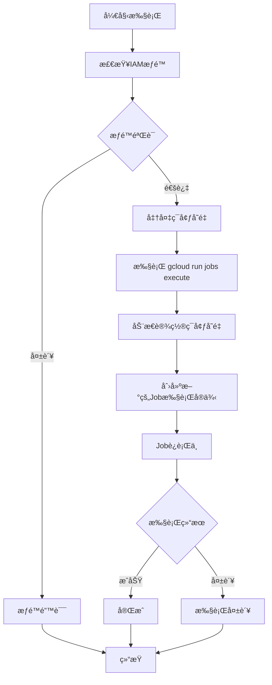

# Q

å…³äº GCP 工程里é¢çš„ Cloud Run. 我想è¦ç»™äºˆä¸€ä¸ªå¸æˆ·ä»…仅有执行任务的æƒé™ï¼Œæ¯”如 roles 是 run.invoker. 我ç°åœ¨å…ˆè¦æ¢ç´¢è¿™ä¸ªæ‰§è¡Œ Job 的命令 比如 gcloud run jobs execute 想è¦è®©å…¶åŠ¨æ€æ›´æ–° env ,那我们既然是更新那么我创建任务的时候ä¸éœ€è¦å¸¦ç€äº› key,然åéšæ„赋值。还是说ä¸æƒ³è¦ï¼Œåªéœ€è¦ gcloud run jobs execute —update-env-vars å°±å¯ä»¥äº†.比如说我ç°åœ¨éœ€è¦è¿™å‡ ä¸ª KEY。
ACTION RELEASE_ID PARAMS_GIT_REPO TOOL_NEXUT_PATH PURL

# Claude

å¯¹äº Cloud Run Jobs çš„ç¯å¢ƒå˜é‡åŠ¨æ€æ›´æ–°ï¼Œæœ‰ä¸¤ç§æ–¹å¼å¯ä»¥å®ç°ï¼š

## 方案对比

| 方案     | 创建时是å¦éœ€è¦é¢„设 | æ‰§è¡Œæ—¶æ›´æ–°æ–¹å¼      | 适用场景           |
| -------- | ------------------ | ------------------- | ------------------ |
| 预设空值 | 需è¦è®¾ç½®é»˜è®¤å€¼     | `--update-env-vars` | 固定的ç¯å¢ƒå˜é‡é›†åˆ |
| 动æ€æ·»åŠ  | ä¸éœ€è¦             | `--update-env-vars` | çµæ´»çš„ç¯å¢ƒå˜é‡éœ€æ±‚ |

## æ¨è方案：创建时ä¸é¢„设，执行时动æ€æ·»åŠ 

### 1. 创建 Job（ä¸è®¾ç½®ç›®æ ‡ç¯å¢ƒå˜é‡ï¼‰

```bash
gcloud run jobs create my-job \
    --image gcr.io/PROJECT_ID/my-image \
    --region REGION \
    --memory 1Gi \
    --cpu 1
```

### 2. 执行时动æ€æ›´æ–°ç¯å¢ƒå˜é‡

```bash
gcloud run jobs execute my-job \
    --update-env-vars ACTION=deploy,RELEASE_ID=v1.2.3,PARAMS_GIT_REPO=https://github.com/user/repo,TOOL_NEXUS_PATH=/path/to/nexus,PURL=pkg:maven/group/artifact@1.0.0 \
    --region REGION
```

## IAM æƒé™é…ç½®

对äºåªæ‰§è¡Œä»»åŠ¡çš„账户，需è¦ä»¥ä¸‹æƒé™ï¼š

```bash
# 基础执行æƒé™
gcloud projects add-iam-policy-binding PROJECT_ID \
    --member="serviceAccount:SERVICE_ACCOUNT@PROJECT_ID.iam.gserviceaccount.com" \
    --role="roles/run.invoker"

# 如æœéœ€è¦æ›´æ–°ç¯å¢ƒå˜é‡ï¼Œè¿˜éœ€è¦
gcloud projects add-iam-policy-binding PROJECT_ID \
    --member="serviceAccount:SERVICE_ACCOUNT@PROJECT_ID.iam.gserviceaccount.com" \
    --role="roles/run.developer"
```

## 执行æµç¨‹å›¾



## å®é™…使用示例

```bash
#!/bin/bash

# 设置å˜é‡
JOB_NAME="my-deployment-job"
REGION="asia-east1"
ACTION="deploy"
RELEASE_ID="v$(date +%Y%m%d-%H%M%S)"
PARAMS_GIT_REPO="https://github.com/myorg/myrepo"
TOOL_NEXUS_PATH="/opt/nexus/repository"
PURL="pkg:maven/com.example/myapp@${RELEASE_ID}"

# 执行任务
gcloud run jobs execute ${JOB_NAME} \
    --update-env-vars ACTION=${ACTION},RELEASE_ID=${RELEASE_ID},PARAMS_GIT_REPO=${PARAMS_GIT_REPO},TOOL_NEXUS_PATH=${TOOL_NEXUS_PATH},PURL=${PURL} \
    --region ${REGION} \
    --wait
```

## 注æ„事项

- `--update-env-vars` 会完全替æ¢ç°æœ‰çš„ç¯å¢ƒå˜é‡ï¼Œå¦‚æœéœ€è¦ä¿ç•™åŸæœ‰å˜é‡ï¼Œä½¿ç”¨ `--add-env-vars`
- ç¯å¢ƒå˜é‡å€¼ä¸­åŒ…å«ç‰¹æ®Šå­—符时需è¦é€‚当转义
- `roles/run.invoker` æƒé™è¶³å¤Ÿæ‰§è¡Œï¼Œä½†æ›´æ–°ç¯å¢ƒå˜é‡éœ€è¦ `roles/run.developer`

è¿™ç§æ–¹å¼æ›´çµæ´»ï¼Œé¿å…了创建时的ç¯å¢ƒå˜é‡é¢„设，å¯ä»¥æ ¹æ®å®é™…需求动æ€ä¼ å…¥ä¸åŒçš„å‚数值。​​​​​​​​​​​​​​​​

# ChatGPT

在 GCP çš„ Cloud Run Jobs 中，如æœä½ æƒ³è¦ 在执行时动æ€ä¼ å…¥ç¯å¢ƒå˜é‡ï¼ˆæ¯”如：ACTIONã€RELEASE_IDã€PARAMS_GIT_REPO 等），å¯ä»¥ä½¿ç”¨ gcloud run jobs execute 命令的 --update-env-vars 选项，而ä¸éœ€è¦åœ¨åˆ›å»º Job 时绑定这些 Key。

✅ 建议åšæ³•ï¼šJob 创建时ä¸é¢„设æ•æ„Ÿå˜é‡ï¼Œä»…在执行时注入

🧩 创建 Job（ä¸å¸¦æ•æ„Ÿç¯å¢ƒå˜é‡ï¼‰

gcloud run jobs create my-job \

--image=gcr.io/my-project/my-image \

--region=asia-northeast1 \

--vpc-connector=my-connector \

--memory=512Mi \

--cpu=1 \

--max-retries=1

🚀 执行 Job 时动æ€æ³¨å…¥ç¯å¢ƒå˜é‡

gcloud run jobs execute my-job \

--region=asia-northeast1 \

--update-env-vars="ACTION=build,RELEASE_ID=1234,PARAMS_GIT_REPO=https://github.com/example/repo.git,TOOL_NEXUT_PATH=/opt/tool,PURL=package://some.pkg"

- 此方å¼ä¼šä¸´æ—¶æ›´æ–°ç¯å¢ƒå˜é‡ï¼Œä»…作用äºå½“å‰æ‰§è¡Œï¼Œä¸ä¼šæ›´æ”¹ Job 本身。
- 下次执行（未传 --update-env-vars）时，ä¸ä¼šæºå¸¦è¿™äº›å€¼ã€‚

✅ æƒé™æ§åˆ¶å»ºè®®ï¼ˆæœ€ä½æƒé™æ‰§è¡Œ Job）

|                                      |                                                             |
| ------------------------------------ | ----------------------------------------------------------- |
| 角色                                 | 用途                                                        |
| roles/run.invoker                    | å…许调用 Job（å³æ‰§è¡Œ gcloud run jobs execute）              |
| roles/iam.serviceAccountUser（å¯é€‰ï¼‰ | 如æœç”¨ --impersonate-service-account 调用，需è¦é™„加这个角色 |

gcloud projects add-iam-policy-binding my-project \

--member="user:someone@example.com" \

--role="roles/run.invoker"

✅ 补充说æ˜

- --update-env-vars åªèƒ½åœ¨æ‰§è¡Œï¼ˆgcloud run jobs execute）时使用；
- 如æœæƒ³è®©å˜é‡æ°¸ä¹…ä¿å­˜åœ¨ Job 中，必须在创建或更新 Job（gcloud run jobs update）时传入；
- ä¸å»ºè®®åœ¨ Job 创建时写死如 RELEASE_ID ç­‰å˜é‡ï¼Œæ¨è执行时注入以支æŒè‡ªåŠ¨åŒ–。

✅ 最终执行命令范例：

gcloud run jobs execute my-job \

--region=asia-northeast1 \

--update-env-vars="ACTION=deploy,RELEASE_ID=20250723,PARAMS_GIT_REPO=https://github.com/myorg/repo.git,TOOL_NEXUT_PATH=/usr/local/tool,PURL=pkg:maven/com.example/my-app@1.0.0"

是å¦éœ€è¦å¸®ä½ å†™ä¸€ä¸ªå®Œæ•´çš„ Job YAML 或 bash 脚本模版？
