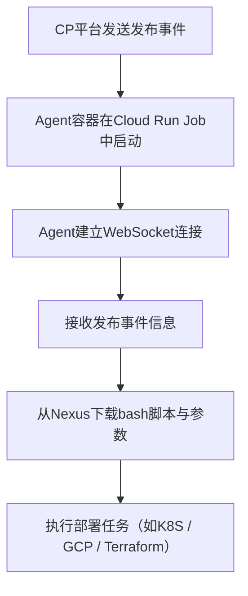
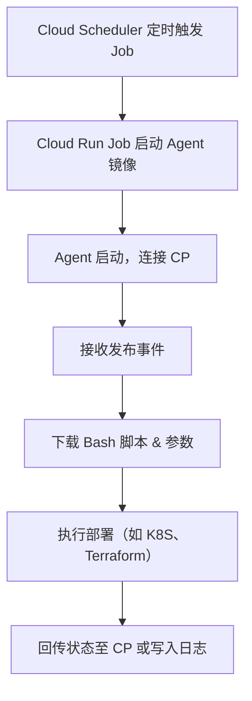
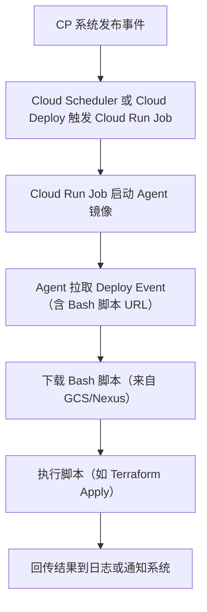

# Grok

### 关键要点

- 可以直接从 Google Artifact Registry (GAR) 部署容器镜像到 Cloud Run，过程简单且高效。
- 部署后的服务可以通过其 URL 内部访问，适合定时任务或基础设施变更。
- 通过 Cloud Scheduler 可以轻松实现定时任务，适合自动化操作。
- 发布新版本可以通过部署新修订版实现，支持流量管理以渐进发布。
- 容器镜像需配置入口点以处理 WebSocket 事件，动态执行命令。

### 部署与访问

您可以直接从 GAR 部署已构建的容器镜像到 Cloud Run，只需确保有适当的权限（如 Artifact Registry Reader 和 Cloud Run Developer 角色）。部署后，服务会生成一个 URL，您可以通过此 URL 内部访问，例如通过 Cloud Scheduler 触发定时任务。如果需要进行基础设施变更，服务可以集成 GCP API 或工具如 Terraform 来实现。

### 发布与暴露

发布新版本时，每次部署都会创建一个新修订版，您可以管理流量以实现灰度发布或 A/B 测试。如果需要暴露服务，默认情况下它是公开可访问的，但您可以限制为内部流量以提高安全性。

### 执行命令

您的容器镜像应配置入口点来启动代理，监听 WebSocket 事件并根据事件动态执行命令（如 bash 脚本）。Cloud Run 支持 WebSocket，适合长连接场景，但需注意连接超时（默认 5 分钟，最长 60 分钟）。

支持资源：

- [部署到 Cloud Run 的文档](https://cloud.google.com/artifact-registry/docs/integrate-cloud-run)
- [使用 Cloud Scheduler 触发 Cloud Run](https://cloud.google.com/run/docs/triggering/using-scheduler)
- [Cloud Run 中的 WebSocket 使用](https://cloud.google.com/run/docs/triggering/websockets)

---

### 详细报告

#### 引言

本文详细探讨了在 Google Cloud Platform (GCP) 中使用 Cloud Run 部署容器镜像、内部访问服务、执行定时任务和基础设施变更，以及发布新版本和执行命令的实现方式。基于用户提供的容器镜像结构和需求，我们将分析如何满足其核心目标：部署服务并实现相应的发布流程。

#### 部署容器镜像到 Cloud Run

用户提到已在其 Google Artifact Registry (GAR) 中构建了一个包，并询问是否可以直接部署到 Cloud Run。答案是肯定的，Cloud Run 完全支持从 GAR 部署容器镜像。这是 GCP 生态系统中的标准集成，过程简单高效。

- **部署步骤：**

    - 可以使用 `gcloud` 命令行工具或 Google Cloud Console 进行部署。
    - 示例命令：
        ```bash
        gcloud run deploy [SERVICE_NAME] --image [GAR_IMAGE_PATH] --region [REGION]
        ```
        其中 `[SERVICE_NAME]` 是服务名称，`[GAR_IMAGE_PATH]` 是 GAR 中的镜像路径（例如 `gcr.io/[PROJECT_ID]/[IMAGE_NAME]:[TAG]`），`[REGION]` 是部署区域。
    - 部署时需要确保有以下权限：
        - `Artifact Registry Reader` 角色 (`roles/artifactregistry.reader`)，以读取 GAR 中的镜像。
        - `Cloud Run Developer` 角色 (`roles/run.developer`)，以部署服务。

- **背景信息：**
    根据 2025 年 7 月 7 日的官方文档，Cloud Run 与 GAR 的集成允许直接指定存储在 GAR 中的容器镜像，无需额外的拉取或构建步骤。这确保了部署流程的高效性和一致性。

#### 内部访问与定时任务

用户询问部署后的服务如何内部访问，特别是用于运行定时任务或进行基础设施变更。Cloud Run 服务部署后会生成一个唯一的 URL，可用于内部或外部调用。

- **内部访问：**

    - 默认情况下，Cloud Run 服务是公开可访问的，但您可以配置为仅允许内部流量（例如通过 VPC 网络）。
    - 内部访问可以通过服务 URL 实现，例如从其他 GCP 服务（如 Cloud Scheduler）触发。

- **运行定时任务：**

    - 为了实现定时任务，推荐使用 **Cloud Scheduler**，它类似于传统的 cron 作业，可以按计划触发 Cloud Run 服务。
    - 配置步骤包括：
        - 创建 Cloud Scheduler 作业，指定 cron 表达式（如每小时运行一次）。
        - 将目标设置为 Cloud Run 服务的 URL。
        - 确保 Cloud Scheduler 的服务账户有 `Cloud Run Invoker` 角色 (`roles/run.invoker`)，以便调用服务。
    - 示例：如果服务需要每天运行一次，可以设置 cron 表达式为 `0 0 * * *`。

- **基础设施变更：**
    - 用户提到希望服务能进行“Infra changes”（基础设施变更），这可能包括部署新资源或更新配置。
    - 实现方式可以是：
        - 在容器中集成 GCP API 或 SDK（如 `gcloud` 命令行工具或客户端库），并赋予适当的 IAM 权限。
        - 使用基础设施即代码工具如 Terraform，通过容器执行相关脚本。
    - 根据用户描述，其容器代理通过 WebSocket 接收部署事件并执行 bash 脚本，这适合动态触发基础设施变更。

#### 发布与版本管理

用户的核心目标是部署服务并进行相应的发布。Cloud Run 支持版本管理，通过创建修订版（revision）来实现新版本的发布。

- **发布新版本：**

    - 每次部署新容器镜像时，Cloud Run 会创建一个新的修订版。修订版是不可变的，确保版本一致性。
    - 您可以管理流量分配，例如：
        - 将 100% 流量导向新修订版，实现完全替换。
        - 分割流量（如 90% 旧版，10% 新版），实现灰度发布或 A/B 测试。
    - 命令示例：
        ```bash
        gcloud run services update-traffic [SERVICE_NAME] --to-revision=[REVISION_NAME]=100
        ```

- **暴露服务：**
    - 默认情况下，Cloud Run 服务通过其 URL 公开访问。如果需要限制访问，可以配置为仅允许内部流量。
    - 对于安全性考虑，特别是在处理敏感操作（如基础设施变更）时，建议限制为内部访问，并使用 IAM 权限控制。

#### 执行命令与容器镜像结构

用户提到其容器镜像基于 Ubuntu，包含部署类型和代理安装，并通过 WebSocket 接收部署事件，下载 bash 工件并执行。以下是相关分析：

- **容器镜像结构：**

    - 用户描述了三层镜像：
        1. 第 1 层：Ubuntu 基础镜像。
        2. 第 2 层：平台基础镜像，包含各种部署类型和已安装的部署代理。
        3. K8s 部署镜像（GCP 专用，包含 K8s 安装）。
    - 用户明确表示只维护第 2 层镜像，排除第 3 层，这意味着部署代理和操作 bash 是解耦的，减少了频繁更新 Cloud Run 镜像的需要。

- **执行命令：**

    - 容器的行为由其 **入口点（entrypoint）** 定义。入口点应启动代理，保持容器运行并监听 WebSocket 事件。
    - 根据用户描述，代理会：
        - 通过 WebSocket 接收来自 CP（控制平面）的部署事件。
        - 下载相关的 bash 工件和参数。
        - 执行这些脚本以完成部署或操作。
    - Cloud Run 支持 WebSocket，适合这种长连接场景，但需注意连接超时：
        - 默认超时为 5 分钟，最长可配置为 60 分钟。
        - 如果连接时间超过超时，客户端需要处理重连（例如使用 reconnecting-websocket 库）。

- **灵活性和安全性：**
    - 用户提到这种设计更灵活，代理镜像和操作 bash 解耦，新的工具版本发布只需发布到 Nexus Prod。
    - 安全性方面，由于 Cloud Run 作业在 onboarding 过程中创建，并授予 CP 仅启动特定作业的权限，降低了安全风险。
    - 此外，小型镜像集便于 CVE 管理，减少漏洞暴露。

#### 技术细节与最佳实践

- **WebSocket 支持：**

    - Cloud Run 将 WebSocket 请求视为长运行的 HTTP 请求，支持并发连接（最多 1000 个容器实例，每个实例 250 个并发请求）。
    - 对于高并发场景，建议增加最大并发设置以处理负载。

- **成本与扩展：**

    - Cloud Run 按请求数量和容器运行时间计费。由于 WebSocket 连接会保持容器活跃，建议监控使用情况以控制成本。
    - 可以设置实例数和并发限制，优化资源使用。

- **权限与安全：**
    - 确保服务账户有适当的 IAM 角色，例如 `Cloud Run Admin`（如果需要管理服务）或特定资源权限（如存储桶访问）。
    - 对于基础设施变更，确保容器有执行相关操作的权限，避免权限过宽导致安全风险。

#### 总结

综上所述，您可以直接从 GAR 部署容器镜像到 Cloud Run，并通过服务 URL 内部访问。使用 Cloud Scheduler 实现定时任务，适合自动化操作；通过部署新修订版管理发布，支持灰度发布。容器应配置入口点以处理 WebSocket 事件，动态执行命令，满足您的发布需求。注意 WebSocket 连接的超时设置，并监控成本以优化使用。

支持资源：

- [部署到 Cloud Run 的文档](https://cloud.google.com/artifact-registry/docs/integrate-cloud-run)
- [使用 Cloud Scheduler 触发 Cloud Run](https://cloud.google.com/run/docs/triggering/using-scheduler)
- [Cloud Run 中的 WebSocket 使用](https://cloud.google.com/run/docs/triggering/websockets)

# Gemini

# 在 Google Cloud Run 上构建企业级自动化部署代理的架构与实践

## 第一章：奠定基石：将您的代理部署为 Cloud Run 服务还是作业

本章旨在阐明您在 Cloud Run 上部署系统的最关键架构决策。我们将明确指出，您单一的容器镜像将需要部署为两种不同类型的 Cloud Run 资源，以分别处理您截然不同的用例：一种用于处理需要持续监听的场景，另一种用于执行一次性任务。这直接解决了您查询中的核心模糊点。

### 1.1 Cloud Run 资源模型概述

Cloud Run 是一个全代管的应用平台，允许您运行无状态容器，而无需管理底层基础设施 1。它将所有基础设施管理工作抽象化，使您能够专注于构建卓越的应用程序。要有效利用该平台，首先必须理解其核心资源模型。

Google Cloud 将代码的运行方式主要分为三种资源类型：服务（Service）、作业（Job）和工作池（Worker Pool）3。根据您的需求——执行基础设施变更、运行定时任务以及通过事件触发发布流程——我们将重点关注服务和作业这两种资源。

在 Cloud Run 的世界中，一个核心概念是 **修订版本（Revision）**。每次部署都会创建一个新的修订版本，它是一个服务配置和容器镜像的不可变快照。这意味着，您部署的每一个版本（包括容器镜像、环境变量、内存限制等配置）都被永久记录下来。这个特性是实现可靠的回滚、金丝雀部署和蓝绿部署等高级发布策略的基石 4。当您更新服务时，Cloud Run 会创建一个新的修订版本，并可以将流量逐步迁移到新版本上，如果发现问题，也可以迅速将流量切回之前的稳定版本。

### 1.2 对比分析：Cloud Run 服务 vs. Cloud Run 作业

这是整个报告的基础，一个详尽的比较将指导您做出正确的架构选择。

#### 1.2.1 Cloud Run 服务（Service）

- **设计目的**：Cloud Run 服务的核心设计目的是接收和响应网络请求。这包括标准的 HTTP/S 请求、gRPC 调用以及您提到的 WebSocket 长连接 3。它是构建 Web 应用、API 后端和 Webhook 接收器的理想选择。
- **生命周期**：服务的设计是持续运行以随时处理传入的请求。其最显著的特性是能够根据流量自动扩缩容，甚至在没有流量时**缩容至零（scale to zero）**，从而极大地节约成本 2。服务的容器生命周期包括三个主要阶段：
    **启动（Starting）**、**服务（Serving）**（此阶段分为处理请求的“活跃”状态和不处理请求的“空闲”状态）和**关闭（Shutting down）** 7。
- **调用方式**：服务通过一个唯一的、稳定的 HTTPS 端点被触发。每个服务都会自动获得一个 `*.run.app` 格式的域名，并且支持绑定自定义域名 3。

#### 1.2.2 Cloud Run 作业（Job）

- **设计目的**：与服务不同，Cloud Run 作业专为运行那些执行特定任务然后**运行至完成（run to completion）**的代码而设计 3。这与您的多个核心用例完美匹配：
    - 运行一个脚本来进行数据库迁移。
    - 执行基础设施变更（例如，运行 Terraform 或 Ansible）。
    - 执行您提到的“定时任务”（例如，定期的清理或报告生成）3。
- **生命周期**：作业本身是一个配置模板。当您运行一个作业时，会创建一个**执行（Execution）**实例。这个执行实例会启动一个或多个容器实例，运行您定义的任务，直到所有任务成功完成，然后整个执行实例终止。它不会像服务那样持续监听请求 8。一个执行的生命周期会经历以下状态：已加入队列（Queued）、已调度（Scheduled）、正在运行（Running），并最终以成功（Succeeded）或失败（Failed）结束 11。
- **调用方式**：作业可以通过多种方式启动：通过 `gcloud` 命令行或 API **手动执行**、通过 Cloud Scheduler **按计划执行**，或者作为 Cloud Workflows 中工作流的一部分被**编排执行** 3。

#### 1.2.3 架构分析：为何 WebSocket 方案存在风险

您在问题中提到，设想通过 WebSocket 接收来自控制平面（CP）的部署事件。这个想法虽然直观，但在 Cloud Run 的 serverless 环境中存在着架构层面的不匹配和固有的脆弱性。

首先，WebSocket 协议要求客户端和服务器之间建立一个**持久连接**。这天然地指向了需要持续运行的 **Cloud Run 服务**。然而，Cloud Run 服务的生命周期特性使其成为一个不可靠的持久连接宿主。当服务长时间没有收到请求时，它会**缩容至零**。此时，如果您的 CP 尝试建立 WebSocket 连接，将会遇到“冷启动”，这不仅会增加延迟，还可能导致连接尝试失败。

其次，即使服务没有缩容至零，处于**空闲（idle）**状态的容器，其 CPU 也会被严重**限制（throttled）**到几乎为零 7。这意味着您的代理进程虽然存活，但几乎没有计算能力来维持心跳或处理控制消息，这可能导致连接意外中断。

最后，Cloud Run 服务在多个实例之间进行负载均衡。即使您设置了最小实例数为 1，一次成功的 WebSocket 连接也只建立在某一个实例上。如果后续的管理或控制请求通过负载均衡器被路由到另一个不同的实例，那么这个新实例上并没有您期望的连接，从而导致状态不一致和通信失败 13。

综上所述，使用 WebSocket 模式会在一个为无状态、请求驱动而设计的 serverless 平台上，强行引入一个脆弱的、有状态的依赖。更稳健和符合 GCP 设计哲学的模式是使用**事件驱动**的机制来触发短暂的、一次性的**Cloud Run 作业**。我们将在第三章详细阐述这个更优的模式。

### 1.3 您的首次部署：从工件库到运行实例

现在，我们将通过实际操作，将您已经构建在 Google Artifact Registry (GAR) 中的镜像部署到 Cloud Run。

#### 1.3.1 准备工作

在部署之前，需要确保满足以下条件：

1. **API 已启用**：确保您的 GCP 项目已启用 Artifact Registry API 和 Cloud Run Admin API。
2. **权限配置**：执行部署的用户或服务账号需要具备 `roles/run.admin`（用于管理 Cloud Run 资源）和 `roles/iam.serviceAccountUser`（用于将服务身份关联到 Cloud Run 资源）的 IAM 角色。此外，Cloud Run 服务本身需要权限从 GAR 拉取镜像。这是通过一个名为 **Cloud Run Service Agent** 的 Google 管理的服务账号实现的，需要为其授予 `roles/artifactregistry.reader` 角色 4。

#### 1.3.2 命令行部署

我们将分别演示如何将您的镜像部署为服务和作业。

- 部署为服务（Service）
    使用 gcloud run deploy 命令默认会创建一个 Cloud Run 服务。这个服务会获得一个公开的 URL，并开始监听 HTTP 请求。
    Bash
    ```
    # 此命令会将您的代理部署为一个 HTTP 服务
    gcloud run deploy your-agent-service \
      --image="LOCATION-docker.pkg.dev/PROJECT_ID/REPO_NAME/YOUR_IMAGE:TAG" \
      --region=us-central1 \
      --platform=managed \
      --allow-unauthenticated # 为了演示方便，允许未经身份验证的调用
    ```
    执行成功后，您会得到一个 URL，可以通过浏览器或 `curl` 访问它 4。
- 创建为作业（Job）
    对于您执行发布和基础设施变更的任务，正确的做法是使用 gcloud run jobs create 命令。这不会立即运行任何东西，而是创建一个可供后续执行的作业模板 16。
    Bash
    ```
    # 此命令会创建一个作业模板，用于后续的任务执行
    gcloud run jobs create your-agent-job \
      --image="LOCATION-docker.pkg.dev/PROJECT_ID/REPO_NAME/YOUR_IMAGE:TAG" \
      --region=us-central1 \
      --platform=managed
    ```
    这个作业模板是后续所有自动化流程的核心。

### 表 1：Cloud Run 服务 vs. 作业 - 为您的工作负载模式做出决策

下表总结了服务与作业之间的关键区别，为您提供了一个清晰的决策框架，以确定哪种资源类型最适合您的特定用例。

| 特性                       | Cloud Run 服务 (Service)                      | Cloud Run 作业 (Job)                             | 您的用例推荐 |
| -------------------------- | --------------------------------------------- | ------------------------------------------------ | ------------ |
| **主要目的**               | 接收并响应网络请求（HTTP, gRPC, WebSockets）3 | 运行一个任务直到完成然后退出 3                   | **作业**     |
| **调用方式**               | 通过稳定的 HTTPS 端点触发 3                   | 手动、按计划或通过 API/事件触发执行 12           | **作业**     |
| **生命周期**               | 持续运行（可缩容至零），响应请求 7            | 短暂的，为单次执行而生，完成后即终止 11          | **作业**     |
| **扩缩容行为**             | 基于请求并发数自动扩缩容 3                    | 每个执行是一个或多个并行任务，不基于流量扩缩容 9 | **作业**     |
| **状态性**                 | 强制无状态，实例是短暂的 4                    | 强制无状态，专为一次性、无状态任务设计           | **作业**     |
| **成本模型**               | 按请求处理的 vCPU 和内存使用时间计费 2        | 按作业执行期间的 vCPU 和内存使用时间计费 3       | **作业**     |
| **典型用例**               | Web API, 微服务, 网站后端                     | 数据处理, 批处理任务, 脚本执行, 基础设施自动化   | **作业**     |
| **您的“Infra Change”任务** | 不适合，任务是短暂的                          | **理想选择**，任务有明确的开始和结束             | **作业**     |
| **您的“定时任务”**         | 不适合，服务不应自我调度                      | **理想选择**，可由 Cloud Scheduler 精确触发      | **作业**     |

通过以上分析，结论非常明确：对于您描述的自动化发布和基础设施变更的核心功能，**Cloud Run 作业是唯一正确的架构选择**。接下来的章节将基于这一结论，为您构建一个完整、健壮且安全的自动化平台。

## 第二章：代理的核心：动态命令执行蓝图

本章将直接为您提供核心技术问题的解决方案：“我如何执行我的命令？”。我们将提供一个生产就绪的模式，用于构建一个灵活的、由命令驱动的容器，使其能够响应来自外部的动态指令。

### 2.1 Dockerfile 策略：`ENTRYPOINT` 与 `CMD` 的协同模式

一个标准的 `Dockerfile` 可能包含一个硬编码的 `CMD ["npm", "start"]`，这种方式缺乏灵活性。您的需求是能够动态执行不同的 Bash 脚本（如 `./deploy-db.sh` 或 `./run-tf.sh`），并传递不同的参数。

#### 2.1.1 理解 `ENTRYPOINT` 和 `CMD`

在 Docker 中，`ENTRYPOINT` 和 `CMD` 共同定义了容器启动时执行的命令，但它们的角色有着本质的区别 17：

- `ENTRYPOINT`：定义容器的**主可执行程序**。它指定了容器启动时总是会运行的命令，不易被覆盖。这使得容器的行为像一个可执行文件 20。
- `CMD`：为 `ENTRYPOINT` 提供**默认参数**。`CMD` 的内容可以很容易地在 `docker run` 或 Cloud Run 的执行命令中被覆盖 18。

#### 2.1.2 最佳实践：使用 `entrypoint.sh` 包装脚本

为了获得最大的灵活性和可维护性，推荐的最佳实践是使用一个包装脚本（例如 `entrypoint.sh`）作为容器的 `ENTRYPOINT`。这个脚本有几个关键优势：

1. **预处理能力**：在执行主命令之前，您可以在此脚本中执行一系列预备操作，例如从 Secret Manager 获取密钥、配置云服务商的凭证、检查环境变量等。
2. **逻辑解耦**：将启动逻辑从 `Dockerfile` 中分离出来，使 `Dockerfile` 更具声明性，也使启动脚本本身更易于测试和维护 22。
3. **确保正确的信号处理**：这是至关重要的一点。在 `entrypoint.sh` 脚本的最后，必须使用 `exec "$@"` 来执行传递进来的命令。`exec` 命令会用新的进程替换当前的 shell 进程，而不是启动一个子进程。这意味着您的应用程序将成为容器的主进程（PID 1）。这对于正确处理来自 Cloud Run 的信号（如用于优雅停机的 `SIGTERM` 信号）至关重要。如果缺少 `exec`，shell 进程会成为 PID 1，它可能不会正确地将 `SIGTERM` 信号传递给您的应用程序，导致容器被强制终止（`SIGKILL`），从而失去优雅停机的机会 7。

#### 2.1.3 示例 `Dockerfile` 和 `entrypoint.sh`

以下是一个为您量身定制的 `Dockerfile` 和 `entrypoint.sh` 示例，它遵循了上述最佳实践，并与您分层的镜像构建理念相契合。

**`Dockerfile`**

Dockerfile

```
# Layer 1: 基础镜像
# 选择一个精简且受信任的基础镜像，例如 Ubuntu Slim 或 Distroless
FROM ubuntu:22.04

# 设置工作目录
WORKDIR /app

# Layer 2: 安装平台基础镜像和部署代理
# 在这里执行您的代理安装、工具链安装（Terraform, gcloud SDK, kubectl 等）
# 以及其他依赖项的配置
# 例如:
# COPY --from=builder /path/to/terraform /usr/local/bin/
# COPY./agent /app/agent

# 复制并设置入口点脚本
COPY entrypoint.sh /usr/local/bin/entrypoint.sh
RUN chmod +x /usr/local/bin/entrypoint.sh

# 定义容器的入口点
ENTRYPOINT ["entrypoint.sh"]

# 提供一个默认命令，例如显示帮助信息或版本号。
# 这个命令可以在运行时被轻松覆盖。
CMD ["/app/agent", "--help"]
```

**`entrypoint.sh`**

Bash

```
#!/bin/sh
# 使用 POSIX 兼容的 shell
# set -e: 如果任何命令以非零状态退出，则立即退出脚本
set -e

echo "Container entrypoint script started at $(date)"

# 在这里可以添加任何预检或设置逻辑
# 例如：从 Secret Manager 获取凭证并导出为环境变量
# if; then
#   export DB_PASSWORD=$(gcloud secrets versions access latest --secret="$DB_PASSWORD_SECRET")
# fi

echo "Executing command: $@"

# 使用 exec 将控制权传递给 CMD 或运行时指定的命令
# "$@" 会将所有传递给脚本的参数原封不动地传递给下一个命令
exec "$@"
```

### 2.2 使用 Cloud Run 作业执行一次性任务

这是您执行所有发布和基础设施变更任务的主要模式。

#### 2.2.1 调用作业并传递动态命令

创建了作业模板后，使用 `gcloud run jobs execute` 命令来启动一次执行 10。关键在于，如何告诉这次执行要运行什么特定命令。

`gcloud run jobs execute` 命令提供了 `--command` 和 `--args` 标志，它们分别用于覆盖 `Dockerfile` 中的 `ENTRYPOINT` 和 `CMD` 12。根据我们设计的

`entrypoint.sh` 模式，`ENTRYPOINT` 是固定的，我们只需要覆盖 `CMD` 即可。因此，`--args` 标志是解答您“如何执行我的命令”这一问题的直接答案。它构成了您的控制平面（CP）与部署代理（Agent）之间的指令通道。

#### 2.2.2 传递发布参数的两种模式

您的代理需要知道从哪里下载 Bash 构件以及相关的发布参数。有两种推荐的方式来传递这些动态信息。

- 模式一：通过参数（--args）直接传递命令
    这种方式简单直接，适合执行简单的、自包含的命令。
    Bash
    ```
    # 示例：执行一个从 Nexus 下载并运行的脚本
    gcloud run jobs execute your-agent-job \
      --args="bash,-c,curl -sSL https://nexus.example.com/releases/1.2.3/deploy.sh | bash" \
      --region=us-central1 \
      --wait # 等待作业执行完成
    ```
    在这个例子中，`--args` 覆盖了 `Dockerfile` 中的 `CMD`，`entrypoint.sh` 脚本最终会执行 `bash -c "..."` 这个完整的命令。
- 模式二：通过环境变量（--update-env-vars）传递结构化参数
    对于更复杂的场景，将参数硬编码到命令行中会变得笨拙且容易出错。一个更清晰、更结构化的方法是使用环境变量来传递元数据，让代理内部的逻辑来处理这些元数据。这与您“代理镜像和操作 bash 解耦”的设计理念高度一致 12。
    Bash
    ```
    # 示例：通过环境变量传递发布信息
    gcloud run jobs execute your-agent-job \
      --update-env-vars="RELEASE_VERSION=1.2.3,TARGET_ENV=production,NEXUS_REPO=my-app-releases" \
      --args="/app/agent,run-release" \
      --region=us-central1 \
      --wait
    ```
    在这种模式下，您的代理 `/app/agent` 的 `run-release` 命令会负责读取 `RELEASE_VERSION` 等环境变量，然后据此构建正确的 Nexus URL，下载对应的构件并执行。这种方式极大地增强了灵活性和可维护性。

### 2.3 高级作业特性：通过并行化提升效率

Cloud Run 作业不仅能执行单个任务，还能以高度并行的方式执行大规模任务。这为您优化基础设施变更等耗时操作提供了强大的工具。

#### 2.3.1 并行任务的机制

通过在执行作业时设置 `--tasks` 标志，您可以让 Cloud Run 并行启动多个容器实例来共同完成一项工作。例如，`--tasks=10` 会启动 10 个实例 9。

为了让每个实例知道自己该做什么，Cloud Run 会自动向每个任务容器注入两个关键的环境变量 9：

- `CLOUD_RUN_TASK_INDEX`：当前任务的索引，从 0 到 `(tasks - 1)`。
- `CLOUD_RUN_TASK_COUNT`：本次执行的总任务数。

#### 2.3.2 架构演进：从串行到并行

您的“Infra change”任务可能包含许多可以独立执行的子任务（例如，同时更新 10 个不同的防火墙规则，或在 5 个 GCS 存储桶上设置相同的权限）。传统的脚本会按顺序串行执行，效率低下。

利用 Cloud Run 作业的并行能力，您可以对您的代理进行架构上的演进：

1. **定义任务清单**：您的控制平面（CP）不再只是触发一个简单的脚本，而是生成一个任务清单（Manifest），例如一个 JSON 文件，其中包含所有需要执行的独立子任务。这个清单可以上传到一个共享的位置，如 GCS。
2. **并行执行**：CP 在触发作业时，设置 `--tasks` 为清单中的任务总数（例如 `--tasks=10`）。
3. **代理分片处理**：您的代理代码在启动时，读取 `CLOUD_RUN_TASK_INDEX` 环境变量。然后，它从 GCS 下载任务清单，并根据自己的索引号（例如，索引为 `3` 的实例只处理清单中的第 4 个任务）来执行分配给它的那部分工作。

这种模式将一个原本可能耗时数十分钟的串行过程，转变为一个高效的、仅需几分钟即可完成的并行过程。这不仅是技术上的优化，更是对您整个自动化平台能力的一次重大提升。

## 第三章：编排与调用：触发您的部署代理

本章将为您设计一个健壮、符合 GCP 最佳实践的“暴露方式”，用于触发您的部署代理。我们将引导您从最初的 WebSocket 设想，转向一个更具弹性、可扩展和解耦的事件驱动架构。

### 3.1 重新审视：为何不推荐使用 WebSocket 进行服务间编排

如第一章所述，将 Cloud Run 服务用作 WebSocket 服务器来接收编排指令，存在几个根本性的问题：

- **脆弱性**：服务的“缩容至零”和“空闲时 CPU 限制”特性，使得维持一个稳定、持久的 WebSocket 连接变得非常困难且不可靠 7。
- **状态管理**：WebSocket 连接本身是有状态的，而 Cloud Run 的设计理念是无状态。在多个实例之间进行负载均衡时，无法保证控制消息能被发送到持有连接的那个特定实例 13。
- **模式错配**：WebSocket 主要用于客户端与服务器之间的双向实时通信，例如聊天应用或实时仪表盘 24。而您的需求是服务到服务（或系统到服务）的异步命令分发，这正是消息队列和发布/订阅系统的专长。

### 3.2 更优模式：基于 Pub/Sub 的事件驱动调用

一个更强大、更符合云原生思想的模式是采用事件驱动的架构，其核心是 Google Cloud 的 Pub/Sub 服务。

#### 3.2.1 Pub/Sub 简介

Pub/Sub 是一个全代管的、可全球扩展的异步消息传递服务。它将消息的**生产者（Publisher）**与消息的**消费者（Subscriber）**完全解耦 26。

- **发布者**：只负责将消息发送到一个指定的**主题（Topic）**，它不需要知道谁会消费这个消息，也不需要关心消费者是否在线。
- **订阅者**：通过创建一个**订阅（Subscription）**来表示对某个主题的消息感兴趣。

#### 3.2.2 推送订阅（Push Subscription）与作业集成

Pub/Sub 的“推送订阅”模式可以将消息作为 HTTP POST 请求，主动推送到一个指定的端点 29。这个端点可以是 Cloud Run 服务的 URL，也可以是触发 Cloud Run 作业的特殊调用端点。

#### 3.2.3 解耦带来的巨大优势

采用 Pub/Sub 模式为您带来了以下关键的架构优势：

- **灵活性与可扩展性**：您的控制平面（CP）的职责被简化为仅仅是向一个 Pub/Sub 主题发布一条消息。它完全不需要知道部署代理的存在形式、部署位置，甚至它是否正在运行。未来，您可以轻易地增加新的消费者（例如，一个用于审计的日志服务），或者替换掉当前的部署代理，而无需对 CP 做任何修改 31。
- **可靠性与缓冲**：Pub/Sub 充当了一个可靠的缓冲层。如果您的部署代理作业因为某种原因暂时不可用，或者所有实例都在忙碌，Pub/Sub 会安全地保留消息，并在代理可用时自动重试投递。这避免了因下游服务暂时故障而导致发布请求丢失的问题。
- **异步处理**：CP 发布消息后可以立即返回，无需等待部署任务完成。这使得您的上游系统（例如 CI/CD 流水线）响应更快。

#### 3.2.4 使用 Eventarc 实现集成

Eventarc 是 Google Cloud 推荐的、用于连接事件源（如 Pub/Sub）和事件目的地（如 Cloud Run）的统一事件总线 34。通过创建一个 Eventarc 触发器，您可以声明式地配置“当有消息发布到

`release-requests` 主题时，就使用消息内容作为参数来执行 `your-agent-job` 作业”。

### 3.3 按计划执行：使用 Cloud Scheduler 满足“定时任务”需求

对于您明确提到的“定时任务”需求，Cloud Scheduler 是 GCP 提供的标准解决方案。

Cloud Scheduler 是一个全代管的企业级 cron 作业调度器 8。您可以创建一个调度器作业，以标准的 cron 格式（例如

`0 2 * * *` 表示每天凌晨 2 点）来定期触发一个 HTTP 请求。

要将 Cloud Scheduler 与您的 Cloud Run 作业集成，需要遵循以下步骤 8：

1. **获取作业的调用 URI**：每个 Cloud Run 作业都有一个可以通过 API 调用的特殊端点。可以使用 `gcloud run jobs describe JOB_NAME --format="value(uri)"` 来获取。
2. **创建专用的服务账号**：为 Scheduler 创建一个专用的服务账号，并仅授予它调用目标作业的权限，即 `roles/run.invoker` 角色。
3. **创建调度器作业**：使用 `gcloud scheduler jobs create http` 命令创建调度器作业。关键配置如下：

    - `--schedule`：设置 cron 表达式。
    - `--uri`：设置为第一步获取的作业调用 URI。
    - `--http-method=POST`：使用 POST 方法。
    - `--oidc-service-account-email`：设置为第二步创建的服务账号的邮箱。这会让 Scheduler 在调用时，自动携带一个代表该服务账号身份的 OIDC 令牌，Cloud Run 会用此令牌进行身份验证 8。

### 3.4 推荐的调用架构：一个综合蓝图

结合以上分析，我们为您设计了一个完整的、端到端的调用流程，它既能处理按需的发布请求，也能满足定期的维护任务。

**事件驱动的发布流程：**

1. **触发**：开发者将代码推送到 Git 仓库的特定分支（例如 `release` 分支）。
2. **CI/CD 流水线启动**：一个 Cloud Build 触发器被激活，开始执行构建和测试应用程序的 CI 流水线。
3. **控制平面（CP）决策**：在流水线的最后阶段，一个脚本（作为 CP）被执行。它会构建一个描述发布任务的 JSON 消息，例如：

    JSON

    ```
    {
      "release_version": "1.2.4",
      "target_env": "staging",
      "artifact_path": "gs://my-artifacts/my-app-1.2.4.zip",
      "deployment_script": "deploy_staging.sh"
    }
    ```

4. **发布事件**：CP 将此 JSON 消息发布到名为 `release-requests` 的 Pub/Sub 主题。
5. **Eventarc 触发**：一个监听 `release-requests` 主题的 Eventarc 触发器捕获到该消息，并调用 `your-agent-job` 作业。Pub/Sub 消息的内容会被作为 POST 请求的正文传递给作业。
6. **代理执行**：`your-agent-job` 的容器实例启动。其入口点脚本或主程序被设计为能够解析传入的 HTTP 请求正文（即 JSON 消息），提取出版本号、目标环境等参数，并据此执行相应的部署逻辑（例如，从 GCS 下载构件并运行指定的部署脚本）。

**计划性的维护流程：**

1. **调度器触发**：Cloud Scheduler 按照预设的 cron 表达式（例如，每晚）被激活。
2. **作业调用**：调度器向 `your-agent-job` 的调用端点发送一个带有 OIDC 令牌的 POST 请求。请求的正文可以预先在调度器作业中定义好，例如：

    JSON

    ```
    {
      "task": "cleanup_stale_resources"
    }
    ```

3. **代理执行**：`your-agent-job` 启动，解析请求正文，并执行清理任务。

### 表 2：Cloud Run 代理的调用模式对比

| 调用方法       | 工作原理                                                                 | 主要用例                                                   | 关键 `gcloud` 命令                    | 最适合...                                                  |
| -------------- | ------------------------------------------------------------------------ | ---------------------------------------------------------- | ------------------------------------- | ---------------------------------------------------------- |
| **手动执行**   | 通过 `gcloud` CLI 或 GCP Console 直接触发一次作业执行。                  | 开发、测试、调试、紧急修复。                               | `gcloud run jobs execute` 12          | 开发者需要立即运行一次特定任务的场景。                     |
| **按计划执行** | Cloud Scheduler 按 cron 表达式定期向作业的调用端点发送 HTTP 请求。       | 定期的数据备份、报告生成、资源清理、您提到的“定时任务”。   | `gcloud scheduler jobs create http` 8 | 需要以固定频率、无人值守地自动执行的任务。                 |
| **事件驱动**   | 上游系统向 Pub/Sub 主题发布事件消息，Eventarc 触发器捕获消息并调用作业。 | CI/CD 触发的部署、响应系统状态变化的自动化操作、服务解耦。 | `gcloud eventarc triggers create` 34  | 构建响应式、可扩展的自动化工作流，将发布逻辑与触发源解耦。 |

这个架构不仅解决了您“如何暴露”的问题，还为您提供了一个高度解耦、可靠且可扩展的自动化平台基础。

## 第四章：安全与治理：实施最小权限原则

本章将直接响应您对“低安全风险”的要求，为您提供一个详细的、多层次的安全策略。我们将超越基础的权限设置，构建一个遵循最小权限原则的、真正安全的企业级部署系统。

### 4.1 Cloud Run 作业的双层 IAM 模型

在设计云上权限时，一个常见的安全误区是创建一个功能强大的“超级”服务账号，并将其授予所有需要交互的系统。一个更安全、更符合 GCP 设计哲学的模式是，将**发起操作的权限**与**执行操作的权限**彻底分离。您的控制平面（CP）不应该拥有直接修改基础设施的权限；它只应该被授权去**触发**那个拥有这些权限的部署代理作业。

为此，我们必须定义并使用两个职责分明的服务账号（Service Account, SA）：

1. **调用者服务账号（Invoker SA）**：

    - **使用者**：这个 SA 被您的控制平面（如 Cloud Build 流水线）或 Cloud Scheduler 作业所使用。
    - **权限**：它的权限被严格限制在**仅能调用特定的 Cloud Run 作业**。所需的 IAM 角色是 `roles/run.invoker`，更精确的角色是 `roles/run.jobs.run`。重要的是，这个角色应该被授予在**单个 Cloud Run 作业资源**上，而不是在整个项目上 36。
    - **命令示例**：
      Bash

        ```
        # 创建调用者 SA
        gcloud iam service-accounts create invoker-sa --display-name="Release Trigger Invoker"

        # 将调用者 SA 绑定到特定的作业上，并授予调用权限
        gcloud run jobs add-iam-policy-binding your-agent-job \
          --member="serviceAccount:invoker-sa@PROJECT_ID.iam.gserviceaccount.com" \
          --role="roles/run.invoker" \
          --region=us-central1
        ```

2. **作业运行时服务账号（Runtime SA）**：

    - **使用者**：这是 Cloud Run 作业在**运行时所扮演的身份**。
    - **权限**：这个 SA 拥有执行实际任务所需的所有权限。例如，`roles/storage.objectAdmin`（用于读写 GCS/Nexus 构件）、`roles/cloudsql.client`（用于执行数据库迁移）、或与 Terraform 相关的权限（如 `roles/compute.admin`）。这正是安全最佳实践中提到的“为每个服务使用具有最小权限的专用服务账号” 39。
    - **命令示例**：
      Bash

        ```
        # 创建运行时 SA
        gcloud iam service-accounts create runtime-sa --display-name="Infra Change Agent Runtime"

        # 授予运行时 SA 修改 GCS 存储桶的权限
        gcloud projects add-iam-policy-binding PROJECT_ID \
          --member="serviceAccount:runtime-sa@PROJECT_ID.iam.gserviceaccount.com" \
          --role="roles/storage.admin"

        # 在创建或更新作业时，指定其运行时身份
        gcloud run jobs update your-agent-job \
          --service-account=runtime-sa@PROJECT_ID.iam.gserviceaccount.com \
          --region=us-central1
        ```

#### 4.1.1 连接两者的桥梁：`iam.serviceAccountUser` 角色

为了让 Invoker SA 能够启动一个以 Runtime SA 身份运行的作业，还需要一个关键的“授权”步骤。您需要将 `roles/iam.serviceAccountUser` 角色授予 Invoker SA，作用域是 Runtime SA。这本质上是允许 Invoker SA **模拟（impersonate）** Runtime SA 来启动作业。这个步骤完成了安全的权限委托链 41。

Bash

```
# 允许 invoker-sa 模拟 runtime-sa
gcloud iam service-accounts add-iam-policy-binding \
  runtime-sa@PROJECT_ID.iam.gserviceaccount.com \
  --member="serviceAccount:invoker-sa@PROJECT_ID.iam.gserviceaccount.com" \
  --role="roles/iam.serviceAccountUser"
```

这个双层模型确保了即使 Invoker SA 被攻破，攻击者也只能触发作业，而无法直接获得修改基础设施的强大权限，极大地降低了安全风险。

### 4.2 使用 Secret Manager 保护敏感数据

在任何情况下，都应**强烈避免**将敏感信息（如 API 密钥、数据库密码、Nexus 凭证）以明文形式存储在代码、配置文件或作为普通环境变量传递 40。GCP 的标准解决方案是使用 Secret Manager。

以下是将 Secret Manager 集成到您的 Cloud Run 作业中的步骤：

1. **存储密钥**：在 Secret Manager 中创建并存储您的敏感数据。
2. **授予访问权限**：将 `roles/secretmanager.secretAccessor` 角色授予您的**作业运行时服务账号（Runtime SA）**，作用域是其需要访问的**特定密钥**。这再次遵循了最小权限原则。
3. **运行时注入**：在创建或更新 Cloud Run 作业时，您可以配置将 Secret Manager 中的密钥作为环境变量或挂载为文件直接注入到运行的容器中。Cloud Run 会在容器启动前处理好这一切，确保密钥数据不会出现在容器镜像或任何静态配置中 40。

**命令示例（作为环境变量注入）：**

Bash

```
gcloud run jobs update your-agent-job \
  --update-secrets="NEXUS_API_KEY=nexus-api-key:latest" \
  --region=us-central1
```

此命令会将名为 `nexus-api-key` 的密钥的最新版本值，注入到名为 `NEXUS_API_KEY` 的环境变量中，供您的代理脚本使用。

### 4.3 使用 VPC 服务控制实现网络隔离

对于需要最高安全级别的环境，特别是当您的代理需要修改生产环境中的关键基础设施时，仅有 IAM 权限控制可能还不够。VPC 服务控制（VPC Service Controls, VPC-SC）提供了一个更强的网络层面的安全保障。

#### 4.3.1 VPC-SC 概念

VPC-SC 允许您在 Google Cloud 资源周围定义一个**虚拟的安全边界（Perimeter）**。这个边界可以阻止数据从边界内部的服务泄露到外部（数据防泄露），即使是拥有有效 IAM 凭证的身份也无法做到 43。

#### 4.3.2 实施步骤

1. **创建服务边界**：将包含您的 Cloud Run 作业、以及它需要管理的所有资源（如 Cloud SQL 实例、GCS 存储桶、GKE 集群）的 GCP 项目，全部放入一个 VPC-SC 服务边界中 43。
2. **限制边界内服务**：在边界策略中，将 `run.googleapis.com`, `sqladmin.googleapis.com` 等相关服务声明为“受限服务”。
3. **配置网络出入口**：

    - **入口（Ingress）**：通过组织策略或 Cloud Run 服务的入口设置，将流量限制为“仅限内部流量” (`internal-only`)。这意味着只有来自您 VPC 网络内部的流量才能访问 Cloud Run 作业 40。
    - **出口（Egress）**：配置 Cloud Run 作业的出口流量，使其通过 **VPC 连接器**或**直接 VPC 出口**路由到您的 VPC 网络。然后，您可以在 VPC 网络上应用防火墙规则，精确控制代理能够访问哪些外部地址，例如，只允许访问公司内部的 Nexus 服务器地址，而阻止所有其他出站流量 40。

通过这套组合拳，您可以确保您的自动化部署代理在一个被严密隔离和监控的环境中运行，将潜在的安全风险降至最低。

### 表 3：安全发布代理架构的 IAM 角色配置

| 主体（Principal）                            | 角色（Role）                         | 目标资源（Target Resource）              | 原由（Rationale）                                            |
| -------------------------------------------- | ------------------------------------ | ---------------------------------------- | ------------------------------------------------------------ |
| **控制平面 SA** (例如, `cloud-build-sa@...`) | `roles/run.invoker`                  | 特定的 Cloud Run 作业 (`your-agent-job`) | 仅允许触发特定的发布作业，不能触发其他作业或管理服务。       |
| **控制平面 SA**                              | `roles/iam.serviceAccountUser`       | 作业运行时 SA (`runtime-sa@...`)         | 允许 Cloud Build 以运行时 SA 的身份启动作业，完成权限委托。  |
| **Cloud Scheduler SA**                       | `roles/run.invoker`                  | 特定的 Cloud Run 作业 (`your-agent-job`) | 仅允许触发特定的定时任务作业。                               |
| **Cloud Scheduler SA**                       | `roles/iam.serviceAccountUser`       | 作业运行时 SA (`runtime-sa@...`)         | 允许 Cloud Scheduler 以运行时 SA 的身份启动作业。            |
| **作业运行时 SA** (`runtime-sa@...`)         | `roles/storage.objectAdmin`          | 构件所在的 GCS 存储桶                    | 允许代理下载 Bash 构件和发布包。                             |
| **作业运行时 SA**                            | `roles/secretmanager.secretAccessor` | 代理所需的特定密钥                       | 允许代理在运行时安全地获取数据库密码、API 密钥等。           |
| **作业运行时 SA**                            | `roles/compute.admin` (示例)         | 目标项目或资源                           | 允许代理执行实际的基础设施变更（例如，管理虚拟机）。         |
| **开发者用户账号**                           | `roles/run.developer`                | 项目或特定作业                           | 允许开发者创建、更新和调试作业配置，但不能直接修改生产资源。 |

这张表格清晰地界定了在您的安全架构中，每个参与者的角色和权限范围，为您提供了一个可直接实施的、遵循最小权限原则的 IAM 配置清单。

## 第五章：卓越运营：监控、日志记录与持续集成

本章将为您提供一套完整的运营模式，确保您的自动化部署代理系统不仅功能强大，而且健壮、可观测且易于维护。

### 5.1 部署代理自身的 CI/CD

首先需要明确一点：此处的 CI/CD 流水线是用于**更新部署代理本身**的，而不是用它来部署您的其他应用程序。一个稳定、可靠的自动化工具是所有后续工作的基础。

我们推荐使用 Cloud Build 来自动化代理的构建和更新流程。当您修改了代理的代码（例如，更新了 `entrypoint.sh` 脚本或 `Dockerfile`）并推送到 Git 仓库的主分支时，一个 CI/CD 流水线应被自动触发。

以下是一个示例 `cloudbuild.yaml` 文件，用于实现此流程 47：

**`cloudbuild.yaml` (用于更新代理)**

YAML

```
steps:
  # 步骤 1: 使用 Dockerfile 构建容器镜像
  # $SHORT_SHA 是 Cloud Build 提供的内置变量，代表 Git 提交的短哈希值
  - name: 'gcr.io/cloud-builders/docker'
    id: 'Build'
    args:
      - 'build'
      - '-t'
      - '${_LOCATION}-docker.pkg.dev/${PROJECT_ID}/${_REPO_NAME}/${_IMAGE_NAME}:$SHORT_SHA'
      - '.'

  # 步骤 2: 将构建好的镜像推送到 Artifact Registry
  - name: 'gcr.io/cloud-builders/docker'
    id: 'Push'
    args:
      - 'push'
      - '${_LOCATION}-docker.pkg.dev/${PROJECT_ID}/${_REPO_NAME}/${_IMAGE_NAME}:$SHORT_SHA'

  # 步骤 3 (可选但推荐): 更新 Cloud Run 作业模板，使其指向新的镜像摘要
  # 这样，下一次执行作业时就会自动使用最新的代理版本
  - name: 'gcr.io/google.com/cloudsdktool/cloud-sdk'
    id: 'Update Job'
    entrypoint: 'gcloud'
    args:
      - 'run'
      - 'jobs'
      - 'update'
      - '${_JOB_NAME}'
      - '--image=${_LOCATION}-docker.pkg.dev/${PROJECT_ID}/${_REPO_NAME}/${_IMAGE_NAME}@${_DIGEST}' # 使用摘要确保不可变性
      - '--region=${_LOCATION}'
      - '--platform=managed'
    waitFor: ['Push'] # 确保在 Push 步骤完成后再执行

# 定义镜像，Cloud Build 会将推送的镜像摘要存储在 _DIGEST 变量中
images:
  - '${_LOCATION}-docker.pkg.dev/${PROJECT_ID}/${_REPO_NAME}/${_IMAGE_NAME}:$SHORT_SHA'

# 定义可被覆盖的变量
substitutions:
  _LOCATION: 'us-central1'
  _REPO_NAME: 'my-agent-repo'
  _IMAGE_NAME: 'deployment-agent'
  _JOB_NAME: 'your-agent-job'
```

这个流水线创建了一个全自动的更新流程，确保您的核心部署工具始终保持最新状态 41。

### 5.2 可观测性：了解您的作业执行情况

一个自动化系统如果无法被有效观测，那它就是一个“黑盒”，这在生产环境中是不可接受的。

#### 5.2.1 查看日志

Cloud Run 作业的所有标准输出（`stdout`）和标准错误（`stderr`）都会被自动捕获并发送到 Cloud Logging。您可以通过以下方式查看特定作业执行的日志 51：

- **通过 GCP Console**：导航到 Cloud Run -> 作业 -> 选择您的作业 -> 点击某次执行 -> 点击“日志”选项卡。
- **通过 `gcloud` CLI**：
    Bash

    ```
    # 获取最新一次执行的名称
    EXECUTION_NAME=$(gcloud run jobs executions list --job=your-agent-job --region=us-central1 --sort-by=~creationTimestamp --limit=1 --format='value(metadata.name)')

    # 查看该次执行的日志
    gcloud logging read "resource.type=cloud_run_job AND resource.labels.job_name=your-agent-job AND resource.labels.execution_name=$EXECUTION_NAME" --project=PROJECT_ID
    ```

#### 5.2.2 精准查询失败的发布

在发布失败时，您需要快速定位问题，而不是在海量的日志中手动筛选。Cloud Logging 强大的查询语言（Logging Query Language）可以帮助您实现这一点。

以下是一个专门用于查找特定作业失败日志的查询，您可以将其保存为常用查询或用于创建仪表盘面板 52：

SQL

```
resource.type="cloud_run_job"
resource.labels.job_name="your-agent-job"
(severity >= ERROR OR jsonPayload.message =~ "failed" OR textPayload =~ "failed")
```

这个查询会筛选出资源类型为 `cloud_run_job`、作业名称为 `your-agent-job` 的所有日志中，严重级别为 `ERROR` 或更高，或者日志内容中包含 "failed" 关键词的条目。这能让您在几秒钟内就找到所有失败发布的根本原因。

### 5.3 通过 Cloud Monitoring 实现主动式故障检测

等待问题发生再去查日志是一种被动的运维方式。一个生产级的系统应该具备主动发现并告警故障的能力。

#### 5.3.1 关键指标：`completed_execution_count`

Cloud Monitoring 自动为 Cloud Run 作业采集了一系列指标。其中，对于故障检测最关键的指标是 `run.googleapis.com/job/completed_execution_count` 55。

这个指标是一个计数器，记录了已完成的作业执行次数。最重要的是，它带有一个名为 `result` 的标签（label），其值可以是 `succeeded` 或 `failed`。这为我们创建精确的告警策略提供了基础。

#### 5.3.2 创建告警策略

我们将创建一个 Cloud Monitoring 告警策略，当任何一次作业执行失败时，立即通知您的团队 57。

**创建步骤：**

1. **导航到 Monitoring**：在 GCP Console 中，进入 "Monitoring" -> "Alerting"。
2. **创建策略（Create Policy）**：

    - **选择指标（Select a metric）**：
        - **资源类型**：选择 `Cloud Run Job`。
        - **指标**：选择 `Completed Execution Count`。
    - **添加过滤器（Add Filter）**：
        - **标签**：`result`
        - **比较符**：`=` (等于)
        - **值**：`failed`
    - **配置触发器（Configure trigger）**：
        - **条件类型**：`Threshold` (阈值)。
        - **触发条件**：`Any time series violates` (任何时间序列违反)。
        - **阈值位置**：`Above threshold` (高于阈值)。
        - **阈值**：`0`。
        - **高级选项 -> 重新测试窗口**：设置为一个合适的时间，例如 `5 minutes`。
        - **解释**：这个配置意味着“在过去的 5 分钟内，如果失败的执行次数从 0 变为大于 0，就触发告警”。
    - **配置通知（Configure notifications）**：
        - 选择或创建一个**通知渠道**，例如电子邮件、Slack、PagerDuty 等。
    - **命名并保存策略**：为告警策略命名，例如 "Release Agent Job Failure"。

通过这个告警策略，您的系统从一个简单的执行工具，转变为一个具备自我监控和主动故障报告能力的、生产就绪的自动化平台。任何一次发布失败都会被立即捕获并通知相关人员，大大缩短了故障响应时间。

## 第六章：最终建议与架构综合

本结论部分将对前述分析进行总结，提炼出核心的架构建议，并呈现一个完整的、综合的系统架构视图，以巩固采用这些符合 GCP 设计哲学的模式所带来的价值。

### 6.1 核心架构建议总结

为了将您的部署代理构建成一个安全、可扩展且运营成熟的平台，我们强烈建议您采纳以下核心架构原则：

- **拥抱 Cloud Run 作业 (Embrace Cloud Run Jobs)**：对于所有基于任务的工作负载——包括基础设施变更、应用发布、定时任务——都应使用 Cloud Run 作业。避免将 Cloud Run 服务用于此类短暂的、运行至完成的任务，以规避其生命周期和成本模型带来的不匹配问题。
- **采用事件驱动的触发器 (Adopt Event-Driven Triggers)**：放弃最初的 WebSocket 设想，转而使用 Pub/Sub 和 Eventarc 构建一个解耦、可扩展且具有弹性的调用模型。这将使您的发布系统更加灵活，能够轻松地与现有和未来的系统集成。
- **实施灵活的 `ENTRYPOINT` 模式 (Implement a Flexible `ENTRYPOINT`)**：采用 `entrypoint.sh` 包装脚本的模式来构建您的容器。这不仅能创建一个可接收动态命令的灵活容器，还能通过 `exec "$@"` 确保正确的信号处理，使您的作业能够优雅地响应平台管理事件。
- **强制执行双层 IAM 模型 (Enforce a Two-Level IAM Model)**：严格区分**调用作业**的权限和**作业运行时**的权限。这是保障系统安全的核心原则，能有效限制潜在攻击的爆炸半径，实现真正的最小权限。
- **实现一切自动化 (Automate Everything)**：利用 Cloud Build 不仅作为您部署代理自身的 CI/CD 工具，还可将其作为触发发布作业的“控制平面”。通过自动化，减少人工操作，提高发布流程的一致性和可靠性。
- **为失败而监控，而非仅为成功 (Monitor for Failure, Not Just Success)**：仅仅知道作业成功是不够的。必须实施对失败作业执行的主动监控和告警。这能将您的系统从一个被动工具转变为一个具备生产级可观测性的平台。

### 6.2 完整蓝图：您在 Cloud Run 上的发布平台

综合以上所有建议，我们为您描绘出一个完整的、现代化的发布平台架构。

**架构流程图示：**

1. **代码提交 (Code Commit)**：开发者将代码推送到 Git 仓库。
2. **CI 触发 (CI Trigger)**：Cloud Build 捕获到 Git 推送事件，启动应用构建流水线。
3. **应用构建与测试 (App Build & Test)**：Cloud Build 构建应用容器镜像，运行单元测试和集成测试，并将构件推送到 Artifact Registry (GAR)。
4. **发布事件生成 (Publish Event)**：CI 流水线的最后一步，作为**控制平面 (Control Plane)**，生成一个包含发布元数据（如镜像摘要、目标环境）的 JSON 消息。
5. **消息发布 (Message Publish)**：控制平面将此消息发布到一个专用的 Pub/Sub 主题（例如 `prod-release-topic`）。
6. **事件路由 (Event Routing)**：一个监听该 Pub/Sub 主题的 **Eventarc 触发器**被激活。
7. **作业调用 (Job Invocation)**：Eventarc 调用您的 **Cloud Run 作业 (部署代理)**，并将 Pub/Sub 消息作为参数传递。
8. **安全执行 (Secure Execution)**：

    - 部署代理作业以其专用的**运行时服务账号**身份运行。
    - 它从 **Secret Manager** 中安全地获取所需的凭证。
    - 代理程序解析传入的参数，从 **Artifact Registry** 拉取目标应用的镜像。
    - 代理执行部署逻辑（例如，应用 Terraform 配置，更新 Kubernetes manifest），与**目标基础设施**（如 GKE, Cloud SQL）交互。

9. **可观测性闭环 (Observability Loop)**：

    - 作业执行的所有日志被发送到 **Cloud Logging**。
    - 执行结果（成功/失败）的指标被发送到 **Cloud Monitoring**。
    - 如果作业失败，一个预先配置好的**告警策略**会立即触发，通过 **Notification Channels** (如 Slack, PagerDuty) 通知运维团队。

这个架构不仅解决了您在查询中提出的所有技术问题，更重要的是，它为您提供了一个遵循云原生最佳实践的、可作为您组织内标准发布模式的坚实基础。通过采用这种解耦、事件驱动和安全优先的设计，您将能够构建一个高度自动化、可靠且易于演进的发布管理平台。

# ChatGPT

你的使用场景非常清晰：你已经 build 好一个 deployment agent image，想通过 **Cloud Run** 来运行它，实现基础设施变更或执行定时任务。你关心的点主要包括：

---

## **✅ 是否可以直接部署到 Cloud Run？**

是的，只要你已经在 **Google Artifact Registry (GAR)** 中 build 好了 image，你可以直接通过以下命令部署：

```
gcloud run deploy your-job-name \
  --image=REGION-docker.pkg.dev/PROJECT_ID/REPO_NAME/IMAGE_NAME:TAG \
  --region=REGION \
  --platform=managed \
  --no-allow-unauthenticated \
  --service-account=SERVICE_ACCOUNT
```

如果你希望以“任务”（即一次性运行任务）形式运行，而不是服务（长期运行），可以选择使用：

```
gcloud run jobs create your-job-name \
  --image=REGION-docker.pkg.dev/PROJECT_ID/REPO_NAME/IMAGE_NAME:TAG \
  --region=REGION \
  --tasks=1 \
  --max-retries=1 \
  --service-account=SERVICE_ACCOUNT
```

---

## **🔍 Cloud Run 的运行方式与访问路径**

Cloud Run 支持两种模式：

| **模式**                  | **描述**                            | **用途示例**                     |
| ------------------------- | ----------------------------------- | -------------------------------- |
| Cloud Run 服务（Service） | 持久运行，提供 HTTP 接口            | 外部 Webhook、API 网关入口       |
| Cloud Run 作业（Job）     | 执行一次性/批处理任务，无 HTTP 接口 | 定时任务、CI/CD 工具触发部署操作 |

你提到的 agent image **不需要暴露 Web 接口**，因此更适合用作 **Cloud Run Job**。

---

## **🚀 如何触发命令执行？**

你可以通过几种方式触发 Cloud Run Job：

### **1.** 

### **手动触发**

```
gcloud run jobs execute your-job-name --region=REGION
```

### **2.** 

### **通过 Cloud Scheduler 触发（定时）**

```
gcloud scheduler jobs create http run-job-trigger \
  --schedule="0 2 * * *" \
  --uri="https://REGION-run.googleapis.com/apis/run.googleapis.com/v1/namespaces/PROJECT_ID/jobs/your-job-name:run" \
  --http-method POST \
  --oauth-service-account-email=SERVICE_ACCOUNT
```

> 需给 Scheduler Job 绑定 Cloud Run Job 的执行权限。

---

## **🧠 镜像结构与执行逻辑建议**

你提到 image 本身结构如下，Agent 会通过 WebSocket 获取任务信息并执行相关 bash 脚本。

```
Ubuntu base image
└── Layer2: Agent installed + tooling installed (e.g., SDK, TF)
    └── Agent 启动后与 CP 建立 WebSocket，接收 event -> 下载 artifact/bash -> 执行
```

### **优势：**

- ✅ 解耦 agent 与 release logic（bash 脚本动态下载）
- ✅ 镜像更新频率低，仅更新工具时构建 Layer2
- ✅ Job 权限精细控制（Job scoped service account）
- ✅ 最小镜像集群，利于漏洞管理

---

## **✅ 建议的部署架构 Flow（Mermaid）**



---

## **✅ 最佳实践总结**

| **项目**       | **建议设置**                                |
| -------------- | ------------------------------------------- |
| Cloud Run 类型 | 使用 Job 模式                               |
| 镜像结构       | 尽可能 decouple agent 和具体 logic          |
| 脚本发布方式   | 上传至 Nexus 或 GCS，Agent 下载运行         |
| 执行触发方式   | 支持手动、CI/CD、Cloud Scheduler 定时触发   |
| 权限设置       | 每个 Job 使用最小权限的 service account     |
| 安全性         | CVE 定期扫描、镜像瘦身、仅开放 Job 启动权限 |

---

如果你想要进一步通过 CI/CD（如 Cloud Build）发布 tooling，也可以结合：

- **Cloud Build 构建镜像上传至 GAR**
- **Cloud Deploy/Cloud Scheduler 触发 Cloud Run Job**

---

是否需要我帮你生成一份示例 Cloud Run Job YAML 或完整部署脚本？

好的，我们继续，下面我将围绕你提到的 **Cloud Run Job 的部署、触发和安全最佳实践**，提供以下内容：

1. ✅ Cloud Run Job 示例部署命令
2. ✅ IAM 权限和安全最小化配置
3. ✅ 结合 Cloud Scheduler 触发 Cloud Run Job
4. ✅ 镜像与 Bash 脚本解耦逻辑实现建议
5. ✅ Mermaid 架构图更新（加入定时触发流程）
6. ✅ 可选 Cloud Build + Cloud Deploy 架构示意（可选项）

---

## **✅ 1. Cloud Run Job 部署示例**

```
gcloud run jobs create infra-deploy-job \
  --image=REGION-docker.pkg.dev/PROJECT_ID/REPO/infra-agent:latest \
  --region=REGION \
  --tasks=1 \
  --max-retries=1 \
  --timeout=900s \
  --service-account=job-executor@PROJECT_ID.iam.gserviceaccount.com \
  --set-env-vars="ENV=prod,DEPLOY_MODE=tf"
```

---

## **✅ 2. 设置最小权限 Service Account**

为了 **最小化权限攻击面**，建议为 Job 单独设置 Service Account，并仅授予 Cloud Run Job 执行权限：

```
# 创建 SA（如未创建）
gcloud iam service-accounts create job-executor --display-name="Cloud Run Job Executor"

# 授予 Job 调用自身所需的权限（如可读 GCS、可读 Nexus Proxy、写入日志）
gcloud projects add-iam-policy-binding PROJECT_ID \
  --member="serviceAccount:job-executor@PROJECT_ID.iam.gserviceaccount.com" \
  --role="roles/run.invoker"

gcloud projects add-iam-policy-binding PROJECT_ID \
  --member="serviceAccount:job-executor@PROJECT_ID.iam.gserviceaccount.com" \
  --role="roles/logging.logWriter"
```

> 若 Agent 需要拉取 GCS/Nexus 资源，还需额外加如 roles/storage.objectViewer 等。

---

## **✅ 3. 通过 Cloud Scheduler 定时触发 Job**

```
gcloud scheduler jobs create http run-infra-deploy \
  --schedule="0 2 * * *" \
  --uri="https://REGION-run.googleapis.com/apis/run.googleapis.com/v1/namespaces/PROJECT_ID/jobs/infra-deploy-job:run" \
  --http-method POST \
  --oauth-service-account-email=job-trigger@PROJECT_ID.iam.gserviceaccount.com \
  --location=REGION
```

Cloud Scheduler 使用的 job-trigger@ 账号也需要授予如下权限：

```
gcloud projects add-iam-policy-binding PROJECT_ID \
  --member="serviceAccount:job-trigger@PROJECT_ID.iam.gserviceaccount.com" \
  --role="roles/run.admin"
```

---

## **✅ 4. Agent 镜像 + Bash 解耦结构建议**

建议将镜像中仅保留 **基础运行环境 + Agent Client**，发布 Bash Script 至如下平台：

| **方案**              | **描述**                                            |
| --------------------- | --------------------------------------------------- |
| **GCS Bucket**        | 推荐方式，使用公开读权限或签名 URL                  |
| **Nexus Raw Repo**    | 安装 curl / wget 后可拉取 Bash 资源                 |
| **Artifact Registry** | 如果以容器层维护 Bash，可封装为 sidecar/runner 镜像 |

Agent 镜像启动时：

```
ENTRYPOINT ["/opt/deploy-agent/start.sh"]
```

而 start.sh 可以：

```
#!/bin/bash
echo "[Agent] Connecting to CP..."
EVENT=$(curl -X GET https://cp.example.com/ws) # 伪代码
ARTIFACT_URL=$(parse_event_for_url "$EVENT")
PARAMS=$(parse_event_for_params "$EVENT")

echo "[Agent] Downloading artifact..."
curl -o deploy.sh "$ARTIFACT_URL"
chmod +x deploy.sh
./deploy.sh "$PARAMS"
```

---

## **✅ Mermaid 架构图：加入 Cloud Scheduler 定时触发**



---

## **✅ 可选架构：结合 Cloud Build + Cloud Deploy（增强 Release 管理）**

如你团队已使用 Cloud Build，可引入如下流程：

```
flowchart TD
    Dev[Developer 提交版本] --> B[Cloud Build 构建 Tooling]
    B --> G[发布至 Nexus/GCS]
    G --> T[Cloud Deploy 创建 Release Record]
    T --> C[触发 Cloud Run Job 执行]
```

---

## **✅ 总结表**

| **功能点**       | **实现方式/说明**                                  |
| ---------------- | -------------------------------------------------- |
| Job 镜像部署     | Cloud Run Job，单次任务运行，支持并发执行          |
| 参数控制         | 通过 Cloud Run Job 的 env 或 Agent 动态拉取参数    |
| 定时触发         | Cloud Scheduler + IAM Service Account 控制         |
| Release 工件管理 | 推荐上传 Bash 至 GCS/Nexus，以 URL + Agent 解耦    |
| 安全性最佳实践   | Job SA 最小权限、镜像最小封装、仅暴露 Job 启动接口 |
| 版本管理与审计   | 可选用 Cloud Deploy pipeline 增强审计与可控性      |

---

如果你需要，我也可以给你输出一份完整的 **Cloud Run Job YAML（适配 Terraform）** 或 **Agent 的入口脚本样例（start.sh）**。是否需要？

很好，我们继续针对你的 Cloud Run Job 自动化部署体系深入落地，下面我将补充以下内容：

---

## **✅ 5. Cloud Run Job 的 YAML 定义（Terraform 使用场景）**

虽然 Cloud Run Job 目前 Terraform 原生支持还有限，但你可以用 **gcloud 命令或 YAML 模板导出**，以供理解或在 CICD 中使用。

### **🧩 示例：适用于运行 Terraform 脚本的 Cloud Run Job**

```
apiVersion: run.googleapis.com/v1
kind: Job
metadata:
  name: tf-deploy-job
  namespace: PROJECT_ID
spec:
  template:
    spec:
      containers:
      - image: REGION-docker.pkg.dev/PROJECT_ID/REPO/infra-agent:latest
        env:
        - name: DEPLOY_ENV
          value: prod
        - name: DEPLOY_MODE
          value: tf
        resources:
          limits:
            cpu: "1"
            memory: "512Mi"
      serviceAccountName: job-executor@PROJECT_ID.iam.gserviceaccount.com
      timeoutSeconds: 900
```

> 注意：此 YAML 可通过 gcloud run jobs describe tf-deploy-job --format export 导出。

---

## **✅ 6. 示例 Bash：Agent 的启动逻辑（start.sh）**

下面是一个**通用的 agent 启动脚本**，支持 WebSocket 或 HTTP 拉取任务事件，自动下载 Bash 脚本并执行。

```
#!/bin/bash

echo "[Agent] Starting..."

# 获取发布事件参数
echo "[Agent] Fetching deployment event from CP..."
DEPLOY_EVENT_JSON=$(curl -s -X GET https://cp.example.com/deploy/events?env=${DEPLOY_ENV})

# 解析脚本 URL 和参数（可使用 jq 等工具）
SCRIPT_URL=$(echo "$DEPLOY_EVENT_JSON" | jq -r '.artifact_url')
SCRIPT_PARAMS=$(echo "$DEPLOY_EVENT_JSON" | jq -r '.params')

echo "[Agent] Downloading script from $SCRIPT_URL"
curl -s -o deploy.sh "$SCRIPT_URL"
chmod +x deploy.sh

# 执行脚本
echo "[Agent] Executing deployment script..."
./deploy.sh $SCRIPT_PARAMS

echo "[Agent] Done."
```

---

## **✅ 7. 示例 Bash Artifact：可被下载执行的 deploy.sh**

```
#!/bin/bash

echo "[deploy.sh] Running Deployment..."

# 假设传入参数为 --region asia-northeast1 --env prod
while [[ "$#" -gt 0 ]]; do
    case $1 in
        --region) REGION="$2"; shift ;;
        --env) ENV="$2"; shift ;;
    esac
    shift
done

echo "[deploy.sh] Executing Terraform Plan for $ENV in $REGION"

cd /opt/deployment/tf
terraform init
terraform apply -auto-approve -var="region=$REGION" -var="env=$ENV"
```

---

## **✅ 8. 如何自动发布 Bash 到 Nexus 或 GCS**

### **GCS 推荐方式**

将 deploy.sh 上传到 GCS：

```
gsutil cp deploy.sh gs://your-bucket/scripts/deploy-prod.sh
```

生成签名 URL（有效期 1h）：

```
gsutil signurl -d 1h /path/to/private-key.json gs://your-bucket/scripts/deploy-prod.sh
```

---

## **✅ Mermaid：完整部署流程（含脚本存储与执行）**



---

## **✅ 延伸建议：如何增强控制和审计？**

| **功能**          | **方案**                                                    |
| ----------------- | ----------------------------------------------------------- |
| 控制脚本变更源    | GCS 设置 IAM Bucket Policy，仅 CI/CD 可上传脚本             |
| 审计执行操作      | Cloud Logging + Job SA IAM 权限绑定 Cloud Audit Logs        |
| 多环境隔离        | 创建多个 Cloud Run Job（如 tf-deploy-dev / tf-deploy-prod） |
| 错误告警机制      | Stackdriver Alert → Slack/Email 通知                        |
| Bash 脚本版本控制 | 上传到 GCS 时加入版本 hash 或 tag，例如 deploy-v1.sh        |

---

如果你需要，我还可以生成：

- ✅ Terraform 脚本示例：自动创建 Cloud Run Job（间接通过 google_cloud_run_v2_job）
- ✅ Cloud Deploy pipeline YAML（触发 Cloud Run Job）
- ✅ GCS 签名 URL 生成脚本（用于内部系统集成）

你想继续哪一个方向？或者要我直接生成完整的 GCP Infra 自动化部署模板？
