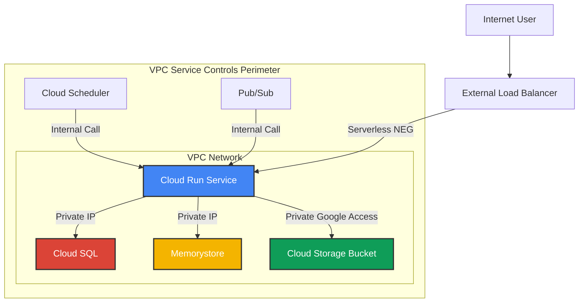

# Cloud Run 网络与安全精细化配置

本文档旨在详细阐述 Google Cloud Run 的高级网络与安全配置选项，帮助您将服务安全地集成到现有的云环境中。内容涵盖服务账号的最佳实践、VPC 网络集成、使用 KMS 进行密钥管理，以及多层次的网络安全策略。

---

## ✅ 核心原则：最小权限服务账号

在配置任何网络策略之前，必须为 Cloud Run 服务或作业配置一个具有最小权限的专用服务账号（Service Account）。这是所有安全实践的基石。Cloud Run 实例将使用此身份与 Google Cloud 的其他服务进行交互。

### 操作步骤

1.  **创建专用服务账号**：
    为每个服务或作业创建一个独立的服务账号，避免使用默认服务账号。

    ```bash
    gcloud iam service-accounts create ${sa_name} --display-name="${sa_name}"
    ```

2.  **授予精确权限**：
    仅授予该服务账号完成其任务所必需的 IAM 角色。例如，如果服务需要访问 Cloud Storage 存储桶，则仅授予相关的 Storage 角色。

    ```bash
    # 示例：授予访问特定存储桶的权限
    gsutil iam ch serviceAccount:${sa_name}@${project_id}.iam.gserviceaccount.com:objectAdmin gs://${bucket_name}
    ```

3.  **部署时指定服务账号**：
    在部署 Cloud Run 服务或作业时，明确指定使用此服务账号。

    ```bash
    gcloud run deploy ${service_name} \
      --image=${image_name} \
      --service-account=${sa_name}@${project_id}.iam.gserviceaccount.com
    ```

---

## ✅ VPC 集成：连接到您的私有网络

为了让 Cloud Run 服务能够访问您 VPC 网络中的资源（如 Cloud SQL、Memorystore、内部负载均衡器等），必须配置 VPC 出口（Egress）。

### 方式一：无服务器 VPC 访问连接器 (Serverless VPC Access Connector)

连接器是在您的 VPC 网络中运行的区域性资源，为无服务器环境提供到 VPC 的网络连接。

1.  **创建 VPC 连接器**：

    ```bash
    gcloud compute networks vpc-access connectors create ${connector_name} \
      --region=${region} \
      --network=${vpc_network_name} \
      --range=10.8.0.0/28 # 指定一个未使用的 /28 IP 范围
    ```

2.  **部署服务并关联连接器**：

    ```bash
    gcloud run deploy ${service_name} \
      --image=${image_name} \
      --vpc-connector=${connector_name} \
      --vpc-egress=all-traffic # 将所有出站流量路由到 VPC
    ```

### 方式二：直接 VPC 出口 (Direct VPC Egress)

对于新服务，推荐使用直接 VPC 出口，它无需管理连接器资源，配置更简单，成本效益更高。

-   **部署服务并指定网络**：

    ```bash
    gcloud run jobs create ${service_name} \
      --image=${image_name} \
      --network=${vpc_network_name} \
      --subnet=${subnet_name} \
      --vpc-egress=all-traffic
    ```

| **出口设置 (`--vpc-egress`)** | **说明** |
| :--- | :--- |
| `private-ranges-only` | **（默认）** 仅将发往 RFC 1918 私有 IP 地址的流量路由到 VPC。 |
| `all-traffic` | **（推荐）** 将所有出站流量都通过 VPC 路由。这允许您通过 Cloud NAT 为服务提供静态出口 IP，并通过 VPC 防火墙规则集中管理所有出口流量。 |

---

## ✅ 密钥管理：使用客户管理的加密密钥 (CMEK)

默认情况下，Cloud Run 使用 Google 管理的加密密钥来保护您的静态数据。为了更好地控制密钥，您可以使用 Cloud KMS 中您自己管理的密钥 (CMEK) 来加密部署的容器镜像。

### 操作步骤

1.  **创建 KMS 密钥环和密钥**：

    ```bash
    # 创建密钥环
    gcloud kms keyrings create ${keyring_name} --location=${region}

    # 创建密钥
    gcloud kms keys create ${key_name} \
      --keyring=${keyring_name} \
      --location=${region} \
      --purpose=encryption
    ```

2.  **授予 Cloud Run 服务代理权限**：
    Google 会为您的项目创建一个名为 **Cloud Run Service Agent** 的服务账号。您必须授予此服务代理使用您的 KMS 密钥的权限。

    ```bash
    # 获取服务代理的电子邮件地址
    SERVICE_AGENT=$(gcloud projects get-iam-policy ${project_id} --flatten="bindings[].members" --format='table(bindings.members)' --filter="bindings.role:roles/run.serviceAgent" | grep "serviceAgent" | awk '{print $1}')

    # 授予加密/解密权限
    gcloud kms keys add-iam-policy-binding ${key_name} \
      --keyring=${keyring_name} \
      --location=${region} \
      --member=${SERVICE_AGENT} \
      --role=roles/cloudkms.cryptoKeyEncrypterDecrypter
    ```

3.  **部署服务时指定 KMS 密钥**：

    ```bash
    gcloud run deploy ${service_name} \
      --image=${image_name} \
      --kms-key=projects/${project_id}/locations/${region}/keyRings/${keyring_name}/cryptoKeys/${key_name}
    ```

---

## ✅ 网络安全最佳实践

### 入口流量控制 (Ingress Control)

通过 `--ingress` 标志控制哪些流量可以访问您的 Cloud Run 服务。

| **入口设置 (`--ingress`)** | **说明** |
| :--- | :--- |
| `all` | **（默认）** 允许来自互联网和 VPC 的所有流量。 |
| `internal` | 仅允许来自同一项目或 VPC 服务控制边界内的 GCP 内部流量（如 VPC、Cloud Scheduler、Pub/Sub 等）。 |
| `internal-and-cloud-load-balancing` | 允许内部流量和通过外部应用负载均衡器传入的流量。这是将服务安全地暴露给外部的最佳实践。 |

### VPC 服务控制 (VPC Service Controls)

为了实现最高级别的安全保障，您可以将 Cloud Run 服务和其依赖的 GCP 资源（如 Cloud Storage、Cloud SQL）放置在一个 **VPC 服务控制边界**内。这可以创建一个虚拟的安全边界，防止数据从边界内部被意外或恶意泄露到外部，即使攻击者拥有有效的 IAM 凭证。

---

## 📈 架构图：安全集成的 Cloud Run 服务

下面的架构图展示了一个遵循安全最佳实践的 Cloud Run 服务。



---

## 📋 配置项总结表

| 配置项 | 功能说明 | 适用场景 | 关键 `gcloud` 标志 |
| :--- | :--- | :--- | :--- |
| **服务账号** | 定义服务身份，实现最小权限原则。 | 所有场景，安全基础。 | `--service-account` |
| **VPC 连接器** | 将服务连接到 VPC 网络（旧版方式）。 | 需要访问 VPC 内的资源，且无法使用直接出口。 | `--vpc-connector` |
| **直接 VPC 出口** | 将服务连接到 VPC 网络（推荐方式）。 | 需要访问 VPC 内的资源。 | `--network`, `--subnet` |
| **出口流量路由** | 控制出站流量是流向互联网还是 VPC。 | 需要通过 Cloud NAT 提供静态出口 IP，或通过 VPC 防火墙统一管理流量。 | `--vpc-egress` |
| **KMS/CMEK** | 使用客户管理的密钥加密容器镜像。 | 需要满足合规性要求，对密钥有完全控制权。 | `--kms-key` |
| **入口流量控制** | 限制可以调用服务的来源。 | 保护内部服务，或通过负载均衡器统一管理入口。 | `--ingress` |
| **VPC 服务控制** | 创建安全边界，防止数据泄露。 | 处理高度敏感数据，需要最高安全级别的环境。 | N/A (组织策略配置) |