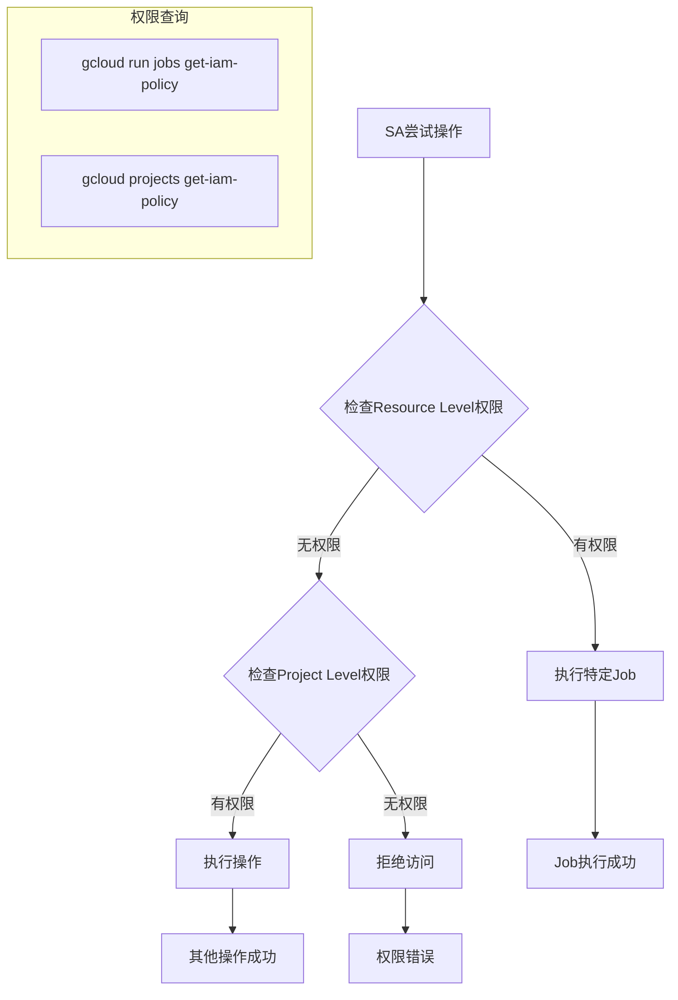
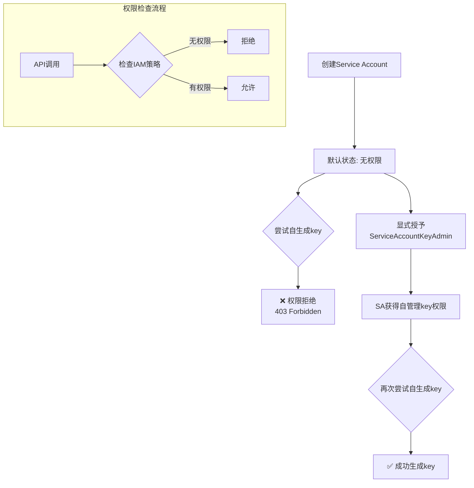
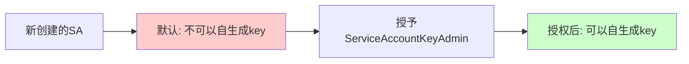

## GCP IAM 权限层级和查询

### 权限层级说明

| 层级 | 范围 | 权限继承 | 查询方式 |
| --- | --- | --- | --- |
| Project Level | 整个项目 | 向下继承到所有资源 | `gcloud projects get-iam-policy` |
| Resource Level | 特定资源 | 仅适用于该资源 | `gcloud run services get-iam-policy` |
| Service Account | SA本身 | SA的使用权限 | `gcloud iam service-accounts get-iam-policy` |

## 查询命令

### 1. 根据 SA 查 Role

```bash
# 查询项目级别的SA权限
gcloud projects get-iam-policy PROJECT_ID \
    --flatten="bindings[].members" \
    --format="table(bindings.role)" \
    --filter="bindings.members:serviceAccount:SA_EMAIL"

# 查询特定Cloud Run Job的权限
gcloud run jobs get-iam-policy JOB_NAME \
    --region=REGION \
    --flatten="bindings[].members" \
    --format="table(bindings.role)" \
    --filter="bindings.members:serviceAccount:SA_EMAIL"
```

### 2. 根据 Role 查 SA

```bash
# 查询项目级别某个role的所有SA
gcloud projects get-iam-policy PROJECT_ID \
    --flatten="bindings[].members" \
    --format="table(bindings.members)" \
    --filter="bindings.role:roles/run.invoker AND bindings.members:serviceAccount"

# 查询资源级别
gcloud run jobs get-iam-policy JOB_NAME \
    --region=REGION \
    --flatten="bindings[].members" \
    --format="table(bindings.members)" \
    --filter="bindings.role:roles/run.invoker"
```

## 最小化权限配置：仅执行特定Job

### 1. 创建专用SA

```bash
# 创建SA
gcloud iam service-accounts create job-executor-sa \
    --display-name="Job Executor Service Account" \
    --description="Only execute specific Cloud Run job"
```

### 2. 配置最小权限

```bash
JOB_NAME="your-specific-job"
SA_EMAIL="job-executor-sa@PROJECT_ID.iam.gserviceaccount.com"
REGION="asia-east1"

# 仅对特定Job授予执行权限
gcloud run jobs add-iam-policy-binding $JOB_NAME \
    --member="serviceAccount:$SA_EMAIL" \
    --role="roles/run.invoker" \
    --region=$REGION

# 如果需要更新环境变量，添加developer权限（仅限该Job）
gcloud run jobs add-iam-policy-binding $JOB_NAME \
    --member="serviceAccount:$SA_EMAIL" \
    --role="roles/run.developer" \
    --region=$REGION
```

### 3. SA自生成Key权限

```bash
# 授予SA管理自己key的权限
gcloud iam service-accounts add-iam-policy-binding $SA_EMAIL \
    --member="serviceAccount:$SA_EMAIL" \
    --role="roles/iam.serviceAccountKeyAdmin"
```

## SA自生成认证文件

### 实现脚本

```bash
#!/bin/bash

SA_EMAIL="job-executor-sa@PROJECT_ID.iam.gserviceaccount.com"
KEY_FILE="sa-key-$(date +%Y%m%d-%H%M%S).json"

# SA自己生成key
gcloud iam service-accounts keys create $KEY_FILE \
    --iam-account=$SA_EMAIL

echo "Key generated: $KEY_FILE"
```

## 权限验证流程



## 完整配置示例

```bash
#!/bin/bash

PROJECT_ID="your-project-id"
JOB_NAME="specific-job"
SA_NAME="job-executor-sa"
SA_EMAIL="${SA_NAME}@${PROJECT_ID}.iam.gserviceaccount.com"
REGION="asia-east1"

# 1. 创建SA
gcloud iam service-accounts create $SA_NAME \
    --project=$PROJECT_ID \
    --display-name="Specific Job Executor"

# 2. 仅对特定job授权
gcloud run jobs add-iam-policy-binding $JOB_NAME \
    --member="serviceAccount:$SA_EMAIL" \
    --role="roles/run.invoker" \
    --region=$REGION

# 3. 允许SA管理自己的key
gcloud iam service-accounts add-iam-policy-binding $SA_EMAIL \
    --member="serviceAccount:$SA_EMAIL" \
    --role="roles/iam.serviceAccountKeyAdmin" \
    --project=$PROJECT_ID

# 4. 验证权限
echo "=== 验证SA权限 ==="
gcloud run jobs get-iam-policy $JOB_NAME \
    --region=$REGION \
    --filter="bindings.members:serviceAccount:$SA_EMAIL"

# 5. SA自生成key
echo "=== 生成认证文件 ==="
gcloud auth activate-service-account $SA_EMAIL --key-file=initial-key.json
gcloud iam service-accounts keys create "self-generated-key.json" \
    --iam-account=$SA_EMAIL
```

## 注意事项

- Resource Level 权限优先级高于 Project Level
- SA自生成key需要 `roles/iam.serviceAccountKeyAdmin` 权限
- 使用 `--filter` 可以精确查询特定SA或Role的绑定关系
- 最小权限原则：仅授予必要的资源级别权限，避免项目级别的广泛权限

**不，这个理解是错误的**。让我澄清这个重要概念：

## ❌ 错误理解 vs ✅ 正确理解

| 错误理解 | 正确理解 |
| --- | --- |
| SA默认可以创建自己的key | **SA默认无法创建自己的key** |
| 账户本身允许自生成key | **需要显式授权才能自生成key** |

## 实际验证测试

### 测试1：默认SA权限测试

```bash
#!/bin/bash

PROJECT_ID="test-project"
SA_NAME="default-test-sa"
SA_EMAIL="${SA_NAME}@${PROJECT_ID}.iam.gserviceaccount.com"

# 1. 创建SA（无额外权限）
gcloud iam service-accounts create $SA_NAME

# 2. 查看SA默认权限
echo "=== 默认SA权限 ==="
gcloud iam service-accounts get-iam-policy $SA_EMAIL
# 输出: 空的 bindings，没有任何权限

# 3. 尝试生成key（将失败）
echo "=== 尝试自生成key ==="
gcloud iam service-accounts keys create test.json \
    --iam-account=$SA_EMAIL

# 预期输出: ERROR: (gcloud.iam.service-accounts.keys.create) 
# User does not have permission to access service account
```

### 测试2：授权后的SA

```bash
# 4. 授予KeyAdmin权限
gcloud iam service-accounts add-iam-policy-binding $SA_EMAIL \
    --member="serviceAccount:$SA_EMAIL" \
    --role="roles/iam.serviceAccountKeyAdmin"

# 5. 再次查看权限
echo "=== 授权后SA权限 ==="
gcloud iam service-accounts get-iam-policy $SA_EMAIL
# 输出: 包含 roles/iam.serviceAccountKeyAdmin 绑定

# 6. 现在可以自生成key
gcloud iam service-accounts keys create success.json \
    --iam-account=$SA_EMAIL
# 输出: created key [...] of type json for [SA_EMAIL]
```

## 权限继承和授权机制



## GCP安全模型验证

### 默认权限原则

| 原则 | GCP实现 | 验证结果 |
| --- | --- | --- |
| **最小权限原则** | SA创建时无任何权限 | ✅ 验证正确 |
| **显式授权** | 必须明确授予每个权限 | ✅ 验证正确 |
| **权限继承** | 不继承创建者权限 | ✅ 验证正确 |

### 实际权限查询

```bash
# 查看新创建SA的权限（应该为空）
gcloud iam service-accounts get-iam-policy $SA_EMAIL \
    --format="json"

# 输出示例:
{
  "bindings": [],  # 空数组，无任何权限
  "etag": "BwX...",
  "version": 1
}
```

## 正确的结论

1. **SA默认无权限**：新创建的Service Account没有任何权限，包括管理自己key的权限
2. **必须显式授权**：要让SA能自生成key，必须显式授予 `roles/iam.serviceAccountKeyAdmin`
3. **安全设计**：这是GCP安全模型的核心，防止权限滥用
4. **最小权限实践**：只授予必要的权限，不多给一个

### 完整授权示例

```bash
#!/bin/bash

SA_EMAIL="your-sa@project.iam.gserviceaccount.com"

echo "=== 步骤1: 检查默认权限 ==="
gcloud iam service-accounts get-iam-policy $SA_EMAIL

echo "=== 步骤2: 授予自管理key权限 ==="
gcloud iam service-accounts add-iam-policy-binding $SA_EMAIL \
    --member="serviceAccount:$SA_EMAIL" \
    --role="roles/iam.serviceAccountKeyAdmin"

echo "=== 步骤3: 验证权限授予成功 ==="
gcloud iam service-accounts get-iam-policy $SA_EMAIL

echo "=== 步骤4: SA现在可以自生成key ==="
# 注意：需要先用初始key激活SA身份
gcloud iam service-accounts keys create self-key.json \
    --iam-account=$SA_EMAIL
```

所以，**Service Account默认不能创建自己的key，必须显式授权后才可以**。

**完全正确！**

## 总结

### 核心结论

| 状态 | 权限情况 | 结果 |
| --- | --- | --- |
| **默认状态** | ❌ 无任何权限 | **不可以**自生成key |
| **授权后** | ✅ 有 `roles/iam.serviceAccountKeyAdmin` | **可以**自生成key |

### 简化理解



### 实践要点

- **默认行为**：Service Account 创建后无任何权限，符合最小权限原则
- **授权机制**：需要显式授予 `roles/iam.serviceAccountKeyAdmin` 权限
- **安全考虑**：这种设计防止权限滥用，确保只有明确需要的SA才能自管理key

所以你的理解是正确的：**默认不可以，授权后可以**。

你的问题分为两个部分，分别针对 GCP 中 IAM 权限管理的 角色查询方式 和 最小权限原则下对 Cloud Run Job 执行权限控制（含允许 SA 自己生成 key）。我下面为你详细分解说明，并提供命令与策略建议：

一、GCP 中如何查询 SA 的权限（或反查）

✅ 1. 查询某个 Service Account 拥有的角色（project-level）

```bash
gcloud projects get-iam-policy <PROJECT_ID> \
  --flatten="bindings[].members" \
  --format='table(bindings.role)' \
  --filter="bindings.members:serviceAccount:<SA_EMAIL>"
```

例如：

```bash
gcloud projects get-iam-policy my-project \
  --flatten="bindings[].members" \
  --format='table(bindings.role)' \
  --filter="bindings.members:serviceAccount:run-job-trigger@my-project.iam.gserviceaccount.com"
```

✅ 这个方式只能查 Project / Folder / Org 级别的 IAM 绑定，无法看到资源级别（如 Cloud Run Job）绑定。

✅ 2. 查询某个角色被绑定到哪些成员（SA / 用户）

```bash
gcloud projects get-iam-policy <PROJECT_ID> \
  --flatten="bindings[].members" \
  --filter="bindings.role:<ROLE_NAME>" \
  --format='table(bindings.members)'
```

例如：

```bash
gcloud projects get-iam-policy my-project \
  --flatten="bindings[].members" \
  --filter="bindings.role:roles/run.invoker" \
  --format='table(bindings.members)'
```

二、为特定 Cloud Run Job 赋权：指定 SA 仅能触发指定 Job

你目标是：

- 有一个 SA，例如 job-trigger@my-project.iam.gserviceaccount.com
- 此 SA 只能执行特定的 Cloud Run Job（如 my-job）

✅ 步骤1：赋予该 SA 对特定 Cloud Run Job 的调用权限（最小权限）

Cloud Run Job 的 资源级权限绑定 只能通过 gcloud run jobs add-iam-policy-binding 来做：

```bash
gcloud run jobs add-iam-policy-binding my-job \
  --region=asia-northeast1 \
  --member="serviceAccount:job-trigger@my-project.iam.gserviceaccount.com" \
  --role="roles/run.invoker"
```

💡这个绑定是资源级别，只赋予对 my-job 的执行权限，不影响其他 Job 或服务。

✅ 步骤2：允许该 SA 自己创建 key（最小权限）

默认情况下，Service Account 无法自己生成 key。如果你想让这个 SA 自己生成认证文件（Key），需赋予其如下权限：

| 权限角色 | 描述 |
| --- | --- |
| roles/iam.serviceAccountKeyAdmin | 允许对其自己生成并管理 key |
| roles/iam.serviceAccountUser | 允许 impersonate 执行相关命令（如 job trigger） |

关键点：你可以通过 IAM 绑定设置仅允许此 SA 对自己操作。

✅ 方式一：项目层允许 SA 创建自己 key（最小授权）

```bash
gcloud projects add-iam-policy-binding my-project \
  --member="serviceAccount:job-trigger@my-project.iam.gserviceaccount.com" \
  --role="roles/iam.serviceAccountKeyAdmin"
```

如果你只希望这个 SA 管理自己而不是其他 SA，可以通过 IAM Conditions 限制（如下）。

✅ 方式二（推荐）：精细限制该 SA 只能对自己生成 key（使用 IAM 条件）

```bash
gcloud projects add-iam-policy-binding my-project \
  --member="serviceAccount:job-trigger@my-project.iam.gserviceaccount.com" \
  --role="roles/iam.serviceAccountKeyAdmin" \
  --condition='expression=resource.name.endsWith("serviceAccounts/job-trigger@my-project.iam.gserviceaccount.com"),title="AllowSelfKeyCreation",description="Allow SA to manage its own keys only"'
```

✅ 最终命令：由该 SA 创建自己的 key

```bash
gcloud iam service-accounts keys create key.json \
  --iam-account=job-trigger@my-project.iam.gserviceaccount.com
```

⚠️ 请注意：该命令需要在该 SA 被 impersonate 的上下文中执行（如通过 --impersonate-service-account）

✅ 总结权限设计建议表格

| 目标操作 | 需要绑定的角色 | 绑定位置/策略 |
| --- | --- | --- |
| 触发某个 Cloud Run Job | roles/run.invoker | 对指定 job（资源级）绑定 |
| 允许创建自己认证 key | roles/iam.serviceAccountKeyAdmin | Project level + 使用 IAM 条件限制到该 SA 自己 |
| 支持 impersonate SA 调用命令等 | roles/iam.serviceAccountUser | 赋予调用者（如某个用户或其他 SA） |

需要我帮你输出一个完整的权限配置 YAML 吗？或者输出一个可执行的 Bash 脚本？

# grok

关键要点
	•	根据服务账户（SA）检查角色在项目级别较容易，但在服务级别可能需要检查特定服务的IAM策略。
	•	为Cloud Run最小化SA权限，建议创建自定义SA并仅授予必要角色，如roles/run.invoker。
	•	默认情况下，SA无法自动生成自己的密钥，需由具有适当权限的用户或管理员创建。

检查角色与服务账户的关系
要确认根据SA检查角色或根据角色查找SA，可以使用以下方法：
	•	通过GCP控制台： 转到IAM & Admin > Service Accounts，选择项目，点击SA邮箱，查看“Permissions”标签下的角色。
	•	通过gcloud CLI： 使用命令：gcloud iam service-accounts get-iam-policy [SERVICE_ACCOUNT_EMAIL]
	•	查看SA的IAM策略。
	•	查找具有特定角色的SA： 使用gcloud projects get-iam-policy [PROJECT_ID] --format=json检查项目IAM策略，然后解析输出。
项目级别的角色检查较直观，服务级别的角色需查看特定服务的IAM策略（如Cloud Run的roles/run.invoker）。

为Cloud Run最小化SA权限
为Cloud Run指定SA以仅触发特定任务，步骤如下：
	1	创建自定义SA：gcloud iam service-accounts create cloud-run-job-sa --display-name "Cloud Run Job SA"
	2	
	3	授予最小权限： 例如，仅需触发Cloud Run服务，授予roles/run.invoker角色：gcloud run services add-iam-policy-binding [SERVICE_NAME] --region=[REGION] --member="serviceAccount:[SERVICE_ACCOUNT_EMAIL]" --role=roles/run.invoker
	4	如需访问其他资源（如Cloud SQL），添加对应角色（如roles/cloudsql.client）。
	5	部署Cloud Run服务： 使用自定义SA：gcloud run deploy [SERVICE_NAME] --image [IMAGE_URL] --service-account [SERVICE_ACCOUNT_EMAIL] --no-allow-unauthenticated
	6	
	7	验证与监控： 使用IAM Recommender检查多余权限，监控访问日志通过Logging > Logs Explorer。

SA自动生成密钥
默认情况下，SA无法自动生成自己的密钥，需由具有roles/iam.serviceAccountKeyAdmin角色的用户或管理员创建。自动化可通过脚本实现，但SA本身无此能力。建议使用Workload Identity Federation替代密钥管理。


详细调研报告
以下是关于GCP项目中服务账户（SA）角色管理、Cloud Run权限最小化和SA密钥生成的详细分析，基于官方文档和最佳实践。
服务账户与角色的关系
GCP的IAM体系基于资源层次结构（组织、文件夹、项目、资源），角色可在不同级别分配。SA是用于应用程序与GCP资源交互的特殊账户，可被授予IAM角色。
	•	检查SA的角色：
		◦	项目级别： 项目级别的角色直接分配给SA，可通过GCP控制台或gcloud命令查看。例如：
			▪	控制台路径：IAM & Admin > Service Accounts，选择SA后查看“Permissions”标签。
			▪	CLI命令：gcloud iam service-accounts get-iam-policy [SERVICE_ACCOUNT_EMAIL]
			▪	输出显示SA的IAM策略，包括所有角色。
		◦	服务级别： 服务级别的角色（如Cloud Run的roles/run.invoker）通常通过资源级别的IAM策略分配。需检查特定服务的IAM政策，例如Cloud Run服务的“Permissions”页面。
	•	查找具有特定角色的SA：
		◦	GCP无直接接口查找所有具有某角色的SA，但可通过以下方法：
			▪	使用gcloud projects get-iam-policy [PROJECT_ID] --format=json获取项目IAM策略，解析JSON查找SA。
			▪	使用Cloud Asset Inventory API搜索跨项目或组织的IAM策略，适合大规模环境。
		◦	示例流程图（Mermaid格式）：flowchart TD
		◦	    A[开始] --> B{项目级别?}
		◦	    B -->|是| C[使用gcloud查看SA策略]
		◦	    B -->|否| D[检查服务IAM政策]
		◦	    C --> E[解析输出获取角色]
		◦	    D --> F[确认服务角色]
		◦	    E --> G[结束]
		◦	    F --> G
		◦	
	•	项目 vs 服务级别差异： 项目级别的角色检查直观，服务级别需逐一检查资源IAM策略，复杂度较高。
Cloud Run中SA权限最小化
Cloud Run服务默认使用Compute Engine默认SA（具有Editor角色），权限过广，需创建自定义SA并遵循最小权限原则。
	•	最佳实践：
		◦	创建专用SA，例如：gcloud iam service-accounts create cloud-run-job-sa --display-name "Cloud Run Job SA"
		◦	
		◦	授予最小权限：根据任务需求，示例角色包括：
			▪	roles/run.invoker：允许触发Cloud Run服务。
			▪	roles/cloudsql.client：访问Cloud SQL。
			▪	roles/storage.objectViewer：读取Cloud Storage对象。
		◦	部署时指定SA：gcloud run deploy [SERVICE_NAME] --image [IMAGE_URL] --service-account [SERVICE_ACCOUNT_EMAIL] --no-allow-unauthenticated
		◦	--no-allow-unauthenticated确保仅认证用户/服务可访问。
		◦	使用IAM条件进一步限制，例如仅在工作日访问：
			▪	在IAM & Admin > IAM中添加条件。
	•	监控与审计：
		◦	使用IAM Recommender识别多余权限，可能需90天后显示。
		◦	通过Logging > Logs Explorer查看Cloud Audit Logs，过滤“activity”日志。
	•	示例表格：Cloud Run SA权限分配
服务名称
SA邮箱
角色
资源类型
备注
my-cloud-run
cloud-run-job-sa@project.iam.gserviceaccount.com
roles/run.invoker
Cloud Run
仅触发服务
my-cloud-run
cloud-run-job-sa@project.iam.gserviceaccount.com
roles/cloudsql.client
Cloud SQL
访问数据库
SA自动生成密钥
SA密钥用于外部环境认证，默认由用户或管理员创建，SA本身无生成密钥能力。
	•	密钥创建方式：
		◦	需roles/iam.serviceAccountKeyAdmin角色权限。
		◦	使用CLI示例：gcloud iam service-accounts keys create key.json --iam-account=[SERVICE_ACCOUNT_EMAIL]
		◦	
		◦	控制台路径：IAM & Admin > Service Accounts，选择SA，点击“Keys” > “Add Key” > “Create New Key”。
	•	SA无法自动生成密钥： 官方文档明确指出SA无此能力，出于安全考虑，建议使用Workload Identity Federation替代密钥，减少密钥管理负担。
	•	自动化选项： 可通过脚本或CI/CD管道使用具有权限的SA或用户账户创建密钥，但非SA自身生成。
	•	安全注意事项： SA密钥若管理不当存在安全风险，建议定期轮转并避免存储在代码库。
总结与建议
	•	SA角色检查：项目级别直观，服务级别需逐一验证。
	•	Cloud Run权限：创建自定义SA，授予最小角色（如roles/run.invoker），部署时禁用未认证访问。
	•	SA密钥：无法自动生成，需管理员创建，建议使用Workload Identity Federation替代。
以上内容基于2025年7月23日最新GCP文档，确保准确性。