 ## GCP IAM 权限层级和查询

### 权限层级说明

|层级             |范围  |权限继承     |查询方式                                        |
|---------------|----|---------|--------------------------------------------|
|Project Level  |整个项目|向下继承到所有资源|`gcloud projects get-iam-policy`            |
|Resource Level |特定资源|仅适用于该资源  |`gcloud run services get-iam-policy`        |
|Service Account|SA本身|SA的使用权限  |`gcloud iam service-accounts get-iam-policy`|

## 查询命令

### 1. 根据 SA 查 Role

```bash
# 查询项目级别的SA权限
gcloud projects get-iam-policy PROJECT_ID \
    --flatten="bindings[].members" \
    --format="table(bindings.role)" \
    --filter="bindings.members:serviceAccount:SA_EMAIL"

# 查询特定Cloud Run Job的权限
gcloud run jobs get-iam-policy JOB_NAME \
    --region=REGION \
    --flatten="bindings[].members" \
    --format="table(bindings.role)" \
    --filter="bindings.members:serviceAccount:SA_EMAIL"
```

### 2. 根据 Role 查 SA

```bash
# 查询项目级别某个role的所有SA
gcloud projects get-iam-policy PROJECT_ID \
    --flatten="bindings[].members" \
    --format="table(bindings.members)" \
    --filter="bindings.role:roles/run.invoker AND bindings.members:serviceAccount"

# 查询资源级别
gcloud run jobs get-iam-policy JOB_NAME \
    --region=REGION \
    --flatten="bindings[].members" \
    --format="table(bindings.members)" \
    --filter="bindings.role:roles/run.invoker"
```

## 最小化权限配置：仅执行特定Job

### 1. 创建专用SA

```bash
# 创建SA
gcloud iam service-accounts create job-executor-sa \
    --display-name="Job Executor Service Account" \
    --description="Only execute specific Cloud Run job"
```

### 2. 配置最小权限

```bash
JOB_NAME="your-specific-job"
SA_EMAIL="job-executor-sa@PROJECT_ID.iam.gserviceaccount.com"
REGION="asia-east1"

# 仅对特定Job授予执行权限
gcloud run jobs add-iam-policy-binding $JOB_NAME \
    --member="serviceAccount:$SA_EMAIL" \
    --role="roles/run.invoker" \
    --region=$REGION

# 如果需要更新环境变量，添加developer权限（仅限该Job）
gcloud run jobs add-iam-policy-binding $JOB_NAME \
    --member="serviceAccount:$SA_EMAIL" \
    --role="roles/run.developer" \
    --region=$REGION
```

### 3. SA自生成Key权限

```bash
# 授予SA管理自己key的权限
gcloud iam service-accounts add-iam-policy-binding $SA_EMAIL \
    --member="serviceAccount:$SA_EMAIL" \
    --role="roles/iam.serviceAccountKeyAdmin"
```

## SA自生成认证文件

### 实现脚本

```bash
#!/bin/bash

SA_EMAIL="job-executor-sa@PROJECT_ID.iam.gserviceaccount.com"
KEY_FILE="sa-key-$(date +%Y%m%d-%H%M%S).json"

# SA自己生成key
gcloud iam service-accounts keys create $KEY_FILE \
    --iam-account=$SA_EMAIL

echo "Key generated: $KEY_FILE"
```

## 权限验证流程

```mermaid
flowchart TD
    A[SA尝试操作] --> B{检查Resource Level权限}
    B -->|有权限| C[执行特定Job]
    B -->|无权限| D{检查Project Level权限}
    D -->|有权限| E[执行操作]
    D -->|无权限| F[拒绝访问]
    
    C --> G[Job执行成功]
    E --> H[其他操作成功]
    F --> I[权限错误]
    
    subgraph "权限查询"
        J[gcloud run jobs get-iam-policy]
        K[gcloud projects get-iam-policy]
    end
```



## 完整配置示例

```bash
#!/bin/bash

PROJECT_ID="your-project-id"
JOB_NAME="specific-job"
SA_NAME="job-executor-sa"
SA_EMAIL="${SA_NAME}@${PROJECT_ID}.iam.gserviceaccount.com"
REGION="asia-east1"

# 1. 创建SA
gcloud iam service-accounts create $SA_NAME \
    --project=$PROJECT_ID \
    --display-name="Specific Job Executor"

# 2. 仅对特定job授权
gcloud run jobs add-iam-policy-binding $JOB_NAME \
    --member="serviceAccount:$SA_EMAIL" \
    --role="roles/run.invoker" \
    --region=$REGION

# 3. 允许SA管理自己的key
gcloud iam service-accounts add-iam-policy-binding $SA_EMAIL \
    --member="serviceAccount:$SA_EMAIL" \
    --role="roles/iam.serviceAccountKeyAdmin" \
    --project=$PROJECT_ID

# 4. 验证权限
echo "=== 验证SA权限 ==="
gcloud run jobs get-iam-policy $JOB_NAME \
    --region=$REGION \
    --filter="bindings.members:serviceAccount:$SA_EMAIL"

# 5. SA自生成key
echo "=== 生成认证文件 ==="
gcloud auth activate-service-account $SA_EMAIL --key-file=initial-key.json
gcloud iam service-accounts keys create "self-generated-key.json" \
    --iam-account=$SA_EMAIL
```

## 注意事项

- Resource Level 权限优先级高于 Project Level
- SA自生成key需要 `roles/iam.serviceAccountKeyAdmin` 权限
- 使用 `--filter` 可以精确查询特定SA或Role的绑定关系
- 最小权限原则：仅授予必要的资源级别权限，避免项目级别的广泛权限​​​​​​​​​​​​​​​​


**不，这个理解是错误的**。让我澄清这个重要概念：

## ❌ 错误理解 vs ✅ 正确理解

|错误理解          |正确理解              |
|--------------|------------------|
|SA默认可以创建自己的key|**SA默认无法创建自己的key**|
|账户本身允许自生成key  |**需要显式授权才能自生成key**|

## 实际验证测试

### 测试1：默认SA权限测试

```bash
#!/bin/bash

PROJECT_ID="test-project"
SA_NAME="default-test-sa"
SA_EMAIL="${SA_NAME}@${PROJECT_ID}.iam.gserviceaccount.com"

# 1. 创建SA（无额外权限）
gcloud iam service-accounts create $SA_NAME

# 2. 查看SA默认权限
echo "=== 默认SA权限 ==="
gcloud iam service-accounts get-iam-policy $SA_EMAIL
# 输出: 空的 bindings，没有任何权限

# 3. 尝试生成key（将失败）
echo "=== 尝试自生成key ==="
gcloud iam service-accounts keys create test.json \
    --iam-account=$SA_EMAIL

# 预期输出: ERROR: (gcloud.iam.service-accounts.keys.create) 
# User does not have permission to access service account
```

### 测试2：授权后的SA

```bash
# 4. 授予KeyAdmin权限
gcloud iam service-accounts add-iam-policy-binding $SA_EMAIL \
    --member="serviceAccount:$SA_EMAIL" \
    --role="roles/iam.serviceAccountKeyAdmin"

# 5. 再次查看权限
echo "=== 授权后SA权限 ==="
gcloud iam service-accounts get-iam-policy $SA_EMAIL
# 输出: 包含 roles/iam.serviceAccountKeyAdmin 绑定

# 6. 现在可以自生成key
gcloud iam service-accounts keys create success.json \
    --iam-account=$SA_EMAIL
# 输出: created key [...] of type json for [SA_EMAIL]
```

## 权限继承和授权机制

```mermaid
flowchart TD
    A[创建Service Account] --> B[默认状态: 无权限]
    B --> C{尝试自生成key}
    C --> D[❌ 权限拒绝<br/>403 Forbidden]
    
    B --> E[显式授予<br/>ServiceAccountKeyAdmin]
    E --> F[SA获得自管理key权限]
    F --> G{再次尝试自生成key}
    G --> H[✅ 成功生成key]
    
    subgraph "权限检查流程"
        I[API调用] --> J{检查IAM策略}
        J -->|无权限| K[拒绝]
        J -->|有权限| L[允许]
    end
```



## GCP安全模型验证

### 默认权限原则

|原则        |GCP实现     |验证结果  |
|----------|----------|------|
|**最小权限原则**|SA创建时无任何权限|✅ 验证正确|
|**显式授权**  |必须明确授予每个权限|✅ 验证正确|
|**权限继承**  |不继承创建者权限  |✅ 验证正确|

### 实际权限查询

```bash
# 查看新创建SA的权限（应该为空）
gcloud iam service-accounts get-iam-policy $SA_EMAIL \
    --format="json"

# 输出示例:
{
  "bindings": [],  # 空数组，无任何权限
  "etag": "BwX...",
  "version": 1
}
```

## 正确的结论

1. **SA默认无权限**：新创建的Service Account没有任何权限，包括管理自己key的权限
2. **必须显式授权**：要让SA能自生成key，必须显式授予 `roles/iam.serviceAccountKeyAdmin`
3. **安全设计**：这是GCP安全模型的核心，防止权限滥用
4. **最小权限实践**：只授予必要的权限，不多给一个

### 完整授权示例

```bash
#!/bin/bash

SA_EMAIL="your-sa@project.iam.gserviceaccount.com"

echo "=== 步骤1: 检查默认权限 ==="
gcloud iam service-accounts get-iam-policy $SA_EMAIL

echo "=== 步骤2: 授予自管理key权限 ==="
gcloud iam service-accounts add-iam-policy-binding $SA_EMAIL \
    --member="serviceAccount:$SA_EMAIL" \
    --role="roles/iam.serviceAccountKeyAdmin"

echo "=== 步骤3: 验证权限授予成功 ==="
gcloud iam service-accounts get-iam-policy $SA_EMAIL

echo "=== 步骤4: SA现在可以自生成key ==="
# 注意：需要先用初始key激活SA身份
gcloud iam service-accounts keys create self-key.json \
    --iam-account=$SA_EMAIL
```

所以，**Service Account默认不能创建自己的key，必须显式授权后才可以**。​​​​​​​​​​​​​​​​

**完全正确！**

## 总结

### 核心结论

|状态      |权限情况                                  |结果           |
|--------|--------------------------------------|-------------|
|**默认状态**|❌ 无任何权限                               |**不可以**自生成key|
|**授权后** |✅ 有 `roles/iam.serviceAccountKeyAdmin`|**可以**自生成key |

### 简化理解

```mermaid
flowchart LR
    A[新创建的SA] --> B[默认: 不可以自生成key]
    B --> C[授予ServiceAccountKeyAdmin]
    C --> D[授权后: 可以自生成key]
    
    style B fill:#ffcccc
    style D fill:#ccffcc
```



### 实践要点

- **默认行为**：Service Account 创建后无任何权限，符合最小权限原则
- **授权机制**：需要显式授予 `roles/iam.serviceAccountKeyAdmin` 权限
- **安全考虑**：这种设计防止权限滥用，确保只有明确需要的SA才能自管理key

所以你的理解是正确的：**默认不可以，授权后可以**。​​​​​​​​​​​​​​​​


你的问题分为两个部分，分别针对 GCP 中 IAM 权限管理的 角色查询方式 和 最小权限原则下对 Cloud Run Job 执行权限控制（含允许 SA 自己生成 key）。我下面为你详细分解说明，并提供命令与策略建议：

  

  

  

  

一、GCP 中如何查询 SA 的权限（或反查）

  

  

  

✅ 1. 查询某个 Service Account 拥有的角色（project-level）

  

gcloud projects get-iam-policy <PROJECT_ID> \

  --flatten="bindings[].members" \

  --format='table(bindings.role)' \

  --filter="bindings.members:serviceAccount:<SA_EMAIL>"

例如：

gcloud projects get-iam-policy my-project \

  --flatten="bindings[].members" \

  --format='table(bindings.role)' \

  --filter="bindings.members:serviceAccount:run-job-trigger@my-project.iam.gserviceaccount.com"

✅ 这个方式只能查 Project / Folder / Org 级别的 IAM 绑定，无法看到资源级别（如 Cloud Run Job）绑定。

  

  

  

  

✅ 2. 查询某个角色被绑定到哪些成员（SA / 用户）

  

gcloud projects get-iam-policy <PROJECT_ID> \

  --flatten="bindings[].members" \

  --filter="bindings.role:<ROLE_NAME>" \

  --format='table(bindings.members)'

例如：

gcloud projects get-iam-policy my-project \

  --flatten="bindings[].members" \

  --filter="bindings.role:roles/run.invoker" \

  --format='table(bindings.members)'

  

  

  

  

二、为特定 Cloud Run Job 赋权：指定 SA 仅能触发指定 Job

  

  

你目标是：

  

- 有一个 SA，例如 job-trigger@my-project.iam.gserviceaccount.com
- 此 SA 只能执行特定的 Cloud Run Job（如 my-job）

  

  

  

  

  

✅ 步骤1：赋予该 SA 对特定 Cloud Run Job 的调用权限（最小权限）

  

  

Cloud Run Job 的 资源级权限绑定 只能通过 gcloud run jobs add-iam-policy-binding 来做：

gcloud run jobs add-iam-policy-binding my-job \

  --region=asia-northeast1 \

  --member="serviceAccount:job-trigger@my-project.iam.gserviceaccount.com" \

  --role="roles/run.invoker"

💡这个绑定是资源级别，只赋予对 my-job 的执行权限，不影响其他 Job 或服务。

  

  

  

  

✅ 步骤2：允许该 SA 自己创建 key（最小权限）

  

  

默认情况下，Service Account 无法自己生成 key。如果你想让这个 SA 自己生成认证文件（Key），需赋予其如下权限：

|   |   |
|---|---|
|权限角色|描述|
|roles/iam.serviceAccountKeyAdmin|允许对其自己生成并管理 key|
|roles/iam.serviceAccountUser|允许 impersonate 执行相关命令（如 job trigger）|

关键点：你可以通过 IAM 绑定设置仅允许此 SA 对自己操作。

  

  

  

  

✅ 方式一：项目层允许 SA 创建自己 key（最小授权）

  

gcloud projects add-iam-policy-binding my-project \

  --member="serviceAccount:job-trigger@my-project.iam.gserviceaccount.com" \

  --role="roles/iam.serviceAccountKeyAdmin"

如果你只希望这个 SA 管理自己而不是其他 SA，可以通过 IAM Conditions 限制（如下）。

  

  

  

  

✅ 方式二（推荐）：精细限制该 SA 只能对自己生成 key（使用 IAM 条件）

  

gcloud projects add-iam-policy-binding my-project \

  --member="serviceAccount:job-trigger@my-project.iam.gserviceaccount.com" \

  --role="roles/iam.serviceAccountKeyAdmin" \

  --condition='expression=resource.name.endsWith("serviceAccounts/job-trigger@my-project.iam.gserviceaccount.com"),title="AllowSelfKeyCreation",description="Allow SA to manage its own keys only"'

  

  

  

  

✅ 最终命令：由该 SA 创建自己的 key

  

gcloud iam service-accounts keys create key.json \

  --iam-account=job-trigger@my-project.iam.gserviceaccount.com

⚠️ 请注意：该命令需要在该 SA 被 impersonate 的上下文中执行（如通过 --impersonate-service-account）

  

  

  

  

✅ 总结权限设计建议表格

  

|   |   |   |
|---|---|---|
|目标操作|需要绑定的角色|绑定位置/策略|
|触发某个 Cloud Run Job|roles/run.invoker|对指定 job（资源级）绑定|
|允许创建自己认证 key|roles/iam.serviceAccountKeyAdmin|Project level + 使用 IAM 条件限制到该 SA 自己|
|支持 impersonate SA 调用命令等|roles/iam.serviceAccountUser|赋予调用者（如某个用户或其他 SA）|

  

  

  

需要我帮你输出一个完整的权限配置 YAML 吗？或者输出一个可执行的 Bash 脚本？