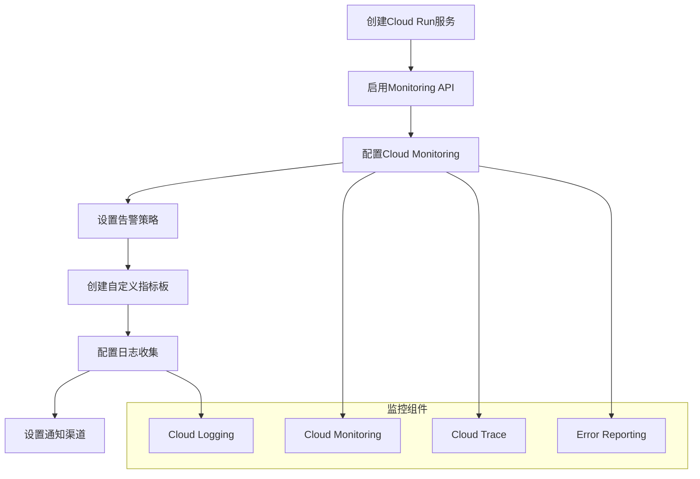
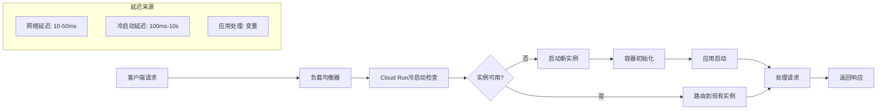
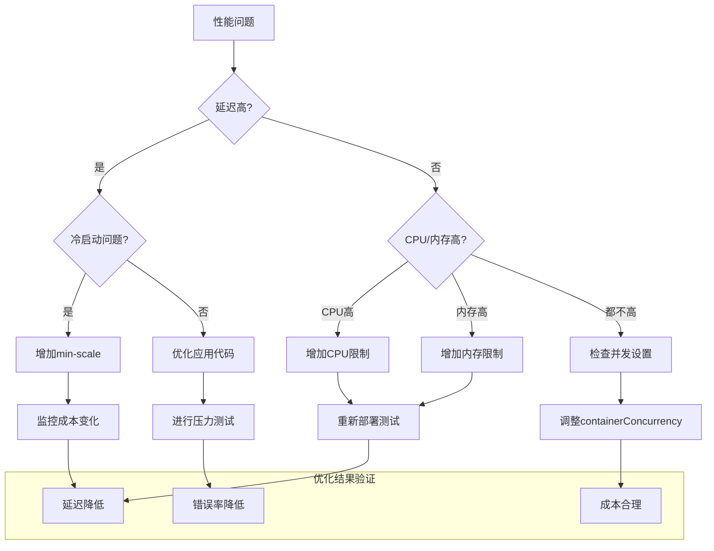

# Claude
# Cloud Run 监控与性能评估实战指南

## 1. 核心监控指标概述

Cloud Run 提供了丰富的监控指标，主要分为以下几个维度：

### 请求相关指标

|指标名称|描述|单位|重要性|
|---|---|---|---|
|request_count|请求总数|次数|⭐⭐⭐|
|request_latencies|请求延迟分布|毫秒|⭐⭐⭐|
|billable_instance_time|计费实例时间|秒|⭐⭐⭐|
|container_cpu_utilization|CPU利用率|百分比|⭐⭐|
|container_memory_utilization|内存利用率|百分比|⭐⭐|

### 实例相关指标

|指标名称|描述|监控重点|
|---|---|---|
|instance_count|活跃实例数量|扩缩容行为|
|container_started_count|容器启动次数|冷启动频率|
|container_cpu_allocation|CPU分配量|资源配置|
|container_memory_allocation|内存分配量|资源配置|

## 2. 监控设置流程



### 2.1 启用必要的API

```bash
# 启用必要的API
gcloud services enable monitoring.googleapis.com
gcloud services enable logging.googleapis.com
gcloud services enable cloudtrace.googleapis.com
gcloud services enable clouderrorreporting.googleapis.com
```

### 2.2 配置监控标签

```yaml
# cloud-run-service.yaml
apiVersion: serving.knative.dev/v1
kind: Service
metadata:
  name: my-service
  labels:
    environment: "production"
    team: "backend"
  annotations:
    run.googleapis.com/cpu-throttling: "false"
spec:
  template:
    metadata:
      labels:
        version: "v1.2.0"
      annotations:
        autoscaling.knative.dev/maxScale: "100"
        autoscaling.knative.dev/minScale: "1"
    spec:
      containerConcurrency: 80
      containers:
      - image: gcr.io/project/image:latest
        resources:
          limits:
            cpu: "2"
            memory: "2Gi"
```

## 3. 关键性能指标分析

### 3.1 请求延迟分析



### 3.2 冷启动优化策略

```bash
# 查看冷启动相关指标
gcloud logging read "
resource.type=cloud_run_revision AND
jsonPayload.message=~'.*started.*'
" --limit=50 --format="table(
timestamp,
resource.labels.service_name,
jsonPayload.message
)"
```

**优化方案:**

|策略|实现方法|效果|
|---|---|---|
|最小实例数|`autoscaling.knative.dev/minScale: "1"`|减少冷启动|
|预热请求|定期发送健康检查|保持实例活跃|
|减少依赖|优化Docker镜像大小|加快启动速度|
|并发控制|调整`containerConcurrency`|平衡性能和成本|

## 4. 告警配置实战

### 4.1 创建告警策略

```bash
# 高延迟告警
gcloud alpha monitoring policies create \
  --policy-from-file=high-latency-policy.yaml

# 错误率告警
gcloud alpha monitoring policies create \
  --policy-from-file=error-rate-policy.yaml
```

```yaml
# high-latency-policy.yaml
displayName: "Cloud Run High Latency Alert"
conditions:
  - displayName: "Request latency > 2s"
    conditionThreshold:
      filter: 'resource.type="cloud_run_revision"'
      comparison: COMPARISON_GREATER_THAN
      thresholdValue: 2000
      duration: 300s
      aggregations:
        - alignmentPeriod: 60s
          perSeriesAligner: ALIGN_MEAN
          crossSeriesReducer: REDUCE_MEAN
          groupByFields:
            - resource.labels.service_name
notificationChannels:
  - projects/PROJECT_ID/notificationChannels/CHANNEL_ID
```

### 4.2 自定义指标监控

```python
# Python应用中添加自定义指标
from google.cloud import monitoring_v3
import time

def track_custom_metric(metric_value, metric_type):
    client = monitoring_v3.MetricServiceClient()
    project_name = f"projects/{PROJECT_ID}"
    
    series = monitoring_v3.TimeSeries()
    series.metric.type = f"custom.googleapis.com/{metric_type}"
    series.resource.type = "cloud_run_revision"
    series.resource.labels["service_name"] = SERVICE_NAME
    series.resource.labels["revision_name"] = REVISION_NAME
    
    now = time.time()
    seconds = int(now)
    nanos = int((now - seconds) * 10 ** 9)
    interval = monitoring_v3.TimeInterval(
        {"end_time": {"seconds": seconds, "nanos": nanos}}
    )
    point = monitoring_v3.Point(
        {"interval": interval, "value": {"double_value": metric_value}}
    )
    series.points = [point]
    
    client.create_time_series(name=project_name, time_series=[series])
```

## 5. 日志分析与调试

### 5.1 结构化日志配置

```python
# 推荐的日志格式
import json
import logging
from google.cloud.logging import Client

def setup_logging():
    client = Client()
    client.setup_logging()
    
    # 结构化日志格式
    formatter = logging.Formatter(
        json.dumps({
            'timestamp': '%(asctime)s',
            'severity': '%(levelname)s',
            'message': '%(message)s',
            'trace': '%(trace)s' if hasattr(logging.LogRecord, 'trace') else None
        })
    )
    
    handler = logging.StreamHandler()
    handler.setFormatter(formatter)
    
    logger = logging.getLogger()
    logger.addHandler(handler)
    logger.setLevel(logging.INFO)
    
    return logger
```

### 5.2 错误追踪查询

```bash
# 查询错误日志
gcloud logging read "
resource.type=cloud_run_revision AND
severity>=ERROR AND
timestamp>=\"$(date -d '1 hour ago' --iso-8601)\"
" --format="table(
timestamp,
resource.labels.service_name,
jsonPayload.message,
severity
)" --limit=20

# 查询特定服务的慢请求
gcloud logging read "
resource.type=cloud_run_revision AND
resource.labels.service_name=\"my-service\" AND
httpRequest.latency>\"2s\"
" --format="table(
timestamp,
httpRequest.requestMethod,
httpRequest.requestUrl,
httpRequest.latency,
httpRequest.status
)"
```

## 6. 性能优化决策树



## 7. 成本监控与优化

### 7.1 成本分析查询

```bash
# 查看详细计费信息
gcloud logging read "
resource.type=cloud_run_revision AND
jsonPayload.billable_instance_time
" --format="table(
timestamp,
resource.labels.service_name,
jsonPayload.billable_instance_time,
resource.labels.revision_name
)" --limit=100

# 创建成本预算告警
gcloud billing budgets create \
  --billing-account=BILLING_ACCOUNT_ID \
  --display-name="Cloud Run Budget" \
  --budget-amount=100USD \
  --threshold-percent=80,90,100
```

### 7.2 资源利用率监控

|优化策略|监控指标|目标值|调整方法|
|---|---|---|---|
|CPU优化|container_cpu_utilization|60-80%|调整CPU limits|
|内存优化|container_memory_utilization|70-85%|调整内存limits|
|并发优化|request_count vs instance_count|最大化请求/实例比|调整containerConcurrency|
|扩缩容优化|container_started_count|最小化冷启动|调整min/max scale|

## 8. 监控仪表板配置

### 8.1 创建自定义仪表板

```json
{
  "displayName": "Cloud Run Performance Dashboard",
  "mosaicLayout": {
    "tiles": [
      {
        "width": 6,
        "height": 4,
        "widget": {
          "title": "Request Latency",
          "xyChart": {
            "dataSets": [{
              "timeSeriesQuery": {
                "timeSeriesFilter": {
                  "filter": "resource.type=\"cloud_run_revision\"",
                  "aggregation": {
                    "alignmentPeriod": "60s",
                    "perSeriesAligner": "ALIGN_MEAN"
                  }
                }
              }
            }]
          }
        }
      }
    ]
  }
}
```

### 8.2 关键指标监控配置

```bash
# 部署监控配置
gcloud monitoring dashboards create \
  --config-from-file=dashboard-config.json

# 验证告警策略
gcloud alpha monitoring policies list \
  --filter="displayName:('Cloud Run')" \
  --format="table(name,displayName,enabled)"
```

这份指南涵盖了 Cloud Run 监控的核心要素，通过实施这些监控策略，你将能够：

- 快速识别性能瓶颈
- 优化资源配置和成本
- 建立主动的问题预防机制
- 提升应用的可观测性

建议先从基础指标监控开始，逐步完善告警体系和自定义监控能力。

# Grok 
# Cloud Run 监控与性能评估实战指南

本文档是为开发者提供的一份实战指南，旨在帮助您掌握监控和评估 Google Cloud Run 服务性能的核心技能。有效的监控是快速调试问题、优化性能和控制成本的关键。

Cloud Run 的监控主要依赖两个核心工具：

1.  **Cloud Logging**：用于深入分析每次请求的详细日志和应用内部打印的日志。
2.  **Cloud Monitoring**：用于观察服务的宏观性能指标、趋势和设置告警。

## Cloud Logging 的实战应用

Cloud Logging 是 Google Cloud 的日志管理服务，它自动收集 Cloud Run 服务的请求日志、容器日志和应用日志。您可以通过这些日志诊断问题、追踪错误并优化性能。

### 关键功能与指标
- **请求日志**：记录每个 HTTP 请求的详细信息，包括请求方法、响应状态码、延迟和请求大小。这些日志有助于识别慢请求或错误模式。
- **容器日志**：捕获容器启动、运行和终止时的系统事件，例如冷启动时间或资源分配问题。
- **应用日志**：来自您的代码中打印的自定义日志（如使用 Python 的 logging 模块或 Node.js 的 console.log），可用于跟踪应用内部逻辑。

### 实战步骤
1. **启用和查看日志**：
   - 在 Google Cloud Console 中导航到 Cloud Run 服务，选择“日志”标签页。
   - 使用查询语言过滤日志，例如：`resource.type="cloud_run_revision" AND severity="ERROR"` 来查找错误日志。
   
2. **创建日志 기반指标**：
   - 在 Cloud Logging 中，转到“指标”部分，创建自定义指标。例如，基于日志中出现的“timeout”关键词计数慢请求。
   - 示例查询：`resource.type="cloud_run_revision" AND textPayload:"timeout"`。这可以将日志转化为可监控的指标，用于后续告警。

3. **集成与导出**：
   - 将日志导出到 BigQuery 进行高级分析，或集成到第三方工具如 Datadog 以获取更丰富的可视化。
   - 最佳实践：定期审查日志以识别模式，如高频错误导致的性能瓶颈，并调整代码或资源分配。

通过这些步骤，您可以快速定位问题，例如一个请求延迟高的原因可能是数据库连接超时，从而优化应用代码。

## Cloud Monitoring 的实战应用

Cloud Monitoring 提供实时指标监控、仪表板和告警功能，帮助您评估 Cloud Run 的整体性能。它自动捕获内置指标，无需额外配置。

### 关键指标
以下是 Cloud Run 的核心指标分类，便于性能评估：

| 类别 | 关键指标 | 解释与优化建议 |
|------|----------|---------------|
| **CPU 相关** | CPU 利用率 | 容器当前 CPU 使用百分比。高利用率（>90%）可能导致延迟；建议启用启动 CPU 提升或增加分配。 |
| | CPU 分配时间 | 处理请求时的 CPU 分配时间（毫秒）。用于检测冷启动瓶颈，优化通过预热实例。 |
| **内存相关** | 内存利用率 | 内存使用百分比。高值可能引发 OOM 错误；设置足够裕度并监控峰值。 |
| | 内存分配时间 | 内存使用速率（GiB/秒）。帮助预测成本并调整限制以避免资源争用。 |
| **请求相关** | 请求计数 | 到达服务的请求数。用于容量规划，调整并发设置匹配负载。 |
| | 请求延迟 | 响应时间（毫秒）。设置阈值告警（如 >500ms 警告），调查代码或网络问题。 |
| **实例相关** | 可计费实例时间 | 实例活跃时间（秒）。监控以控制成本，分析冷启动影响。 |
| | 容器实例计数 | 现有实例数。评估缩放行为，调整最大实例限制减少闲置资源。 |
| **作业特定**（适用于 Cloud Run Jobs） | 运行/完成执行计数 | 跟踪作业可靠性；高失败率提示资源调整或重试配置。 |
| | 运行/完成任务尝试计数 | 评估并发和效率；优化任务定义提升吞吐量。 |

这些指标可通过 Cloud Monitoring 的 Metrics Explorer 查看，支持过滤、聚合和图表化。

### 实战步骤
1. **查看指标**：
   - 在 Cloud Run Console 中，选择服务/作业，切换到“指标”标签查看图表。
   - 或在 Cloud Monitoring 的 Metrics Explorer 中：选择资源类型（如 cloud_run_revision），挑选指标（如 request_latencies），应用过滤器（如按区域）。

2. **设置仪表板**：
   - 创建自定义仪表板：添加图表显示请求延迟趋势、CPU 利用率热图。示例：监控高峰期实例计数以优化缩放。

3. **配置告警**：
   - 在 Cloud Monitoring 中创建告警策略：例如，当请求延迟 >1s 时，通过 email 或 Slack 通知。
   - 步骤：导航到“告警” > “创建策略” > 选择指标 > 设置阈值 > 添加通知渠道。
   - 集成 uptime 检查：配置合成监控验证服务可用性。

4. **自定义指标**：
   - 使用 OpenTelemetry sidecar 收集应用特定指标（如数据库查询时间）。部署示例：添加 sidecar 容器到 Cloud Run 配置中，配置 exporter 到 Cloud Monitoring。

## 性能评估与优化实战

### 评估流程
1. **基线建立**：部署服务后，监控一周正常流量下的指标，建立基线（如平均延迟 200ms）。
2. **负载测试**：使用工具如 Apache Bench 或 Locust 模拟流量，观察指标变化。
3. **问题诊断**：如果延迟升高，检查日志（Cloud Logging）确认是否为代码问题；查看指标（Cloud Monitoring）检查资源利用率。
4. **优化迭代**：调整并发设置（e.g., 从默认 80 增加到 200）、启用 CPU 提升，或切换到始终开启实例减少冷启动。

### 示例场景：优化高延迟服务
- 问题：请求延迟 >500ms。
- 诊断：日志显示数据库查询慢；指标显示 CPU 利用率 95%。
- 优化：增加 CPU 分配，优化查询代码。结果：延迟降至 150ms，成本增加 10% 但性能提升 3x。

## 最佳实践
- **全面监控**：结合性能、成本和可用性指标。将成本视为一级指标，监控资源利用避免闲置。
- **自动化告警**：设置异常检测（如突发成本飙升），集成工具如 PagerDuty 自动化响应。
- **工具集成**：使用 Datadog 或 Dynatrace 增强可视化；对于成本优化，试用 CloudZero 分析单位经济。
- **安全与合规**：监控审计日志检测配置变化。
- **资源优化**：定期审查利用率，调整 pod 和节点健康；使用 SLO/SLA 追踪可用性。

通过这些实践，您能高效管理 Cloud Run 服务，确保高性能与低成本。

# Gemini
---

## Part 1: 使用 Cloud Logging 进行深度调试

Cloud Logging 是您排查具体问题的“显微镜”。当出现 500 错误、非预期行为或需要追踪单个请求时，这里是您的第一站。

### 如何访问日志

1.  **进入 Google Cloud Console**。
2.  导航到 **Cloud Run**。
3.  点击您想要监控的服务（例如 `my-app-service`）。
4.  选择 **LOGS (日志)** 标签页。

默认情况下，这里会展示与该服务相关的所有日志，并按时间倒序排列。

### 理解两种核心日志

在日志流中，您会看到两种主要类型的日志条目，它们通常交织在一起：

#### 1. 请求日志 (Request Logs)

这是由 Cloud Run 平台为 **每一个** HTTP 请求自动生成的结构化日志。它告诉您请求的“元数据”。

-   **关键字段解读**：
    *   `httpRequest.status`：HTTP 响应状态码 (例如 `200`, `404`, `500`)。**这是查找错误的第一个线索**。
    *   `httpRequest.latency`：请求处理的总延迟（例如 `1.234s`）。**这是定位性能瓶颈的关键**。
    *   `httpRequest.requestMethod` 和 `httpRequest.requestUrl`：请求的方法 (GET/POST) 和路径。
    *   `httpRequest.protocol`：请求使用的协议 (例如 `HTTP/2.0`)。
    *   `trace`：请求的追踪 ID。您可以用这个 ID 筛选出与单次请求相关的所有日志，非常适合追踪复杂的调用链。

#### 2. 应用日志 (Application Logs)

这是由您服务内部的代码通过标准输出 (`stdout`) 或标准错误 (`stderr`) 打印的日志。例如 `console.log()` (Node.js), `print()` (Python), `log.info()` (Java)。

-   **关键字段解读**：
    *   `textPayload`：如果您的日志是纯文本字符串，会显示在这里。
    *   `jsonPayload`：如果您的日志是 JSON 格式的字符串，Cloud Logging 会自动解析并结构化地展示在这里。**强烈推荐使用 JSON 格式打印日志**，因为它让查询和过滤变得极其强大。
    *   `severity`：日志级别 (例如 `INFO`, `WARNING`, `ERROR`)。

### 实用的查询技巧 (Logs Explorer)

为了更高效地查找信息，您需要使用 **Logs Explorer** 的查询功能。

**基础查询**：

```gcl
# 筛选特定 Cloud Run 服务的日志
resource.type="cloud_run_revision"
resource.labels.service_name="your-service-name"
```

**高级查询示例**：

```gcl
# 查找所有 5xx 错误
resource.type="cloud_run_revision"
resource.labels.service_name="your-service-name"
httpRequest.status >= 500
```

```gcl
# 查找延迟超过 3 秒的请求
resource.type="cloud_run_revision"
resource.labels.service_name="your-service-name"
httpRequest.latency >= "3s"
```

```gcl
# 查找应用日志中包含特定错误文本的日志
resource.type="cloud_run_revision"
resource.labels.service_name="your-service-name"
(textPayload:"timeout" OR jsonPayload.message:"timeout")
severity>=ERROR
```

---

## Part 2: 使用 Cloud Monitoring 进行性能评估

如果说 Logging 是“微观”的，那么 Monitoring 就是“宏观”的。它帮助您了解服务的整体健康状况、性能趋势和资源使用情况。

### 如何访问指标

1.  在您的 Cloud Run 服务页面，选择 **METRICS (指标)** 标签页。
2.  您可以选择不同的时间范围，例如 `1 hour`, `6 hours`, `1 day`。

### 核心性能指标 (KPIs) 解读

#### 1. 请求计数 (Request Count)

*   **做什么**：显示在选定时间内的总请求量。
*   **为什么重要**：帮助您了解服务的负载情况，并将其他指标（如延迟）与流量模式相关联。

#### 2. 请求延迟 (Request Latency)

*   **做什么**：以图表形式展示请求的响应时间分布，通常提供 50th, 95th, 99th 百分位数（p50, p95, p99）。
*   **为什么重要**：
    *   **p50 (中位数)**：一半的请求快于这个时间。
    *   **p95/p99**：代表最慢的 5% 或 1% 的请求。**这对于评估用户体验至关重要**。高的 p99 延迟意味着有部分用户正在经历非常慢的响应，这正是导致 `AsyncRequestTimeoutException` 的元凶。

#### 3. 实例数 (Instance Count)

*   **做什么**：显示在任何给定时间点，正在运行的容器实例数量。
*   **为什么重要**：
    *   **评估扩缩容行为**：您可以看到服务是如何根据流量自动扩容和缩容的。
    *   **识别冷启动**：如果您看到实例数频繁地从 0 变为 1，说明您的服务正在经历频繁的冷启动。这是优化延迟的一个重要方向。

#### 4. 容器 CPU 利用率 (Container CPU Utilization)

*   **做什么**：显示实例的 CPU 使用百分比。
*   **为什么重要**：如果 CPU 利用率持续接近 100%，说明服务是 CPU 密集型的，可能需要分配更多的 CPU 才能降低延迟。

#### 5. 容器内存利用率 (Container Memory Utilization)

*   **做什么**：显示实例的内存使用百分比。
*   **为什么重要**：如果内存利用率持续接近 100%，您的服务可能会因为内存溢出 (Out of Memory, OOM) 而崩溃和重启。这是导致请求失败和高延迟的常见原因。

### 设置告警 (Alerting)

监控的最终目的是为了主动响应。您可以基于上述任何指标创建告警策略。

**常见告警策略示例**：

*   **高延迟告警**：当“p99 请求延迟”在 5 分钟内持续高于 5 秒时，发送通知。
*   **高错误率告警**：当“5xx 响应计数”占“总请求计数”的比例在 10 分钟内超过 1% 时，发送通知。
*   **资源耗尽告警**：当“容器内存利用率”在 5 分钟内持续高于 90% 时，发送通知。

要创建告警，请点击指标图表右上角的 **CREATE ALERTING POLICY**。

## 总结与最佳实践

1.  **养成习惯**：遇到问题时，**先看 Cloud Logging** 找到具体的错误日志和请求；**再看 Cloud Monitoring** 理解问题发生时服务的宏观状态（例如，是否正处于流量高峰或资源瓶颈）。
2.  **结构化日志**：在您的应用代码中，尽量使用 JSON 格式打印日志。这会极大地提升您在 Cloud Logging 中的查询效率。
3.  **设置告警**：不要等到用户报告问题。为您最关心的指标（如延迟和错误率）设置告警，以便在问题萌芽时就能收到通知。
