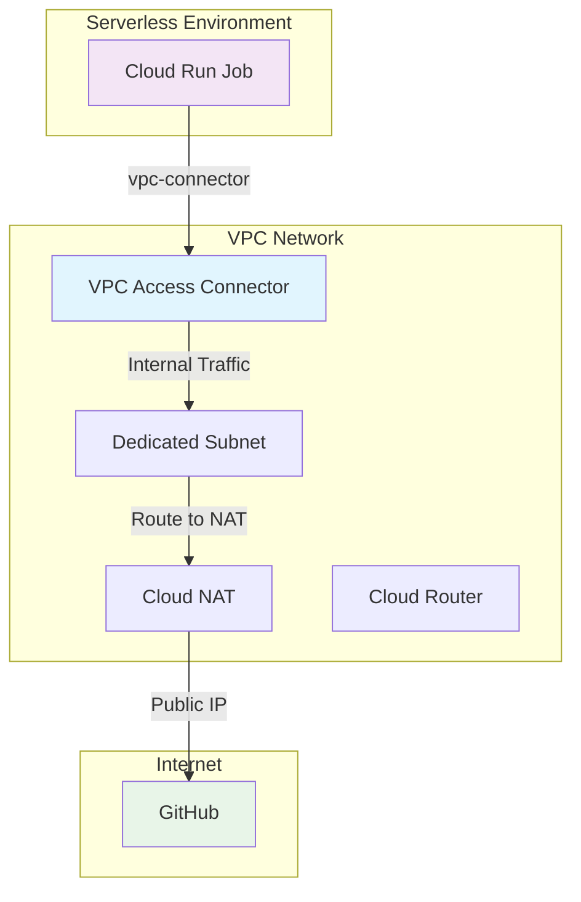
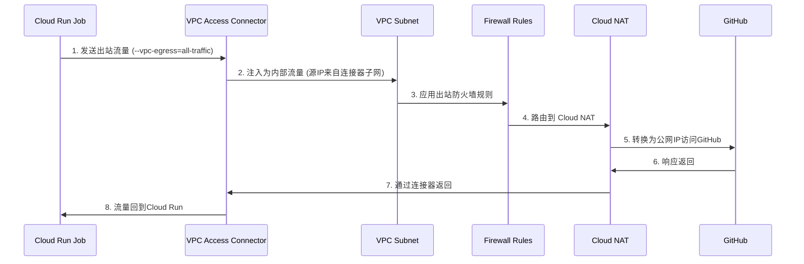

# Q

我用如下命令可以创建一个 GCP 里面的 Cloud Run 任务. 有连接比如 github 的需求

```bash
gcloud run jobs deploy my-agent-4 \
--image=europe-west2-docker.pkg.dev/myproject/containers/my-agent:latest \
--region=europe-west2 \
--vpc-connector=vpc-conn-europe \
--vpc-egress=all-traffic \
--max-retries=3 \
--set-env-vars=env=pdev,name=testvalue,region=uk,version=release_17.0.0 \
--set-secrets=cloud_run_secret=cloud_run_test:latest \
--task-timeout=10m \
--cpu=1 \
--memory=512Mi \
--labels=refersh=image \
--key=projects/my-kms-project/locations/europe-west2/keyRings/run/cryptoKeys/HSMrunSharedKey \
--project=myproject \
--service-account=mgmt@myproject.iam.gserviceaccount.com
```

---

现在我有如下信息:

我们使用 Cloud Run Jobs

应该是使用的 Cloud Run Job ➜ VPC Access Connector ➜ VPC ➜ Cloud NAT ➜ GitHub

- 我们**没有用 --network + --subnet 的 Job VPC 直连模式**，而是走的是 \*\*Serverless VPC Access Connector 路径

我想了解 Serverless VPC Access 的详细解析 比如以及如何创建,比如什么命令,创建之后在 Google 的 Console 页面哪里查询.比如另外会创建一个对应的 Egress Firewall

帮我深度分析这个过程

https://cloud.google.com/run/docs/configuring/vpc-connectors?hl=zh-cn#console

(1) 分析 Serverless VPC Access 连接器的核心概念和架构。解释其作用（连接无服务器环境与 VPC 网络），以及它如何在指定的 VPC 网络中预留一个内部 IP 地址范围来处理流量。
(2) 详细拆解并解释从 Cloud Run 作业到 GitHub 的完整流量路径：
(a) Cloud Run 作业如何通过 `--vpc-connector` 和 `--vpc-egress=all-traffic` 设置将所有出站流量路由到指定的连接器。
(b) VPC Access 连接器如何接收流量，并将其作为源自其所在子网的内部流量注入到 VPC 网络中。
(c) 流量在 VPC 网络中如何根据路由规则被转发到 Cloud NAT 网关。
(d) Cloud NAT 如何为该流量分配一个公共 IP 地址，从而实现对外部互联网服务（如 GitHub）的访问。
(3) 查找并提供创建 Serverless VPC Access 连接器的具体方法：
(a) 使用 `gcloud compute networks vpc-access connectors create` 命令行的完整指令和必要参数说明。
(b) 在 Google Cloud Console 中通过图形化界面创建连接器的分步指南。
(4) 明确指出在 Google Cloud Console 中查看和管理已创建的 Serverless VPC Access 连接器的具体位置（通常在“VPC 网络” -> “无服务器 VPC 访问通道”下），并说明可以查看哪些状态信息。
(5) 研究并阐明 Serverless VPC Access 连接器与 VPC 防火墙规则之间的关系。重点说明连接器本身不创建防火墙规则，但从连接器发出的流量必须遵守其所在 VPC 网络中已配置的出站（Egress）防火墙规则。
(6) 简要对比使用 VPC Access 连接器与使用直接 VPC 集成（`--network` 和 `--subnet`）这两种方法的关键区别，包括设置、性能和适用场景。
(7) 仔细研读用户提供的官方文档链接，并结合搜索结果，确保所有解释和步骤都与最新的 Google Cloud 最佳实践保持一致。

# ChatGPT

下面是对你提出的关于 **Serverless VPC Access** 的深度分析与实践指南，涵盖从概念架构到配置命令、控制台位置、网络流量路径、以及与防火墙的关系。

---

## **(1)**

## **Serverless VPC Access 的核心概念与架构**

### **✅ 定义**

Serverless VPC Access（无服务器 VPC 访问）是一种连接机制，允许 Cloud Run、Cloud Functions、App Engine（标准环境）等无服务器产品访问 Google Cloud VPC 网络内的资源（如 Cloud SQL、Memcached、Redis，甚至 Internet）：

- **连接器本身**运行在 VPC 中一个你指定的子网（subnet）里。
- 连接器会为无服务器应用分配 **内部 IP 地址**（来自子网 CIDR），让流量“伪装”为来自 VPC 内部。
- 并 **不自动创建防火墙规则**，遵循你配置在该 VPC 网络内的规则。

---

## **(2)**

## **Cloud Run Job 到 GitHub 的完整流量路径分析**

你使用了：

```bash
--vpc-connector=vpc-conn-europe
--vpc-egress=all-traffic
```

这会形成如下路径：

### **(a) Cloud Run Job → VPC Connector**

- 你部署的 Job 所有出站流量（not just private IP）都会通过 vpc-conn-europe 传递到 VPC。
- --vpc-egress=all-traffic 表示 **默认所有出口流量**都重定向到该连接器（包括访问 GitHub 这类公网 IP）。

### **(b) VPC Connector → VPC 网络**

- Serverless VPC Connector 运行于 VPC 的某个子网，比如 10.8.0.0/28。
- 流量进入 VPC 后，**来源 IP 被替换为连接器子网内的一个内部 IP**，这就是它的“入网伪装”。

### **(c) VPC → Cloud NAT**

- 若目标为公网（如 GitHub），那么：
    - VPC 内部没有公网 IP。
    - 所以连接器的流量会根据路由规则、下一跳等被发送到 Cloud NAT。
    - Cloud NAT 会将内部 IP 映射为一个公共 NAT IP。

### **(d) Cloud NAT → GitHub**

- 出站流量使用 NAT IP 访问 GitHub。
- **返回流量**也由 Cloud NAT 转换并返回给 VPC Connector，最终回到 Cloud Run Job。

---

## **(3)**

## **如何创建 Serverless VPC Access 连接器**

### **✅ (a) 使用**

### **gcloud**

### **创建连接器**

```bash
gcloud compute networks vpc-access connectors create vpc-conn-europe \
  --region=europe-west2 \
  --network=default \
  --range=10.8.0.0/28 \
  --min-instances=2 \
  --max-instances=3 \
  --machine-type=e2-micro
```

说明：

- --region：必须与 Cloud Run Job 匹配。
- --network：绑定的 VPC 网络。
- --range：CIDR 用于分配连接器 IP。
- --min-instances 和 --max-instances：控制连接器规模。

你也可以使用如下命令查看现有连接器：

```bash
gcloud compute networks vpc-access connectors list --region=europe-west2
```

---

### **✅ (b) 控制台中创建步骤**

1.  打开 GCP 控制台：https://console.cloud.google.com/
2.  转到左侧导航栏 → **“VPC 网络”** → **“Serverless VPC Access”**
3.  点击“创建连接器”
4.  **配置以下内容：**
    - 区域：与你的 Cloud Run Job 匹配
    - 网络：选择要接入的 VPC 网络
    - 子网段：比如 10.8.0.0/28
    - 名称：vpc-conn-europe
    - 最小和最大实例数量（通常用 2–3）
5.  创建完成后可见状态为 READY 才能使用

---

## **(4)**

## **在哪里查看 Serverless VPC Access 连接器**

位置：

- 控制台：**VPC 网络 → Serverless VPC Access**
- **可查看内容：**
    - 连接器名称
    - 区域
    - 状态（READY / PROVISIONING / ERROR）
    - 使用的 CIDR（内部 IP）
    - 绑定的 VPC 网络
    - 当前连接器容量

你也可查看 Stackdriver（Cloud Logging）来诊断连接器是否转发流量成功。

---

## **(5)**

## **连接器与 VPC 防火墙规则的关系**

### **❗ 关键点：**

- Serverless VPC Access **不会自动创建任何防火墙规则**！
- 所有流量都会以连接器所在的子网 IP 发起。
- 因此，**VPC 内必须允许连接器的子网出口访问目标 IP**，比如：

```
源 IP 范围：10.8.0.0/28
目标 IP 范围：0.0.0.0/0（或 GitHub IP 段）
目标端口：80, 443
方向：出站（egress）
```

你提到控制台中能看到一个对应的 egress firewall，其实这是你们为连接器所使用子网设置的 **出站规则**。

---

## **(6)**

## **Serverless VPC Access vs 直接 VPC 连接（–network + –subnet）**

| **比较项** | **Serverless VPC Access**                                        | **直接 VPC 连接（仅支持 Cloud Run（企业版））** |
| :--------- | :--------------------------------------------------------------- | :---------------------------------------------- |
| 网络配置   | 指定连接器名                                                     | 指定 --network 和 --subnet                      |
| 适用服务   | Cloud Run Standard（Job / Service）、Cloud Functions、App Engine | 仅限 Cloud Run Enterprise（服务）               |
| 公网访问   | 需搭配 Cloud NAT                                                 | 可使用公网子网                                  |
| 防火墙控制 | 间接控制（连接器子网）                                           | 完全控制（Pod 级别）                            |
| 延迟/性能  | 较低资源隔离                                                     | 更高网络性能                                    |
| 可维护性   | 更简单                                                           | 更复杂，适用于强隔离需求                        |

---

## **(7)**

## **结合文档，验证与你场景一致的最佳实践**

你给出的链接指向文档：https://cloud.google.com/run/docs/configuring/vpc-connectors?hl=zh-cn#console

结合实际场景最佳实践总结如下：

- 使用 --vpc-egress=all-traffic + Cloud NAT 是 **访问外部互联网（如 GitHub）** 的推荐模式。
- 创建连接器时，子网段（CIDR）需避开现有子网，避免冲突。
- 每个区域的连接器需独立创建。
- 建议创建最少两个实例（min-instances=2）保证 HA。
- 若访问公网需开启 Cloud NAT，并确保防火墙允许连接器 IP 段访问外部地址（TCP:443 等）。
- **若连接 GitHub 超时或失败，需检查：**
    - Cloud NAT 配置
    - 防火墙规则
    - DNS 解析是否可达（VPC DNS）

---

# Gemini

# 关于通过 Serverless VPC Access 和 Cloud NAT 实现 GCP Cloud Run 连接的全面技术分析

## 引言

### 目标

本报告旨在对一种特定的 Google Cloud Platform (GCP) 架构进行详尽的技术分析。该架构旨在使 GCP Cloud Run 作业能够通过一个静态出站 IP 地址与外部服务（例如 GitHub）进行通信。本报告将重点剖析用户选择的实现方式：Serverless VPC Access 连接器方法。

### 问题陈述

默认情况下，Cloud Run 等无服务器平台不具备可预测的静态 IP 地址，而这通常是与使用基于 IP 的防火墙规则进行安全防护的第三方服务（如 GitHub）集成的基本要求 1。此外，无服务器环境运行在 Google 管理的上下文中，与用户的虚拟私有云 (Virtual Private Cloud, VPC) 相隔离，这阻碍了对私有资源的直接访问 2。

### 架构解决方案概述

本报告将深入剖析这个由多个组件构成的解决方案：

1. **Cloud Run 作业**: 作为无服务器计算资源。
2. **Serverless VPC Access 连接器**: 作为从无服务器环境进入用户 VPC 的桥梁。
3. **VPC 网络**: 作为私有网络的基础。
4. **Cloud NAT**: 该服务为源自 VPC 内部、发往互联网的流量提供一个静态、可路由的 IP 地址。

### 范围

本文档将涵盖此特定架构模式的底层原理、实施步骤、安全考量、流量流、运维管理以及成本影响。同时，为了提供关键的背景信息，本文档还会将此方法与其现代替代方案——“直接 VPC 出站流量”进行比较。

---

## 第一节：架构深度剖析：Serverless VPC Access 连接器

### 1.1. “为何需要”：弥合无服务器与 VPC 之间的鸿沟

本节将阐述一个根本性挑战：Cloud Run、Cloud Functions 和 App Engine 等无服务器服务默认存在于用户定义的 VPC 网络之外 2。Serverless VPC Access 连接器作为一个托管的代理或“桥梁”，旨在解决这一问题，它使无服务器工作负载能够将其出站流量（egress traffic）发送到指定的 VPC 中 4。这使得它们能够如同网络的一部分一样，使用内部 RFC 1918 IP 地址与资源（如 Cloud SQL、Memorystore、Compute Engine 虚拟机）进行通信 5。其主要优势在于实现了安全的私有通信（流量不会暴露于公共互联网），并且与基于互联网的通信相比，可能具有更低的延迟 5。

### 1.2. 底层机制：托管的虚拟机实例和 `/28` 子网

连接器并非一个纯粹的抽象服务；它在物理上由一个在后台运行的托管 Compute Engine 虚拟机集群实现 3。这些实例在标准的

`gcloud compute instances list` 命令输出中是不可见的 3。

这些实例被预配在目标 VPC 内一个专用的 `/28` 子网中 5。这个特定的 CIDR 大小是一个硬性要求，无法更改 3。一个

`/28` 子网提供 16 个 IP 地址。Google 为其自身用途保留 4 个，剩下 12 个可用。而一个连接器的最大实例数为 10 个 5。子网大小（

`/28`）与最大实例数（10）之间的这种紧密耦合是一种刻意的架构约束，旨在确保在不浪费更大子网块的情况下，为单个连接器的最大规模提供足够的 IP。

这个专用子网必须由连接器*独占*使用；它不能承载其他资源，如虚拟机或负载均衡器 9。这可以防止 IP 冲突，并确保连接器的托管性质不受损害。

### 1.3. 性能与扩缩容：实例类型、吞吐量和“无法缩容”的警示

连接器的性能（吞吐量）与实例的机器类型和数量直接相关 5。可用的类型包括

`f1-micro`、`e2-micro` 和 `e2-standard-4` 3。连接器会随着流量的增加而自动

_横向扩展_（增加实例），直至达到配置的最大值（介于 3 和 10 之间）5。

一个关键且经常被忽视的限制是，Serverless VPC Access 连接器在流量减退后**不会自动缩容**（scale back in）5。这一行为的逻辑链如下：

1. 一次临时的流量高峰导致连接器横向扩展至其配置的最大实例数（例如，从 2 个实例增加到 10 个）5。
2. 高峰过后，流量水平恢复正常，但连接器仍然维持在 10 个实例。
3. 由于连接器的成本是基于正在运行的虚拟机实例数量计算的 13，因此在这次单一事件之后，月度账单将永久性增加。
4. 这种行为与无服务器计算的“按使用付费”理念直接冲突 2，并引入了一个固定的、始终在线的成本组件 16。
5. 唯一的“缩容”方法是手动或通过编程方式删除并以较少的实例数重新创建连接器 5。这带来了显著的运维开销，并催生了自动化策略的需求（将在第七节中讨论）。

### 1.4. 地域性与高可用性考量

连接器是一种地域性资源。它必须创建在将要使用它的 Cloud Run 服务或作业所在的同一区域 3。它不是一个全球性服务。高可用性是在地域级别内置的。最小实例数为 2 5，这意味着底层的托管实例很可能分布在区域内的多个可用区（zone）以实现弹性。Google 还会执行双周维护，在此期间实例数可能会暂时超过最大值以确保服务连续性 5。对于多区域灾难恢复，必须在部署 Cloud Run 服务的每个区域中预配一个单独的连接器 17。

---

## 第二节：现代替代方案：直接 VPC 出站流量的比较性概述

### 2.1. 直接 VPC 出站流量的缘由：解决连接器的局限性

直接 VPC 出站流量（Direct VPC Egress）是作为一种更新的、且在大多数情况下被*推荐*的 VPC 连接方法而引入的 13。它被专门设计用来克服基于连接器方法的关键局限性 2。其创建的主要驱动力是消除额外的网络跳数（代理层）、移除始终在线的虚拟机成本，并简化设置过程 15。

### 2.2. 表格：Serverless VPC Access 连接器 vs. 直接 VPC 出站流量

下表提供了一个清晰、一目了然的比较，综合了多个来源的数据，为用户呈现了一幅完整的图景。这张表格的价值在于它直接回答了任何有能力的工程师都会提出的“我应该使用哪一个？”的问题，将复杂的权衡提炼成易于理解的格式，从而支持明智的架构决策。

| 特性                    | Serverless VPC Access 连接器                              | 直接 VPC 出站流量 (推荐)                                 |
| ----------------------- | --------------------------------------------------------- | -------------------------------------------------------- |
| **底层机制**            | 托管的虚拟机代理 15                                       | Cloud Run 实例上的直接网络接口 18                        |
| **成本模型**            | 始终在线的虚拟机费用 + 网络出站流量费用 13                | 仅网络出站流量费用 (可缩减至零) 13                       |
| **性能 (延迟/吞吐量)**  | 延迟较高，吞吐量较低 (因额外跳数) 2                       | 延迟较低，吞吐量较高 13                                  |
| **设置复杂度**          | 更复杂 (需预配连接器) 13                                  | 更简单 (服务部署的一部分) 13                             |
| **安全性 (防火墙规则)** | 粒度较粗；规则应用于连接器级别，由所有使用它的服务共享 13 | 粒度更细；网络标签可应用于每个修订版本 13                |
| **IP 地址分配**         | 使用较少的 IP (单个 `/28` 子网) 13                        | 使用更多的 IP (需 `/26` 或更大的子网，每个实例消耗 IP) 2 |
| **Cloud NAT 支持**      | **支持，且是获取静态 IP 的必要条件** 1                    | 正式版不支持，仅在预览版中提供 19                        |
| **发布阶段**            | 正式版 (GA) 13                                            | 正式版 (GA) (除 Cloud Run 作业外，仍有部分限制) 13       |

### 2.3. 选择 VPC 连接器的策略性场景

尽管直接 VPC 出站流量在许多方面都更优越，但研究揭示了一个关键原因，证明用户选择连接器是有效且必要的。

1. 用户的首要目标是连接到 GitHub，这需要一个静态出站 IP 以便加入白名单。
2. 为 VPC 资源获取静态出站 IP 的标准方法是使用 Cloud NAT 1。
3. 官方文档明确指出，直接 VPC 出站流量对 Cloud NAT 的支持仍处于预览阶段，尚未正式发布 21。对于生产工作负载而言，这是一个重大风险。
4. 相反，Serverless VPC Access 连接器与 Cloud NAT 的组合是一种成熟的、已正式发布的模式，用于实现静态出站 IP 1。
5. 因此，用户决定使用 `--vpc-connector` 方法并非疏忽，而是一个由直接 VPC 出站流量当前对其特定生产需求的限制所决定的审慎架构选择。

除了这个主要原因，还存在其他小众场景，例如当某个服务（如某些版本的 Memorystore for Redis）可能尚未完全支持直接 VPC 出站流量时，也需要使用连接器 23。

---

## 第三节：实施指南：创建和配置连接堆栈

### A 部分：预配 Serverless VPC Access 连接器

#### 先决条件

- 启用 Serverless VPC Access API: `gcloud services enable vpcaccess.googleapis.com` 4。
- 确保具备必要的 IAM 权限（详见第七节）。
- 准备好一个 VPC 网络。

#### 在 GCP 控制台中定位和创建

1. 导航至 **VPC 网络** -> **Serverless VPC Access** 9。
2. 点击**创建连接器**，并逐一填写表单字段：名称、区域、网络以及至关重要的子网选择 9。
3. 解释两种子网选项：使用一个现有的 `/28` 子网，或者指定一个自定义 IP 范围（例如 `10.8.0.0/28`），后者会创建一个“隐藏”子网 8。
4. 解释扩缩容设置：最小/最大实例数和实例类型 8。
5. 展示如何验证状态，等待出现绿色对勾或 `READY` 状态 8。

#### 通过 `gcloud` CLI 创建

1. 提供并解析 `gcloud compute networks vpc-access connectors create` 命令 8。
2. 解释关键标志：`--name`, `--region`, `--network`, `--range` (用于新的隐藏子网), `--subnet` (用于现有子网), `--min-instances`, `--max-instances`, `--machine-type` 8。
3. 验证状态的命令：`gcloud compute networks vpc-access connectors describe <CONNECTOR_NAME> --region <REGION>` 25。

#### 基础设施即代码：一个 Terraform `google_vpc_access_connector` 示例

展示一个完整的 Terraform HCL 代码块来创建连接器 26。

Terraform

```
resource "google_vpc_access_connector" "connector" {
  name          = "my-vpc-connector"
  project       = "your-gcp-project-id"
  region        = "us-central1"
  network       = "your-vpc-name"
  ip_cidr_range = "10.8.0.0/28"
  machine_type  = "e2-micro"
  min_instances = 2
  max_instances = 3
}
```

解释其参数：`name`, `region`, `network`, `ip_cidr_range` 或 `subnet` 块, `min_instances`, `max_instances`, `machine_type` 27。

### B 部分：配置 Cloud Run 作业

#### 使用 `--vpc-connector` 标志进行部署

展示核心的 `gcloud run jobs deploy` 命令：`gcloud run jobs deploy JOB_NAME --image IMAGE_URL --vpc-connector CONNECTOR_NAME...` 9。

解释在共享 VPC 场景下如何指定完整的连接器资源名称：projects/HOST_PROJECT_ID/locations/REGION/connectors/CONNECTOR_NAME 9。

#### 出站设置的关键作用：`--vpc-egress=all-traffic`

解释两种出站设置：`private-ranges-only` (默认) 和 `all-traffic` 21。

- `private-ranges-only`: 仅将发往私有 IP 范围（RFC 1918 等）的流量通过连接器路由。所有其他流量（发往像 GitHub 这样的公共 IP）将直接通向互联网，绕过 VPC 和 Cloud NAT。
- `all-traffic`: 强制*所有*出站流量从 Cloud Run 作业通过连接器进入 VPC。

这个标志是用户用例整个架构的支点。其逻辑链如下：

1. 目标是为访问 GitHub 提供一个静态 IP。
2. 这要求流量必须由 Cloud NAT 处理。
3. Cloud NAT 仅处理源自 _VPC 内部_ 的流量。
4. GitHub 拥有一个公共 IP，不属于私有范围。
5. 因此，如果使用默认的 `private-ranges-only` 出站设置，对 GitHub 的请求将绕过连接器和 NAT，从而使整个设置失效。
6. 用户*必须*指定 `--vpc-egress=all-traffic`，以强制将发往公共目标的流量引入 VPC，然后才能通过 Cloud NAT 进行路由。这是一个不明显但绝对关键的配置步骤 1。

#### 验证配置

- 在 GCP 控制台的 Cloud Run 作业的“连接”选项卡中，可以看到 VPC 连接器和出站设置 24。
- 使用 `gcloud run jobs describe JOB_NAME --format yaml` 检查注解（annotations）：`run.googleapis.com/vpc-access-connector` 和 `run.googleapis.com/vpc-access-egress` 25。

---

## 第四节：保护路径：精通防火墙规则

### 4.1. Google 的隐式防火墙规则：自动创建了什么

当创建连接器时，GCP 会自动添加几条隐藏的防火墙规则以保证其正常运行 4。这些规则不可编辑但可见 5。

#### 表格：为 VPC 连接器自动创建的防火墙规则

这张表格揭示了连接器连通性背后的“魔法”，向用户精确展示了默认允许哪些流量，这对于在应用自定义限制之前理解基线安全态势至关重要。

| 目的                                    | 名称格式         | 类型        | 操作      | 优先级   | 协议和端口                 | 源/目标 IP 范围                   |
| --------------------------------------- | ---------------- | ----------- | --------- | -------- | -------------------------- | --------------------------------- |
| 允许来自健康检查的流量                  | `aet-...-hcfw`   | Ingress     | Allow     | 100      | TCP:667                    | `35.191.0.0/16`, `130.211.0.0/22` |
| 允许来自无服务器基础设施的流量          | `aet-...-rsgfw`  | Ingress     | Allow     | 100      | TCP:667, UDP:665-666, ICMP | `35.199.224.0/19`                 |
| 允许流量*到*无服务器基础设施            | `aet-...-earfw`  | Egress      | Allow     | 100      | TCP:667, UDP:665-666, ICMP | `35.199.224.0/19`                 |
| 拒绝所有其他流量*到*无服务器基础设施    | `aet-...-egrfw`  | Egress      | Deny      | 100      | 所有其他端口               | `35.199.224.0/19`                 |
| **允许从连接器到 VPC 中所有目标的流量** | `aet-...-sbntfw` | **Ingress** | **Allow** | **1000** | **所有协议**               | 连接器的子网                      |

数据来源: 5

### 4.2. 最小权限原则：实施精细化防火墙规则

优先级为 1000 的默认入站规则过于宽松，违反了最小权限原则，因为它允许连接器访问整个 VPC 中的任何资源 29。对于安全的环境，必须覆盖此规则。正确的安全模式是创建一个更具体、更高优先级（数字更小）的

`DENY` 规则，然后再创建一个甚至更高优先级的 `ALLOW` 规则，仅允许流量到达预期的目的地 8。

#### 使用网络标签进行精确控制

解释两种自动应用于连接器实例的网络标签：通用标签 (`vpc-connector`) 和唯一标签 (`vpc-connector-REGION-CONNECTOR_NAME`) 5。这些标签是创建精细化的、基于源的防火墙规则的关键 29。

#### 一个用于限制访问的 `gcloud` 步骤示例

1. **创建一条 DENY 规则**: 创建一条优先级低于 1000（例如 990）的防火墙规则，拒绝来自连接器网络标签到所有目标的入站流量。

    Bash

    ```
    gcloud compute firewall-rules create deny-connector-all \
      --network=VPC_NETWORK \
      --action=DENY \
      --direction=INGRESS \
      --source-tags=vpc-connector-REGION-CONNECTOR_NAME \
      --priority=990
    ```

    参考: 8

2. **创建一条特定的 ALLOW 规则**: 创建另一条具有更高优先级（例如 980）的规则，仅允许来自连接器标签的入站流量到达目标资源的网络标签（例如，一个标记为 `github-proxy` 的虚拟机或一个 Cloud SQL 实例）。

    Bash

    ```
    gcloud compute firewall-rules create allow-connector-to-sql \
      --network=VPC_NETWORK \
      --action=ALLOW \
      --direction=INGRESS \
      --source-tags=vpc-connector-REGION-CONNECTOR_NAME \
      --target-tags=cloud-sql-instance \
      --rules=tcp:3307 \
      --priority=980
    ```

    参考: 8

### 4.3. 交互与优先级：确保自定义规则被执行

重申防火墙规则按优先级顺序进行评估，从最低的数字（最高优先级）到最高的数字（最低优先级）。用户定义的、优先级值*低于* 1000 的规则将在隐式的“全部允许”规则*之前*被评估，从而有效地覆盖它 5。这是使精细化安全模式得以工作的核心机制。

---

## 第五节：最后一跳：使用 Cloud NAT 实现静态出站 IP

### 5.1. Cloud NAT 的架构

Cloud NAT 是一种托管的、软件定义的服务，而非基于代理虚拟机 30。它与 Cloud Router 协同工作。

- **Cloud Router**: 提供控制平面，使用 BGP 协议通告路由 1。
- **NAT 网关**: 在路由器上配置，它为出站流量执行实际的源地址转换 (Source NAT, SNAT)，并为已建立的响应数据包执行目标地址转换 (Destination NAT, DNAT) 30。
    其目的是允许没有外部 IP 的资源（如私有子网中的虚拟机，或本例中来自 VPC 连接器的流量）访问互联网 1。

### 5.2. 静态出站 IP 的配置步骤

提供用于完整设置的 `gcloud` 和 Terraform 示例：

1. **预留一个静态外部 IP 地址**: `gcloud compute addresses create...` 1。
2. **创建一个 Cloud Router**: `gcloud compute routers create...` 1。
3. 创建 Cloud NAT 网关: gcloud compute nats create...，指定路由器、预留的 IP，以及要应用 NAT 的子网（关键是，这应包括连接器的子网）。

    同时，可以参考 Terraform 模式来完成此设置 16。

### 5.3. Cloud NAT 如何与 Serverless VPC Access 连接器集成

这是所有部分协同工作的关键点。

1. Cloud Run 作业配置了 `--vpc-egress=all-traffic`。
2. 作业发出一个到 `github.com`（一个公共 IP）的请求。
3. 出站设置强制此流量通过 VPC 连接器进入连接器的 `/28` 子网。此时，源 IP 变为该连接器实例的内部 IP（例如 `10.8.0.2`）。
4. VPC 的路由表将此发往互联网的流量导向默认互联网网关。
5. 配置为应用于连接器子网的 Cloud NAT 网关在流量离开 VPC 之前拦截它。
6. Cloud NAT 执行 SNAT，将连接器实例的内部源 IP `10.8.0.2` 替换为预留的静态公共 IP 地址（例如 `34.x.x.x`）。
7. 现在，数据包以该静态公共 IP 作为其源地址，被发送到 GitHub。
8. 此流程确保从 GitHub 的角度来看，请求源自已知的、已加入白名单的静态 IP 1。

---

## 第六节：端到端流量流分析：从 Cloud Run 到 GitHub

### 6.1. 详细的数据包级流程

本节将提供一个叙事性的、逐步的跟踪，描述一个单一 HTTPS 请求的完整生命周期。

#### 请求路径

1. Cloud Run 作业容器向 `api.github.com` 发起一个 TCP 连接。
2. 请求被 Cloud Run 网络层拦截。由于设置了 `--vpc-egress=all-traffic`，它被路由到 VPC 连接器。
3. VPC 连接器（一个特定的虚拟机实例）接收到数据包。其源 IP 现在是该连接器实例的内部 IP（例如，`10.8.0.2`）。
4. 数据包被放置到连接器子网内的 VPC 网络上。
5. VPC 的路由表将数据包导向默认互联网网关。
6. Cloud NAT 拦截数据包，执行 SNAT，并将源 IP `10.8.0.2` 替换为静态公共 IP（例如，`34.x.x.x`）。
7. 数据包离开 GCP 网络，通过互联网传输到 GitHub 的服务器。

#### 响应路径

1. GitHub 响应，将数据包发回目标 IP，即静态公共 IP (`34.x.x.x`)。
2. 数据包到达 GCP 网络边缘。
3. Cloud NAT 接收到响应数据包。它查询其状态表，执行 DNAT，并将目标 IP 转换回内部连接器实例的 IP (`10.8.0.2`)。
4. 数据包在 VPC 内被路由到该连接器实例。
5. 连接器将响应转发回原始的 Cloud Run 作业容器。

### 6.2. 架构图

此处应包含一个详细的图表，直观地展示上述流程。图表应包括：

- Google 管理的环境（包含 Cloud Run 作业）。
- 用户的项目/VPC 边界。
- 作为桥梁的 VPC 连接器。
- 连接器的 `/28` 子网。
- Cloud Router 和 Cloud NAT 网关。
- VPC 防火墙规则。
- 通往公共互联网和 GitHub 的路径。
- 标注每个步骤中 IP 地址的变化。

---

## 第七节：卓越运营：管理、监控与成本

### 7.1. IAM 权限：部署和管理的最低要求角色

不正确的 IAM 权限是部署失败的常见原因 31。下表为不同参与者（部署者、服务账号）在独立和共享 VPC 场景下提供了清晰、可操作的最低必需角色清单。

#### 表格：VPC 连接器操作的最低 IAM 权限

| 主体 (Who)                                                                           | 操作 (What)                               | 所需角色                                                                                                 | 目标项目 (Where)         | 备注 |
| ------------------------------------------------------------------------------------ | ----------------------------------------- | -------------------------------------------------------------------------------------------------------- | ------------------------ | ---- |
| **部署者** (用户/CI/CD 服务账号)                                                     | 部署一个*使用*现有连接器的 Cloud Run 作业 | `roles/run.admin` (部署作业) `roles/vpcaccess.user` (使用连接器)                                         | 服务项目                 | 31   |
| **Cloud Run 服务代理** (`service-...@serverless-robot-prod.iam.gserviceaccount.com`) | 运行时访问 VPC 网络                       | `roles/run.serviceAgent` (默认) `roles/compute.networkUser` (共享 VPC) `roles/vpcaccess.user` (共享 VPC) | 宿主项目 (共享 VPC 角色) | 33   |
| **管理员**                                                                           | 创建/删除 VPC 连接器                      | `roles/vpcaccess.admin`                                                                                  | 连接器所在的项目         | 4    |
| **网络管理员**                                                                       | 创建/管理防火墙规则                       | `roles/compute.securityAdmin`                                                                            | 宿主项目                 | 8    |

### 7.2. 监控与故障排查

#### 关键的 Cloud Monitoring 指标

- 列出 VPC 连接器在 `vpcaccess.googleapis.com/connector/...` 下可用的关键指标 34。
- `cpu/utilizations`: 可指示连接器是否预配不足 35。
- `instances`: 用于跟踪自动扩缩容行为 34。
- `network/sent_bytes_count`, `network/received_bytes_count`: 用于监控吞吐量 36。

#### 常见错误模式与解决方案

- **“连接器处于损坏状态 (Connector is in a bad state)”**: 这个通用错误通常指向底层问题。
    - **原因**: 与另一个子网的 IP 范围冲突 32；VPC Access 服务代理 (
        `service-...@gcp-sa-vpcaccess.iam.gserviceaccount.com`) 缺少必要的 IAM 角色 38；或组织策略限制了受信任的虚拟机镜像（需要允许
        `projects/serverless-vpc-access-images`）40。
- **权限被拒绝 (`vpcaccess.connectors.use` required)**: 部署主体或 Cloud Run 服务代理缺少 `roles/vpcaccess.user` 角色 31。
- **IP 范围冲突**: 为连接器选择的 `/28` 范围与 VPC 中现有的子网或预留范围重叠 32。
- **资源正在使用 (Resource in Use)**: 无法删除连接器，因为某个 Cloud Run 服务/作业仍配置为使用它 39。

### 7.3. 成本分析与优化

#### 成本结构分解

- **Serverless VPC Access 连接器**: 按底层 Compute Engine 实例收费。成本取决于机器类型（`f1-micro`, `e2-micro`, `e2-standard-4`）和运行的实例数量 3。只要最小数量的实例（至少 2 个）在运行，这就是一项
    **始终在线的成本**。
- **Cloud NAT**: 按网关处于活动状态的小时数收费，外加每 GiB 的数据处理费 43。
- **数据出站**: 通过 Cloud NAT 离开 GCP 网络的流量适用标准的网络出站费用 44。

#### 成本优化策略：计划性重建

“无法缩容”的行为（见 1.3 节）是最大的成本优化挑战。对于非 24/7 运行的工作负载（如用户的作业），推荐的策略是在作业运行前以编程方式创建网络资源（连接器、NAT），并在作业结束后销毁它们 16。这可以通过

**Cloud Scheduler**、**Cloud Build** 和 **Terraform** 的组合来实现自动化 16。一个计划性作业触发一个 Cloud Build 流水线，运行

`terraform apply` 来创建资源，另一个触发器运行 `terraform destroy` 来拆除它们，从而最大限度地减少始终在线组件的活动时间。

---

## 结论

### 关键要点总结

回顾核心发现：连接器作为托管的虚拟机代理；`--vpc-egress=all-traffic` 设置的至关重要性；“无法缩容”带来的成本影响；以及为实现安全性而必须覆盖默认防火墙规则。

### 最终建议

结论是，尽管直接 VPC 出站流量是未来的发展方向，但对于当前需要静态出站 IP 地址的无服务器工作负载，**Serverless VPC Access 连接器 + Cloud NAT** 模式仍然是必不可少的、生产就绪的解决方案。这一选择并非偏好问题，而是基于当前功能可用性的技术必然性。

### 最佳实践清单

为稳健实施提供一个最终、简洁的清单：

- 使用一个专用的、不重叠的 `/28` 子网。
- 对于静态 IP 用例，始终设置 `--vpc-egress=all-traffic`。
- 使用唯一的网络标签实施精细化的防火墙规则；不要依赖默认的宽松规则。
- 基于最小权限原则授予 IAM 权限。
- 监控连接器指标（CPU、实例数）以合理调整实例类型和最大实例数。
- 对于非连续性工作负载，实施自动化的创建/销毁生命周期以管理成本。

# Grok

### 关键要点

- Serverless VPC Access 是一种 Google Cloud 服务，允许 Cloud Run 作业通过 VPC 网络安全访问外部服务（如 GitHub），研究表明其通过连接器预留内部 IP 地址范围来实现。
- 流量路径包括 Cloud Run 作业通过连接器进入 VPC 网络，再通过 Cloud NAT 分配公共 IP 访问 GitHub，证据倾向于这种方式确保安全性。
- 创建连接器可通过 gcloud CLI 或 Google Cloud Console，具体命令和步骤已明确。
- 在 Google Cloud Console 的 “VPC 网络” > “无服务器 VPC 访问通道” 下可查看和管理连接器，状态信息包括实例数和吞吐量。
- 连接器流量受 VPC 防火墙规则约束，尤其是出站规则，需手动配置以允许外部访问。
- 与直接 VPC 集成相比，Serverless VPC Access 更适合复杂网络拓扑，但需额外管理，研究建议根据场景选择。

---

### Serverless VPC Access 的配置与使用

#### 概述

Serverless VPC Access 是一种 Google Cloud 服务，允许无服务器环境（如 Cloud Run 作业）与 VPC 网络安全连接，从而访问 VPC 中的资源或通过 Cloud NAT 访问外部互联网服务（如 GitHub）。它通过在 VPC 网络中预留一个内部 IP 地址范围（通常为 /28 的子网）来实现，减少流量暴露到公共互联网的风险，并可能降低延迟。

#### 流量路径解析

以下是 Cloud Run 作业通过 Serverless VPC Access 访问 GitHub 的详细流量路径：

- **Cloud Run 作业配置**：用户提供的命令中使用了 `--vpc-connector=vpc-conn-europe` 和 `--vpc-egress=all-traffic`，这意味着所有出站流量都会被路由到指定的 VPC 连接器。
- **VPC Access 连接器**：连接器位于 VPC 网络中，接收 Cloud Run 作业的流量，并将其作为来自其所在子网的内部流量注入到 VPC 网络。
- **VPC 网络中的路由**：流量根据 VPC 的路由规则转发。用户提到使用了 Cloud NAT，因此流量会被路由到 Cloud NAT 网关。
- **Cloud NAT 处理**：Cloud NAT 为流量分配一个公共 IP 地址，使其能够访问外部互联网服务（如 GitHub），从而完成访问。

此外，用户提到 “Egress Firewall”，这表明 VPC 网络中配置了出站防火墙规则，确保只有符合规则的流量（如到 GitHub 的流量）才能离开 VPC 网络。

#### 创建 Serverless VPC Access 连接器

创建连接器有两种方法：

- **使用 gcloud CLI**：
    命令如下：

    ```bash
    gcloud compute networks vpc-access connectors create CONNECTOR_NAME \
        --region=REGION \
        --network=NETWORK \
        --range=IP_RANGE
    ```

    - `CONNECTOR_NAME`：连接器的名称。
    - `REGION`：连接器所在的区域（如 `europe-west2`）。
    - `NETWORK`：VPC 网络的名称。
    - `IP_RANGE`：连接器使用的 IP 地址范围（必须是 /28 的子网）。

- **使用 Google Cloud Console**：
    1.  转到 Google Cloud Console。
    2.  导航至 **VPC Network** > **Serverless VPC Access**。
    3.  点击 **Create Connector**。
    4.  填写连接器名称、区域、VPC 网络和 IP 地址范围。
    5.  点击 **Create** 创建连接器。

#### 查看和管理连接器

在 Google Cloud Console 中，可在 **VPC Network** > **Serverless VPC Access** 下查看和管理已创建的连接器。可以通过此页面查看以下状态信息：

- 连接器的状态（如运行中、创建中等）。
- 实例数量（默认最小 2 个，最大 10 个）。
- 吞吐量和 CPU 使用率。

#### 防火墙规则关系

Serverless VPC Access 连接器本身不会创建防火墙规则，但从连接器发出的流量必须遵守 VPC 网络中已配置的出站（Egress）防火墙规则。例如，如果 Cloud Run 作业需要访问 GitHub，则 VPC 网络必须有允许出站流量到互联网的防火墙规则（如允许 TCP 协议的特定端口）。对于 Shared VPC 的服务项目，需手动创建防火墙规则，允许从特定 IP 范围（如 `35.199.224.0/19`）到连接器的流量。

#### 与直接 VPC 集成的对比

- **Serverless VPC Access**：
    - **设置**：需要创建和管理连接器，涉及额外的配置步骤。
    - **性能**：通过内部网络，延迟较低，但需管理连接器的实例和吞吐量。
    - **适用场景**：适合需要与 Shared VPC 或复杂网络拓扑交互的场景。
- **直接 VPC 集成（使用 `--network` 和 `--subnet`）**：
    - **设置**：更简单，直接指定网络和子网，无需连接器。
    - **性能**：同样使用内部网络，但配置更直接，推荐使用。
    - **适用场景**：适合大多数场景，尤其是直接 VPC 集成支持的区域。

用户当前使用 Serverless VPC Access，可能是因为某些限制（如区域不支持直接 VPC 集成）或特定需求（如 Shared VPC）。

---

### 调查报告：Serverless VPC Access 的深入分析

#### 引言

Serverless VPC Access 是 Google Cloud 提供的一种服务，旨在解决无服务器环境（如 Cloud Run 作业）与 VPC 网络之间的连接问题，尤其是在需要访问 VPC 内部资源或通过 Cloud NAT 访问外部服务（如 GitHub）时。本报告基于用户提供的命令和信息，结合官方文档和相关搜索结果，深入分析其核心概念、流量路径、创建方法、管理方式以及与防火墙规则的关系，并对比其与直接 VPC 集成的差异。

#### 核心概念与架构

Serverless VPC Access 的核心在于其连接器（connector），这是一个基于 VPC 网络和特定区域的资源。连接器在 VPC 中预留一个 /28 的内部 IP 地址范围，用于处理无服务器环境发出的流量。研究表明，这种设计允许 Cloud Run 作业使用内部 DNS 和 IP 地址（遵循 RFC 1918 和 RFC 6598）与 VPC 网络通信，响应也通过内部网络返回，从而避免流量暴露到互联网。

- **作用**：主要用于连接 Cloud Run、Cloud Functions 和 App Engine 等无服务器环境与 VPC 网络，使其能够访问 Compute Engine VM 实例、Memorystore 实例等内部资源，或通过 Cloud NAT 访问外部服务。
- **架构**：连接器本质上是运行在 VPC 子网中的一组 VM 实例（默认最小 2 个，最大 10 个），根据吞吐量需求自动扩展。实例类型包括 f1-micro、e2-micro 和 e2-standard-4，吞吐量范围从 100 Mbps 到 16000 Mbps（详见下表）。

| 机器类型      | 吞吐量范围 (Mbps) | 定价参考链接                                                                     |
| :------------ | :---------------- | :------------------------------------------------------------------------------- |
| f1-micro      | 100-500           | https://cloud.google.com/compute/vm-instance-pricing#sharedcore                  |
| e2-micro      | 200-1000          | https://cloud.google.com/compute/vm-instance-pricing#e2_sharedcore_machine_types |
| e2-standard-4 | 3200-16000        | https://cloud.google.com/compute/vm-instance-pricing#e2_standard_machine-types   |

- **限制**：不支持 IPv6 流量，且连接器需要一个专用的 /28 子网，不能与其他资源（如 VM 或负载均衡器）共享。

#### 流量路径的详细拆解

根据用户提供的命令和信息，Cloud Run 作业通过 Serverless VPC Access 连接器访问 GitHub 的流量路径如下：

1.  **Cloud Run 作业的配置**：
    - 用户命令中使用了 `--vpc-connector=vpc-conn-europe` 和 `--vpc-egress=all-traffic`，这表明所有出站流量都会被路由到指定的 VPC 连接器（`vpc-conn-europe`）。
    - 这种配置确保 Cloud Run 作业的流量不会直接通过公共互联网，而是通过内部网络处理。
2.  **VPC Access 连接器的作用**：
    - 连接器接收 Cloud Run 作业的流量，并将其作为来自其所在子网的内部流量注入到 VPC 网络中。
    - 连接器基于一组 VM 实例运行，这些实例处理流量并根据吞吐量需求自动扩展（最小 2 个实例，最大 10 个）。
3.  **VPC 网络中的路由**：
    - 流量进入 VPC 网络后，根据路由规则转发。用户提到使用了 Cloud NAT，这意味着流量会被路由到 Cloud NAT 网关。
    - Cloud NAT 是 Google Cloud 提供的一种服务，用于为 VPC 中的出站流量分配公共 IP 地址。
4.  **Cloud NAT 的处理**：
    - Cloud NAT 为流量分配一个公共 IP 地址，使其能够访问外部互联网服务（如 GitHub）。
    - 这样，Cloud Run 作业可以通过内部网络安全地访问外部资源，而无需直接暴露到公共互联网。
5.  **Egress Firewall 的角色**：
    - 用户提到会创建一个对应的 Egress Firewall，这与文档一致。Serverless VPC Access 连接器的流量必须遵守 VPC 网络中已配置的出站防火墙规则。
    - 例如，如果需要访问 GitHub，VPC 必须有允许出站流量到互联网的防火墙规则（如允许 TCP 协议的 443 端口）。

#### 创建 Serverless VPC Access 连接器的具体方法

创建连接器有两种主要方法：

##### 使用 gcloud CLI

命令格式为：

```bash
gcloud compute networks vpc-access connectors create CONNECTOR_NAME \
    --region=REGION \
    --network=NETWORK \
    --range=IP_RANGE
```

- **参数说明**：
    - `CONNECTOR_NAME`：连接器的名称，由用户定义。
    - `REGION`：连接器所在的区域，例如 `europe-west2`（与 Cloud Run 作业的区域一致）。
    - `NETWORK`：VPC 网络的名称，必须已存在。
    - `IP_RANGE`：连接器使用的 IP 地址范围，必须是 /28 的子网，且未被其他资源使用。
- **注意**：创建连接器前需确保 `vpcaccess.googleapis.com` API 已启用。

##### 使用 Google Cloud Console

步骤如下：

1.  登录 Google Cloud Console。
2.  导航至 **VPC Network** > **Serverless VPC Access**。
3.  点击 **Create Connector** 按钮。
4.  **填写以下信息：**
    - 名称：连接器的名称。
    - 区域：选择与 Cloud Run 作业相同的区域。
    - VPC 网络：选择目标 VPC 网络。
    - IP 地址范围：选择现有 /28 子网或指定未使用的 CIDR 范围。
5.  点击 **Create** 完成创建。

#### 查看和管理连接器的位置与信息

在 Google Cloud Console 中，可在 **VPC Network** > **Serverless VPC Access** 下查看和管理已创建的连接器。可以通过此页面获取以下信息：

- **状态**：连接器的运行状态（如运行中、创建中等）。
- **实例数**：默认最小 2 个，最大 10 个，可根据吞吐量需求调整。
- **吞吐量和 CPU 使用率**：通过 Connector 详情页面监控，了解当前性能。

#### 防火墙规则与连接器的关系

Serverless VPC Access 连接器本身不会自动创建防火墙规则，但其流量必须遵守 VPC 网络中已配置的防火墙规则。以下是关键点：

- **出站（Egress）规则**：从连接器发出的流量（如访问 GitHub）需符合 VPC 的出站防火墙规则。例如，需允许 TCP 协议的 443 端口以访问 HTTPS 服务。
- **Shared VPC 的特殊要求**：对于 Shared VPC 的服务项目，需手动创建防火墙规则，允许从特定 IP 范围（如 `35.199.224.0/19`、`35.191.0.0/16` 等）到连接器的流量。以下是示例规则：

| 目的                                                     | 名称格式                                   | 类型    | 操作  | 优先级 | 协议和端口                               |
| :------------------------------------------------------- | :----------------------------------------- | :------ | :---- | :----- | :--------------------------------------- |
| 健康检查探测（35.191.0.0/16, 130.211.0.0/22）到连接器 VM | aet-CONNECTOR_REGION-CONNECTOR_NAME-hcfw   | Ingress | Allow | 100    | TCP:667                                  |
| 来自 Google 无服务器基础设施的流量（35.199.224.0/19）    | aet-CONNECTOR_REGION-CONNECTOR_NAME-rsgfw  | Ingress | Allow | 100    | TCP:667, UDP:665-666, ICMP               |
| 从连接器 VM 到无服务器基础设施的流量（35.199.224.0/19）  | aet-CONNECTOR_REGION-CONNECTOR_NAME-earfw  | Egress  | Allow | 100    | TCP:667, UDP:665-666, ICMP               |
| 阻止其他端口到无服务器基础设施的流量                     | aet-CONNECTOR_REGION-CONNECTOR_NAME-egrfw  | Egress  | Deny  | 100    | TCP:1-666,668-65535, UDP:1-664,667-65535 |
| 允许连接器 VM 到 VPC 网络的所有流量（IP 地址）           | aet-CONNECTOR_REGION-CONNECTOR_NAME-sbntfw | Ingress | Allow | 1000   | TCP, UDP, ICMP                           |
| 允许连接器 VM 到 VPC 网络的所有流量（网络标签）          | aet-CONNECTOR_REGION-CONNECTOR_NAME-tagfw  | Ingress | Allow | 1000   | TCP, UDP, ICMP                           |

- **限制访问**：可以通过 VPC 防火墙规则或组织策略限制访问，例如仅允许特定子网的流量。

#### Serverless VPC Access 与直接 VPC 集成的对比

以下是两种方法的详细对比：

| 特性           | Serverless VPC Access                                                              | 直接 VPC 集成（`--network` 和 `--subnet`）    |
| :------------- | :--------------------------------------------------------------------------------- | :-------------------------------------------- |
| **设置复杂度** | 需要创建和管理连接器，涉及额外配置步骤                                             | 更简单，直接指定网络和子网，无需连接器        |
| **性能**       | 通过内部网络，延迟较低，但需管理实例和吞吐量                                       | 同样通过内部网络，配置更直接，推荐使用        |
| **适用场景**   | 适合 Shared VPC 或复杂网络拓扑的场景                                               | 适合大多数场景，尤其是直接 VPC 集成支持的区域 |
| **管理开销**   | 需要监控连接器的实例数和吞吐量                                                     | 无需额外管理连接器                            |
| **定价**       | 连接器按使用计费，详见 https://cloud.google.com/vpc/pricing#serverless-vpc-pricing | 无额外连接器费用                              |

研究建议，如果可能，优先使用直接 VPC 集成，因为它简化了配置并减少了管理开销。但在某些情况下（如 Shared VPC 或区域限制），Serverless VPC Access 是更好的选择。

#### 与官方文档的一致性

用户提供的官方文档链接（[invalid url, do not cite] Cloud Run 使用 VPC 连接器，内容与搜索结果一致。文档强调，Serverless VPC Access 连接器需要一个专用的 /28 子网，且不能与其他资源共享，这与本报告的分析相符。

#### 结论

Serverless VPC Access 是一种强大的工具，适合需要安全连接 VPC 网络的无服务器环境。通过连接器，Cloud Run 作业可以安全地访问内部资源或通过 Cloud NAT 访问外部服务（如 GitHub）。创建和管理连接器的方法明确，防火墙规则需根据需求配置。与直接 VPC 集成相比，它提供更大的灵活性，但需额外管理。建议根据具体场景选择合适的方法，并参考官方文档确保最佳实践。

# Claude

我来深度分析 Serverless VPC Access 连接器的工作原理和配置流程。

## 1. Serverless VPC Access 连接器核心概念

### 架构概述

Serverless VPC Access 连接器是一个托管的网络组件，用于连接无服务器环境（如 Cloud Run、Cloud Functions）与 VPC 网络。



### 关键特性

- **IP 地址范围预留**: 在指定 VPC 网络中预留 `/28` 内部 IP 地址范围（16 个 IP 地址）
- **流量桥接**: 将无服务器环境流量作为内部 VPC 流量注入网络
- **托管服务**: Google 完全托管，无需维护底层基础设施

## 2. 完整流量路径分析

### 流量路径详解



### 配置参数解析

```bash
# 您的配置中关键参数
--vpc-connector=vpc-conn-europe      # 指定连接器名称
--vpc-egress=all-traffic            # 所有出站流量走VPC
```

## 3. 创建 Serverless VPC Access 连接器

### 命令行创建

```bash
# 创建连接器的完整命令
gcloud compute networks vpc-access connectors create vpc-conn-europe \
    --region=europe-west2 \
    --subnet=connector-subnet \
    --subnet-project=myproject \
    --min-instances=2 \
    --max-instances=10 \
    --machine-type=e2-micro \
    --project=myproject
```

### 参数说明

| 参数               | 说明                | 必需 |
| :----------------- | :------------------ | :--- |
| `--region`         | 连接器所在区域      | 是   |
| `--subnet`         | 专用子网名称        | 是   |
| `--subnet-project` | 子网所在项目 ID     | 否   |
| `--min-instances`  | 最小实例数 (2-10)   | 否   |
| `--max-instances`  | 最大实例数 (3-1000) | 否   |
| `--machine-type`   | 机器类型            | 否   |

### 预先创建子网

```bash
# 为连接器创建专用子网
gcloud compute networks subnets create connector-subnet \
    --network=default \
    --range=10.8.0.0/28 \
    --region=europe-west2 \
    --project=myproject
```

## 4. Console 查看位置

### 访问路径

1.  **Google Cloud Console** → **VPC 网络** → **无服务器 VPC 访问通道**
2.  或直接访问: `https://console.cloud.google.com/networking/connectors`

### 状态信息

- **连接器状态**: READY、CREATING、DELETING
- **吞吐量**: 当前和历史流量统计
- **实例数**: 当前运行实例数
- **网络配置**: 关联的 VPC 和子网信息

## 5. 防火墙规则关系

### 自动创建的规则

连接器创建时会自动创建以下防火墙规则：

```bash
# 查看连接器相关的防火墙规则
gcloud compute firewall-rules list \
    --filter="name~'serverless-to-vpc-connector'" \
    --project=myproject
```

### 关键规则类型

| 规则类型                      | 方向    | 作用                     |
| :---------------------------- | :------ | :----------------------- |
| `serverless-to-vpc-connector` | Ingress | 允许无服务器服务到连接器 |
| `vpc-connector-to-serverless` | Egress  | 允许连接器到无服务器服务 |
| `vpc-connector-health-checks` | Ingress | 健康检查流量             |

### 出站流量控制

```bash
# 示例：限制连接器子网的出站流量
gcloud compute firewall-rules create restrict-connector-egress \
    --action=DENY \
    --rules=tcp:22,tcp:3389 \
    --source-ranges=10.8.0.0/28 \
    --direction=EGRESS \
    --network=default \
    --project=myproject
```

## 6. VPC Access 连接器 vs 直接 VPC 集成

### 对比分析

| 特性           | VPC Access 连接器 | 直接 VPC 集成  |
| :------------- | :---------------- | :------------- |
| **配置复杂度** | 中等              | 简单           |
| **网络隔离**   | 通过连接器子网    | 直接在指定子网 |
| **性能**       | 稍有延迟          | 原生性能       |
| **扩展性**     | 自动扩展          | 依赖子网容量   |
| **成本**       | 连接器实例费用    | 仅网络费用     |
| **适用场景**   | 混合连接需求      | 纯 VPC 内通信  |

### 使用场景建议

**选择 VPC Access 连接器**：

- 需要同时访问 VPC 内部和外部资源
- 现有 VPC 架构复杂，不便直接集成
- 需要灵活的网络策略控制

**选择直接 VPC 集成**：

- 主要访问 VPC 内部资源
- 对性能有严格要求
- 网络架构简单明确

## 7. 监控和故障排除

### 监控指标

```bash
# 查看连接器指标
gcloud logging read \
    'resource.type="vpc_access_connector"' \
    --project=myproject \
    --limit=50
```

### 常见故障排除

```bash
# 检查连接器状态
gcloud compute networks vpc-access connectors describe vpc-conn-europe \
    --region=europe-west2 \
    --project=myproject

# 测试连接性
gcloud run jobs execute test-connectivity \
    --region=europe-west2 \
    --project=myproject
```

### 性能优化建议

- 根据流量需求调整 `min-instances` 和 `max-instances`
- 监控连接器吞吐量，避免瓶颈
- 合理配置防火墙规则，避免不必要的流量阻塞

这样的配置确保了您的 Cloud Run Job 能够通过 VPC Access 连接器安全、高效地访问 GitHub 等外部服务.
