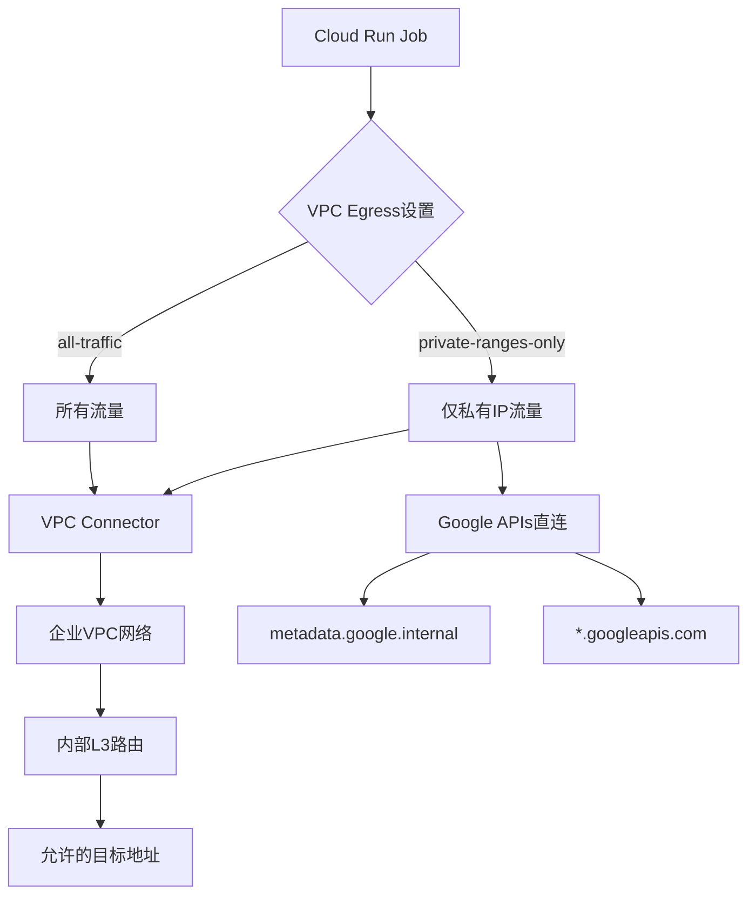
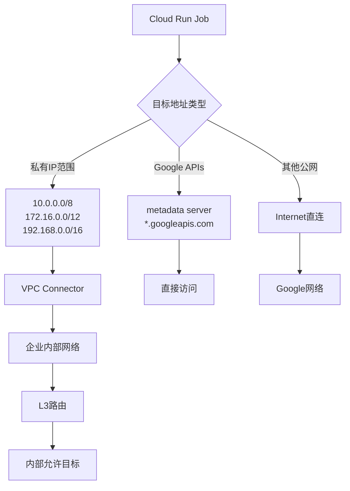
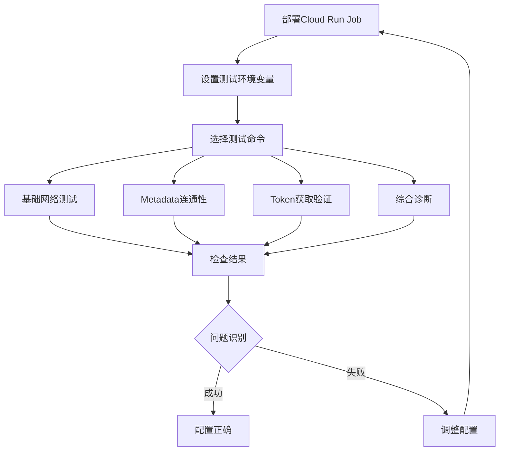
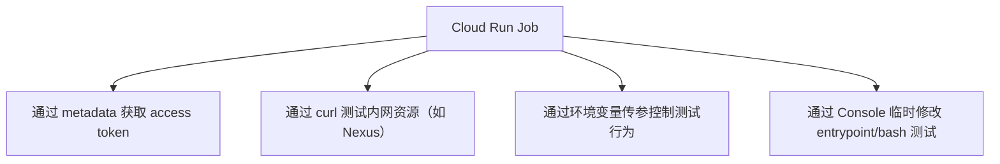
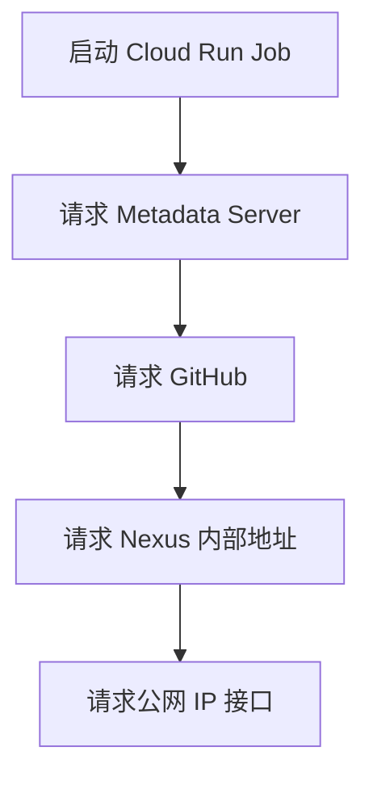
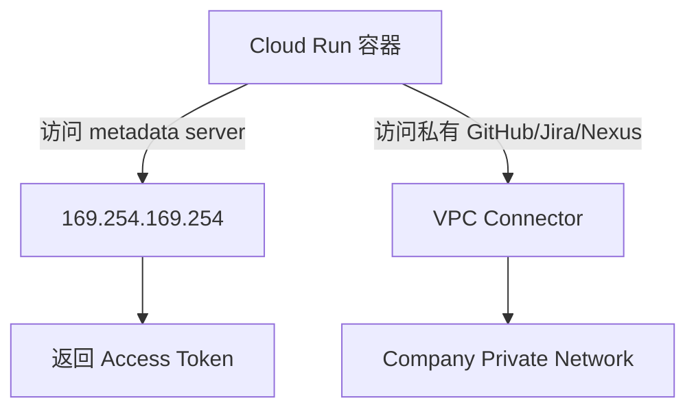

# summary

- 那比如我既想让访问 Google 的 metadata 又想要能访问公司内部的 github 或者 Jira 或者 nexus  应该如何配置这个 cloud run 的网络?对于我们 GCE 里面的主机 我们配置了自己的路由允许其访问这些地址
- command

```bash
gcloud run jobs deploy test-network-job \
  --image=ghcr.io/chainguard-dev/debug-base \
  --region=europe-west2 \
  --vpc-connector=vpc-conn-europe \
  --vpc-egress=private-ranges-only \
  --command=bash \
  --args=-c,"curl -i -H 'Metadata-Flavor: Google' http://metadata.google.internal/computeMetadata/v1/instance/service-accounts/default/email && echo && curl -i https://github.com && echo && curl -i http://nexus.intra.corp:8081 && echo && curl -s https://ifconfig.me" \
  --service-account=my-sa@myproject.iam.gserviceaccount.com
```

# Claude

根据你的问题，我来分析 Cloud Run 网络配置和 metadata server 访问问题：

## 1. Metadata Server 403 错误分析

这个错误表明你的 Cloud Run Job 通过 VPC Connector 访问时，流量被公司内部的 Squid 代理拦截了。

### 问题原因

```
Failed to retrieve http://metadata.google.internal/computeMetadata/v1/instance/service-accounts/
Status: 403 - Squid代理拦截
```

### 解决方案

```bash
# 在容器内设置bypass metadata server
export NO_PROXY="metadata.google.internal,169.254.169.254"
export no_proxy="metadata.google.internal,169.254.169.254"

# 或者直接使用IP访问
curl -H "Metadata-Flavor: Google" \
  "http://169.254.169.254/computeMetadata/v1/instance/service-accounts/default/token"
```

## 2. VPC Egress 配置区别

| 配置选项                           | 流量路由                       | 用途                         | 成本 |
| ---------------------------------- | ------------------------------ | ---------------------------- | ---- |
| `--vpc-egress=all-traffic`         | 所有出站流量通过 VPC Connector | 需要通过企业网络访问所有资源 | 较高 |
| `--vpc-egress=private-ranges-only` | 仅私有 IP 范围流量通过 VPC     | 混合访问模式                 | 较低 |

### 流量路由图



## 3. 双网卡 GCE 模拟配置

要让 Cloud Run 模拟双网卡 GCE 的行为：

### 推荐配置

```bash
gcloud run jobs deploy my-agent-4 \
  --image=europe-west2-docker.pkg.dev/myproject/containers/my-agent:latest \
  --region=europe-west2 \
  --vpc-connector=vpc-conn-europe \
  --vpc-egress=private-ranges-only \  # 关键：混合模式
  --max-retries=3 \
  --set-env-vars=env=pdev,name=testvalue,region=uk,version=release_17.0.0,NO_PROXY=metadata.google.internal,169.254.169.254 \
  --set-secrets=cloud_run_secret=cloud_run_test:latest \
  --task-timeout=10m \
  --cpu=1 \
  --memory=512Mi \
  --service-account=mgmt@myproject.iam.gserviceaccount.com
```

### 网络访问策略



## 4. L3 路由配置验证

### 检查路由配置

```bash
# 在Cloud Run容器内检查路由
ip route show

# 检查DNS解析
nslookup metadata.google.internal
nslookup your-internal-service.company.com

# 测试连通性
curl -v -H "Metadata-Flavor: Google" \
  http://169.254.169.254/computeMetadata/v1/instance/service-accounts/default/token

# 测试内部服务
curl -v http://your-internal-service.company.com
```

### VPC Connector 配置检查

```bash
# 检查VPC Connector状态
gcloud compute networks vpc-access connectors describe vpc-conn-europe \
  --region=europe-west2

# 检查子网路由
gcloud compute routes list --filter="network:your-vpc-network"
```

## 5. 最佳实践建议

### 环境变量配置

```bash
# 添加到你的deployment命令
--set-env-vars=NO_PROXY="metadata.google.internal,169.254.169.254,localhost,127.0.0.1" \
--set-env-vars=HTTPS_PROXY="http://your-proxy:port" \
--set-env-vars=HTTP_PROXY="http://your-proxy:port"
```

### 容器内脚本优化

```bash
#!/bin/bash
# 设置代理bypass
export NO_PROXY="metadata.google.internal,169.254.169.254"

# 获取token
TOKEN=$(curl -s -H "Metadata-Flavor: Google" \
  "http://169.254.169.254/computeMetadata/v1/instance/service-accounts/default/token" \
  | jq -r '.access_token')

# 使用token调用GCP API
gcloud auth activate-service-account --access-token="$TOKEN"
```

使用`--vpc-egress=private-ranges-only`配置可以满足你的需求，既能通过企业 L3 路由访问内部资源，又能直接访问 Google metadata server，避免代理拦截问题。

使用`--vpc-egress=private-ranges-only`配置可以满足你的需求，既能通过企业 L3 路由访问内部资源，又能直接访问 Google metadata server，避免代理拦截问题。 那么我现在需要进行一些测试 环境变量配置 因为脚本调整起来有些麻烦.我想通过环境变量配置看到我想要的效果,比如说可以拿到 metadata . 我可以通过--set-env-vars 然后配合 console Edit Container 启动命令.和 container arguments 来实现这些测试. 比如我知道 bash -c env 我想要更多类似这样的命令来达到我的测试目的? 我里面也有 Curl 命令

为了通过 Cloud Run Job 的环境变量和启动命令进行网络测试，我为你提供一系列测试命令：

## 1. Cloud Run Job 测试配置

### 基础部署命令

```bash
gcloud run jobs deploy my-agent-test \
  --image=europe-west2-docker.pkg.dev/myproject/containers/my-agent:latest \
  --region=europe-west2 \
  --vpc-connector=vpc-conn-europe \
  --vpc-egress=private-ranges-only \
  --set-env-vars=NO_PROXY="metadata.google.internal,169.254.169.254,localhost,127.0.0.1" \
  --set-env-vars=TEST_MODE=true \
  --task-timeout=10m \
  --cpu=1 \
  --memory=512Mi \
  --service-account=mgmt@myproject.iam.gserviceaccount.com
```

## 2. Console 测试命令集合

### Container 启动命令设置

```bash
# 在Console的Edit Container -> Command中设置
["/bin/bash"]

# 在Console的Edit Container -> Arguments中设置
["-c", "你选择的测试命令"]
```

### 测试命令选项

#### A. 环境变量和网络基础信息

```bash
# Arguments:
bash -c "echo '=== 环境变量 ==='; env | grep -E '(PROXY|proxy|NO_PROXY)'; echo '=== 网络接口 ==='; ip addr show; echo '=== 路由表 ==='; ip route show; echo '=== DNS配置 ==='; cat /etc/resolv.conf; sleep 300"
```

#### B. Metadata Server 连通性测试

```bash
# Arguments:
bash -c "echo '=== Metadata Server测试 ==='; echo 'IP方式访问:'; curl -v --connect-timeout 10 -H 'Metadata-Flavor: Google' http://169.254.169.254/computeMetadata/v1/; echo; echo 'DNS方式访问:'; curl -v --connect-timeout 10 -H 'Metadata-Flavor: Google' http://metadata.google.internal/computeMetadata/v1/; sleep 300"
```

#### C. Service Account Token 获取测试

```bash
# Arguments:
bash -c "echo '=== Service Account Token测试 ==='; TOKEN=$(curl -s -H 'Metadata-Flavor: Google' http://169.254.169.254/computeMetadata/v1/instance/service-accounts/default/token 2>/dev/null | head -c 200); if [ -n \"$TOKEN\" ]; then echo 'Token获取成功:'; echo $TOKEN; else echo 'Token获取失败'; fi; sleep 300"
```

#### D. 网络连通性综合测试

```bash
# Arguments:
bash -c "echo '=== 网络连通性测试 ==='; echo '1. Google DNS:'; ping -c 3 8.8.8.8; echo '2. Metadata Server:'; ping -c 3 169.254.169.254; echo '3. Google APIs:'; curl -I --connect-timeout 10 https://www.googleapis.com; echo '4. 内部网络测试:'; ping -c 3 10.0.0.1 2>/dev/null || echo '内部网络不可达'; sleep 300"
```

#### E. 代理配置验证测试

```bash
# Arguments:
bash -c "echo '=== 代理配置验证 ==='; echo 'NO_PROXY设置:'; echo $NO_PROXY; echo 'HTTP_PROXY设置:'; echo $HTTP_PROXY; echo 'HTTPS_PROXY设置:'; echo $HTTPS_PROXY; echo '=== 代理bypass测试 ==='; curl -v --connect-timeout 10 http://metadata.google.internal/computeMetadata/v1/ -H 'Metadata-Flavor: Google'; sleep 300"
```

#### F. DNS 解析测试

```bash
# Arguments:
bash -c "echo '=== DNS解析测试 ==='; echo '1. metadata.google.internal:'; nslookup metadata.google.internal; echo '2. www.googleapis.com:'; nslookup www.googleapis.com; echo '3. 内部域名测试:'; nslookup your-internal-service.company.com 2>/dev/null || echo '内部DNS无法解析'; sleep 300"
```

#### G. 完整的网络诊断

```bash
# Arguments:
bash -c "echo '=== 完整网络诊断 ==='; echo '--- 系统信息 ---'; uname -a; echo '--- 网络配置 ---'; ip addr; ip route; echo '--- 环境变量 ---'; env | grep -i proxy; echo '--- Metadata测试 ---'; curl -s -H 'Metadata-Flavor: Google' http://169.254.169.254/computeMetadata/v1/instance/service-accounts/default/email 2>&1; echo '--- 外网连通性 ---'; curl -I -s --connect-timeout 5 https://www.google.com 2>&1 | head -5; sleep 600"
```

## 3. 高级测试场景

### 测试不同 egress 配置的影响

```bash
# 部署all-traffic版本进行对比
gcloud run jobs deploy my-agent-all-traffic \
  --image=europe-west2-docker.pkg.dev/myproject/containers/my-agent:latest \
  --region=europe-west2 \
  --vpc-connector=vpc-conn-europe \
  --vpc-egress=all-traffic \
  --set-env-vars=NO_PROXY="metadata.google.internal,169.254.169.254" \
  --set-env-vars=TEST_LABEL=all-traffic \
  --task-timeout=10m
```

### 组合测试命令

```bash
# Arguments: 连接测试 + Token获取 + API调用
bash -c "
echo '=== 测试开始 ===';
echo '当前时间:' $(date);
echo '测试标签:' $TEST_LABEL;

echo '--- Step 1: 基础连通性 ---';
curl -s -I --connect-timeout 5 http://169.254.169.254/ && echo 'Metadata IP可达' || echo 'Metadata IP不可达';

echo '--- Step 2: Token获取 ---';
TOKEN=\$(curl -s --connect-timeout 10 -H 'Metadata-Flavor: Google' http://169.254.169.254/computeMetadata/v1/instance/service-accounts/default/token | jq -r '.access_token' 2>/dev/null);
if [ \"\$TOKEN\" != \"null\" ] && [ -n \"\$TOKEN\" ]; then
  echo 'Token获取成功，长度:' \${#TOKEN};
  echo 'Token前20字符:' \${TOKEN:0:20}...;
else
  echo 'Token获取失败';
fi;

echo '--- Step 3: API调用测试 ---';
if [ -n \"\$TOKEN\" ]; then
  curl -s -H \"Authorization: Bearer \$TOKEN\" https://www.googleapis.com/oauth2/v1/tokeninfo?access_token=\$TOKEN | head -5;
fi;

sleep 300;
"
```

## 4. 测试流程图



## 5. 结果分析指南

### 成功指标

```bash
# 预期成功输出
Metadata IP可达
Token获取成功，长度: 2048+
HTTP/1.1 200 OK  # googleapis.com访问
```

### 失败排查

```bash
# 常见错误模式
"Status: 403" + "Squid" → 代理拦截，需要设置NO_PROXY
"Connection timeout" → 网络路由问题
"DNS resolution failed" → DNS配置问题
```

使用这些测试命令，你可以在 Console 中快速验证不同配置的效果，无需修改复杂的脚本代码。

通过 --set-env-vars 和 Console（或 CLI）中修改启动命令、容器参数来测试 **Cloud Run Job 的网络能力 / metadata 访问 / 环境注入** 等，下面是一些适用于你当前测试目的的 **常用技巧和命令示例合集**：

---

## **✅ 一些实用测试命令（用于** **bash -c '...'**）

| **目的**                                | **命令示例**                                                                                                                           |
| --------------------------------------- | -------------------------------------------------------------------------------------------------------------------------------------- |
| 查看环境变量                            | bash -c 'env'                                                                                                                          |
| 查看特定 env                            | bash -c 'echo $YOUR_VAR'                                                                                                               |
| 获取 metadata access token              | bash -c 'curl -H "Metadata-Flavor: Google" http://metadata.google.internal/computeMetadata/v1/instance/service-accounts/default/token' |
| 获取 project-id                         | bash -c 'curl -H "Metadata-Flavor: Google" http://metadata.google.internal/computeMetadata/v1/project/project-id'                      |
| 获取服务账号邮箱                        | bash -c 'curl -H "Metadata-Flavor: Google" http://metadata.google.internal/computeMetadata/v1/instance/service-accounts/default/email' |
| 查看 DNS 解析是否通畅                   | bash -c 'dig nexus.internal.mycorp.com'                                                                                                |
| ping 私有地址                           | bash -c 'ping -c 3 10.0.1.15'                                                                                                          |
| curl 测试外部网站（公网）               | bash -c 'curl https://google.com'                                                                                                      |
| curl 测试公司 Nexus 地址                | bash -c 'curl -v http://nexus.intra.corp:8081/'                                                                                        |
| 使用 wget 测试                          | bash -c 'wget -qO- https://ifconfig.me'                                                                                                |
| 打印公网出口 IP（确认出站 NAT 是否 OK） | bash -c 'curl https://ifconfig.io'                                                                                                     |

---

## **✅ 示例：通过环境变量传递测试目标**

你可以这样部署 Job：

```
gcloud run jobs deploy test-env-job \
  --image=debian:bullseye-slim \
  --region=europe-west2 \
  --vpc-connector=vpc-conn-europe \
  --vpc-egress=private-ranges-only \
  --command=bash \
  --args=-c,"curl -H 'Metadata-Flavor: Google' http://metadata.google.internal/computeMetadata/v1/project/project-id" \
  --set-env-vars="TEST_TARGET=nexus.intra.corp,YOUR_VAR=test123"
```

---

## **✅ 在 GCP Console Web UI 调整启动命令**

如果你已经部署了 Job，也可以通过 Console：

1. 打开 Cloud Run Job → Edit Job
2. 找到「Container Command」和「Container Arguments」
3. 例如填入：

- **Command**: bash
- **Arguments**: -c, curl -v http://nexus.intra.corp:8081/

---

## **✅ 更方便的调试容器推荐镜像（带 curl、bash、jq 等）**

建议你使用如下调试镜像替换你的 Job 镜像：

```
--image=us-docker.pkg.dev/cloudrun/container/hello
```

或使用更通用调试镜像：

```
--image=ghcr.io/chainguard-dev/debug-base
```

这些都内置了 bash, curl, jq, ping, wget 等，便于测试各种行为。

---

## **✅ Mermaid 流程图：你当前的测试流程结构**



---

如果你需要，我可以为你生成一组标准测试命令模板，包括环境变量 + 测试项组合。是否需要？
非常好，这样你可以在一个 Cloud Run Job 中集中测试所有网络路径，包括：

- Google metadata server（确认 ADC）
- 公司内部资源如 GitHub Enterprise、Nexus（走 VPC 路由）
- 返回完整响应头（使用 curl -i）方便排查

下面是推荐你用于 Cloud Run Job 的测试脚本，可以作为容器的 entrypoint 或 bash -c 启动参数。

---

## **✅ Bash 测试脚本（multi-target）**

你可以将此脚本写为 test-network.sh 或直接内嵌在 bash -c 中运行：

```
#!/bin/bash
set -euo pipefail

echo "===== 1. Accessing GCP Metadata Server ====="
curl -i -H "Metadata-Flavor: Google" \
  "http://metadata.google.internal/computeMetadata/v1/instance/service-accounts/default/email" || echo "❌ Metadata server access failed"

echo ""
echo "===== 2. Accessing GitHub ====="
curl -i https://github.com || echo "❌ GitHub access failed"

echo ""
echo "===== 3. Accessing Internal Nexus ====="
curl -i http://nexus.intra.corp:8081 || echo "❌ Nexus access failed"

echo ""
echo "===== 4. Show outbound IP ====="
curl -s https://ifconfig.me || echo "❌ Outbound IP check failed"
```

---

## **✅ 如何部署测试 Job（gcloud）**

```
gcloud run jobs deploy test-network-job \
  --image=ghcr.io/chainguard-dev/debug-base \
  --region=europe-west2 \
  --vpc-connector=vpc-conn-europe \
  --vpc-egress=private-ranges-only \
  --command=bash \
  --args=-c,"curl -i -H 'Metadata-Flavor: Google' http://metadata.google.internal/computeMetadata/v1/instance/service-accounts/default/email && echo && curl -i https://github.com && echo && curl -i http://nexus.intra.corp:8081 && echo && curl -s https://ifconfig.me" \
  --service-account=my-sa@myproject.iam.gserviceaccount.com
```

---

## **✅ Mermaid 流程图：测试脚本逻辑**



---

## **✅ 其他建议**

- 如果 Nexus / GitHub 是私网 DNS 名，确保 VPC 子网有正确的 DNS 解析设置（如 Cloud DNS + 转发器）；
- --vpc-egress=private-ranges-only 可直达 metadata，但若你走了代理中间跳（如 Squid），记得设置 NO_PROXY；
- 如你有多个 Job 场景，可以将测试脚本独立做成容器，如 gcr.io/myproject/network-checker。

是否需要我帮你生成这个测试脚本的 Dockerfile 镜像部署？

# A

非常好的问题！这是 **Cloud Run 网络设计中最常见的需求之一**：

> ✅「既能访问 Google 内部的 metadata server，又能访问公司私有系统（如 GitHub Enterprise / Jira / Nexus 等）」

---

## **✅ 目标需求分析**

| **需求**                                                      | **网络路径类型**          | **是否需要经过 VPC**      |
| ------------------------------------------------------------- | ------------------------- | ------------------------- |
| 访问 GCP Metadata Server (169.254.169.254)                    | GCP 内部特殊 IP           | ❌ 不能走 VPC（否则失效） |
| 访问公司内部 GitHub/Jira/Nexus（一般是私网地址或固定公网 IP） | 通常是私有地址或 NAT 访问 | ✅ 必须走 VPC Connector   |

---

## **✅ 正确做法总结：**

```
✅ 设置 VPC Connector
✅ 使用 --vpc-egress=private-ranges-only
✅ 创建 Private Route + DNS/Firewall 规则，确保 Cloud Run 能访问公司内部服务
```

---

## **✅ 推荐配置方案如下**

### **1. VPC Connector 创建（假设你已存在）**

```
gcloud compute networks vpc-access connectors create vpc-conn-europe \
  --region=europe-west2 \
  --network=default \
  --range=10.8.0.0/28
```

> ⚠️ 该 range 是 Cloud Run 发出的 IP，需要纳入你的防火墙策略！

---

### **2. Cloud Run Job 配置：**

```
gcloud run jobs deploy my-job \
  --image=gcr.io/myproject/my-image \
  --region=europe-west2 \
  --vpc-connector=vpc-conn-europe \
  --vpc-egress=private-ranges-only \
  --service-account=your-job-sa@your-project.iam.gserviceaccount.com \
  ...
```

> ✅ 保留 metadata server 可用（因为没设置 all-traffic）

> ✅ 访问公司内网地址自动走 VPC Connector

---

### **3. 私有地址接入：路由 / DNS / 防火墙准备**

#### **📌 如果你的 GitHub/Jira/Nexus 是「私网地址」**

| **项目**  | **配置项**                                                                                |
| --------- | ----------------------------------------------------------------------------------------- |
| 🔁 路由   | Cloud Run 出的流量通过 VPC Connector 指向你的 VPC，VPC 必须能路由到这些 IP                |
| 🧱 防火墙 | 允许 10.8.0.0/28 的出站 IP 访问内部服务                                                   |
| 🧭 DNS    | DNS 解析内部域名（如 nexus.internal.mycorp.com），可使用 Cloud DNS 转发或 /etc/hosts 注入 |

#### **📌 如果是公网 IP（但公司控制访问）**

你需要在 VPC 的防火墙规则中允许 Cloud Run VPC Connector 的 IP 范围（如 10.8.0.0/28）访问这些公网地址。

---

## **❗ 避免的做法**

| **错误做法**             | **问题**                                        |
| ------------------------ | ----------------------------------------------- |
| --vpc-egress=all-traffic | 会导致 metadata server 访问失败 unless 特别设置 |
| 不设置 VPC Connector     | 无法访问私网地址（Nexus/Jira）                  |
| 忽略 DNS 设置            | 无法解析你公司的域名服务地址                    |

---

## **✅ Mermaid 流程图说明**



---

## **✅ DNS 提示（如你需要）**

若你使用内网域名如：

- nexus.mycorp.local
- jira.intra.local

你可以使用 Cloud DNS 转发器：

```
gcloud dns policies create custom-dns-policy \
  --description="Forward internal domains" \
  --networks=default \
  --enable-inbound-forwarding \
  --enable-logging

gcloud dns policies update custom-dns-policy \
  --add-dns-forwarding-targets=10.1.2.3 \
  --target-name-servers=your.internal.dns.server
```

---

## **✅ 总结**

| **动作**                     | **是否需要**   |
| ---------------------------- | -------------- |
| 设置 VPC Connector           | ✅             |
| 使用 all-traffic             | ❌（避免）     |
| 保留 metadata 可用           | ✅（默认即可） |
| 创建内部服务可访问路由 + DNS | ✅             |

---

需要我帮你生成一个完整的 GCP 资源清单（包括 VPC Connector、DNS 策略、防火墙）吗？可以直接出 Markdown 表格 + flow 图形式。
