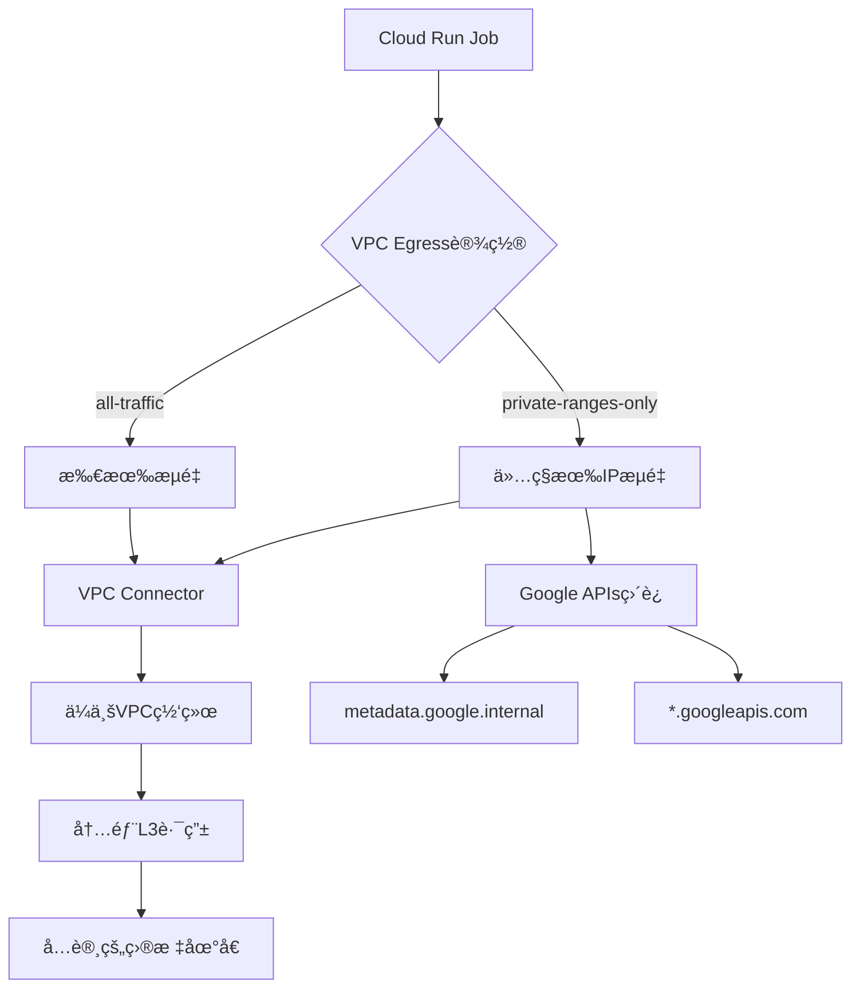
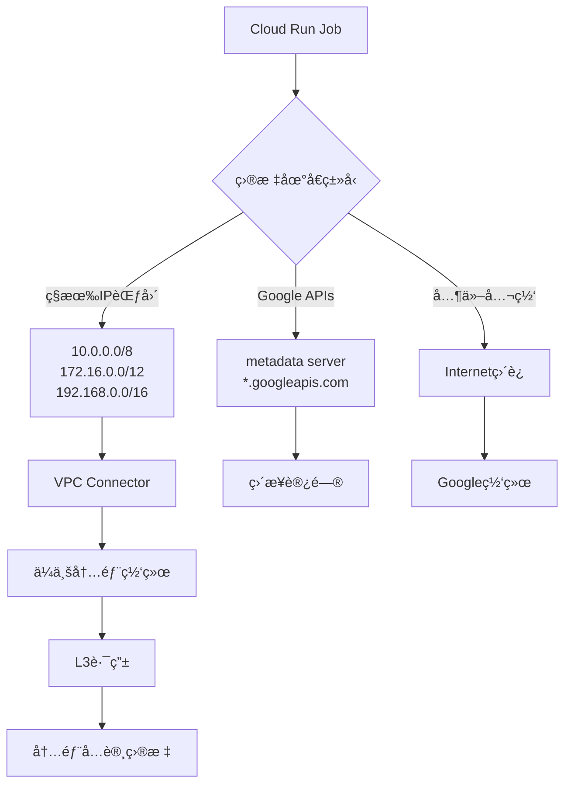
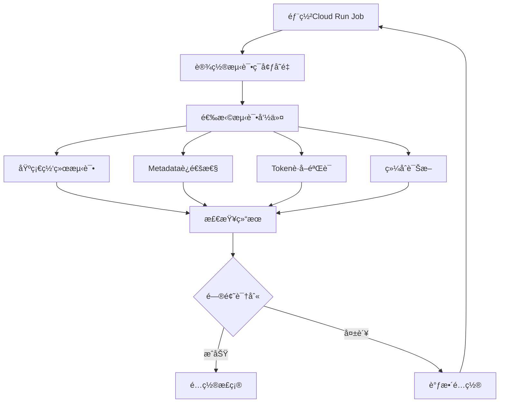
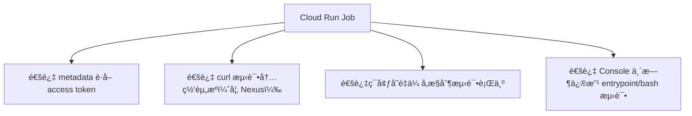
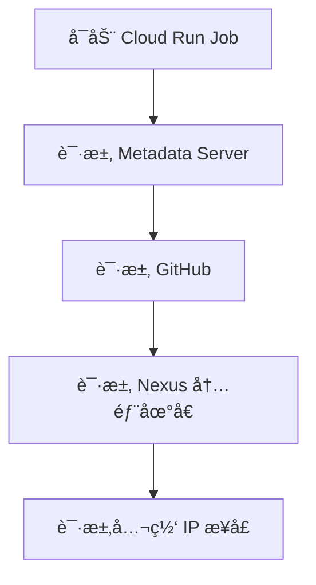
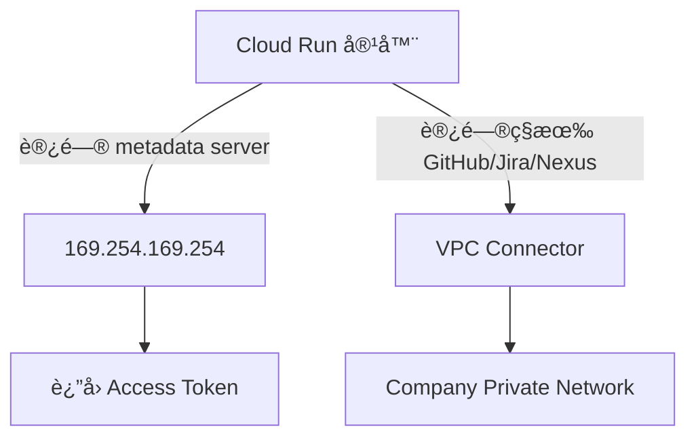

# summary

- 那比如我既想让访问 Google çš„ metadata åˆæƒ³è¦èƒ½è®¿é—®å…¬å¸å†…部的 github 或者 Jira 或者 nexus  应该如何é…置这个 cloud run 的网络?对äºæˆ‘们 GCE 里é¢çš„主机 我们é…置了自己的路由å…许其访问这些地å€
- command

```bash
gcloud run jobs deploy test-network-job \
  --image=ghcr.io/chainguard-dev/debug-base \
  --region=europe-west2 \
  --vpc-connector=vpc-conn-europe \
  --vpc-egress=private-ranges-only \
  --command=bash \
  --args=-c,"curl -i -H 'Metadata-Flavor: Google' http://metadata.google.internal/computeMetadata/v1/instance/service-accounts/default/email && echo && curl -i https://github.com && echo && curl -i http://nexus.intra.corp:8081 && echo && curl -s https://ifconfig.me" \
  --service-account=my-sa@myproject.iam.gserviceaccount.com
```

# Claude

æ ¹æ®ä½ çš„问题，我æ¥åˆ†æ Cloud Run 网络é…置和 metadata server 访问问题：

## 1. Metadata Server 403 错误分æ

这个错误表æ˜ä½ çš„ Cloud Run Job 通过 VPC Connector 访问时，æµé‡è¢«å…¬å¸å†…部的 Squid 代ç†æ‹¦æˆªäº†ã€‚

### 问题åŸå› 

```
Failed to retrieve http://metadata.google.internal/computeMetadata/v1/instance/service-accounts/
Status: 403 - Squid代ç†æ‹¦æˆª
```

### 解决方案

```bash
# 在容器内设置bypass metadata server
export NO_PROXY="metadata.google.internal,169.254.169.254"
export no_proxy="metadata.google.internal,169.254.169.254"

# 或者直æ¥ä½¿ç”¨IP访问
curl -H "Metadata-Flavor: Google" \
  "http://169.254.169.254/computeMetadata/v1/instance/service-accounts/default/token"
```

## 2. VPC Egress é…置区别

| é…置选项                           | æµé‡è·¯ç”±                       | 用途                         | æˆæœ¬ |
| ---------------------------------- | ------------------------------ | ---------------------------- | ---- |
| `--vpc-egress=all-traffic`         | 所有出站æµé‡é€šè¿‡ VPC Connector | 需è¦é€šè¿‡ä¼ä¸šç½‘ç»œè®¿é—®æ‰€æœ‰èµ„æº | 较高 |
| `--vpc-egress=private-ranges-only` | ä»…ç§æœ‰ IP 范围æµé‡é€šè¿‡ VPC     | æ··åˆè®¿é—®æ¨¡å¼                 | è¾ƒä½ |

### æµé‡è·¯ç”±å›¾



## 3. åŒç½‘å¡ GCE 模拟é…ç½®

è¦è®© Cloud Run 模拟åŒç½‘å¡ GCE 的行为：

### æ¨èé…ç½®

```bash
gcloud run jobs deploy my-agent-4 \
  --image=europe-west2-docker.pkg.dev/myproject/containers/my-agent:latest \
  --region=europe-west2 \
  --vpc-connector=vpc-conn-europe \
  --vpc-egress=private-ranges-only \  # 关键：混åˆæ¨¡å¼
  --max-retries=3 \
  --set-env-vars=env=pdev,name=testvalue,region=uk,version=release_17.0.0,NO_PROXY=metadata.google.internal,169.254.169.254 \
  --set-secrets=cloud_run_secret=cloud_run_test:latest \
  --task-timeout=10m \
  --cpu=1 \
  --memory=512Mi \
  --service-account=mgmt@myproject.iam.gserviceaccount.com
```

### 网络访问策略



## 4. L3 路由é…置验è¯

### 检查路由é…ç½®

```bash
# 在Cloud Run容器内检查路由
ip route show

# 检查DNS解æ
nslookup metadata.google.internal
nslookup your-internal-service.company.com

# 测试è¿é€šæ€§
curl -v -H "Metadata-Flavor: Google" \
  http://169.254.169.254/computeMetadata/v1/instance/service-accounts/default/token

# 测试内部æœåŠ¡
curl -v http://your-internal-service.company.com
```

### VPC Connector é…置检查

```bash
# 检查VPC Connector状æ€
gcloud compute networks vpc-access connectors describe vpc-conn-europe \
  --region=europe-west2

# 检查å­ç½‘路由
gcloud compute routes list --filter="network:your-vpc-network"
```

## 5. 最佳å®è·µå»ºè®®

### ç¯å¢ƒå˜é‡é…ç½®

```bash
# 添加到你的deployment命令
--set-env-vars=NO_PROXY="metadata.google.internal,169.254.169.254,localhost,127.0.0.1" \
--set-env-vars=HTTPS_PROXY="http://your-proxy:port" \
--set-env-vars=HTTP_PROXY="http://your-proxy:port"
```

### 容器内脚本优化

```bash
#!/bin/bash
# 设置代ç†bypass
export NO_PROXY="metadata.google.internal,169.254.169.254"

# è·å–token
TOKEN=$(curl -s -H "Metadata-Flavor: Google" \
  "http://169.254.169.254/computeMetadata/v1/instance/service-accounts/default/token" \
  | jq -r '.access_token')

# 使用token调用GCP API
gcloud auth activate-service-account --access-token="$TOKEN"
```

使用`--vpc-egress=private-ranges-only`é…ç½®å¯ä»¥æ»¡è¶³ä½ çš„需求，既能通过ä¼ä¸š L3 路由访问内部资æºï¼Œåˆèƒ½ç›´æ¥è®¿é—® Google metadata server，é¿å…代ç†æ‹¦æˆªé—®é¢˜ã€‚

使用`--vpc-egress=private-ranges-only`é…ç½®å¯ä»¥æ»¡è¶³ä½ çš„需求，既能通过ä¼ä¸š L3 路由访问内部资æºï¼Œåˆèƒ½ç›´æ¥è®¿é—® Google metadata server，é¿å…代ç†æ‹¦æˆªé—®é¢˜ã€‚ 那么我ç°åœ¨éœ€è¦è¿›è¡Œä¸€äº›æµ‹è¯• ç¯å¢ƒå˜é‡é…ç½® 因为脚本调整起æ¥æœ‰äº›éº»çƒ¦.我想通过ç¯å¢ƒå˜é‡é…置看到我想è¦çš„效æœ,比如说å¯ä»¥æ‹¿åˆ° metadata . 我å¯ä»¥é€šè¿‡--set-env-vars 然åé…åˆ console Edit Container å¯åŠ¨å‘½ä»¤.å’Œ container arguments æ¥å®ç°è¿™äº›æµ‹è¯•. æ¯”å¦‚æˆ‘çŸ¥é“ bash -c env 我想è¦æ›´å¤šç±»ä¼¼è¿™æ ·çš„命令æ¥è¾¾åˆ°æˆ‘的测试目的? 我里é¢ä¹Ÿæœ‰ Curl 命令

为了通过 Cloud Run Job çš„ç¯å¢ƒå˜é‡å’Œå¯åŠ¨å‘½ä»¤è¿›è¡Œç½‘络测试，我为你æ供一系列测试命令：

## 1. Cloud Run Job 测试é…ç½®

### 基础部署命令

```bash
gcloud run jobs deploy my-agent-test \
  --image=europe-west2-docker.pkg.dev/myproject/containers/my-agent:latest \
  --region=europe-west2 \
  --vpc-connector=vpc-conn-europe \
  --vpc-egress=private-ranges-only \
  --set-env-vars=NO_PROXY="metadata.google.internal,169.254.169.254,localhost,127.0.0.1" \
  --set-env-vars=TEST_MODE=true \
  --task-timeout=10m \
  --cpu=1 \
  --memory=512Mi \
  --service-account=mgmt@myproject.iam.gserviceaccount.com
```

## 2. Console 测试命令集åˆ

### Container å¯åŠ¨å‘½ä»¤è®¾ç½®

```bash
# 在Console的Edit Container -> Command中设置
["/bin/bash"]

# 在Console的Edit Container -> Arguments中设置
["-c", "你选择的测试命令"]
```

### 测试命令选项

#### A. ç¯å¢ƒå˜é‡å’Œç½‘络基础信æ¯

```bash
# Arguments:
bash -c "echo '=== ç¯å¢ƒå˜é‡ ==='; env | grep -E '(PROXY|proxy|NO_PROXY)'; echo '=== 网络æ¥å£ ==='; ip addr show; echo '=== 路由表 ==='; ip route show; echo '=== DNSé…ç½® ==='; cat /etc/resolv.conf; sleep 300"
```

#### B. Metadata Server è¿é€šæ€§æµ‹è¯•

```bash
# Arguments:
bash -c "echo '=== Metadata Server测试 ==='; echo 'IPæ–¹å¼è®¿é—®:'; curl -v --connect-timeout 10 -H 'Metadata-Flavor: Google' http://169.254.169.254/computeMetadata/v1/; echo; echo 'DNSæ–¹å¼è®¿é—®:'; curl -v --connect-timeout 10 -H 'Metadata-Flavor: Google' http://metadata.google.internal/computeMetadata/v1/; sleep 300"
```

#### C. Service Account Token è·å–测试

```bash
# Arguments:
bash -c "echo '=== Service Account Token测试 ==='; TOKEN=$(curl -s -H 'Metadata-Flavor: Google' http://169.254.169.254/computeMetadata/v1/instance/service-accounts/default/token 2>/dev/null | head -c 200); if [ -n \"$TOKEN\" ]; then echo 'Tokenè·å–æˆåŠŸ:'; echo $TOKEN; else echo 'Tokenè·å–失败'; fi; sleep 300"
```

#### D. 网络è¿é€šæ€§ç»¼åˆæµ‹è¯•

```bash
# Arguments:
bash -c "echo '=== 网络è¿é€šæ€§æµ‹è¯• ==='; echo '1. Google DNS:'; ping -c 3 8.8.8.8; echo '2. Metadata Server:'; ping -c 3 169.254.169.254; echo '3. Google APIs:'; curl -I --connect-timeout 10 https://www.googleapis.com; echo '4. 内部网络测试:'; ping -c 3 10.0.0.1 2>/dev/null || echo '内部网络ä¸å¯è¾¾'; sleep 300"
```

#### E. 代ç†é…置验è¯æµ‹è¯•

```bash
# Arguments:
bash -c "echo '=== 代ç†é…ç½®éªŒè¯ ==='; echo 'NO_PROXY设置:'; echo $NO_PROXY; echo 'HTTP_PROXY设置:'; echo $HTTP_PROXY; echo 'HTTPS_PROXY设置:'; echo $HTTPS_PROXY; echo '=== 代ç†bypass测试 ==='; curl -v --connect-timeout 10 http://metadata.google.internal/computeMetadata/v1/ -H 'Metadata-Flavor: Google'; sleep 300"
```

#### F. DNS 解æ测试

```bash
# Arguments:
bash -c "echo '=== DNS解æ测试 ==='; echo '1. metadata.google.internal:'; nslookup metadata.google.internal; echo '2. www.googleapis.com:'; nslookup www.googleapis.com; echo '3. 内部域å测试:'; nslookup your-internal-service.company.com 2>/dev/null || echo '内部DNS无法解æ'; sleep 300"
```

#### G. 完整的网络诊断

```bash
# Arguments:
bash -c "echo '=== 完整网络诊断 ==='; echo '--- ç³»ç»Ÿä¿¡æ¯ ---'; uname -a; echo '--- 网络é…ç½® ---'; ip addr; ip route; echo '--- ç¯å¢ƒå˜é‡ ---'; env | grep -i proxy; echo '--- Metadata测试 ---'; curl -s -H 'Metadata-Flavor: Google' http://169.254.169.254/computeMetadata/v1/instance/service-accounts/default/email 2>&1; echo '--- 外网è¿é€šæ€§ ---'; curl -I -s --connect-timeout 5 https://www.google.com 2>&1 | head -5; sleep 600"
```

## 3. 高级测试场景

### 测试ä¸åŒ egress é…置的影å“

```bash
# 部署all-traffic版本进行对比
gcloud run jobs deploy my-agent-all-traffic \
  --image=europe-west2-docker.pkg.dev/myproject/containers/my-agent:latest \
  --region=europe-west2 \
  --vpc-connector=vpc-conn-europe \
  --vpc-egress=all-traffic \
  --set-env-vars=NO_PROXY="metadata.google.internal,169.254.169.254" \
  --set-env-vars=TEST_LABEL=all-traffic \
  --task-timeout=10m
```

### 组åˆæµ‹è¯•å‘½ä»¤

```bash
# Arguments: è¿æ¥æµ‹è¯• + Tokenè·å– + API调用
bash -c "
echo '=== 测试开始 ===';
echo '当å‰æ—¶é—´:' $(date);
echo '测试标签:' $TEST_LABEL;

echo '--- Step 1: 基础è¿é€šæ€§ ---';
curl -s -I --connect-timeout 5 http://169.254.169.254/ && echo 'Metadata IPå¯è¾¾' || echo 'Metadata IPä¸å¯è¾¾';

echo '--- Step 2: Tokenè·å– ---';
TOKEN=\$(curl -s --connect-timeout 10 -H 'Metadata-Flavor: Google' http://169.254.169.254/computeMetadata/v1/instance/service-accounts/default/token | jq -r '.access_token' 2>/dev/null);
if [ \"\$TOKEN\" != \"null\" ] && [ -n \"\$TOKEN\" ]; then
  echo 'Tokenè·å–æˆåŠŸï¼Œé•¿åº¦:' \${#TOKEN};
  echo 'Tokenå‰20字符:' \${TOKEN:0:20}...;
else
  echo 'Tokenè·å–失败';
fi;

echo '--- Step 3: API调用测试 ---';
if [ -n \"\$TOKEN\" ]; then
  curl -s -H \"Authorization: Bearer \$TOKEN\" https://www.googleapis.com/oauth2/v1/tokeninfo?access_token=\$TOKEN | head -5;
fi;

sleep 300;
"
```

## 4. 测试æµç¨‹å›¾



## 5. 结æœåˆ†æ指å—

### æˆåŠŸæŒ‡æ ‡

```bash
# 预期æˆåŠŸè¾“出
Metadata IPå¯è¾¾
Tokenè·å–æˆåŠŸï¼Œé•¿åº¦: 2048+
HTTP/1.1 200 OK  # googleapis.com访问
```

### 失败æ’查

```bash
# 常è§é”™è¯¯æ¨¡å¼
"Status: 403" + "Squid" → 代ç†æ‹¦æˆªï¼Œéœ€è¦è®¾ç½®NO_PROXY
"Connection timeout" → 网络路由问题
"DNS resolution failed" → DNSé…置问题
```

使用这些测试命令，你å¯ä»¥åœ¨ Console 中快速验è¯ä¸åŒé…置的效æœï¼Œæ— éœ€ä¿®æ”¹å¤æ‚的脚本代ç ã€‚

通过 --set-env-vars å’Œ Console（或 CLI）中修改å¯åŠ¨å‘½ä»¤ã€å®¹å™¨å‚æ•°æ¥æµ‹è¯• **Cloud Run Job 的网络能力 / metadata 访问 / ç¯å¢ƒæ³¨å…¥** 等，下é¢æ˜¯ä¸€äº›é€‚用äºä½ å½“å‰æµ‹è¯•ç›®çš„çš„ **常用技巧和命令示例åˆé›†**：

---

## **✅ 一些å®ç”¨æµ‹è¯•å‘½ä»¤ï¼ˆç”¨äº** **bash -c '...'**）

| **目的**                                | **命令示例**                                                                                                                           |
| --------------------------------------- | -------------------------------------------------------------------------------------------------------------------------------------- |
| 查看ç¯å¢ƒå˜é‡                            | bash -c 'env'                                                                                                                          |
| 查看特定 env                            | bash -c 'echo $YOUR_VAR'                                                                                                               |
| è·å– metadata access token              | bash -c 'curl -H "Metadata-Flavor: Google" http://metadata.google.internal/computeMetadata/v1/instance/service-accounts/default/token' |
| è·å– project-id                         | bash -c 'curl -H "Metadata-Flavor: Google" http://metadata.google.internal/computeMetadata/v1/project/project-id'                      |
| è·å–æœåŠ¡è´¦å·é‚®ç®±                        | bash -c 'curl -H "Metadata-Flavor: Google" http://metadata.google.internal/computeMetadata/v1/instance/service-accounts/default/email' |
| 查看 DNS 解æ是å¦é€šç•…                   | bash -c 'dig nexus.internal.mycorp.com'                                                                                                |
| ping ç§æœ‰åœ°å€                           | bash -c 'ping -c 3 10.0.1.15'                                                                                                          |
| curl 测试外部网站（公网）               | bash -c 'curl https://google.com'                                                                                                      |
| curl æµ‹è¯•å…¬å¸ Nexus åœ°å€                | bash -c 'curl -v http://nexus.intra.corp:8081/'                                                                                        |
| 使用 wget 测试                          | bash -c 'wget -qO- https://ifconfig.me'                                                                                                |
| 打å°å…¬ç½‘å‡ºå£ IP（确认出站 NAT æ˜¯å¦ OK） | bash -c 'curl https://ifconfig.io'                                                                                                     |

---

## **✅ 示例：通过ç¯å¢ƒå˜é‡ä¼ é€’测试目标**

ä½ å¯ä»¥è¿™æ ·éƒ¨ç½² Job：

```
gcloud run jobs deploy test-env-job \
  --image=debian:bullseye-slim \
  --region=europe-west2 \
  --vpc-connector=vpc-conn-europe \
  --vpc-egress=private-ranges-only \
  --command=bash \
  --args=-c,"curl -H 'Metadata-Flavor: Google' http://metadata.google.internal/computeMetadata/v1/project/project-id" \
  --set-env-vars="TEST_TARGET=nexus.intra.corp,YOUR_VAR=test123"
```

---

## **✅ 在 GCP Console Web UI 调整å¯åŠ¨å‘½ä»¤**

如æœä½ å·²ç»éƒ¨ç½²äº† Job，也å¯ä»¥é€šè¿‡ Console：

1. 打开 Cloud Run Job → Edit Job
2. 找到「Container Commandã€å’Œã€ŒContainer Argumentsã€
3. 例如填入：

- **Command**: bash
- **Arguments**: -c, curl -v http://nexus.intra.corp:8081/

---

## **✅ 更方便的调试容器æ¨èé•œåƒï¼ˆå¸¦ curlã€bashã€jq 等）**

建议你使用如下调试镜åƒæ›¿æ¢ä½ çš„ Job é•œåƒï¼š

```
--image=us-docker.pkg.dev/cloudrun/container/hello
```

或使用更通用调试镜åƒï¼š

```
--image=ghcr.io/chainguard-dev/debug-base
```

这些都内置了 bash, curl, jq, ping, wget 等，便äºæµ‹è¯•å„ç§è¡Œä¸ºã€‚

---

## **✅ Mermaid æµç¨‹å›¾ï¼šä½ å½“å‰çš„测试æµç¨‹ç»“æ„**



---

如æœä½ éœ€è¦ï¼Œæˆ‘å¯ä»¥ä¸ºä½ ç”Ÿæˆä¸€ç»„标准测试命令模æ¿ï¼ŒåŒ…括ç¯å¢ƒå˜é‡ + 测试项组åˆã€‚是å¦éœ€è¦ï¼Ÿ
é常好，这样你å¯ä»¥åœ¨ä¸€ä¸ª Cloud Run Job 中集中测试所有网络路径，包括：

- Google metadata server（确认 ADC）
- å…¬å¸å†…部资æºå¦‚ GitHub Enterpriseã€Nexus（走 VPC 路由）
- è¿”å›å®Œæ•´å“应头（使用 curl -i）方便æ’查

下é¢æ˜¯æ¨èä½ ç”¨äº Cloud Run Job 的测试脚本，å¯ä»¥ä½œä¸ºå®¹å™¨çš„ entrypoint 或 bash -c å¯åŠ¨å‚数。

---

## **✅ Bash 测试脚本（multi-target）**

ä½ å¯ä»¥å°†æ­¤è„šæœ¬å†™ä¸º test-network.sh 或直æ¥å†…嵌在 bash -c 中è¿è¡Œï¼š

```
#!/bin/bash
set -euo pipefail

echo "===== 1. Accessing GCP Metadata Server ====="
curl -i -H "Metadata-Flavor: Google" \
  "http://metadata.google.internal/computeMetadata/v1/instance/service-accounts/default/email" || echo "⌠Metadata server access failed"

echo ""
echo "===== 2. Accessing GitHub ====="
curl -i https://github.com || echo "⌠GitHub access failed"

echo ""
echo "===== 3. Accessing Internal Nexus ====="
curl -i http://nexus.intra.corp:8081 || echo "⌠Nexus access failed"

echo ""
echo "===== 4. Show outbound IP ====="
curl -s https://ifconfig.me || echo "⌠Outbound IP check failed"
```

---

## **✅ 如何部署测试 Job（gcloud）**

```
gcloud run jobs deploy test-network-job \
  --image=ghcr.io/chainguard-dev/debug-base \
  --region=europe-west2 \
  --vpc-connector=vpc-conn-europe \
  --vpc-egress=private-ranges-only \
  --command=bash \
  --args=-c,"curl -i -H 'Metadata-Flavor: Google' http://metadata.google.internal/computeMetadata/v1/instance/service-accounts/default/email && echo && curl -i https://github.com && echo && curl -i http://nexus.intra.corp:8081 && echo && curl -s https://ifconfig.me" \
  --service-account=my-sa@myproject.iam.gserviceaccount.com
```

---

## **✅ Mermaid æµç¨‹å›¾ï¼šæµ‹è¯•è„šæœ¬é€»è¾‘**



---

## **✅ 其他建议**

- å¦‚æœ Nexus / GitHub 是ç§ç½‘ DNS åï¼Œç¡®ä¿ VPC å­ç½‘有正确的 DNS 解æ设置（如 Cloud DNS + 转å‘器）；
- --vpc-egress=private-ranges-only å¯ç›´è¾¾ metadata，但若你走了代ç†ä¸­é—´è·³ï¼ˆå¦‚ Squid），记得设置 NO_PROXYï¼›
- 如你有多个 Job 场景，å¯ä»¥å°†æµ‹è¯•è„šæœ¬ç‹¬ç«‹åšæˆå®¹å™¨ï¼Œå¦‚ gcr.io/myproject/network-checker。

是å¦éœ€è¦æˆ‘帮你生æˆè¿™ä¸ªæµ‹è¯•è„šæœ¬çš„ Dockerfile é•œåƒéƒ¨ç½²ï¼Ÿ

# A

é常好的问题ï¼è¿™æ˜¯ **Cloud Run 网络设计中最常è§çš„需求之一**：

> ✅「既能访问 Google 内部的 metadata server，åˆèƒ½è®¿é—®å…¬å¸ç§æœ‰ç³»ç»Ÿï¼ˆå¦‚ GitHub Enterprise / Jira / Nexus 等）ã€

---

## **✅ 目标需求分æ**

| **需求**                                                      | **网络路径类å‹**          | **是å¦éœ€è¦ç»è¿‡ VPC**      |
| ------------------------------------------------------------- | ------------------------- | ------------------------- |
| 访问 GCP Metadata Server (169.254.169.254)                    | GCP 内部特殊 IP           | ⌠ä¸èƒ½èµ° VPC（å¦åˆ™å¤±æ•ˆï¼‰ |
| 访问公å¸å†…部 GitHub/Jira/Nexus（一般是ç§ç½‘地å€æˆ–固定公网 IP） | 通常是ç§æœ‰åœ°å€æˆ– NAT 访问 | ✅ 必须走 VPC Connector   |

---

## **✅ 正确åšæ³•æ€»ç»“：**

```
✅ 设置 VPC Connector
✅ 使用 --vpc-egress=private-ranges-only
✅ 创建 Private Route + DNS/Firewall è§„åˆ™ï¼Œç¡®ä¿ Cloud Run 能访问公å¸å†…部æœåŠ¡
```

---

## **✅ æ¨èé…置方案如下**

### **1. VPC Connector 创建（å‡è®¾ä½ å·²å­˜åœ¨ï¼‰**

```
gcloud compute networks vpc-access connectors create vpc-conn-europe \
  --region=europe-west2 \
  --network=default \
  --range=10.8.0.0/28
```

> âš ï¸ è¯¥ range 是 Cloud Run å‘出的 IP，需è¦çº³å…¥ä½ çš„防ç«å¢™ç­–ç•¥ï¼

---

### **2. Cloud Run Job é…置：**

```
gcloud run jobs deploy my-job \
  --image=gcr.io/myproject/my-image \
  --region=europe-west2 \
  --vpc-connector=vpc-conn-europe \
  --vpc-egress=private-ranges-only \
  --service-account=your-job-sa@your-project.iam.gserviceaccount.com \
  ...
```

> ✅ ä¿ç•™ metadata server å¯ç”¨ï¼ˆå› ä¸ºæ²¡è®¾ç½® all-traffic）

> ✅ 访问公å¸å†…网地å€è‡ªåŠ¨èµ° VPC Connector

---

### **3. ç§æœ‰åœ°å€æ¥å…¥ï¼šè·¯ç”± / DNS / 防ç«å¢™å‡†å¤‡**

#### **📌 如æœä½ çš„ GitHub/Jira/Nexus 是「ç§ç½‘地å€ã€**

| **项目**  | **é…置项**                                                                                |
| --------- | ----------------------------------------------------------------------------------------- |
| 🔠路由   | Cloud Run 出的æµé‡é€šè¿‡ VPC Connector 指å‘ä½ çš„ VPC，VPC 必须能路由到这些 IP                |
| 🧱 防ç«å¢™ | å…许 10.8.0.0/28 的出站 IP 访问内部æœåŠ¡                                                   |
| 🧭 DNS    | DNS 解æ内部域å（如 nexus.internal.mycorp.com），å¯ä½¿ç”¨ Cloud DNS 转å‘或 /etc/hosts 注入 |

#### **📌 如æœæ˜¯å…¬ç½‘ IP（但公å¸æ§åˆ¶è®¿é—®ï¼‰**

你需è¦åœ¨ VPC 的防ç«å¢™è§„则中å…许 Cloud Run VPC Connector çš„ IP 范围（如 10.8.0.0/28）访问这些公网地å€ã€‚

---

## **â— é¿å…çš„åšæ³•**

| **错误åšæ³•**             | **问题**                                        |
| ------------------------ | ----------------------------------------------- |
| --vpc-egress=all-traffic | 会导致 metadata server 访问失败 unless 特别设置 |
| ä¸è®¾ç½® VPC Connector     | 无法访问ç§ç½‘地å€ï¼ˆNexus/Jira）                  |
| 忽略 DNS 设置            | 无法解æä½ å…¬å¸çš„域åæœåŠ¡åœ°å€                    |

---

## **✅ Mermaid æµç¨‹å›¾è¯´æ˜**



---

## **✅ DNS æ示（如你需è¦ï¼‰**

若你使用内网域å如：

- nexus.mycorp.local
- jira.intra.local

ä½ å¯ä»¥ä½¿ç”¨ Cloud DNS 转å‘器：

```
gcloud dns policies create custom-dns-policy \
  --description="Forward internal domains" \
  --networks=default \
  --enable-inbound-forwarding \
  --enable-logging

gcloud dns policies update custom-dns-policy \
  --add-dns-forwarding-targets=10.1.2.3 \
  --target-name-servers=your.internal.dns.server
```

---

## **✅ 总结**

| **动作**                     | **是å¦éœ€è¦**   |
| ---------------------------- | -------------- |
| 设置 VPC Connector           | ✅             |
| 使用 all-traffic             | âŒï¼ˆé¿å…）     |
| ä¿ç•™ metadata å¯ç”¨           | ✅（默认å³å¯ï¼‰ |
| 创建内部æœåŠ¡å¯è®¿é—®è·¯ç”± + DNS | ✅             |

---

需è¦æˆ‘帮你生æˆä¸€ä¸ªå®Œæ•´çš„ GCP 资æºæ¸…å•ï¼ˆåŒ…括 VPC Connectorã€DNS ç­–ç•¥ã€é˜²ç«å¢™ï¼‰å—？å¯ä»¥ç›´æ¥å‡º Markdown 表格 + flow 图形å¼ã€‚
