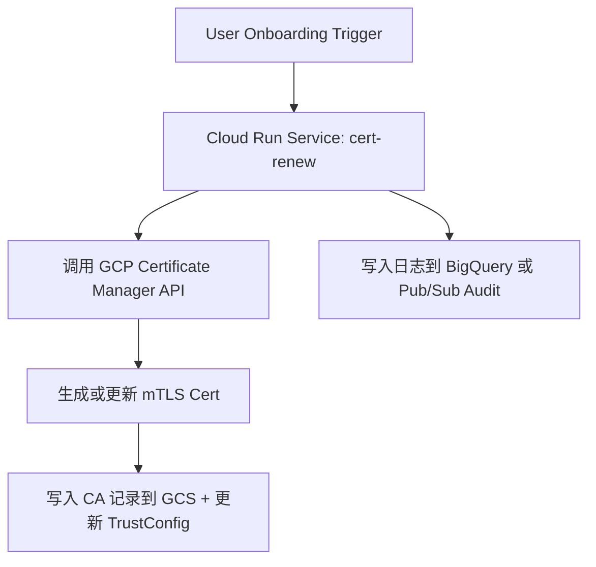
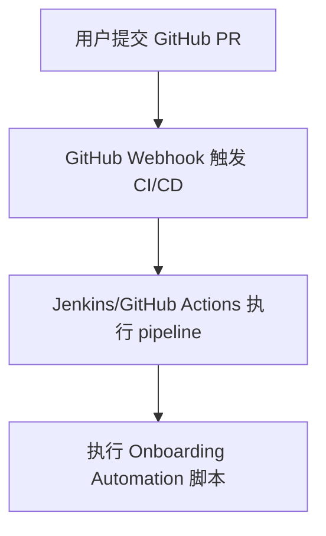
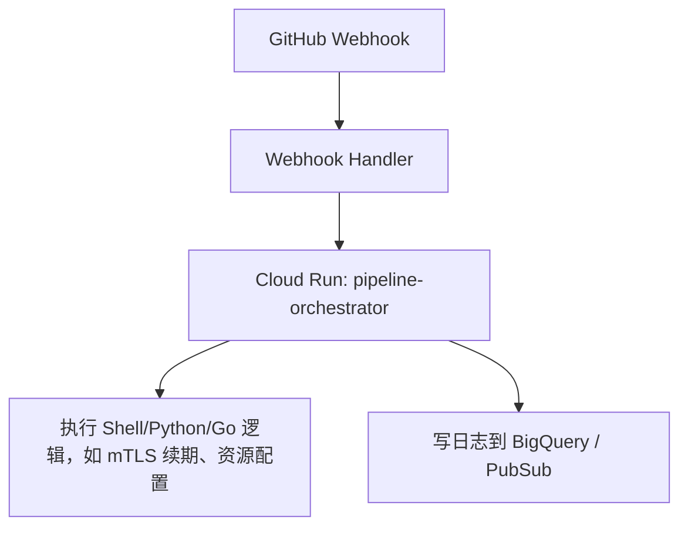

以 **Cloud Run + mTLS cert renew** 作为一个 **用户 Onboarding 自动化** 流程的例子，结合 GCP 平台架构和最佳实践（如最小权限、Serverless、VPC 访问控制等），设计这个自动化实现方案。

---

## **✅ 目标：Onboarding 场景自动化**

### **🎯 Use Case：用户 Onboarding 阶段触发 mTLS 证书自动续期（renew）**

---

## **🔧 架构设计总览**



---

## **📁 组件说明**

| **组件**                                   | **描述**                                                                |
| ------------------------------------------ | ----------------------------------------------------------------------- |
| Cloud Run Service                          | 负责执行 mTLS cert 续期逻辑的服务                                       |
| Onboard-sa@project.iam.gserviceaccount.com | Cloud Run 的执行服务账号，需具备更新 Cert、TrustConfig、访问 GCS 的权限 |
| GCS                                        | 存储 CA、Cert 指纹、YAML 结构等结构化记录                               |
| Certificate Manager                        | GCP 官方管理 TLS/mTLS 证书的服务                                        |
| TrustConfig                                | 管理受信任的 CA 列表，支持多个 Root/Intermediate CA                     |
| Audit Logging / BigQuery                   | 用于记录触发、更新过程的操作和结果                                      |

---

## **🧱 实现流程详解**

### **步骤 1：定义 Cloud Run 服务逻辑（以 cert renew 为例）**

```bash
gcloud run deploy mtls-cert-renew \
  --image=gcr.io/myproject/cert-renew:latest \
  --region=asia-east1 \
  --service-account=onboard-sa@project.iam.gserviceaccount.com \
  --vpc-connector=vpc-onboard-connector \
  --vpc-egress=all-traffic \
  --ingress=internal \
  --no-allow-unauthenticated
```

> ✳️ 可选加上 --set-env-vars=CA_BUCKET=ca-store,mykey=xxx 用于参数化。

---

### **步骤 2：实现服务核心逻辑（伪代码）**

```
def handler(request):
    # 1. 获取用户 ID 或 tenant 信息
    tenant_id = request.json.get("tenant_id")

    # 2. 拉取 tenant 对应的 CA 结构
    ca_struct = gcs_read_json(f"gs://ca-store/{tenant_id}/ca-config.json")

    # 3. 检查当前证书是否过期或临近更新
    if is_expired(ca_struct["cert"]["expiration"]):
        # 4. 调用 Certificate Manager 更新
        cert_name = f"mtls-cert-{tenant_id}"
        update_certificate(cert_name)

        # 5. 同步更新 TrustConfig
        update_trust_config(tenant_id)

        # 6. 更新 GCS 中的 cert fingerprint 记录
        write_cert_metadata(tenant_id)

        return {"status": "renewed"}
    else:
        return {"status": "still_valid"}
```

---

### **步骤 3：定义权限（IAM）**

| **Resource**        | **Role**                                   | **说明**                     |
| ------------------- | ------------------------------------------ | ---------------------------- |
| Certificate Manager | certificatemanager.admin（最小化可自定义） | 用于创建、更新证书           |
| GCS bucket          | storage.objectAdmin                        | 读写 CA JSON/YAML 信息       |
| TrustConfig         | certificatemanager.trustConfigEditor       | 更新受信任 CA                |
| Cloud Run           | roles/run.invoker                          | 若通过触发器调用需添加此权限 |

---

### **步骤 4：触发方式**

- 用户完成 Onboarding 后，由前端或 API 服务触发 HTTP 调用 Cloud Run（推荐 Internal ingress）
- 或者：使用 Pub/Sub Trigger → Cloud Run Jobs 异步处理批量 Renew

---

### **步骤 5：GCS 示例结构**

```
# gs://ca-store/tenant-123/ca-config.json
{
  "cert": {
    "fingerprint": "SHA256:ABC...",
    "expiration": "2025-09-01T00:00:00Z"
  },
  "trust_config": "trust-tenant-123",
  "ca_bundle": "intermediate+root.pem"
}
```

---

## **📌 安全和审计建议**

- Cloud Run ingress 仅允许 VPC 内访问，或使用 Cloud Armor 控制来源
- 所有更新操作写入 BigQuery（或者 Stackdriver Logging）
- Service Account 权限最小化：可绑定自定义 IAM Role 限定操作范围

---

## **✅ 后续可扩展场景（其他 Onboarding Automation）**

| **场景**                        | **描述**                                         |
| ------------------------------- | ------------------------------------------------ |
| 创建 GCS 结构目录               | 为每个 tenant 创建 ca-store/<tenant_id>/ 结构    |
| 自动创建 Service Account 并授权 | 每个 tenant 的调用账号自动生成                   |
| 生成 client cert 并邮件发送     | 客户端证书可通过 Cloud Functions + Mail 服务发出 |
| 注册域名、DNS TXT 校验          | 自动添加/验证 DNS 所属权（用于 cert 申请）       |

---

如你需要，我可以继续帮你补充：

- 完整的 Python 示例代码或 Dockerfile
- Terraform/IaC 实现
- GCS cert fingerprint 与 TrustConfig 自动增量更新逻辑脚本

# Migrate

非常好，这是一个非常典型的自动化流程迁移场景：**将 GitHub webhook + CI/CD pipeline 的执行逻辑迁移至 Cloud Run 环境中运行**，从而实现 **更强的 Serverless 能力、资源隔离、权限控制、日志审计等优势**。

---

## **✅ 目标**

将原本由 GitHub Webhook 触发的 CI/CD Pipeline（如 Onboarding 流程、mTLS 更新、API 注册等）**迁移至 Cloud Run** 执行。

---

## **🔧 场景说明（迁移前 vs 迁移后）**

### **🔁 当前逻辑（迁移前）：**



---

### **✅ 新目标逻辑（迁移后）：**



---

## **🧱 Design 架构组件**

| **组件**                  | **描述**                                              |
| ------------------------- | ----------------------------------------------------- |
| GitHub Webhook            | 向一个 HTTP 端点 POST 事件（如 PR merge）             |
| Cloud Run Webhook Handler | 接收 GitHub webhook 并校验签名，提取必要参数          |
| Cloud Run Job / Service   | 执行核心 pipeline 脚本（如 mTLS 更新、GCS、API 注册） |
| Artifact/Script           | 所有流程逻辑容器化，如 entrypoint.sh, main.py         |
| GCS                       | 保存 YAML/CA/状态等结构化配置                         |
| BigQuery 或 Logging       | 记录执行日志、结果、错误供后续排查                    |

---

## **🧩 步骤详解**

### **步骤 1：接收 GitHub Webhook 的 Cloud Run 服务**

```bash
gcloud run deploy github-webhook-handler \
  --image=gcr.io/myproject/github-webhook-handler \
  --region=asia-east1 \
  --service-account=onboard-sa@project.iam.gserviceaccount.com \
  --allow-unauthenticated \
  --ingress=all
```

**建议配置 GitHub Webhook 的 Secret**，通过 X-Hub-Signature-256 校验请求是否来自 GitHub。

---

### **步骤 2：解析 Webhook 并根据参数触发 Cloud Run Job**

示例 webhook payload：

```json
{
  "repository": {
    "full_name": "your-org/api-config"
  },
  "ref": "refs/heads/main",
  "commits": [...],
  "head_commit": {
    "modified": ["onboarding/tenant-123/mtls.yaml"]
  }
}
```

你可以在 webhook handler 中提取 tenant ID 并触发如下逻辑：

```
def handler(request):
    payload = request.json
    tenant_id = extract_tenant_from_modified(payload)

    # 启动 Cloud Run Job
    subprocess.run([
        "gcloud", "run", "jobs", "execute", "pipeline-runner",
        "--region=asia-east1",
        "--args", f"--tenant={tenant_id}"
    ])
```

---

### **步骤 3：Cloud Run Job 的主要职责**

```bash
gcloud run jobs deploy pipeline-runner \
  --image=gcr.io/myproject/pipeline-runner \
  --region=asia-east1 \
  --service-account=onboard-sa@project.iam.gserviceaccount.com \
  --vpc-connector=onboard-vpc-connector \
  --vpc-egress=all-traffic \
  --max-retries=1
```

容器内容（Dockerfile 示例）：

```
FROM python:3.10-slim

COPY main.py .
ENTRYPOINT ["python", "main.py"]
```

main.py 示例：

```Python
import sys

def run_pipeline(tenant_id):
    # 加载 GCS 上的配置
    # 拉取 CA、TrustConfig 状态
    # 更新证书、推送 metadata
    print(f"[INFO] Running onboarding pipeline for tenant {tenant_id}")

if __name__ == "__main__":
    tenant_id = sys.argv[1].replace("--tenant=", "")
    run_pipeline(tenant_id)
```

---

## **🔐 安全设计**

| **项目**      | **建议**                                                      |
| ------------- | ------------------------------------------------------------- |
| Webhook 验证  | 通过 X-Hub-Signature-256 + HMAC 校验                          |
| Cloud Run IAM | 仅使用 onboard-sa@...，最小权限执行                           |
| 网络访问      | 限制 Webhook ingress / 控制 Job 的 VPC Connector 和 Cloud NAT |
| 权限控制      | Job 中仅开放指定目录的读写（GCS Bucket ACL）                  |

---

## **☑️ 你需要做的迁移工作**

| **步骤** | **内容**                                                    |
| -------- | ----------------------------------------------------------- |
| ✅ 1     | 将原 pipeline 脚本容器化（Dockerize）                       |
| ✅ 2     | 构建 Cloud Run Job 容器并上传到 Artifact Registry           |
| ✅ 3     | 部署 Cloud Run Webhook Handler 服务                         |
| ✅ 4     | GitHub 上配置 Webhook 指向 Cloud Run URL                    |
| ✅ 5     | 可选：为每个 tenant 设置一个 GCS 结构目录用于配置和状态记录 |
| ✅ 6     | 日志输出到 BigQuery 或 Pub/Sub 供后续分析                   |

---

## **📌 扩展场景支持**

| **场景**                | **实现方式**                                  |
| ----------------------- | --------------------------------------------- |
| 多步骤 Pipeline         | Cloud Run Job 中串行执行脚本                  |
| 并行处理多个 tenant     | 支持多个 Job 并发执行                         |
| 整合 Firestore/BigQuery | pipeline 可直接读写 GCP 数据库                |
| 支持 approval 阶段      | 在 Job 中调用 Slack/Gmail 审批 API 后继续执行 |

---

是否需要我进一步帮你：

- 提供 Webhook 校验代码模板（Python/Go）
- 提供 pipeline-runner 的完整例子
- 编写 Terraform 脚本自动部署 Cloud Run 服务 + Job？

只需告诉我场景和语言偏好即可。
