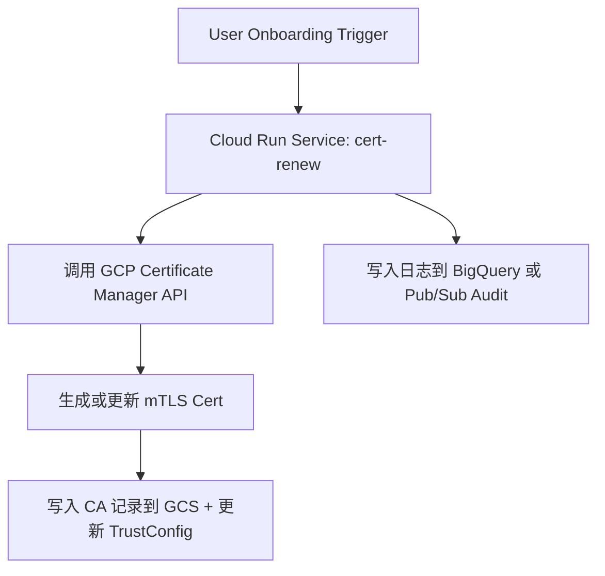

以 **Cloud Run + mTLS cert renew** 作为一个 **用户 Onboarding 自动化** 流程的例子，结合GCP平台架构和最佳实践（如最小权限、Serverless、VPC 访问控制等），设计这个自动化实现方案。

---

## **✅ 目标：Onboarding 场景自动化**

### **🎯 Use Case：用户 Onboarding 阶段触发 mTLS 证书自动续期（renew）**

---

## **🔧 架构设计总览**



---

## **📁 组件说明**

| **组件**                                   | **描述**                                                                |
| ------------------------------------------ | ----------------------------------------------------------------------- |
| Cloud Run Service                          | 负责执行 mTLS cert 续期逻辑的服务                                       |
| Onboard-sa@project.iam.gserviceaccount.com | Cloud Run 的执行服务账号，需具备更新 Cert、TrustConfig、访问 GCS 的权限 |
| GCS                                        | 存储 CA、Cert 指纹、YAML 结构等结构化记录                               |
| Certificate Manager                        | GCP 官方管理 TLS/mTLS 证书的服务                                        |
| TrustConfig                                | 管理受信任的 CA 列表，支持多个 Root/Intermediate CA                     |
| Audit Logging / BigQuery                   | 用于记录触发、更新过程的操作和结果                                      |

---

## **🧱 实现流程详解**

### **步骤 1：定义 Cloud Run 服务逻辑（以 cert renew 为例）**

```bash
gcloud run deploy mtls-cert-renew \
  --image=gcr.io/myproject/cert-renew:latest \
  --region=asia-east1 \
  --service-account=onboard-sa@project.iam.gserviceaccount.com \
  --vpc-connector=vpc-onboard-connector \
  --vpc-egress=all-traffic \
  --ingress=internal \
  --no-allow-unauthenticated
```

> ✳️ 可选加上 --set-env-vars=CA_BUCKET=ca-store,mykey=xxx 用于参数化。

---

### **步骤 2：实现服务核心逻辑（伪代码）**

```
def handler(request):
    # 1. 获取用户 ID 或 tenant 信息
    tenant_id = request.json.get("tenant_id")

    # 2. 拉取 tenant 对应的 CA 结构
    ca_struct = gcs_read_json(f"gs://ca-store/{tenant_id}/ca-config.json")

    # 3. 检查当前证书是否过期或临近更新
    if is_expired(ca_struct["cert"]["expiration"]):
        # 4. 调用 Certificate Manager 更新
        cert_name = f"mtls-cert-{tenant_id}"
        update_certificate(cert_name)

        # 5. 同步更新 TrustConfig
        update_trust_config(tenant_id)

        # 6. 更新 GCS 中的 cert fingerprint 记录
        write_cert_metadata(tenant_id)

        return {"status": "renewed"}
    else:
        return {"status": "still_valid"}
```

---

### **步骤 3：定义权限（IAM）**

| **Resource**        | **Role**                                   | **说明**                     |
| ------------------- | ------------------------------------------ | ---------------------------- |
| Certificate Manager | certificatemanager.admin（最小化可自定义） | 用于创建、更新证书           |
| GCS bucket          | storage.objectAdmin                        | 读写 CA JSON/YAML 信息       |
| TrustConfig         | certificatemanager.trustConfigEditor       | 更新受信任 CA                |
| Cloud Run           | roles/run.invoker                          | 若通过触发器调用需添加此权限 |

---

### **步骤 4：触发方式**

- 用户完成 Onboarding 后，由前端或 API 服务触发 HTTP 调用 Cloud Run（推荐 Internal ingress）
- 或者：使用 Pub/Sub Trigger → Cloud Run Jobs 异步处理批量 Renew

---

### **步骤 5：GCS 示例结构**

```
# gs://ca-store/tenant-123/ca-config.json
{
  "cert": {
    "fingerprint": "SHA256:ABC...",
    "expiration": "2025-09-01T00:00:00Z"
  },
  "trust_config": "trust-tenant-123",
  "ca_bundle": "intermediate+root.pem"
}
```

---

## **📌 安全和审计建议**

- Cloud Run ingress 仅允许 VPC 内访问，或使用 Cloud Armor 控制来源
- 所有更新操作写入 BigQuery（或者 Stackdriver Logging）
- Service Account 权限最小化：可绑定自定义 IAM Role 限定操作范围

---

## **✅ 后续可扩展场景（其他 Onboarding Automation）**

| **场景**                        | **描述**                                         |
| ------------------------------- | ------------------------------------------------ |
| 创建 GCS 结构目录               | 为每个 tenant 创建 ca-store/<tenant_id>/ 结构    |
| 自动创建 Service Account 并授权 | 每个 tenant 的调用账号自动生成                   |
| 生成 client cert 并邮件发送     | 客户端证书可通过 Cloud Functions + Mail 服务发出 |
| 注册域名、DNS TXT 校验          | 自动添加/验证 DNS 所属权（用于 cert 申请）       |

---

如你需要，我可以继续帮你补充：

- 完整的 Python 示例代码或 Dockerfile
- Terraform/IaC 实现
- GCS cert fingerprint 与 TrustConfig 自动增量更新逻辑脚本
