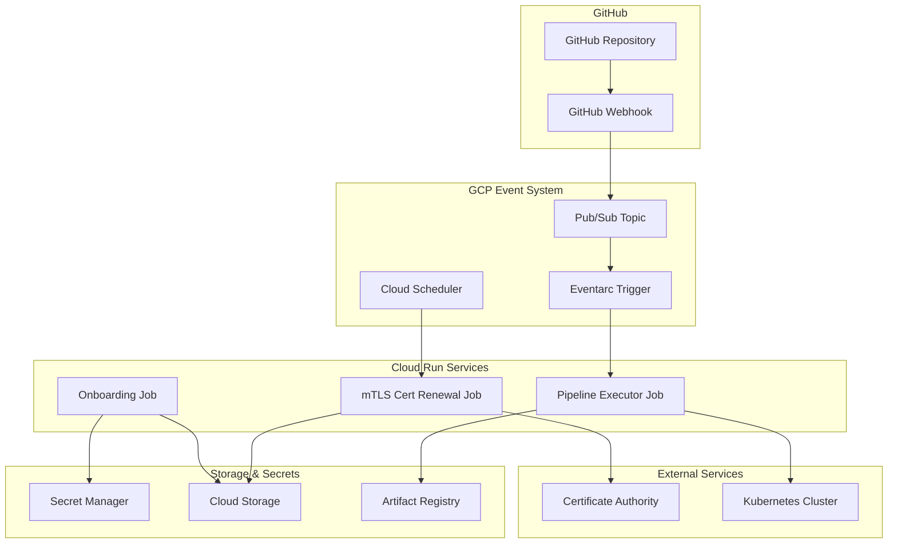

# Cloud Run Onboarding 自动化流程设计


我已经为你创建了一个完整的 Cloud Run Onboarding 自动化流程设计文档。这个设计包含了以下关键要素：

🎯 核心设计亮点
1. 事件驱动架构
GitHub Webhook → Pub/Sub → Eventarc → Cloud Run Jobs
支持多种触发方式：GitHub 事件、定时任务、手动触发
2. 专用 Service Account
Onboard-sa@project.iam.gserviceaccount.com 配置了最小权限
支持 Secret Manager、Cloud Storage、Kubernetes 访问
3. 多场景支持
mTLS 证书续期：定时检查和自动续期
GitHub Pipeline：代码变更自动触发 Onboarding 流程
可扩展性：易于添加新的 Onboarding 场景
🚀 迁移路径
文档提供了完整的 5 个阶段迁移计划：

基础设施准备 - Service Account、VPC、Secrets
容器镜像构建 - 标准化的 Docker 镜像
Cloud Run Jobs 部署 - 具体的部署命令
测试和验证 - 完整的测试策略
监控和日志 - 生产环境监控
💡 技术实现
Python 应用示例：包含证书续期和 GitHub Pipeline 的完整代码
容器化设计：标准化的 Dockerfile 和入口点脚本
安全最佳实践：Secret Manager 集成、VPC 隔离
监控和故障排除：完整的运维指南
这个设计充分利用了 Cloud Run 的优势，实现了高度自动化、安全可靠的 Onboarding 流程。你可以根据具体需求调整配置参数和实现细节。

需要我详细解释任何特定部分或者帮你实现某个具体组件吗？


## 概述

本文档描述如何将现有的 Onboarding pipeline 迁移到 Cloud Run，实现基于事件驱动的自动化流程，包括 mTLS 证书续期、GitHub 触发的自动化操作等场景。

## 架构设计

### 整体架构图



## 核心组件设计

### 1. Service Account 配置

#### Onboard-sa@project.iam.gserviceaccount.com 权限设计

```bash
# 基础权限
gcloud projects add-iam-policy-binding PROJECT_ID \
    --member="serviceAccount:Onboard-sa@project.iam.gserviceaccount.com" \
    --role="roles/run.invoker"

# Secret Manager 访问权限
gcloud projects add-iam-policy-binding PROJECT_ID \
    --member="serviceAccount:Onboard-sa@project.iam.gserviceaccount.com" \
    --role="roles/secretmanager.secretAccessor"

# Cloud Storage 权限
gcloud projects add-iam-policy-binding PROJECT_ID \
    --member="serviceAccount:Onboard-sa@project.iam.gserviceaccount.com" \
    --role="roles/storage.objectAdmin"

# Kubernetes 集群访问权限
gcloud projects add-iam-policy-binding PROJECT_ID \
    --member="serviceAccount:Onboard-sa@project.iam.gserviceaccount.com" \
    --role="roles/container.developer"
```

### 2. Cloud Run Jobs 设计

#### 2.1 mTLS 证书续期 Job

```bash
# 部署 mTLS 证书续期 Job
gcloud run jobs deploy mtls-cert-renewal \
    --image=europe-west2-docker.pkg.dev/project/containers/cert-renewal:latest \
    --region=europe-west2 \
    --vpc-connector=vpc-conn-europe \
    --vpc-egress=all-traffic \
    --max-retries=3 \
    --set-env-vars=CERT_TYPE=mtls,RENEWAL_DAYS=30 \
    --set-secrets=CERT_CA_KEY=ca-private-key:latest,CERT_CONFIG=cert-config:latest \
    --task-timeout=15m \
    --cpu=1 \
    --memory=1Gi \
    --service-account=Onboard-sa@project.iam.gserviceaccount.com
```

#### 2.2 GitHub Pipeline Executor Job

```bash
# 部署 Pipeline 执行 Job
gcloud run jobs deploy github-pipeline-executor \
    --image=europe-west2-docker.pkg.dev/project/containers/pipeline-executor:latest \
    --region=europe-west2 \
    --vpc-connector=vpc-conn-europe \
    --vpc-egress=all-traffic \
    --max-retries=2 \
    --set-env-vars=PIPELINE_TYPE=onboarding,EXECUTION_MODE=github-trigger \
    --set-secrets=GITHUB_TOKEN=github-access-token:latest,KUBE_CONFIG=k8s-config:latest \
    --task-timeout=20m \
    --cpu=2 \
    --memory=2Gi \
    --service-account=Onboard-sa@project.iam.gserviceaccount.com
```

### 3. 事件驱动系统

#### 3.1 Pub/Sub Topic 配置

```bash
# 创建 Onboarding 相关的 Topic
gcloud pubsub topics create onboarding-events
gcloud pubsub topics create cert-renewal-events
gcloud pubsub topics create github-webhook-events

# 创建订阅
gcloud pubsub subscriptions create onboarding-sub \
    --topic=onboarding-events \
    --ack-deadline=600

gcloud pubsub subscriptions create cert-renewal-sub \
    --topic=cert-renewal-events \
    --ack-deadline=900
```

#### 3.2 Eventarc 触发器配置

```bash
# GitHub Webhook 触发器
gcloud eventarc triggers create github-onboarding-trigger \
    --destination-run-job=github-pipeline-executor \
    --destination-run-region=europe-west2 \
    --event-filters="type=google.cloud.pubsub.topic.v1.messagePublished" \
    --event-filters="resource=projects/PROJECT_ID/topics/github-webhook-events" \
    --service-account=Onboard-sa@project.iam.gserviceaccount.com

# 证书续期触发器
gcloud eventarc triggers create cert-renewal-trigger \
    --destination-run-job=mtls-cert-renewal \
    --destination-run-region=europe-west2 \
    --event-filters="type=google.cloud.pubsub.topic.v1.messagePublished" \
    --event-filters="resource=projects/PROJECT_ID/topics/cert-renewal-events" \
    --service-account=Onboard-sa@project.iam.gserviceaccount.com
```

#### 3.3 Cloud Scheduler 定时任务

```bash
# 定期证书检查和续期
gcloud scheduler jobs create pubsub cert-renewal-scheduler \
    --schedule="0 2 * * *" \
    --topic=cert-renewal-events \
    --message-body='{"action":"check_and_renew","cert_type":"mtls","threshold_days":30}' \
    --location=europe-west2
```

## 实现细节

### 1. 容器镜像设计

#### 1.1 基础镜像 Dockerfile

```dockerfile
FROM ubuntu:22.04

# 安装基础工具
RUN apt-get update && apt-get install -y \
    curl \
    jq \
    openssl \
    kubectl \
    git \
    python3 \
    python3-pip \
    && rm -rf /var/lib/apt/lists/*

# 安装 gcloud SDK
RUN curl https://sdk.cloud.google.com | bash
ENV PATH=$PATH:/root/google-cloud-sdk/bin

# 安装 Python 依赖
COPY requirements.txt .
RUN pip3 install -r requirements.txt

# 复制应用代码
COPY src/ /app/
WORKDIR /app

# 设置入口点
COPY entrypoint.sh /usr/local/bin/
RUN chmod +x /usr/local/bin/entrypoint.sh
ENTRYPOINT ["entrypoint.sh"]
```

#### 1.2 入口点脚本

```bash
#!/bin/bash
# entrypoint.sh

set -e

echo "Container entrypoint script started at $(date)"

# 获取 Service Account Token
echo "Authenticating with Service Account..."
gcloud auth activate-service-account --key-file=/dev/null 2>/dev/null || true

# 解析环境变量和参数
ACTION=${1:-"default"}
PIPELINE_TYPE=${PIPELINE_TYPE:-"onboarding"}

echo "Executing action: $ACTION with pipeline type: $PIPELINE_TYPE"

case $ACTION in
    "cert-renewal")
        exec python3 /app/cert_renewal.py
        ;;
    "github-pipeline")
        exec python3 /app/github_pipeline.py
        ;;
    "onboarding")
        exec python3 /app/onboarding.py
        ;;
    *)
        echo "Unknown action: $ACTION"
        exit 1
        ;;
esac
```

### 2. Python 应用示例

#### 2.1 mTLS 证书续期脚本

```python
# cert_renewal.py
import os
import json
import subprocess
from datetime import datetime, timedelta
from google.cloud import secretmanager
from google.cloud import storage

class CertRenewal:
    def __init__(self):
        self.project_id = os.environ.get('GOOGLE_CLOUD_PROJECT')
        self.cert_type = os.environ.get('CERT_TYPE', 'mtls')
        self.renewal_days = int(os.environ.get('RENEWAL_DAYS', '30'))
        
    def check_cert_expiry(self, cert_path):
        """检查证书过期时间"""
        cmd = f"openssl x509 -in {cert_path} -noout -enddate"
        result = subprocess.run(cmd, shell=True, capture_output=True, text=True)
        
        if result.returncode != 0:
            raise Exception(f"Failed to check certificate: {result.stderr}")
            
        # 解析过期时间
        end_date_str = result.stdout.strip().replace('notAfter=', '')
        end_date = datetime.strptime(end_date_str, '%b %d %H:%M:%S %Y %Z')
        
        days_until_expiry = (end_date - datetime.now()).days
        return days_until_expiry
    
    def renew_certificate(self):
        """续期证书"""
        print(f"Starting certificate renewal for type: {self.cert_type}")
        
        # 从 Secret Manager 获取 CA 私钥
        client = secretmanager.SecretManagerServiceClient()
        ca_key_name = f"projects/{self.project_id}/secrets/ca-private-key/versions/latest"
        ca_key_response = client.access_secret_version(request={"name": ca_key_name})
        ca_private_key = ca_key_response.payload.data.decode("UTF-8")
        
        # 生成新的证书
        # 这里实现具体的证书生成逻辑
        new_cert = self.generate_new_cert(ca_private_key)
        
        # 上传到 Cloud Storage
        self.upload_cert_to_storage(new_cert)
        
        # 更新 Kubernetes Secret
        self.update_k8s_secret(new_cert)
        
        print("Certificate renewal completed successfully")
    
    def generate_new_cert(self, ca_private_key):
        """生成新证书的具体实现"""
        # 实现证书生成逻辑
        pass
    
    def upload_cert_to_storage(self, cert_data):
        """上传证书到 Cloud Storage"""
        client = storage.Client()
        bucket = client.bucket('onboarding-certs')
        blob = bucket.blob(f'{self.cert_type}-cert-{datetime.now().strftime("%Y%m%d")}.pem')
        blob.upload_from_string(cert_data)
    
    def update_k8s_secret(self, cert_data):
        """更新 Kubernetes Secret"""
        # 使用 kubectl 或 Kubernetes Python 客户端更新 Secret
        pass

if __name__ == "__main__":
    renewal = CertRenewal()
    renewal.renew_certificate()
```

#### 2.2 GitHub Pipeline 执行器

```python
# github_pipeline.py
import os
import json
import subprocess
from google.cloud import secretmanager
from google.cloud import pubsub_v1

class GitHubPipelineExecutor:
    def __init__(self):
        self.project_id = os.environ.get('GOOGLE_CLOUD_PROJECT')
        self.pipeline_type = os.environ.get('PIPELINE_TYPE', 'onboarding')
        
    def process_github_event(self, event_data):
        """处理 GitHub Webhook 事件"""
        print(f"Processing GitHub event: {event_data}")
        
        # 解析事件数据
        if 'repository' in event_data:
            repo_name = event_data['repository']['name']
            branch = event_data.get('ref', '').replace('refs/heads/', '')
            
            print(f"Repository: {repo_name}, Branch: {branch}")
            
            # 根据不同的事件类型执行不同的操作
            if event_data.get('action') == 'opened' or 'commits' in event_data:
                self.execute_onboarding_pipeline(repo_name, branch, event_data)
    
    def execute_onboarding_pipeline(self, repo_name, branch, event_data):
        """执行 Onboarding Pipeline"""
        print(f"Executing onboarding pipeline for {repo_name}:{branch}")
        
        # 1. 克隆仓库
        self.clone_repository(repo_name, branch)
        
        # 2. 执行 Onboarding 检查
        self.run_onboarding_checks()
        
        # 3. 部署配置
        self.deploy_configurations()
        
        # 4. 更新状态
        self.update_pipeline_status("completed")
    
    def clone_repository(self, repo_name, branch):
        """克隆 GitHub 仓库"""
        # 从 Secret Manager 获取 GitHub Token
        client = secretmanager.SecretManagerServiceClient()
        token_name = f"projects/{self.project_id}/secrets/github-access-token/versions/latest"
        token_response = client.access_secret_version(request={"name": token_name})
        github_token = token_response.payload.data.decode("UTF-8")
        
        # 克隆仓库
        clone_url = f"https://{github_token}@github.com/organization/{repo_name}.git"
        cmd = f"git clone -b {branch} {clone_url} /tmp/{repo_name}"
        subprocess.run(cmd, shell=True, check=True)
    
    def run_onboarding_checks(self):
        """运行 Onboarding 检查"""
        # 实现具体的检查逻辑
        print("Running onboarding checks...")
        
        # 检查配置文件
        # 验证权限设置
        # 检查安全策略
        pass
    
    def deploy_configurations(self):
        """部署配置到 Kubernetes"""
        # 获取 Kubernetes 配置
        client = secretmanager.SecretManagerServiceClient()
        kubeconfig_name = f"projects/{self.project_id}/secrets/k8s-config/versions/latest"
        kubeconfig_response = client.access_secret_version(request={"name": kubeconfig_name})
        kubeconfig = kubeconfig_response.payload.data.decode("UTF-8")
        
        # 写入 kubeconfig
        with open('/tmp/kubeconfig', 'w') as f:
            f.write(kubeconfig)
        
        os.environ['KUBECONFIG'] = '/tmp/kubeconfig'
        
        # 应用 Kubernetes 配置
        subprocess.run("kubectl apply -f /tmp/repo/k8s/", shell=True, check=True)
    
    def update_pipeline_status(self, status):
        """更新 Pipeline 状态"""
        # 发布状态到 Pub/Sub 或更新数据库
        publisher = pubsub_v1.PublisherClient()
        topic_path = publisher.topic_path(self.project_id, 'pipeline-status')
        
        message_data = {
            'pipeline_type': self.pipeline_type,
            'status': status,
            'timestamp': datetime.now().isoformat()
        }
        
        publisher.publish(topic_path, json.dumps(message_data).encode('utf-8'))

if __name__ == "__main__":
    executor = GitHubPipelineExecutor()
    
    # 从环境变量或参数获取事件数据
    event_data = json.loads(os.environ.get('GITHUB_EVENT_DATA', '{}'))
    executor.process_github_event(event_data)
```

## 迁移步骤

### Phase 1: 基础设施准备

1. **创建 Service Account 和权限配置**
```bash
# 创建 Service Account
gcloud iam service-accounts create onboard-sa \
    --display-name="Onboarding Service Account"

# 配置权限（参考上面的权限配置）
```

2. **设置 VPC 网络连接**
```bash
# 创建 VPC Connector（如果不存在）
gcloud compute networks vpc-access connectors create vpc-conn-europe \
    --region=europe-west2 \
    --subnet=onboarding-subnet \
    --subnet-project=project-id
```

3. **配置 Secret Manager**
```bash
# 存储敏感信息
gcloud secrets create github-access-token --data-file=github-token.txt
gcloud secrets create ca-private-key --data-file=ca-key.pem
gcloud secrets create k8s-config --data-file=kubeconfig.yaml
```

### Phase 2: 容器镜像构建

1. **构建基础镜像**
```bash
# 构建并推送镜像
docker build -t europe-west2-docker.pkg.dev/project/containers/onboarding-base:latest .
docker push europe-west2-docker.pkg.dev/project/containers/onboarding-base:latest
```

2. **构建专用镜像**
```bash
# 证书续期镜像
docker build -f Dockerfile.cert-renewal -t europe-west2-docker.pkg.dev/project/containers/cert-renewal:latest .

# Pipeline 执行器镜像
docker build -f Dockerfile.pipeline -t europe-west2-docker.pkg.dev/project/containers/pipeline-executor:latest .
```

### Phase 3: Cloud Run Jobs 部署

1. **部署 Jobs**（参考上面的部署命令）

2. **配置事件触发器**（参考上面的 Eventarc 配置）

### Phase 4: 测试和验证

1. **单元测试**
```bash
# 手动触发 Job 测试
gcloud run jobs execute mtls-cert-renewal \
    --region=europe-west2 \
    --wait
```

2. **集成测试**
```bash
# 发送测试事件到 Pub/Sub
gcloud pubsub topics publish github-webhook-events \
    --message='{"action":"test","repository":{"name":"test-repo"}}'
```

### Phase 5: 监控和日志

1. **设置监控**
```bash
# 创建 Cloud Monitoring 告警
gcloud alpha monitoring policies create --policy-from-file=monitoring-policy.yaml
```

2. **日志聚合**
```bash
# 查看 Cloud Run Jobs 日志
gcloud logging read "resource.type=cloud_run_job" --limit=50
```

## 最佳实践

### 1. 安全性
- 使用最小权限原则配置 Service Account
- 敏感信息存储在 Secret Manager 中
- 启用 VPC 网络隔离
- 定期轮换访问令牌和证书

### 2. 可靠性
- 配置适当的重试策略
- 实现幂等性操作
- 设置超时和资源限制
- 监控和告警配置

### 3. 可维护性
- 使用标准化的容器镜像
- 实现结构化日志记录
- 版本控制和回滚策略
- 文档和运维手册

### 4. 成本优化
- 合理配置 CPU 和内存资源
- 使用 Cloud Run 的按需计费特性
- 优化容器启动时间
- 监控资源使用情况

## 故障排除

### 常见问题

1. **Service Account 权限不足**
```bash
# 检查权限
gcloud projects get-iam-policy PROJECT_ID \
    --flatten="bindings[].members" \
    --format="table(bindings.role)" \
    --filter="bindings.members:Onboard-sa@project.iam.gserviceaccount.com"
```

2. **网络连接问题**
```bash
# 检查 VPC Connector 状态
gcloud compute networks vpc-access connectors describe vpc-conn-europe \
    --region=europe-west2
```

3. **Secret Manager 访问失败**
```bash
# 测试 Secret 访问
gcloud secrets versions access latest --secret="github-access-token"
```

## 总结

通过将 Onboarding pipeline 迁移到 Cloud Run，我们实现了：

- **事件驱动的自动化**：GitHub 变更自动触发相应的处理流程
- **弹性和可扩展性**：Cloud Run 的自动扩缩容能力
- **安全性**：基于 Service Account 的身份验证和最小权限原则
- **成本效益**：按需付费，无需维护常驻服务器
- **可维护性**：标准化的容器化部署和监控

这个设计提供了一个完整的、生产就绪的 Onboarding 自动化解决方案，可以根据具体需求进行调整和扩展。