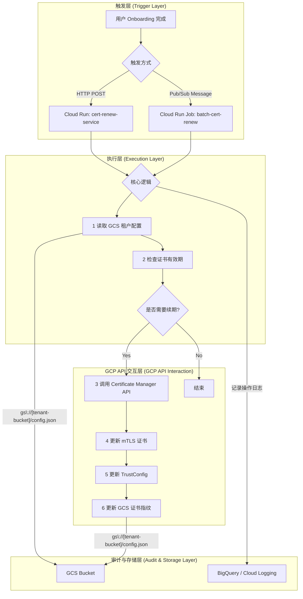

# **Cloud Run Onboarding 自动化设计方案：mTLS 证书续期**

## **1. 方案概述**

### **1.1. 背景与目标**

在多租户（Multi-Tenant）或大规模用户场景下，手动为每个新用户（Tenant）配置和管理 mTLS 证书是低效且易错的。本方案旨在设计一个全自动化的用户 Onboarding 流程，以 **mTLS 证书自动续期（Renew）** 为核心用例，实现 Serverless、安全、可审计的自动化工作流。

### **1.2. 设计原则**

本方案严格遵循以下 GCP 最佳实践：

- **最小权限原则 (Least Privilege)**: Service Account 仅授予完成任务所必需的最小权限集合，通过自定义 IAM Role 实现。
- **Serverless 优先**: 核心逻辑部署在 Cloud Run 上，无需管理底层服务器，实现按需扩缩容和成本优化。
- **VPC 服务控制 (VPC Service Controls)**: 通过 VPC Connector 和内部 Ingress，将服务流量限制在可信的 VPC 网络内，增强安全性。
- **基础设施即代码 (IaC)**: 所有组件（Cloud Run, IAM, GCS）均可通过 Terraform 或 gcloud CLI 进行版本化管理和部署。
- **可观测性 (Observability)**: 所有关键操作均记录到 Cloud Logging 和 BigQuery，便于审计、监控和排错。

---

## **2. 架构设计**

### **2.1. 核心组件**

| 组件 | 技术实现 | 核心职责 |
| :--- | :--- | :--- |
| **执行引擎** | Cloud Run Service | 运行证书续期的核心业务逻辑。 |
| **服务身份** | Service Account | 代表 Cloud Run 服务与 GCP API 交互的身份。 |
| **触发器** | HTTP Request / Pub/Sub | 启动自动化流程的入口。 |
| **证书管理** | Certificate Manager | 集中管理和操作 TLS/mTLS 证书。 |
| **信任配置** | TrustConfig | 维护和更新受信任的 CA 证书列表。 |
| **状态存储** | Cloud Storage (GCS) | 持久化存储每个 Tenant 的证书元数据和 CA 配置。 |
| **审计日志** | BigQuery / Cloud Logging | 记录所有自动化操作的日志，用于审计和监控。 |

### **2.2. 自动化流程图**



---

## **3. 实现细节**

### **3.1. Cloud Run 服务部署**

使用 `gcloud` CLI 部署服务，并强制其在 VPC 网络内运行，确保流量安全。

```bash
# 部署 Cloud Run 服务
gcloud run deploy cert-renew-service \
  --image="gcr.io/your-project/cert-renew:latest" \
  --service-account="cert-renew-sa@your-project.iam.gserviceaccount.com" \
  --region="asia-east1" \
  --ingress="internal" \
  --vpc-connector="projects/your-project/locations/asia-east1/connectors/onboarding-vpc-connector" \
  --vpc-egress="all-traffic" \
  --no-allow-unauthenticated \
  --set-env-vars="GCS_BUCKET_NAME=tenant-certs-store"
```

### **3.2. 核心逻辑伪代码**

```python
# main.py - Cloud Run 服务入口
import os
from google.cloud import storage, certificatemanager_v1

def cert_renew_handler(request):
    """
    Cloud Run HTTP Triggered Function.
    """
    request_json = request.get_json(silent=True)
    tenant_id = request_json.get("tenant_id")

    if not tenant_id:
        return "Error: tenant_id is required", 400

    # 1. 从 GCS 读取租户配置
    config = read_gcs_config(tenant_id)

    # 2. 检查证书是否临近过期
    if is_cert_expiring(config["cert_expiration"]):
        
        # 3. 调用 Certificate Manager 更新证书
        new_cert = renew_certificate(tenant_id, config["cert_name"])

        # 4. 更新 TrustConfig
        update_trust_config(tenant_id, config["trust_config_name"], new_cert["ca_bundle"])

        # 5. 更新 GCS 中的证书元数据
        update_gcs_config(tenant_id, new_cert["fingerprint"], new_cert["expiration"])
        
        log_operation(tenant_id, "Certificate renewed successfully.")
        return {"status": "renewed", "tenant_id": tenant_id}
    
    else:
        log_operation(tenant_id, "Certificate is still valid.")
        return {"status": "still_valid", "tenant_id": tenant_id}

# ... 其他辅助函数 (read_gcs_config, is_cert_expiring, etc.)
```

### **3.3. GCS 存储结构**

为每个租户创建一个独立的配置对象，存储其证书相关信息。

```json
// gs://tenant-certs-store/tenant-abc-123.json
{
  "tenant_id": "tenant-abc-123",
  "cert_name": "projects/your-project/locations/global/certificates/mtls-cert-tenant-abc-122",
  "cert_fingerprint": "SHA256:OLD_FINGERPRINT...",
  "cert_expiration": "2025-08-15T10:00:00Z",
  "trust_config_name": "projects/your-project/locations/global/trustConfigs/trust-config-tenant-abc-123",
  "ca_bundle_gcs_path": "gs://tenant-certs-store/ca/tenant-abc-123-ca.pem"
}
```

---

## **4. 安全与权限设计**

### **4.1. 自定义 IAM Role**

为了实现最小权限，我们创建一个自定义 IAM Role，仅包含续期流程所需的权限。

**Role ID**: `certRenewManager`

| Permission | Rationale |
| :--- | :--- |
| `certificatemanager.certificates.get` | 读取证书信息以检查有效期。 |
| `certificatemanager.certificates.update` | 更新（续期）证书。 |
| `certificatemanager.trustConfigs.get` | 读取 TrustConfig 以进行更新。 |
| `certificatemanager.trustConfigs.update` | 更新 TrustConfig 以信任新的 CA。 |
| `storage.objects.get` | 从 GCS 读取租户配置文件。 |
| `storage.objects.create` | 向 GCS 写入更新后的租户配置文件。 |
| `logging.logEntries.create` | 写入操作日志到 Cloud Logging。 |

### **4.2. Service Account 绑定**

将此自定义角色授予 Cloud Run 使用的 Service Account。

```bash
# 1. 创建自定义 Role
gcloud iam roles create certRenewManager --project=your-project \
    --title="Certificate Renew Manager" \
    --description="Minimal permissions for mTLS cert renew process" \
    --permissions="certificatemanager.certificates.get,certificatemanager.certificates.update,certificatemanager.trustConfigs.get,certificatemanager.trustConfigs.update,storage.objects.get,storage.objects.create,logging.logEntries.create"

# 2. 创建 Service Account
gcloud iam service-accounts create cert-renew-sa --display-name="Cert Renew SA"

# 3. 绑定 Role 到 Service Account
gcloud projects add-iam-policy-binding your-project \
    --member="serviceAccount:cert-renew-sa@your-project.iam.gserviceaccount.com" \
    --role="projects/your-project/roles/certRenewManager"
```

---

## **5. 扩展与未来规划**

本方案可作为 Onboarding 自动化的基础框架，未来可扩展至以下场景：

- **自动创建租户 GCS 目录**: 在用户 Onboarding 时，自动创建 `gs://<bucket>/<tenant_id>/` 结构。
- **动态 Service Account 生成**: 为每个租户或特定应用场景动态创建拥有不同权限的 Service Account。
- **客户端证书生成与分发**: 通过 Cloud Functions 生成客户端证书，并使用 SendGrid 或其他邮件服务安全地分发给用户。
- **DNS 记录自动化**: 集成 Cloud DNS API，自动为新租户添加和验证域名所有权（例如，用于 ACME DNS-01 挑战）。
