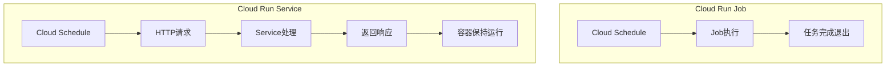
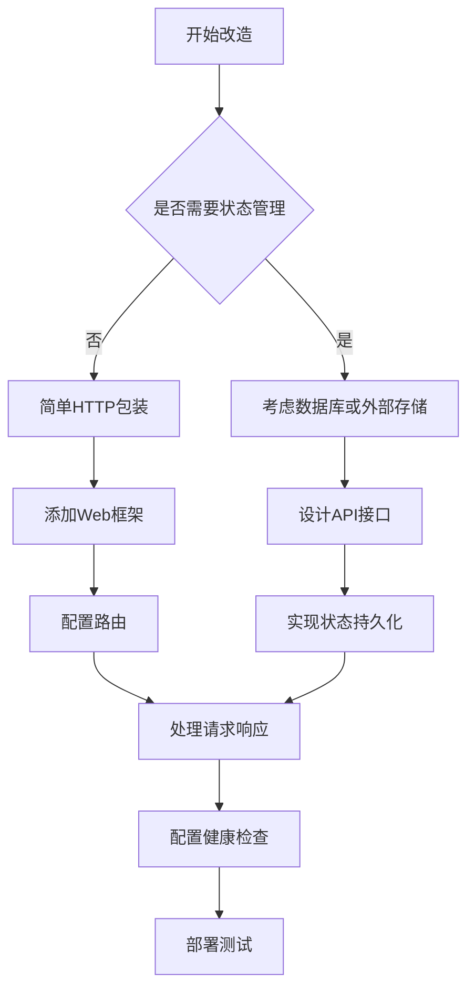
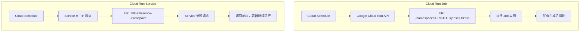
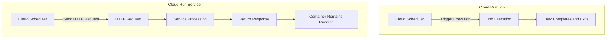

## Cloud Schedule 触发 Cloud Run

Cloud Schedule 确实可以直接触发 Cloud Run Service，而不仅仅是 Cloud Run Job。

### 触发方式对比

| 触发类型 | Cloud Run Job        | Cloud Run Service                    |
| -------- | -------------------- | ------------------------------------ |
| 触发方式 | 直接执行任务         | HTTP 请求触发                        |
| 调用方法 | Cloud Schedule → Job | Cloud Schedule → HTTP 请求 → Service |
| 适用场景 | 批处理任务           | Web 服务、API 端点                   |

## Cloud Run Job vs Service 改造难度

### 架构差异



### 主要改造点

#### 1. 代码结构调整

**Job 模式（原有）:**

```python
# 直接执行逻辑
def main():
    # 执行任务
    process_data()
    print("Job completed")

if __name__ == "__main__":
    main()
```

**Service 模式（需改造）:**

```python
from flask import Flask
import os

app = Flask(__name__)

@app.route('/scheduled-task', methods=['POST'])
def scheduled_task():
    # 原有的任务逻辑
    process_data()
    return "Task completed", 200

@app.route('/health', methods=['GET'])
def health_check():
    return "OK", 200

if __name__ == "__main__":
    port = int(os.environ.get('PORT', 8080))
    app.run(host='0.0.0.0', port=port)
```

#### 2. Dockerfile 调整

**Job Dockerfile:**

```dockerfile
FROM python:3.9-slim
COPY . /app
WORKDIR /app
RUN pip install -r requirements.txt
CMD ["python", "main.py"]
```

**Service Dockerfile:**

```dockerfile
FROM python:3.9-slim
COPY . /app
WORKDIR /app
RUN pip install -r requirements.txt
EXPOSE 8080
CMD ["python", "app.py"]
```

#### 3. 部署配置差异

**Job 部署:**

```bash
gcloud run jobs deploy my-job \
    --image gcr.io/PROJECT_ID/my-app \
    --region asia-east1 \
    --task-timeout 3600 \
    --memory 2Gi \
    --cpu 1
```

**Service 部署:**

```bash
gcloud run deploy my-service \
    --image gcr.io/PROJECT_ID/my-app \
    --region asia-east1 \
    --memory 2Gi \
    --cpu 1 \
    --port 8080 \
    --no-allow-unauthenticated
```

#### 4. Cloud Schedule 配置

**触发 Job:**

```bash
gcloud scheduler jobs create http my-job-scheduler \
    --schedule="0 2 * * *" \
    --uri="https://asia-east1-run.googleapis.com/apis/run.googleapis.com/v1/namespaces/PROJECT_ID/jobs/my-job:run" \
    --http-method=POST \
    --oauth-service-account-email=scheduler@PROJECT_ID.iam.gserviceaccount.com
```

**触发 Service:**

```bash
gcloud scheduler jobs create http my-service-scheduler \
    --schedule="0 2 * * *" \
    --uri="https://my-service-xxx-uc.a.run.app/scheduled-task" \
    --http-method=POST \
    --oauth-service-account-email=scheduler@PROJECT_ID.iam.gserviceaccount.com
```

### 学习难度评估

#### 低难度改造项

- 添加 HTTP 端点
- 调整启动方式
- 修改 Dockerfile

#### 中等难度项

- 理解 Service 生命周期
- 配置健康检查
- 处理并发请求

#### 需要注意的关键点



### 推荐改造步骤

1. **保留原有逻辑** - 将 Job 的核心逻辑封装成函数
2. **添加 Web 框架** - 使用 Flask/FastAPI 包装 HTTP 接口
3. **配置端点** - 创建调度端点和健康检查端点
4. **调整部署** - 修改 gcloud 命令和配置
5. **更新调度器** - 修改 Cloud Schedule 目标 URL

### 总结

从 Cloud Run Job 改造为 Service 的难度是**中等偏低**，主要是架构思维的转换。核心业务逻辑基本不变，主要是添加 HTTP 层和调整部署配置。如果你已经熟悉 Job 的部署，Service 的学习曲线会很平缓。​​​​​​​​​​​​​​​​

## Cloud Run Job 的 URI 机制

是的，每个 Cloud Run Job 都有一个对应的执行 URI，但这个 URI 不是 Job 本身提供的 HTTP 端点，而是 **Google Cloud Run API 的管理端点**。

### Cloud Run Job URI 结构

```bash
https://{REGION}-run.googleapis.com/apis/run.googleapis.com/v1/namespaces/{PROJECT_ID}/jobs/{JOB_NAME}:run
```

#### URI 组成部分

| 组件       | 说明               | 示例                    |
| ---------- | ------------------ | ----------------------- |
| REGION     | Cloud Run 部署区域 | asia-east1, us-central1 |
| PROJECT_ID | GCP 项目 ID        | my-project-123          |
| JOB_NAME   | Job 名称           | data-processor-job      |

### 实际例子

```bash
# Job 信息
JOB_NAME="daily-backup-job"
PROJECT_ID="my-project-123"
REGION="asia-east1"

# 对应的触发 URI
https://asia-east1-run.googleapis.com/apis/run.googleapis.com/v1/namespaces/my-project-123/jobs/daily-backup-job:run
```

### 如何获取 Job 的 URI

#### 方法 1: 通过 gcloud 命令查看

```bash
# 获取 Job 详细信息
gcloud run jobs describe JOB_NAME \
    --region=REGION \
    --format="value(metadata.name,metadata.namespace)"

# 构造 URI
echo "https://REGION-run.googleapis.com/apis/run.googleapis.com/v1/namespaces/PROJECT_ID/jobs/JOB_NAME:run"
```

#### 方法 2: 部署时记录

```bash
gcloud run jobs deploy my-job \
    --image gcr.io/PROJECT_ID/my-app \
    --region asia-east1

# 部署成功后，URI 格式固定为:
# https://asia-east1-run.googleapis.com/apis/run.googleapis.com/v1/namespaces/PROJECT_ID/jobs/my-job:run
```

### Cloud Schedule 触发配置

```bash
gcloud scheduler jobs create http my-job-scheduler \
    --schedule="0 2 * * *" \
    --uri="https://asia-east1-run.googleapis.com/apis/run.googleapis.com/v1/namespaces/my-project/jobs/my-job:run" \
    --http-method=POST \
    --oauth-service-account-email=scheduler@my-project.iam.gserviceaccount.com \
    --headers="Content-Type=application/json" \
    --message-body="{}"
```

### Job vs Service 的 URI 对比



### 权限配置

要让 Cloud Schedule 能够触发 Job，需要适当的 IAM 权限：

```bash
# 为 Cloud Scheduler 服务账号授权
gcloud projects add-iam-policy-binding PROJECT_ID \
    --member="serviceAccount:scheduler@PROJECT_ID.iam.gserviceaccount.com" \
    --role="roles/run.invoker"

# 或者使用更精细的权限
gcloud run jobs add-iam-policy-binding JOB_NAME \
    --region=REGION \
    --member="serviceAccount:scheduler@PROJECT_ID.iam.gserviceaccount.com" \
    --role="roles/run.invoker"
```

### 验证 Job URI

```bash
# 手动测试 Job 触发（需要认证）
curl -X POST \
    -H "Authorization: Bearer $(gcloud auth print-access-token)" \
    -H "Content-Type: application/json" \
    -d '{}' \
    "https://asia-east1-run.googleapis.com/apis/run.googleapis.com/v1/namespaces/PROJECT_ID/jobs/JOB_NAME:run"
```

### 总结

- **每个 Cloud Run Job 都有唯一的 API 触发 URI**
- **URI 格式固定且可预测**
- **这个 URI 是 Google Cloud Run API 端点，不是 Job 容器的 HTTP 端点**
- **通过这个 URI 可以远程触发 Job 执行**
- **需要适当的 IAM 权限才能调用**

这就是为什么 Cloud Schedule 可以直接触发 Cloud Run Job 的原理 - 它实际上是调用 Google Cloud Run 管理 API 来启动 Job 实例。​​​​​​​​​​​​​​​​

# Gemini 

GCP定时任务架构权威指南：Cloud Scheduler与Cloud Run服务及作业的深度解析
第一部分：执行摘要与核心架构模式
1.1 核心问题解答
本报告旨在为已具备Google Cloud Platform (GCP)工程经验的技术人员提供一份详尽的分析，重点阐述使用Cloud Scheduler编排Cloud Run工作负载的两种核心架构。首先，直接回答您提出的几个关键问题：
 * Cloud Scheduler能否触发Cloud Run服务？ 答案是肯定的。Cloud Scheduler完全能够通过标准的HTTP请求直接触发一个Cloud Run服务，这通常是通过调用服务提供的唯一URL来实现的 。
 * Cloud Scheduler能否直接触发Cloud Run作业？ 答案同样是肯定的，并且您的理解完全正确。Cloud Scheduler可以通过调用Cloud Run Admin API的一个特定管理端点来直接执行一个Cloud Run作业。这是一种功能强大但不太为人所知的模式，它绕过了传统的HTTP服务端口 。您提供的gcloud命令示例准确地展示了这一机制。
 * 将Cloud Run作业改造为服务的难度如何？ 难度评估为低到中等。对于已经熟悉Cloud Run作业部署和参数配置的工程师来说，主要的改造工作集中在代码层面，即引入一个轻量级的Web服务器来接收触发信号，以及在部署配置上进行相应调整。核心的业务逻辑代码几乎无需改动。
1.2 两种基础调用模式
在GCP上设计定时任务时，围绕Cloud Scheduler和Cloud Run，存在两种截然不同的架构选择：
 * 模式A：面向服务的架构（The Service-Oriented Approach）
   在这种模式下，Cloud Scheduler扮演一个标准的HTTP客户端角色。它按照预设的时间表，向一个公开（但通过IAM进行安全访问控制）的Cloud Run服务终端节点发送一个GET或POST请求。从概念上讲，该Cloud Run服务始终处于“待命”状态，随时准备响应传入的请求并执行任务 。
 * 模式B：任务执行的架构（The Task-Execution Approach）
   在这种模式下，Cloud Scheduler扮演一个具有特权的后台管理工具。它利用其服务账号的身份，直接向Cloud Run的后端管理API发送指令，命令其“运行”一个特定的Cloud Run作业。该作业的容器本身不监听任何网络端口，也不对外提供服务 。
1.3 关键权衡因素速览
选择哪种模式并非仅凭个人喜好，而是基于一系列技术和架构上的权衡。本报告将深入探讨这些因素，以下为简要概览：
 * 简易性与灵活性：对于简单的“运行到完成”脚本，作业（Job）模式的代码更简单。而服务（Service）模式需要一个Web服务器，但在处理入站请求和利用Web框架方面提供了更大的灵活性。
 * 执行时长：这是一个至关重要的、通常不可协商的差异。服务模式受限于单个请求60分钟的超时上限 。相比之下，作业模式专为长时间运行的任务设计，其超时时间可长达168小时（7天）。
 * 安全态势：这涉及到是选择暴露一个受IAM保护的HTTP端点（服务模式），还是授予调用者执行Admin API的管理权限（作业模式）。
这两种模式的存在并非偶然，它反映了无服务器计算领域的一种基本二元性。服务模式（HTTP触发）与“函数即服务”（FaaS）和“微服务”的理念一脉相承，即万物皆可为API。而作业模式（Admin API触发）则更贴近“批处理”和“基础设施即代码”（IaC）的理念，其中任务被视为待执行的声明式资源。理解这种设计哲学上的差异，有助于我们从根本上把握为何GCP同时提供这两种选项，并为在具体场景中做出最佳选择建立一个清晰的心智模型 。
第二部分：对比分析：Cloud Run服务与作业在定时工作负载中的应用
为了做出明智的架构决策，必须深入理解Cloud Run服务和作业这两种计算原语的本质区别，尤其是在它们被用于执行非用户触发的、预定性的后台任务时。
2.1 计算原语介绍
 * Cloud Run服务 (Cloud Run Service)：其核心设计目标是监听并处理传入的请求。它遵循一种请求-响应模型。当用于定时任务时，来自Cloud Scheduler的触发信号就是这个“请求” 。服务会根据请求负载自动扩缩容，甚至可以缩容至零，从而实现极高的成本效益。
 * Cloud Run作业 (Cloud Run Job)：其设计目标是运行一个容器直到任务完成，然后正常退出。它不监听网络端口，也不处理HTTP请求，是一个纯粹的面向任务的模型 。作业非常适合执行数据处理、报告生成、数据库迁移等一次性或周期性的批处理任务 。
2.2 权威对比表格
下表提供了一个全面的、一目了然的对比，旨在成为您在进行技术选型时的核心参考依据。
表格：Cloud Run服务与作业在定时任务中的应用对比分析
| 特性 | Cloud Run 服务 (Service) | Cloud Run 作业 (Job) |
|---|---|---|
| 调用方法 | 向服务URL发送HTTP请求 (GET/POST) | 向Cloud Run Admin API发送POST请求 |
| 目标端点 | 公开可访问的服务URL (例如, https://...run.app) | 内部Admin API URI (例如, https://.../jobs/my-job:run) |
| 代码要求 | 必须运行一个Web服务器 (如Flask, Express) 以监听$PORT端口 | 禁止运行Web服务器。代码执行完毕后即退出。 |
| 最大执行时间 | 60分钟 (请求超时限制)  | 168小时 (7天) (任务超时限制)  |
| 扩缩容模型 | 并发 (Concurrency)：单个实例可同时处理多个请求。根据请求负载或CPU使用率增加实例数进行扩容 。 | 并行 (Parallelism)：执行固定数量的并行任务 (--tasks)。每个任务都是一个独立的实例 。 |
| 核心概念 | 一个持续运行、可伸缩的Web服务。 | 一个按需执行的容器化脚本。 |
| 安全模型 | 通过IAM (run.invoker) 和OIDC保护HTTP端点。 | 授予调用者调用Cloud Run Admin API的权限 (run.jobs.run)。 |
| 理想用例 | 中短时长的任务 (<60分钟)，可受益于现有API/Web框架的任务，或希望通过简单HTTP触发的场景。 | 长时间运行的任务 (>60分钟)，高度并行的数据处理（数组作业），或希望避免创建面向公众的端点的场景。 |
2.3 深度剖析：超时与生命周期的影响
在众多选型因素中，执行超时往往是最为刚性的约束条件。一个潜在执行时间可能超过60分钟的任务，必须被实现为Cloud Run作业。官方文档明确指出，Cloud Run服务的单个请求处理时间上限为60分钟 。任何试图在服务中运行超过此限制的同步任务都将以超时失败告终。相反，Cloud Run作业正是为长时间运行的批处理工作而设计的，其任务超时上限高达7天（168小时）。
这一根本性的差异将“超时”从一个简单的配置参数提升到了首要的架构决策层面。在设计一个新的定时任务时，首先要问的问题就是：“这个任务在任何可预见的未来，其执行时间是否有可能超过60分钟？”如果答案是“是”或者“不确定”，那么选择服务模式将构建一个存在固有缺陷、注定会失败的系统。因此，执行时长是划分这两种模式适用场景的第一道分水岭。
2.4 深度剖析：扩缩容（并发 vs. 并行）
 * 服务并发性 (Service Concurrency)：Cloud Run服务的一个关键特性是其处理并发请求的能力。单个服务实例可以同时处理多个（默认最多80个，可配置高达1000个）传入的HTTP请求 。对于一个频繁执行的定时任务（例如，每分钟一次），如果前一个任务尚未完成，后一个任务的请求可以由同一个实例处理。这种并发处理能力在某些场景下可以有效利用资源，降低运行实例数量，从而节约成本。
 * 作业并行性 (Job Parallelism)：Cloud Run作业则采用完全不同的并行模型。通过--tasks和--parallelism参数，可以指示GCP启动多个独立的容器实例，并行地执行同一个作业 。这种模式非常适合于可分解的批处理工作负载。例如，要处理Cloud Storage中的10,000个文件，可以创建一个包含10个任务的作业，每个任务负责处理1,000个文件 。为了协调工作，Cloud Run会自动为每个任务容器注入CLOUD_RUN_TASK_INDEX（当前任务索引）和CLOUD_RUN_TASK_COUNT（总任务数）这两个环境变量，使得代码能够轻松地确定自己需要处理的数据子集 。
将错误的扩缩容模型应用于不匹配的工作负载会导致架构效率低下。例如，试图用服务模式来处理大规模并行数据处理任务，将不得不在服务代码内部实现复杂的工作队列拉取和状态管理逻辑，这无异于重新发明了作业模式已经原生提供的功能。反之，为一个简单的、单线程的脚本启动一个包含10个任务的作业，则是对资源的极大浪费。因此，工作负载的内在特性（是整体性的还是可分割的）直接决定了哪种扩缩容模型更为合适，进而指明了应该选择服务还是作业。
第三部分：模式一：使用Cloud Scheduler触发Cloud Run服务
此模式将定时任务视为一次简单的API调用，对于熟悉Web框架和API开发的工程师而言，通常感觉更直观。
3.1 实施步骤详解
步骤一：编写服务代码
服务的核心是需要运行一个Web服务器，监听由PORT环境变量指定的端口。
 * Python (Flask) 示例 ：
   import os
from flask import Flask, request

app = Flask(__name__)

@app.route("/run-task", methods=)
def run_task_handler():
    # 为增强安全性，可检查请求头中是否包含Cloud Scheduler特有的标识
    # 例如：if request.headers.get('User-Agent')!= 'Google-Cloud-Scheduler':
    #           return "Forbidden", 403

    print("Scheduled task triggered!")
    # --- 在此执行核心业务逻辑 ---
    #...
    # --------------------------
    return "Task executed successfully.", 200

if __name__ == "__main__":
    port = int(os.environ.get("PORT", 8080))
    app.run(debug=True, host="0.0.0.0", port=port)

 * Node.js (Express) 示例 ：
   import express from 'express';

const app = express();

app.post('/run-task', (req, res) => {
    console.log('Scheduled task triggered!');
    // --- 在此执行核心业务逻辑 ---
    //...
    // --------------------------
    res.status(200).send('Task executed successfully.');
});

const port = parseInt(process.env.PORT) |


| 8080;
app.listen(port, () => {
console.log(Listening on port ${port});
});
```
步骤二：容器化服务
创建一个Dockerfile来打包应用。
 * Dockerfile 示例 (Python/Gunicorn) ：
   # 使用官方Python基础镜像
FROM python:3.9-slim

# 设置工作目录
WORKDIR /app

# 复制依赖文件并安装
COPY requirements.txt requirements.txt
RUN pip install --no-cache-dir -r requirements.txt

# 复制应用代码
COPY..

# 暴露服务端口
EXPOSE 8080

# 启动Gunicorn Web服务器
CMD ["gunicorn", "--bind", "0.0.0.0:8080", "main:app"]

   注：requirements.txt应包含Flask和gunicorn。
步骤三：部署服务
使用gcloud run deploy命令部署容器。关键在于确保服务是私有的，只有授权的调用者才能访问。
gcloud run deploy my-scheduled-service \
  --image gcr.io/PROJECT_ID/my-scheduled-service \
  --platform managed \
  --region asia-east1 \
  --no-allow-unauthenticated \
  --timeout=3600 # 设置请求超时，单位为秒，最大3600

--no-allow-unauthenticated参数至关重要，它将服务设置为私有，拒绝所有未经身份验证的公共访问 。
步骤四：创建调用者服务账号
遵循最小权限原则，为Cloud Scheduler创建一个专用的服务账号。
# 1. 创建服务账号
gcloud iam service-accounts create scheduler-invoker \
  --display-name="Cloud Scheduler Invoker"

# 2. 授予该服务账号调用Cloud Run服务的权限
gcloud run services add-iam-policy-binding my-scheduled-service \
  --member="serviceAccount:scheduler-invoker@PROJECT_ID.iam.gserviceaccount.com" \
  --role="roles/run.invoker" \
  --region=asia-east1

这里授予的roles/run.invoker角色，精确地赋予了该账号调用Cloud Run服务的权限，不多也不少 。
步骤五：配置Cloud Scheduler作业
最后，创建Cloud Scheduler作业来触发服务。
gcloud scheduler jobs create http my-service-scheduler \
  --schedule="0 5 * * *" \
  --location=asia-east1 \
  --uri="https://my-scheduled-service-xxxx-an.a.run.app/run-task" \
  --http-method=POST \
  --oidc-service-account-email="scheduler-invoker@PROJECT_ID.iam.gserviceaccount.com" \
  --oidc-token-audience="https://my-scheduled-service-xxxx-an.a.run.app"

配置要点 ：
 * Target type: HTTP。
 * URI: 部署的Cloud Run服务的完整URL。
 * Auth header: 必须选择Add OIDC token。
 * Service account: 上一步创建的服务账号的电子邮件地址。
 * Audience: 这是一个关键且易错的字段。对于Cloud Run，Audience必须设置为被调用的服务的完整URL。
3.2 安全深度剖析：OIDC与调用者角色
要真正理解服务模式的安全性，不能只看表面配置，而应深入其背后的身份验证机制。这个机制由三个核心组件协同工作，共同构成了一个安全、可验证的调用链，可以概括为回答了三个问题：
 * 谁在调用？(Who is calling?)
   这个问题的答案由Cloud Scheduler配置中的--oidc-service-account-email参数指定。它明确了发起这次HTTP请求的身份是scheduler-invoker这个服务账号。
 * 它能做什么？(What can it do?)
   这个问题的答案由IAM角色绑定定义。通过将roles/run.invoker角色授予scheduler-invoker服务账号，我们精确地规定了这个身份被允许执行的操作是“调用Cloud Run服务”。它没有权限删除服务、修改配置或执行其他任何管理操作。
 * 它能在哪里做？(Where can it do it?)
   这个问题的答案由--oidc-token-audience参数提供。这是一个至关重要的安全控制。当Cloud Scheduler代表服务账号请求一个OIDC令牌时，它会指定这个令牌的“受众”就是目标服务的URL。Cloud Run服务在收到请求时，会验证令牌不仅有效，而且其aud（audience）声明与自身的URL完全匹配。这意味着，一个为service-a签发的令牌，即使被截获，也无法用于调用service-b，因为service-b会拒绝这个受众不匹配的令牌。
这三个组件——服务账号（身份）、IAM角色（权限）和OIDC受众（目标）——环环相扣，确保了每一次从Cloud Scheduler到Cloud Run服务的调用都是经过严格授权和验证的，从而构建了一个健壮的安全模型 。
第四部分：模式二：使用Cloud Scheduler执行Cloud Run作业
此模式将Cloud Run作业视为一个后台任务资源，通过管理API进行调用。这对于纯粹的后台处理脚本而言，是一种更原生、更简洁的集成方式。
4.1 解构Admin API调用
您在问题中提供的gcloud命令已经准确地揭示了这种模式的本质。需要强调的是，这并非一次对您应用程序的常规Web请求，而是对GCP控制平面（Control Plane）的一次管理命令。Cloud Scheduler以编程方式通知Cloud Run的后端：“立即执行名为my-job的这个作业资源” 。
 * URI: 调用的目标URI格式非常特殊：https://<region>-run.googleapis.com/apis/run.googleapis.com/v1/namespaces/<PROJECT_ID>/jobs/<JOB-NAME>:run 。这个URI是Cloud Run Admin API的一部分，并非您容器的地址。其中，:run后缀是关键，它代表了要执行的“动词”或操作。
 * HTTP方法: 调用此API端点必须使用POST方法 。
 * 身份验证: 这里同样使用OAuth进行身份验证。但与服务模式不同，它请求的不是用于调用某个特定服务的OIDC令牌，而是一个用于访问Google Cloud API的通用OAuth 2.0访问令牌。
4.2 实施步骤详解
步骤一：部署Cloud Run作业
使用gcloud run jobs deploy或create命令部署作业。此时应关注作业特有的参数。
gcloud run jobs deploy my-batch-job \
  --source. \
  --region asia-east1 \
  --tasks=10 \
  --max-retries=3 \
  --task-timeout=7200 # 设置任务超时，单位秒，这里是2小时

这里使用了--tasks, --max-retries, --task-timeout等作业独有的参数来定义其执行行为 。
步骤二：配置服务账号与IAM
这是与服务模式的一个关键区别点。Cloud Scheduler所使用的服务账号需要有权限调用Cloud Run Admin API来执行作业。官方文档建议使用Cloud Run Developer (roles/run.developer) 或 Cloud Run Admin (roles/run.admin) 角色 。然而，为了遵循最小权限原则，最佳实践是创建一个自定义角色，仅包含run.jobs.run这一个权限。
# 1. 创建服务账号
gcloud iam service-accounts create scheduler-job-runner \
  --display-name="Cloud Scheduler Job Runner"

# 2. (最佳实践) 创建一个仅包含运行作业权限的自定义角色
gcloud iam roles create jobRunner --project=PROJECT_ID \
  --title="Job Runner" --description="Can run Cloud Run jobs" \
  --permissions="run.jobs.run"

# 3. 将自定义角色授予服务账号
gcloud projects add-iam-policy-binding PROJECT_ID \
  --member="serviceAccount:scheduler-job-runner@PROJECT_ID.iam.gserviceaccount.com" \
  --role="projects/PROJECT_ID/roles/jobRunner"

步骤三：配置Cloud Scheduler作业
创建Cloud Scheduler作业，其目标指向Cloud Run Admin API。这正是您在提问中给出的命令的实践。
gcloud scheduler jobs create http my-job-scheduler \
  --schedule="0 2 * * *" \
  --location=asia-east1 \
  --uri="https://asia-east1-run.googleapis.com/apis/run.googleapis.com/v1/namespaces/PROJECT_ID/jobs/my-batch-job:run" \
  --http-method=POST \
  --oauth-service-account-email="scheduler-job-runner@PROJECT_ID.iam.gserviceaccount.com"

配置要点 ：
 * Target type: HTTP。
 * URI: 格式严格的Cloud Run Admin API作业执行端点。
 * Auth header: 应选择Add OAuth token（注意，不是OIDC token）。
 * Service account: 上一步创建的服务账号的电子邮件地址。
 * Scope: 此字段可以留空，Cloud Scheduler将使用默认的https://www.googleapis.com/auth/cloud-platform范围，该范围足以调用Cloud Run Admin API 。
尽管Admin API的URI看起来比服务URL更长、更复杂，但从整体系统设计的角度看，作业模式实际上可能更简单。开发者无需编写和维护Web服务器，无需处理HTTP路由，也无需关心请求/响应的生命周期。容器内的代码就是一个纯粹的脚本。这意味着更少的样板代码和更少的依赖（不需要引入Flask/Express等框架）。系统的复杂性从应用代码转移到了基础设施的声明中（即gcloud scheduler命令）。对于推行基础设施即代码（IaC）的团队来说，这通常是更受欢迎的模型，因为整个任务的定义（包括触发器和执行体）都是声明式的，可以完整地纳入版本控制。而服务模式则将逻辑分散在基础设施（Scheduler配置）和应用程序（HTTP端点实现）两处。
第五部分：迁移路径：将Cloud Run作业转换为服务
如果您已经有了一个Cloud Run作业，并因某种原因（例如，需要一个HTTP端点进行即时触发，或者任务时长确定在60分钟内）决定将其转换为服务，这个过程是相当直接的。
5.1 难度评估
对于大多数脚本而言，转换的难度较低。核心的业务逻辑代码保持不变。工作量主要集中在为现有逻辑添加一个Web服务器“外壳”。
5.2 步骤一：代码重构 - 包装脚本
 * 转换前 (作业代码)：一个简单的、从上到下执行的Python脚本。
   # job_script.py
def perform_heavy_calculation():
    #... 所有业务逻辑都在这里...
    print("Calculation complete.")

if __name__ == "__main__":
    perform_heavy_calculation()

 * 转换后 (服务代码)：将相同的逻辑封装在一个Flask路由处理函数中。
   # service_main.py
from flask import Flask
import os

app = Flask(__name__)

def perform_heavy_calculation():
    #... 所有业务逻辑都在这里...
    return "Calculation complete."

@app.route("/run-task", methods=)
def handle_request():
    result = perform_heavy_calculation()
    return (result, 200)

if __name__ == "__main__":
    port = int(os.environ.get("PORT", 8080))
    app.run(host="0.0.0.0", port=port)

   这个重构过程对于Node.js也是类似的，即将一个独立的脚本逻辑移入一个Express的路由处理器中 。
5.3 步骤二：容器化调整 (Dockerfile)
Dockerfile需要进行相应修改以支持Web服务。
 * 转换前 (作业Dockerfile)：
   CMD ["python", "job_script.py"]
 * 转换后 (服务Dockerfile)：
   * 添加EXPOSE $PORT指令。
   * 在requirements.txt中添加Web服务器依赖（如gunicorn）。
   * 修改启动命令以运行Web服务器：CMD 。
5.4 步骤三：部署命令转换 (gcloud)
从部署作业切换到部署服务，gcloud命令及其参数也发生了显著变化。下表为您提供了一个清晰的映射，帮助您将已有的作业部署知识应用于服务部署。
表格：gcloud命令参数对比：run jobs deploy vs. run deploy

| 特性/概念 | gcloud run jobs deploy JOB_NAME... (用于作业) | gcloud run deploy SERVICE_NAME... (用于服务) | 差异解释 |
|---|---|---|---|
| 执行控制 | --tasks, --max-retries | 无 | 作业有明确的任务数量和重试控制。服务则依赖于调用方（如Scheduler）的重试逻辑。 |
| 超时 | --task-timeout | --timeout | 作业的超时应用于每个独立的任务。服务的超时应用于单个HTTP请求的整个生命周期。 |
| 并行/并发 | --parallelism | --concurrency | 作业通过启动多个实例来并行执行任务。服务通过在单个实例内处理多个请求来实现并发。 |
| 身份验证 | 无 (由调用者的API访问权限处理) | --allow-unauthenticated 或 --no-allow-unauthenticated | 服务内置了公共与私有入口流量的概念。作业本身没有入口。 |
| 触发源 | gcloud run jobs execute 或 Scheduler (Admin API) | 对服务URL的HTTP请求 | 根本上不同的触发机制。 |

 
第六部分：决策框架：哪种方法适合您？
本部分将从“如何做”转向“为何做”，提供一套战略性指导，帮助您根据具体需求做出最佳的架构选择。
6.1 关键决策标准
 * 任务时长：如前所述，这是首要且最关键的决策门槛。如果任务执行时间可能超过60分钟，那么唯一的选择就是作业（Job）。
 * 代码复杂性与团队技能：您的团队是更愿意管理一个Web技术栈，还是只想编写纯粹的脚本？如果追求代码的极简，避免Web服务器的引入，那么**作业（Job）**更具优势。
 * 安全态势：是否存在严格的安全策略，禁止创建新的、即使受IAM保护的公开Web端点？如果是，那么通过内部Admin API触发的**作业（Job）**模式是更合适的选择。
 * 并行处理需求：您的工作负载是否涉及处理大量独立的数据项（例如，转换数千个文件，或处理数据库中的数万条记录）？**作业（Job）**模式原生的--tasks和并行执行能力正是为此类场景量身定做的。
 * 幂等性考量：对于服务模式，如果一个任务需要5分钟完成，而调度器设置为每1分钟触发一次，那么可能会有多个执行实例同时运行。应用程序代码必须被设计为幂等的，以正确处理这种重叠执行的情况。而作业模式下，每次执行都是一个离散的、独立的单元，其状态更容易推理和管理。
6.2 决策矩阵
为了将上述标准固化为一个可复用的工具，下表提供了一个决策矩阵，您可以在设计任何新的定时任务时使用它。
表格：决策框架：在服务和作业之间做出选择

| 决策标准 | 选择 Cloud Run 服务 (Service) 如果... | 选择 Cloud Run 作业 (Job) 如果... |
|---|---|---|
| 任务时长 | 您的任务永远会在60分钟内完成。 | 您的任务可能超过60分钟，或需要运行数小时/数天。 |
| 代码简易性 | 您已在使用Web框架，或认为HTTP端点易于理解和管理。 | 您希望运行一个纯粹的脚本，无需Web服务器的额外开销。 |
| 安全态势 | 您可以接受暴露一个新的、受IAM严格保护的HTTP端点。 | 您倾向于通过内部管理API调用来触发任务，不产生任何新的网络入口。 |
| 并行处理 | 您的任务是单一的、不可分割的，或者您愿意自行构建基于队列的并行逻辑。 | 您需要并行处理大量数据项，并能充分利用原生的--tasks特性。 |
| 现有生态系统 | 该任务是大型微服务架构的一部分，其中所有交互都通过API进行。 | 该任务是一个独立的运维脚本，或是批处理数据管道中的一个环节。 |

第七部分：结论与最终建议
7.1 调查结果总结
本报告的深入分析揭示了以下核心结论：
 * Cloud Scheduler为触发Cloud Run提供了两种成熟、可行且截然不同的模式：基于HTTP的服务调用和基于Admin API的作业执行。
 * 在服务和作业之间的选择并非简单的偏好问题，而是由硬性技术约束（如执行超时）和架构理念（API驱动 vs. 任务驱动）共同决定的。
 * 通过Admin API执行作业的模式，尽管其URI看起来较为复杂，但对于纯后台任务而言，它是一种功能强大、安全且通常在代码层面更简单的替代方案。
 * 从作业迁移到服务是一个低工作量的过程，主要任务是为现有逻辑添加一个Web服务器包装器。
7.2 最终建议
基于以上分析，我们为设计新的定时任务提供以下战略性建议：
 * 默认选择Cloud Run作业（Jobs）。对于绝大多数新的后台定时任务，应将作业模式作为首选。其模型更简单（无需Web服务器）、功能更强大（更长的超时时间、原生并行处理），并且可以说更安全（无公开端点）。从这个起点开始，除非有明确的理由不这样做。
 * 仅在以下特定情况下选择Cloud Run服务（Services）：
   * 您需要对一个已有的服务上的某个端点进行周期性调用。
   * 任务逻辑极其简单，并且能很自然地融入一个轻量级Web框架中。
   * 您可以100%保证，在项目的整个生命周期内，任务的执行时间都将远低于60分钟的上限。
通过遵循这种“作业优先”（Job-first）的方法，您将在Google Cloud Platform上构建出更健壮、更可扩展且更易于维护的定时任务架构。


# Grok

Your provided information about using Cloud Scheduler to trigger Cloud Run (both Jobs and Services) is mostly accurate and well-structured. However, there are a few areas where clarifications, corrections, or additional details could enhance the explanation. Below, I’ll validate the provided content, point out any inaccuracies, suggest improvements, and provide additional examples or clarifications where necessary, adhering to your requested Markdown and Mermaid formatting.

Validation and Corrections

General Statement: Cloud Scheduler Triggering Cloud Run

Statement: “Cloud Scheduler 确实可以直接触发 Cloud Run Service，而不仅仅是 Cloud Run Job.”

Validation: This is correct. Cloud Scheduler can trigger both Cloud Run Jobs and Cloud Run Services via HTTP requests. For Jobs, it invokes the job execution directly through the Cloud Run API, while for Services, it sends an HTTP request to a specific endpoint.

Clarification:

- For Cloud Run Jobs, Cloud Scheduler typically uses a POST request to the Cloud Run API endpoint (/apis/run.googleapis.com/v1/namespaces/{project}/jobs/{job}:run).
- For Cloud Run Services, Cloud Scheduler sends an HTTP request (typically POST) to a specific route (e.g., /scheduled-task) exposed by the Service.
- Ensure the service account used by Cloud Scheduler has appropriate permissions (e.g., roles/run.invoker for Jobs or Services).

Triggering Method Comparison Table

Provided Table:

|          |                      |                                      |
| -------- | -------------------- | ------------------------------------ |
| 触发类型 | Cloud Run Job        | Cloud Run Service                    |
| 触发方式 | 直接执行任务         | HTTP 请求触发                        |
| 调用方法 | Cloud Schedule → Job | Cloud Schedule → HTTP 请求 → Service |
| 适用场景 | 批处理任务           | Web 服务、API 端点                   |

Validation: The table is accurate and succinctly captures the differences:

- Cloud Run Job: Designed for batch or one-off tasks that execute and terminate.
- Cloud Run Service: Designed for long-running services that handle HTTP requests and remain active.
- The “适用场景” (use case) column correctly identifies Jobs for batch processing and Services for web-based or API-driven workloads.

Suggestion: Add a column for authentication requirements to highlight that Services often require additional configuration for unauthenticated access (e.g., --no-allow-unauthenticated flag).

Improved Table:

|          |                                   |                                                                                |
| -------- | --------------------------------- | ------------------------------------------------------------------------------ |
| 触发类型 | Cloud Run Job                     | Cloud Run Service                                                              |
| 触发方式 | 直接执行任务                      | HTTP 请求触发                                                                  |
| 调用方法 | Cloud Schedule → Job              | Cloud Schedule → HTTP 请求 → Service                                           |
| 适用场景 | 批处理任务                        | Web 服务、API 端点                                                             |
| 认证要求 | Service account with run.jobs.run | Service account with run.invoker or public access with --allow-unauthenticated |

Architecture Differences (Mermaid Diagram)

Provided Diagram:


Validation: The diagram is correct and clearly illustrates the flow:

- Cloud Run Job: Triggered by Cloud Scheduler, executes, and terminates.
- Cloud Run Service: Triggered via HTTP, processes the request, returns a response, and continues running to handle future requests.

Correction: The use of subgraph with square brackets [] is correct in Mermaid syntax, and the diagram is properly formatted. However, for better clarity, consider adding labels to the arrows to describe the action (e.g., “Trigger Execution” or “Send HTTP Request”).

Improved Diagram:



Code Structure Adjustments

Provided Code:

Job Mode:

# 直接执行逻辑

def main():

# 执行任务

process_data()

print("Job completed")

if **name** == "**main**":

main()

Service Mode:

from flask import Flask

import os

app = Flask(**name**)

@app.route('/scheduled-task', methods=['POST'])

def scheduled_task():

# 原有的任务逻辑

process_data()

return "Task completed", 200

@app.route('/health', methods=['GET'])

def health_check():

return "OK", 200

if **name** == "**main**":

port = int(os.environ.get('PORT', 8080))

app.run(host='0.0.0.0', port=port)

Validation: The code examples are correct and demonstrate the key difference:

- Job: Simple script execution with no HTTP layer.
- Service: Wraps the logic in a web framework (Flask) to handle HTTP requests.

Suggestions:

1. Error Handling: The Service code should include error handling to manage failures gracefully, especially for scheduled tasks.
2. Logging: Add logging to both Job and Service to track execution (e.g., using Python’s logging module).
3. Alternative Frameworks: Mention that FastAPI or other lightweight frameworks could be used instead of Flask for better async support.

Improved Service Code Example:

from flask import Flask

import logging

import os

# Configure logging

logging.basicConfig(level=logging.INFO)

logger = logging.getLogger(**name**)

app = Flask(**name**)

@app.route('/scheduled-task', methods=['POST'])

def scheduled_task():

try:

# Original task logic

process_data()

logger.info("Scheduled task completed successfully")

return "Task completed", 200

except Exception as e:

logger.error(f"Task failed: {str(e)}")

return f"Task failed: {str(e)}", 500

@app.route('/health', methods=['GET'])

def health_check():

logger.info("Health check accessed")

return "OK", 200

if **name** == "**main**":

port = int(os.environ.get('PORT', 8080))

app.run(host='0.0.0.0', port=port)

Dockerfile Adjustments

Provided Dockerfiles:

Job Dockerfile:

FROM python:3.9-slim

COPY . /app

WORKDIR /app

RUN pip install -r requirements.txt

CMD ["python", "main.py"]

Service Dockerfile:

FROM python:3.9-slim

COPY . /app

WORKDIR /app

RUN pip install -r requirements.txt

EXPOSE 8080

CMD ["python", "app.py"]

Validation: The Dockerfiles are correct:

- Job: Executes a Python script directly.
- Service: Exposes port 8080 and runs a web server.

Suggestions:

1. Dependencies: Ensure requirements.txt includes Flask for the Service (e.g., flask>=2.0.0).
2. Gunicorn: For production, consider using gunicorn instead of Flask’s development server for better performance.

Improved Service Dockerfile:

```Dockerfile
FROM python:3.9-slim

COPY . /app

WORKDIR /app

RUN pip install -r requirements.txt

RUN pip install gunicorn

EXPOSE 8080

CMD ["gunicorn", "--bind", "0.0.0.0:8080", "app:app"]
```

Deployment Configuration

Provided Commands:

Job Deployment:

```bash
gcloud run jobs deploy my-job \

    --image gcr.io/PROJECT_ID/my-app \

    --region asia-east1 \

    --task-timeout 3600 \

    --memory 2Gi \

    --cpu 1

Service Deployment:

gcloud run deploy my-service \

    --image gcr.io/PROJECT_ID/my-app \

    --region asia-east1 \

    --memory 2Gi \

    --cpu 1 \

    --port 8080 \

    --no-allow-unauthenticated
```

Validation: The commands are correct and reflect the differences:

- Job: Uses gcloud run jobs deploy with task-specific flags like --task-timeout.
- Service: Uses gcloud run deploy with service-specific flags like --port and --no-allow-unauthenticated.

Correction: For the Service, if --no-allow-unauthenticated is used, ensure the Cloud Scheduler service account has the roles/run.invoker role to invoke the Service.

Suggestion: Add a command to grant the service account the necessary permissions:

```bash
gcloud run services add-iam-policy-binding my-service \

    --region=asia-east1 \

    --member=serviceAccount:scheduler@PROJECT_ID.iam.gserviceaccount.com \

    --role=roles/run.invoker

```

Cloud Scheduler Configuration

Provided Commands:

Trigger Job:

gcloud scheduler jobs create http my-job-scheduler \

--schedule="0 2 \* \* \*" \

--uri="https://asia-east1-run.googleapis.com/apis/run.googleapis.com/v1/namespaces/PROJECT_ID/jobs/my-job:run" \

--http-method=POST \

--oauth-service-account-email=scheduler@PROJECT_ID.iam.gserviceaccount.com

Trigger Service:

gcloud scheduler jobs create http my-service-scheduler \

--schedule="0 2 \* \* \*" \

--uri="https://my-service-xxx-uc.a.run.app/scheduled-task" \

--http-method=POST \

--oauth-service-account-email=scheduler@PROJECT_ID.iam.gserviceaccount.com

Validation: The commands are correct:

- Job: Targets the Cloud Run API to trigger job execution.
- Service: Targets a specific endpoint on the Service URL.

Correction: For the Service, you may need to include an --oauth-token-audience flag to match the Service’s URL for proper authentication:

gcloud scheduler jobs create http my-service-scheduler \

--schedule="0 2 \* \* \*" \

--uri="https://my-service-xxx-uc.a.run.app/scheduled-task" \

--http-method=POST \

--oauth-service-account-email=scheduler@PROJECT_ID.iam.gserviceaccount.com \

--oauth-token-audience="https://my-service-xxx-uc.a.run.app"

Learning Difficulty Assessment

Provided Assessment:

- Low Difficulty: Adding HTTP endpoint, adjusting startup, modifying Dockerfile.
- Medium Difficulty: Understanding Service lifecycle, configuring health checks, handling concurrent requests.

Validation: This assessment is accurate. The transition from Job to Service involves straightforward changes (e.g., adding a web framework) but requires understanding HTTP-based architecture and concurrency.

Suggestion: Add scaling behavior as a medium-difficulty item, as Services may scale to multiple instances under load, unlike Jobs.

Key Considerations (Mermaid Flowchart)

Provided Flowchart:

flowchart TD

A[开始改造] --> B{是否需要状态管理}

B -->|是| C[考虑数据库或外部存储]

B -->|否| D[简单 HTTP 包装]

D --> E[添加 Web 框架]

E --> F[配置路由]

F --> G[处理请求响应]

C --> H[设计 API 接口]

H --> I[实现状态持久化]

I --> G

G --> J[配置健康检查]

J --> K[部署测试]

Validation: The flowchart is correct and effectively outlines the decision-making process for transforming a Job into a Service.

Suggestion: Add a step for testing authentication to ensure Cloud Scheduler can invoke the Service securely.

Improved Flowchart:

flowchart TD

A[Start Transformation] --> B{Requires State Management?}

B -->|Yes| C[Consider Database or External Storage]

B -->|No| D[Simple HTTP Wrapper]

D --> E[Add Web Framework]

E --> F[Configure Routes]

F --> G[Handle Request/Response]

C --> H[Design API Interface]

H --> I[Implement State Persistence]

I --> G

G --> J[Configure Health Check]

J --> K[Test Authentication]

K --> L[Deploy and Test]

Recommended Transformation Steps

Provided Steps:

1. Retain original logic
2. Add web framework
3. Configure endpoints
4. Adjust deployment
5. Update scheduler

Validation: The steps are correct and cover the essential tasks for the transformation.

Suggestion: Add a step for testing locally (e.g., running the Service locally with flask run or gunicorn) before deployment to catch issues early.

Improved Steps:

1. Retain Original Logic - Encapsulate Job logic into reusable functions.
2. Add Web Framework - Use Flask, FastAPI, or similar to wrap logic in HTTP endpoints.
3. Configure Endpoints - Create task and health check endpoints.
4. Test Locally - Run the Service locally to verify functionality.
5. Adjust Deployment - Update gcloud commands and Dockerfile.
6. Update Scheduler - Modify Cloud Scheduler to target the Service URL.

Summary

Provided Summary: The transformation difficulty is medium-low, with the main challenge being the shift to HTTP-based architecture. Core logic remains unchanged, and the learning curve is gentle for those familiar with Jobs.

Validation: This is accurate. The transformation is straightforward for developers familiar with Cloud Run Jobs, as it primarily involves adding an HTTP layer and adjusting deployment configurations.

Additional Notes:

- Cost Considerations: Services may incur higher costs than Jobs due to continuous running containers, especially if not scaled to zero.
- Monitoring: Set up Cloud Monitoring to track Service performance and errors.
- Security: Ensure proper IAM roles and authentication for secure invocation.

Final Notes

Your document is well-structured and mostly accurate, with clear examples and diagrams. The corrections and suggestions provided above enhance clarity, address minor gaps (e.g., authentication, error handling), and align with best practices. If you need further details on specific aspects (e.g., FastAPI implementation, advanced scaling configurations), let me know, and I can provide additional examples or flowcharts!
