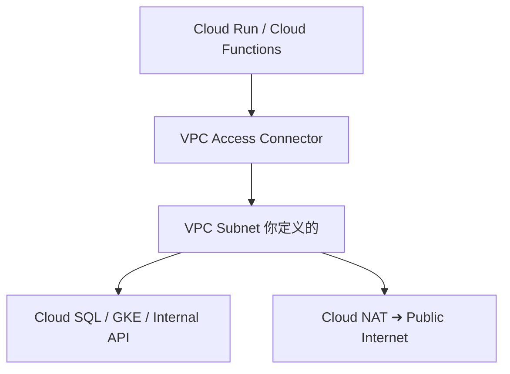
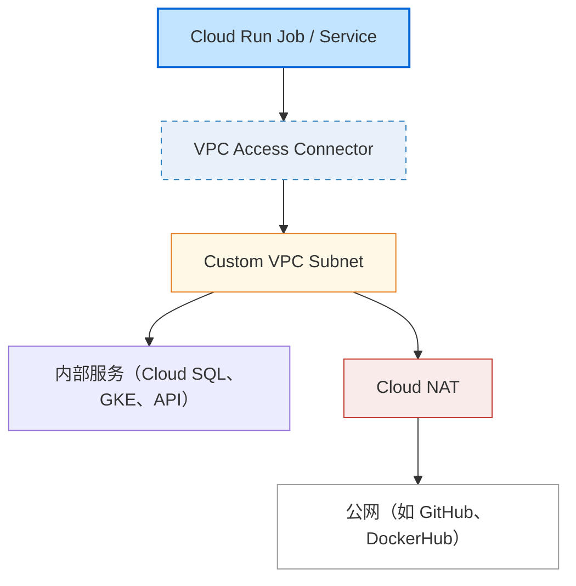

https://cloud.google.com/run/docs/configuring/vpc-connectors?hl=zh-cn#console
VPC Networks

如果创建 VPC Connector 之后 会在 vpc network 哪里看到一个 serverless vpc access 的比如名字为"$CONNECTOR_NAME" 网络 另外会创建一个对应的 Firewall ?

当然，下面是对 **Serverless VPC Access** 的详细解析，适用于你对网络有深入理解，并涉及 GCP 架构设计。

---

# **📌 什么是 Serverless VPC Access？**

**Serverless VPC Access** 是 Google Cloud 提供的一种托管型网络桥接机制，**用于让 Serverless 服务（Cloud Run、Cloud Functions、App Engine）访问自定义 VPC 网络中的资源**。

---

## **✅ 为什么需要 Serverless VPC Access？**

Serverless 资源（如 Cloud Run）默认运行在一个 **Google 托管的、隔离的网络环境**，此环境与你的 VPC 网络是分离的。

若你希望这些 Serverless 服务访问：

- 自建 Redis、Cloud SQL、Memcached 等数据库（运行在 VPC 内）
- 内部 HTTP API、私有 GKE 服务
- 其他仅暴露在内部 IP 中的服务

就**必须通过一个桥梁访问你的 VPC**，这个桥梁就是 **Serverless VPC Access Connector**。

---

## **🧠 本质理解**

你可以把 **VPC Connector** 理解为：

> 一个托管的、弹性扩展的小型 VPC 实例池，专门用来代理 Serverless 流量进入你定义的 VPC。

它通过专用的 **VPC Peering** 建立隧道连接你的 VPC，并转发请求。

---

## **🏗️ 组件架构图**



---

## **⚙️ 工作流程概述**

1.  你部署 Cloud Run 时使用参数：

    ```bash
    --vpc-connector=my-connector
    --vpc-egress=all-traffic
    ```

2.  请求会先发往 Serverless VPC Connector。
3.  Connector 会将流量通过 Peering 路由到你定义的 VPC 子网。
4.  如果你访问的是 VPC 资源，连接成功。

    如果你访问的是公网资源（如 GitHub），需要 Cloud NAT 或自建 Proxy。

---

## **🚦 VPC Egress 策略**

你可以控制 Cloud Run 的出站流量类型：

| **参数** | **含义** | **用途** |
| :--- | :--- | :--- |
| private-ranges-only（默认） | 仅私网 IP 通过 VPC Connector（10.x / 192.168.x） | 仅访问内部服务 |
| all-traffic | 所有出站都走 VPC Connector（包括公网） | 用于受控出口，配合 Cloud NAT 出网 |

---

## **🚧 使用 Serverless VPC Connector 的限制**

| **限制项** | **描述** |
| :--- | :--- |
| 不支持入站 | 不能让 VPC 中的其他资源访问 Cloud Run（不反向） |
| 必须搭配 NAT 才能访问公网 | 出站公网访问不能直接做 SNAT，必须 Cloud NAT 或自建转发主机 |
| 固定网段消耗 | 每个 Connector 会分配一个 /28 地址段（占 16 个地址） |
| 单区域 | Connector 是区域性的，不能跨 region 使用 |

---

## **📦 配置示例**

### **步骤 1：创建 VPC Connector**

```bash
gcloud compute networks vpc-access connectors create vpc-conn-europe \
  --network=my-vpc \
  --region=europe-west2 \
  --subnet=my-subnet \
  --min-instances=2 \
  --max-instances=3 \
  --machine-type=e2-micro
```

> ⚠️ 注意 subnet 中必须预留至少 /28 的 IP 段

---

### **步骤 2：部署 Cloud Run Job / Service 使用 VPC Connector**

```bash
gcloud run jobs deploy my-job \
  --image=gcr.io/my-project/my-image \
  --vpc-connector=vpc-conn-europe \
  --vpc-egress=all-traffic \
  --region=europe-west2 \
  ...
```

---

## **📊 使用场景汇总**

| **典型场景** | **是否适用** |
| :--- | :--- |
| 访问 VPC 内部 Redis、Cloud SQL | ✅ 强烈建议 |
| 访问私有 IP 地址段服务 | ✅ |
| Cloud Run 访问公网但需受控出口 | ✅（配合 Cloud NAT） |
| VPC 中访问 Cloud Run（反向访问） | ❌ 不支持 |
| 自定义下一跳出口（比如走 Proxy 主机） | ❌ 不支持，仅支持 NAT |

---

## **✅ 总结**

| **特性** | **说明** |
| :--- | :--- |
| 类型 | 托管资源 |
| 控制粒度 | 适中，不能自定义下一跳 |
| 推荐用途 | 访问 VPC 内部服务 / 控制出站 |
| 可搭配 | --vpc-egress / Cloud NAT |
| 非适用场景 | 高定制网络、走 proxy、L7 流量识别 |
| 兼容资源 | Cloud Run（Service/Job）、Cloud Functions、App Engine（2nd gen） |

---

是否需要我用一张流程图再把 Serverless VPC Access 的访问路径可视化？或者你想要一份配置模板自动化创建 VPC Connector + NAT 的脚本？



好的，以下是你需要的内容：

---

## **✅ Serverless VPC Access 使用流程：Mermaid 流程图**


---

## **✅ 自动化脚本：创建 Serverless VPC Connector + Cloud NAT**

以下 Bash 脚本可帮助你一步到位创建并绑定组件：

```bash
#!/bin/bash

# === 参数定义 ===
PROJECT_ID="your-project-id"
REGION="europe-west2"
VPC_NAME="my-vpc"
SUBNET_NAME="my-subnet"
CONNECTOR_NAME="vpc-conn-europe"
ROUTER_NAME="nat-router"
NAT_NAME="nat-config"

# 切换项目
gcloud config set project "$PROJECT_ID"

# 1. 创建 VPC（如已存在可跳过）
gcloud compute networks create "$VPC_NAME" \
  --subnet-mode=custom || echo "VPC 已存在"

# 2. 创建子网（如已存在可跳过）
gcloud compute networks subnets create "$SUBNET_NAME" \
  --network="$VPC_NAME" \
  --range=10.10.0.0/24 \
  --region="$REGION" || echo "子网已存在"

# 3. 创建 VPC Connector（Serverless 使用）
gcloud compute networks vpc-access connectors create "$CONNECTOR_NAME" \
  --network="$VPC_NAME" \
  --region="$REGION" \
  --subnet="$SUBNET_NAME" \
  --min-instances=2 \
  --max-instances=3 \
  --machine-type=e2-micro

# 4. 创建 Cloud Router（NAT 用）
gcloud compute routers create "$ROUTER_NAME" \
  --network="$VPC_NAME" \
  --region="$REGION" || echo "Router 已存在"

# 5. 创建 Cloud NAT（允许出公网）
gcloud compute routers nats create "$NAT_NAME" \
  --router="$ROUTER_NAME" \
  --region="$REGION" \
  --auto-allocate-nat-external-ips \
  --nat-all-subnet-ip-ranges \
  --enable-logging
```

---

## **✅ Cloud Run Job 示例部署（使用 VPC Connector）**

```bash
gcloud run jobs deploy my-job \
  --image=gcr.io/$PROJECT_ID/my-image \
  --region=$REGION \
  --vpc-connector=$CONNECTOR_NAME \
  --vpc-egress=all-traffic \
  --memory=512Mi \
  --cpu=1 \
  --task-timeout=5m \
  --max-retries=3 \
  --service-account=my-sa@$PROJECT_ID.iam.gserviceaccount.com
```

---

## **📌 小贴士**

- 每个 VPC Connector 需要 /28 段 IP（建议 Subnet 留足空间）
- **Cloud NAT 必须存在**才能访问公网资源（如 GitHub）
- 如果你配置了 Cloud SQL，请确保启用 Cloud SQL Admin API 并使用 Cloud SQL IAM 代理

---

非常好的观察，你说得完全正确，我来**详细解释 Serverless VPC Access Connector 创建后在 VPC 中的行为细节**，并补充 Terraform 的处理建议。

---

## **✅ 创建 VPC Connector 后会发生的事情**

### **1. 会在 VPC 中生成一个「Serverless VPC Access」**

### **特殊接口网络**

当你执行：

```bash
gcloud compute networks vpc-access connectors create $CONNECTOR_NAME ...
```

GCP 会在你指定的 VPC 中自动创建一个 **Serverless VPC Access 接入点**，表现为：

- 在 **VPC 页面 > 网络接口** 会看到：
  - 一个标注为：serverless-vpc-access-connector
  - 名称类似于 vpc-conn-europe，但类型标记为 serverless
- 使用 gcloud compute networks vpc-access connectors describe 可以获取内部分配 IP 段

这相当于一个 **托管型 ENI（弹性网络接口）**，将 Serverless（如 Cloud Run Job）与 VPC 接上。

---

### **2. GCP 会自动为 Connector 创建一条** 

### **Firewall 规则**

非常精确，你说得**完全正确**。在创建 **Serverless VPC Access Connector**（用于 Cloud Run / Cloud Functions / Workflows）后：

---

## **✅ GCP 自动创建的** 

## **Firewall 规则是 EGRESS**

并不是 Ingress，这是一个**常被误解的点**，以下是完整说明：

---

## **📌 实际创建的是** 

## **Egress**

##  **方向 Firewall 规则：**

| **项目** | **内容** |
| :--- | :--- |
| **名称** | vpc-access-allow-${HASH}-egress（自动命名） |
| **网络** | 你指定的 --network |
| **方向** | EGRESS |
| **目标标签** | 无 |
| **目标 IP 范围** | 通常为 VPC 内部 IP 范围（或 0.0.0.0/0 若 Cloud NAT 被使用） |
| **源标签/范围** | Connector 子网的 CIDR，比如 10.8.0.0/28 |
| **协议/端口** | tcp:443（默认），可选 tcp:all（取决于 Connector 应用范围） |

---

## **✅ 为什么是 EGRESS 而不是 INGRESS？**

这是因为：

- Cloud Run Job、Cloud Functions 属于 **Serverless 资源**，它们并不运行在你的 VPC 内部 VM 中。
- **当你使用 --vpc-connector 后：**
  - **Serverless 资源通过 Connector NAT 接入你的 VPC 并发送流量**（即从 connector 子网发送）
- 所以，**从 VPC Connector 的 IP 段 发起的 Egress 流量，必须被允许**

---

## **🔧 示例：自动创建的 EGRESS Firewall**

如果你在控制台中查看，通常会看到：

```
Name:         vpc-access-allow-xxxxxxxx-egress
Direction:    EGRESS
Source Ranges: 10.8.0.0/28
Allowed:      tcp:443
Target:       all instances (unless filtered by tag)
```

---

## **✅ 如何用 Terraform 接管（推荐写明）**

```terraform
resource "google_compute_firewall" "allow_connector_egress" {
  name    = "allow-${var.connector_name}-egress"
  network = google_compute_network.vpc.name

  direction = "EGRESS"
  priority  = 1000

  destination_ranges = ["0.0.0.0/0"]
  source_ranges      = [var.connector_range]

  allowed {
    protocol = "tcp"
    ports    = ["443", "80"]
  }

  description = "Allow Serverless VPC Connector to access internet"
}
```

---

## **✅ 可视化说明**

```mermaid
graph TD
    A[Cloud Run Job] --> B[Serverless VPC Access Connector 10.8.0.0/28]
    B --> C[通过 EGRESS 规则访问 VPC]
    C --> D[NAT Gateway (Cloud Router + NAT)]
    D --> E[GitHub / Internet]
```

---

## **✅ 建议总结**

| **资源类型** | **是否自动创建** | **是否建议用 Terraform 管理** | **原因说明** |
| :--- | :--- | :--- | :--- |
| Serverless Connector | ✅ | ✅ | 方便版本控制 |
| 自动 Egress Firewall 规则 | ✅ | ✅（建议替换） | 精准控制流量 |
| Cloud NAT + Router | ❌ | ✅ | Connector 需依赖 |
| 自定义 Ingress Firewall | ❌ | 如需访问 VPC 资源必须加 | 控制 Serverless → VPC |

---

是否需要我补充一个完整的 Terraform 模块 + Cloud Run Job 配置 + Firewall 自定义接管的最终模板？